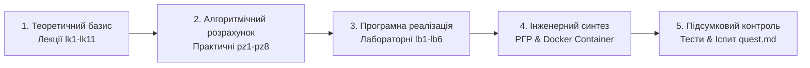

# Навчально-методичний комплекс освітнього компонента<br>«Обчислювальні процеси та штучний інтелект»

[](https://creativecommons.org/licenses/by-nc-sa/4.0/)
[](https://www.python.org/)
[](https://pytorch.org/)
[](https://developer.nvidia.com/cuda-toolkit)
[](https://squidfunk.github.io/mkdocs-material/)

---

## 1 ПРИЗНАЧЕННЯ ТА ЗАГАЛЬНИЙ ОПИС РЕПОЗИТОРІЮ

Цей репозиторій містить повний дидактичний, інженерно-методичний та програмно-практичний комплекс освітнього компонента **«Обчислювальні процеси та штучний інтелект»** для здобувачів вищої освіти першого (бакалаврського) рівня спеціальності **F7 «Комп'ютерна інженерія»** (галузь знань **F «Інформаційні технології»**).

Метою комплексу є надання здобувачам та викладачам єдиної структурованої інформаційно-освітньої платформи, яка забезпечує наскрізний цикл підготовки: від вивчення теоретичних засад високопродуктивних паралельних і розподілених обчислень (SIMD, MIMD, CUDA, MPI) та аналізу масштабованості алгоритмів до практичної розробки, оптимізації, контейнеризації та профілювання сучасних моделей машинного й глибокого навчання (XGBoost, CNN, LSTM, Transformers, Deep Reinforcement Learning у середовищі MuJoCo).

Освітній компонент розрахований на **5 кредитів ECTS (150 годин)** і викладається у 3-му семестрі (2-й рік навчання). Форма підсумкового контролю — **іспит**. Навчальним планом передбачено виконання індивідуального завдання у формі **Розрахунково-графічної роботи (РГР)**.

---

## 2 АРХІТЕКТУРА ТА СТРУКТУРА МАТЕРІАЛІВ

Матеріали навчального комплексу розподілені за функціональними модулями та подані у форматі Markdown (`.md`), що забезпечує їхню кросплатформову сумісність, зручність версіонування та інтеграцію з генератором статичних сайтів **MkDocs Material**:

```text
.
├── .github/
│   └── workflows/
│       └── deploy.yml          # CI/CD конвеєр автоматичного деплою MkDocs на GitHub Pages
├── docs/                       # Головна директорія матеріалів освітнього компонента
│   ├── javascripts/
│   │   └── mathjax.js          # Конфігурація MathJax 3 для рендерингу LaTeX-формул
│   ├── lb/                     # Методичні вказівки до лабораторних робіт (ЛБ 1 – ЛБ 6)
│   │   ├── lb1.md              # ЛБ 1 Дослідження паралелізму та CUDA-прискорення (PyTorch / CUDA)
│   │   ├── lb2.md              # ЛБ 2 Розробка розподіленої системи обробки даних (MPI / mpi4py)
│   │   ├── lb3.md              # ЛБ 3 Побудова та оптимізація моделей класичного ML й ансамблів (XGBoost / Optuna)
│   │   ├── lb4.md              # ЛБ 4 Глибока згорткова нейронна мережа для аналізу зображень (CNN)
│   │   ├── lb5.md              # ЛБ 5 Рекурентна мережа LSTM з механізмом уваги (Attention)
│   │   └── lb6.md              # ЛБ 6 Автономний агент Deep Q-Network у середовищі MuJoCo / Gymnasium
│   ├── lk/                     # Конспекти лекцій за змістовими модулями (Теми 1 – 11)
│   │   ├── lk1.md              # Тема 1 Архітектури високопродуктивних обчислень та класифікація Флінна
│   │   ├── lk2.md              # Тема 2 Багатопотоковість, SIMD-векторизація та апаратне прискорення ШІ
│   │   ├── lk3.md              # Тема 3 Розподілені обчислювальні процеси та інтерфейс MPI
│   │   ├── lk4.md              # Тема 4 Паралельна обробка великих масивів даних у розподілених пайплайнах
│   │   ├── lk5.md              # Тема 5 Моделювання обчислювальних процесів у часі та просторі станів
│   │   ├── lk6.md              # Тема 6 Машинне навчання: концепції, оптимізація та регуляризація
│   │   ├── lk7.md              # Тема 7 Ансамблеві методи машинного навчання (Random Forest, XGBoost)
│   │   ├── lk8.md              # Тема 8 Глибокі нейронні мережі (DNN) та математика навчання
│   │   ├── lk9.md              # Тема 9 Згорткові нейронні мережі у завданнях перцепції (CNN)
│   │   ├── lk10.md             # Тема 10 Рекурентні мережі та архітектура Transformer
│   │   └── lk11.md             # Тема 11 Навчання з підкріпленням та автономні агенти (RL)
│   ├── pz/                     # Методичні вказівки до практичних занять (ПЗ 1 – ПЗ 8)
│   │   ├── pz1.md              # ПЗ 1 Оцінювання масштабованості за законами Амдала та Густафсона-Барсіса
│   │   ├── pz2.md              # ПЗ 2 Проєктування тензорних операцій та векторизованої алгебри
│   │   ├── pz3.md              # ПЗ 3 Проєктування комунікаційних схем MPI для AI-вузлів
│   │   ├── pz4.md              # ПЗ 4 Постановка задач ML, Loss-функції та стохастичний градієнтний спуск
│   │   ├── pz5.md              # ПЗ 5 Обчислення та аналіз ансамблевих моделей (Bias-Variance Tradeoff)
│   │   ├── pz6.md              # ПЗ 6 Математичний розрахунок згорткових шарів та Receptive Field
│   │   ├── pz7.md              # ПЗ 7 Вентильні механізми LSTM/GRU та розрахунок Self-Attention
│   │   └── pz8.md              # ПЗ 8 Формалізація MDP, рівняння Белмана та оновлення Q-значень
│   ├── rg/                     # Розрахунково-графічна робота (РГР)
            └── index.md            # Методичні вказівки щодо виконання, структури та захисту РГР
    ├── sr/                     # Самостійна робота здобувачів та підсумковий контроль
    │   ├── index.md            # Методичні вказівки щодо організації самостійної роботи (СР)
    │   └── quest.md            # Банк контрольних питань та екзаменаційних білетів
    ├── stylesheets/
    │   └── extra.css           # Кастомні стилі для MkDocs Material (Light/Slate theme)
    └── index.md                # Головна сторінка порталу (Робоча навчальна програма / Силабус)
├── hooks/
│   └── gfm_fixer.py            # Python-скрипт попередньої обробки розмітки Markdown (MkDocs hook)
├── LICENSE                     # Ліцензійні умови CC BY-NC-SA 4.0
├── mkdocs.yml                  # Головний конфігураційний файл MkDocs
└── README.md                   # Опис репозиторію та інструкції з розгортання
```

---

## 3 СКРІЗНИЙ ТЕХНОЛОГІЧНИЙ СТЕК

У процесі виконання лабораторних, практичних робіт та розрахунково-графічного проєкту здобувачі опановують інструментарій, що відповідає сучасним вимогам до HPC / AI Engineer, MLOps та Embedded AI розробників:

| Категорія | Використовуване програмне забезпечення та інструменти |
| :--- | :--- |
| **Мова програмування та середовища** | Python (v3.11+), JupyterLab / Jupyter Notebook, Bash, Anaconda / `venv` |
| **Паралельні та тензорні обчислення** | NVIDIA CUDA Toolkit (v11.8 / v12.1), Tensor Cores, Automatic Mixed Precision (`torch.cuda.amp`), `NumPy` (v1.24+) |
| **Фреймворки глибокого навчання** | PyTorch (v2.1+), Torchvision, Torchaudio, PyTorch Distributed (DDP / FSDP) |
| **Розподілені обчислення (MIMD)** | OpenMPI / MS-MPI, обгортка `mpi4py` (v3.1+), Ring-Allreduce |
| **Класичне ML, ансамблі та оптимізація** | Scikit-Learn (v1.3+), XGBoost (v2.0+), LightGBM (v4.0+), Optuna (TPE Sampler) |
| **Навчання з підкріпленням (RL) & Simulation** | Gymnasium (v0.29+), MuJoCo Physics Engine |
| **Комп'ютерний зір та аналітика** | OpenCV (v4.8+), Pillow, Pandas (v2.0+), Matplotlib (v3.7+), Seaborn, Tabulate |
| **Контейнеризація & Документація** | Docker Engine, Docker Compose, NVIDIA Container Toolkit, MkDocs Material, MathJax 3 |

---

## 4 КРОКОВИЙ ГАЙД З РОЗГОРТАННЯ ЛОКАЛЬНОГО РОБОЧОГО СЕРЕДОВИЩА

Для виконання всіх практичних та лабораторних завдань освітнього компонента здобувачу необхідно налаштувати базовий інструментальний стек на локальному комп'ютері.

### Крок 1. Налаштування середовища Python та віртуального оточення
1. Переконайтеся, що встановили **Python 3.11+**:
   ```bash
   python3 --version
   ```
2. Створіть та активуйте віртуальне середовище у корені вашого проєкту:
   ```bash
   python3 -m venv venv
   source venv/bin/activate        # Linux / macOS
   # venv\Scripts\activate         # Windows (PowerShell)
   ```
3. Оновіть менеджер пакетів `pip`:
   ```bash
   pip install --upgrade pip
   ```

### Крок 2. Встановлення PyTorch з підтримкою GPU (CUDA)
Встановіть відповідну збірку **PyTorch** залежно від наявності дискретного графічного прискорювача NVIDIA:
* **З підтримкою GPU (CUDA 11.8 / 12.1):**
  ```bash
  pip install torch torchvision torchaudio --index-url https://download.pytorch.org/whl/cu118
  ```
* **Для обчислень на CPU:**
  ```bash
  pip install torch torchvision torchaudio
  ```
* Перевірте доступність прискорення у терміналі:
  ```bash
  python -c "import torch; print('CUDA Available:', torch.cuda.is_available()); print('Device Name:', torch.cuda.get_device_name(0) if torch.cuda.is_available() else 'CPU')"
  ```

### Крок 3. Налаштування розподіленого середовища MPI
1. **Linux (Ubuntu/Debian):** Встановіть системні бінарники OpenMPI та розробницькі бібліотеки:
   ```bash
   sudo apt-get update
   sudo apt-get install -y openmpi-bin libopenmpi-dev
   ```
2. **Windows:** Завантажте та встановіть [Microsoft MPI (MS-MPI)](https://learn.microsoft.com/en-us/message-passing-interface/microsoft-mpi).
3. Встановіть Python-обгортку `mpi4py` та перевірте запуск 4 паралельних процесів:
   ```bash
   pip install mpi4py
   mpirun -n 4 python -c "from mpi4py import MPI; print(f'Rank {MPI.COMM_WORLD.Get_rank()} of {MPI.COMM_WORLD.Get_size()}')"
   ```

### Крок 4. Встановлення ML/RL пакетів та симулятора MuJoCo
Встановіть пакет аналітичних та симуляційних бібліотек:
```bash
pip install scikit-learn xgboost lightgbm optuna gymnasium mujoco opencv-python pandas matplotlib seaborn tabulate
```

### Крок 5. Налаштування Docker та NVIDIA Container Toolkit (для РГР)
1. Встановіть **Docker Desktop** з офіційного сайту [docker.com](https://www.docker.com/).
2. Для прокидання GPU-прискорювача у контейнери на Linux встановіть [NVIDIA Container Toolkit](https://docs.nvidia.com/datacenter/cloud-native/container-toolkit/latest/install-guide.html).
3. Перевірте роботу контейнеризації:
   ```bash
   docker -v
   docker run --rm --gpus all nvidia/cuda:11.8.0-base-ubuntu22.04 nvidia-smi
   ```

### Крок 6. Локальний запуск документаційного порталу MkDocs
Для перегляду конспектів лекцій, лабораторних інструкцій та практичних занять у вигляді локального веб-порталу:
1. Встановіть генератор `mkdocs-material`:
   ```bash
   pip install mkdocs-material
   ```
2. Запустіть локальний розробницький сервер:
   ```bash
   mkdocs serve
   ```
3. Відкрийте у браузері адресу: `http://127.0.0.1:8000/`.

---

## 5 МЕТОДИЧНІ РЕКОМЕНДАЦІЇ ЩОДО ТРАЄКТОРІЇ НАВЧАННЯ

Для досягнення максимальної ефективності опанування освітнього компонента здобувачам рекомендується дотримуватися такої послідовної траєкторії:



1. **Опрацювання теоретичного базису.** Ознайомлення з темами лекцій (`lk1.md` – `lk11.md`) та опрацювання питань для самостійної роботи (`sr/index.md`).
2. **Алгоритмічний та аналітичний розрахунок.** Виконання практичних занять (`pz1.md` – `pz8.md`), аналітичний розрахунок законів Амдала/Густафсона-Барсіса, геометричних параметрів CNN (Receptive Field) та рівнянь оптимуму Белмана.
3. **Програмно-апаратна реалізація.** Виконання лабораторних робіт (`lb1.md` – `lb6.md`) у середовищах PyTorch CUDA, mpi4py, XGBoost, Optuna та Gymnasium / MuJoCo.
4. **Виконання розрахунково-графічної роботи (РГР).** Комплексна системна розробка розподіленого ШІ-агента реального часу з його обов'язковою Docker-контейнеризацією та профілюванням інференсу (`rg/index.md`).
5. **Підсумковий контроль.** Самоперевірка за банком тестових запитань та розв'язання практичних екзаменаційних білетів (`sr/quest.md`).

---

## 6 АКАДЕМІЧНА ДОБРОЧЕСНІСТЬ ТА ПРАВИЛА ВИКОРИСТАННЯ

* Усі програмні рішення, C++/CUDA ядра, скрипти Python та конфігураційні маніфести Docker Compose, подані у матеріалах комплексу, є навчально-демонстраційними шаблонами.
* Здобувачі вищої освіти зобов'язані виконувати індивідуальні варіанти завдань **самостійно**.
* Виявлення фактів текстового або програмного плагіату, несанкціонованого копіювання чужих розрахунків чи графічних матеріалів призводить до скасування результатів оцінювання відповідного заходу контролю відповідно до Положення про академічну доброчесність ЗВО.
* Матеріали комплексу поширюються за ліцензією **Creative Commons Attribution-NonCommercial-ShareAlike 4.0 International (CC BY-NC-SA 4.0)**.

---

## 7 КОНТАКТНА ІНФОРМАЦІЯ ТА ПІДДРИМКА

* **Навчальний заклад:** Кременчуцький національний університет імені Михайла Остроградського (КрНУ)
* **Кафедра:** Комп'ютерної інженерії та електроніки (КІЕ)
* **Освітня програма:** «Комп'ютерна інженерія» (Бакалавр)
* **Автор та розробник курсу:** [Вадурін Кирило Олегович](https://cee.kdu.edu.ua/uk/vadurin-kyrylo-olehovych)