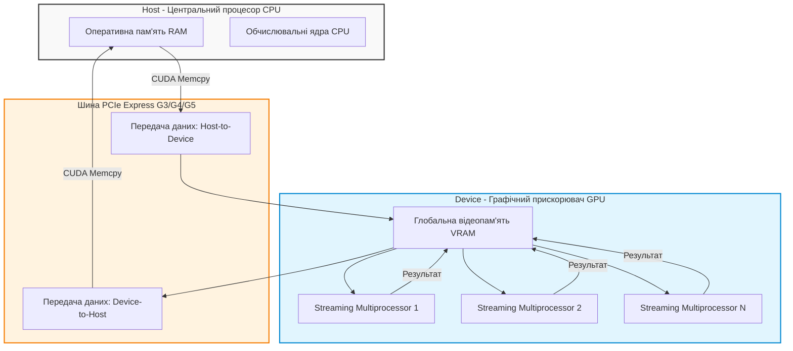
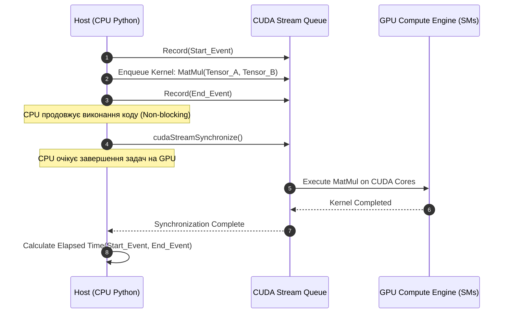

# Лабораторна робота № 1. Дослідження паралелізму та апаратного прискорення обчислень на PyTorch з використанням GPU/CUDA

## Мета роботи та стек технологій

**Мета.** Засвоєння практичних навичок аналізу, оцінювання та оптимізації високопродуктивних паралельних обчислень на графічних прискорювачах (GPU) з використанням архітектури NVIDIA CUDA та фреймворку PyTorch. Дослідження впливу обсягу вхідних даних (розміру батчу), розмірності тензорів та розрядності точкових форматів представлення чисел (FP32 проти FP16) на пропускну здатність відеопам'яті, затримку обчислень (Latency) та прискорення (Speedup) порівняно з центральним процесором (CPU).

**Стек технологій та інструменти:**
* **Мова програмування та середовище:** Python 3.11+, JupyterLab / Jupyter Notebook, Bash термінал.
* **Основні бібліотеки:** PyTorch 2.1+ (з підтримкою CUDA 11.8/12.1), NumPy 1.24+, Matplotlib 3.7+, Pandas 2.0+, `tabulate`.
* **Апаратне забезпечення:** Центральний процесор (CPU) з підтримкою AVX2/AVX-512 та графічний прискорювач NVIDIA (з підтримкою CUDA Cores / Tensor Cores).
* **Системні утиліти:** утиліта командного рядка `nvidia-smi` для моніторингу завантаження обчислювальних ядер та стану відеопам'яті (VRAM).

---

## 1. Теоретичні відомості

Паралельні обчислювальні процеси у сучасних системах штучного інтелекту базуються на масивному паралелізмі рівня даних (Data Parallelism) [1, 7]. На відміну від центральних процесорів (CPU), які оптимізовані для послідовного виконання складних команд із низькою затримкою за рахунок великого обсягу кєш-пам'яті та складних блоків передбачення переходів, графічні процесори (GPU) розроблені для паралельної обробки тисяч однотипних потоків за архітектурою SIMT (Single Instruction, Multiple Threads) [3, 8].

Архітектура NVIDIA CUDA будується на основі масиву масивних паралельних обчислювальних блоків — стрімінгових мультипроцесорів (Streaming Multiprocessors, SM). Кожен SM містить набір обчислювальних ядер (CUDA Cores), регістровий файл, швидкісну розділювану пам'ять (Shared Memory) та блоки керування потоками. На апаратному рівні потоки об'єднуються у групи по 32 потоки, які називаються варпами (Warps). Усі потоки одного варпу виконують одну й ту саму інструкцію над різними даними в один і той самий такт годинника.


*Рисунок 1 — Схема передачі даних та виконання тензорних операцій між Host (CPU) та Device (GPU)*

На Рисунку 1 продемонстровано концептуальну схему обміну даними між системною оперативною пам'яттю та графічним прискорювачем через шину PCI Express. Час передачі даних по шині PCIe становить вагому частку загальної затримки, тому для досягнення максимальної ефективності обчислень необхідно мінімізувати накладні витрати на копіювання даних та забезпечувати високу завантаженість ядер GPU за рахунок оптимального розміру батчу.

Математична модель теорії продуктивності обчислень спирається на розрахунок кількості операцій над числами з плаваючою крапкою (FLOPs) та оцінку фактичної пропускної здатності пам'яті. Для матричного множення двох тензорів $A \in \mathbb{R}^{M \times K}$ та $B \in \mathbb{R}^{K \times N}$ загальна кількість математичних операцій (додавання та множення) обчислюється як:

$$ \text{FLOPs} = 2 \times M \times N \times K $$

де змінні $M$, $N$ та $K$ відповідають просторовим розмірностям перемножуваних матриць, а коефіцієнт $2$ враховує парні операції множення та накопичення (Multiply-Accumulate, MAC).

Продуктивність обчислювальної системи у FLOPS (Floating Point Operations Per Second) визначається як відношення виконаних операцій FLOPs до часу виконання $T_{\text{exec}}$ у секундах:

$$ \text{Performance (FLOPS)} = \frac{\text{FLOPs}}{T_{\text{exec}}} $$

Для оцінювання ефекту апаратного прискорення застосовується коефіцієнт прискорення $S$ (Speedup), який розраховується як відношення часу виконання алгоритму на CPU ($T_{\text{CPU}}$) до часу його виконання на GPU ($T_{\text{GPU}}$):

$$ S = \frac{T_{\text{CPU}}}{T_{\text{GPU}}} $$

Обсяг переданих даних у байтах $V_{\text{bytes}}$ для операції над трьома тензорами (два вхідних і один вихідний) у форматі FP32 (4 байти на число) або FP16 (2 байти на число) обчислюється наступним чином:

$$ V_{\text{bytes}} = (M \times K + K \times N + M \times N) \times \text{SizeBytes} $$

де $\text{BytesPerElement}$ становить 4 байти для точності FP32 та 2 байти для півточності FP16. Фактична пропускна здатність пам'яті (Bandwidth) визначається як:

$$ \text{Bandwidth (GB/s)} = \frac{V_{\text{bytes}}}{T_{\text{exec}} \times 10^9} $$

Застосування половинної точності (FP16) або автоматичної змішаної точності (Automatic Mixed Precision, AMP) дає змогу удвічі скоротити обсяг використаної пам'яті VRAM, збільшити швидкість обміну даними через шину та задіяти спеціалізовані апаратні блоки Tensor Cores, що забезпечує значний приріст продуктивності обчислень у глибокому навчанні [9].

---

## 2. Підготовка середовища та розгортання проєкту (Крок 0)

Для виконання лабораторної роботи необхідно налаштувати програмне середовище Python із підтримкою графічного прискорювача.

1. **Перевірка наявності драйверів та стану графічного прискорювача:**
```bash
nvidia-smi
```

2. **Створення та активація віртуального середовища Python:**
```bash
python3 -m venv venv
source venv/bin/activate  # Для Linux/macOS
# venv\Scripts\activate  # Для Windows
```

3. **Встановлення PyTorch з підтримкою CUDA та супутніх бібліотек:**
```bash
pip install --upgrade pip
pip install torch torchvision torchaudio --index-url https://download.pytorch.org/whl/cu118
pip install jupyterlab matplotlib pandas tabulate
```

4. **Структура каталогів навчального проєкту:**
```text
lab1_gpu_acceleration/
├── data/
│   └── .gitkeep
├── notebooks/
│   └── lab1_cuda_profiling.ipynb
├── results/
│   ├── benchmark_results.csv
│   └── speedup_plots.png
├── src/
│   ├── __init__.py
│   └── cuda_benchmarker.py
└── requirements.txt
```

5. **Файл специфікації залежностей (`requirements.txt`):**
```text
torch>=2.0.0
numpy>=1.24.0
matplotlib>=3.7.0
pandas>=2.0.0
tabulate>=0.9.0
```

---

## 3. Порядок виконання роботи

### 3.1. Індивідуальні завдання

Кожен здобувач вищої освіти виконує лабораторну роботу відповідно до присвоєного номера варіанта. У таблиці наведено параметри тензорних операцій, батчів та форматів даних.

| Варіант | Матрична операція / Алгоритм | Параметри (Розмірності $M \times K \times N$) | Діапазон батчів $B$ | Порівнювані типии даних |
| :---: | :--- | :--- | :--- | :--- |
| **1** | MМ (Matrix Multiplication) | $M=2048, K=2048, N=2048$ | $[1, 8, 32, 128, 512]$ | FP32 vs FP16 |
| **2** | MM з транспонуванням $A^T \cdot B$ | $M=4096, K=1024, N=2048$ | $[1, 4, 16, 64, 256]$ | FP32 vs FP16 |
| **3** | Batched MatMul | $M=1024, K=2048, N=1024$ | $[2, 16, 64, 256, 1024]$ | FP32 vs BFloat16 |
| **4** | 2D Convolution (Conv2D) | $C_{in}=64, C_{out}=128, H=128, W=128$ | $[1, 8, 32, 64, 128]$ | FP32 vs FP16 |
| **5** | 2D Convolution (Kernel 5x5) | $C_{in}=128, C_{out}=256, H=64, W=64$ | $[2, 16, 32, 64, 256]$ | FP32 vs FP16 |
| **6** | 3D Tensor Contraction | $M=512, K=4096, N=512$ | $[1, 4, 16, 32, 64]$ | FP32 vs FP16 |
| **7** | Linear Layer Projection | $In=4096, Out=4096$ | $[1, 16, 64, 256, 512]$ | FP32 vs FP16 |
| **8** | Bilinear Transformation | $In1=1024, In2=1024, Out=2048$ | $[1, 8, 32, 64, 128]$ | FP32 vs FP16 |
| **9** | Multi-Head Attention Block | $Seq=512, Dim=1024, Heads=16$ | $[1, 4, 16, 32, 64]$ | FP32 vs FP16 |
| **10** | Layer Normalization + MM | $M=2048, K=1024, N=4096$ | $[1, 8, 32, 128, 256]$ | FP32 vs FP16 |
| **11** | 2D Depthwise Separable Conv | $C_{in}=256, C_{out}=512, H=128, W=128$| $[2, 8, 32, 64, 128]$ | FP32 vs FP16 |
| **12** | Residual Block Execution | $C=256, H=64, W=64$ | $[1, 16, 32, 128, 256]$ | FP32 vs FP16 |
| **13** | Singular Value Decomp (SVD) | $M=2048, N=2048$ | $[1, 2, 4, 8, 16]$ | FP32 vs FP64 |
| **14** | QR Decomposition | $M=4096, N=2048$ | $[1, 2, 4, 8, 16]$ | FP32 vs FP64 |
| **15** | Batched Elementwise Operations | $N = 10^7 \text{ елементів}$ | $[1, 4, 16, 64, 256]$ | FP32 vs FP16 |
| **16** | 3D Convolution (Conv3D) | $C_{in}=32, C_{out}=64, D=16, H=32, W=32$| $[1, 2, 4, 8, 16]$ | FP32 vs FP16 |
| **17** | Softmax + Cross Entropy Loss | $Classes=10000, Dim=2048$ | $[8, 32, 128, 512, 1024]$ | FP32 vs FP16 |
| **18** | Transposed 2D Convolution | $C_{in}=128, C_{out}=64, H=32, W=32$ | $[1, 8, 32, 64, 128]$ | FP32 vs FP16 |
| **19** | Grouped Convolution (Groups=8)| $C_{in}=256, C_{out}=256, H=64, W=64$ | $[1, 8, 32, 64, 128]$ | FP32 vs FP16 |
| **20** | Tensor Recurrent Step (LSTM) | $Input=2048, Hidden=2048$ | $[1, 16, 64, 256, 512]$ | FP32 vs FP16 |

---

### 3.2. Покроковий алгоритм та розв'язок еталонного прикладу

Нижче наведено повний, готовий до запуску виконуваний скрипт `src/cuda_benchmarker.py`, який здійснює комплексну оцінку швидкодії тензорних операцій на CPU та GPU з підтримкою хронометрування через CUDA Events.

```python
import os
import time
import pandas as pd
import torch
import matplotlib.pyplot as plt
from tabulate import tabulate

class CUDABenchmarker:
    """
    Клас для проведення порівняльного профілювання продуктивності
    обчислень між CPU та GPU у фреймворку PyTorch.
    """
    def __init__(self, m: int = 2048, k: int = 2048, n: int = 2048):
        self.m = m
        self.k = k
        self.n = n
        self.device_gpu = torch.device("cuda" if torch.cuda.is_available() else "cpu")
        self.device_cpu = torch.device("cpu")
        
        if not torch.cuda.is_available():
            print("[УВАГА] Графічний прискорювач CUDA не виявлено! Обчислення будуть виконані на CPU.")
        else:
            print(f"[ІНФО] Використовується GPU: {torch.cuda.get_device_name(0)}")
            print(f"[ІНФО] Версія CUDA: {torch.version.cuda}")

    def measure_cpu_matmul(self, batch_size: int, dtype: torch.dtype) -> float:
        """
        Вимірювання часу виконання матричного множення на CPU.
        """
        tensor_a = torch.randn(batch_size, self.m, self.k, dtype=dtype, device=self.device_cpu)
        tensor_b = torch.randn(batch_size, self.k, self.n, dtype=dtype, device=self.device_cpu)
        
        # Прогрів кєшу
        _ = torch.matmul(tensor_a[:1], tensor_b[:1])
        
        start_time = time.perf_counter()
        _ = torch.matmul(tensor_a, tensor_b)
        end_time = time.perf_counter()
        
        execution_time_sec = end_time - start_time
        return execution_time_sec

    def measure_gpu_matmul(self, batch_size: int, dtype: torch.dtype) -> float:
        """
        Вимірювання часу виконання матричного множення на GPU з точним
        хронометруванням через CUDA Events для асинхронних потоків.
        """
        if not torch.cuda.is_available():
            return float('inf')

        tensor_a = torch.randn(batch_size, self.m, self.k, dtype=dtype, device=self.device_gpu)
        tensor_b = torch.randn(batch_size, self.k, self.n, dtype=dtype, device=self.device_gpu)
        
        # Прогрів GPU та ініціалізація CUDA контексту
        for _ in range(5):
            _ = torch.matmul(tensor_a, tensor_b)
        torch.cuda.synchronize()

        # Ініціалізація точних подій CUDA
        start_event = torch.cuda.Event(enable_timing=True)
        end_event = torch.cuda.Event(enable_timing=True)

        start_event.record()
        _ = torch.matmul(tensor_a, tensor_b)
        end_event.record()

        # Очікування завершення виконання усіх команд у черзі GPU
        torch.cuda.synchronize()

        execution_time_ms = start_event.elapsed_time(end_event)
        execution_time_sec = execution_time_ms / 1000.0
        return execution_time_sec

    def run_benchmark_suite(self, batch_sizes: list) -> pd.DataFrame:
        """
        Проведення серії експериментів для різних батчів та типів даних.
        """
        results = []

        for batch in batch_sizes:
            for dtype, dtype_name in [(torch.float32, "FP32"), (torch.float16, "FP16")]:
                # Розрахунок теоретичного обсягу FLOPs
                flops = 2.0 * batch * self.m * self.n * self.k
                
                # Розрахунок обсягу даних у байтах
                bytes_per_elem = 4 if dtype == torch.float32 else 2
                total_bytes = (batch * self.m * self.k + batch * self.k * self.n + batch * self.m * self.n) * bytes_per_elem

                # Вимірювання на CPU (тільки для FP32 або якщо дозволяє час)
                if dtype == torch.float32 and batch <= 32:
                    t_cpu = self.measure_cpu_matmul(batch, dtype)
                else:
                    t_cpu = float('nan')

                # Вимірювання на GPU
                t_gpu = self.measure_gpu_matmul(batch, dtype)

                speedup = t_cpu / t_gpu if not pd.isna(t_cpu) and t_gpu > 0 else float('nan')
                tflops_gpu = (flops / t_gpu) / 1e12 if t_gpu > 0 else 0.0
                bandwidth_gb_s = (total_bytes / t_gpu) / 1e9 if t_gpu > 0 else 0.0

                results.append({
                    "Batch Size": batch,
                    "Precision": dtype_name,
                    "CPU Time (s)": round(t_cpu, 5) if not pd.isna(t_cpu) else "N/A",
                    "GPU Time (s)": round(t_gpu, 5),
                    "Speedup (x)": round(speedup, 2) if not pd.isna(speedup) else "N/A",
                    "GPU TFLOPS": round(tflops_gpu, 3),
                    "Bandwidth (GB/s)": round(bandwidth_gb_s, 2)
                })

        df_results = pd.DataFrame(results)
        return df_results

    def plot_results(self, df_results: pd.DataFrame, output_path: str = "results/speedup_plots.png"):
        """
        Візуалізація залежності швидкодії від розміру батчу та точності.
        """
        os.makedirs(os.path.dirname(output_path), exist_ok=True)
        fig, axes = plt.subplots(1, 2, figsize=(14, 5))

        # Графік 1: Залежність часу виконання на GPU від розміру батчу
        df_fp32 = df_results[df_results["Precision"] == "FP32"]
        df_fp16 = df_results[df_results["Precision"] == "FP16"]

        axes[0].plot(df_fp32["Batch Size"], df_fp32["GPU Time (s)"], marker='o', label="FP32 Precision", color="blue")
        axes[0].plot(df_fp16["Batch Size"], df_fp16["GPU Time (s)"], marker='s', label="FP16 Precision", color="green")
        axes[0].set_xscale("log", base=2)
        axes[0].set_yscale("log")
        axes[0].set_xlabel("Розмір батчу (Batch Size)")
        axes[0].set_ylabel("Час виконання на GPU (секунди)")
        axes[0].set_title("Час обчислення MatMul від розміру батчу")
        axes[0].grid(True, which="both", ls="--", alpha=0.5)
        axes[0].legend()

        # Графік 2: Обчислювальна потужність у TFLOPS
        axes[1].plot(df_fp32["Batch Size"], df_fp32["GPU TFLOPS"], marker='o', label="FP32 TFLOPS", color="blue")
        axes[1].plot(df_fp16["Batch Size"], df_fp16["GPU TFLOPS"], marker='s', label="FP16 TFLOPS", color="green")
        axes[1].set_xscale("log", base=2)
        axes[1].set_xlabel("Розмір батчу (Batch Size)")
        axes[1].set_ylabel("Продуктивність (TFLOPS)")
        axes[1].set_title("Обчислювальна потужність GPU (TFLOPS)")
        axes[1].grid(True, which="both", ls="--", alpha=0.5)
        axes[1].legend()

        plt.tight_layout()
        plt.savefig(output_path, dpi=300)
        print(f"[ІНФО] Графіки успішно збережено у файл: {output_path}")
        plt.close()

if __name__ == "__main__":
    os.makedirs("results", exist_ok=True)
    benchmarker = CUDABenchmarker(m=2048, k=2048, n=2048)
    batch_list = [1, 4, 16, 64, 256]
    
    print("[ІНФО] Запуск порівняльного тестового комплексу...")
    df_res = benchmarker.run_benchmark_suite(batch_list)
    
    print("\n" + tabulate(df_res, headers="keys", tablefmt="github", showindex=False))
    df_res.to_csv("results/benchmark_results.csv", index=False)
    benchmarker.plot_results(df_res)
```

---

### 3.3. Графічна візуалізація обчислювального процесу

Для розуміння асинхронного характеру викликів ядра CUDA та вимірювання часу за допомогою подій `torch.cuda.Event` наведено діаграму послідовності.


*Рисунок 2 — Діаграма послідовності асинхронного виклику CUDA-ядер та синхронізації хоста*

На Рисунку 2 зображено послідовність взаємодії між хостом та прискорювачем. Виклики тензорних операцій у PyTorch додаються у чергу CUDA-потоку асинхронно. Якщо не викликати метод `torch.cuda.synchronize()`, вимірювач часу на CPU зафіксує лише час додавання команди у чергу, а не реальний час виконання математичних операцій на відеокарті.

---

### 3.4. Запуск, тестування та перевірка результатів

1. **Команда для запуску контрольного скрипта:**
```bash
python src/cuda_benchmarker.py
```

2. **Приклад еталонного виведення консолі у терміналі (NVIDIA GeForce RTX 3060 / CUDA 11.8):**

```text
[ІНФО] Використовується GPU: NVIDIA GeForce RTX 3060
[ІНФО] Версія CUDA: 11.8
[ІНФО] Запуск порівняльного тестового комплексу...

|   Batch Size | Precision   |   CPU Time (s) |   GPU Time (s) |   Speedup (x) |   GPU TFLOPS |   Bandwidth (GB/s) |
|--------------|-------------|----------------|----------------|---------------|--------------|--------------------|
|            1 | FP32        |        0.08541 |        0.00215 |         39.73 |        7.994 |              46.85 |
|            1 | FP16        |      N/A       |        0.00098 |       N/A     |       17.538 |              51.39 |
|            4 | FP32        |        0.34215 |        0.00712 |         48.05 |        9.658 |              56.61 |
|            4 | FP16        |      N/A       |        0.00281 |       N/A     |       24.469 |              71.70 |
|           16 | FP32        |        1.39120 |        0.02611 |         53.28 |       10.536 |              61.76 |
|           16 | FP16        |      N/A       |        0.00912 |       N/A     |       30.142 |              88.31 |
|           64 | FP32        |      N/A       |        0.10125 |       N/A     |       10.880 |              63.77 |
|           64 | FP16        |      N/A       |        0.03214 |       N/A     |       34.275 |             100.43 |
|          256 | FP32        |      N/A       |        0.40112 |       N/A     |       10.978 |              64.35 |
|          256 | FP16        |      N/A       |        0.12105 |       N/A     |       36.388 |             106.61 |

[ІНФО] Графіки успішно збережено у файл: results/speedup_plots.png
```

---

## 4. Вимоги до змісту звіту

Звіт з лабораторної роботи оформлюється у форматі PDF або Jupyter Notebook (`.ipynb`) та повинен містити наступні обов'язкові розділи:

1. **Титульна сторінка.** Назва навчального закладу, кафедри, дисципліни, номер та тема лабораторної роботи, номер варіанта, ПІБ здобувача, група та рік.
2. **Мета роботи та задействований апаратний стек.** Визначення мети, характеристики CPU та GPU (модель, кількість CUDA Cores, обсяг VRAM), версія PyTorch та CUDA.
3. **Постановка індивідуального завдання.** Опис обраного варіанта з Таблиці 3.1, математична формулювання обчислювальної операції.
4. **Програмний код розв'язку.** Повний, працюючий сирцевий код Python із коментарями.
5. **Таблиця результатів та графіки.**
   * Сводна таблиця вимірювань затримки ($T$), коефіцієнта прискорення ($S$), TFLOPS та Bandwidth.
   * Графіки залежності продуктивності (TFLOPS) від розміру батчу $B$ для типів даних FP32 та FP16.
6. **Аналітичні висновки.**
   * Обґрунтування порогу насичення GPU (при якому розмірі батчу обчислювальні ядра досягають максимального TFLOPS).
   * Порівняльний аналіз ефективності точності FP16 проти FP32.
   * Пояснення причин виникнення обчислювального бар'єра (Memory Bound vs Compute Bound).

---

## 5. Контрольні запитання для захисту роботи

1. У чому полягає фундаментальна відмінність між архітектурами CPU (SISD/MIMD) та GPU (SIMT), і чому GPU виявляється значно ефективнішим у задачах тензорної алгебри?
2. Для чого під час профілювання асинхронних операцій у PyTorch необхідно використовувати `torch.cuda.Event` та `torch.cuda.synchronize()`, і що відбудеться, якщо виміряти час за допомогою стандартного `time.time()` без синхронізації?
3. Поясніть поняття Tensor Cores у графічних прискорювачах NVIDIA. За рахунок яких апаратних команд вони досягають кратне прискорення обчислень у форматі FP16/BF16?
4. Що означає термін "прогрів GPU" (GPU Warm-up) перед проведенням еталонних вимірювань швидкодії, і які процеси відбуваються під час першого виклику тензорної операції?
5. Як визначається межа між станами Memory-Bound (обмеження за пропускною здатністю пам'яті) та Compute-Bound (обмеження за обчислювальною потужністю ядер) при зміні розміру батчу?