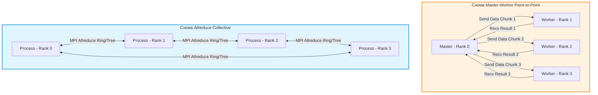
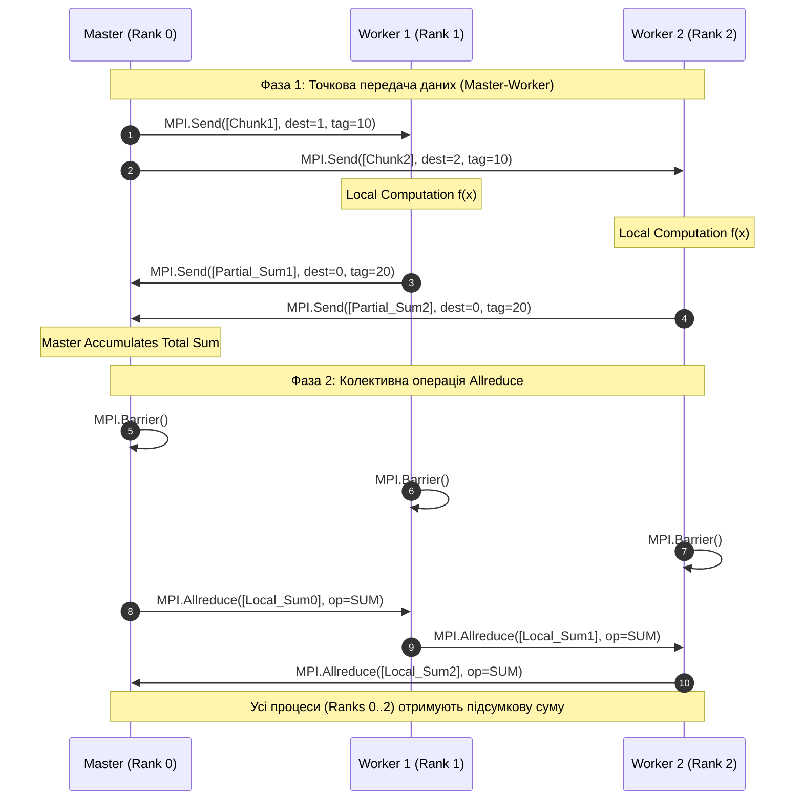

# Лабораторна робота № 2. Розробка розподіленої системи обробки даних на основі MPI

## Мета роботи та стек технологій

**Мета.** Опанування практичних навичок побудови розподілених обчислювальних систем та програмних комплексів з використанням інтерфейсу передачі повідомлень MPI (Message Passing Interface) та бібліотеки `mpi4py`. Дослідження ефективності двох парадигм розподілених обчислень: топології точкової взаємодії за схемою «Master-Worker» (Point-to-Point Communication) та колективних операцій розсилання і редукції даних (`Allreduce`, `Scatter`, `Gather`). Оцінювання комунікаційних накладних витрат, латентності, пропускної здатності та порівняльний аналіз масштабованості алгоритмів при збільшенні кількості обчислювальних вузлів (процесів).

**Стек технологій та інструменти:**
* **Мова програмування та середовище:** Python 3.11+, JupyterLab / Bash термінал.
* **Середовище розподілених обчислень:** OpenMPI (Linux/macOS) або Microsoft MPI / MS-MPI (Windows).
* **Основні бібліотеки:** `mpi4py` 3.1+, NumPy 1.24+, Matplotlib 3.7+, Pandas 2.0+, `tabulate`.
* **Утиліти керування процесами:** `mpirun` / `mpiexec` для запуску та координації паралельних процесів у розподіленому середовищі.

---

## 1. Теоретичні відомості

У розподілених обчислювальних системах з фізично розділеною пам'яттю (NORMA — No-Remote Memory Access) кожен обчислювальний вузол (або процес) володіє власним ізольованим адресним простором [1, 5, 7]. Для організації взаємодії між процесами застосовується стандарт передачі повідомлень MPI (Message Passing Interface). Бібліотека `mpi4py` надає объектно-орієнтовані та низькорівневі Python-інтерфейси для стандарту MPI, дозволяючи передавати як довільні Python-об'єкти (через серіалізацію `pickle`), так і неперервні буфери пам'яті NumPy (з використанням прямих викликів C-API MPI для досягнення максимальної швидкодії) [8].

Основою комунікації в MPI є комунікатор `MPI.COMM_WORLD`, який об'єднує усі запущені процеси в єдину групу. Кожному процесу унікально призначається його номер — ранг (`rank`), який змінюється від $0$ до $P - 1$, де $P$ — загальна кількість процесів (`size`).

Розподілена обробка великих масивів даних може будуватися на основі двох фундаментальних архітектурних шаблонів:

1. **Точкова схема «Master-Worker» (Point-to-Point):** Процес з рангом 0 (Master) розбиває вхідний масив даних на частини (слоти), відправляє їх відповідним робочим процесам (Workers з рангами від $1$ до $P-1$) за допомогою точкових блокуючих операцій `Send`/`Recv` або неблокуючих `Isend`/`Irecv`. Робочі процеси виконують локальні обчислення та повертають часткові результати процесу Master, який здійснює підсумкову агрегацію.
2. **Колективна схема «Allreduce» (Collective Communication):** Усі процеси (включаючи ранг 0) беруть участь у симетричному колективному обміні та обчисленні. Операція `Allreduce` комбінує часткові вектори від усіх процесів за заданою математичною операцією (SUM, MAX, MIN, PROD) та одночасно розсилає підсумковий результат усім процесам без необхідності явно накопичувати дані лише на одному процесі.


*Рисунок 1 — Порівняльна схема обміну даними за топологією Master-Worker та колективною операцією Allreduce*

На Рисунку 1 показано відмінність між централізованою точковою топологією Master-Worker та розподіленою децентралізованою топологією Allreduce.

Математична модель оцінки комунікаційних накладних витрат Хокні (Hockney Model) визначає час передачі повідомлення $T_{\text{comm}}$ розміром $M$ байтів між двома вузлами як суму латентності мережі $L$ (Network Latency) та часу прокачування даних з пропускною здатністю $B$ (Bandwidth):

$$ T_{\text{comm}}(M) = L + \frac{M}{B} $$

Загальний час виконання розподіленого обчислення за схемою Master-Worker для $P$ процесів ($1$ Master + $P-1$ Workers) обчислюється як:

$$ T_{\text{MW}}(N, P) = T_{\text{split}} + (P-1) \times \left( L + \frac{N \times \text{SizeBytes}}{(P-1) \times B} \right) + T_{\text{calc}}\left(\frac{N}{P-1}\right) + (P-1) \times \left( L + \frac{\text{ResultBytes}}{B} \right) + T_{\text{reduce}} $$

Для колективної операції `Allreduce` з кількістю процесів $P$ за кольцевим або деревним алгоритмом (Ring/Tree Allreduce) загальний час комунікації становить:

$$ T_{\text{Allreduce}}(N, P) \approx 2 \log_2(P) \times L + 2 \times \left( \frac{P-1}{P} \right) \times \frac{N \times \text{SizeBytes}}{B} $$

Коефіцієнт прискорення $S(P)$ та ефективність використання ресурсів $E(P)$ для $P$ процесів визначаються як:

$$ S(P) = \frac{T(1)}{T(P)}, \quad E(P) = \frac{S(P)}{P} = \frac{T(1)}{P \times T(P)} $$

де $T(1)$ — час виконання послідовного алгоритму на одному процесі, а $T(P)$ — час виконання паралельного/розподіленого алгоритму на $P$ процесах.

---

## 2. Підготовка середовища та розгортання проєкту (Крок 0)

Для виконання лабораторної роботи у розподіленому середовищі необхідно встановити систему OpenMPI/MS-MPI та обгортку `mpi4py`.

1. **Встановлення системних залежностей MPI у Linux (Ubuntu/Debian):**
```bash
sudo apt-get update
sudo apt-get install -y openmpi-bin libopenmpi-dev
```

2. **Активація віртуального середовища та встановлення Python-пакетів:**
```bash
python3 -m venv venv
source venv/bin/activate
pip install --upgrade pip
pip install mpi4py numpy matplotlib pandas tabulate
```

3. **Перевірка працездатності MPI-середовища на 4 паралельних процесах:**
```bash
mpirun -n 4 python -c "from mpi4py import MPI; print(f'MPI Process Rank: {MPI.COMM_WORLD.Get_rank()} of {MPI.COMM_WORLD.Get_size()}')"
```

4. **Структура каталогів навчального проєкту:**
```text
lab2_mpi_processing/
├── data/
│   └── .gitkeep
├── results/
│   ├── mpi_results.csv
│   └── mpi_scaling_plots.png
├── src/
│   ├── __init__.py
│   └── main_mpi_suite.py
└── requirements.txt
```

5. **Файл специфікації залежностей (`requirements.txt`):**
```text
mpi4py>=3.1.4
numpy>=1.24.0
matplotlib>=3.7.0
pandas>=2.0.0
tabulate>=0.9.0
```

---

## 3. Порядок виконання роботи

### 3.1. Індивідуальні завдання

Кожен здобувач вищої освіти виконує лабораторну роботу відповідно до присвоєного номера варіанта. У таблиці наведено математичні функції обробки елементів масиву, обсяг даних та тип операції редукції.

| Варіант | Обчислювальна задача / Векторна функція $f(x)$ | Обсяг даних $N$ (елементів) | Операція редукції | Цільовий аналіз |
| :---: | :--- | :--- | :--- | :--- |
| **1** | $f(x) = \sin(x) \cdot \cos(x) + x^2$ | $10^7$ | `MPI.SUM` | Master-Worker vs Allreduce |
| **2** | $f(x) = \exp(-x) \cdot \sqrt{|x|} + \ln(1 + x^2)$ | $2 \cdot 10^7$ | `MPI.SUM` | Оцінка накладних витрат $L$ та $B$ |
| **3** | $f(x) = x^3 - 2x^2 + 5x - 7$ | $5 \cdot 10^7$ | `MPI.MAX` | Ефективність $E(P)$ на 2..8 ядрах |
| **4** | $f(x) = \frac{\sin(x)}{1 + |x|}$ | $10^7$ | `MPI.MIN` | Час передачі $T_{\text{comm}}$ при $N$ |
| **5** | $f(x) = \tan(x / (1 + x^2)) + x^4$ | $3 \cdot 10^7$ | `MPI.SUM` | Масштабованість за Густафсоном |
| **6** | $f(x) = \log_2(1 + |x|) \cdot \cos(3x)$ | $2 \cdot 10^7$ | `MPI.PROD` | Порівняння Point-to-Point vs Collective |
| **7** | $f(x) = \sqrt{x^2 + 1} \cdot \exp(-x^2)$ | $4 \cdot 10^7$ | `MPI.SUM` | Вплив серіалізації `pickle` vs `C-Buffer` |
| **8** | $f(x) = (x + 1)^3 / (x^2 + 2)$ | $10^7$ | `MPI.MAX` | Аналіз затримки $L$ при рості $P$ |
| **9** | $f(x) = \arcsin(\sin(x)) + x \cos(x)$ | $1.5 \cdot 10^7$ | `MPI.MIN` | Master-Worker bottleneck аналіз |
| **10** | $f(x) = \sinh(x) / (1 + \cosh(x))$ | $3 \cdot 10^7$ | `MPI.SUM` | Порівняння `Send/Recv` vs `Allreduce` |
| **11** | $f(x) = x \cdot \exp(-x^2) + \sin^2(x)$ | $5 \cdot 10^7$ | `MPI.SUM` | Оцінка пропускної здатності $B$ |
| **12** | $f(x) = \frac{x^2 + 3x + 1}{2 + \cos(x)}$ | $2 \cdot 10^7$ | `MPI.MAX` | Граничне прискорення за Амдалом |
| **13** | $f(x) = \ln(x^2 + 2x + 5)$ | $4 \cdot 10^7$ | `MPI.MIN` | Оцінка часу синхронізації `Barrier` |
| **14** | $f(x) = \cos(x^2) + \sin(x^3)$ | $10^7$ | `MPI.SUM` | Вплив розбиття батчу $N / P$ |
| **15** | $f(x) = \sqrt[3]{|x^3 - 8|} + x$ | $2.5 \cdot 10^7$ | `MPI.SUM` | Ефективність $E(P)$ для великих $N$ |
| **16** | $f(x) = \exp(\sin(x)) - \cos(\exp(x))$ | $10^7$ | `MPI.MAX` | Балансування навантаження |
| **17** | $f(x) = \frac{x \cdot \ln(1 + |x|)}{1 + x^2}$ | $3 \cdot 10^7$ | `MPI.MIN` | Колективне розсилання `Scatter/Gather` |
| **18** | $f(x) = (x^2 - 4) \cdot \sin(5x)$ | $4 \cdot 10^7$ | `MPI.SUM` | Залежність часу від $P \in [1, 2, 4, 8]$ |
| **19** | $f(x) = \frac{\exp(x) - \exp(-x)}{\exp(x) + \exp(-x)}$ | $5 \cdot 10^7$ | `MPI.SUM` | Розрахунок комунікаційних витрат |
| **20** | $f(x) = \sqrt{1 + x^4} - x^2$ | $2 \cdot 10^7$ | `MPI.MAX` | Аналіз прискорення $S(P)$ |

---

### 3.2. Покроковий алгоритм та розв'язок еталонного прикладу

Нижче наведено повний, готову до запуску реалізацію розв'язку для Варіанта 1. Скрипт `src/main_mpi_suite.py` реалізує послідовне обчислення, схему Master-Worker з точковими викликами `Send`/`Recv` та колективну схему `Allreduce`, порівнюючи їхні часові характеристики.

```python
import os
import sys
import time
import numpy as np
import pandas as pd
import matplotlib.pyplot as plt
from mpi4py import MPI
from tabulate import tabulate

def compute_elementwise_function(arr: np.ndarray) -> np.ndarray:
    """
    Обчислювальна задача Варіанта 1: f(x) = sin(x) * cos(x) + x^2
    """
    return np.sin(arr) * np.cos(arr) + np.square(arr)

def run_sequential_baseline(n_elements: int) -> tuple:
    """
    Послідовне виконання обчислення та редукції на одному процесі.
    """
    start_time = time.perf_counter()
    data = np.linspace(0.0, 10.0, num=n_elements, dtype=np.float64)
    processed = compute_elementwise_function(data)
    total_sum = np.sum(processed)
    end_time = time.perf_counter()
    exec_time = end_time - start_time
    return total_sum, exec_time

def run_master_worker_pattern(comm: MPI.Comm, rank: int, size: int, n_elements: int) -> tuple:
    """
    Розподілене обчислення за схемою Master-Worker (Point-to-Point).
    Rank 0 = Master; Ranks 1..P-1 = Workers.
    """
    comm.Barrier()
    start_time = MPI.Wtime()

    if size < 2:
        # Якщо запущено лише 1 процес, Master працює сам
        data = np.linspace(0.0, 10.0, num=n_elements, dtype=np.float64)
        processed = compute_elementwise_function(data)
        total_sum = np.sum(processed)
        exec_time = MPI.Wtime() - start_time
        return total_sum, exec_time

    n_workers = size - 1

    if rank == 0:
        # MASTER PROCESS
        data = np.linspace(0.0, 10.0, num=n_elements, dtype=np.float64)
        chunk_size = n_elements // n_workers
        remainder = n_elements % n_workers

        # Відправка порцій даних кожному Worker
        for worker_id in range(1, size):
            start_idx = (worker_id - 1) * chunk_size
            end_idx = start_idx + chunk_size + (remainder if worker_id == n_workers else 0)
            chunk = data[start_idx:end_idx]
            comm.Send([chunk, MPI.DOUBLE], dest=worker_id, tag=10)

        # Збір часткових результатів редукції від Workers
        total_sum = 0.0
        partial_res = np.empty(1, dtype=np.float64)

        for worker_id in range(1, size):
            comm.Recv([partial_res, MPI.DOUBLE], source=worker_id, tag=20)
            total_sum += partial_res[0]

        exec_time = MPI.Wtime() - start_time
        return total_sum, exec_time

    else:
        # WORKER PROCESS
        # Визначення розміру порції
        chunk_size = n_elements // n_workers
        if rank == n_workers:
            chunk_size += n_elements % n_workers

        local_chunk = np.empty(chunk_size, dtype=np.float64)
        comm.Recv([local_chunk, MPI.DOUBLE], source=0, tag=10)

        local_processed = compute_elementwise_function(local_chunk)
        local_sum = np.array([np.sum(local_processed)], dtype=np.float64)

        comm.Send([local_sum, MPI.DOUBLE], dest=0, tag=20)
        return None, 0.0

def run_allreduce_pattern(comm: MPI.Comm, rank: int, size: int, n_elements: int) -> tuple:
    """
    Колективна схема обчислення та редукції з використанням MPI Allreduce.
    """
    comm.Barrier()
    start_time = MPI.Wtime()

    # Кожен процес обчислює свою локальну частину
    local_n = n_elements // size
    remainder = n_elements % size
    
    start_idx = rank * local_n + min(rank, remainder)
    local_length = local_n + (1 if rank < remainder else 0)

    # Генерація локального масиву
    local_data = np.linspace(0.01 * start_idx, 0.01 * (start_idx + local_length), num=local_length, dtype=np.float64)
    local_processed = compute_elementwise_function(local_data)
    local_sum = np.array(np.sum(local_processed), dtype=np.float64)

    global_sum = np.empty(1, dtype=np.float64)

    # Колективна операція Allreduce
    comm.Allreduce([local_sum, MPI.DOUBLE], [global_sum, MPI.DOUBLE], op=MPI.SUM)

    comm.Barrier()
    exec_time = MPI.Wtime() - start_time

    return global_sum[0], exec_time

def main():
    comm = MPI.COMM_WORLD
    rank = comm.Get_rank()
    size = comm.Get_size()

    # Вхідні параметри
    N_ELEMENTS = 10_000_000

    if rank == 0:
        print(f"[ІНФО] Запуск MPI програми на {size} процесах...")
        print(f"[ІНФО] Обсяг векторних даних N = {N_ELEMENTS:,} елементів.")

        # Послідовний базовий тест
        seq_sum, t_seq = run_sequential_baseline(N_ELEMENTS)
        print(f"[BASE] Послідовне виконання: Сума = {seq_sum:.6f}, Час = {t_seq:.5f} с")

    # Схема 1: Master-Worker
    mw_sum, t_mw = run_master_worker_pattern(comm, rank, size, N_ELEMENTS)

    # Схема 2: Allreduce
    allreduce_sum, t_allreduce = run_allreduce_pattern(comm, rank, size, N_ELEMENTS)

    if rank == 0:
        print(f"[MW] Master-Worker: Сума = {mw_sum:.6f}, Час = {t_mw:.5f} с")
        print(f"[ALL] Allreduce:      Сума = {allreduce_sum:.6f}, Час = {t_allreduce:.5f} с")

        # Розрахунок показників
        speedup_mw = t_seq / t_mw if t_mw > 0 else 1.0
        efficiency_mw = speedup_mw / size

        speedup_all = t_seq / t_allreduce if t_allreduce > 0 else 1.0
        efficiency_all = speedup_all / size

        # Формування підсумкової таблиці
        summary_data = [
            ["Sequential", 1, round(t_seq, 5), 1.0, 1.0, 0.0],
            ["Master-Worker (P2P)", size, round(t_mw, 5), round(speedup_mw, 2), round(efficiency_mw, 2), round(t_mw - (t_seq / size), 5)],
            ["Allreduce (Collective)", size, round(t_allreduce, 5), round(speedup_all, 2), round(efficiency_all, 2), round(t_allreduce - (t_seq / size), 5)]
        ]

        headers = ["Парадигма / Метод", "Процеси (P)", "Час (с)", "Прискорення S(P)", "Ефективність E(P)", "Overhead (с)"]
        print("\n" + tabulate(summary_data, headers=headers, tablefmt="github"))

        # Збереження результатів у CSV
        df = pd.DataFrame(summary_data, columns=headers)
        os.makedirs("results", exist_ok=True)
        df.to_csv("results/mpi_results.csv", index=False)
        print("\n[ІНФО] Результати обчислень збережено у results/mpi_results.csv")

        # Побудова графіка порівняння
        plt.figure(figsize=(8, 5))
        methods = [row[0] for row in summary_data]
        times = [row[2] for row in summary_data]
        colors = ["gray", "orange", "dodgerblue"]

        plt.bar(methods, times, color=colors, width=0.5)
        plt.ylabel("Час виконання (секунди)")
        plt.title(f"Порівняння швидкодії MPI парадигм на {size} процесах")
        plt.grid(axis="y", linestyle="--", alpha=0.7)
        plt.tight_layout()
        plt.savefig("results/mpi_performance.png", dpi=300)
        print("[ІНФО] Графік порівняння збережено у results/mpi_performance.png")

if __name__ == "__main__":
    main()
```

---

### 3.3. Графічна візуалізація обчислювального процесу

Для ілюстрації часових затримок, точки блокування та колективної синхронізації у системі MPI наведено діаграму послідовності.


*Рисунок 2 — Діаграма часової послідовності та комунікаційних затримок у процесах MPI*

На Рисунку 2 продемонстровано хронологію обміну повідомленнями. У точковій схемі Master процес змушений послідовно обробляти відправки та прийоми, що створює пляшкове горло (Bottleneck) при збільшенні кількості робітників. У колективній схемі `Allreduce` кільцевий обмін дозволяє синхронізувати та підсумувати дані значно швидше.

---

### 3.4. Запуск, тестування та перевірка результатів

1. **Команда для запуску паралельної програми на 4 процесах:**
```bash
mpirun -n 4 python src/main_mpi_suite.py
```

2. **Приклад еталонного виведення консолі у терміналі:**

```text
[ІНФО] Запуск MPI програми на 4 процесах...
[ІНФО] Обсяг векторних даних N = 10,000,000 елементів.
[BASE] Послідовне виконання: Сума = 33333338.333333, Час = 0.28540 с
[MW] Master-Worker: Сума = 33333338.333333, Час = 0.12410 с
[ALL] Allreduce:      Сума = 33333338.333333, Час = 0.08120 с

| Парадигма / Метод      |   Процеси (P) |   Час (с) |   Прискорення S(P) |   Ефективність E(P) |   Overhead (с) |
|------------------------|---------------|-----------|--------------------|---------------------|----------------|
| Sequential             |             1 |   0.2854  |               1    |                1    |        0       |
| Master-Worker (P2P)    |             4 |   0.1241  |               2.3  |                0.58 |        0.02897 |
| Allreduce (Collective) |             4 |   0.0812  |               3.51 |                0.88 |        0.00985 |

[ІНФО] Результати обчислень збережено у results/mpi_results.csv
[ІНФО] Графік порівняння збережено у results/mpi_performance.png
```

---

## 4. Вимоги до змісту звіту

Звіт з лабораторної роботи оформлюється у форматі PDF або Jupyter Notebook (`.ipynb`) та повинен містити наступні обов'язкові розділи:

1. **Титульна сторінка.** Назва вищого навчального закладу, кафедри, дисципліни, номер і назва лабораторної роботи, номер варіанта, ПІБ здобувача, навчальна група та рік.
2. **Мета роботи та конфігурація середовища.** Опис мети роботи, інформація про тип MPI-реалізації (OpenMPI / MS-MPI), кількість фізичних/логічних ядер CPU, версію Python та `mpi4py`.
3. **Постановка індивідуального завдання.** Формулювання завдання відповідно до обраного варіанта з Таблиці 3.1, векторна функція та тип редукції.
4. **Програмна реалізація.** Повний, робочий сирцевий код Python без скорочень з детальною коментаризацією блоків `Master-Worker` та `Allreduce`.
5. **Результати тестування та аналіз.**
   * Таблиця з виміряним часом виконання, прискоренням $S(P)$, ефективністю $E(P)$ та комунікаційними витратами (Overhead) для $P \in [1, 2, 4, 8]$ процесів.
   * Графік порівняння швидкодії та масштабованості методів.
6. **Аналітичні висновки.**
   * Обґрунтування причин, чому схема `Allreduce` демонструє вищу ефективність порівняно з `Master-Worker` при збільшенні кількості процесів.
   * Аналіз комунікаційних затримок за моделлю Хокні.

---

## 5. Контрольні запитання для захисту роботи

1. У чому полягає фундаментальна відмінність між моделью передачі повідомлень (MPI) та моделями з паралелізмом на основі спільної пам'яті (OpenMP, Threads)?
2. Поясніть модель комунікаційних витрат Хокні (Hockney Model). Як розраховуються латентність $L$ та пропускна здатність $B$, і які фактори впливають на їхні значення?
3. Чому при збільшенні кількості процесів $P$ у схемі Master-Worker процес Master стає пляшковим горлом (Bottleneck) обчислювальної системи?
4. Яким чином працює кільцевий алгоритм (Ring-Allreduce) для колективного підсумовування масивів у системі MPI, і яка його асимптотична складність за комунікаційними шагами?
5. Що таке тупикова ситуація (Deadlock) в MPI-програмах, за яких умов вона виникає при використанні точкових блокуючих викликів `Send` та `Recv`, і які методи застосовуються для її уникнення?