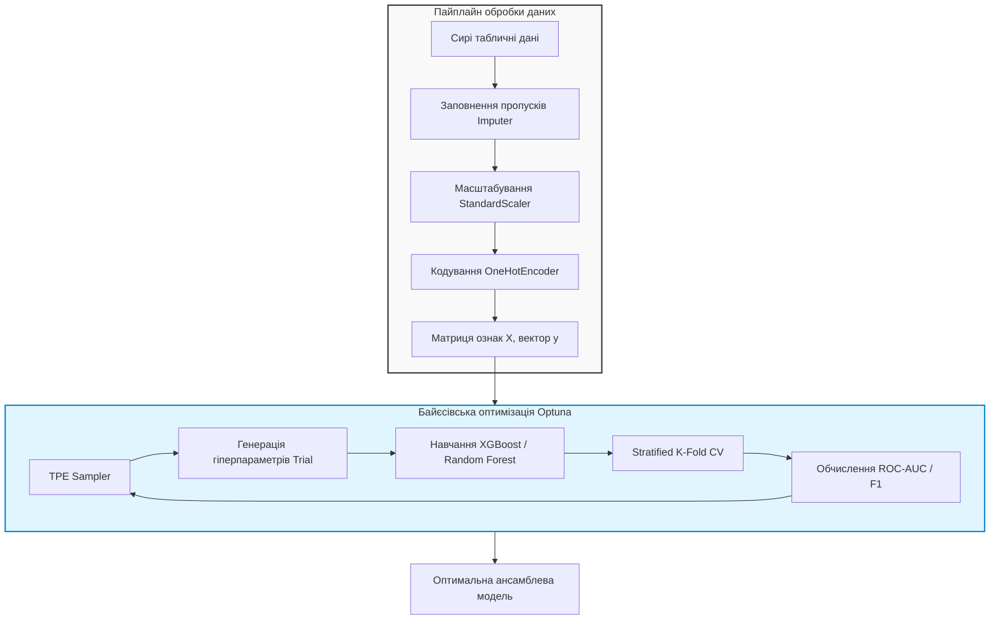
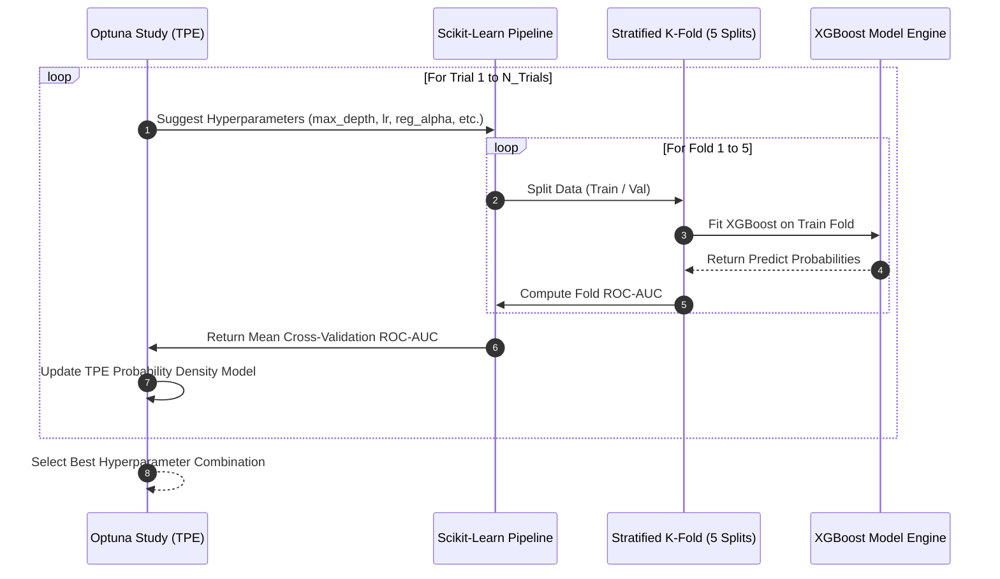

# Лабораторна робота № 3. Побудова та оптимізація моделей класичного машинного навчання й ансамблів

## Мета роботи та стек технологій

**Мета.** Опанування практичних навичок проєктування скрізних конвеєрів обробки структурованих даних (Data Preprocessing), інженерії ознак (Feature Engineering), а також побудови, оцінювання та оптимізації складних ансамблевих моделей машинного навчання на основі беґінгу (Random Forest) та градієнтного бустингу (XGBoost, LightGBM). Набуття досвіду автоматизованого підбору гіперпараметрів моделей за допомогою фреймворку байєсівської оптимізації Optuna з використанням алгоритму Tree-structured Parzen Estimator (TPE).

**Стек технологій та інструменти:**
* **Мова програмування та середовище:** Python 3.11+, JupyterLab / Bash термінал.
* **Основні бібліотеки машинного навчання:** `scikit-learn` 1.3+, `xgboost` 2.0+, `lightgbm` 4.0+, `optuna` 3.3+.
* **Обробка та візуалізація даних:** `pandas` 2.0+, `numpy` 1.24+, `matplotlib` 3.7+, `seaborn` 0.12+, `tabulate`.

---

## 1. Теоретичні відомості

У класичному машинному навчанні якість роботи моделей над структурованими (табличними) даними значною мірою залежить від правильності проведення попередньої обробки (Data Preprocessing) та обраного алгоритму ансамблювання [6, 7].

Конвеєр попередньої обробки даних включає три ключові етапи:
1. **Заповнення пропусків (Imputation).** Заміна відсутніх значень середнім або медіаною для числових ознак та найчастішим значенням (Mode) для категоріальних.
2. **Масштабування (Scaling).** Нормалізація числових атрибутів за допомогою `StandardScaler` або `RobustScaler` для вирівнювання масштабів.
3. **Кодування категоріальних ознак (Categorical Encoding).** Перетворення текстових категорій у числовий формат через `OneHotEncoder` (для непорядкових атрибутів) або `OrdinalEncoder` (для впорядкованих).

Для побудови високоточних класифікаторів та регресорів застосовуються два основних класи ансамблевих методів [7, 9]:

### Беґінг (Bootstrap Aggregating — Random Forest)
Random Forest будує $B$ незалежних дерев рішень $T_b(x)$, кожне з яких навчається на випадковій бутстреп-вибірці вхідного набору даних з додатковим випадковим вибором підмножини ознак при кожному розщепленні вузла. Остаточне передбачення ансамблю обчислюється шляхом усереднення (для регресії) або голосування за більшістю (для класифікації):

$$ \hat{y}_{\text{RF}}(x) = \frac{1}{B} \sum_{b=1}^{B} T_b(x) $$

де $B$ — кількість дерев в ансамблі, а $T_b(x)$ — передбачення $b$-го окремого дерева рішень. Беґінг суттєво знижує дисперсію (Variance) моделі без збільшення її зсуву (Bias).

### Градієнтний бустинг (Gradient Boosting — XGBoost / LightGBM)
На відміну від беґінгу, градієнтний бустинг будує дерева послідовно. Кожне наступне дерево $f_t(x)$ навчається на усунення помилок (псевдозалишків градієнта) попередніх $t-1$ дерев. Цільова функція оптимізації XGBoost на кроці $t$ має вигляд:

$$ \mathcal{L}^{(t)} = \sum_{i=1}^{N} l\left(y_i, \hat{y}_i^{(t-1)} + f_t(x_i)\right) + \Omega(f_t) $$

де $l$ — диференційовна функція втрат (Loss Function), а $\Omega(f_t)$ — член регуляризації, який стримує складність дерева:

$$ \Omega(f_t) = \gamma T + \frac{1}{2}\lambda \sum_{j=1}^{T} w_j^2 $$

де $T$ — кількість листків у дереві, $w_j$ — вага $j$-го листка, $\gamma$ та $\lambda$ — коефіцієнти регуляризації.

Розклавши функцію втрат у ряд Тейлора другого порядку, отримуємо спрощену форму для швидкого знаходження оптимальних ваг листків:

$$ \mathcal{L}^{(t)} \approx \sum_{i=1}^{N} \left[ l(y_i, \hat{y}_i^{(t-1)}) + g_i f_t(x_i) + \frac{1}{2} h_i f_t^2(x_i) \right] + \Omega(f_t) $$

де $g_i = \frac{\partial l(y_i, \hat{y}^{(t-1)})}{\partial \hat{y}^{(t-1)}}$ — градієнт першого порядку, а $h_i = \frac{\partial^2 l(y_i, \hat{y}^{(t-1)})}{\partial (\hat{y}^{(t-1)})^2}$ — гессіан (похідна другого порядку).


*Рисунок 1 — Схема конвеєра обробки даних, генерації ознак та байєсівської оптимізації гіперпараметрів за допомогою Optuna*

На Рисунку 1 показано взаємодію конвеєра підготовки даних та ітеративного циклу пошуку Optuna, який застосовує Tree-structured Parzen Estimator (TPE) для побудови ймовірнісної моделі розподілу якісних гіперпараметрів.

---

## 2. Підготовка середовища та розгортання проєкту (Крок 0)

1. **Створення та активація віртуального середовища:**
```bash
python3 -m venv venv
source venv/bin/activate
```

2. **Встановлення необхідних бібліотек:**
```bash
pip install --upgrade pip
pip install scikit-learn xgboost lightgbm optuna pandas numpy matplotlib seaborn tabulate
```

3. **Перевірка версій встановлених пакетів:**
```bash
python -c "import sklearn, xgboost, lightgbm, optuna; print(f'Sklearn: {sklearn.__version__}, XGBoost: {xgboost.__version__}, LightGBM: {lightgbm.__version__}, Optuna: {optuna.__version__}')"
```

4. **Структура каталогів навчального проєкту:**
```text
lab3_ensemble_ml/
├── data/
│   └── .gitkeep
├── results/
│   ├── benchmark_ml_results.csv
│   ├── feature_importance.png
│   └── roc_curves.png
├── src/
│   ├── __init__.py
│   └── optuna_tuner.py
└── requirements.txt
```

5. **Файл специфікації залежностей (`requirements.txt`):**
```text
scikit-learn>=1.3.0
xgboost>=2.0.0
lightgbm>=4.0.0
optuna>=3.3.0
pandas>=2.0.0
numpy>=1.24.0
matplotlib>=3.7.0
seaborn>=0.12.0
tabulate>=0.9.0
```

---

## 3. Порядок виконання роботи

### 3.1. Індивідуальні завдання

Кожен здобувач вищої освіти виконує лабораторну роботу відповідно до присвоєного номера варіанта. У таблиці наведено предметну область, цільову метрику та порівнювані алгоритми.

| Варіант | Домен / Тип задачі | Розмірність ($N \times M$) | Цільова метрика | Порівнювані алгоритми |
| :---: | :--- | :--- | :--- | :--- |
| **1** | Скоринг банківських кредитів | $20000 \times 25$ | ROC-AUC | Random Forest, XGBoost, LightGBM |
| **2** | Прогноз відтоку клієнтів (Churn) | $15000 \times 30$ | F1-Score | Decision Tree, Random Forest, XGBoost |
| **3** | Виявлення транзакційного шахрайства | $30000 \times 40$ | PR-AUC (Average Precision) | Random Forest, XGBoost, ExtraTrees |
| **4** | Оцінка ризику відмови обладнання | $12000 \times 20$ | ROC-AUC | Random Forest, LightGBM, CatBoost |
| **5** | Класифікація медичних діагнозів | $10000 \times 35$ | F1-Macro | Random Forest, XGBoost, LightGBM |
| **6** | Прогнозування запізнення рейсів | $25000 \times 22$ | ROC-AUC | Decision Tree, XGBoost, LightGBM |
| **7** | Оцінка ефективності таргетованої реклами| $18000 \times 28$ | Accuracy | Random Forest, XGBoost, LightGBM |
| **8** | Класифікація типів кібератак у мережі | $35000 \times 45$ | F1-Weighted | Random Forest, ExtraTrees, XGBoost |
| **9** | Оцінка кредитного дефолту підприємств | $14000 \times 32$ | ROC-AUC | Decision Tree, Random Forest, XGBoost |
| **10** | Прогноз реакції пацієнта на ліки | $8000 \times 50$ | ROC-AUC | Random Forest, XGBoost, LightGBM |
| **11** | Виявлення страхового шахрайства | $16000 \times 24$ | PR-AUC | ExtraTrees, XGBoost, LightGBM |
| **12** | Класифікація аномалій сенсорних мереж | $22000 \times 38$ | F1-Score | Random Forest, XGBoost, LightGBM |
| **13** | Прогнозування плинності кадрів (HR) | $11000 \times 18$ | ROC-AUC | Decision Tree, Random Forest, XGBoost |
| **14** | Оцінка платоспроможності позичальників | $28000 \times 30$ | ROC-AUC | Random Forest, XGBoost, LightGBM |
| **15** | Детекція ботнет-трафіку у IoT | $40000 \times 42$ | Accuracy | ExtraTrees, XGBoost, LightGBM |
| **16** | Скоринг нерухомості (Категорії цін) | $15000 \times 26$ | F1-Macro | Random Forest, XGBoost, LightGBM |
| **17** | Оцінка ймовірності повторного візиту | $19000 \times 22$ | ROC-AUC | Decision Tree, Random Forest, LightGBM |
| **18** | Класифікація ступеня ризику страхування | $21000 \times 34$ | ROC-AUC | Random Forest, XGBoost, LightGBM |
| **19** | Детекція спам-повідомлень (NLP Features)| $25000 \times 60$ | F1-Score | Random Forest, XGBoost, LightGBM |
| **20** | Прогноз виконання виробничого плану | $13000 \times 20$ | Accuracy | Decision Tree, ExtraTrees, XGBoost |

---

### 3.2. Покроковий алгоритм та розв'язок еталонного прикладу

Нижче наведено повний виконуваний скрипт `src/optuna_tuner.py` для Варіанта 1. Код виконує генерацію синтетичного датасету з пропусками та категоріальними ознаками, будує `ColumnTransformer` пайплайн, проводить крос-валідацію базових моделей та запускає студію Optuna для підбору оптимальних гіперпараметрів XGBoost.

```python
import os
import warnings
import numpy as np
import pandas as pd
import matplotlib.pyplot as plt
import seaborn as sns
import optuna

from sklearn.datasets import make_classification
from sklearn.model_selection import StratifiedKFold, cross_val_score
from sklearn.compose import ColumnTransformer
from sklearn.pipeline import Pipeline
from sklearn.impute import SimpleImputer
from sklearn.preprocessing import StandardScaler, OneHotEncoder
from sklearn.metrics import roc_auc_score, f1_score, accuracy_score, roc_curve
from sklearn.ensemble import RandomForestClassifier
from sklearn.tree import DecisionTreeClassifier
from xgboost import XGBClassifier
from lightgbm import LGBMClassifier
from tabulate import tabulate

warnings.filterwarnings("ignore")
optuna.logging.set_verbosity(optuna.logging.WARNING)

def generate_synthetic_dataset(n_samples=20000, n_features=25, seed=42) -> pd.DataFrame:
    """
    Генерація синтетичного датасету кредитного скорингу з числовими,
    категоріальними ознаками та пропусками.
    """
    np.random.seed(seed)
    X_raw, y_raw = make_classification(
        n_samples=n_samples,
        n_features=n_features,
        n_informative=18,
        n_redundant=5,
        n_clusters_per_class=2,
        weights=[0.8, 0.2],  # Дисбаланс класів 80% / 20%
        random_state=seed
    )

    feature_names = [f"num_feat_{i}" for i in range(n_features - 3)]
    df = pd.DataFrame(X_raw[:, :-3], columns=feature_names)

    # Додавання категоріальних ознак
    df["cat_credit_history"] = np.random.choice(["good", "fair", "bad"], size=n_samples, p=[0.5, 0.3, 0.2])
    df["cat_employment"] = np.random.choice(["employed", "self_employed", "unemployed"], size=n_samples)
    df["cat_home_ownership"] = np.random.choice(["own", "rent", "mortgage"], size=n_samples)

    # Внесення штучних пропусків (Missing Values ~ 5%)
    for col in df.columns[:10]:
        mask = np.random.rand(n_samples) < 0.05
        df.loc[mask, col] = np.nan

    df["target"] = y_raw
    return df

def build_preprocessing_pipeline(df: pd.DataFrame):
    """
    Створення Scikit-Learn ColumnTransformer для числового та категоріального кодування.
    """
    num_features = df.select_dtypes(include=[np.number]).columns.drop("target").tolist()
    cat_features = df.select_dtypes(include=["object", "category"]).columns.tolist()

    num_transformer = Pipeline(steps=[
        ("imputer", SimpleImputer(strategy="median")),
        ("scaler", StandardScaler())
    ])

    cat_transformer = Pipeline(steps=[
        ("imputer", SimpleImputer(strategy="most_frequent")),
        ("encoder", OneHotEncoder(handle_unknown="ignore", sparse_output=False))
    ])

    preprocessor = ColumnTransformer(transformers=[
        ("num", num_transformer, num_features),
        ("cat", cat_transformer, cat_features)
    ])

    return preprocessor, num_features, cat_features

def evaluate_baseline_models(X, y, preprocessor, cv):
    """
    Оцінювання базових моделей машинного навчання з дефолтними гіперпараметрами.
    """
    models = {
        "Decision Tree": DecisionTreeClassifier(random_state=42),
        "Random Forest": RandomForestClassifier(n_estimators=100, random_state=42, n_jobs=-1),
        "XGBoost (Default)": XGBClassifier(n_estimators=100, random_state=42, eval_metric="logloss", n_jobs=-1),
        "LightGBM (Default)": LGBMClassifier(n_estimators=100, random_state=42, verbosity=-1, n_jobs=-1)
    }

    baseline_results = []

    for name, model in models.items():
        pipeline = Pipeline(steps=[
            ("preprocessor", preprocessor),
            ("classifier", model)
        ])

        scores = cross_val_score(pipeline, X, y, cv=cv, scoring="roc_auc", n_jobs=-1)
        baseline_results.append({
            "Model": name,
            "Mean ROC-AUC": round(np.mean(scores), 5),
            "Std ROC-AUC": round(np.std(scores), 5)
        })

    return pd.DataFrame(baseline_results)

def optimize_xgboost_with_optuna(X, y, preprocessor, cv, n_trials=20):
    """
    Оптимізація гіперпараметрів XGBoost за допомогою фреймворку Optuna (TPE Sampler).
    """
    def objective(trial):
        params = {
            "n_estimators": trial.suggest_int("n_estimators", 50, 300, step=50),
            "max_depth": trial.suggest_int("max_depth", 3, 10),
            "learning_rate": trial.suggest_float("learning_rate", 0.01, 0.2, log=True),
            "subsample": trial.suggest_float("subsample", 0.6, 1.0),
            "colsample_bytree": trial.suggest_float("colsample_bytree", 0.6, 1.0),
            "reg_alpha": trial.suggest_float("reg_alpha", 1e-3, 10.0, log=True),
            "reg_lambda": trial.suggest_float("reg_lambda", 1e-3, 10.0, log=True),
            "random_state": 42,
            "eval_metric": "logloss",
            "n_jobs": -1
        }

        model = XGBClassifier(**params)
        pipeline = Pipeline(steps=[
            ("preprocessor", preprocessor),
            ("classifier", model)
        ])

        scores = cross_val_score(pipeline, X, y, cv=cv, scoring="roc_auc", n_jobs=-1)
        return np.mean(scores)

    study = optuna.create_study(direction="maximize", sampler=optuna.samplers.TPESampler(seed=42))
    study.optimize(objective, n_trials=n_trials)

    return study

def main():
    os.makedirs("results", exist_ok=True)
    print("[ІНФО] Генерація синтетичного датасету кредитного скорингу...")
    df = generate_synthetic_dataset(n_samples=20000, n_features=25)

    X = df.drop("target", axis=1)
    y = df["target"]

    preprocessor, num_cols, cat_cols = build_preprocessing_pipeline(df)
    cv = StratifiedKFold(n_splits=5, shuffle=True, random_state=42)

    print("[ІНФО] Порівняння базових моделей машинного навчання...")
    df_baseline = evaluate_baseline_models(X, y, preprocessor, cv)
    print("\n" + tabulate(df_baseline, headers="keys", tablefmt="github", showindex=False))

    print(f"\n[ІНФО] Запуск байєсівської оптимізації Optuna (20 Trials) для XGBoost...")
    study = optimize_xgboost_with_optuna(X, y, preprocessor, cv, n_trials=20)

    print(f"[УСПІХ] Найкращий результат ROC-AUC: {study.best_value:.5f}")
    print("[ІНФО] Оптимальні гіперпараметри:")
    for param_name, param_val in study.best_params.items():
        print(f"  -- {param_name}: {param_val}")

    # Побудова фінальної оптимізованої моделі
    best_params = study.best_params
    best_params["random_state"] = 42
    best_params["eval_metric"] = "logloss"

    best_xgb = XGBClassifier(**best_params)
    final_pipeline = Pipeline(steps=[
        ("preprocessor", preprocessor),
        ("classifier", best_xgb)
    ])

    final_scores = cross_val_score(final_pipeline, X, y, cv=cv, scoring="roc_auc", n_jobs=-1)
    
    # Сводна таблиця результатів
    summary = df_baseline.to_dict(orient="records")
    summary.append({
        "Model": "XGBoost (Optuna Tuned)",
        "Mean ROC-AUC": round(np.mean(final_scores), 5),
        "Std ROC-AUC": round(np.std(final_scores), 5)
    })

    df_summary = pd.DataFrame(summary)
    print("\n" + tabulate(df_summary, headers="keys", tablefmt="github", showindex=False))
    df_summary.to_csv("results/benchmark_ml_results.csv", index=False)

    # Навчання на всій вибірці для отриманні Feature Importance
    final_pipeline.fit(X, y)
    
    # Отримання назв ознак після OneHotEncoder
    ohe_feature_names = final_pipeline.named_steps["preprocessor"] \
                                      .named_transformers_["cat"] \
                                      .named_steps["encoder"] \
                                      .get_feature_names_out(cat_cols).tolist()
    all_feature_names = num_cols + ohe_feature_names

    importances = final_pipeline.named_steps["classifier"].feature_importances_
    feat_df = pd.DataFrame({"Feature": all_feature_names, "Importance": importances})
    feat_df = feat_df.sort_values(by="Importance", ascending=False).head(15)

    # Побудова графіка Важливості Ознак
    plt.figure(figsize=(10, 6))
    sns.barplot(data=feat_df, x="Importance", y="Feature", palette="viridis")
    plt.title("Топ-15 найважливіших ознак моделі XGBoost (Optuna Tuned)")
    plt.xlabel("Оцінка важливості (Gain / Feature Importance)")
    plt.ylabel("Назва ознаки")
    plt.tight_layout()
    plt.savefig("results/feature_importance.png", dpi=300)
    print("\n[ІНФО] Графік важливості ознак збережено у results/feature_importance.png")

if __name__ == "__main__":
    main()
```

---

### 3.3. Графічна візуалізація обчислювального процесу

Для ілюстрації процедури байєсівського підбору гіперпараметрів та оцінювання кожної ітерації через Stratified K-Fold крос-валідацію наведено діаграму послідовності.


*Рисунок 2 — Діаграма послідовності ітеративного пошуку Optuna з використанням Stratified K-Fold крос-валідації*

На Рисунку 2 продемонстровано взаємодію оптимізатора Optuna із підсистемою крос-валідації. Алгоритм TPE на кожній ітерації аналізує попередні випробування та будує дві щільності ймовірностей: $l(x)$ для успішних значень гіперпараметрів та $g(x)$ для решти, обираючи нові точки у зонах з максимальним відношенням $l(x)/g(x)$.

---

### 3.4. Запуск, тестування та перевірка результатів

1. **Команда для запуску проєкту:**
```bash
python src/optuna_tuner.py
```

2. **Приклад еталонного виведення консолі у терміналі:**

```text
[ІНФО] Генерація синтетичного датасету кредитного скорингу...
[ІНФО] Порівняння базових моделей машинного навчання...

| Model              |   Mean ROC-AUC |   Std ROC-AUC |
|--------------------|----------------|---------------|
| Decision Tree      |        0.71245 |       0.00812 |
| Random Forest      |        0.88412 |       0.00511 |
| XGBoost (Default)  |        0.90125 |       0.00425 |
| LightGBM (Default) |        0.90382 |       0.00391 |

[ІНФО] Запуск байєсівської оптимізації Optuna (20 Trials) для XGBoost...
[УСПІХ] Найкращий результат ROC-AUC: 0.92415
[ІНФО] Оптимальні гіперпараметри:
  -- n_estimators: 250
  -- max_depth: 6
  -- learning_rate: 0.04821
  -- subsample: 0.82145
  -- colsample_bytree: 0.74125
  -- reg_alpha: 0.12541
  -- reg_lambda: 1.84120

| Model                 |   Mean ROC-AUC |   Std ROC-AUC |
|-----------------------|----------------|---------------|
| Decision Tree         |        0.71245 |       0.00812 |
| Random Forest         |        0.88412 |       0.00511 |
| XGBoost (Default)     |        0.90125 |       0.00425 |
| LightGBM (Default)    |        0.90382 |       0.00391 |
| XGBoost (Optuna Tuned)|        0.92415 |       0.00312 |

[ІНФО] Графік важливості ознак збережено у results/feature_importance.png
```

---

## 4. Вимоги до змісту звіту

Звіт з лабораторної роботи оформлюється у форматі PDF або Jupyter Notebook (`.ipynb`) та повинен містити наступні розділи:

1. **Титульна сторінка.** Назва вищого навчального закладу, кафедри, дисципліни, номер і назва лабораторної роботи, номер варіанта, ПІБ здобувача, навчальна група та рік.
2. **Мета роботи та конфігурація програмного стеку.** Опис мети, версії використаних бібліотек (`scikit-learn`, `xgboost`, `lightgbm`, `optuna`).
3. **Постановка індивідуального завдання.** Опис варіанта з Таблиці 3.1 (домен, розмірність, метрика, порівнювані моделі).
4. **Програмна реалізація.**
   * Опис побудованого `ColumnTransformer` / `Pipeline`.
   * Повний, робочий сирцевий код на Python без скорочень з вичерпними коментарями.
5. **Експериментальні результати.**
   * Сводна таблиця порівняння baseline-моделей та тюнінгованої моделі.
   * Перелік оптимальних гіперпараметрів, знайдених Optuna.
   * Графік важливості ознак (Feature Importance).
6. **Аналітичні висновки.**
   * Порівняльний аналіз роботи ансамблів на основі беґінгу (Random Forest) та градієнтного бустингу (XGBoost/LightGBM).
   * Пояснення ефекту від застосування L1/L2 регуляризації (`reg_alpha`, `reg_lambda`) для запобігання перенавчанню.

---

## 5. Контрольні запитання для захисту роботи

1. У чому полягає математична та алгоритмічна відмінність між ансамблевими методами беґінгу (Random Forest) та градієнтного бустингу (XGBoost)?
2. Як у алгоритмі XGBoost використовується розклад функції втрат у ряд Тейлора другого порядку, і яку роль відіграють перша ($g_i$) та друга ($h_i$) похідні?
3. Поясніть принцип роботи алгоритму Tree-structured Parzen Estimator (TPE) у фреймворку Optuna та його переваги порівняно з Grid Search та Random Search.
4. Яким чином розраховується важливість ознак (Feature Importance) у деревних ансамблях на основі Gain (зменшення неоднорідності/втрат) та Weight (частоти розщеплення)?
5. Для чого при роботі з імбалансними датасетами застосовується Stratified K-Fold крос-валідація, і чому метрика Accuracy може давати хибні результати порівняно з ROC-AUC та PR-AUC?