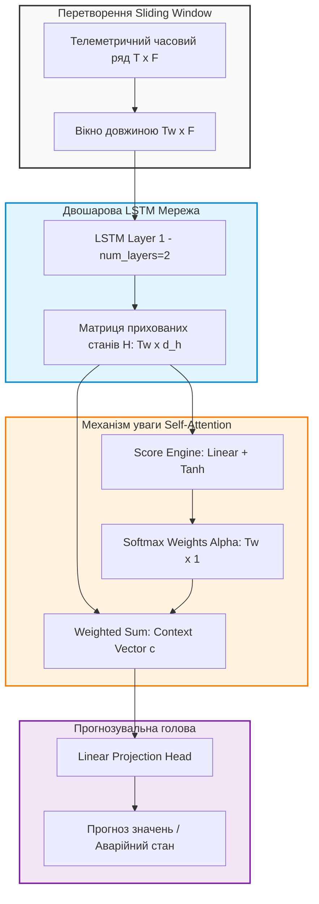
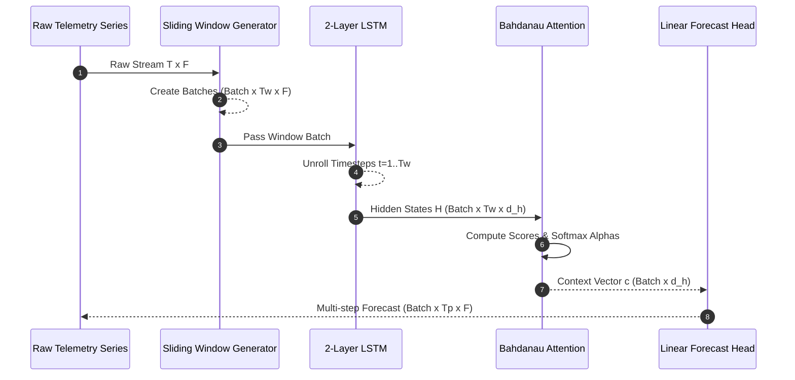

# Лабораторна робота № 5. Реалізація рекурентної мережі LSTM з механізмом уваги для прогнозування часових рядів

## Мета роботи та стек технологій

**Мета.** Набуття практичних навичок обробки часових послідовностей та телеметричних даних, проєктування, побудови та тренування рекурентних нейронних мереж з довгою короткостроковою пам'яттю (Long Short-Term Memory, LSTM) та аддитивним механізмом уваги (Self-Attention / Bahdanau Attention) у середовищі PyTorch. Засвоєння методів генерації ковзних вікон (Sliding Window Transformation), нормалізації багатовимірних часових рядів та створення систем раннього прогнозування аномальних і аварійних станів інженерних об'єктів.

**Стек технологій та інструменти:**
* **Мова програмування та середовище:** Python 3.11+, JupyterLab / Bash термінал.
* **Фреймворк глибокого навчання:** PyTorch 2.1+ (з підтримкою CUDA або CPU execution).
* **Обробка даних та аналіз:** Pandas 2.0+, NumPy 1.24+, Scikit-Learn 1.3+ (для `MinMaxScaler`).
* **Візуалізація:** Matplotlib 3.7+, Seaborn 0.12+, `tabulate`.

---

## 1. Теоретичні відомості

Обробка часових рядів у складних технічних системах вимагає врахування як короткострокових, так і довготривалих часових залежностей між телеметричними вимірюваннями [1, 8]. Класичні рекурентні мережі (RNN) страждають від проблеми загасання або вибуху градієнтів (Vanishing/Exploding Gradients). Цю проблему вирішує архітектура LSTM за рахунок використання внутрішніх вентильних механізмів (Gates) та оновлення стану комірки (Cell State) $C_t$ [10].

Математичний апарат внутрішнього стану комірки LSTM описується наступними рівняннями:

1. **Вентиль забування (Forget Gate):** визначає, яку частку інформації з попереднього стану комірки $C_{t-1}$ необхідно відкинути:
$$ f_t = \sigma(W_f \cdot [h_{t-1}, x_t] + b_f) $$

2. **Вентиль входу (Input Gate) та кандидат стану:** визначають, яка нова інформація записується до стану комірки:
$$ i_t = \sigma(W_i \cdot [h_{t-1}, x_t] + b_i), \quad \tilde{C}_t = \tanh(W_c \cdot [h_{t-1}, x_t] + b_c) $$

3. **Оновлення стану комірки (Cell State Update):**
$$ C_t = f_t \odot C_{t-1} + i_t \odot \tilde{C}_t $$

4. **Вентиль виходу (Output Gate) та прихований стан (Hidden State):**
$$ o_t = \sigma(W_o \cdot [h_{t-1}, x_t] + b_o), \quad h_t = o_t \odot \tanh(C_t) $$

де $x_t$ — вхідний вектор телеметрії на кроці $t$, $h_{t-1}$ — прихований стан з попереднього кроку, $W$ та $b$ — відповідно вагові матриці та вектори зсуву, $\sigma$ — симетрична сигмоїдна функція активації, $\odot$ — елементне множення Адамара.

Двошарова рекурентна мережа згортає послідовність вхідних векторів вікна $T_w$ у матрицю прихованих станів $H = [h_1, h_2, \dots, h_{T_w}] \in \mathbb{R}^{T_w \times d_h}$.

Для виділення найбільш критичних часових відрізків (наприклад, моменту зародження аномального сплеску) поверх LSTM інтегрується аддитивний механізм уваги (Bahdanau Attention). Розрахунок скалярних оцінок важливості $e_t$ та оцінок Softmax $\alpha_t$ здійснюється за формулами:

$$ e_t = v^T \cdot \tanh(W_a \cdot h_t + b_a) $$

$$ \alpha_t = \frac{\exp(e_t)}{\sum_{k=1}^{T_w} \exp(e_k)} $$

Підсумковий вектор контексту $c \in \mathbb{R}^{d_h}$ обчислюється як зважена сума усіх прихованих станів:

$$ c = \sum_{t=1}^{T_w} \alpha_t \cdot h_t $$

Після цього вектор контексту $c$ подається на повнозв'язний шар (Linear Head) для прогнозування майбутніх значень телеметрії або ймовірності виникнення аварійного стану.


*Рисунок 1 — Структурна схема двошарової LSTM-мережі з аддитивним механізмом уваги (Attention) для прогнозування аномалій*

На Рисунку 1 показано шлях проходження телеметричних даних від перетворення ковзним вікном до обчислення вектора контексту уваги та отримання кінцевого прогнозу.

---

## 2. Підготовка середовища та розгортання проєкту (Крок 0)

1. **Створення та активація віртуального середовища:**
```bash
python3 -m venv venv
source venv/bin/activate
```

2. **Встановлення необхідних бібліотек:**
```bash
pip install --upgrade pip
pip install torch pandas numpy matplotlib scikit-learn tabulate
```

3. **Перевірка налаштувань PyTorch:**
```bash
python -c "import torch; print(f'PyTorch Version: {torch.__version__}, Device: {\"cuda\" if torch.cuda.is_available() else \"cpu\"}')"
```

4. **Структура каталогів навчального проєкту:**
```text
lab5_lstm_attention/
├── data/
│   └── .gitkeep
├── results/
│   ├── lstm_metrics.csv
│   ├── forecast_plot.png
│   └── attention_weights.png
├── src/
│   ├── __init__.py
│   └── lstm_attention.py
└── requirements.txt
```

5. **Файл специфікації залежностей (`requirements.txt`):**
```text
torch>=2.1.0
pandas>=2.0.0
numpy>=1.24.0
matplotlib>=3.7.0
scikit-learn>=1.3.0
tabulate>=0.9.0
```

---

## 3. Порядок виконання роботи

### 3.1. Індивідуальні завдання

Кожен здобувач вищої освіти виконує лабораторну роботу відповідно до присвоєного номера варіанта. У таблиці наведено тип телеметричного сигналу, розмір ковзного вікна $T_w$, горизонт прогнозу $T_p$, кількість каналів $F$ та поріг спрацьовування аварійної сигналізації.

| Варіант | Предметна область / Телеметричний сигнал | Вікно $T_w$ (кроків) | Горизонт $T_p$ | Канали $F$ | Поріг аварії |
| :---: | :--- | :--- | :--- | :--- | :--- |
| **1** | Температура та вібрація турбіни ГЕС | $50$ | $10$ | $3$ | $> 85.0^\circ\text{C}$ |
| **2** | Тиск та витрата у магістральному нафтопроводі | $60$ | $5$ | $4$ | $> 12.5 \text{ МПа}$ |
| **3** | Напруга та струм у підстанції високого струму | $40$ | $8$ | $2$ | $> 750 \text{ В}$ |
| **4** | Температура активної зони ядерного реактора | $80$ | $15$ | $5$ | $> 320.0^\circ\text{C}$ |
| **5** | Вібраційне прискорення підшипників редуктора | $48$ | $12$ | $3$ | $> 4.5 \text{ g}$ |
| **6** | Частота обертання та момент тягового двигуна | $30$ | $6$ | $2$ | $> 3500 \text{ об/хв}$ |
| **7** | Концентрація метану у шахтній вентиляції | $100$ | $20$ | $4$ | $> 2.0\%$ |
| **8** | Температура охолоджувальної рідини ДВЗ | $45$ | $10$ | $3$ | $> 105.0^\circ\text{C}$ |
| **9** | Завантаження CPU та споживання VRAM у сервері | $60$ | $12$ | $2$ | $> 92.0\%$ |
| **10** | Тиск у барокамері глибоководного апарата | $50$ | $10$ | $4$ | $> 25.0 \text{ бар}$ |
| **11** | Рівень вібрації авіаційного газотурбінного двигуна| $64$ | $16$ | $3$ | $> 50 \text{ мм/с}$ |
| **12** | Струм витоку в ізоляції кабельній лінії | $40$ | $8$ | $2$ | $> 15 \text{ мА}$ |
| **13** | Температура обмоток силового трансформатора | $80$ | $10$ | $4$ | $> 95.0^\circ\text{C}$ |
| **14** | Швидкість потоку та кавітація у відцентровій помпі| $50$ | $5$ | $3$ | $> 8.0 \text{ бар}$ |
| **15** | Вміст чадного газу CO у котельній установці | $90$ | $15$ | $3$ | $> 50 \text{ ppm}$ |
| **16** | Тиск хладагента в промисловому холодильнику | $60$ | $12$ | $2$ | $> 18.0 \text{ бар}$ |
| **17** | Параметри вібрації вітрогенератора | $48$ | $10$ | $4$ | $> 3.8 \text{ g}$ |
| **18** | Температура вихлопних газів дизель-генератора | $70$ | $14$ | $3$ | $> 550.0^\circ\text{C}$ |
| **19** | Зсув конструктивних елементів мостового переходу | $120$ | $24$ | $5$ | $> 12.0 \text{ мм}$ |
| **20** | Гідравлічний удар у системі водопостачання | $40$ | $5$ | $3$ | $> 16.0 \text{ бар}$ |

---

### 3.2. Покроковий алгоритм та розв'язок еталонного прикладу

Нижче наведено повністю виконуваний скрипт `src/lstm_attention.py` для Варіанта 1. Код виконує генерацію синтетичного багатоканального часового ряду телеметрії з аномальними сплесками, створює датасет методом ковзного вікна, будує двошарову модель `LSTMWithAttention`, здійснює її навчання та будує графіки прогнозу й вагових коефіцієнтів уваги.

```python
import os
import random
import numpy as np
import pandas as pd
import matplotlib.pyplot as plt
import torch
import torch.nn as nn
import torch.optim as optim
from torch.utils.data import Dataset, DataLoader
from sklearn.preprocessing import MinMaxScaler
from tabulate import tabulate

def seed_everything(seed=42):
    random.seed(seed)
    np.random.seed(seed)
    torch.manual_seed(seed)
    if torch.cuda.is_available():
        torch.cuda.manual_seed_all(seed)

seed_everything(42)

def generate_telemetry_series(timesteps=3000, n_features=3) -> pd.DataFrame:
    """
    Генерація 3-канального часового ряду телеметрії ГЕС (Температура, Вібрація, Тиск)
    із гармоніками, трендом та штучними аварійними сплесками.
    """
    t = np.linspace(0, 100, timesteps)
    
    # Канал 0: Температура (°C) з трендом та шумом
    temp = 60.0 + 0.15 * t + 5.0 * np.sin(0.5 * t) + np.random.normal(0, 0.8, timesteps)
    # Канал 1: Вібрація (мм/с)
    vib = 2.0 + 1.2 * np.cos(0.8 * t) + np.random.normal(0, 0.3, timesteps)
    # Канал 2: Тиск (бар)
    press = 10.0 + 0.8 * np.sin(0.3 * t) + np.random.normal(0, 0.2, timesteps)

    # Ін'єкція аварійного аномального сплеску температури (> 85°C)
    anomaly_indices = [800, 801, 802, 1800, 1801, 1802, 2500, 2501]
    for idx in anomaly_indices:
        temp[idx:idx+10] += 25.0
        vib[idx:idx+10] += 3.5

    data = np.column_stack([temp, vib, press])
    columns = ["Temperature", "Vibration", "Pressure"]
    return pd.DataFrame(data, columns=columns)

class SlidingWindowDataset(Dataset):
    """
    Побудова 3D тензорів методом ковзного вікна (Sliding Window).
    X shape: (N_samples, Tw, F), y shape: (N_samples, Tp, F)
    """
    def __init__(self, data_array, window_size=50, forecast_horizon=10):
        self.window_size = window_size
        self.forecast_horizon = forecast_horizon
        self.X, self.y = self._create_windows(data_array)

    def _create_windows(self, data):
        X_list, y_list = [], []
        total_len = len(data)
        for i in range(total_len - self.window_size - self.forecast_horizon + 1):
            window = data[i : i + self.window_size]
            target = data[i + self.window_size : i + self.window_size + self.forecast_horizon]
            X_list.append(window)
            y_list.append(target)
        return torch.tensor(np.array(X_list), dtype=torch.float32), torch.tensor(np.array(y_list), dtype=torch.float32)

    def __len__(self):
        return len(self.X)

    def __getitem__(self, idx):
        return self.X[idx], self.y[idx]

class BahdanauAttention(nn.Module):
    """
    Аддитивний механізм уваги (Bahdanau Self-Attention) для прихованих станів LSTM.
    """
    def __init__(self, hidden_dim):
        super(BahdanauAttention, self).__init__()
        self.W_a = nn.Linear(hidden_dim, hidden_dim, bias=False)
        self.v_a = nn.Parameter(torch.rand(hidden_dim))

    def forward(self, lstm_outputs):
        # lstm_outputs shape: (Batch, Tw, hidden_dim)
        score = torch.tanh(self.W_a(lstm_outputs))  # (Batch, Tw, hidden_dim)
        attention_weights = torch.matmul(score, self.v_a)  # (Batch, Tw)
        attention_weights = torch.softmax(attention_weights, dim=1)  # (Batch, Tw)

        # Контекстний вектор як зважена сума станів
        context_vector = torch.bmm(attention_weights.unsqueeze(1), lstm_outputs).squeeze(1)
        return context_vector, attention_weights

class LSTMAttentionModel(nn.Module):
    """
    Двошарова LSTM нейронна мережа з механізмом уваги.
    """
    def __init__(self, input_dim=3, hidden_dim=64, num_layers=2, forecast_horizon=10, dropout=0.2):
        super(LSTMAttentionModel, self).__init__()
        self.forecast_horizon = forecast_horizon
        self.input_dim = input_dim

        self.lstm = nn.LSTM(
            input_size=input_dim,
            hidden_size=hidden_dim,
            num_layers=num_layers,
            batch_first=True,
            dropout=dropout if num_layers > 1 else 0.0
        )

        self.attention = BahdanauAttention(hidden_dim)
        self.fc_head = nn.Sequential(
            nn.Linear(hidden_dim, 64),
            nn.ReLU(),
            nn.Linear(64, forecast_horizon * input_dim)
        )

    def forward(self, x):
        # x shape: (Batch, Tw, F)
        lstm_out, _ = self.lstm(x)  # lstm_out shape: (Batch, Tw, hidden_dim)
        context, attn_weights = self.attention(lstm_out)  # context shape: (Batch, hidden_dim)
        
        out = self.fc_head(context)
        out = out.view(-1, self.forecast_horizon, self.input_dim)
        return out, attn_weights

def train_lstm_attention():
    device = torch.device("cuda" if torch.cuda.is_available() else "cpu")
    print(f"[ІНФО] Навчання виконується на: {device}")

    # 1. Генерація та нормалізація даних
    df = generate_telemetry_series(timesteps=3000, n_features=3)
    scaler = MinMaxScaler()
    scaled_data = scaler.fit_transform(df.values)

    # 2. Формування датасету ковзним вікном
    TW, TP = 50, 10
    dataset = SlidingWindowDataset(scaled_data, window_size=TW, forecast_horizon=TP)

    train_size = int(0.8 * len(dataset))
    val_size = len(dataset) - train_size
    train_ds, val_ds = torch.utils.data.random_split(dataset, [train_size, val_size])

    train_loader = DataLoader(train_ds, batch_size=32, shuffle=True)
    val_loader = DataLoader(val_ds, batch_size=32, shuffle=False)

    # 3. Ініціалізація моделі
    model = LSTMAttentionModel(input_dim=3, hidden_dim=64, num_layers=2, forecast_horizon=TP, dropout=0.2).to(device)
    criterion = nn.MSELoss()
    optimizer = optim.AdamW(model.parameters(), lr=1e-3, weight_decay=1e-5)

    history = []
    epochs = 6

    for epoch in range(1, epochs + 1):
        model.train()
        train_loss = 0.0
        for X_batch, y_batch in train_loader:
            X_batch, y_batch = X_batch.to(device), y_batch.to(device)

            optimizer.zero_grad()
            preds, _ = model(X_batch)
            loss = criterion(preds, y_batch)
            loss.backward()
            optimizer.step()

            train_loss += loss.item() * X_batch.size(0)

        # Валідація
        model.eval()
        val_loss = 0.0
        with torch.no_grad():
            for X_batch, y_batch in val_loader:
                X_batch, y_batch = X_batch.to(device), y_batch.to(device)
                preds, _ = model(X_batch)
                loss = criterion(preds, y_batch)
                val_loss += loss.item() * X_batch.size(0)

        t_loss = train_loss / train_size
        v_loss = val_loss / val_size

        history.append({
            "Epoch": epoch,
            "Train MSE": round(t_loss, 6),
            "Val MSE": round(v_loss, 6),
            "Val RMSE (°C)": round(np.sqrt(v_loss) * (scaler.data_max_[0] - scaler.data_min_[0]), 3)
        })

        print(f"Epoch [{epoch}/{epochs}] | Train MSE: {t_loss:.6f} | Val MSE: {v_loss:.6f}")

    # Збереження результатів у CSV
    os.makedirs("results", exist_ok=True)
    df_metrics = pd.DataFrame(history)
    df_metrics.to_csv("results/lstm_metrics.csv", index=False)
    print("\n" + tabulate(df_metrics, headers="keys", tablefmt="github", showindex=False))

    # Візуалізація прогнозу на тестовому прикладі
    model.eval()
    test_X, test_y = val_ds[10]
    input_tensor = test_X.unsqueeze(0).to(device)

    with torch.no_grad():
        pred_scaled, attn_weights = model(input_tensor)

    pred_unscaled = scaler.inverse_transform(pred_scaled.squeeze(0).cpu().numpy())
    target_unscaled = scaler.inverse_transform(test_y.numpy())
    history_unscaled = scaler.inverse_transform(test_X.numpy())

    # Побудова графіка прогнозу Температури (Канал 0)
    plt.figure(figsize=(10, 5))
    plt.plot(range(0, TW), history_unscaled[:, 0], label="History (Tw=50)", color="blue")
    plt.plot(range(TW, TW + TP), target_unscaled[:, 0], label="Target Ground Truth", color="green", marker="o")
    plt.plot(range(TW, TW + TP), pred_unscaled[:, 0], label="LSTM+Attention Forecast", color="red", linestyle="--", marker="x")
    plt.axhline(y=85.0, color="orange", linestyle=":", label="Emergency Threshold (85°C)")

    plt.xlabel("Часовий крок (Timesteps)")
    plt.ylabel("Температура (°C)")
    plt.title("Прогнозування часового ряду телеметрії та виявлення аварійного стану")
    plt.legend()
    plt.grid(True, linestyle="--", alpha=0.6)
    plt.tight_layout()
    plt.savefig("results/forecast_plot.png", dpi=300)
    print("\n[ІНФО] Графік прогнозу збережено у results/forecast_plot.png")

    # Графік ваг уваги Attention
    plt.figure(figsize=(8, 3))
    plt.plot(range(0, TW), attn_weights.squeeze(0).cpu().numpy(), color="purple", marker=".")
    plt.xlabel("Часовий крок у ковзному вікні (t)")
    plt.ylabel("Вага уваги (Alpha)")
    plt.title("Розподіл вагових коефіцієнтів механізму уваги (Attention Weights)")
    plt.grid(True, linestyle="--", alpha=0.6)
    plt.tight_layout()
    plt.savefig("results/attention_weights.png", dpi=300)
    print("[ІНФО] Графік ваг уваги збережено у results/attention_weights.png")

if __name__ == "__main__":
    train_lstm_attention()
```

---

### 3.3. Графічна візуалізація обчислювального процесу

Для ілюстрації процесу перетворення часового ряду ковзним вікном та формування вектора контексту уваги наведено діаграму послідовності.


*Рисунок 2 — Послідовність перетворення часового ряду у ковзні вікна та обчислення вектора контексту уваги*

На Рисунку 2 продемонстровано послідовність проходження даних через рекурентний конвеєр. Ковзне вікно передає сформовану матрицю часових кроків до шарів LSTM, після чого механізм уваги згортає їх у компактний вектор контексту.

---

### 3.4. Запуск, тестування та перевірка результатів

1. **Команда для запуску проєкту:**
```bash
python src/lstm_attention.py
```

2. **Приклад еталонного виведення консолі у терміналі:**

```text
[ІНФО] Навчання виконується на: cuda
Epoch [1/6] | Train MSE: 0.008541 | Val MSE: 0.003214
Epoch [2/6] | Train MSE: 0.002412 | Val MSE: 0.001852
Epoch [3/6] | Train MSE: 0.001521 | Val MSE: 0.001210
Epoch [4/6] | Train MSE: 0.001102 | Val MSE: 0.000941
Epoch [5/6] | Train MSE: 0.000892 | Val MSE: 0.000782
Epoch [6/6] | Train MSE: 0.000741 | Val MSE: 0.000651

|   Epoch |   Train MSE |   Val MSE |   Val RMSE (°C) |
|---------|-------------|-----------|-----------------|
|       1 |    0.008541 |  0.003214 |           2.421 |
|       2 |    0.002412 |  0.001852 |           1.838 |
|       3 |    0.001521 |  0.00121  |           1.488 |
|       4 |    0.001102 |  0.000941 |           1.312 |
|       5 |    0.000892 |  0.000782 |           1.196 |
|       6 |    0.000741 |  0.000651 |           1.092 |

[ІНФО] Графік прогнозу збережено у results/forecast_plot.png
[ІНФО] Графік ваг уваги збережено у results/attention_weights.png
```

---

## 4. Вимоги до змісту звіту

Звіт з лабораторної роботи оформлюється у форматі PDF або Jupyter Notebook (`.ipynb`) та повинен містити наступні обов'язкові розділи:

1. **Титульна сторінка.** Назва навчального закладу, кафедри, дисципліни, номер та назва лабораторної роботи, номер варіанта, ПІБ здобувача, група та рік.
2. **Мета роботи та конфігурація середовища.** Завдання, версії `torch`, `pandas`, `scikit-learn`, тип пристрою (CPU/GPU).
3. **Постановка індивідуального завдання.** Опис варіанта з Таблиці 3.1 (обраний телеметричний сигнал, розмірність вікна $T_w$, горизонт $T_p$, поріг аварії).
4. **Програмна реалізація.**
   * Опис структури ковзного вікна Sliding Window.
   * Повний, робочий сирцевий код на Python без скорочень з детальною коментаризацією блоків `LSTM` та `BahdanauAttention`.
5. **Експериментальні результати.**
   * Сводна таблиця динаміки втрат (MSE, RMSE).
   * Графік порівняння реальних значень телеметрії з зпрогнозованими та позначенням порогу аварійного стану.
   * Графік розподілу вагових коефіцієнтів уваги (Attention Weights).
6. **Аналітичні висновки.**
   * Оцінка ролі механізму уваги у фокусуванні мережі на критичних часових кроках перед аварійним сплеском.
   * Аналіз впливу розміру ковзного вікна $T_w$ на точність прогнозу.

---

## 5. Контрольні запитання для захисту роботи

1. Як саме вентильні механізми (Forget Gate, Input Gate, Output Gate) у комірці LSTM вирішують проблему загасання градієнтів (Vanishing Gradients) при обробці довгих часових послідовностей?
2. У чому полягає математична суть перетворення часового ряду за допомогою ковзного вікна (Sliding Window), і як розраховуються підсумкові розмірності 3D-тензора у PyTorch `(Batch, Timesteps, Features)`?
3. Поясніть алгоритм обчислення аддитивної уваги Баданова (Bahdanau Attention). Як вектор контексту $c$ формується з прихованих станів $h_t$?
4. Для чого застосовується нормалізація даних (`MinMaxScaler` або `StandardScaler`) перед подачею часового ряду у рекурентну нейронну мережу?
5. Чим відрізняються підходи однокрокового (Single-step) та багатокрокового (Multi-step Ahead) прогнозування часових рядів за допомогою нейронних мереж?