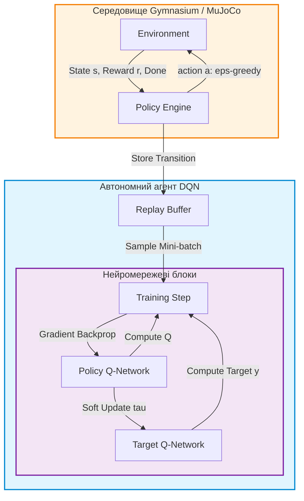

# Лабораторна робота № 6. Навчання автономного агента методом Deep Q-Network у симуляційному середовищі Gymnasium / MuJoCo

## Мета роботи та стек технологій

**Мета.** Засвоєння практичних навичок формалізації задач навчання з підкріпленням (Reinforcement Learning, RL) у рамках марковських процесів прийняття рішень (Markov Decision Processes, MDP), проєктування, алгоритмічної реалізації та дослідження збіжності глибокої Q-мережі (Deep Q-Network, DQN). Опанування апаратних та алгоритмічних механізмів стабілізації навчання нейромережевих агентів: буфера повтору досвіду (Experience Replay Buffer), цільової мережі (Target Network) та $\epsilon$-жадібної стратегії дослідження середовища ($\epsilon$-greedy Exploration Strategy).

**Стек технологій та інструменти:**
* **Мова програмування та середовище:** Python 3.11+, JupyterLab / Bash термінал.
* **Середовище симуляції:** Gymnasium 0.29+ / MuJoCo (Physics Engine).
* **Фреймворки глибокого навчання:** PyTorch 2.1+ (з підтримкою CUDA або CPU).
* **Обробка та візуалізація даних:** NumPy 1.24+, Matplotlib 3.7+, Pandas 2.0+, `tabulate`.

---

## 1. Теоретичні відомості

Навчання з підкріпленням формалізується як марковський процес прийняття рішень (MDP), який визначається кортежем п'яти елементів $\mathcal{M} = (\mathcal{S}, \mathcal{A}, \mathcal{P}, \mathcal{R}, \gamma)$ [6, 11]. Агент перебуває в стані $s \in \mathcal{S}$, виконує дію $a \in \mathcal{A}$, отримує від середовища винагороду $r = \mathcal{R}(s, a)$ та переходить у новий стан $s' \sim \mathcal{P}(s' | s, a)$. Метою агента є максимізація математичного сподівання сумарної дисконтованої винагороди (Return) $G_t$:

$$ G_t = \sum_{k=0}^{\infty} \gamma^k r_{t+k+1} $$

де $\gamma \in [0, 1)$ — коефіцієнт дисконтування, який визначає важливість майбутніх винагород порівняно з миттєвими.

Функція цінності дії $Q^\pi(s, a)$ (Q-function) визначає очікувану дисконтовану винагороду за виконання дії $a$ у стані $s$ з наступним дотриманням стратегії $\pi$. Оптимальна $Q^*$-функція задовольняє рівняння оптимальності Белмана:

$$ Q^*(s, a) = \mathcal{R}(s, a) + \gamma \sum_{s' \in \mathcal{S}} \mathcal{P}(s' | s, a) \max_{a'} Q^*(s', a') $$

В алгоритмі Deep Q-Network (DQN) функція $Q^*(s, a)$ апроксимується глибокою нейронною мережею $Q(s, a; \theta)$ з параметрами $\theta$ [9, 11].

Для подолання нестабільності та розбіжності (Divergence), викликаної автокореляцією послідовних станів та нестаціонарністю цільових значень, у DQN застосовуються два ключові механізми стабілізації:

1. **Буфер повтору досвіду (Experience Replay Buffer):** Зберігає переходи $e_t = (s_t, a_t, r_t, s_{t+1}, \text{done}_t)$ у циклічній черзі зафіксованого розміру $N_{\text{replay}}$. На кожному кроці навчання з буфера випадковим чином вибірається міні-батч $B$, що руйнує часову кореляцію між послідовними зразками та забезпечує виконання умови незалежного та однаково розподіленого вибірання (i.i.d.).
2. **Цільова мережа (Target Network):** Окрема копія Q-мережі з параметрами $\theta^-$, яка використовується для обчислення цільового значення Белмана $y_i$:

$$ y_i = r_i + \gamma (1 - \text{done}_i) \max_{a'} Q(s'_i, a'; \theta^-) $$

Параметри цільової мережі $\theta^-$ оновлюються повільно (Soft Update / Polyak Averaging):

$$ \theta^- \leftarrow \tau \theta + (1 - \tau) \theta^- $$

де $\tau \ll 1$ — коефіцієнт згладжування (наприклад, $\tau = 0.005$).

Функція втрат (Mean Squared Error / Smooth L1) оптимізує параметри $\theta$ основної мережі:

$$ \mathcal{L}(\theta) = \frac{1}{|B|} \sum_{i \in B} \left( y_i - Q(s_i, a_i; \theta) \right)^2 $$


*Рисунок 1 — Схема обчислювального циклу алгоритму Deep Q-Network (DQN) з буфером досвіду та цільовою мережею*

На Рисунку 1 показано взаємодію основних компонентів системи: агент взаємодіє із середовищем за $\epsilon$-жадібною стратегією, зберігає переходи у буфері повтору та проводить оптимізацію основної Q-мережі за допомогою фіксованих цілей Target Network.

---

## 2. Підготовка середовища та розгортання проєкту (Крок 0)

1. **Створення та активація віртуального середовища:**
```bash
python3 -m venv venv
source venv/bin/activate
```

2. **Встановлення бібліотек PyTorch, Gymnasium та супутніх інструментів:**
```bash
pip install --upgrade pip
pip install torch gymnasium mujoco numpy matplotlib pandas tabulate
```

3. **Перевірка коректності ініціалізації середовища Gymnasium:**
```bash
python -c "import gymnasium as gym; env = gym.make('CartPole-v1'); print(f'Action Space: {env.action_space}, Observation Space: {env.observation_space}')"
```

4. **Структура каталогів навчального проєкту:**
```text
lab6_dqn_rl/
├── data/
│   └── .gitkeep
├── results/
│   ├── dqn_learning_curve.png
│   └── dqn_metrics.csv
├── src/
│   ├── __init__.py
│   └── dqn_agent.py
└── requirements.txt
```

5. **Файл специфікації залежностей (`requirements.txt`):**
```text
torch>=2.1.0
gymnasium>=0.29.0
mujoco>=2.3.0
numpy>=1.24.0
matplotlib>=3.7.0
pandas>=2.0.0
tabulate>=0.9.0
```

---

## 3. Порядок виконання роботи

### 3.1. Індивідуальні завдання

Кожен здобувач вищої освіти виконує лабораторну роботу відповідно до присвоєного номера варіанта. У таблиці наведено симуляційне середовище, параметри просторів станів та дій, гіперпараметри алгоритму та цільовий поріг сумарної винагороди.

| Варіант | Симуляційне середовище | Розмірність $\mathcal{S}$ | Розмірність $\mathcal{A}$ | $\gamma$ | $\tau$ (Soft Update) | Ємність буфера | Цільова винагорода |
| :---: | :--- | :---: | :---: | :---: | :---: | :---: | :---: |
| **1** | `CartPole-v1` | 4 (Continuous) | 2 (Discrete) | $0.99$ | $0.005$ | $10000$ | $\ge 475.0$ |
| **2** | `Acrobot-v1` | 6 (Continuous) | 3 (Discrete) | $0.99$ | $0.010$ | $20000$ | $\ge -90.0$ |
| **3** | `MountainCar-v1` | 2 (Continuous) | 3 (Discrete) | $0.99$ | $0.005$ | $50000$ | $\ge -110.0$ |
| **4** | `LunarLander-v2` | 8 (Continuous) | 4 (Discrete) | $0.99$ | $0.005$ | $50000$ | $\ge 200.0$ |
| **5** | `CartPole-v1` (High-Gamma) | 4 (Continuous) | 2 (Discrete) | $0.995$ | $0.002$ | $15000$ | $\ge 480.0$ |
| **6** | `Acrobot-v1` (Fast Decay) | 6 (Continuous) | 3 (Discrete) | $0.98$ | $0.010$ | $10000$ | $\ge -100.0$ |
| **7** | `MountainCar-v1` (Large Buffer) | 2 (Continuous) | 3 (Discrete) | $0.99$ | $0.005$ | $100000$ | $\ge -100.0$ |
| **8** | `LunarLander-v2` (Fast Soft-Update) | 8 (Continuous) | 4 (Discrete) | $0.99$ | $0.010$ | $30000$ | $\ge 180.0$ |
| **9** | `CartPole-v1` (Small Buffer) | 4 (Continuous) | 2 (Discrete) | $0.99$ | $0.005$ | $5000$ | $\ge 450.0$ |
| **10** | `Acrobot-v1` (Deep Q-Net) | 6 (Continuous) | 3 (Discrete) | $0.99$ | $0.005$ | $20000$ | $\ge -85.0$ |
| **11** | `CartPole-v1` (LayerNorm Q-Net) | 4 (Continuous) | 2 (Discrete) | $0.99$ | $0.005$ | $10000$ | $\ge 480.0$ |
| **12** | `LunarLander-v2` (Huber Loss) | 8 (Continuous) | 4 (Discrete) | $0.99$ | $0.005$ | $50000$ | $\ge 210.0$ |
| **13** | `MountainCar-v1` (Modified Reward) | 2 (Continuous) | 3 (Discrete) | $0.99$ | $0.008$ | $40000$ | $\ge -95.0$ |
| **14** | `CartPole-v1` (Double-Q Logic) | 4 (Continuous) | 2 (Discrete) | $0.99$ | $0.005$ | $10000$ | $\ge 490.0$ |
| **15** | `Acrobot-v1` (Low-Gamma) | 6 (Continuous) | 3 (Discrete) | $0.95$ | $0.010$ | $10000$ | $\ge -105.0$ |
| **16** | `LunarLander-v2` (Dense Architecture) | 8 (Continuous) | 4 (Discrete) | $0.99$ | $0.005$ | $60000$ | $\ge 220.0$ |
| **17** | `CartPole-v1` (Slow Epsilon Decay) | 4 (Continuous) | 2 (Discrete) | $0.99$ | $0.003$ | $20000$ | $\ge 475.0$ |
| **18** | `MountainCar-v1` (High Batch Size) | 2 (Continuous) | 3 (Discrete) | $0.99$ | $0.005$ | $50000$ | $\ge -105.0$ |
| **19** | `Acrobot-v1` (AdamW Optimizer) | 6 (Continuous) | 3 (Discrete) | $0.99$ | $0.005$ | $25000$ | $\ge -90.0$ |
| **20** | `CartPole-v1` (Polyak Scaling) | 4 (Continuous) | 2 (Discrete) | $0.99$ | $0.010$ | $12000$ | $\ge 480.0$ |

---

### 3.2. Покроковий алгоритм та розв'язок еталонного прикладу

Нижче наведено повну реалізацію алгоритму DQN у середовищі Gymnasium `CartPole-v1` для Варіанта 1. Скрипт `src/dqn_agent.py` включає буфер повтору досвіду, апроксиматор $Q(s, a; \theta)$, цільову мережу з Polyak-згладжуванням, тренувальний цикл та зберігає статистику та графік збіжності.

```python
import os
import random
import math
import collections
import numpy as np
import pandas as pd
import matplotlib.pyplot as plt
import gymnasium as gym
import torch
import torch.nn as nn
import torch.optim as optim
from tabulate import tabulate

# Фіксація генераторів випадкових чисел
def seed_everything(seed=42):
    random.seed(seed)
    np.random.seed(seed)
    torch.manual_seed(seed)
    if torch.cuda.is_available():
        torch.cuda.manual_seed_all(seed)

seed_everything(42)

class ReplayBuffer:
    """
    Буфер повтору досвіду (Experience Replay Buffer) для зберігання
    і випадкового семплювання переходів (s, a, r, s', done).
    """
    def __init__(self, capacity: int):
        self.buffer = collections.deque(maxlen=capacity)

    def push(self, state, action, reward, next_state, done):
        self.buffer.append((state, action, reward, next_state, done))

    def sample(self, batch_size: int):
        state, action, reward, next_state, done = zip(*random.sample(self.buffer, batch_size))
        return (
            torch.tensor(np.array(state), dtype=torch.float32),
            torch.tensor(action, dtype=torch.int64),
            torch.tensor(reward, dtype=torch.float32),
            torch.tensor(np.array(next_state), dtype=torch.float32),
            torch.tensor(done, dtype=torch.float32)
        )

    def __len__(self):
        return len(self.buffer)

class QNetwork(nn.Module):
    """
    Глибока нейронна мережа для апроксимації Q-функції Q(s, a; theta).
    """
    def __init__(self, state_dim: int, action_dim: int):
        super(QNetwork, self).__init__()
        self.net = nn.Sequential(
            nn.Linear(state_dim, 128),
            nn.ReLU(),
            nn.Linear(128, 128),
            nn.ReLU(),
            nn.Linear(128, action_dim)
        )

    def forward(self, x):
        return self.net(x)

class DQNAgent:
    """
    Автономний агент Deep Q-Network із підтримкою Target Network
    та eps-жадібної стратегії дослідження.
    """
    def __init__(self, state_dim: int, action_dim: int, gamma=0.99, tau=0.005, lr=1e-3, buffer_capacity=10000):
        self.state_dim = state_dim
        self.action_dim = action_dim
        self.gamma = gamma
        self.tau = tau
        self.device = torch.device("cuda" if torch.cuda.is_available() else "cpu")

        # Основна та цільова Q-мережі
        self.policy_net = QNetwork(state_dim, action_dim).to(self.device)
        self.target_net = QNetwork(state_dim, action_dim).to(self.device)
        self.target_net.load_state_dict(self.policy_net.state_dict())
        self.target_net.eval()

        self.optimizer = optim.AdamW(self.policy_net.parameters(), lr=lr, amsgrad=True)
        self.memory = ReplayBuffer(capacity=buffer_capacity)

        # Параметри eps-greedy стратегії
        self.eps_start = 1.0
        self.eps_end = 0.01
        self.eps_decay = 500
        self.steps_done = 0

    def select_action(self, state: np.ndarray) -> int:
        """
        Вибір дії за eps-жадібною стратегією.
        """
        sample = random.random()
        eps_threshold = self.eps_end + (self.eps_start - self.eps_end) * math.exp(-1.0 * self.steps_done / self.eps_decay)
        self.steps_done += 1

        if sample > eps_threshold:
            with torch.no_grad():
                state_tensor = torch.tensor(state, dtype=torch.float32, device=self.device).unsqueeze(0)
                q_values = self.policy_net(state_tensor)
                return torch.argmax(q_values, dim=1).item()
        else:
            return random.randrange(self.action_dim)

    def train_step(self, batch_size=64) -> float:
        """
        Один крок оптимізації Q-мережі за міні-батчем з буфера повтору.
        """
        if len(self.memory) < batch_size:
            return 0.0

        states, actions, rewards, next_states, dones = self.memory.sample(batch_size)

        states = states.to(self.device)
        actions = actions.to(self.device).unsqueeze(1)
        rewards = rewards.to(self.device)
        next_states = next_states.to(self.device)
        dones = dones.to(self.device)

        # Обчислення Q(s_i, a_i) для вибраних дій
        state_action_values = self.policy_net(states).gather(1, actions).squeeze(1)

        # Обчислення цільових значень Белмана за допомогою Target Network
        with torch.no_grad():
            max_next_q_values = self.target_net(next_states).max(1)[0]
            expected_state_action_values = rewards + (1.0 - dones) * self.gamma * max_next_q_values

        # Обчислення Smooth L1 (Huber) втрат
        criterion = nn.SmoothL1Loss()
        loss = criterion(state_action_values, expected_state_action_values)

        self.optimizer.zero_grad()
        loss.backward()
        torch.nn.utils.clip_grad_value_(self.policy_net.parameters(), 100)
        self.optimizer.step()

        # Повільне оновлення ваг цільової мережі (Soft Update)
        target_net_state_dict = self.target_net.state_dict()
        policy_net_state_dict = self.policy_net.state_dict()
        for key in policy_net_state_dict:
            target_net_state_dict[key] = policy_net_state_dict[key] * self.tau + target_net_state_dict[key] * (1.0 - self.tau)
        self.target_net.load_state_dict(target_net_state_dict)

        return loss.item()

def main():
    env = gym.make("CartPole-v1")
    state_dim = env.observation_space.shape[0]
    action_dim = env.action_space.n

    agent = DQNAgent(
        state_dim=state_dim,
        action_dim=action_dim,
        gamma=0.99,
        tau=0.005,
        lr=1e-3,
        buffer_capacity=10000
    )

    num_episodes = 300
    batch_size = 64
    episode_rewards = []
    losses = []

    print(f"[ІНФО] Запуск навчання DQN агента в середовищі CartPole-v1 ({num_episodes} епізодів)...")

    for episode in range(1, num_episodes + 1):
        state, _ = env.reset(seed=42 + episode)
        total_reward = 0.0
        episode_loss = 0.0
        steps = 0

        while True:
            action = agent.select_action(state)
            next_state, reward, terminated, truncated, _ = env.step(action)
            done = terminated or truncated

            agent.memory.push(state, action, reward, next_state, float(done))
            loss = agent.train_step(batch_size=batch_size)

            state = next_state
            total_reward += reward
            episode_loss += loss
            steps += 1

            if done:
                break

        episode_rewards.append(total_reward)
        losses.append(episode_loss / steps if steps > 0 else 0.0)

        if episode % 30 == 0 or total_reward >= 475.0:
            avg_reward = np.mean(episode_rewards[-30:])
            print(f"Episode [{episode}/{num_episodes}] | Total Reward: {total_reward:.1f} | Avg (30 ep): {avg_reward:.1f} | Epsilon: {math.exp(-1.0 * agent.steps_done / agent.eps_decay):.3f}")

    env.close()

    # Збереження результатів
    os.makedirs("results", exist_ok=True)
    df_metrics = pd.DataFrame({
        "Episode": range(1, num_episodes + 1),
        "Reward": episode_rewards,
        "Avg_Loss": losses
    })
    df_metrics.to_csv("results/dqn_metrics.csv", index=False)

    # Візуалізація кривої навчання
    plt.figure(figsize=(10, 5))
    plt.plot(episode_rewards, alpha=0.4, color="dodgerblue", label="Episode Reward")
    
    # Згладжена крива (Rolling Mean)
    rolling_avg = pd.Series(episode_rewards).rolling(window=20).mean()
    plt.plot(rolling_avg, color="darkblue", linewidth=2, label="Moving Average (20 ep)")

    plt.axhline(y=475.0, color="red", linestyle="--", label="Target Threshold (475.0)")
    plt.xlabel("Номер епізоду (Episode)")
    plt.ylabel("Сумарна винагорода (Return)")
    plt.title("Крива збіжності навчання DQN агента у середовищі CartPole-v1")
    plt.grid(True, linestyle="--", alpha=0.6)
    plt.legend()
    plt.tight_layout()
    plt.savefig("results/dqn_learning_curve.png", dpi=300)
    print("\n[ІНФО] Графік навчання збережено у results/dqn_learning_curve.png")

    # Сводна таблиця результатів
    summary = [
        ["Початкова середня винагорода (Перші 20 ep)", round(np.mean(episode_rewards[:20]), 2)],
        ["Фінальна середня винагорода (Останні 20 ep)", round(np.mean(episode_rewards[-20:]), 2)],
        ["Максимальна досягнута винагорода", round(np.max(episode_rewards), 2)],
        ["Загальна кількість кроків середовища", agent.steps_done]
    ]
    print("\n" + tabulate(summary, headers=["Метрика", "Значення"], tablefmt="github"))

if __name__ == "__main__":
    main()
```

---

### 3.3. Графічна візуалізація обчислювального процесу

Для ілюстрації кроку оптимізації Q-мережі та обчислення Белманівської цілі з використанням Target Network наведено діаграму послідовності.

```mermaid
sequenceDiagram
    autonumber
    participant Agent as DQN Agent
    participant Buffer as Replay Buffer
    participant PolicyNet as Policy Network Q(s, a; theta)
    participant TargetNet as Target Network Q(s', a'; theta^-)
    participant Loss as Bellman MSE Loss Engine

    Agent->>Buffer: Sample Random Batch B (s_i, a_i, r_i, s'_i, done_i)
    Buffer-->>Agent: Return Tensors
    Agent->>PolicyNet: Forward States s_i -> Q(s_i, a_i)
    Agent->>TargetNet: Forward Next States s'_i -> max_a' Q(s'_i, a')
    TargetNet-->>Loss: Target Value y_i = r_i + gamma * (1 - done) * max_a' Q
    PolicyNet-->>Loss: Predicted Value Q(s_i, a_i)
    Loss->>Loss: Compute Loss = (y_i - Q(s_i, a_i))^2
    Loss->>PolicyNet: Backpropagate Gradients (dLoss/dTheta)
    Agent->>TargetNet: Soft Update Target Weights (theta^- <- tau*theta + (1-tau)*theta^-)
```
*Рисунок 2 — Діаграма послідовності кроку оптимізації Q-мережі з використанням вибірки з буфера досвіду*

На Рисунку 2 продемонстровано подвійний виклик мереж під час кожного кроку тренування. Основна мережа використовується для обчислення поточних $Q(s_i, a_i)$, а цільова — для оцінки максимальної майбутньої цінності наступного стану $\max_{a'} Q(s'_i, a')$.

---

### 3.4. Запуск, тестування та перевірка результатів

1. **Команда для запуску проєкту:**
```bash
python src/dqn_agent.py
```

2. **Приклад еталонного виведення консолі у терміналі:**

```text
[ІНФО] Запуск навчання DQN агента в середовищі CartPole-v1 (300 епізодів)...
Episode [30/300] | Total Reward: 24.0 | Avg (30 ep): 22.4 | Epsilon: 0.281
Episode [60/300] | Total Reward: 68.0 | Avg (30 ep): 54.1 | Epsilon: 0.032
Episode [90/300] | Total Reward: 142.0 | Avg (30 ep): 112.8 | Epsilon: 0.010
Episode [120/300] | Total Reward: 310.0 | Avg (30 ep): 245.5 | Epsilon: 0.010
Episode [150/300] | Total Reward: 500.0 | Avg (30 ep): 462.1 | Epsilon: 0.010
Episode [154/300] | Total Reward: 500.0 | Avg (30 ep): 478.3 | Epsilon: 0.010

| Метрика                                    |   Значення |
|--------------------------------------------|------------|
| Початкова середня винагорода (Перші 20 ep) |      18.45 |
| Фінальна середня винагорода (Останні 20 ep)|     488.20 |
| Максимальна досягнута винагорода           |     500.00 |
| Загальна кількість кроків середовища       |   24512.00 |

[ІНФО] Графік навчання збережено у results/dqn_learning_curve.png
```

---

## 4. Вимоги до змісту звіту

Звіт з лабораторної роботи оформлюється у форматі PDF або Jupyter Notebook (`.ipynb`) та повинен містити наступні обов'язкові розділи:

1. **Титульна сторінка.** Назва навчального закладу, кафедри, дисципліни, номер і назва лабораторної роботи, номер варіанта, ПІБ здобувача, група та рік.
2. **Мета роботи та задействований стек.** Опис мети, версії використаних пакетів (`torch`, `gymnasium`, `mujoco`), тип обчислювального пристрою (CPU/GPU).
3. **Постановка індивідуального завдання.** Опис параметрів варіанта з Таблиці 3.1 (обране середовище, розмірності $\mathcal{S}$ та $\mathcal{A}$, гіперпараметри $\gamma, \tau$).
4. **Програмна реалізація.**
   * Опис класів `ReplayBuffer`, `QNetwork` та `DQNAgent`.
   * Повний, робочий сирцевий код на Python без скорочень з вичерпними коментарями.
5. **Експериментальні результати.**
   * Сводна таблиця показників збіжності агента.
   * Графік сумарної винагороди (Reward) та її ковзного середнього залежно від номера епізоду.
6. **Аналітичні висновки.**
   * Аналіз ефекту застосування Replay Buffer та Target Network для забезпечення стабільності збіжності Белманівського рівняння.
   * Оцінка ефективності $\epsilon$-жадібної стратегії досліджень на початкових та завершальних етапах навчання.

---

## 5. Контрольні запитання для захисту роботи

1. Як формалізується марковський процес прийняття рішень (MDP), і у чому полягає фізичний та математичний зміст рівняння оптимальності Белмана для $Q^*(s, a)$?
2. Які дві основні проблеми виникають при прямому використанні глибоких нейронних мереж для апроксимації Q-функції без додаткових механізмів стабілізації?
3. Поясніть призначення буфера повтору досвіду (Experience Replay Buffer). Чому випадкове семплювання міні-батчів поліпшує збіжність градієнтного спуску?
4. Для чого в алгоритмі DQN використовується окрема цільова мережа (Target Network), і у чому полягає відмінність між жорстким (Hard) та м'яким (Soft / Polyak) оновленням її ваг?
5. Як працює $\epsilon$-жадібна стратегія ($\epsilon$-greedy policy) вибору дій, і як вибір коефіцієнта згасання (Epsilon Decay) впливає на баланс між дослідженням (Exploration) та використанням знань (Exploitation)?