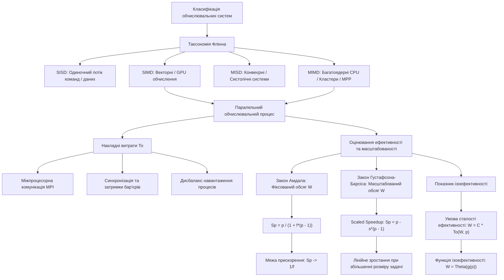

# Тема 1. Архітектури високопродуктивних обчислень та класифікація Флінна. Закони Амдала, Густафсона-Барсіса й показник ізоефективності

## 1. Основний зміст та теоретичний базис

Сучасний етап розвитку комп'ютерної інженерії та системного програмування характеризується вичерпанням можливостей підвищення швидкодії обчислювальних систем за рахунок екстенсивного нарощування тактової частоти одноядерних напівпровідникових процесорів. Фізичні обмеження, зумовлені затримками поширення електромагнітного сигналу в кремнієвих кристалах, критичним зростанням щільності тепловиділення та проявом квантових ефектів на нанометрових масштабах технологічних процесів, обумовили парадигмальний перехід до паралельних та розподілених обчислювальних архітектур. У межах даного освітнього компонента вивчення високопродуктивних обчислень (**High-Performance Computing, HPC**) базується на концепції організації багаторівневого паралелізму, що охоплює апаратні та програмні рішення — від векторних інструкцій на рівні окремого ядра до масивно-паралельних кластерних систем.

Для систематизації різноманіття обчислювальних систем у теорії архітектури ЕОМ використовують таксономію, запропоновану Майклом Флінном у 1966 році. **Класифікація Флінна** базується на концепції поділу інформаційних потоків у системі на два фундаментальні типи: **потік команд** (**Instruction Stream**) — послідовність машинних інструкцій, що виконуються пристроєм керування, та **потік даних** (**Data Stream**) — послідовність операндів, що опрацьовуються арифметично-логічними пристроями. Залежно від кількості та характеру взаємодії цих потоків, Флінн виділив чотири базові класи обчислювальних архітектур:

1. **SISD (Single Instruction Stream, Single Data Stream) — Одиночний потік команд, одиночний потік даних.** Це класична послідовна архітектура фоннейманівського типу. У системі даного класу присутній один пристрій керування, який послідовно вибірає інструкції з пам'яті, та один арифметично-логічний пристрій, що послідовно виконує операції над єдиним потоком операндів. Попри те, що сучасні одноядерні процесори застосовують внутрішньоядерний паралелізм (конвеєризацію, суперскалярність, позапорядок виконання машинних команд), на логічному рівні для здобувачів вищої освіти вони репрезентують класичну SISD-модель.

2. **SIMD (Single Instruction Stream, Multiple Data Stream) — Одиночний потік команд, множинний потік даних.** У даній архітектурі єдиний пристрій керування генерує та декодує командний потік, проте команда одночасно транслюється на безліч векторних або матричних обчислювальних елементів. Кожен із цих елементів виконує одну й ту саму операцію над власним локальним операндом із векторного масиву даних. Спеціалізованими представниками даного класу є графічні процесорні прискорювачі (**GPU**), векторно-конвеєрні суперкомп'ютери, а також розширення векторних інструкцій універсальних процесорів (наприклад, Intel AVX-512, ARM NEON). Модель SIMD вважається базовою для прискорення математичних операцій лінійної алгебри, тензорних перетворень та алгоритмів перцепції у штучному інтелекті.

3. **MISD (Multiple Instruction Stream, Single Data Stream) — Множинний потік команд, одиночний потік даних.** Теоретичний клас системи, у якому декілька автономних пристроїв керування подають власні команди на різні обчислювальні процесори, які паралельно або конвеєрно опрацьовують один і той самий потік вихідних даних. На практиці чистої реалізації MISD-архітектури у масовому обчислювальному сегменті не існує. Проте найближчими конструктивними аналогами цього класу є отказостійкі резервовані обчислювальні комплекси критичного призначення (де кілька процесорів виконують різні алгоритми перевірки над одним потоком датчиків для дублювання результатів) та спеціалізовані систолічні масиви процесорів.

4. **MIMD (Multiple Instruction Stream, Multiple Data Stream) — Множинний потік команд, множинний потік даних.** Найбільш поширений, універсальний та масштабний клас сучасних високопродуктивних систем. У MIMD-архітектурі функціонує множина незалежних процесорних ядер чи обчислювальних вузлів, кожен з яких оснащений власним пристроєм керування та арифметично-логічним блоком. Кожен процесор виконує свій власний потік команд над власною підмножиною потоку даних. Клас MIMD поділяється на системи зі спільною пам'яттю (**Symmetric Multiprocessing, SMP**; **Non-Uniform Memory Access, NUMA**) та системи з розподіленою пам'яттю (масивно-паралельні системи **MPP**, обчислювальні кластери).

Ефективність функціонування паралельних обчислювальних процесів у межах зазначених архітектур визначається не лише піковою продуктивністю апаратних засобів, а й характеристиками самого алгоритму. Процес розпаралелювання алгоритмів неминуче супроводжується появою накладних витрат (**Overhead**), основними складовими яких є:
* накладні витрати на міжпроцесорну комунікацію та передачу повідомлень мережевими каналами;
* часові затримки на синхронізацію паралельних гілок (захист критичних секцій, очікування на бар'єрах);
* витрати на некорисну роботу, пов'язану з дублюванням обчислень або вимушеним простоєм окремих ядер (дисбаланс навантаження).

Для аналітичного оцінювання межевих можливостей прискорення та масштабованості паралельних програм використовуються фундаментальні закони обчислювальних систем: закон Амдала, закон Густафсона-Барсіса та показник ізоефективності Грами-Гупти-Кумара.

---

## 2. Математичний апарат, моделі та аналітичні залежності

Для математичного опису часових характеристик паралельного обчислювального процесу вводиться ряд базових метрик. 

Нехай $T_1(n)$ — час виконання послідовного алгоритму (або паралельного алгоритму на одному процесорі) для задачі розмірністю $n$, а $T_p(n)$ — час виконання того самого алгоритму на обчислювальній системі з $p$ паралельних процесорних ядер.

**Прискорення (Speedup) $S_p(n, p)$** визначається як відношення часу послідовного виконання задачі до часу її паралельного виконання:

$$S_p(n, p) = \frac{T_1(n)}{T_p(n)}$$

де $S_p(n, p)$ — коефіцієнт прискорення (безрозмірна величина), $T_1(n)$ — час виконання послідовної версії програми у секундах ($c$), $T_p(n)$ — час виконання паралельної версії програми на $p$ процесорах у секундах ($c$).

**Ефективність (Efficiency) $E_p(n, p)$** характеризує середню частку корисної роботи, яку виконує кожен із $p$ процесорів під час паралельного обчислення:

$$E_p(n, p) = \frac{S_p(n, p)}{p} = \frac{T_1(n)}{p \cdot T_p(n)}$$

де $E_p(n, p)$ — коефіцієнт ефективності використання паралельної системи ($E_p \in (0, 1]$), $p$ — кількість задіяних процесорних ядер (числове значення, $p \ge 1$).

**Функція накладних витрат (Overhead Function) $T_o(n, p)$** акумулює сумарні часові втрати всіх $p$ процесорів, які не пов'язані безпосередньо з виконанням корисного алгоритму:

$$T_o(n, p) = p \cdot T_p(n) - T_1(n)$$

де $T_o(n, p)$ — сумарний час накладних витрат процесорного часу (людино-секунди або процесоро-секунди, $c$).

### Закон Амдала (Amdahl's Law)
Закон Джина Амдала (1967 р.) оцінює максимально досяжне прискорення програми на паралельній системі за умови **фіксованого обсягу обчислювальної задачі** ($n = \text{const}$).

Припустимо, що послідовний алгоритм можна розбити на дві частки:
1. Послідовну частку $f$ ($0 \le f \le 1$), яка принципово не піддається паралелізації (наприклад, зчитування даних з диска, початкова ініціалізація, послідовна вибірка).
2. Паралельну частку $(1 - f)$, яка може бути рівномірно розподілена між $p$ обчислювальними процесорами.

Тоді загальний час виконання алгоритму на одному процесорі становить $T_1 = f \cdot T_1 + (1 - f) \cdot T_1$. Час виконання на $p$ процесорах без урахування накладних витрат мережі описується формулою:

$$T_p = f \cdot T_1 + \frac{(1 - f) \cdot T_1}{p}$$

Підставляючи дане вираження у формулу прискорення, отримуємо математичне формулювання **Закону Амдала**:

$$S_p = \frac{T_1}{f \cdot T_1 + \frac{(1 - f) \cdot T_1}{p}} = \frac{1}{f + \frac{1 - f}{p}} = \frac{p}{1 + f \cdot (p - 1)}$$

де $S_p$ — коефіцієнт прискорення для фіксованого обсягу задачі, $f$ — частка послідовних (непаралельних) обчислень в алгоритмі ($0 \le f \le 1$), $p$ — кількість процесорних ядер.

Якщо кількість процесорів у системі прямує до нескінченності ($p \to \infty$), то гранично можливе прискорення описується асимптотичною межею Амдала:

$$\lim_{p \to \infty} S_p = S_{\max} = \frac{1}{f}$$

де $S_{\max}$ — асимптотична межа прискорення. Звідси випливає, що якщо алгоритм містить хоча б $f = 10\%$ ($0{,}1$) послідовного коду, то навіть на нескінченній кількості процесорів неможливо отримати прискорення більше ніж у $10$ разів.

### Закон Густафсона-Барсіса (Gustafson-Barsis Law)
Джон Густафсон та Едвін Барсіс (1988 р.) переглянули обмеження Амдала, вказуючи на те, що на практиці зі збільшенням кількості процесорів користувачі не розв'язують задачу фіксованого розміру за менший час, а **збільшують розмірності задачі** ($n \to \infty$) за фіксований часовий інтервал ($T_p = \text{const}$).

Нехай у паралельному запуску на $p$ процесорах час виконання послідовної частини програми становить $s$, а час виконання паралельної частини становить $p_t$. Нормуємо загальний час паралельного виконання до одиниці: $T_p = s + p_t = 1$.

Якщо цю саму масштабовану задачу виконувати послідовно на одному процесорі, то час її виконання $T_1$ дорівнюватиме сумі часу послідовної частини та часу виконання всіх паралельних блоків, виконаних послідовно:

$$T_1 = s + p \cdot p_t = s + p \cdot (1 - s)$$

Тоді **Масштабоване прискорення (Scaled Speedup)** за Густафсоном-Барсісом описується виразом:

$$S_p^s = \frac{T_1}{T_p} = \frac{s + p \cdot (1 - s)}{1} = p - s \cdot (p - 1) = s + p \cdot (1 - s)$$

де $S_p^s$ — масштабоване прискорення за Густафсоном-Барсісом, $s$ — частка часу, витраченого на послідовні обчислення під час паралельного виконання ($0 \le s \le 1$), $p$ — кількість процесорних ядер.

Закон Густафсона-Барсіса демонструє лінійну залежність прискорення від кількості процесорів за умови, що обсяг паралельної роботи зростає пропорційно обчислювальній потужності системи.

### Показник та функція ізоефективності (Isoefficiency Metric)
Концепція ізоефективності (запропонована В. Кумаром та А. Грамою) характеризує **масштабованість (Scalability)** паралельної системи — її здатність підтримувати постійний рівень ефективності $E_p$ при одночасному збільшенні кількості процесорів $p$ та обсягу обчислювальної задачі $W$.

Введемо поняття обсягу корисних обчислень задачі $W$ (Workload), де $W = T_1(n)$ (виражається у кількості базових операцій або одиницях часу).

Рівняння ефективності через $W$ та функцію накладних витрат $T_o(W, p)$ має вигляд:

$$E_p = \frac{S_p}{p} = \frac{W}{p \cdot T_p} = \frac{W}{W + T_o(W, p)} = \frac{1}{1 + \frac{T_o(W, p)}{W}}$$

Щоб ефективність залишалася постійною ($E_p = K = \text{const}$, де $0 < K < 1$), необхідно задовольнити умову:

$$\frac{T_o(W, p)}{W} = \frac{1 - K}{K} \implies W = \left(\frac{K}{1 - K}\right) \cdot T_o(W, p) = C \cdot T_o(W, p)$$

де $C = \frac{K}{1 - K}$ — константа, яка визначається бажаним рівнем ефективності $K$.

Виразивши обсяг робіт $W$ як функцію від кількості процесорів $p$ із співвідношення $W = C \cdot T_o(W, p)$, отримуємо **функцію ізоефективності (Isoefficiency Function)**:

$$W = \Theta(g(p))$$

де $g(p)$ — асимптотична функція зростання обсягу робіт, необхідна для збереження стабільної ефективності $E_p$. Чим повільніше зростає функція $g(p)$ (наприклад, $g(p) = \mathcal{O}(p)$ на відміну від $g(p) = \mathcal{O}(p^3)$), тим більш масштабованою є комбінація паралельного алгоритму та архітектури обчислювальної системи.

---

## 3. Систематизація даних та порівняльний аналіз

Для глибокого порівняльного аналізу архітектурних класів за класифікацією Флінна нижче наведено систематизовані характеристики за ключовими системними параметрами.

| Критерій порівняння | SISD | SIMD | MISD | MIMD |
| :--- | :--- | :--- | :--- | :--- |
| **Кількість потоків команд (Instruction Streams)** | Одиночний (1) | Одиночний (1) | Множинний ($>1$) | Множинний ($>1$) |
| **Кількість потоків даних (Data Streams)** | Одиночний (1) | Множинний ($>1$) | Одиночний (1) | Множинний ($>1$) |
| **Синхронізація обчислень** | Строго послідовна (на рівні ядра) | Строга апаратна синхронізація (Lock-step) | Конвеєрна або фазова | Асинхронна (з явними точками бар'єрів чи передачі даних) |
| **Типова апаратна реалізація** | Одноядерні класичні CPU, мікроконтролери | GPU (NVIDIA CUDA Cores), Векторні прискорювачі, AVX/NEON | Систолічні масиви, дубльовані отказостійкі вузли | Багатоядерні CPU, SMP-сервери, HPC-кластери, MPP |
| **Модель організації пам'яті** | Єдиний локальний адресний простір | Локальні регістрові файли / спільна векторна пам'ять | Спільна локальна пам'ять або конвеєрний канал | Спільна (SMP/NUMA) або Розподілена (Distributed Cluster) |
| **Складність програмування** | Мінімальна (послідовний код) | Середня (векторизація, тензорні оператори, CUDA C++) | Висока (спеціалізовані алгоритми) | Висока (MPI, OpenMP, багатопотоковість, Pthreads) |
| **Основні сфери застосування в AI та системній інженерії** | Базові управляючі скрипти, системні служби OS | Тензорна алгебра, обробка матриць, CNN, Deep Learning | Відбраковка помилок у критикал-системах, DSP-фільтрація | Розподілене навчання великомасштабних LLM, Ray, DDP |

Аналіз даних таблиці показує, що для сучасних задач штучного інтелекту та комп'ютерної інженерії найбільш критичним є гібридне поєднання архітектур **SIMD** та **MIMD**. У подібних конфігураціях масивно-паралельні кластерні вузли (MIMD-рівень) обмінюються між собою градієнтами та вагами моделей через мережеві протоколи передачі повідомлень (MPI), тоді як усередині кожного окремого вузла обчислення матричних згорткових шарів чи операцій Self-Attention розпаралелюються на тисячах масивів векторних ядер GPU (SIMD-рівень).

---

## 4. Візуалізація процесів та структурних зв'язків

Для ілюстрації зв'язку між класифікацією архітектур за Флінном, виникаючими накладними витратами паралелізму та аналітичними законами оцінювання продуктивності нижче наведено оглядову графічну діаграму.

*Рисунок 1 — Структурно-логічна схема класифікації обчислювальних архітектур за Флінном та моделей оцінювання продуктивності паралельних систем*

Діаграма відображає концептуальний перехід від теоретичної класифікації апаратних архітектур за Флінном (вузли `C, D, E, F`) до практичної організації паралельного обчислювального процесу (`G`). При виконанні програмного коду на архітектурах SIMD та MIMD виникають неминучі системні накладні витрати $T_o$ (`H`), викликані затримками комунікаційної мережі (`H1`), затримками на синхронізацію процесів (`H2`) та нерівномірним розподілом робіт (`H3`). 

Для аналізу впливу цих витрат на підсумкову продуктивність застосовуються три взаємодоповнюючі математичні моделі (`I`):
1. **Модель Амдала** (`J`) розглядає випадок строгих обмежень на розмір вихідної задачі ($W = \text{const}$) та встановлює верхню теоретичну межу прискорення $1/f$, обумовлену наявністю послідовного коду.
2. **Модель Густафсона-Барсіса** (`K`) знімає це обмеження, показуючи, що при масштабуванні розмірності задачі пропорційно зростанню кількості процесорів $p$, вплив послідовної частки $s$ компенсується, забезпечуючи майже лінійне зростання продуктивності.
3. **Концепція ізоефективності** (`L`) зв'язує обидва підходи через функцію ізоефективності $W = \Theta(g(p))$, яка дає змогу визначити точний закон зростання обсягу робіт $W$, необхідний для утримання коефіцієнта ефективності $E_p$ на стабільному рівні при нарощуванні кількості обчислювальних вузлів $p$.

---

## 5. Питання для самоперевірки та аналітичного осмислення

1. Здобувач вищої освіти розробив паралельну програму для обробки зображень, у якій частка послідовного коду становить $f = 5\%$. Яке максимально можливе теоретичне прискорення можна отримати на суперкомп'ютері з $1024$ ядрами? Обчисліть ефективність використання даного суперкомп'ютера та поясніть економічну доцільність залучення такої кількості ядер за законом Амдала.
2. У чому полягає фундаментальна відмінність між методологічними передумовами закону Амдала та закону Густафсона-Барсіса? Наведіть приклад інженерної задачі обробки великих даних, для якої застосування закону Густафсона-Барсіса є більш обґрунтованим, ніж застосування закону Амдала.
3. Якщо для паралельного алгоритму множення матриць на розподіленій пам'яті функція ізоефективності становить $W = \Theta(p^{1.5})$, а для іншого алгоритму — $W = \Theta(p \log p)$, який із цих двох алгоритмів володіє кращою масштабованістю при переході від малого кластера до масивно-паралельного суперкомп'ютера? Відповідь обґрунтуйте математично.
4. До якого класу за таксономією Флінна належить графічний прискорювач NVIDIA з архітектурою SIMT (Single Instruction, Multiple Threads)? Порівняйте SIMT із класичною SIMD-архітектурою за критеріями гнучкості ветвлення коду (Instruction Divergence) та управління потоками.
5. Які основні чинники формують функцію накладних витрат $T_o(n, p)$ при реалізації алгоритмів машинного навчання у розподілених кластерах за допомогою бібліотеки `mpi4py`? Як співвідношення між обсягом обчислень та обсягом комунікацій (Communication-to-Computation Ratio) впливає на підсумкову ефективність $E_p$?