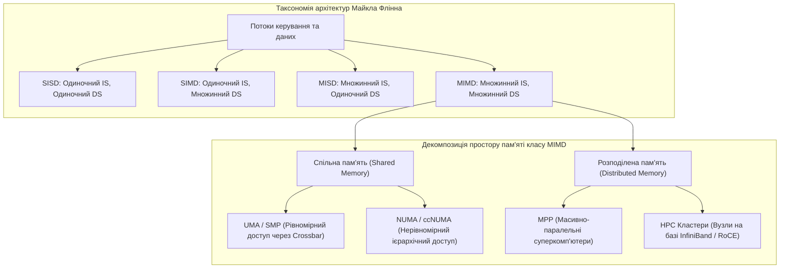
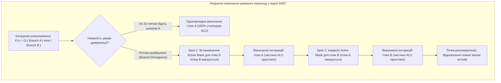
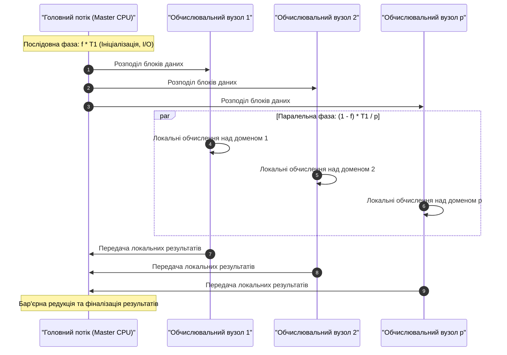
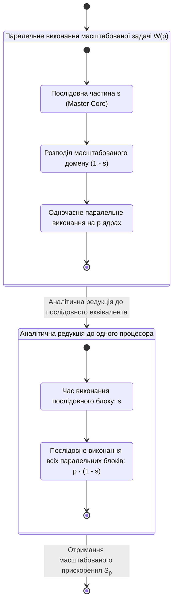
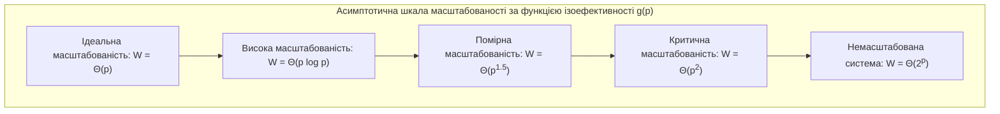
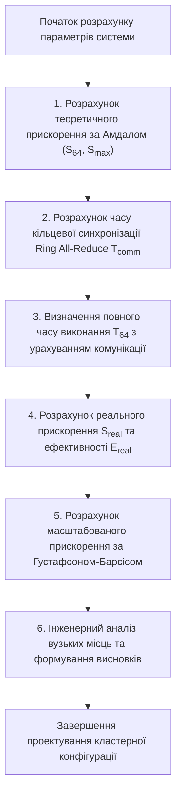

# Тема 1. Архітектури високопродуктивних обчислень та оцінювання ефективності паралелізму. Класифікація Флінна. Закони Амдала, Густафсона-Барсіса, показник ізоефективності.

## Мета лекції

Метою заняття є формування у майбутніх інженерів комплексної системи знань щодо принципів класифікації обчислювальних систем за структурою потоків команд і даних, а також щодо апаратних та системних джерел виникнення накладних витрат у паралельних середовищах. Лекція спрямована на оволодіння строгим математичним апаратом аналітичного оцінювання швидкодії, коефіцієнтів прискорення, ефективності та показників масштабованості паралельних алгоритмів у задачах обробки великих даних і навчання моделей штучного інтелекту.

## Очікувані результати навчання

1. **Знання та розуміння.** Здобувач вищої освіти класифікує апаратні архітектури комп'ютерних систем згідно з таксономією Флінна (SISD, SIMD, MISD, MIMD), ідентифікуючи особливості організації пам'яті (SMP, NUMA, MPP) та специфіку виконання векторно-тензорних операцій у прискорювачах штучного інтелекту.
2. **Застосування.** Здобувач вищої освіти розраховує кількісні характеристики паралельних обчислювальних процесів (абсолютне та масштабоване прискорення, ефективність використання процесорних ядер), застосовуючи аналітичні залежності законів Амдала та Густафсона-Барсіса для заданих параметрів послідовної частки коду.
3. **Аналіз.** Здобувач вищої освіти аналізує структуру функції системних накладних витрат і функцію ізоефективності для оцінки деградації продуктивності при збільшенні кількості обчислювальних вузлів у багатопроцесорних кластерах.
4. **Оцінювання та синтез.** Здобувач вищої освіти оцінює ступінь масштабованості паралельних алгоритмів та формулює обґрунтовані інженерні рекомендації щодо вибору між архітектурами SIMD/SIMT і кластерними MIMD-системами залежно від співвідношення обчислювальної складності та обсягів міжпроцесорного обміну.

---

## Детальний покроковий план лекції

### 1. Теоретичний модуль. Архітектурні класи високопродуктивних обчислень та таксономія Флінна
* 1.1. Фізичні та мікроархітектурні передумови переходу до паралельних обчислень: криза частотного масштабування Денарда, теплове обмеження кристалів і поняття потоків команд та потоків даних.
* 1.2. Систематичний аналіз таксономії Флінна: класифікація архітектур SISD, SIMD, MISD і MIMD, їхні конструктивні особливості та способи організації пам'яті (SMP, NUMA, кластерні середовища).
* 1.3. Реалізація векторно-паралельних обчислень у сучасних апаратних прискорювачах штучного інтелекту: зіставлення векторних інструкцій SIMD і парадигми виконання потоків SIMT на графічних процесорах.
* 1.4. Формалізація джерел системних накладних витрат паралелізму: протокольні комунікації між вузлами, взаємні блокування, затримки бар'єрної синхронізації та алгоритмічний дисбаланс навантаження.

### 2. Аналітичний модуль. Математичні моделі продуктивності, прискорення та масштабованості
* 2.1. Формалізація базових метрик високопродуктивних систем: час паралельного виконання, коефіцієнт абсолютного прискорення, коефіцієнт ефективності та функція сумарних накладних витрат.
* 2.2. Закон Амдала (модель строгої масштабованості): аналітичне виведення формули для задач із фіксованим обсягом робіт, асимптотична межа прискорення та аналіз зниження корисної віддачі процесорів.
* 2.3. Закон Густафсона-Барсіса (модель слабкої масштабованості): виведення формули масштабованого прискорення при фіксованому часі розв'язання задачі та компенсація впливу послідовної частки коду.
* 2.4. Показник та функція ізоефективності Грами-Гупти-Кумара: встановлення критеріїв стабільності коефіцієнта ефективності та асимптотична класифікація масштабованості паралельних систем.

### 3. Практично-розрахунковий кейс. Наскрізна інженерна задача аналізу продуктивності гібридного кластера
**Тема наскрізної задачі.** «Аналітичний розрахунок показників прискорення, ефективності використання обчислювальних ядер та функції ізоефективності при розподіленому навчанні глибокої згорткової нейронної мережі на гібридному CPU-GPU кластері за умов змінного комунікаційного навантаження».

## 1. Фундаментальний теоретичний базис та концептуальні засади

### 1.1. Фізичні та мікроархітектурні передумови переходу до паралельних обчислень

Історичний розвиток обчислювальної техніки протягом кількох десятиліть підпорядковувався емпіричному спостереженню Гордона Мура та закону масштабування Роберта Денарда (**Dennard Scaling**), сформульованому у 1974 році. Згідно з моделлю Денарда, пропорційне зменшення геометричних розмірів польових транзисторів типу метал-оксид-напівпровідник (**MOSFET**) у процесі літографічного виробництва супроводжувалося одночасним зниженням робочої напруги живлення, що дозволяло зберігати постійну щільність розсіювання потужності на одиницю площі напівпровідникового кристала. Завдяки цьому інженери мали змогу експоненційно підвищувати тактову частоту процесорних ядер без виходу за межі допустимих теплових пакетів (**Thermal Design Power, TDP**).

Проте на початку 2000-х років масштабування Денарда зазнало остаточного колапсу на технологічних нормах менше 90 нанометрів. Фізичне витончення підзатворного діелектрика призвело до квантовомеханічного тунелювання електронів та різкого зростання струмів статичного витоку, внаслідок чого статична потужність зрівнялася з динамічною або навіть перевищила її. Сумарне енергоспоживання сучасного цифрового напівпровідникового пристрою описується фундаментальним аналітичним рівнянням:

$$P_{total} = P_{dyn} + P_{stat} = \alpha \cdot C_L \cdot V_{dd}^2 \cdot f + I_{leak} \cdot V_{dd}$$

де:
* $P_{total}$ — повна електрична потужність, яка розсіюється інтегральною мікросхемою у процесі функціонування і вимірюється у ватах ($W$).
* $P_{dyn}$ — динамічна складова потужності розсіювання, зумовлена перезаряджанням ємностей логічних вентилів, що вимірюється у ватах ($W$).
* $P_{stat}$ — статична складова потужності розсіювання, обумовлена струмами витоку через закриті транзисторні структури, що вимірюється у ватах ($W$).
* $\alpha$ — коефіцієнт активності перемикання вентилів, який відображає ймовірність зміни логічного стану схеми за один такт і є безрозмірною величиною в діапазоні $[0, 1]$.
* $C_L$ — еквівалентна паразитна ємність електричного навантаження кола, яка вимірюється у фарадах ($F$).
* $V_{dd}$ — напруга постійного живлення напівпровідникової інтегральної схеми, яка вимірюється у вольтах ($V$).
* $f$ — робоча тактова частота процесорного ядра, яка вимірюється у герцах ($Hz$).
* $I_{leak}$ — сумарний струм паразитного статичного витоку, що протікає крізь структуру транзистора за відсутності перемикання і вимірюється в амперах ($A$).

Неможливість подальшого зниження напруги живлення $V_{dd}$ через наближення до фізичного порогу спрацьовування транзистора викликала явище «теплової стіни» (**Power Wall**), за якої екстенсивне нарощування тактової частоти понад 4–5 ГГц призводить до катастрофічного теплового руйнування кристала. 

Одночасно виникла криза «стіни паралелізму інструкцій» (**ILP Wall**), викликана вичерпанням ефективності апаратних механізмів динамічного позачергового виконання команд (**Out-of-Order Execution**), конвеєризації та спектрального передбачення переходів. 

Третім стримуючим фактором стала «стіна пам'яті» (**Memory Wall**), спричинена хронічним відставанням темпів зростання пропускної здатності та затримок доступу динамічної оперативної пам'яті (**DRAM**) від пікової обчислювальної продуктивності арифметично-логічних пристроїв (**ALU**). 

Сукупність цих трьох фізичних та мікроархітектурних бар'єрів обумовила парадигмальний перехід комп'ютерної інженерії від нарощування частоти одноядерних процесорів до проектування багатоядерних, векторних та просторово розподілених обчислювальних систем.

---

### 1.2. Систематичний аналіз таксономії Флінна та архітектури організації пам'яті

Для класифікації паралельних обчислювальних середовищ фундаментальне значення має таксономія Майкла Флінна, запропонована у 1966 році. В основу класифікації покладено концепцію декомпозиції інформаційних потоків на потік машинних команд (**Instruction Stream, IS**) — послідовність операцій, що генеруються та інтерпретуються пристроями керування, та потік операндів (**Data Stream, DS**) — сукупність даних, що надходять до обчислювальних блоків для перетворення.

Математично взаємодію між пристроями керування ($CU$), обчислювальними елементами ($PE$) та потоками пам'яті у квадрантах Флінна можна звести до чотирьох архітектурних схем:

1. **SISD (Single Instruction, Single Data)** репрезентує класичну фоннейманівську парадигму, в якій єдиний керуючий блок обирає послідовний потік команд із пам'яті та транслює його на єдиний арифметичний процесор, що послідовно обробляє одиничні скалярні значення.
2. **SIMD (Single Instruction, Multiple Data)** характеризується наявністю єдиного центрального декодера інструкцій, який транслює одну й ту саму машинну команду одночасно на просторовий масив однакових обчислювальних елементів, де кожен блок опрацьовує свій локальний елемент вектора даних у режимі жорсткої апаратної синхронізації (**Lock-step**).
3. **MISD (Multiple Instruction, Single Data)** становить спеціалізовану схему, в якій кілька незалежних блоків керування подають різні команди на різні процесорні елементи, які одночасно або конвеєрно обробляють один спільний потік вхідних даних (використовується в систолічних масивах і мажоритарно-резервованих авіаційних контролерах).
4. **MIMD (Multiple Instruction, Multiple Data)** є найбільш універсальним та масштабованим класом, де множина повністю автономних процесорних ядер виконує власні асинхронні потоки інструкцій над просторово рознесеними потоками даних.

| Клас архітектури за Флінном | Тип керуючого тракту ($CU$) | Тип обчислювального тракту ($PE$) | Топологія пам'яті | Рівень апаратного паралелізму | Основна програмна парадигма |
| :--- | :--- | :--- | :--- | :--- | :--- |
| **SISD** | Одиночний централізований блок | Одиночний скалярний $ALU$ | Єдиний банк оперативної пам'яті | Внутрішньоконвеєрний (ILP) | Послідовне імперативне програмування |
| **SIMD** | Одиночний широкомовний декодер | Паралельний масив векторних $ALU$ | Спільний векторний регістровий файл | Векторний / Тензорний паралелізм даних | Векторизація, автовекторизація компілятора |
| **MISD** | Множина гетерогенних блоків | Конвеєрні або систолічні вузли | Спільний потік регістрового зсуву | Спеціалізований потоковий конвеєр | Апаратно-конфігуровані потоки |
| **MIMD (SMP/NUMA)** | Множина повністю автономних $CU$ | Множина універсальних ядер $CPU$ | Спільний фізичний адресний простір | Багатопотоковість на рівні ядер | Багатопотоковість OpenMP, POSIX Threads |
| **MIMD (MPP/Cluster)**| Автономні $CU$ у кожному вузлі | Автономні процесорні модулі | Фізично ізольована локальна пам'ять | Розподілений паралелізм процесів | Модель передачі повідомлень (MPI) |

У межах класу **MIMD** ключова відмінність полягає в організації адресного простору пам'яті:
* Системи **SMP (Symmetric Multiprocessing)** використовують архітектуру **UMA (Uniform Memory Access)**, де всі процесори мають однаковий фізичний час доступу до будь-якої комірки пам'яті через спільну системну шину або матричний комутатор (**Crossbar switch**), що накладає жорстке обмеження на масштабування до 32–64 ядер через перевантаження шини.
* Системи **NUMA (Non-Uniform Memory Access)** поділяють фізичну пам'ять між процесорними сокетами: звернення ядра до власного локального контролера пам'яті відбувається з мінімальною затримкою, тоді як доступ до пам'яті сусіднього сокета здійснюється через спеціалізовані когерентні інтерконекти (наприклад, Intel UPI, AMD Infinity Fabric) із суттєво вищою латентністю.
* Системи з розподіленою пам'яттю (**Distributed Memory Clusters / MPP**) повністю позбавлені апаратної підтримки єдиного адресного простору, внаслідок чого взаємодія між обчислювальними вузлами реалізується виключно шляхом передачі пакетів повідомлень через високошвидкісні комунікаційні мережі (наприклад, InfiniBand зі швидкістю 400–800 Гбіт/с).

---

### 1.3. Векторно-паралельні обчислення: SIMD проти моделі виконання SIMT

Для прискорення задач лінійної алгебри, обробки сигналів та глибокого навчання сучасні обчислювальні системи реалізують два принципово різні підходи до обробки множинних потоків даних: класичний **SIMD** та багатопотоковий **SIMT (Single Instruction, Multiple Threads)**.

Класична архітектура **SIMD** (наприклад, набори інструкцій Intel AVX-512 або ARM SVE) функціонує на рівні розширеного регістрового файлу одного процесорного ядра. Програміст або оптимізуючий компілятор формує спеціальні векторні інструкції, які завантажують широкі регістри (наприклад, 512-бітний регістр `zmm`, що містить 16 чисел одинарної точності `float32`) та виконують над ними паралельну арифметичну операцію за фіксовану кількість тактів.

На противагу цьому, архітектура **SIMT**, запропонована для графічних процесорів (**GPU**), поєднує парадигму SIMD із масивною багатопотоковістю. У моделі SIMT інженер розробляє програму в термінах виконання одиночного скалярного потоку (**Thread**), який оперує індивідуальними скалярними регістрами. Проте апаратний планувальник потокового мультипроцесора (**Streaming Multiprocessor, SM**) динамічно об'єднує 32 логічні потоки у неподільну апаратну одиницю виконання — варп (**Warp**). Усі 32 потоки варпа транслюються на масив обчислювальних ядер (**CUDA Cores / ALU**) і виконують одну й ту саму інструкцію паралельно, що суттєво спрощує мікроархітектуру пристрою керування, зменшуючи накладні витрати на декодування команд.

Критичним недоліком моделі SIMT є явище дивергенції гілок керування (**Branch Divergence**). Якщо потоки всередині одного варпа приймають різні шляхи умовного переходу (наприклад, оператор `if-else`), апаратний конвеєр не може виконати обидві гілки паралельно, оскільки керуючий блок транслює лише один потік команд. У такому разі відбувається послідовна серіалізація виконання гілок: спочатку активуються потоки, що задовольнили умову `true` (при цьому решта потоків маскується і простоює), після чого маска інвертується, і виконуються інструкції гілки `false`.

Математично коефіцієнт апаратної утилізації обчислювальних ядер під час виникнення дивергенції варпа формалізується наступним чином:

$$\eta_{warp} = \frac{\sum_{j=1}^{M} |T_{active, j}|}{M \cdot |W_{size}|}$$

де:
* $\eta_{warp}$ — безрозмірний коефіцієнт ефективності утилізації паралельних процесорних ядер у складі мультипроцесора під час виконання дивергентного блоку ($0 < \eta_{warp} \le 1$).
* $M$ — загальна кількість взаємовиключних гілок умовного переходу, на які розділився потік керування всередині варпа (ціле число, $M \ge 2$).
* $|T_{active, j}|$ — кількість паралельних потоків, які є активними під час апаратного проходження $j$-ї гілки коду (ціле число в діапазоні $[1, |W_{size}|]$).
* $|W_{size}|$ — фіксований апаратний розмір варпа обчислювальної архітектури, який становить строго 32 потоки для сучасних мікроархітектур графічних прискорювачів.

> **ТИПОВА ПОМИЛКА:** Початківці часто ототожнюють парадигму SIMT із класичним багатопотоковим виконанням на рівні операційної системи (наприклад, потоки POSIX у MIMD-системах), вважаючи, що кожен потік на GPU має абсолютно незалежний лічильник команд (**Program Counter**). Насправді фізичний лічильник команд є спільним для всього варпа з 32 потоків. Будь-яке розгалуження алгоритму призводить не до паралельного проходження різних ділянок коду, а до послідовної серіалізації гілок із маскуванням неактивних ядер, що знижує пікову швидкодію ядра у кілька разів.

---

### 1.4. Декомпозиція та формалізація джерел системних накладних витрат

Перехід від теоретичної пікової продуктивності паралельної обчислювальної системи до її реальної швидкодії визначається величиною системних накладних витрат (**Overhead**), які супроводжують декомпозицію та координацію обчислювальних процесів. 

Загальний час розв'язання складної задачі на розподіленій обчислювальній системі з $p$ процесорних вузлів є суперпозицією корисного обчислювального часу та ряду системних затримок:

$$T_p = T_{comp} + T_{comm} + T_{sync} + T_{imbal} + T_{cont}$$

де:
* $T_p$ — повний фізичний час виконання алгоритму на паралельній конфігурації з $p$ вузлів, що вимірюється у секундах ($s$).
* $T_{comp}$ — чистий корисний час обчислень, що витрачається арифметично-логічними пристроями найдовше працюючого процесора, що вимірюється у секундах ($s$).
* $T_{comm}$ — сумарний час міжпроцесорних комунікацій, витрачений на серіалізацію, мережеву маршрутизацію та передачу повідомлень, що вимірюється у секундах ($s$).
* $T_{sync}$ — часові втрати на синхронізацію процесів (очікування на спільних бар'єрах або блокування критичних секцій м'ютексами), що вимірюються у секундах ($s$).
* $T_{imbal}$ — часові втрати, спричинені дисбалансом обчислювального навантаження між різними вузлами системи, що вимірюються у секундах ($s$).
* $T_{cont}$ — накладні витрати конфліктів шини, когерентності кеш-пам'яті та арбітражу пам'яті при одночасному зверненні кількох ядер до спільного ресурсу, що вимірюються у секундах ($s$).

Найбільш критичною складовою у розподілених MIMD-системах є комунікаційні витрати $T_{comm}$. Для їхньої аналітичної оцінки використовують класичну модель Хокні (**Hockney Model**), що описує час пересилання одного пакету даних між двома обчислювальними вузлами через двоточковий канал зв'язку:

$$T_{comm}(m) = \alpha + \beta \cdot m = \alpha + \frac{m}{B}$$

де:
* $T_{comm}(m)$ — загальний час, необхідний для передачі повідомлення розміром $m$ байт між парою вузлів, що вимірюється у секундах ($s$).
* $\alpha$ — латентність запуску комунікації (час, необхідний для генерації заголовків пакетів, переривань операційної системи та ініціалізації транзакції контролером мережі), що вимірюється у секундах ($s$).
* $\beta$ — час передачі одного байта інформації мережевим середовищем, що є величиною, оберненою до пропускної здатності каналу, і вимірюється у секундах на байт ($s/B$).
* $m$ — розмір корисного навантаження інформаційного повідомлення, що вимірюється у байтах ($B$).
* $B$ — максимальна фізична пропускна здатність комунікаційного інтерфейсу між обчислювальними вузлами, яка вимірюється у байтах на секунду ($B/s$).

Іншим суттєвим джерелом деградації швидкодії є дисбаланс обчислювального навантаження (**Load Imbalance**), спричинений нерівномірним розподілом даних між процесорами або недетермінованим часом збіжності ітераційних алгоритмів штучного інтелекту. Якщо процесорний вузол $i$ виконує обчислення за час $T_{comp, i}$, то через необхідність глобальної синхронізації всі процесори системи будуть очікувати завершення роботи найповільнішого вузла, що формалізується коефіцієнтом дисбалансу:

$$\lambda_{imbal} = \frac{\max_{i \in \{1,\dots,p\}} (T_{comp, i}) - \bar{T}_{comp}}{\bar{T}_{comp}}$$

де:
* $\lambda_{imbal}$ — безрозмірний коефіцієнт нерівномірності навантаження обчислювальних ядер у паралельній системі ($\lambda_{imbal} \ge 0$).
* $\max_{i}(T_{comp, i})$ — максимальний час виконання обчислень серед усіх задіяних $p$ ядер системи, що вимірюється у секундах ($s$).
* $\bar{T}_{comp}$ — середній арифметичний час корисної обчислювальної роботи одного процесора, що становить $\frac{1}{p}\sum_{i=1}^p T_{comp, i}$ і вимірюється у секундах ($s$).

```mermaid
gantt
    title Часова діаграма ітерації паралельного процесу з дисбалансом
    dateFormat X
    axisFormat %s
    
    section Вузол 1
        Корисні обчислення Tcomp,1     :active, p1a, 0, 4
        Комунікація Tcomm              :crit, p1b, 4, 6
        Очікування бар'єру Tsync,1     :done, p1c, 6, 10
        
    section Вузол 2 (Крит)
        Корисні обчислення Tcomp,2 MAX :active, p2a, 0, 8
        Комунікація Tcomm              :crit, p2b, 8, 10
        
    section Вузол 3
        Корисні обчислення Tcomp,3     :active, p3a, 0, 5
        Комунікація Tcomm              :crit, p3b, 5, 7
        Очікування бар'єру Tsync,3     :done, p3c, 7, 10
```

> **КОНТРОЛЬНЕ ПИТАННЯ.** Чому при передачі великої кількості дрібних повідомлень ($m \to 0$) сумарна продуктивність кластера різко падає порівняно з передачею одного монолітного масиву еквівалентного сумарного обсягу? Який параметр моделі Хокні виступає домінуючим фактором деградації швидкодії?

Розгорнути відповідь

При передачі множини дрібних повідомлень підсумковий час комунікації масштабується як $K \cdot \alpha + \beta \sum m_i$, де $K$ — загальна кількість відправлених пакетів. Якщо розмір кожного повідомлення $m$ прямує до нуля, складова передачі корисного обсягу $\beta \cdot m$ стає зникаюче малою порівняно зі статичною латентністю ініціалізації з'єднання $\alpha$. 

Домінуючим фактором деградації виступає саме параметр латентності $\alpha$ (мережевий оверхед створення буферів, системні виклики ядра OS, встановлення сесій контролера мережевої карти). Для нівелювання цього ефекту в інженерній практиці застосовують алгоритми агрегації та батчингу повідомлень (Message Packing / Tensor Fusion), що мінімізує кількість операцій виклику комунікаційного інтерфейсу та максимізує ефективне використання пропускної здатності $B$.

---

### Вказівки для самостійного осмислення теоретичного базису
1. Зверніть увагу на якісну відмінність між векторними розширеннями процесорів (SIMD) та графічними прискорювачами (SIMT): у SIMD ширина вектора жорстко задається машинною командою на рівні одного ядра, тоді як у SIMT паралелізм забезпечується апаратним об'єднанням десятків незалежних скалярних потоків планувальником варпів.
2. Проаналізуйте топологічну різницю між архітектурами NUMA та розподіленими кластерами: якщо в NUMA фізична віддаленість пам'яті маскується спільним адресним простором на апаратному рівні контролерів шини, то в MPP-кластерах адресація ізольована, а будь-яка взаємодія вимагає явного використання комунікаційних протоколів передачі даних.

## 2. Аналітичні процеси, математичний апарат та моделювання

### 2.1. Формалізація метричного простору паралельних обчислювальних систем

Для аналітичного дослідження динаміки функціонування паралельних алгоритмів на багатопроцесорних архітектурах вводиться формальний простір метрик, що кількісно описує часові витрати, ступінь прискорення обчислень та ефективність утилізації доступного апаратного ресурсу.

Нехай $W$ позначає обчислювальний обсяг задачі (**Workload**), визначений як загальна кількість елементарних базових операцій, необхідних для повного розв'язання задачі. Якщо $T_1(W)$ є фізичним часом виконання послідовного алгоритму на одному процесорному елементі, а $T_p(W)$ — часом виконання паралельної версії даного алгоритму на конфігурації з $p$ однорідних обчислювальних ядер, то базові аналітичні показники визначаються наступним чином.

**Коефіцієнт абсолютного прискорення (Speedup) $S_p(W)$** є безрозмірною величиною, яка відображає кратність скорочення часу виконання задачі за рахунок залучення $p$ обчислювачів:

$$S_p(W) = \frac{T_1(W)}{T_p(W)}$$

де:
* $S_p(W)$ — коефіцієнт прискорення алгоритму на системі з $p$ процесорних ядер (безрозмірна величина, $S_p \ge 0$).
* $T_1(W)$ — час виконання алгоритму на одному процесорі, вимірюваний у секундах ($s$).
* $T_p(W)$ — час виконання паралельного алгоритму на $p$ обчислювальних ядрах, вимірюваний у секундах ($s$).
* $W$ — обчислювальний обсяг задачі, виражений у кількості операцій з рухомою комою (**FLOP**) або одиницях часу.

**Коефіцієнт ефективності (Efficiency) $E_p(W)$** визначає частку корисної роботи, що припадає на одиницю залученого обчислювального ресурсу:

$$E_p(W) = \frac{S_p(W)}{p} = \frac{T_1(W)}{p \cdot T_p(W)}$$

де:
* $E_p(W)$ — коефіцієнт ефективності паралельної обчислювальної системи (безрозмірна величина, типово $E_p \in (0, 1]$).
* $p$ — загальна кількість задіяних паралельних процесорних ядер або обчислювальних вузлів (ціле додатне число, $p \ge 1$).

**Функція сумарних накладних витрат (Total Overhead Function) $T_o(W, p)$** акумулює сукупні часові втрати всіх $p$ процесорів, зумовлені міжпроцесорною комунікацією, простоєм у точках синхронізації та системним арбітражем:

$$T_o(W, p) = p \cdot T_p(W) - T_1(W)$$

де:
* $T_o(W, p)$ — сумарний час системних накладних витрат процесорного ресурсу, що вимірюється у процесоро-секундах ($s$).

Шляхом підстановки виразу для $T_o(W, p)$ у формулу коефіцієнта ефективності отримується канонічний взаємозв'язок між накладними витратами та корисною ефективністю:

$$E_p(W) = \frac{T_1(W)}{T_1(W) + T_o(W, p)} = \frac{1}{1 + \frac{T_o(W, p)}{T_1(W)}} = \frac{1}{1 + \frac{T_o(W, p)}{W}}$$

> **ВАЖЛИВО:** В ідеальному теоретичному випадку за відсутності будь-яких накладних витрат ($T_o = 0$) прискорення є строго лінійним ($S_p = p$), а ефективність становить $E_p = 1$. Проте в реальних архітектурах через зростання $T_o(W, p)$ похідна $\frac{\partial E_p}{\partial p} < 0$, що зумовлює монотонну деградацію ефективності зі зростанням числа ядер. Винятком є феномен **суперлінійного прискорення** ($S_p > p, E_p > 1$), який виникає виключно внаслідок апаратних аномалій, зокрема різкого збільшення сукупного обсягу кеш-пам'яті рівня L2/L3 при об'єднанні $p$ процесорів, що дозволяє повністю уникнути повільних звернень до DRAM.

---

### 2.2. Закон Амдала та аналітична модель строгої масштабованості

Модель строгої масштабованості (**Strong Scaling**) досліджує поведінку системи за умови фіксації загального обсягу обчислювальної задачі ($W = \text{const}$). 

Закон Джина Амдала базується на фундаментальному припущенні, що будь-який послідовний алгоритм складається з двох взаємовиключних часток:
1. Строго послідовної частки $f \in [0, 1]$, виконання якої неможливо декомпозувати на незалежні гілки через причинно-наслідкові залежності за даними.
2. Паралельної частки $(1 - f)$, яка може бути рівномірно і без додаткових комунікаційних витрат розподілена між $p$ обчислювальними процесорами.

#### Покрокове аналітичне виведення Закону Амдала

$$
\begin{aligned}
\text{Етап 1 (Декомпозиція часу послідовного запуску):} & \quad T_1 = f \cdot T_1 + (1 - f) \cdot T_1 \\
\text{Етап 2 (Моделювання часу виконання на p ядрах):} & \quad T_p = f \cdot T_1 + \frac{(1 - f) \cdot T_1}{p} \\
\text{Етап 3 (Формування відношення коефіцієнта прискорення):} & \quad S_p = \frac{T_1}{T_p} = \frac{T_1}{f \cdot T_1 + \frac{(1 - f) \cdot T_1}{p}} \\
\text{Етап 4 (Скорочення базового параметра T1):} & \quad S_p = \frac{1}{f + \frac{1 - f}{p}} \\
\text{Етап 5 (Зведення до канонічної алгебраїчної форми):} & \quad S_p = \frac{p}{1 + f \cdot (p - 1)}
\end{aligned}
$$

З логіки аналітичних перетворень випливає, що при необмеженому збільшенні кількості обчислювальних ядер у системі ($p \to \infty$) паралельна компонента $\frac{1 - f}{p}$ асимптотично прямує до нуля. Це формує фундаментальну **асимптотичну межу Амдала**:

$$S_{\max} = \lim_{p \to \infty} S_p = \lim_{p \to \infty} \left( \frac{1}{f + \frac{1 - f}{p}} \right) = \frac{1}{f}$$

де:
* $S_{\max}$ — теоретична верхня межа прискорення, яка визначається виключно внутрішньою топологією алгоритму і не може бути подолана за будь-яких масштабів апаратного комплексу.
* $f$ — частка непаралельного (послідовного) коду в загальній структурі програми ($0 < f \le 1$).

Аналіз поведінки коефіцієнта ефективності у моделі Амдала розкриває природу катастрофічної деградації утилізації ресурсів:

$$E_p = \frac{S_p}{p} = \frac{1}{1 + f \cdot (p - 1)} \implies \lim_{p \to \infty} E_p = 0 \quad (\forall f > 0)$$

Це свідчить про те, що для задач фіксованого розміру екстенсивне нарощування кількості ядер $p$ призводить до того, що абсолютна більшість обчислювачів простоює, очікуючи завершення послідовного блоку $f \cdot T_1$, зводячи підсумкову ефективність інвестицій в апаратне забезпечення до нуля.

---

### 2.3. Закон Густафсона-Барсіса та парадигма слабкої масштабованості

Криза моделі строгої масштабованості спонукала Джона Густафсона та Едвіна Барсіса (1988 р.) переглянути базову парадигму оцінювання продуктивності. Вони зазначили, що в інженерній та науковій практиці зі збільшенням доступних обчислювальних ресурсів дослідники не прагнуть зменшити час розрахунку фіксованої задачі, а натомість **збільшують дискретизацію, роздільну здатність або фізичний обсяг моделі**, утримуючи загальний час обчислень сталим ($T_p = \text{const}$).

Дана концепція отримала назву моделі слабкої масштабованості. Нехай під час виконання масштабованої задачі на системі з $p$ процесорів виміряний час становить $T_p = 1$ (нормована часова одиниця). У цьому паралельному часі частка $s \in [0, 1]$ припадає на виконання послідовних операцій, а частка $(1 - s)$ витрачається на паралельну роботу на всіх $p$ вузлах.

#### Покрокове аналітичне виведення Закону Густафсона-Барсіса

$$
\begin{aligned}
\text{Етап 1 (Нормування паралельного часу виконання):} & \quad T_p = s + (1 - s) = 1 \\
\text{Етап 2 (Оцінка еквівалентного послідовного часу T1):} & \quad T_1 = s + p \cdot (1 - s) \\
\text{Етап 3 (Формування відношення масштабованого прискорення):} & \quad S_p^s = \frac{T_1}{T_p} = \frac{s + p \cdot (1 - s)}{1} \\
\text{Етап 4 (Алгебраїчна факторизація відносно параметра p):} & \quad S_p^s = s + p - p \cdot s = p - s \cdot (p - 1)
\end{aligned}
$$

де:
* $S_p^s$ — масштабований коефіцієнт прискорення за Густафсоном-Барсісом (**Scaled Speedup**).
* $s$ — виміряна частка послідовного коду в паралельному часі виконання алгоритму на $p$ процесорах ($0 \le s \le 1$).
* $p$ — кількість процесорних ядер у системі ($p \ge 1$).

Аналіз виведеної лінійної залежності показує принципову відмінність від закону Амдала. Коефіцієнт масштабованого прискорення зростає лінійно зі зростанням кількості процесорів $p$, при цьому кутовий коефіцієнт нахилу прямої становить $(1 - s)$. 

Масштабована ефективність у парадигмі Густафсона-Барсіса набуває вигляду:

$$E_p^s = \frac{S_p^s}{p} = \frac{p - s \cdot (p - 1)}{p} = 1 - s \cdot \left( \frac{p - 1}{p} \right)$$

Обчислення граничного значення при $p \to \infty$ демонструє відсутність асимптотичного колапсу утилізації ядер:

$$\lim_{p \to \infty} E_p^s = \lim_{p \to \infty} \left[ 1 - s \cdot \left( 1 - \frac{1}{p} \right) \right] = 1 - s$$

Таким чином, якщо частка послідовного коду в паралельному запуску становить, наприклад, $s = 0{,}05$ (5%), то навіть при масштабуванні системи до десятків тисяч обчислювальних ядер підсумкова ефективність алгоритму ніколи не впаде нижче $95\%$, за умови збереження постійного часу розв'язання задачі за рахунок розширення її розмірності.

---

### 2.4. Теорія ізоефективності Грами-Гупти-Кумара та аналітичні межі масштабованості

Попри оптимістичні висновки закону Густафсона-Барсіса, він не враховує реального зростання міжпроцесорних накладних витрат $T_o(W, p)$, які є нелінійними функціями як від обсягу обчислень $W$, так і від топології інтерконекту $p$. Для строгой формалізації масштабованості обчислювальної системи Аніндо Грама, Віпін Кумар та Ашок Гупта запропонували **метрику ізоефективності (Isoefficiency Metric)**.

За визначенням, паралельна система вважається масштабованою, якщо при збільшенні кількості процесорів $p$ існує можливість підтримувати фіксований коефіцієнт корисної ефективності $E_p = K = \text{const}$ (де $0 < K < 1$) шляхом відповідного збільшення обчислювального обсягу задачі $W$.

#### Аналітичне виведення базового рівняння ізоефективності

$$
\begin{aligned}
\text{Етап 1 (Запис рівняння ефективності через накладні витрати):} & \quad E_p = \frac{W}{W + T_o(W, p)} = K \\
\text{Етап 2 (Перетворення пропорції та розкриття дужок):} & \quad W = K \cdot W + K \cdot T_o(W, p) \\
\text{Етап 3 (Групування складових з невідомим обсягом W):} & \quad W \cdot (1 - K) = K \cdot T_o(W, p) \\
\text{Етап 4 (Ізоляція обсягу роботи як цільової функції):} & \quad W = \left( \frac{K}{1 - K} \right) \cdot T_o(W, p) \\
\text{Етап 5 (Введення ізоефективної константи C):} & \quad W = C \cdot T_o(W, p), \quad \text{де } C = \frac{K}{1 - K} = \text{const}
\end{aligned}
$$

Рівняння $W = C \cdot T_o(W, p)$ є неявним функціональним співвідношенням. Розв'язавши його відносно $W$, отримують **функцію ізоефективності**:

$$W = \Theta(g(p))$$

де $g(p)$ — асимптотична функція, яка визначає мінімальний темп зростання обчислювального навантаження, необхідний для компенсації системних накладних витрат при переході на систему з $p$ ядер.

Математичний аналіз функції $g(p)$ дозволяє оцінити вимоги паралельного алгоритму до пам'яті окремого обчислювального вузла. Нехай $M(W)$ — обсяг оперативної пам'яті, необхідний для зберігання даних задачі обсягом $W$. Тоді обсяг пам'яті на один процесор $M_{proc}$ для збереження ізоефективності становить:

$$M_{proc}(p) = \frac{M(\Theta(g(p)))}{p}$$

1. Якщо $W = \Theta(p)$, а обсяг пам'яті лінійно залежить від задачі ($M(W) = \Theta(W)$), то $M_{proc}(p) = \Theta(p) / p = \Theta(1)$. Це означає, що вимоги до локальної пам'яті вузла залишаються сталими, а алгоритм має найвищий рівень архітектурної масштабованості.
2. Якщо $W = \Theta(p^2)$, то $M_{proc}(p) = \Theta(p^2) / p = \Theta(p)$. У цьому випадку збереження сталої ефективності вимагає лінійного нарощування обсягу RAM на кожному вузлі кластера, що на практиці призводить до вичерпання фізичної пам'яті системи при досягненні критичного значення $p$.

---

### 2.5. Систематичний порівняльний аналіз аналітичних моделей

Для структуризації теоретичного базису та чіткого розмежування інженерних сфер застосування розглянутих математичних концепцій нижче наведено аналітичну матрицю зіставлення моделей продуктивності.

| Аналітичний критерій | Закон Амдала (Strong Scaling) | Закон Густафсона-Барсіса (Weak Scaling) | Метрика ізоефективності Кумара-Грами |
| :--- | :--- | :--- | :--- |
| **Цільова оптимізаційна парадигма** | Мінімізація часу розв'язання задачі ($T_p \to \min$) | Максимізація точності або роздільної здатності за сталий час | Оптимізація утилізації обчислювальних ресурсів кластера |
| **Гіпотеза щодо обсягу робіт ($W$)** | Строго константний: $W = \text{const}$ | Масштабований лінійно: $W(p) \propto p$ | Динамічний: $W = C \cdot T_o(W, p)$ |
| **Гіпотеза щодо часу виконання ($T_p$)** | Зменшується зі зростанням $p$ до межі $f \cdot T_1$ | Строго фіксований: $T_p = \text{const}$ | Може варіюватися залежно від обраного $K$ |
| **Аналітичний вираз прискорення** | $S_p = \frac{p}{1 + f(p - 1)}$ | $S_p^s = p - s(p - 1)$ | $S_p = K \cdot p$ (за умови $W = \Theta(g(p))$) |
| **Асимптотична межа прискорення ($p \to \infty$)** | Константна верхня межа: $S_{\max} = \frac{1}{f}$ | Лінійне нескінченне зростання: $S_p^s \to \infty$ | Лінійне зростання вздовж кривої ізоефективності |
| **Врахування комунікаційних витрат ($T_o$)** | Не враховуються (ідеалізований розподіл) | Не враховуються напряму (неявні у параметрі $s$) | Повне аналітичне врахування комунікацій та синхронізацій |
| **Типова сфера інженерного проектування** | Оцінка прискорення рендерінгу, обробки одиночних кадрів | Навчання нейромереж на гігантських датасетах, кліматичне моделювання | Проектування топології суперкомп'ютерних кластерів, вибір комутаторів |

> **КОНТРОЛЬНЕ ПИТАННЯ.** Розглядається алгоритм розподіленого множення щільних матриць розміром $N \times N$ на сітці з $p$ процесорів (алгоритм Кеннона), для якого обчислювальна складність становить $W = \Theta(N^3)$, а накладні комунікаційні витрати пересилання блоків описуються функцією $T_o(W, p) = \Theta(N^2 \sqrt{p})$. Визначте аналітичний вигляд функції ізоефективності $g(p)$ та оцініть масштабованість даного алгоритму з точки зору споживання локальної пам'яті одного процесора.

Розгорнути аналіз відповіді

Для визначення функції ізоефективності скористаємося базовою умовою стабільності ефективності: $W = C \cdot T_o(W, p)$.

1. Підставимо параметричні вирази обчислювальної складності та комунікаційних втрат у вихідне співвідношення:
   $$N^3 = C \cdot N^2 \sqrt{p}$$
2. Скоротимо обидві частини рівняння на спільний множник $N^2$:
   $$N = C \cdot \sqrt{p}$$
3. Підставимо отриманий вираз для розмірності матриці $N$ у функцію загального обсягу обчислювальної роботи $W$:
   $$W = \Theta(N^3) = \Theta\left((C \cdot \sqrt{p})^3\right) = \Theta(p^{1.5}) = \Theta(p \sqrt{p})$$

Таким чином, функція ізоефективності має вигляд $W = \Theta(p^{1.5})$.

Для оцінки споживання локальної пам'яті врахуємо, що зберігання двох вхідних та однієї результуючої матриць розміром $N \times N$ вимагає загального обсягу пам'яті $M(W) = \Theta(N^2) = \Theta(p)$. Тоді питомий обсяг оперативної пам'яті на один процесорний вузол кластера становить:
$$M_{proc}(p) = \frac{M(W)}{p} = \frac{\Theta(p)}{p} = \Theta(1)$$

Оскільки $M_{proc}(p) = \Theta(1) = \text{const}$, вимоги до обсягу пам'яті кожного окремого вузла не залежать від кількості процесорів у кластері. Це свідчить про високу апаратну та алгоритмічну масштабованість алгоритму Кеннона: система здатна підтримувати задану ефективність $K$ на довільно великій кількості процесорів $p$ без загрози вичерпання фізичної оперативної пам'яті вузлів.

## 3. Практично-прикладний блок

### 3.1. Комплексний інженерний кейс. Оптимізація та аналіз масштабованості розподіленого навчання глибокої нейронної мережі

#### Постановка інженерної задачі
Інженерна група виконує розгортання розподіленого навчання великої згорткової нейронної мережі на гібридному високопродуктивному кластері за парадигмою паралелізму за даними (**Distributed Data Parallel, DDP**). Кожен обчислювальний вузол оснащений графічним прискорювачем (GPU), а синхронізація градієнтів між усіма $p$ вузлами після кожного зворотного проходу (**backward pass**) здійснюється за допомогою кільцевого алгоритму колективної редукції (**Ring All-Reduce**). 

Необхідно провести повний аналітичний розрахунок показників прискорення, ефективності та комунікаційних втрат для оцінки доцільності масштабування системи від $1$ до $64$ GPU у режимах строгої та слабкої масштабованості.

| Параметр системи / алгоритму | Умовне позначення | Числове значення | Одиниці вимірювання |
| :--- | :--- | :--- | :--- |
| **Кількість графічних прискорювачів у кластері** | $p$ | $64$ | одиниць (GPU) |
| **Час обчислення одного прямого та зворотного проходу на 1 GPU** | $T_{comp, 1}$ | $0{,}120$ ($120$) | секунди ($s$) / (мс) |
| **Обсяг тензора градієнтів моделі** | $M_{grad}$ | $100 \times 10^6$ ($100$) | байти ($B$) / (МБ) |
| **Апаратна пропускна здатність мережі між вузлами** | $B$ | $3{,}125 \times 10^9$ ($25$) | байт/с ($B/s$) / (Гбіт/с) |
| **Латентність запуску комунікаційного повідомлення** | $\alpha$ | $50 \times 10^{-6}$ ($50$) | секунди ($s$) / ($\mu s$) |
| **Частка послідовного коду в однопроцесорній конфігурації** | $f$ | $0{,}04$ ($4\%$) | безрозмірна частка |
| **Частка послідовного коду в масштабованому експерименті** | $s$ | $0{,}02$ ($2\%$) | безрозмірна частка |

#### Покроковий аналітичний розрахунок

##### Крок 1. Розрахунок теоретичного прискорення за законом Амдала без урахування комунікацій
Визначимо базовий послідовний час $T_1$, враховуючи, що чистий обчислювальний час паралельної частини становить $T_{comp, 1} = (1 - f) \cdot T_1$:

$$T_1 = \frac{T_{comp, 1}}{1 - f} = \frac{0{,}120}{1 - 0{,}04} = \frac{0{,}120}{0{,}96} = 0{,}125\text{ с} = 125\text{ мс}$$

Час виконання послідовної компоненти (I/O завантаження, оптимізатор):

$$T_{seq} = f \cdot T_1 = 0{,}04 \cdot 0{,}125 = 0{,}005\text{ с} = 5\text{ мс}$$

Теоретичне прискорення за законом Амдала на $p = 64$ процесорах:

$$S_{64}^{Amdahl} = \frac{p}{1 + f \cdot (p - 1)} = \frac{64}{1 + 0{,}04 \cdot (64 - 1)} = \frac{64}{1 + 0{,}04 \cdot 63} = \frac{64}{1 + 2{,}52} = \frac{64}{3{,}52} \approx 18{,}18$$

Асимптотична межа прискорення при нескінченній кількості GPU:

$$S_{\max} = \frac{1}{f} = \frac{1}{0{,}04} = 25{,}00$$

##### Крок 2. Розрахунок комунікаційного часу кільцевого алгоритму Ring All-Reduce
У топології кільця кожен вузол відправляє та приймає дані обсягом $\frac{M_{grad}}{p}$ протягом $2(p - 1)$ кроків. Формула комунікаційного часу має вигляд:

$$T_{comm} = 2 \cdot \left( \frac{p - 1}{p} \right) \cdot \frac{M_{grad}}{B} + 2 \cdot (p - 1) \cdot \alpha$$

Підставимо числові параметри:

$$T_{comm} = 2 \cdot \left( \frac{63}{64} \right) \cdot \frac{100 \times 10^6}{3{,}125 \times 10^9} + 2 \cdot 63 \cdot (50 \times 10^{-6})$$

$$T_{comm} = 1{,}96875 \cdot 0{,}032\text{ с} + 126 \cdot 0{,}00005\text{ с} = 0{,}063\text{ с} + 0{,}0063\text{ с} = 0{,}0693\text{ с} = 69{,}3\text{ мс}$$

##### Крок 3. Розрахунок реального часу виконання ітерації та показників продуктивності
Реальний час виконання однієї ітерації навчання на 64 GPU з урахуванням послідовної ділянки та комунікації становить:

$$T_{64}^{real} = T_{seq} + \frac{T_{comp, 1}}{p} + T_{comm} = 0{,}005 + \frac{0{,}120}{64} + 0{,}0693 = 0{,}005 + 0{,}001875 + 0{,}0693 = 0{,}076175\text{ с} \approx 76{,}18\text{ мс}$$

Реальне прискорення системи на 64 GPU:

$$S_{64}^{real} = \frac{T_1}{T_{64}^{real}} = \frac{0{,}125}{0{,}076175} \approx 1{,}64$$

Реальна ефективність використання апаратного комплексу:

$$E_{64}^{real} = \frac{S_{64}^{real}}{p} = \frac{1{,}6409}{64} \approx 0{,}0256 = 2{,}56\%$$

##### Крок 4. Розрахунок масштабованого прискорення за Густафсона-Барсіса (Weak Scaling)
Якщо обсяг глобального батчу збільшується пропорційно кількості процесорів ($p = 64$) при фіксованому часі паралельного кроку, а виміряна частка послідовних витрат становить $s = 0{,}02$:

$$S_{64}^{s} = p - s \cdot (p - 1) = 64 - 0{,}02 \cdot (64 - 1) = 64 - 0{,}02 \cdot 63 = 64 - 1{,}26 = 62{,}74$$

$$E_{64}^{s} = \frac{S_{64}^s}{p} = \frac{62{,}74}{64} \approx 0{,}9803 = 98{,}03\%$$

#### Інтерпретація результатів
1. При фіксованому розмірі навчальної вибірки (Strong Scaling) система зазнає катастрофічної деградації: теоретичне прискорення за Амдалом обмежене значенням $18{,}18$, проте внаслідок комунікаційних затримок ($T_{comm} = 69{,}3\text{ мс}$, що у $37$ разів перевищує час корисних паралельних обчислень $1{,}875\text{ мс}$) реальне прискорення становить лише $1{,}64$ при ефективності $2{,}56\%$.
2. Застосування парадигми слабкої масштабованості (Weak Scaling) за законом Густафсона-Барсіса дозволяє досягти прискорення $62{,}74$ з ефективністю $98{,}03\%$, що доводить необхідність пропорційного збільшення розміру батчу при нарощуванні кількості вузлів кластера.

---

### 3.2. Зведена довідкова система лекції

| Термін / Поняття | Формалізація / Формула | Сфера інженерного застосування | Граничні обмеження | Типові помилки інтерпретації |
| :--- | :--- | :--- | :--- | :--- |
| **Таксономія Флінна** | Декомпозиція на $IS$ (команди) та $DS$ (дані): SISD, SIMD, MISD, MIMD | Класифікація апаратних топологій, вибір парадигм програмування (CUDA vs MPI) | Не враховує дворівневі гібридні структури сучасних систем (наприклад, кластери GPU) | Ототожнення графічних прискорювачів SIMT із повністю незалежними процесорами MIMD |
| **Модель затримок Хокні** | $T_{comm}(m) = \alpha + \frac{m}{B}$ | Розрахунок комунікаційних витрат у розподілених кластерах і суперкомп'ютерах | Передбачає прямий монопольний канал без урахування мережевої колізії пакетів | Ігнорування латентності $\alpha$ при оцінці передачі великої кількості дрібних тензорів |
| **Закон Амдала (Strong Scaling)** | $S_p = \frac{p}{1 + f(p - 1)}$, $S_{\max} = \frac{1}{f}$ | Оцінка граничного прискорення задач фіксованої розмірності ($W = \text{const}$) | Не враховує мережеві накладні витрати $T_o$ та зміну обсягу вхідних даних | Трактування межі Амдала як абсолютної перешкоди для масштабування великих нейромереж |
| **Закон Густафсона-Барсіса (Weak Scaling)** | $S_p^s = p - s(p - 1)$ | Аналіз систем із масштабованим навантаженням за фіксований час ($T_p = \text{const}$) | Не враховує фізичні ліміти пропускної здатності шини та обсяг пам'яті вузла | Плутанина між базовою часткою $f$ (на 1 CPU) та паралельно-виміряною часткою $s$ |
| **Функція ізоефективності** | $W = C \cdot T_o(W, p)$, $W = \Theta(g(p))$ | Оцінка алгоритмічної масштабованості та планування ємності пам'яті вузлів | Потребує точного аналітичного вираження для функції комунікаційних витрат $T_o$ | Вважати алгоритм добре масштабованим за умови поліноміального зростання $g(p) \ge \Theta(p^3)$ |

---

### 3.3. Контрольні питання та завдання

#### Концептуальні тестові завдання

##### Завдання 1
Програма обробки матриць містить $f = 10\%$ строго послідовного коду. Яке максимально можливе теоретичне прискорення може продемонструвати дана програма на суперкомп'ютері з $512$ ядрами за законом Амдала?
* A. $51{,}20$
* B. $10{,}00$
* C. $9{,}83$
* D. $512{,}00$

Пояснення правильної відповіді

**Правильний варіант: C.**

1. Застосуємо формулу закону Амдала:
   $$S_{512} = \frac{p}{1 + f(p - 1)} = \frac{512}{1 + 0{,}10 \cdot (512 - 1)} = \frac{512}{1 + 0{,}10 \cdot 511} = \frac{512}{1 + 51{,}1} = \frac{512}{52{,}1} \approx 9{,}827 \approx 9{,}83$$
2. Аналіз дистракторів:
   * Варіант A ($51{,}20$) є результатом помилкового множення $512 \times 0{,}1$, що не має фізичного сенсу.
   * Варіант B ($10{,}00$) є асимптотичною межею $S_{\max} = 1/f = 1/0{,}1 = 10$, яка досягається лише при $p \to \infty$, а не на скінченній кількості ядер $512$.
   * Варіант D ($512{,}00$) відповідає ідеальному лінійному прискоренню за умови повної відсутності послідовної ділянки ($f = 0$).

##### Завдання 2
Який процес відбувається на рівні потокового мультипроцесора GPU з архітектурою SIMT у разі виникнення ситуації дивергенції гілок (Branch Divergence) всередині одного варпа з 32 потоків?
* A. Апаратний планувальник миттєво дублює лічильник команд та виконує обидві гілки коду одночасно на різних обчислювальних ядрах.
* B. Виконання гілок розгалуження серіалізується у часі з почерговим маскуванням неактивних потоків, що знижує загальну швидкодію варпа.
* C. Потоки, які не потрапили в основну гілку умови, аварійно завершують свою роботу без збереження проміжних результатів.
* D. Обчислювальний блок автоматично перемикається в режим MIMD та виділяє окрему кеш-пам'ять для кожного потоку.

Пояснення правильної відповіді

**Правильний варіант: B.**

1. Архітектура SIMT використовує єдиний лічильник команд на весь варп. При розгалуженні конвеєр послідовно виконує кожну гілку умови, застосовуючи апаратну бітову маску (Active Mask) для вимкнення оновлення регістрів неактивних потоків, що прямо веде до падіння коефіцієнта корисної утилізації обчислювача $\eta_{warp}$.
2. Аналіз дистракторів:
   * Варіант A є хибним, оскільки варп не має кількох незалежних блоків керування для одночасного паралельного виконання різних інструкцій.
   * Варіант C є некоректним, оскільки замасковані потоки не знищуються, а тимчасово заморожуються до точки реконвергенції потоків.
   * Варіант D є хибним, оскільки GPU апаратно не здатний динамічно змінювати таксономічний клас на MIMD на рівні окремих ядер.

##### Завдання 3
У чому полягає ключова відмінність між моделями масштабованості Амдала (Strong Scaling) та Густафсона-Барсіса (Weak Scaling)?
* A. Модель Амдала застосовується виключно для GPU, а модель Густафсона-Барсіса — для багатоядерних CPU.
* B. Модель Амдала фіксує загальний обсяг задачі ($W = \text{const}$), тоді як модель Густафсона-Барсіса фіксує час паралельного виконання ($T_p = \text{const}$) при зростанні обсягу задачі.
* C. Модель Густафсона-Барсіса повністю виключає наявність послідовного коду в алгоритмах.
* D. Модель Амдала враховує апаратні затримки комутаторів мережі, а модель Густафсона-Барсіса розглядає виключно спільну пам'ять.

Пояснення правильної відповіді

**Правильний варіант: B.**

1. Закон Амдала досліджує швидкість виконання незмінного обсягу роботи на зростаючій кількості ядер ($W = \text{const}$), демонструючи деградацію ефективності через фіксовану послідовну частку. Закон Густафсона-Барсіса постулює, що практична цінність паралелізму полягає у масштабуванні складності розв'язуваної задачі пропорційно кількості обчислювачів за фіксований час ($T_p = \text{const}$).
2. Аналіз дистракторів:
   * Варіант A є хибним, оскільки обидва закони є загальносистемними математичними моделями і не прив'язані до конкретного типу мікросхем.
   * Варіант C є невірним, оскільки формула Густафсона-Барсіса прямо містить параметр послідовної частки $s$.
   * Варіант D є хибним, оскільки жодна з класичних формул цих двох законів безпосередньо не включає параметри топології комутаторів.

##### Завдання 4
Паралельний алгоритм володіє функцією ізоефективності $W = \Theta(p^2)$. Якщо обсяг пам'яті, необхідний для збереження даних задачі, лінійно пропорційний обчислювальному навантаженню ($M(W) = \Theta(W)$), як змінюватимуться вимоги до обсягу локальної пам'яті кожного окремого процесорного вузла зі зростанням $p$ для підтримки сталої ефективності?
* A. Вимоги до пам'яті вузла залишатимуться константними: $M_{proc}(p) = \Theta(1)$.
* B. Вимоги до пам'яті вузла зменшуватимуться за законом $M_{proc}(p) = \Theta(1/p)$.
* C. Вимоги до пам'яті вузла зростатимуть лінійно: $M_{proc}(p) = \Theta(p)$.
* D. Вимоги до пам'яті вузла зростатимуть квадратично: $M_{proc}(p) = \Theta(p^2)$.

Пояснення правильної відповіді

**Правильний варіант: C.**

1. Питомий обсяг пам'яті на один процесорний вузол обчислюється як відношення сумарного обсягу пам'яті до кількості процесорів:
   $$M_{proc}(p) = \frac{M(W)}{p} = \frac{\Theta(W)}{p} = \frac{\Theta(p^2)}{p} = \Theta(p)$$
   Це означає, що зі збільшенням кількості вузлів кластера для збереження фіксованого коефіцієнта ефективності $K$ необхідно лінійно збільшувати фізичний обсяг RAM на кожному вузлі.
2. Аналіз дистракторів:
   * Варіант A справедливий лише для ідеально масштабованих алгоритмів із функцією ізоефективності $W = \Theta(p)$.
   * Варіант B суперечить математичній логіці, оскільки сумарний обсяг даних зростає швидше, ніж кількість обчислювачів.
   * Варіант D відображає сумарне споживання пам'яті всім кластером, а не питоме навантаження на один вузол.

---

#### Завдання для самостійної роботи

##### Постановка задачі
Розробляється система розподіленої фільтрації великих масивів астрономічних зображень на кластері з $p = 128$ вузлів. Послідовна версія алгоритму на одному вузлі виконує обробку одного блоку даних за $T_1 = 400\text{ с}$, при цьому час ініціалізації та зчитування метаданих з дискового масиву, який не піддається розпаралелюванню, становить $T_{seq} = 8\text{ с}$. 

Комунікаційна мережа кластера має латентність ініціалізації $\alpha = 100\ \mu\text{s}$ ($10^{-4}\text{ с}$) та пропускну здатність $B = 10\text{ Гбіт/с}$ ($1{,}25 \times 10^9\text{ байт/с}$). Сумарний обсяг даних, що передається між усіма паралельними процесами за ітерацію за схемою All-to-All, становить $M_{total} = 500\text{ МБ}$ ($500 \times 10^6\text{ байт}$), а комунікаційний час моделюється виразом:

$$T_o(p) = p \cdot \alpha + \frac{M_{total} \cdot (p - 1)}{B}$$

##### Завдання для виконання
1. Розрахувати частку послідовного коду $f$ та визначити граничне теоретичне прискорення системи $S_{128}^{Amdahl}$ і максимальну межу $S_{\max}$ за законом Амдала без урахування комунікацій.
2. Обчислити точний час комунікаційних втрат $T_o(128)$ на мережевий обмін та визначити реальний час виконання програми $T_{128}^{real}$, реальне прискорення $S_{128}^{real}$ та реальну ефективність $E_{128}^{real}$.
3. Визначити, яку частку послідовного коду $s$ повинен мати масштабований алгоритм у термінах закону Густафсона-Барсіса, щоб на $128$ вузлах забезпечити масштабовану ефективність не менше $E_{128}^s \ge 90\%$.
4. Оформити розрахунки у вигляді інженерного звіту з висновками щодо наявності комунікаційного бар'єра масштабування.
