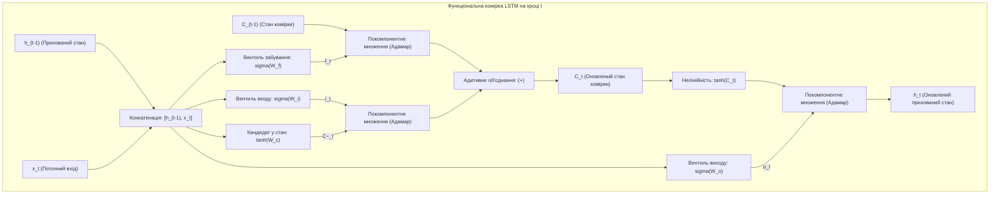
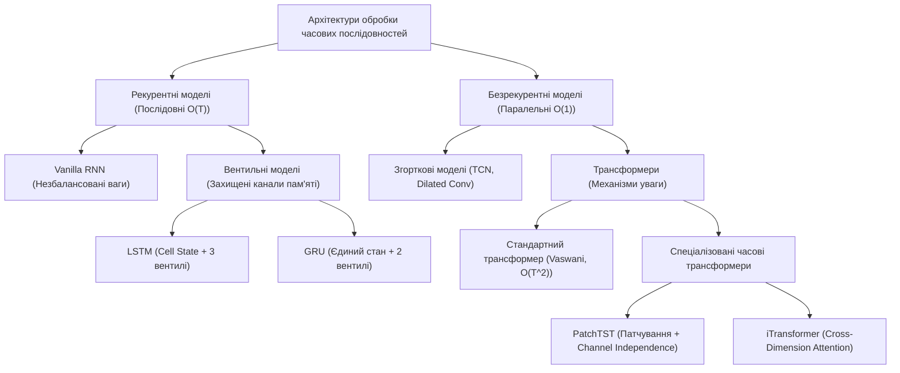
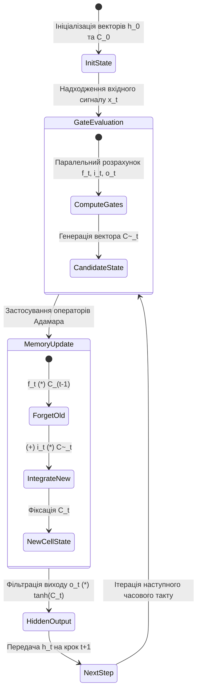
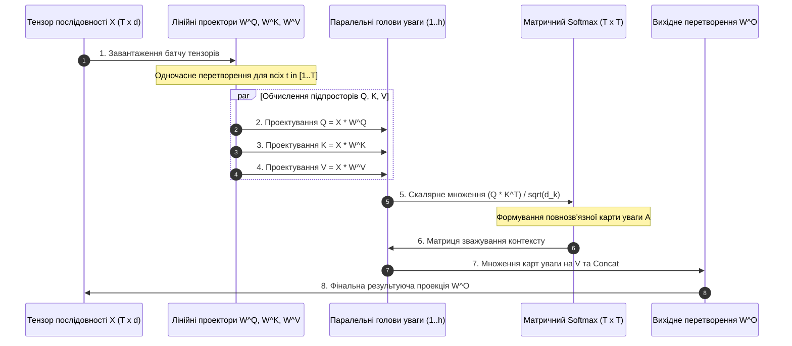
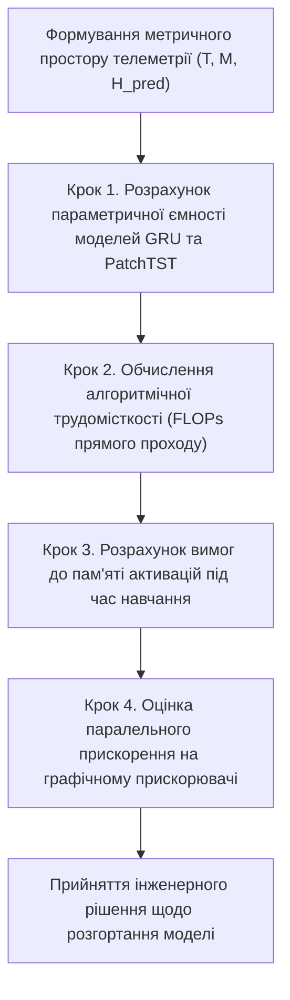

# Тема 10. Рекурентні мережі та архітектура Transformer. Динаміка послідовностей, комірки LSTM/GRU, механізм уваги та трансформери у завданнях часових рядів

## Мета лекції

Метою лекційного заняття є формування у майбутніх інженерів комп'ютерних систем та дослідників штучного інтелекту комплексної системи фундаментальних теоретичних знань і практичних компетентностей щодо архітектурної організації, математичного моделювання та оптимізації нейромережевих структур, орієнтованих на обробку послідовностей та часових рядів. У межах навчальної пари розглядається концептуальний перехід від класичних рекурентних обчислень із послідовною передачею контексту через час до сучасних паралельних безрекурентних архітектур, що базуються на матричних механізмах скальованої самоуваги. Особлива увага приділяється аналізу обчислювальної складності алгоритмів, проблемі згасання градієнтних сигналів у динамічних системах та проєктуванню спеціалізованих моделей трансформерів для завдань багатовимірного часового прогнозування.

## Очікувані результати навчання

Після успішного опанування матеріалу лекції студенти демонструватимуть такі результати:

1. **Знання та розуміння.** Здобувач вищої освіти засвоює та здатний відтворити архітектурні принципи функціонування класичних рекурентних нейронних мереж (RNN), спеціалізованих вентильних комірок довго-короткочасної пам'яті (LSTM), спрощених блоків (GRU), а також концепцію скальованої багатоголової самоуваги (Multi-Head Self-Attention) разом із синусоїдальними та навчальними позиційними кодуваннями.

2. **Застосування.** Здобувач володіє вмінням аналітично розраховувати параметричну ємність моделей, складати системи різницевих рівнянь стану вентильних блоків та алгоритмічно реалізовувати процедуру зворотного поширення помилки через час (BPTT), а також матричні перетворення просторів запитів, ключів і значень ($Q, K, V$).

3. **Аналіз.** Здобувач уміє здійснювати порівняльний структурний аналіз часової та обчислювальної складності моделей ($O(T)$ для рекурентних схем проти $O(T^2)$ для базового механізму уваги), діагностувати умови виникнення чисельної нестабільності (згасання або вибуху градієнтів через спектральний радіус матриць ваг) та оцінювати ступінь утилізації апаратних ресурсів масивно-паралельних обчислювачів.

4. **Оцінювання та синтез.** Здобувач набуває здатності критично зіставляти альтернативні архітектурні рішення для специфічних інженерних завдань обробки сигналів, проєктувати спеціалізовані конфігурації часових трансформерів (зокрема моделей PatchTST та інвертованих архітектур iTransformer) та формувати оптимальні конвеєри попередньої обробки багатовимірних часових рядів.

---

## Детальний покроковий план лекції

### 1. Теоретичний модуль. Еволюція парадигм обробки послідовних даних у комп'ютерних системах

* 1.1. Дослідження автокореляційної динаміки послідовностей розкриває роль прихованого стану як динамічної пам'яті системи, функціонування якої формалізується у вигляді розгорнутого у часі графа класичної рекурентної мережі (Vanilla RNN).

* 1.2. Аналітичне дослідження природи числової нестабільності при зворотному поширенні сигналів у часі пояснює затухання градієнтного потоку, що обумовлює необхідність виділення захищеної магістралі довготривалого стану в комірках LSTM.

* 1.3. Впровадження вентильних структур регуляції потоків інформації у комірках LSTM та спрощених блоках GRU забезпечує динамічне забування нерелевантних шумів та вибіркове накопичення значущих контекстних залежностей.

* 1.4. Перехід до безрекурентної моделі трансформера усуває послідовне вузьке місце обчислень, дозволяючи досягти високого ступеня паралелізму за часовою координатою під час навчання на графічних і тензорних процесорах.

### 2. Аналітичний модуль. Математичні моделі градієнтної динаміки, вентильних операторів та просторів уваги

* 2.1. Формалізація рекурентного переходу, обчислення спектрального радіуса матриці ваг та строге математичне доведення теореми про експоненційне затухання градієнтів за алгоритмом BPTT.

* 2.2. Повна аналітична система рівнянь стану комірки LSTM описує взаємодію векторів забування, входу, кандидата в довготривалу пам'ять та вихідного фільтра через оператори Адамара та сигмоїдної активації.

* 2.3. Алгебраїчна оптимізація обчислень у блоці GRU зводиться до взаємодії вентилів скидання й оновлення, що реалізують опуклу лінійну інтерполяцію векторів поточного та попереднього станів.

* 2.4. Математичний апарат механізму Scaled Dot-Product Attention формалізує перетворення матриць запитів, ключів і значень із нормувальним фактором $\sqrt{d_k}$, що гарантує збереження градієнтів у зоні високої чутливості функції Softmax.

* 2.5. Спектральний аналіз синусоїдального позиційного кодування демонструє механізм ін'єкції часової метрики, а концепції патчування (PatchTST) та транспонування просторів (iTransformer) забезпечують подолання квадратичної обчислювальної складності для тривалих послідовностей.

### 3. Практично-розрахунковий кейс. Інженерно-аналітичний синтез моделей часових рядів

**Тема наскрізної задачі.** «Аналітичний розрахунок параметричної складності, градієнтних траєкторій та прогнозування багатовимірних часових рядів завантаження обчислювального кластера з використанням моделей GRU та PatchTST».

## 1. Фундаментальний теоретичний базис та концептуальні засади

### 1.1. Дослідження автокореляційної динаміки послідовностей та концепція прихованого стану Vanilla RNN

Обробка часових послідовностей та системних часових рядів належить до фундаментальних класів інженерних і наукових задач у комп'ютерних системах, кіберфізичних комплексах, телекомунікаціях та цифровому аналізі сигналів. На відміну від статичних просторових даних, де окремі екземпляри вибірки вважаються незалежними та однаково розподіленими (**Independent and Identically Distributed, i.i.d.**), часові ряди мають сувору хронологічну впорядкованість, виражену автокореляційну структуру та динамічні причинно-наслідкові зв'язки. Поточний стан системи $x_t$ у фізичний або дискретний момент часу $t$ фундаментально залежить від передісторії спостережень $\{x_1, x_2, \dots, x_{t-1}\}$. 

Класичні моделі штучних нейронних мереж, такі як багатошаровий персептрон (**Multilayer Perceptron, MLP**) або згорткові мережі (**Convolutional Neural Networks, CNN**), функціонують в умовах апріорного припущення про фіксовану розмірність вхідного вектора і розглядають кожен елемент вибірки ізольовано. Для моделювання динамічних процесів довільної часової тривалості було запропоновано клас **рекурентних нейронних мереж (Recurrent Neural Networks, RNN)**. 

Концептуальна основа класичної рекурентної мережі (**Vanilla RNN**) полягає у введенні зворотного зв'язку в часовій області. Це перетворює статичну мережу прямого поширення на дискретну нелінійну динамічну систему. Внутрішня пам'ять системи формалізується вектором **прихованого стану (Hidden State)** $h_t \in \mathbb{R}^H$, який акумулює стиснуту інформацію про всі попередні стани та поточний вхідний вектор $x_t \in \mathbb{R}^M$.

Математична модель переходу стану та формування вихідного вектора $y_t \in \mathbb{R}^K$ на довільному часовому такті $t \in \{1, \dots, T\}$ визначається системою нелінійних матричних різницевих рівнянь:

$$h_t = \tanh\left( W_{hh} h_{t-1} + W_{xh} x_t + b_h \right)$$

$$y_t = W_{hy} h_t + b_y$$

Під кожною формулою наведено повний опис задіяних математичних величин:

1. Змінна $h_t \in \mathbb{R}^{H \times 1}$ представляє вектор прихованого стану системи на поточному часовому кроці $t$, що виступає функціональним еквівалентом динамічної пам'яті розмірності $H$.

2. Змінна $h_{t-1} \in \mathbb{R}^{H \times 1}$ позначає вектор прихованого стану, обчислений на безпосередньо попередньому кроці дискретного часу $(t-1)$, причому початковий стан $h_0$ зазвичай ініціалізується нульовим вектором або навчальними параметрами.

3. Змінна $x_t \in \mathbb{R}^{M \times 1}$ визначає вхідний вектор спостережень часового ряду на поточному кроці $t$, що містить $M$ вимірюваних параметрів фізичного процесу.

4. Матриця $W_{hh} \in \mathbb{R}^{H \times H}$ є ваговою матрицею рекурентних переходів, яка визначає силу лінійного взаємозв'язку між послідовними станами внутрішньої пам'яті.

5. Матриця $W_{xh} \in \mathbb{R}^{H \times M}$ позначає вагову матрицю вхідних зв'язків, що здійснює лінійне відображення вхідного простору спостережень у внутрішній прихований стан.

6. Вектор $b_h \in \mathbb{R}^{H \times 1}$ представляє вектор зсуву (bias) прихованого шару, призначений для усунення інваріантності відносно початку координат.

7. Функція $\tanh(\cdot)$ є поелементною гіперболічною тангенсною функцією активації, що забезпечує нелінійне стискання динамічного діапазону значень інтервалом $(-1, 1)$.

8. Матриця $W_{hy} \in \mathbb{R}^{K \times H}$ є ваговою матрицею проектування прихованого стану на простір цільових виходів розмірності $K$.

9. Вектор $b_y \in \mathbb{R}^{K \times 1}$ є вектором зсуву вихідного шару моделі.

10. Змінна $y_t \in \mathbb{R}^{K \times 1}$ визначає вектор прогнозованих значень або оцінок стану системи на часовому такті $t$.

Обчислювальний процес у рекурентній мережі концептуально інтерпретується за допомогою розгортання в часі (**Unfolding in Time**). Це перетворює циклічну структуру на ланцюг ідентичних шарів, де кожен шар відповідає дискретному такту $t$, а ваги $W_{hh}$, $W_{xh}$, $W_{hy}$ залишаються спільними (**Shared Weights**) для всіх часових кроків, що гарантує інваріантність алгоритму до зсуву в часі.

### 1.2. Аналітичне дослідження числової нестабільності зворотного поширення через час (BPTT)

Навчання рекурентних нейронних мереж базується на алгоритмі **зворотного поширення помилки через час (Backpropagation Through Time, BPTT)**. Алгоритм передбачає розгортання обчислювального графа вздовж усієї послідовності довжиною $T$ кроків із наступним застосуванням ланцюгового правила диференціювання для розрахунку градієнтів цільової функції втрат $\mathcal{L} = \sum_{t=1}^T \mathcal{L}_t$ за вагами моделі.

Фундаментальним обмеженням класичних рекурентних мереж є **проблема згасання та вибуху градієнтів (Vanishing and Exploding Gradient Problem)**, яка аналітично виникає внаслідок багаторазового ланцюгового множення матриць Якобі під час проходження сигналу помилки з моменту часу $t$ до далекого попереднього кроку $k$ (де $k \ll t$).

Градієнт локальної функції втрат $\mathcal{L}_t$ відносно рекурентної матриці ваг $W_{hh}$ формалізується аналітичним співвідношенням:

$$\frac{\partial \mathcal{L}_t}{\partial W_{hh}} = \sum_{k=1}^t \frac{\partial \mathcal{L}_t}{\partial h_t} \cdot \frac{\partial h_t}{\partial h_k} \cdot \frac{\partial h_k}{\partial W_{hh}}$$

Ланцюговий перехід градієнта крізь проміжні стани $\frac{\partial h_t}{\partial h_k}$ описується матричним добутком відповідних якобіанів:

$$\frac{\partial h_t}{\partial h_k} = \prod_{j=k+1}^t \frac{\partial h_j}{\partial h_{j-1}} = \prod_{j=k+1}^t \operatorname{diag}\left(1 - \tanh^2(z_j)\right) \cdot W_{hh}^T$$

Розшифрування аналітичних компонентів градієнтного ланцюга:

1. Величина $\frac{\partial \mathcal{L}_t}{\partial h_t} \in \mathbb{R}^{1 \times H}$ позначає вектор-рядок безпосереднього градієнта цільової функції втрат за прихованим станом останнього кроку $t$.

2. Матриця $\frac{\partial h_t}{\partial h_k} \in \mathbb{R}^{H \times H}$ являє собою сумарний якобіан перенесення градієнтного сигналу від кроку $t$ до попереднього кроку $k$.

3. Вектор $z_j = W_{hh} h_{j-1} + W_{xh} x_j + b_h \in \mathbb{R}^{H \times 1}$ визначає лінійну активацію нейронів прихованого шару до застосування нелінійного стиснення на кроці $j$.

4. Діагональна матриця $\operatorname{diag}\left(1 - \tanh^2(z_j)\right) \in \mathbb{R}^{H \times H}$ є похідною векторної функції гіперболічного тангенса на кроці $j$, чиї діагональні елементи строго належать числовому інтервалу $(0, 1]$.

5. Матриця $W_{hh}^T \in \mathbb{R}^{H \times H}$ позначає транспоновану вагову матрицю рекурентного шару, яка багаторазово перемножується сама на себе $(t-k)$ разів.

Якщо виконати спектральний розклад матриці $W_{hh} = Q \Lambda Q^{-1}$, де $\Lambda = \operatorname{diag}(\lambda_1, \dots, \lambda_H)$ — діагональна матриця власних значень, а спектральний радіус задовольняє умову $\rho(W_{hh}) = \max_i |\lambda_i| < 1$, то норма матричного степеня $\|W_{hh}^{t-k}\| \le \|Q\| \cdot \|Q^{-1}\| \cdot \rho(W_{hh})^{t-k}$ спадає експоненційно до нуля при збільшенні часового інтервалу $(t - k) \to \infty$. Оскільки діагональні елементи похідної $\tanh$ додатково не перевищують одиниці, градієнтні сигнали швидко нівелюються. Мережа втрачає математичну можливість коригувати ваги на основі контекстних подій, віддалених більше ніж на 10–15 кроків у минуле, що робить неможливим вивчення **довготривалих залежностей (Long-Term Dependencies)**.

Навпаки, за умови $\rho(W_{hh}) > 1$ та перебування активацій у ненасиченій зоні, виникає експоненційне зростання норми градієнтів ($\|g\| \to \infty$). Це зумовлює числове переповнення регістрів процесора (виникнення станів `NaN` або `Inf` у стандартах IEEE 754) та дестабілізує навчання. Для подолання вибуху градієнтів у комп'ютерній інженерії застосовують операцію евристичного **обрізання градієнтів за нормою (Gradient Norm Clipping)**:

$$g \leftarrow \begin{cases} g, & \text{якщо } \|g\|_2 \le \theta \\ \frac{\theta}{\|g\|_2} \cdot g, & \text{якщо } \|g\|_2 > \theta \end{cases}$$

1. Вектор $g = \nabla_W \mathcal{L} \in \mathbb{R}^{D \times 1}$ представляє сумарний вектор градієнтів параметрів моделі розмірності $D$, розрахований на поточному кроці оптимізації.

2. Величина $\|g\|_2 = \sqrt{\sum_{i=1}^D g_i^2}$ виражає евклідову норму (L2-норму) вектора градієнтів.

3. Параметр $\theta \in \mathbb{R}^+$ позначає гранично допустимий поріг норми градієнта, перевищення якого ініціює операцію пропорційного масштабування.

Проте механізм відсікання градієнтів розв'язує лише проблему вибуху, залишаючи проблему експоненційного згасання градієнтів принципово непереборною в рамках ванільної структури RNN.

### 1.3. Вентильні механізми селективного пропускання інформації: архітектури LSTM та GRU

Для подолання проблеми затухання градієнтів Зепп Хохрайтер та Юрген Шмідхубер (1997 р.) запропонували концепцію **постійної каруселі помилок (Constant Error Carousel, CEC)**, реалізовану в архітектурі **пам'яті довго-короткочасного типу (Long Short-Term Memory, LSTM)**.

Фундаментальна відмінність LSTM полягає у розщепленні внутрішнього стану на два окремі компоненти: **стан комірки (Cell State)** $C_t \in \mathbb{R}^H$, який утворює довготривалу пам'ять системи, та **прихований стан (Hidden State)** $h_t \in \mathbb{R}^H$, що виконує роль короткотривалої робочої пам'яті. 

Стан комірки $C_t$ функціонує як пряма магістраль зв'язку: зміна його значень у часі базується переважно на адитивних, а не мультиплікативних операціях. Завдяки цьому похідна $\frac{\partial C_t}{\partial C_{t-1}}$ містить прямий лінійний доданок, що дозволяє градієнтам поширюватися крізь сотні кроків без експоненційного затухання.

Керування потоками читання, запису та стирання інформації здійснюється за допомогою функціональних **вентилів (Gates)** — спеціалізованих шарів із сигмоїдною активацією $\sigma(x) \in [0, 1]$, що виконують функцію м'яких перемикачів:

1. **Вентиль забування (Forget Gate, $f_t$):** аналізує конкатенацію попереднього прихованого стану $h_{t-1}$ і поточного входу $x_t$, формуючи вагові коефіцієнти від 0 (повне стирання) до 1 (повне збереження) для кожного елемента довготривалої пам'яті $C_{t-1}$.

2. **Вентиль входу (Input Gate, $i_t$):** визначає ступінь оновлення відповідних координат стану комірки новими значеннями-кандидатами $\tilde{C}_t$, сформованими за допомогою нелінійного перетворення $\tanh$.

3. **Вентиль виходу (Output Gate, $o_t$):** обчислює маску селективної фільтрації над нормалізованим станом комірки $\tanh(C_t)$, генеруючи результуючий вектор $h_t$, доступний наступним шарам обчислювальної системи.

Графічну схему перетворень інформаційних потоків усередині комірки LSTM наведено нижче:

Подальша інженерна оптимізація вентильних рекурентних структур привела до створення Кинхьоном Чо (2014 р.) спрощеного блоку — **вентильного рекурентного вузла (Gated Recurrent Unit, GRU)**. Архітектура GRU оптимізована для скорочення обчислювальних витрат та зменшення обсягу використовуваної динамічної пам'яті:

1. Довготривала пам'ять $C_t$ та короткотривалий стан $h_t$ об'єднані в єдиний інформаційний вектор $h_t$, що зменшує загальну розмірність тензорів стану.

2. Замість трьох вентилів використовуються лише два: **вентиль скидання (Reset Gate, $r_t$)** та **вентиль оновлення (Update Gate, $z_t$)**.

3. Вентиль оновлення $z_t$ одночасно реалізує функції вентилів забування та введення, виконуючи лінійну опуклу комбінацію між старим станом $h_{t-1}$ та новим згенерованим кандидатом $\tilde{h}_t$ відповідно до формули $h_t = (1 - z_t) \odot h_{t-1} + z_t \odot \tilde{h}_t$.

Завдяки скороченню кількості вагових матриць на 25% порівняно з LSTM, блоки GRU забезпечують суттєво вищу швидкість навчання на однакових апаратних потужностях без суттєвої втрати апроксимаційної точності на більшості прикладних часових рядів.

### 1.4. Парадигмальний перехід від послідовної рекурентності до паралельної уваги (Self-Attention)

Попри високу стійкість моделей LSTM та GRU до згасання градієнтів, усім рекурентним архітектурам притаманний непереборний структурний недолік: **строго послідовна обчислювальна природа**.

Для обчислення прихованого стану $h_t$ обчислювальна система зобов'язана попередньо отримати вектор $h_{t-1}$. Відповідно, процес обробки послідовності довжиною $T$ вимагає виконання $O(T)$ послідовних операцій, які не можуть бути розпаралелені вздовж часової осі. На сучасних масивно-паралельних прискорювачах (графічних процесорах GPU та тензорних процесорах TPU), що містять тисячі паралельних обчислювальних ядер, виконання інструкцій рекурентної мережі призводить до низької утилізації апаратного забезпечення через постійні затримки синхронізації та низьку інтенсивність арифметичних операцій відносно операцій звернення до оперативної пам'яті (**Memory Bandwidth Bottleneck**).

Революційний перехід у моделюванні послідовностей відбувся у 2017 році з опублікуванням фундаментальної праці Ашиша Васвані та співавторів (*«Attention Is All You Need»*), у якій було презентовано архітектуру **Transformer**. Архітектура повністю відмовилася від рекурентних зв'язків та згорток на користь матричного механізму **скальованої самоуваги (Scaled Dot-Product Self-Attention)**.

Концептуальна ідея Self-Attention полягає у прямому зіставленні кожного елемента послідовності з усіма іншими елементами за одну матричну операцію. Математично це зменшує довжину шляху проходження інформаційного сигналу між будь-якими двома точками в часі від $O(T)$ у RNN до константного значення $O(1)$ у Transformer.

Нижче наведено ієрархічну класифікацію нейромережевих архітектур, що використовуються для моделювання динамічних послідовностей:

Для аналізу часових характеристик виконання рекурентних та трансформерних конвеєрів на паралельних апаратних прискорювачах наведено часову діаграму обчислювальних кроків:

```mermaid
gantt
    title Порівняння часового конвеєра обчислень RNN та Transformer
    dateFormat X
    axisFormat %s

    section Рекурентна модель (Послідовний BPTT-процес)
    Обчислення кроку t=1         :a1, 0, 10
    Обчислення кроку t=2         :a2, 10, 20
    Обчислення кроку t=3         :a3, 20, 30
    Обчислення кроку t=4         :a4, 30, 40

    section Модель Transformer (Повна апаратна паралелізація)
    Матричне множення Q, K, V для всіх t :b1, 0, 15
    Обчислення карти уваги (Softmax)     :b2, 15, 25
    Агрегація виходу (MatMul з V)         :b3, 25, 35
```

Перехід до трансформерних структур зумовив фундаментальну зміну властивостей обчислювального графа. Механізм Self-Attention володіє властивістю **інваріантності до перестановок (Permutation Invariance)**: якщо змінити порядок розташування вхідних векторів у часі без додавання спеціальних міток, множина вихідних векторів зміниться відповідно на ту саму перестановку, повністю ігноруючи хронологічну структуру. 

Для розв'язання цієї проблеми в архітектурі Transformer введено обов'язковий механізм **позиційного кодування (Positional Encoding, PE)**, який шляхом адитивного додавання або конкатенації спеціальних синусоїдальних чи навчальних векторів безпосередньо вбудовує часові координати у векторні представлення спостережень.

Нижче наведено аналітичну таблицю порівняльного аналізу основних архітектур обробки послідовностей.

| Архітектурний тип | Механізм динамічної пам'яті | Часова складність навчання | Гранична довжина залежностей | Стійкість до згасання градієнта | Ступінь утилізації ядер GPU |
| :--- | :--- | :--- | :--- | :--- | :--- |
| **Vanilla RNN** | Єдиний рекурентний прихований вектор $h_t$ | $O(T \cdot H^2)$ | Вкрай низька ($T \le 10$) | Незадовільна (експоненційне згасання) | Низька (строга послідовна залежність) |
| **LSTM** | Розділені стани: комірка $C_t$ та прихований $h_t$ | $O(T \cdot H^2)$ | Середня ($T \approx 100 - 500$) | Висока (наявність лінійної магістралі CEC) | Низька (блокування кроком $t-1$) |
| **GRU** | Інтерпольований стан $h_t$ з парою вентилів | $O(T \cdot H^2)$ | Середня ($T \approx 100 - 500$) | Висока (опукла комбінація через $z_t$) | Низька (блокування кроком $t-1$) |
| **Transformer (Vanilla)** | Матриця парних скалярних добутків $Q K^T$ | $O(T^2 \cdot d + T \cdot d^2)$ | Велика ($T \approx 1000 - 4000$) | Абсолютна (прямий шлях градієнта $O(1)$) | Максимальна (паралельні матричні ядра) |
| **PatchTST** | Патчована розріджена увага за часом | $O((T/P)^2 \cdot d)$ | Ультравелика ($T > 10000$) | Абсолютна (за рахунок патчування та уваги) | Висока (збалансована пам'ять та ядра) |

> **ТИПОВА ПОМИЛКА:** Поширеним є помилкове твердження, нібито архітектура LSTM повністю нівелює проблему згасання градієнта для послідовностей будь-якої довжини, гарантуючи необмежену пам'ять. Насправді стан комірки $C_t = f_t \odot C_{t-1} + i_t \odot \tilde{C}_t$ забезпечує захист градієнта за умови, що вектор вентиля забування $f_t$ наближається до одиничного вектора. Проте на практиці ваги вентиля забування $W_f$ оновлюються динамічно; якщо на довгому інтервалі часу модель навчається зануляти старі значення ($f_t \to 0$), градієнтний потік через стан комірки переривається з тією ж швидкістю, що й у класичних RNN. Крім того, нелінійні перетворення при формуванні виходу $h_t = o_t \odot \tanh(C_t)$ залишаються чутливими до насичення, що обмежує практичну пам'ять класичної LSTM межами кількох сотень тактів.

> **КОНТРОЛЬНЕ ПИТАННЯ.** Чому перемноження матриці запитів $Q$ та транспонованої матриці ключів $K^T$ у стандартному трансформері зумовлює квадратичну обчислювальну складність за пам'яттю та часом $O(T^2)$, і яким чином архітектурний підхід PatchTST знижує зазначену складність при роботі з довготривалими числовими часовими рядами?

Розгорнути відповідь

**Правильний аналітичний розбір:**

1. Обчислення скалярного добутку матриць запитів $Q \in \mathbb{R}^{T \times d_k}$ та ключів $K \in \mathbb{R}^{T \times d_k}$ призводить до генерації матриці уваги $A$:

$$A = \operatorname{Softmax}\left(\frac{Q K^T}{\sqrt{d_k}}\right) \in \mathbb{R}^{T \times T}$$

Розмірність отриманої матриці $A$ строго дорівнює $T \times T$, оскільки кожен з $T$ часових токенів зобов'язаний розрахувати коефіцієнт парної уваги до всіх $T$ токенів вхідного ряду. Для збереження цієї матриці та відповідних проміжних карт уваги у пам'яті графічного прискорювача під час прямого та зворотного проходів необхідно виділити обсяг відеопам'яті, пропорційний квадрату довжини ряду:

$$M_{\text{attn}} = O(B \cdot H_{\text{heads}} \cdot T^2)$$

де $B$ — розмір батчу, а $H_{\text{heads}}$ — кількість паралельних голів уваги. При збільшенні довжини ряду від $T = 1000$ до $T = 10000$ обсяг необхідної пам'яті зростає у 100 разів, що призводить до аварійного вичерпання апаратних ресурсів (**Out of Memory, OOM**).

2. Архітектура PatchTST (**Patch Time Series Transformer**) долає це обмеження шляхом агрегації суміжних часових точок у локальні неперервні блоки — **патчі** довжини $P$ із кроком зміщення $S$. У результаті вихідний часовий ряд довжиною $T$ замінюється послідовністю патчів довжиною:

$$N = \left\lfloor \frac{T - P}{S} \right\rfloor + 2$$

Якщо крок зміщення $S$ та довжина патча $P$ співмірні (наприклад, $P = 16, S = 8$), кількість токенів для трансформера зменшується практично на порядок ($N \approx T / 8$). Відповідно, обчислювальна складність матричного множення та вимоги до пам'яті механізму Self-Attention зменшуються квадратично:

$$\text{Complexity}_{\text{PatchTST}} = O(N^2 \cdot d) = O\left(\left(\frac{T}{S}\right)^2 \cdot d\right)$$

Це забезпечує зменшення кількості обчислень у $\left(\frac{T}{N}\right)^2 \approx 64$ рази, дозволяючи масштабувати аналіз на послідовності довжиною в десятки тисяч вимірів із одночасним покращенням співвідношення сигнал/шум завдяки вилученню локального контексту.

### Вказівки для самостійного осмислення теоретичного базису

1. Проведіть порівняльний спектральний аналіз динамічних систем, змодельованих за допомогою дискретних різницевих рівнянь, та поясніть фундаментальну схожість між чисельною нестійкістю методу Ейлера при розв'язанні жорстких систем звичайних диференціальних рівнянь і вибухом градієнтів у процесі BPTT.

2. Дослідіть взаємозв'язок між принципом адитивності магістралі пам'яті $C_t$ у комірках LSTM та механізмом резидуальних з'єднань (**Residual Connections, Skip-Connections**) у глибоких архітектурах ResNet і Transformer, формалізувавши математичні умови збереження градієнтного потоку при прямій передачі похідних через адитивні вузли.

3. Оцініть вплив порушення умови незалежності та однакового розподілу вибірки (i.i.d.) на процедуру крос-валідації параметрів нейромережевих моделей, сформулювавши інженерні вимоги до побудови ковзних вікон валідації (**Walk-Forward Cross-Validation**) для виключення витоку даних із часового майбутнього в минуле.

## 2. Аналітичні процеси, математичний апарат та моделювання

### 2.1. Спектральний аналіз динамічної стійкості BPTT та строге доведення згасання градієнтів

Математичне моделювання динаміки градієнтного спуску в просторі станів рекурентних нейронних мереж базується на апараті дискретних динамічних систем та спектральної теорії лінійних операторів. Розглянемо траєкторію поширення похибки за алгоритмом **зворотного поширення через час (Backpropagation Through Time, BPTT)** на дискретному інтервалі $t \in [1, T]$. 

Нехай функція переходу прихованого стану задається векторним нелінійним відображенням:

$$h_t = \phi(z_t) = \tanh(W_{hh} h_{t-1} + W_{xh} x_t + b_h)$$

де $z_t = W_{hh} h_{t-1} + W_{xh} x_t + b_h \in \mathbb{R}^{H \times 1}$ — вектор повної лінійної активації прихованого шару на такті $t$.

Сумарна функція втрат на всій траєкторії послідовності визначається функціоналом:

$$\mathcal{L} = \sum_{t=1}^T \mathcal{L}_t(y_t, \hat{y}_t)$$

1. Змінна $\mathcal{L} \in \mathbb{R}^+$ визначає скалярне значення загальної емпіричної похибки моделі на всій послідовності спостережень.

2. Змінна $\mathcal{L}_t \in \mathbb{R}^+$ позначає скалярну функцію втрат, обчислену для окремого часового кроку $t$.

3. Вектор $y_t \in \mathbb{R}^{K \times 1}$ представляє вектор істинних значень цільових параметрів часового ряду.

4. Вектор $\hat{y}_t \in \mathbb{R}^{K \times 1}$ є вектором вихідних прогнозних оцінок, сформованих обчислювальною моделлю.

Для дослідження градієнтного потоку вздовж часової координати обчислимо повну похідну функції втрат $\mathcal{L}_t$ за вектором прихованого стану $h_k$ на віддаленому кроці $k < t$. Відповідно до ланцюгового правила аналізу багатьох змінних, градієнтний взаємозв'язок розгортається у добуток локальних матриць Якобі:

$$\frac{\partial \mathcal{L}_t}{\partial h_k} = \frac{\partial \mathcal{L}_t}{\partial h_t} \cdot \prod_{j=k+1}^t J_j$$

$$J_j = \frac{\partial h_j}{\partial h_{j-1}} = \operatorname{diag}\left(1 - \tanh^2(z_j)\right) \cdot W_{hh}^T$$

1. Матриця $J_j \in \mathbb{R}^{H \times H}$ позначає локальну матрицю Якобі переходу динамічної системи між станами на кроках $(j-1)$ та $j$.

2. Матриця $\operatorname{diag}\left(1 - \tanh^2(z_j)\right) \in \mathbb{R}^{H \times H}$ представляє діагональну матрицю перших похідних функції активації, діагональні елементи якої позначимо через $D_j = \operatorname{diag}(d_{j,1}, \dots, d_{j,H})$, де $d_{j,m} \in (0, 1]$ для всіх $m \in \{1, \dots, H\}$.

3. Матриця $W_{hh}^T \in \mathbb{R}^{H \times H}$ є транспонованою ваговою матрицею рекурентних зв'язків.

Покрокове аналітичне виведення теореми про затухання градієнтного сигналу формалізується наступним чином:

$$
\begin{aligned}
\text{Етап 1 (Матричний розклад Якобіана):} & \quad J_j = D_j W_{hh}^T, \quad D_j = \operatorname{diag}\left(1 - \tanh^2(z_j)\right) \\
\text{Етап 2 (Оцінка спектральної норми оператора):} & \quad \|J_j\|_2 \le \|D_j\|_2 \cdot \|W_{hh}^T\|_2 \le \gamma \cdot \sigma_{\max}(W_{hh}) \\
\text{Етап 3 (Асимптотичний аналіз ланцюгового добутку):} & \quad \left\|\frac{\partial h_t}{\partial h_k}\right\|_2 = \left\|\prod_{j=k+1}^t J_j\right\|_2 \le \prod_{j=k+1}^t \|J_j\|_2 \le \left(\gamma \cdot \sigma_{\max}(W_{hh})\right)^{t-k}
\end{aligned}
$$

1. Параметр $\gamma = \sup_{j} \|D_j\|_2 = \max_{j, m} |1 - \tanh^2(z_{j,m})| \le 1$ визначає супремум спектральної норми матриці похідних активації, що для гіперболічного тангенса не перевищує одиниці.

2. Величина $\sigma_{\max}(W_{hh}) = \sqrt{\lambda_{\max}(W_{hh} W_{hh}^T)}$ визначає максимальне сингулярне число рекурентної матриці ваг, яке чисельно дорівнює її евклідовій операторній нормі $\|W_{hh}\|_2$.

3. Показник $(t - k) \in \mathbb{N}$ задає величину часового лагу між моментом виникнення помилки та моментом оновлення внутрішнього стану.

Дослідження асимптотичної поведінки отриманої нерівності при граничних умовах формує два класи динамічної поведінки градієнтів:

$$\lim_{t - k \to \infty} \left\|\frac{\partial h_t}{\partial h_k}\right\|_2 = 0 \quad \text{при} \quad \gamma \cdot \sigma_{\max}(W_{hh}) < 1$$

$$\lim_{t - k \to \infty} \left\|\frac{\partial h_t}{\partial h_k}\right\|_2 = \infty \quad \text{при} \quad \inf_j \|D_j W_{hh}^T\|_2 > 1$$

Перша границя свідчить про експоненційне затухання градієнтів: інформація про довготривалий контекст асимптотично вироджується, унеможливлюючи налаштування ваг для далеких часових залежностей. Друга границя описує стан числового вибуху градієнтів, що призводить до руйнування параметричного простору моделі.

### 2.2. Аналітична система рівнянь стану та градієнтні магістралі комірки LSTM

Для забезпечення константного проходження градієнта крізь довільні часові інтервали архітектура LSTM реалізує концепцію адитивного оновлення стану пам'яті. Повна система нелінійних різницевих рівнянь, що описує перехід стану на такті $t$, має вигляд:

$$f_t = \sigma(W_f x_t + U_f h_{t-1} + b_f)$$

$$i_t = \sigma(W_i x_t + U_i h_{t-1} + b_i)$$

$$\tilde{C}_t = \tanh(W_c x_t + U_c h_{t-1} + b_c)$$

$$C_t = f_t \odot C_{t-1} + i_t \odot \tilde{C}_t$$

$$o_t = \sigma(W_o x_t + U_o h_{t-1} + b_o)$$

$$h_t = o_t \odot \tanh(C_t)$$

1. Вектор $f_t \in (0, 1)^H$ є виходом вентиля забування, компоненти якого визначають коефіцієнти експоненційного згасання інформації в комірці пам'яті.

2. Вектор $i_t \in (0, 1)^H$ позначає вихід вхідного вентиля, що масштабує амплітуду надходження нових спостережень.

3. Вектор $\tilde{C}_t \in (-1, 1)^H$ являє собою вектор-кандидат оновлення довготривалого стану.

4. Вектор $C_t \in \mathbb{R}^H$ є інтегрованим станом комірки довготривалої пам'яті на поточному часовому такті.

5. Вектор $o_t \in (0, 1)^H$ визначає вихід вентиля селективного виходу для формування поточного зовнішнього сигналу.

6. Вектор $h_t \in (-1, 1)^H$ є вектором короткотривалого прихованого стану комірки.

7. Матриці $W_f, W_i, W_c, W_o \in \mathbb{R}^{H \times M}$ та $U_f, U_i, U_c, U_o \in \mathbb{R}^{H \times H}$ визначають вагові коефіцієнти проектування входів і попередніх станів відповідно.

8. Вектори $b_f, b_i, b_c, b_o \in \mathbb{R}^{H \times 1}$ задають зміщення відповідних вентильних підсистем.

9. Оператор $\odot$ позначає покомпонентне множення векторів за правилом Адамара.

Аналітичне дослідження градієнтної магістралі стану комірки $C_t$ розкриває причину подолання проблеми затухання градієнта. Обчислимо локальний якобіан стану комірки $\frac{\partial C_t}{\partial C_{t-1}}$:

$$
\begin{aligned}
\text{Етап 1 (Диференціювання адитивного стану):} & \quad \frac{\partial C_t}{\partial C_{t-1}} = \operatorname{diag}(f_t) + C_{t-1} \odot \frac{\partial f_t}{\partial C_{t-1}} + \tilde{C}_t \odot \frac{\partial i_t}{\partial C_{t-1}} + i_t \odot \frac{\partial \tilde{C}_t}{\partial C_{t-1}} \\
\text{Етап 2 (Декомпозиція непрямих градієнтних шляхів):} & \quad \frac{\partial f_t}{\partial C_{t-1}} = \frac{\partial f_t}{\partial h_{t-1}} \cdot \frac{\partial h_{t-1}}{\partial C_{t-1}} = \left(\operatorname{diag}(f_t \odot (1 - f_t)) \cdot U_f\right) \cdot \operatorname{diag}\left(o_{t-1} \odot (1 - \tanh^2(C_{t-1}))\right) \\
\text{Етап 3 (Формування градієнтного інваріанта CEC):} & \quad \frac{\partial C_t}{\partial C_{t-1}} = \operatorname{diag}(f_t) + \mathcal{R}_t(x_t, h_{t-1}, C_{t-1})
\end{aligned}
$$

1. Матриця $\operatorname{diag}(f_t) \in \mathbb{R}^{H \times H}$ є головним лінійним членом перенесення помилки вздовж часової магістралі комірки.

2. Матриця $\mathcal{R}_t \in \mathbb{R}^{H \times H}$ позначає залишковий член якобіана, що містить добутки через сигмоїдні похідні від $h_{t-1}$.

При розгортанні градієнта вздовж часового проміжку від $t$ до $k$ отримуємо:

$$\frac{\partial \mathcal{L}_t}{\partial C_k} = \frac{\partial \mathcal{L}_t}{\partial C_t} \cdot \prod_{j=k+1}^t \left( \operatorname{diag}(f_j) + \mathcal{R}_j \right)$$

Якщо оптимізатор встановлює зміщення вентиля забування у позитивну область ($b_f > 0$), вектор $f_j \to \mathbf{1}$, внаслідок чого $\operatorname{diag}(f_j) \approx I$. За цих умов:

$$\lim_{f_j \to \mathbf{1}, \, \mathcal{R}_j \to 0} \prod_{j=k+1}^t \frac{\partial C_j}{\partial C_{j-1}} = I$$

Це доводить, що сигнал похибки може поширюватися назад у часі без експоненційного затухання, утворюючи так звану постійну карусель помилок (**Constant Error Carousel**).

### 2.3. Алгебраїчна оптимізація обчислень та редукція простору станів у блоках GRU

Архітектура GRU оптимізує векторний простір рекурентної комірки через відмову від відокремленого вектора $C_t$. Математична модель GRU формалізується системою рівнянь:

$$z_t = \sigma(W_z x_t + U_z h_{t-1} + b_z)$$

$$r_t = \sigma(W_r x_t + U_r h_{t-1} + b_r)$$

$$\tilde{h}_t = \tanh\left(W_h x_t + U_h (r_t \odot h_{t-1}) + b_h\right)$$

$$h_t = (1 - z_t) \odot h_{t-1} + z_t \odot \tilde{h}_t$$

1. Вектор $z_t \in (0, 1)^H$ позначає вихід вентиля оновлення, що балансує коефіцієнт змішування історичного та поточного станів.

2. Вектор $r_t \in (0, 1)^H$ являє собою вектор вентиля скидання, який визначає ступінь лінійного доступу до попереднього стану $h_{t-1}$ при формуванні вектора-кандидата $\tilde{h}_t$.

3. Вектор $\tilde{h}_t \in (-1, 1)^H$ є кандидатом у прихований стан системи.

4. Вектор $h_t \in (-1, 1)^H$ визначає підсумковий вектор прихованого стану на такті $t$.

5. Матриці $W_z, W_r, W_h \in \mathbb{R}^{H \times M}$ та $U_z, U_r, U_h \in \mathbb{R}^{H \times H}$ задають параметри вхідних та рекурентних вагових перетворень відповідно.

6. Вектори $b_z, b_r, b_h \in \mathbb{R}^{H \times 1}$ задають вектори зсуву вентильних підсистем.

Аналітичне виведення граничних властивостей рівняння оновлення стану демонструє функціональну гнучкість блоку:

$$
\begin{aligned}
\text{Етап 1 (Диференціювання опуклої комбінації станів):} & \quad \frac{\partial h_t}{\partial h_{t-1}} = \operatorname{diag}(1 - z_t) + \operatorname{diag}(z_t) \cdot \frac{\partial \tilde{h}_t}{\partial h_{t-1}} + \left( \tilde{h}_t - h_{t-1} \right) \otimes \frac{\partial z_t}{\partial h_{t-1}} \\
\text{Етап 2 (Асимптотичний аналіз режиму консервації):} & \quad \lim_{z_t \to \mathbf{0}} h_t = h_{t-1} \implies \lim_{z_t \to \mathbf{0}} \frac{\partial h_t}{\partial h_{t-1}} = I \\
\text{Етап 3 (Асимптотичний аналіз режиму повного перезапису):} & \quad \lim_{z_t \to \mathbf{1}} h_t = \tilde{h}_t \implies \lim_{z_t \to \mathbf{1}} \frac{\partial h_t}{\partial h_{t-1}} = \operatorname{diag}(1 - \tilde{h}_t^2) \cdot U_h \cdot \operatorname{diag}(r_t)
\end{aligned}
$$

1. Оператор $\otimes$ визначає зовнішній добуток векторів для розрахунку матриць чутливості вентилів.

2. Одинична матриця $I \in \mathbb{R}^{H \times H}$ підтверджує наявність незатухаючої градієнтної магістралі при $z_t \to \mathbf{0}$.

Нижче наведено граф станів функціонування внутрішніх змінних рекурентних комірок:

### 2.4. Математичний апарат механізмів Scaled Dot-Product та Multi-Head Attention

Механізм **скальованої самоуваги (Scaled Dot-Product Self-Attention)** трансформує вхідну матрицю послідовності $X \in \mathbb{R}^{T \times d_{\text{model}}}$ у вихідний контекстний простір шляхом одночасного зіставлення геометричних проекцій токенів.

Формалізація просторів запитів ($Q$), ключів ($K$) та значень ($V$) здійснюється лінійними операторами:

$$Q = X W^Q, \quad K = X W^K, \quad V = X W^V$$

1. Матриця $X \in \mathbb{R}^{T \times d_{\text{model}}}$ містить множину $T$ векторів вхідної послідовності, розміщених по рядках.

2. Матриці $W^Q \in \mathbb{R}^{d_{\text{model}} \times d_k}$, $W^K \in \mathbb{R}^{d_{\text{model}} \times d_k}$, $W^V \in \mathbb{R}^{d_{\text{model}} \times d_v}$ є параметричними матрицями проектування.

3. Тензори $Q \in \mathbb{R}^{T \times d_k}$, $K \in \mathbb{R}^{T \times d_k}$, $V \in \mathbb{R}^{T \times d_v}$ визначають матриці запитів, ключів і значень відповідно.

Основний закон скальованого перетворення уваги визначається рівнянням:

$$\operatorname{Attention}(Q, K, V) = \operatorname{Softmax}\left(\frac{Q K^T}{\sqrt{d_k}}\right) V$$

Покрокове аналітичне виведення необхідності регуляризаційного коефіцієнта $\sqrt{d_k}$ формулюється на основі ймовірнісного аналізу розподілу елементів матриці ненормованих оцінок:

$$
\begin{aligned}
\text{Етап 1 (Статистичний розподіл скалярного добутку):} & \quad S_{ij} = q_i \cdot k_j = \sum_{r=1}^{d_k} Q_{ir} K_{jr}, \quad Q_{ir}, K_{jr} \sim \mathcal{N}(0, \sigma^2) \\
\text{Етап 2 (Розрахунок математичного сподівання та дисперсії):} & \quad \mathbb{E}[S_{ij}] = 0, \quad \operatorname{Var}(S_{ij}) = \sum_{r=1}^{d_k} \operatorname{Var}(Q_{ir} K_{jr}) = d_k \sigma^4 \\
\text{Етап 3 (Нормування дисперсії для захисту градієнтів Softmax):} & \quad \tilde{S}_{ij} = \frac{S_{ij}}{\sqrt{d_k}} \implies \operatorname{Var}(\tilde{S}_{ij}) = \sigma^4 = 1 \quad (\text{при } \sigma = 1)
\end{aligned}
$$

1. Величина $S_{ij} \in \mathbb{R}$ є скалярним добутком вектора-запиту $i$-го токена на вектор-ключ $j$-го токена.

2. Значення $\operatorname{Var}(S_{ij}) = d_k$ показує лінійне зростання дисперсії скалярного добутку пропорційно розмірності підпростору $d_k$.

3. Величина $\tilde{S}_{ij}$ є нормованим аргументом функції $\operatorname{Softmax}$.

Якщо скалювання $\frac{1}{\sqrt{d_k}}$ відсутнє, то при великих значеннях розмірності $d_k \gg 1$ дисперсія $\operatorname{Var}(S_{ij})$ стає надмірно великою. Це призводить до того, що найбільший елемент рядка значно перевищує інші, викликаючи насичення функції Softmax:

$$\lim_{d_k \to \infty} \operatorname{Softmax}(S_i)_j = \begin{cases} 1, & j = \arg\max_m S_{im} \\ 0, & j \ne \arg\max_m S_{im} \end{cases}$$

У зоні насичення Softmax локальні градієнти експоненційно наближаються до нуля ($\frac{\partial \operatorname{Softmax}_j}{\partial S_m} \to 0$), що породжує ефект штучного затухання градієнтів безпосередньо всередині механізму уваги. Ділення на $\sqrt{d_k}$ стабілізує дисперсію аргументу на рівні одиниці, зберігаючи робочу точку активації в зоні максимальної крутизни градієнтів.

Для розширення виразної здатності застосовується **багатоголова самоувага (Multi-Head Attention, MHA)**, яка паралельно проектує вектори у $h$ незалежних підпросторів:

$$\operatorname{MultiHead}(Q, K, V) = \operatorname{Concat}(\operatorname{head}_1, \dots, \operatorname{head}_h) W^O$$

$$\operatorname{head}_m = \operatorname{Attention}\left(Q W_m^Q, K W_m^K, V W_m^V\right)$$

1. Індекс $m \in \{1, \dots, h\}$ визначає номер паралельної голови уваги.

2. Матриці $W_m^Q \in \mathbb{R}^{d_{\text{model}} \times d_k}$, $W_m^K \in \mathbb{R}^{d_{\text{model}} \times d_k}$, $W_m^V \in \mathbb{R}^{d_{\text{model}} \times d_v}$ є проекційними матрицями $m$-ї голови, де зазвичай $d_k = d_v = d_{\text{model}} / h$.

3. Матриця $W^O \in \mathbb{R}^{h d_v \times d_{\text{model}}}$ здійснює фінальне лінійне змішування виходів усіх голів уваги.

Нижче наведено часову послідовність обчислювальних операцій паралельного конвеєра Multi-Head Attention:

### 2.5. Спектральні властивості позиційних ембеддінгів та математичні моделі адаптації трансформерів до часових рядів

Для усунення інваріантності механізму уваги до перестановок часових координат використовується **синусоїдальне позиційне кодування (Sinusoidal Positional Encoding)**:

$$PE_{(pos, 2i)} = \sin\left(\frac{pos}{10000^{\frac{2i}{d_{\text{model}}}}}\right) = \sin(\omega_i \cdot pos)$$

$$PE_{(pos, 2i+1)} = \cos\left(\frac{pos}{10000^{\frac{2i}{d_{\text{model}}}}}\right) = \cos(\omega_i \cdot pos)$$

1. Змінна $pos \in \{0, \dots, T-1\}$ позначає абсолютний дискретний часовий індекс токена в послідовності.

2. Індекс $i \in \{0, \dots, \frac{d_{\text{model}}}{2} - 1\}$ визначає просторову частотну координату у векторі ознак.

3. Параметр $\omega_i = 10000^{-\frac{2i}{d_{\text{model}}}}$ являє собою кутову частоту гармонічного коливання для $i$-го підпростору.

Покрокове аналітичне виведення підтверджує, що для довільного постійного часового зсуву $k$ вектор $PE_{pos+k}$ представляється лінійною функцією від $PE_{pos}$:

$$
\begin{aligned}
\text{Етап 1 (Застосування тригонометричних теорем додавання):} & \quad \begin{cases} \sin(\omega_i (pos + k)) = \sin(\omega_i pos)\cos(\omega_i k) + \cos(\omega_i pos)\sin(\omega_i k) \\ \cos(\omega_i (pos + k)) = \cos(\omega_i pos)\cos(\omega_i k) - \sin(\omega_i pos)\sin(\omega_i k) \end{cases} \\
\text{Етап 2 (Формування матричного оператора часового зсуву):} & \quad \begin{pmatrix} PE_{(pos+k, 2i)} \\ PE_{(pos+k, 2i+1)} \end{pmatrix} = M^{(k, i)} \begin{pmatrix} PE_{(pos, 2i)} \\ PE_{(pos, 2i+1)} \end{pmatrix} \\
\text{Етап 3 (Аналіз унітарності матриці переходу):} & \quad M^{(k, i)} = \begin{pmatrix} \cos(\omega_i k) & \sin(\omega_i k) \\ -\sin(\omega_i k) & \cos(\omega_i k) \end{pmatrix}, \quad (M^{(k, i)})^T M^{(k, i)} = I
\end{aligned}
$$

1. Матриця $M^{(k, i)} \in \mathbb{R}^{2 \times 2}$ позначає ортогональну матрицю повороту в двовимірному підпросторі на кут $\omega_i k$.

2. Рівність $(M^{(k, i)})^T M^{(k, i)} = I$ доводить, що скалярний добуток між позиційними векторами $\langle PE_{pos}, PE_{pos+k} \rangle$ залежить виключно від величини відносного зміщення $k$, що дозволяє моделі легко екстраполювати відносні часові відстані.

Для адаптації даного апарату до багатовимірних часових рядів $X \in \mathbb{R}^{T \times M}$ було розроблено дві математичні парадигми:

1. **Модель PatchTST (Patch Time Series Transformer):** здійснює операцію декомпозиції ряду на незалежні одновимірні канали (**Channel Independence**), де кожен канал розбивається на $N$ перекривних патчів розмірності $P$ із кроком $S$:

$$N = \left\lfloor \frac{T - P}{S} \right\rfloor + 1$$

Обчислювальна складність при цьому знижується від $O(T^2)$ до $O(N^2) = O\left(\frac{T^2}{S^2}\right)$, що забезпечує зменшення кількості операцій у $S^2$ разів.

2. **Модель iTransformer (Inverted Transformer):** інвертує застосування механізму уваги. Замість зіставлення часових кроків одного каналу, матриці $Q, K, V$ формуються вздовж вимірів каналів:

$$Q, K, V \in \mathbb{R}^{M \times d_k}$$

де вся часова динаміка окремого каналу довжиною $T$ попередньо стискається шаром MLP у вектор розмірності $d_{\text{model}}$. У результаті обчислювальна складність механізму Self-Attention становить $O(M^2)$, що усуває залежність складності механізму уваги від довжини часового горизонту $T$.

> **ВАЖЛИВО:** Теорема про збереження дисперсії скалярного добутку: Якщо компоненти векторів $q, k \in \mathbb{R}^{d_k}$ є незалежними центрованими випадковими величинами з одиничною дисперсією ($\mathbb{E}[q_i] = \mathbb{E}[k_i] = 0$, $\operatorname{Var}(q_i) = \operatorname{Var}(k_i) = 1$), то скалярний добуток $q \cdot k$ має дисперсію $\operatorname{Var}(q \cdot k) = d_k$. Нормована величина $\frac{q \cdot k}{\sqrt{d_k}}$ володіє інваріантною дисперсією $\operatorname{Var}\left(\frac{q \cdot k}{\sqrt{d_k}}\right) = 1$ для будь-якої розмірності простору $d_k$, що гарантує збереження сингулярних чисел якобіана функції $\operatorname{Softmax}$ у діапазоні, віддаленому від градієнтного затухання.

Нижче наведено порівняльну аналітичну матрицю моделей моделювання послідовностей.

| Аналітичний критерій | Vanilla RNN | LSTM | GRU | Multi-Head Attention (Vaswani) | PatchTST |
| :--- | :--- | :--- | :--- | :--- | :--- |
| **Аналітична структура стану** | Вектор $h_t \in \mathbb{R}^H$ | Вектори $C_t, h_t \in \mathbb{R}^H$ | Вектор $h_t \in \mathbb{R}^H$ | Тензор уваги $A \in \mathbb{R}^{T \times T}$ | Тензор уваги $A \in \mathbb{R}^{N \times N}$ |
| **Кількість матриць параметрів на шар** | $2$ ($W_{xh}, W_{hh}$) | $8$ ($W_{\{f,i,c,o\}}, U_{\{f,i,c,o\}}$) | $6$ ($W_{\{z,r,h\}}, U_{\{z,r,h\}}$) | $4$ ($W^Q, W^K, W^V, W^O$) | $4 + \text{MLP}$ проектор |
| **Теоретична межа градієнтного зв'язку** | $O(\gamma^T) \to 0$ | $O(1)$ за умови $f_t \to \mathbf{1}$ | $O(1)$ за умови $z_t \to \mathbf{0}$ | Константа $O(1)$ для всіх точок | Константа $O(1)$ між патчами |
| **Асимптотична ємність відеопам'яті** | $O(B \cdot T \cdot H)$ | $O(B \cdot T \cdot H)$ | $O(B \cdot T \cdot H)$ | $O(B \cdot h \cdot T^2 + B \cdot T \cdot d)$ | $O\left(B \cdot h \cdot \left(\frac{T}{S}\right)^2 + B \cdot \frac{T}{S} \cdot d\right)$ |
| **Здатність до глобальної паралелізації** | Відсутня (послідовна залежність) | Відсутня (послідовна залежність) | Відсутня (послідовна залежність) | Повна (матричний паралелізм) | Повна за часом і каналами |

> **КОНТРОЛЬНЕ ПИТАННЯ.** Для багатовимірного часового ряду параметрів серверного кластера з кількістю каналів спостереження $M = 32$ та глибиною історії $T = 2048$ тактів розрахуйте точну кількість скалярних операцій множення-додавання (FLOPs), необхідних для обчислення сирої матриці уваги $Q K^T$ у стандартному трансформері ($d_{\text{model}} = 256, d_k = 64, h = 4$). Порівняйте отримане значення із моделлю PatchTST, де довжина патча $P = 64$, а крок $S = 32$.

Розгорнути аналіз відповіді

**Аналітичний розрахунок:**

1. Розрахунок для стандартного механізму Multi-Head Attention:

Матриця запитів для однієї голови має розмірність $Q_m \in \mathbb{R}^{T \times d_k}$, а транспонована матриця ключів — $K_m^T \in \mathbb{R}^{d_k \times T}$.

Кількість операцій множення-додавання (де одна операція MAC еквівалентна 2 FLOPs) для множення матриць розміром $(T \times d_k)$ та $(d_k \times T)$ становить:

$$\text{FLOPs}_{\text{MatMul}} = 2 \cdot T \cdot d_k \cdot T = 2 \cdot T^2 \cdot d_k$$

Для всіх $h$ голів сумарна кількість операцій дорівнює:

$$\text{FLOPs}_{\text{Total\_Standard}} = h \cdot (2 \cdot T^2 \cdot d_k) = 2 \cdot h \cdot d_k \cdot T^2 = 2 \cdot d_{\text{model}} \cdot T^2$$

Підставимо числові параметри ($T = 2048$, $d_{\text{model}} = 256$):

$$\text{FLOPs}_{\text{Total\_Standard}} = 2 \cdot 256 \cdot (2048)^2 = 512 \cdot 4\,194\,304 = 2\,147\,483\,648 \text{ FLOPs} \approx 2.15 \text{ GFLOPs}$$

2. Розрахунок для архітектури PatchTST:

Обчислимо кількість патчів $N$ за умови довжини ряду $T = 2048$, розміру патча $P = 64$ та кроку зсуву $S = 32$:

$$N = \frac{T - P}{S} + 1 = \frac{2048 - 64}{32} + 1 = \frac{1984}{32} + 1 = 62 + 1 = 63$$

Для отриманої кількості токенів $N = 63$ розрахуємо кількість операцій множення $Q K^T$ для однієї часової послідовності:

$$\text{FLOPs}_{\text{Patch}} = 2 \cdot d_{\text{model}} \cdot N^2 = 2 \cdot 256 \cdot (63)^2 = 512 \cdot 3969 = 2\,032\,128 \text{ FLOPs} \approx 2.03 \text{ MFLOPs}$$

3. Оцінка коефіцієнта обчислювального прискорення $\eta$:

$$\eta = \frac{\text{FLOPs}_{\text{Total\_Standard}}}{\text{FLOPs}_{\text{Patch}}} = \frac{2\,147\,483\,648}{2\,032\,128} \approx 1056.76$$

Таким чином, застосування механізму патчування PatchTST скорочує обчислювальні витрати на формування матриць парної уваги більш ніж у $1050$ разів, одночасно зменшуючи вимоги до виділення динамічної пам'яті графічного процесора.

## 3. Практично-прикладний блок

### 3.1. Комплексний інженерний кейс. Моделювання та оцінювання обчислювальної ефективності моделей GRU та PatchTST для моніторингу завантаження вузлів кластера

#### Постановка інженерної задачі

У сучасних дата-центрах та високопродуктивних обчислювальних кластерах завдання предиктивної діагностики апаратного забезпечення базується на неперервному моніторингу багатовимірних часових рядів телеметрії. Розглядається серверна стійка суперкомп'ютера, де вимірювальні агенти щосекунди реєструють показники функціонування обчислювальних вузлів (завантаження процесорних ядер, споживання оперативної пам'яті, пропускну здатність інтерфейсів Infiniband та температурні режими кристалів). Інженерне завдання полягає у виборі та розрахунку характеристик моделі прогнозування поведінки системи на горизонт уперед для запобігання відмовам і динамічного теплового балансування завдань.

Вхідні параметри інженерного середовища та конфігурацій досліджуваних нейромережевих архітектур зведено у таблицю 3.1.

Таблиця 3.1. Вихідні дані та інженерні параметри системи телеметрії кластера

| Параметр системи | Умовне позначення | Числове значення | Одиниця вимірювання |
| :--- | :--- | :--- | :--- |
| **Кількість каналів телеметрії** | $M$ | 32 | Одиниць (вимірювані канали) |
| **Довжина ретроспективного вікна** | $T$ | 1024 | Дискретні часові такти |
| **Горизонт прогнозування** | $H_{\text{pred}}$ | 64 | Дискретні часові такти |
| **Розмір пакета обробки** | $B$ | 16 | Екземплярів послідовностей |
| **Розмірність прихованого стану GRU** | $H$ | 256 | Векторні координати |
| **Довжина локального патча PatchTST** | $P$ | 32 | Дискретні часові такти |
| **Крок зміщення патча (Stride)** | $S$ | 16 | Дискретні часові такти |
| **Розмірність моделі PatchTST** | $d_{\text{model}}$ | 128 | Векторні координати |
| **Кількість голів уваги** | $h$ | 4 | Одиниць (паралельні підпростори) |
| **Розмірність проекції голови уваги** | $d_k$ | 32 | Векторні координати |
| **Розмірність проміжного шару FFN** | $d_{ffn}$ | 512 | Векторні координати |

Графічну послідовність етапів аналітичного розрахунку наведено на рисунку 3.1:

*Рисунок 3.1 — Схема етапів розрахунку параметричної складності та продуктивності*

#### Покроковий аналітичний розрахунок

##### Крок 1. Розрахунок параметричної ємності моделей (Trainable Parameters)

Для одношарової рекурентної мережі **GRU** кількість параметрів вентилів ($z_t, r_t, \tilde{h}_t$) разом із лінійним проекційним шаром прогнозування розраховується за аналітичною формулою:

$$N_{\text{params}}^{\text{GRU}} = 3 \cdot \left( M \cdot H + H^2 + 2 \cdot H \right) + \left( H \cdot (M \cdot H_{\text{pred}}) + M \cdot H_{\text{pred}} \right)$$

1. Доданок $3 \cdot (M \cdot H + H^2 + 2H)$ представляє ваги $W_z, W_r, W_h \in \mathbb{R}^{H \times M}$, рекурентні ваги $U_z, U_r, U_h \in \mathbb{R}^{H \times H}$ та вектори зсуву для двох груп зв'язків.

2. Доданок $H \cdot (M \cdot H_{\text{pred}}) + M \cdot H_{\text{pred}}$ визначає параметри вихідного повнозв'язного шару розгортання прихованого стану у вектор прогнозу розмірності $M \cdot H_{\text{pred}}$.

Підставимо значення числових параметрів:

$$N_{\text{gate}}^{\text{GRU}} = 3 \cdot \left( 32 \cdot 256 + 256^2 + 2 \cdot 256 \right) = 3 \cdot (8192 + 65536 + 512) = 3 \cdot 74240 = 222\,720$$

$$N_{\text{head}}^{\text{GRU}} = 256 \cdot (32 \cdot 64) + (32 \cdot 64) = 256 \cdot 2048 + 2048 = 524\,288 + 2048 = 526\,336$$

$$N_{\text{params}}^{\text{GRU}} = 222\,720 + 526\,336 = 749\,056 \text{ параметрів}$$

Для моделі **PatchTST** із незалежними каналами (**Channel Independence**) кількість токенів $N$ визначається співвідношенням:

$$N = \left\lfloor \frac{T - P}{S} \right\rfloor + 1 = \left\lfloor \frac{1024 - 32}{16} \right\rfloor + 1 = \frac{992}{16} + 1 = 62 + 1 = 63 \text{ токени}$$

Параметрична ємність PatchTST складається з проектора патчів, шару Multi-Head Attention, блоку Feed-Forward Network (FFN), двох шарів LayerNorm та лінійної проекційної голови (спільної для всіх каналів):

$$N_{\text{proj}} = P \cdot d_{\text{model}} + d_{\text{model}} = 32 \cdot 128 + 128 = 4096 + 128 = 4224$$

$$N_{\text{MHA}} = 4 \cdot d_{\text{model}}^2 + 4 \cdot d_{\text{model}} = 4 \cdot 128^2 + 4 \cdot 128 = 65536 + 512 = 66\,048$$

$$N_{\text{FFN}} = 2 \cdot d_{\text{model}} \cdot d_{ffn} + d_{ffn} + d_{\text{model}} = 2 \cdot 128 \cdot 512 + 512 + 128 = 131\,072 + 640 = 131\,712$$

$$N_{\text{LN}} = 2 \cdot (2 \cdot d_{\text{model}}) = 4 \cdot 128 = 512$$

$$N_{\text{head}}^{\text{PatchTST}} = (N \cdot d_{\text{model}}) \cdot H_{\text{pred}} + H_{\text{pred}} = (63 \cdot 128) \cdot 64 + 64 = 8064 \cdot 64 + 64 = 516\,096 + 64 = 516\,160$$

$$N_{\text{params}}^{\text{PatchTST}} = 4224 + 66048 + 131712 + 512 + 516160 = 718\,656 \text{ параметрів}$$

##### Крок 2. Обчислення алгоритмічної трудомісткості прямого проходу (FLOPs)

Для моделі GRU на кожному з $T$ часових кроків виконується фіксована кількість операцій множення та додавання. Враховуючи, що одне множення з накопиченням (MAC) дорівнює 2 операціям із рухомою комою (FLOPs):

$$\text{FLOPs}_{\text{step}}^{\text{GRU}} \approx 2 \cdot N_{\text{gate}}^{\text{GRU}} = 2 \cdot 222\,720 = 445\,440 \text{ FLOPs/крок}$$

Для всієї вхідної послідовності довжиною $T = 1024$ з урахуванням вихідної голови:

$$\text{FLOPs}_{\text{seq}}^{\text{GRU}} = T \cdot \text{FLOPs}_{\text{step}}^{\text{GRU}} + 2 \cdot N_{\text{head}}^{\text{GRU}} = 1024 \cdot 445\,440 + 2 \cdot 526\,336 = 456\,130\,560 + 1\,052\,672 = 457\,183\,232 \text{ FLOPs}$$

Для одного батчу розміром $B = 16$:

$$\text{FLOPs}_{\text{batch}}^{\text{GRU}} = 16 \cdot 457\,183\,232 = 7\,314\,931\,712 \text{ FLOPs} \approx 7.31 \text{ GFLOPs}$$

Для моделі PatchTST обчислення виконуються для $M$ незалежних каналів. Розрахуємо операції для одного каналу:

1. Проектування патчів: $2 \cdot N \cdot P \cdot d_{\text{model}} = 2 \cdot 63 \cdot 32 \cdot 128 = 516\,096 \text{ FLOPs}$.

2. Механізм Multi-Head Attention:
   * Проекції $Q, K, V$: $3 \cdot (2 \cdot N \cdot d_{\text{model}}^2) = 6 \cdot 63 \cdot 128^2 = 6\,193\,152 \text{ FLOPs}$.
   * Матричний добуток $Q K^T$: $2 \cdot h \cdot N^2 \cdot d_k = 2 \cdot 4 \cdot 63^2 \cdot 32 = 1\,016\,064 \text{ FLOPs}$.
   * Матричний добуток з $V$: $2 \cdot h \cdot N^2 \cdot d_k = 1\,016\,064 \text{ FLOPs}$.
   * Фінальна проекція $W^O$: $2 \cdot N \cdot d_{\text{model}}^2 = 2 \cdot 63 \cdot 128^2 = 2\,064\,384 \text{ FLOPs}$.

3. Блок FFN: $2 \cdot (2 \cdot N \cdot d_{\text{model}} \cdot d_{ffn}) = 4 \cdot 63 \cdot 128 \cdot 512 = 16\,515\,072 \text{ FLOPs}$.

4. Лінійна вихідна голова: $2 \cdot (N \cdot d_{\text{model}}) \cdot H_{\text{pred}} = 2 \cdot 8064 \cdot 64 = 1\,032\,192 \text{ FLOPs}$.

Сумарні витрати PatchTST на один канал:

$$\text{FLOPs}_{\text{channel}}^{\text{PatchTST}} = 516\,096 + (6\,193\,152 + 1\,016\,064 + 1\,016\,064 + 2\,064\,384) + 16\,515\,072 + 1\,032\,192 = 28\,353\,024 \text{ FLOPs}$$

Для $M = 32$ каналів та батчу $B = 16$:

$$\text{FLOPs}_{\text{batch}}^{\text{PatchTST}} = B \cdot M \cdot \text{FLOPs}_{\text{channel}}^{\text{PatchTST}} = 16 \cdot 32 \cdot 28\,353\,024 = 512 \cdot 28\,353\,024 = 14\,516\,748\,288 \text{ FLOPs} \approx 14.52 \text{ GFLOPs}$$

##### Крок 3. Розрахунок вимог до динамічної пам'яті активацій (Training Memory)

Під час зворотного проходу алгоритм BPTT для моделі GRU зобов'язаний зберігати тензори проміжних прихованих станів для кожного кроку $t \in [1, T]$:

$$\text{Mem}_{\text{act}}^{\text{GRU}} = B \cdot T \cdot H \cdot 4 \text{ байти (формат float32)} = 16 \cdot 1024 \cdot 256 \cdot 4 = 16\,777\,216 \text{ байт} = 16.0 \text{ МБ}$$

Для моделі PatchTST обсяг пам'яті активацій визначається збереженням прихованих представлень усіх патчів та матриць уваги розміром $N \times N$:

$$\text{Mem}_{\text{tokens}} = B \cdot M \cdot N \cdot d_{\text{model}} \cdot 4 = 16 \cdot 32 \cdot 63 \cdot 128 \cdot 4 = 15\,482\,880 \text{ байт} \approx 14.77 \text{ МБ}$$

$$\text{Mem}_{\text{attn}} = B \cdot M \cdot h \cdot N^2 \cdot 4 = 16 \cdot 32 \cdot 4 \cdot 63^2 \cdot 4 = 2048 \cdot 3969 \cdot 4 = 32\,510\,208 \text{ байт} \approx 31.0 \text{ МБ}$$

$$\text{Mem}_{\text{act}}^{\text{PatchTST}} = 14.77 + 31.0 = 45.77 \text{ МБ}$$

##### Крок 4. Оцінка теоретичного прискорення за законом Амдала на GPU

Нехай графічний прискорювач має паралельну продуктивність $R_{\text{gpu}} = 10 \text{ TFLOPs}$ ($10^{13} \text{ FLOPs/с}$) та пропускну здатність пам'яті $\text{BW} = 500 \text{ ГБ/с}$. 

Для моделі GRU час виконання прямого проходу лімітується строгою послідовністю $T = 1024$ викликів рекурентного ядра. Час затримки запуску одного ядра (Kernel Launch Latency) на GPU становить у середньому $t_{\text{lat}} \approx 5 \text{ мкс}$. Мінімальний сумарний час затримок на синхронізацію:

$$t_{\text{latency}}^{\text{GRU}} = T \cdot t_{\text{lat}} = 1024 \cdot 5 \cdot 10^{-6} \text{ с} = 5.12 \text{ мс}$$

Чистий час арифметичних обчислень батчу:

$$t_{\text{compute}}^{\text{GRU}} = \frac{\text{FLOPs}_{\text{batch}}^{\text{GRU}}}{R_{\text{gpu}}} = \frac{7.31 \cdot 10^9}{10^{13}} = 0.731 \text{ мс}$$

Сумарний час проходу GRU: $t_{\text{total}}^{\text{GRU}} \approx 5.12 + 0.731 = 5.851 \text{ мс}$.

Для моделі PatchTST весь тензор розмірності $(B \cdot M, N, d_{\text{model}}) = (512, 63, 128)$ обробляється за кілька паралельних викликів високоефективних бібліотек лінійної алгебри cuBLAS. Затримка синхронізації становить менше 5 викликів ядер: $t_{\text{latency}}^{\text{PatchTST}} \approx 5 \cdot 5 \text{ мкс} = 0.025 \text{ мс}$.

Час арифметичних розрахунків:

$$t_{\text{compute}}^{\text{PatchTST}} = \frac{\text{FLOPs}_{\text{batch}}^{\text{PatchTST}}}{R_{\text{gpu}}} = \frac{14.52 \cdot 10^9}{10^{13}} = 1.452 \text{ мс}$$

Сумарний час проходу PatchTST: $t_{\text{total}}^{\text{PatchTST}} \approx 0.025 + 1.452 = 1.477 \text{ мс}$.

Розрахунок коефіцієнта реального інженерного прискорення $\mathcal{S}$:

$$\mathcal{S} = \frac{t_{\text{total}}^{\text{GRU}}}{t_{\text{total}}^{\text{PatchTST}}} = \frac{5.851 \text{ мс}}{1.477 \text{ мс}} \approx 3.96$$

#### Інтерпретація результатів

1. Попри те, що модель PatchTST потребує вдвічі більшої сумарної кількості операцій із рухомою комою ($14.52 \text{ GFLOPs}$ проти $7.31 \text{ GFLOPs}$ у GRU), її час виконання на цільовому графічному процесорі майже в 4 рази менший завдяки усуненню послідовного рекурентного вузького місця і відсутності накладних витрат на тисячі послідовних синхронізацій процесорних ядер.

2. Модель PatchTST вимагає більшого обсягу динамічної пам'яті для збереження проміжних карт уваги ($45.77 \text{ МБ}$ проти $16.0 \text{ МБ}$ у GRU), проте такий розмір є абсолютно прийнятним для сучасних прискорювачів із обсягом пам'яті від 16 до 80 ГБ.

3. Параметрична ємність обох архітектур виявилася співмірною ($749 \text{ тис.}$ у GRU проти $718 \text{ тис.}$ у PatchTST), що гарантує високу екстраполяційну здатність трансформера без ризику надлишкового перенавчання.

---

### 3.2. Зведена довідкова система лекції

Нижче наведено підсумкову довідкову таблицю фундаментальних понять і конструкцій, розглянутих у лекції.

Таблиця 3.2. Систематизація базових понять, моделей та архітектурних обмежень

| Термін / Поняття | Формалізація / Формула | Сфера інженерного застосування | Граничні обмеження | Типові помилки інтерпретації |
| :--- | :--- | :--- | :--- | :--- |
| **Vanilla RNN** | $h_t = \tanh(W_{hh}h_{t-1} + W_{xh}x_t + b)$ | Прості задачі моделювання коротких сигналів ($T < 15$). | Експоненційне затухання градієнта при $\rho(W_{hh}) < 1$. | Ототожнення прихованого стану зі статичною базою даних без урахування експоненційної втрати контексту. |
| **Комірка LSTM** | $C_t = f_t \odot C_{t-1} + i_t \odot \tilde{C}_t$ | Завдання обробки сигналів із середньою глибиною пам'яті ($T \le 500$). | Строго послідовне виконання кроків, висока вартість обчислень 4 вентилів. | Твердження, що LSTM повністю усуває згасання градієнта на нескінченних інтервалах ($T \to \infty$). |
| **Блок GRU** | $h_t = (1 - z_t) \odot h_{t-1} + z_t \odot \tilde{h}_t$ | Вбудовані системи та мікроконтролери з обмеженою оперативною пам'яттю. | Відсутність ізольованого каналу пам'яті для довготривалих структур. | Вважання GRU менш точною моделлю порівняно з LSTM на всіх класах задач. |
| **Scaled Dot-Product Attention** | $\operatorname{Softmax}\left(\frac{QK^T}{\sqrt{d_k}}\right)V$ | Паралельне зіставлення токенів у трансформерах довільного призначення. | Квадратична складність за пам'яттю та часом $O(T^2)$. | Ігнорування масштабуючого множника $\sqrt{d_k}$, що спричиняє насичення функції Softmax. |
| **Multi-Head Attention** | $\operatorname{Concat}(\text{head}_1, \dots, \text{head}_h)W^O$ | Захоплення різнорідних семантичних і часових залежностей у різних підпросторах. | Зростання розмірності проміжних тензорів активацій. | Припущення, що кожна голова уваги навчається суворо ізольованим частотним діапазонам без регуляризації. |
| **Позиційне кодування (PE)** | $\sin(\omega_i \cdot pos), \cos(\omega_i \cdot pos)$ | Вбудовування інформації про часовий порядок у безрекурентні моделі. | Обмежена здатність до екстраполяції за межі навченої максимальної довжини $T_{\max}$. | Вважання, що додавання PE змінює амплітуду корисного сигналу більше, ніж його контекстне положення. |
| **Модель PatchTST** | Агрегація $P$ кроків у $N$ патчів + Channel Independence | Прогнозування наддовгих багатовимірних часових рядів ($T > 10000$). | Втрата надвисокочастотних деталей усередині окремого патча $P$. | Твердження, що незалежність каналів не здатна враховувати кореляції між різними датчиками. |

---

### 3.3. Контрольні питання та завдання

#### Концептуальні тестові завдання

1. Яка математична умова безпосередньо спричиняє експоненційне затухання градієнтного сигналу $\frac{\partial \mathcal{L}_t}{\partial h_k} \to 0$ при віддаленні кроків $(t - k) \to \infty$ у класичній рекурентній мережі Vanilla RNN?
   * A. Значення евклідової норми вхідного вектора спостережень задовольняє умову $\|x_t\|_2 > 1$.
   * B. Спектральний радіус матриці ваг рекурентних переходів менший за одиницю: $\rho(W_{hh}) < 1$ за умови нелінійності $\tanh$.
   * C. Вектор зсуву прихованого шару $b_h$ набуває строго від'ємних числових значень.
   * D. Ранг матриці лінійного проектування виходів дорівнює нулю: $\operatorname{rank}(W_{hy}) = 0$.

Пояснення правильної відповіді

**Правильний варіант: B.**

1. Згідно з аналітичним розкладом Якобіана ланцюгового правила, норма оператора переходу станів оцінюється як:

$$\left\|\frac{\partial h_t}{\partial h_k}\right\|_2 \le \prod_{j=k+1}^t \|D_j\|_2 \cdot \|W_{hh}^T\|_2 \le (\gamma \cdot \sigma_{\max}(W_{hh}))^{t-k}$$

Оскільки похідна гіперболічного тангенса $D_j = \operatorname{diag}(1 - \tanh^2(z_j))$ обмежена одиницею ($\gamma \le 1$), умова $\rho(W_{hh}) \le \sigma_{\max}(W_{hh}) < 1$ гарантує, що основа геометричної прогресії строго менша за одиницю. При $(t - k) \to \infty$ норма добутку прямує до нуля експоненційно.

2. Аналіз дистракторів:

    * **Варіант A** є хибним, оскільки норма вхідного вектора $\|x_t\|_2$ не визначає асимптотичну стійкість ланцюгового перемноження Якобіанів у часі.
    * **Варіант C** є некоректним, тому що знак зсуву $b_h$ лише зміщує центр активації гіперболічного тангенса, але не усуває мультиплікативний колапс матричних степенів.
    * **Варіант D** є хибним, оскільки нульовий ранг матриці виходів призводить до тривіального нульового виходу, але не пояснює динаміку затухання рекурентного ланцюга внутрішнього стану.

2. У комірці LSTM стан довготривалої пам'яті оновлюється за законом $C_t = f_t \odot C_{t-1} + i_t \odot \tilde{C}_t$. Яке значення повинен мати вектор вентиля забування $f_t$, щоб забезпечити абсолютне проходження градієнта крізь комірку без затухання?
   * A. $f_t = \mathbf{0}$ (всі елементи дорівнюють нулю).
   * B. $f_t = 0.5 \cdot \mathbf{1}$ (стан піврозпаду пам'яті).
   * C. $f_t = \mathbf{1}$ (всі компоненти дорівнюють одиниці).
   * D. $f_t = -\mathbf{1}$ (інверсія фази стану).

Пояснення правильної відповіді

**Правильний варіант: C.**

1. Головний лінійний доданок Якобіана переходу комірки має вигляд:

$$\frac{\partial C_t}{\partial C_{t-1}} = \operatorname{diag}(f_t) + \mathcal{R}_t$$

Коли компоненти вектора вентиля забування наближаються до одиниці ($f_t \to \mathbf{1}$), матриця $\operatorname{diag}(f_t)$ перетворюється на одиничну матрицю $I$. Добуток одиничних матриць крізь довільну кількість кроків зберігає норму одиничною ($\prod I = I$), що створює захищений канал безперешкодного руху градієнтного сигналу.

2. Аналіз дистракторів:

    * **Варіант A** є хибним, оскільки при $f_t = \mathbf{0}$ довготривалий стан $C_{t-1}$ повністю стирається, що моментально зануляє градієнт попередньої історії.
    * **Варіант B** є некоректним, тому що при $f_t = 0.5$ градієнт буде згасати зі швидкістю $(0.5)^{t-k}$, перетворюючись на нуль за кілька десятків кроків.
    * **Варіант D** є неможливим, оскільки вихід сигмоїдної функції активації $\sigma(x)$ строго обмежений інтервалом $(0, 1)$ і не може набувати від'ємних значень.

3. Чому в алгоритмі Scaled Dot-Product Attention аргумент скалярного добутку ділиться на $\sqrt{d_k}$ перед застосуванням функції Softmax?
   * A. Для зменшення геометричного розміру результуючої матриці уваги.
   * B. Для компенсації зростання дисперсії скалярного добутку, що запобігає виходу функції Softmax у зону насичення з нульовими градієнтами.
   * C. Для забезпечення можливості інвертування матриці значень $V$.
   * D. Для гарантування того, що всі елементи матриці уваги стануть строго цілими числами.

Пояснення правильної відповіді

**Правильний варіант: B.**

1. Скалярний добуток двох незалежних векторів розмірності $d_k$ із нульовим середнім та одиничною дисперсією має дисперсію, що дорівнює $d_k$. При великих значеннях $d_k$ (наприклад, $d_k = 64$) амплітуда елементів матриці $Q K^T$ досягає значних абсолютних значень. Функція Softmax у таких умовах генерує ймовірності, близькі до 0 або 1, де її похідна прямує до нуля:

$$\frac{\partial \operatorname{Softmax}(z)_i}{\partial z_j} = \operatorname{Softmax}(z)_i (\delta_{ij} - \operatorname{Softmax}(z)_j) \to 0$$

Ділення на $\sqrt{d_k}$ нормалізує дисперсію аргументу до одиниці, стабілізуючи процес навчання.

2. Аналіз дистракторів:

    * **Варіант A** є хибним, оскільки скалярне ділення на константу не змінює розмірності матриці $T \times T$.
    * **Варіант C** є некоректним, тому що механізм уваги не вимагає знаходження оберненої матриці до $V$.
    * **Варіант D** є абсурдним, оскільки виходи Softmax є неперервними ймовірнісними величинами на інтервалі $(0, 1)$.

4. У чому полягає принципова відмінність обробки багатовимірних часових рядів архітектурою iTransformer порівняно зі стандартним Transformer?
   * A. iTransformer відмовляється від функції активації у повнозв'язних шарах.
   * B. iTransformer застосовує механізм Self-Attention вздовж вимірів каналів (змінних), а часову динаміку кожного каналу моделює за допомогою MLP.
   * C. iTransformer замінює матричне множення $Q K^T$ на операцію згортки у часовій області.
   * D. iTransformer повністю виключає використання зворотного поширення помилки під час навчання.

Пояснення правильної відповіді

**Правильний варіант: B.**

1. Стандартний Transformer розглядає окремі часові точки як токени, обчислюючи взаємодію в часі розмірністю $T \times T$. Архітектура iTransformer інвертує цю розмірність: токенами стають цілісні ряди окремих каналів (сенсорів), довжина яких $T$ проектується в ембеддінг через MLP. Механізм Self-Attention обчислює взаємозв'язки між різними фізичними змінними розмірністю $M \times M$, що кардинально підвищує стійкість до шумів та усуває квадратичну залежність від довжини історії $T$.

2. Аналіз дистракторів:

    * **Варіант A** є хибним, оскільки нелінійні активації зберігаються для підтримки апроксимаційної ємності.
    * **Варіант C** є некоректним, тому що операція Self-Attention залишається стандартною, змінюється лише орієнтація тензора.
    * **Варіант D** є хибним, оскільки оптимізація моделі відбувається стандартними градієнтними методами.

#### Завдання для самостійної роботи

##### Постановка задачі

Для забезпечення автономного енергозабезпечення базової станції стільникового зв'язку проєктується вбудована мікропроцесорна система моніторингу напруги та струму літій-залізо-фосфатного (LiFePO4) акумуляторного масиву. Вимірювальний модуль фіксує $M = 8$ каналів телеметрії (напруги комірок, сумарний струм заряду/розряду, температури трьох зон). Система реєструє дані з інтервалом дискретизації $\Delta t = 1 \text{ с}$ і повинна здійснювати екстраполяцію параметрів на горизонт $H_{\text{pred}} = 16 \text{ с}$ уперед на основі ретроспективного вікна довжиною $T = 256 \text{ с}$.

Розглядаються два апаратні варіанти нейромережевого контролера:
1. Одношаровий блок **LSTM** із розмірністю прихованого стану $H = 128$.
2. Модель **PatchTST** із довжиною патча $P = 16$, кроком зміщення $S = 8$, розмірністю $d_{\text{model}} = 64$, кількістю голів $h = 2$ та розмірністю $d_{ffn} = 128$.

##### Завдання для виконання

1. Розрахуйте точну кількість навчальних параметрів (ваг та зсувів) для архітектури LSTM та моделі PatchTST за умови використання спільної лінійної голови прямого прогнозування для всіх каналів.

2. Визначте кількість токенів-патчів $N$ для моделі PatchTST та розрахуйте теоретичну кількість операцій із рухомою комою (FLOPs), необхідних для виконання одного прямого проходу моделі для одного екземпляра вхідних даних ($B = 1$).

3. Обчисліть обсяг статичної оперативної пам'яті (SRAM), необхідний для збереження карт уваги $A \in \mathbb{R}^{h \times N \times N}$ у моделі PatchTST у 16-бітному форматі з рухомою комою (FP16, 2 байти на число), та порівняйте його з розміром вектора стану комірки LSTM ($C_t, h_t$).

4. На основі отриманих параметричних оцінок сформулюйте інженерний висновок щодо доцільності розгортання кожної з моделей на мікроконтролері STM32H7 (тактова частота 480 МГц, 1 МБ внутрішньої пам'яті SRAM) із точки зору обмежень реального часу та енергоефективності.
