# Тема 10. Рекурентні мережі та архітектура Transformer. Динаміка послідовностей, комірки LSTM/GRU, механізм уваги та трансформери у завданнях часових рядів

## 1. Основний зміст та теоретичний базис

Обробка часових послідовностей та системних часових рядів належить до фундаментальних класів задач у комп'ютерній інженерії, кіберфізичних системах, робототехніці та аналізі даних. На відміну від статичних просторових даних (наприклад, окремих цифрових зображень), послідовні дані володіють строгою часовою впорядкованістю, причинно-наслідковою динамікою та автокореляційними зв'язками. Значення сигналу або стану системи у поточний момент часу $t$ фундаментально залежить від її попередньої історії $\{x_1, x_2, \dots, x_{t-1}\}$.

Класичні згорткові мережі або повнозв'язні персептрони очікують вхідні вектори фіксованого розміру і розглядають кожне спостереження як незалежне. Для роботи з часовими послідовностями довільної довжини було розроблено спеціалізовані класи архітектур, еволюція яких пройшла шлях від класичних рекурентних мереж до вентильних комірок пам'яті та сучасних трансформерних моделей на основі механізмів самоуваги (**Self-Attention**).

### 1. Класичні рекурентні нейронні мережі (Vanilla RNN) та проблема затухання градієнтів
Концептуальна ідея **рекурентної нейронної мережі (Recurrent Neural Network, RNN)** полягає у введенні зворотного зв'язку за часом. Модель зберігає внутрішній прихований стан (**Hidden State, $h_t$**), який виконує роль динамічної пам'яті системи. На кожному часовому кроці $t$ мережа приймає поточний вектор входу $x_t$ та прихований стан з попереднього кроку $h_{t-1}$, обчислюючи оновлений стан $h_t$ та вихідний вектор $y_t$.

Навчання RNN здійснюється методом **зворотного поширення помилки через час (Backpropagation Through Time, BPTT)**, під час якого рекурентна мережа розгортається у часі у довгий граф обчислень, розшарований за кроками $t = 1, \dots, T$. 

Головним математичним обмеженням ванільних RNN є **проблема загасання та вибуху градієнтів (Vanishing and Exploding Gradients)**. При зворотному поширенні градієнт функції втрат на кроці $t$ перемножується на матрицю рекурентних ваг $W_{hh}$ на кожному кроці назад у минуле. Якщо найбільше власне значення матриці $W_{hh}$ менше за одиницю, градієнтний сигнал експоненційно згасає до нуля за кілька десятків кроків, позбавляючи мережу здатності вивчати **довготривалі залежності (Long-Term Dependencies)**. Якщо ж власне значення більше за одиницю, виникає вибух градієнта, що призводить до чисельної нестабільності (NaN у float-форматах), для боротьби з чим застосовують операцію **Clipping** (обрізання градієнтів за нормою).

### 2. Вентильні рекурентні архітектури: LSTM та GRU
Для розв'язання проблеми загасання градієнтів було створено архітектури з вентильними механізмами регуляції інформаційного потоку.

* **Пам'ять довго-короткочасного типу (Long Short-Term Memory, LSTM):** розроблена Зеппом Хохрайтером та Юргеном Шмідхубером (1997 р.). Головною інновацією LSTM є розділення прихованого стану на дві складові: стан комірки (**Cell State, $C_t$**) — довготривалу пам'ять, та прихований стан (**Hidden State, $h_t$**) — короткотривалу пам'ять. Стан комірки $C_t$ виконує роль «магістралі пам'яті» (**Constant Error Carousel**), уздовж якої інформація може проходити крізь сотні часових кроків практично без згасання градієнтів завдяки аддитивному характеру оновлення.

  Керування станом комірки здійснюється трьома спеціалізованими нелінійними вентилями (**Gates**):
  1. **Вентиль забування (Forget Gate, $f_t$):** визначає, яку частку інформації з попередньої довготривалої пам'яті $C_{t-1}$ потрібно витерти.
  2. **Вентиль входу (Input Gate, $i_t$):** визначає, які нові кандидати значень $\tilde{C}_t$ мають бути записані до довготривалої пам'яті.
  3. **Вентиль виходу (Output Gate, $o_t$):** фільтрує оновлену довготривалу пам'ять $C_t$ для формування поточного короткотривалого стану $h_t$.

* **Спрощений вентильний рекурентний блок (Gated Recurrent Unit, GRU):** розроблений Кинхьоном Чо та співавторами (2014 р.). GRU є модифікацією LSTM з меншою обчислювальною складністю. У GRU стан комірки $C_t$ та прихований стан $h_t$ об'єднані в єдиний стан $h_t$, а замість трьох вентилів використовуються лише два:
  1. **Вентиль скидання (Reset Gate, $r_t$):** керує тим, наскільки попередній стан $h_{t-1}$ впливає на формування поточного кандидата у стан.
  2. **Вентиль оновлення (Update Gate, $z_t$):** одночасно виконує функції вентилів забування та входу, здійснюючи лінійну інтерполяцію між старий станом $h_{t-1}$ та новим кандидатом $\tilde{h}_t$.

### 3. Революція трансформерів та механізм самоуваги (Self-Attention)
Попри ефективність LSTM та GRU, усі рекурентні мережі володіють фундаментальним обчислювальним недоліком: **послідовною природою обчислень**. Обчислення стану $h_t$ неможливо розпочати до тих пір, поки повністю не завершиться розрахунок стану $h_{t-1}$. Це унеможливлює ефективну паралелізацію навчального процесу на масивно-паралельних прискорювачах GPU/TPU уздовж часової осі $T$.

Архітектура **Transformer**, запропонована Ашишем Васвані та співавторами (Google Brain, 2017 р. у праці *«Attention Is All You Need»*), повністю відмовляється від рекурентних зв'язків на користь механізму **скальованого самозваженого підсумовування (Scaled Dot-Product Self-Attention)**.

Механізм Self-Attention розглядає кожен елемент послідовності одночасно, обчислюючи парні коефіцієнти зв'язку (уваги) між усіма елементами послідовності незалежно від відстані між ними у часі. Це зменшує максимальну довжину шляху поширення сигналу між будь-якими двома часовими кроками від $O(T)$ у RNN до $O(1)$ у Transformer, дозволяючи моделі миттєво захоплювати довготривалі контекстні залежності.

Оскільки механізм Self-Attention інваріантний до порядку слідування елементів (перестановка елементів у часі без зміни векторів дає той самий результат), для збереження інформації про часову послідовність до вхідних векторів додаються **позиційні кодування (Positional Encodings)** — синусоїдальні або навчальні вектори, що кодують часовий індекс $t$.

### 4. Трансформери у завданнях прогнозування часових рядів
Застосування трансформерних архітектур для багатовимірного прогнозування часових рядів (**Multivariate Time-Series Forecasting**) вимагало розробки спеціалізованих модифікацій для боротьби з високою квадратичною складністю $O(T^2)$ стандартного Self-Attention та згладжування високочастотного шуму:
* **Патчування часових рядів (PatchTST):** субдискретизація неперервного часового ряду у локальні сегменти-патчі (**Patches**), що зменшує довжину послідовності для трансформера у $K$ разів та агрегує локальний часовий контекст.
* **Інвертовані трансформери (iTransformer):** перевертають застосування Self-Attention. У той час як стандартний Transformer застосовує Увагу вздовж часових точок для одного каналу, iTransformer застосовує Self-Attention між різними вимірами/каналами многовимірного ряду, а часову динаміку кожного окремого каналу опрацьовує за допомогою багатошарових персептронів (MLP).

---

## 2. Математичний апарат, моделі та аналітичні залежності

### 1. Математичні рівняння класичної RNN та аналіз загасання градієнтів
Для вхідного вектора $x_t \in \mathbb{R}^M$ та попереднього стану $h_{t-1} \in \mathbb{R}^H$ оновлення стану та виходу описується виразами:

$$h_t = \tanh\left( W_{hh} \cdot h_{t-1} + W_{xh} \cdot x_t + b_h \right)$$

$$y_t = W_{hy} \cdot h_t + b_y$$

де $W_{hh} \in \mathbb{R}^{H \times H}$ — матриця рекурентних ваг, $W_{xh} \in \mathbb{R}^{H \times M}$ — матриця вхідних ваг, $W_{hy} \in \mathbb{R}^{K \times H}$ — матриця вихідних ваг, $b_h \in \mathbb{R}^H, b_y \in \mathbb{R}^K$ — вектори зсуву, $\tanh$ — гіперболічний тангенс.

Похідна функції втрат $\mathcal{L}_t$ на кроці $t$ за вагою $W_{hh}$ за правилом BPTT розгортається у суму:

$$\frac{\partial \mathcal{L}_t}{\partial W_{hh}} = \sum_{k=1}^t \frac{\partial \mathcal{L}_t}{\partial h_t} \cdot \left( \prod_{j=k+1}^t \frac{\partial h_j}{\partial h_{j-1}} \right) \cdot \frac{\partial h_k}{\partial W_{hh}}$$

Якобіан переходу між станами дорівнює:

$$\frac{\partial h_j}{\partial h_{j-1}} = \text{diag}\left( 1 - \tanh^2(\dots) \right) \cdot W_{hh}^T$$

Якщо найбільше власне значення $\|\frac{\partial h_j}{\partial h_{j-1}}\| \le \gamma < 1$, то добуток $\prod_{j=k+1}^t \frac{\partial h_j}{\partial h_{j-1}} \le \gamma^{t-k} \to 0$ при $(t - k) \to \infty$, що математично доводить згасання градієнта.

### 2. Повна математична система рівнянь комірки LSTM
Для часового кроку $t$ з урахуванням конкатенації векторів $[h_{t-1}, x_t] \in \mathbb{R}^{H + M}$:

$$f_t = \sigma\left( W_f \cdot [h_{t-1}, x_t] + b_f \right) \quad \text{(Вентиль забування)}$$

$$i_t = \sigma\left( W_i \cdot [h_{t-1}, x_t] + b_i \right) \quad \text{(Вентиль входу)}$$

$$\tilde{C}_t = \tanh\left( W_c \cdot [h_{t-1}, x_t] + b_c \right) \quad \text{(Кандидат у стан комірки)}$$

$$C_t = f_t \odot C_{t-1} + i_t \odot \tilde{C}_t \quad \text{(Оновлений стан довготривалої пам'яті)}$$

$$o_t = \sigma\left( W_o \cdot [h_{t-1}, x_t] + b_o \right) \quad \text{(Вентиль виходу)}$$

$$h_t = o_t \odot \tanh(C_t) \quad \text{(Оновлений короткотривалий прихований стан)}$$

де $\sigma(z) = \frac{1}{1 + e^{-z}}$ — сигмоїдна активація, $\odot$ — операція покомпонентного добутку Адамара (Hadamard product), $W_f, W_i, W_c, W_o \in \mathbb{R}^{H \times (H + M)}$ — вагові матриці вентилів, $b_f, b_i, b_c, b_o \in \mathbb{R}^H$ — вектори зсуву.

### 3. Повна математична система рівнянь комірки GRU

$$z_t = \sigma\left( W_z \cdot [h_{t-1}, x_t] + b_z \right) \quad \text{(Вентиль оновлення Update Gate)}$$

$$r_t = \sigma\left( W_r \cdot [h_{t-1}, x_t] + b_r \right) \quad \text{(Вентиль скидання Reset Gate)}$$

$$\tilde{h}_t = \tanh\left( W \cdot [r_t \odot h_{t-1}, x_t] + b \right) \quad \text{(Кандидат у прихований стан)}$$

$$h_t = (1 - z_t) \odot h_{t-1} + z_t \odot \tilde{h}_t \quad \text{(Підсумковий прихований стан)}$$

де $W_z, W_r, W \in \mathbb{R}^{H \times (H + M)}$ — вагові матриці, $b_z, b_r, b$ — вектори зсуву.

### 4. Математичний апарат механізму Scaled Dot-Product Self-Attention
Нехай вхідний послідовносній тензор $X \in \mathbb{R}^{T \times d_{\text{model}}}$, де $T$ — довжина послідовності, $d_{\text{model}}$ — розмірність прихованого простору.

За допомогою лінійних проекційних матриць $W^Q, W^K \in \mathbb{R}^{d_{\text{model}} \times d_k}$ та $W^V \in \mathbb{R}^{d_{\text{model}} \times d_v}$ формуються три матричні простори:

$$Q = X \cdot W^Q \in \mathbb{R}^{T \times d_k} \quad \text{(Запити — Queries)}$$

$$K = X \cdot W^K \in \mathbb{R}^{T \times d_k} \quad \text{(Ключі — Keys)}$$

$$V = X \cdot W^V \in \mathbb{R}^{T \times d_v} \quad \text{(Значення — Values)}$$

Формула скальованої самоуваги **Scaled Dot-Product Attention** має вигляд:

$$\text{Attention}(Q, K, V) = \text{Softmax}\left( \frac{Q \cdot K^T}{\sqrt{d_k}} \right) \cdot V$$

де $Q \cdot K^T \in \mathbb{R}^{T \times T}$ — матриця парних скалярних добутків між усіма часовими кроками, $\sqrt{d_k}$ — масштабуючий коефіцієнт, що запобігає виходу скалярних добутків у області з малими градієнтами функції Softmax при великих розмірностях $d_k$, $\text{Softmax}$ застосовується порядково.

### 5. Багатоголовий механізм уваги (Multi-Head Attention, MHA)
Для можливості одночасного відстеження різних типів семантичних та часових зв'язків у кількох підпросторах використовується $h$ паралельних голів уваги:

$$\text{MultiHead}(Q, K, V) = \text{Concat}(\text{head}_1, \text{head}_2, \dots, \text{head}_h) \cdot W^O$$

$$\text{head}_i = \text{Attention}\left( Q W_i^Q, \; K W_i^K, \; V W_i^V \right)$$

де $W_i^Q \in \mathbb{R}^{d_{\text{model}} \times d_k}$, $W_i^K \in \mathbb{R}^{d_{\text{model}} \times d_k}$, $W_i^V \in \mathbb{R}^{d_{\text{model}} \times d_v}$, $W^O \in \mathbb{R}^{h d_v \times d_{\text{model}}}$ — проекційні вагові матриці, $h$ — кількість голів уваги ($d_k = d_v = d_{\text{model}} / h$).

### 6. Синусоїдальне позиційне кодування (Sinusoidal Positional Encoding)
Для ін'єкції часового порядку без використання рекурентності до вектора $X_{pos}$ додається вектор $PE_{pos}$ тієї самої розмірності $d_{\text{model}}$:

$$PE_{(pos, 2i)} = \sin\left( \frac{pos}{10000^{2i / d_{\text{model}}}} \right)$$

$$PE_{(pos, 2i+1)} = \cos\left( \frac{pos}{10000^{2i / d_{\text{model}}}} \right)$$

де $pos$ — часовий індекс (позиція у послідовності $0 \le pos < T$), $i$ — індекс виміру у векторі кодування ($0 \le i < d_{\text{model}} / 2$).

---

## 3. Систематизація даних та порівняльний аналіз

Для аналітичного зіставлення часових архітектур нижче наведено порівняльну характеристику рекурентних та трансформерних моделей.

| Параметр порівняння | Vanilla RNN | LSTM | GRU | Standard Transformer (Vaswani) | Time-Series Transformer (PatchTST) |
| :--- | :--- | :--- | :--- | :--- | :--- |
| **Механізм збереження контексту** | Єдиний рекурентний стан $h_t$ | Розділені стани $C_t$ (Cell) та $h_t$ | Єдиний стан $h_t$ з $r_t, z_t$ вентилями | Матриці парної уваги $Q \cdot K^T$ (Self-Attention) | Патчований Self-Attention + Channel-Independent MLP |
| **Обчислительна складність від довжини $T$** | $O(T \cdot d^2)$ | $O(T \cdot d^2)$ | $O(T \cdot d^2)$ | $O(T^2 \cdot d)$ | $O((T/K)^2 \cdot d)$ |
| **Паралелізація під час навчання** | Неможлива (строго послідовна $O(T)$) | Неможлива (строго послідовна $O(T)$) | Неможлива (строго послідовна $O(T)$) | Повна паралелізація по часовій осі $T$ | Повна паралелізація по часовій осі та патчам |
| **Максимальна довжина залежностей (Context)** | Мала ($T < 10$) | Середня ($T \approx 100$--$500$) | Середня ($T \approx 100$--$500$) | Велика ($T \approx 1000$--$4000+$) | Ультравелика ($T > 10000+$) |
| **Стійкість до затухання градієнтів** | Вкрай низька | Висока (завдяки магістралі $C_t$) | Висока (завдяки вентилю $z_t$) | Абсолютна (довжина шляху $O(1)$) | Абсолютна (довжина шляху $O(1)$) |
| **Кількість параметрів (від відносного базового рівня)** | $1 \times$ ($4 \cdot d^2$) | $4 \times$ ($16 \cdot d^2$) | $3 \times$ ($12 \cdot d^2$) | $8$--$12 \times$ (включаючи MHA та FFN) | $4$--$8 \times$ (завдяки Channel Independence) |
| **Основний стек у PyTorch** | `nn.RNN` | `nn.LSTM` | `nn.GRU` | `nn.Transformer`, `nn.MultiheadAttention` | Custom PyTorch / HuggingFace Transformers |

Порівняльний аналіз демонструє принципову зміну обчислювальної парадигми. Рекурентні мережі (LSTM/GRU) володіють лінійною складністю за довжиною послідовності $O(T)$, проте їхня послідовна математична природа стає обчислювальним вузьким місцем (**Sequential Bottleneck**) на сучасних GPU-прискорювачах, оскільки не дозволяє паралельно обробляти кроки $t_1 \dots t_T$. 

Трансформери розв'язують проблему паралелізації та моделювання довготривалого контексту за рахунок повної відмови від рекурентності. Ціною цього є квадратична складність за пам'яттю та обчисленнями $O(T^2)$ від довжини послідовності. Для завдань часових рядів надвеликої довжини це викликає необхідність застосування таких методик, як патчування (PatchTST), що знижує довжину послідовності у $K$ разів, зберігаючи високу точність прогнозування.

---

## 4. Візуалізація процесів та структурних зв'язків

Для наочного порівняння послідовної BPTT-динаміки комірки LSTM та паралельного конвеєра Multi-Head Self-Attention у Transformer нижче наведено графічну схему.

```mermaid
flowchart TD
    subgraph Recurrent_LSTM_Pipeline [1. Послідовна рекурентна обробка LSTM / BPTT]
        X1[Вхід x_1] --> L1[LSTM Cell t=1]
        H0[Початковий h_0, C_0] --> L1
        L1 -->|C_1, h_1: Послідовний крок O_T| L2[LSTM Cell t=2]
        X2[Вхід x_2] --> L2
        L2 -->|C_2, h_2| L3[LSTM Cell t=T]
        XT[Вхід x_T] --> L3
        L3 --> Y_lstm[Прогноз y_T]
    end

    subgraph Transformer_MHA_Pipeline [2. Паралельний конвеєр Transformer Self-Attention]
        X_all[Вхідний часовий ряд X: T x d_model] --> PE[+ Positional Encoding]
        PE --> Proj[Linear Projections: Q, K, V Matrices]
        
        Proj --> Q[Queries: T x d_k]
        Proj --> K[Keys: T x d_k]
        Proj --> V[Values: T x d_v]
        
        Q & K --> MatMul[MatMul: Q * K^T -> T x T Matrix]
        MatMul --> Scale[Scale: / sqrt d_k]
        Scale --> Mask[Masking / Softmax]
        Mask -->|Attention Weights Matrix| AttnMap[Softmax Matrix: T x T]
        
        AttnMap & V --> OutMat[MatMul: AttnMap * V -> T x d_v]
        OutMat --> MHA_Concat[Concat Heads & Linear Projection W^O]
        MHA_Concat --> AddNorm[Add & LayerNorm]
        AddNorm --> FFN[Position-wise Feed-Forward Network]
        FFN --> Y_trans[Паралельний вихідний прогноз Y]
    end
```

*Рисунок 1 — Порівняльна структурно-логічна схема послідовної рекурентної обробки (LSTM/GRU) та паралельного конвеєра Self-Attention у Transformer*

Схема ілюструє кардинальну відмінність у передачі інформації між двома підходами. 

У верхньому блоці (`Recurrent_LSTM_Pipeline`) показано BPTT-процес: інформація передається строго послідовно від комірки $t_1$ до $t_2$ та $t_T$. Довготривала пам'ять $C_t$ та короткотривалий стан $h_t$ оновлюються на кожному кроці. Для обчислення стану на кроці $T$ необхідно виконати $T$ послідовних ітерацій, що виключає паралельне виконання на GPU.

У нижньому блоці (`Transformer_MHA_Pipeline`) показано роботу Transformer. Вся часова послідовність $X$ розмірністю $T \times d_{\text{model}}$ завантажується паралельно. Після додавання позиційного кодування $PE$ векторний масив розмножується у три матриці $Q, K, V$. Перемноження $Q \cdot K^T$ формує повнозв'язну матрицю уваги розміром $T \times T$, де кожен часовий крок напряму зв'язаний з усіма іншими кроками за одну операцію ($O(1)$ довжина шляху). Після скалювання та проходження через Softmax виважені значення $V$ проходять через Layer Normalization та Feed-Forward мережу, формуючи вихідний вектор стану паралельно для всіх часових точок.

---

## 5. Питання для самоперевірки та аналітичного осмислення

1.  За допомогою математичного розгортання градієнта у методі BPTT поясніть, чому у класичних RNN виникає проблема загасання градієнтів (Vanishing Gradient). Яким чином формула оновлення стану довготривалої пам'яті $C_t = f_t \odot C_{t-1} + i_t \odot \tilde{C}_t$ у комірці LSTM створює магістраль для безперешкодного проходження градієнта?
2.  Порівняйте архітектури LSTM та GRU. Які вентилі комірки LSTM були об'єднані або вилучені у GRU? Розрахуйте сумарну кількість навчальних вагових параметрів для одного шару LSTM та одного шару GRU за умови, що розмірність вхідного вектора $M = 128$, а розмірність прихованого стану $H = 256$.
3.  Чому класичний механізм Self-Attention у формулі $\text{Softmax}\left(\frac{Q K^T}{\sqrt{d_k}}\right) V$ потребує використання масштабуючого коефіцієнта $\sqrt{d_k}$? Що відбувається з градієнтами функції Softmax, якщо значення $d_k$ є дуже великим (наприклад, $d_k = 1024$), і масштабування відсутнє?
4.  Чому класичний Transformer без позиційного кодування (Positional Encoding) є інваріантним до перестановки елементів часової послідовності (Permutation Invariant)? Наведіть математичні формули синусоїдального позиційного кодування та поясніть, як воно дозволяє мережі розрізняти часову послідовність подій.
5.  У чому полягає проблема застосування стандартного Transformer (Vaswani) до завдань прогнозування тривалих часових рядів ($T > 10000$)? Як архітектура PatchTST розв'язує цю проблему за допомогою патчування та концепції незалежності каналів (Channel Independence)?