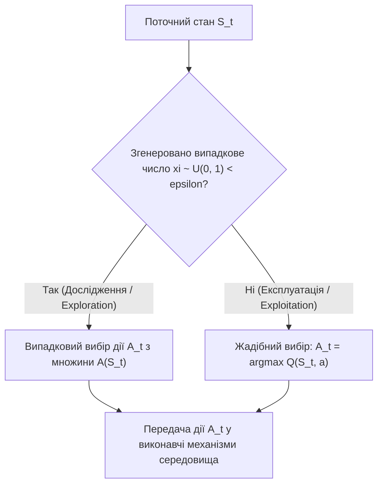
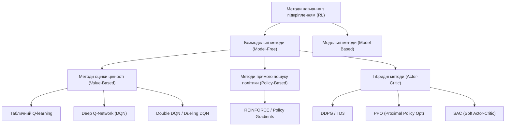
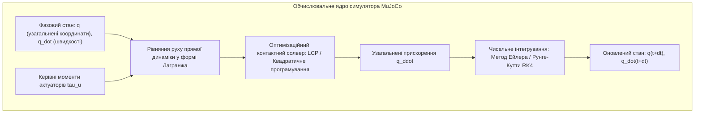
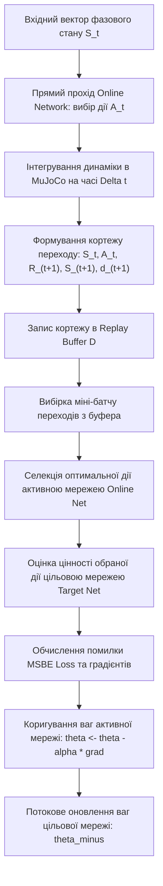

# Тема 11. Навчання з підкріпленням та автономні агенти: марковські процеси прийняття рішень, рівняння Белмана, алгоритми Q-learning та Deep Q-Network у фізичному середовищі MuJoCo

## Мета лекції

Формування цілісної теоретичної та інженерно-математичної системи знань щодо парадигми навчання з підкріпленням, аналітичної формалізації марковських процесів прийняття рішень та оптимізації функцій цінності дій в умовах стохастичної невизначеності. Дослідження математичного апарату рівнянь Белмана, механізмів градієнтного навчання глибоких Q-мереж, а також архітектурних підходів до стабілізації навчання шляхом розриву часових автокореляцій та фіксації цільових оновлень. Оволодіння принципами синтезу дискретних керуючих контурів для високоточного фізичного середовища симуляції багатоланкових контактних систем MuJoCo.

## Очікувані результати навчання

1. **Знання та розуміння.** Студенти повинні засвоїти фундаментальні принципи функціонування замкнених контурів навчання з підкріпленням, формальне визначення компонентів марковського процесу прийняття рішень, математичний зміст операцій дисконтування та усереднення Белмана, а також архітектурну роль буфера повторного відтворення досвіду й цільової нейромережі у Deep Q-Network.
2. **Застосування.** Студенти повинні демонструвати здатність формалізувати фізичну задачу керування динамічним об'єктом у термінах просторів станів, дискретизованих дій і функцій винагороди, складати аналітичні розрахункові схеми алгоритму Q-learning та розраховувати цільові градієнти функції втрат Белмана для нейромережевих апроксиматорів.
3. **Аналіз.** Студенти повинні вміти здійснювати критичний аналіз причин чисельної розбіжності та градієнтної нестабільності під час навчання глибинних моделей безпосередньо з фізичних потоків спостережень, а також аналізувати виникнення систематичного зсуву переоцінки корисності дій (Overestimation Bias) та методи його компенсації.
4. **Оцінювання та синтез.** Студенти повинні вміти обґрунтовано оцінювати якість збіжності процесу навчання автономного агента за метриками сумарної винагороди та TD-помилки, визначати межі застосовності алгоритмів сімейства DQN у неперервних середовищах MuJoCo та синтезувати комбіновані інженерні модифікації алгоритмів для стабілізації багатозв'язного керування.

---

## Детальний покроковий план лекції

### 1. Теоретичний модуль. Архітектурні та концептуальні основи парадигми навчання з підкріпленням

* 1.1. Замкнений кібернетичний контур взаємодії агента із середовищем та розв'язання фундаментальної дилеми дослідження-експлуатації (Exploration vs. Exploitation Tradeoff).
* 1.2. Концептуальна формалізація марковських процесів прийняття рішень (MDP) та фундаментальна фізична властивість марковості динамічних систем.
* 1.3. Принципи оцінювання корисності рішень у табличному алгоритмі Q-learning та межі його масштабування в умовах прокляття розмірності.
* 1.4. Архітектурні особливості та обчислювальний базис фізичного рушія багатоланкової кінематики з контактами MuJoCo.

### 2. Аналітичний модуль. Математична формалізація рівнянь Белмана та оптимізація Deep Q-Networks

* 2.1. Формальне виведення рівнянь усереднення та оптимальності Белмана для функцій цінності стану $V(s)$ та функцій цінності дії $Q(s, a)$.
* 2.2. Математичний апарат помилки часової різниці (TD-Error) та аналітичні умови збіжності стохастичного оновлення оцінок корисності дій.
* 2.3. Постановка задачі оптимізації Deep Q-Network як мінімізації середньоквадратичної похибки Белмана (MSBE) за допомогою стохастичного градієнтного спуску.
* 2.4. Теоретичне обґрунтування ліквідації автокореляції спостережень за допомогою буфера повтору досвіду та усунення рухомості цілей через фіксовану цільову мережу (Target Network).
* 2.5. Математична модифікація алгоритму Double DQN для усунення систематичного завищення оцінки цінності дій.

### 3. Практично-розрахунковий кейс. Синтез системи стабілізації багатоланкового маятника у MuJoCo за допомогою Deep Q-Network

**Тема наскрізної задачі.** «Синтез дискретного нейромережевого регулятора Deep Q-Network для балансування зв'язаного дволанкового маятника в умовах контактних збурень у фізичному середовищі MuJoCo»

## 1. Фундаментальний теоретичний базис та концептуальні засади

### 1.1. Замкнений кібернетичний контур керування та дилема дослідження-експлуатації

Парадигма **навчання з підкріпленням (Reinforcement Learning, RL)** посідає особливе місце в теорії штучного інтелекту та кібернетиці, докорінно відрізняючись як від навчання з учителем (**Supervised Learning**), так і від навчання без учителя (**Unsupervised Learning**). Якщо в задачах навчання з учителем оптимізація моделі відбувається на основі заздалегідь сформованого статичного набору даних з апріорно відомими еталонними мітками (супервізорними сигналами), то в парадигмі навчання з підкріпленням зовнішній вчитель повністю відсутній. Навчальний суб'єкт — **інтелектуальний агент (Agent)** — змушений самостійно видобувати навчальну інформацію шляхом безпосередньої активної взаємодії із динамічним **середовищем (Environment)** в умовах неповної визначеності.

Фундаментом теорії адаптивного керування є замкнений зворотний зв'язок між агентом і середовищем, що розгортається у дискретному часі $t \in \{0, 1, 2, \dots\}$. У кожен дискретний квант часу $t$ агент реєструє поточний **стан середовища (State)** $S_t \in \mathcal{S}$, на основі якого, керуючись поточною внутрішньою стратегією, вибирає та реалізує **дію (Action)** $A_t \in \mathcal{A}$. Середовище, отримавши керівний вплив, здійснює стохастичний або детермінований перехід у новий стан $S_{t+1} \in \mathcal{S}$ та генерує чисельний скалярний відгук — **винагороду (Reward)** $R_{t+1} \in \mathbb{R}$. Цей процес неперервно повторюється, утворюючи послідовність життєвого циклу агента, яка в літературі називається траєкторією або епізодом.


Цілепокладання в навчанні з підкріпленням спирається на **гіпотезу про винагороду (Reward Hypothesis)**, згідно з якою будь-яка інженерна чи оптимізаційна мета може бути формалізована як максимізація математичного сподівання сумарного дисконтованого скалярного сигналу, отриманого агентом на часовому горизонті функціонування. На відміну від жадібної оптимізації, мета агента полягає не в максимізації миттєвого значення $R_{t+1}$, а в максимізації довгострокового кумулятивного виграшу. Це вимагає від інтелектуального агента здатності до відтермінованого задоволення, коли виконання субдослідницьких або локально невигідних дій на початкових етапах забезпечує досягнення глобально оптимального стану системи в майбутньому.

Під час накопичення досвіду агент неминуче стикається з фундаментальним протиріччям, відомим у теорії прийняття рішень як **дилема дослідження та експлуатації (Exploration vs. Exploitation Tradeoff)**:

1. **Експлуатація накопиченого досвіду (Exploitation)** полягає у виборі дії, яка на основі вже наявної у агента інформації забезпечує максимальну оцінку очікуваного кумулятивного виграшу, що дозволяє максимізувати поточну ефективність системи керування.
2. **Дослідження середовища (Exploration)** полягає у виборі альтернативних, субоптимальних або випадкових дій з метою отримання нових знань про простір станів, перевірки гіпотез щодо функцій переходів та пошуку потенційно більш ефективних стратегій, які наразі не виявлені через брак емпіричних спостережень.

Нехтування дослідженням призводить до передчасної збіжності агента до локальних екстремумів функціонала якості, тоді як надмірне дослідження руйнує стабільність керування та суттєво уповільнює процес навчання. Для розв'язання цього конфлікту найчастіше використовується **$\epsilon$-жадібна стратегія ($\epsilon$-greedy policy)**. Формально стохастичний розподіл ймовірності вибору дії агентом у стані $s$ задається виразом:

$$\pi(a \mid s) = \begin{cases} 1 - \epsilon + \frac{\epsilon}{|\mathcal{A}(s)|}, & \text{якщо } a = \arg\max_{a' \in \mathcal{A}} Q(s, a'), \\ \frac{\epsilon}{|\mathcal{A}(s)|}, & \text{якщо } a \neq \arg\max_{a' \in \mathcal{A}} Q(s, a'). \end{cases}$$

де:
* $\pi(a \mid s)$ визначає ймовірність обрання агентом конкретної дії $a$ за умови перебування у стані середовища $s$, вимірювану в діапазоні від $0.0$ до $1.0$.
* $\epsilon \in [0, 1]$ виступає безрозмірним параметром дослідження, що регулює ступінь випадковості поведінки інтелектуального агента.
* $|\mathcal{A}(s)|$ позначає потужність скінченної множини допустимих дій, доступних для виконання агентом у поточному стані $s$.
* $Q(s, a')$ репрезентує очікувану цінність виконання дії $a'$ у стані $s$, що має тип дійсного числа з плаваючою комою $\mathbb{R}$.

На практиці параметр $\epsilon$ не є константою: на початку процесу навчання встановлюється $\epsilon_0 = 1.0$ для всебічного вивчення середовища, після чого застосовується експоненційний або лінійний графік зменшення (**Epsilon Decay**) до фіксованого значення $\epsilon_{\text{end}} \approx 0.01 \dots 0.05$.



---

### 1.2. Концептуальна формалізація марковських процесів прийняття рішень (MDP)

Математичним фундаментом, що формалізує задачу навчання з підкріпленням, виступає теорія **марковських процесів прийняття рішень (Markov Decision Processes, MDP)**. Класичний марковський процес прийняття рішень спирається на фундаментальне припущення щодо динаміки фізичного світу, яке носить назву **марковської властивості (Markov Property)**.

> **ВАЖЛИВО:** Стан $S_t$ володіє марковською властивістю тоді і тільки тоді, коли ймовірнісний розподіл майбутнього стану системи $S_{t+1}$ та винагороди $R_{t+1}$ повністю визначається інформацією, закладеною в поточному стані $S_t$ і дії $A_t$, та є абсолютно незалежним від усієї попередньої передісторії станів, дій і винагород:
>
> $$\mathbb{P}(S_{t+1} = s', R_{t+1} = r \mid S_t = s_t, A_t = a_t, S_{t-1} = s_{t-1}, A_{t-1} = a_{t-1}, \dots, S_0 = s_0, A_0 = a_0) = \mathbb{P}(S_{t+1} = s', R_{t+1} = r \mid S_t = s_t, A_t = a_t).$$

З фізичної та інженерної точок зору марковська властивість вимагає, щоб вектор стану $S_t$ містив повну фазову інформацію про динамічну систему. Наприклад, у класичній механіці положення матеріальної точки не є марковським станом, оскільки траєкторія її подальшого руху залежить від швидкості; натомість фазовий вектор, що об'єднує просторові координати та узагальнені швидкості, повністю задовольняє марковську властивість.

Формально скінченний марковський процес прийняття рішень визначається кортежем із п'яти ключових математичних об'єктів:

$$\mathcal{M} = \langle \mathcal{S}, \mathcal{A}, \mathcal{P}, \mathcal{R}, \gamma \rangle$$

де:
* $\mathcal{S}$ є простором усіх можливих допустимих станів середовища, який може бути скінченною дискретною множиною або неперервним многовидом вимірності $d_s \in \mathbb{N}$.
* $\mathcal{A}$ є простором дій, доступних агенту для керування об'єктом, що задається у вигляді скінченного дискретного набору або неперервної області у просторі $\mathbb{R}^{d_a}$.
* $\mathcal{P}: \mathcal{S} \times \mathcal{A} \times \mathcal{S} \to [0, 1]$ виступає узагальненою функцією ймовірностей переходу станів:

$$\mathcal{P}(s' \mid s, a) = \mathbb{P}(S_{t+1} = s' \mid S_t = s, A_t = a)$$

  що визначає густину ймовірності переходу об'єкта в стан $s'$ за умови прикладання дії $a$ у стані $s$.
* $\mathcal{R}: \mathcal{S} \times \mathcal{A} \times \mathcal{S} \to \mathbb{R}$ являє собою детерміновану або стохастичну функцію винагороди, яка формує математичне сподівання отриманого числового виграшу:

$$\mathcal{R}(s, a, s') = \mathbb{E}\left[ R_{t+1} \mid S_t = s, A_t = a, S_{t+1} = s' \right]$$

* $\gamma \in [0, 1)$ позначає безрозмірний **коефіцієнт дисконтування (Discount Factor)** майбутніх винагород.

Для аналізу тривалості життя агента використовують поняття **кумулятивного дисконтованого виграшу (Return)** $G_t$, який формалізує інтегральну метрику успішності керування:

$$G_t = \sum_{k=0}^{\infty} \gamma^k R_{t+k+1} = R_{t+1} + \gamma R_{t+2} + \gamma^2 R_{t+3} + \dots$$

де:
* $G_t$ виступає скалярною величиною сумарного зваженого виграшу, отриманого починаючи з дискретного кроку $t$, вираженою в одиницях шкали винагород.
* $\gamma^k$ задає геометрично спадний ваговий коефіцієнт для винагороди, отриманої через $k$ кроків у майбутньому.

Введення коефіцієнта дисконтування $\gamma < 1$ має три критичні причини:

1. **Математична регуляризація.** Для задач із нескінченним часовим горизонтом (**Continuing Tasks**) коефіцієнт $\gamma < 1$ гарантує збіжність нескінченного ряду до скінченного значення за умови обмеженості миттєвої винагороди $|R_t| \le R_{\max}$:

$$G_t \le \sum_{k=0}^{\infty} \gamma^k R_{\max} = \frac{R_{\max}}{1 - \gamma} < \infty.$$

2. **Моделювання невизначеності майбутнього.** У реальних фізичних та економічних системах впевненість у достовірності довгострокових прогнозів експоненційно зменшується через накопичення випадкових збурень середовища.
3. **Регулювання поведінкової далекоглядності.** Значення $\gamma \to 0$ формує короткозору (**Myopic**) стратегію, орієнтовану виключно на негайне отримання винагороди, тоді як значення $\gamma \to 1$ спонукає агента до далекоглядного (**Far-sighted**) стратегічного планування поведінки.

---

### 1.3. Принципи оцінювання корисності рішень у табличному алгоритмі Q-learning та межі його масштабування

Для оптимізації поведінки агента необхідно кількісно оцінювати якість перебування в станах або якість виконання конкретних дій. Ця функція покладається на **функцію цінності дій (Action-Value Function)** або **Q-функцію (Q-Function)**, що позначається як $Q^\pi(s, a)$. Значення $Q^\pi(s, a)$ визначає математичне сподівання виграшу $G_t$, якщо агент, перебуваючи у стані $s$, виконає дію $a$, а всі наступні кроки керування здійснюватиме відповідно до стратегії $\pi$:

$$Q^\pi(s, a) = \mathbb{E}_\pi \left[ G_t \mid S_t = s, A_t = a \right] = \mathbb{E}_\pi \left[ \sum_{k=0}^{\infty} \gamma^k R_{t+k+1} \;\middle|\; S_t = s, A_t = a \right].$$

Запропонований Крістофером Воткінсом (Watkins, 1989) алгоритм **Q-learning** є класичним безмодельним (**Model-Free**) методом навчання з підкріпленням, який дозволяє знаходити оптимальну Q-функцію $Q^*(s, a) = \max_\pi Q^\pi(s, a)$ без попереднього знання аналітичної моделі переходів $\mathcal{P}(s' \mid s, a)$ або функції винагород $\mathcal{R}(s, a, s')$.

Фундаментальною властивістю Q-learning є його позастратегічний характер (**Off-Policy**). Це означає, що процес оцінювання та апроксимації оптимальної стратегії здійснюється незалежно від тієї поведінкової стратегії (**Behavior Policy**, наприклад $\epsilon$-greedy), за якою агент генерує рух у середовищі. Позастратегічність реалізується за рахунок використання оператора максимуму по простору дій для наступного стану $S_{t+1}$.

У табличній реалізації Q-learning значення $Q(s, a)$ зберігаються у двовимірній матриці розмірністю $|\mathcal{S}| \times |\mathcal{A}|$. Оновлення кожного елемента таблиці під час виконання кроку переходу $(S_t, A_t, R_{t+1}, S_{t+1})$ здійснюється за правилом часової різниці:

$$Q(S_t, A_t) \leftarrow Q(S_t, A_t) + \alpha \cdot \left[ R_{t+1} + \gamma \max_{a \in \mathcal{A}} Q(S_{t+1}, a) - Q(S_t, A_t) \right]$$

де:
* $\alpha \in (0, 1]$ виступає безрозмірним коефіцієнтом швидкості навчання (**Learning Rate**), що визначає темп оновлення числових оцінок у комірках таблиці.
* $\left[ R_{t+1} + \gamma \max_{a \in \mathcal{A}} Q(S_{t+1}, a) - Q(S_t, A_t) \right]$ позначає **помилку часової різниці (Temporal Difference Error, TD-Error)**, що характеризує локальну неузгодженість між поточною оцінкою цінності та новим одномоментним спостереженням.



Попри строге математичне доведення асимптотичної збіжності табличного Q-learning до оптимальних значень $Q^*(s, a)$ при виконанні умов Роббінса-Монро для кроку навчання $\alpha$, цей метод має нездоланні обмеження при застосуванні до реальних фізичних та інженерних систем:

1. **Прокляття розмірності (Curse of Dimensionality).** Обсяг пам'яті для зберігання таблиці зростає експоненційно зі збільшенням кількості вимірів простору станів: $|\mathcal{S}| = K^{d}$, де $d$ — розмірність вектора стану, а $K$ — кількість інтервалів квантування неперервної координати. Для складного маніпулятора з 12 ступенями вільності квантування кожного виміру лише на 100 дискретних значень потребує таблиці з $100^{12} = 10^{24}$ станів, що фізично неможливо алокувати в оперативній пам'яті сучасних ЕОМ.
2. **Неможливість узагальнення (Generalization Failure).** У табличному алгоритмі оновлення значення $Q(s, a)$ модифікує виключно одну ізольовану комірку таблиці. Отриманий досвід абсолютно не екстраполюється на топологічно сусідні або фізично подібні стани, внаслідок чого агент повинен відвідати кожен стан колосальну кількість разів для формування адекватної політики керування.
3. **Непридатність для неперервних просторів дій.** Пошук жадібної дії вимагає обчислення оператора $\max_{a \in \mathcal{A}} Q(s, a)$. Якщо для скінченного дискретного набору це зводиться до лінійного перебору, то в неперервному просторі дій $\mathcal{A} \subseteq \mathbb{R}^m$ розв'язання нелінійної оптимізаційної задачі на кожному мікрокроці симуляції стає обчислювально нездійсненним у реальному часі.

Подолання цих бар'єрів зумовило перехід від табличних методів до методів **функціональної апроксимації (Function Approximation)**, де функція цінності $Q(s, a)$ параметризується глибокою нейронною мережею $Q(s, a; \boldsymbol{\theta})$ з вектором вагових коефіцієнтів $\boldsymbol{\theta}$, що й лягло в основу архітектури **Deep Q-Network (DQN)**.

---

### 1.4. Архітектурні особливості та обчислювальний базис фізичного рушія MuJoCo

Експериментальна верифікація та навчання алгоритмів RL вимагає адекватного віртуального середовища, здатного з високою точністю відтворювати складні динамічні процеси реального світу. Стандартні ігрові фізичні рушії (такі як PhysX, Bullet або ODE) розроблялися насамперед для забезпечення візуальної правдоподібності та стабільності симуляції в реальному часі за рахунок спрощення або евристичної модифікації фізичних законів. Для наукових і робототехнічних завдань такий підхід є неприпустимим, оскільки нефізичні спрощення призводять до виникнення явища **розриву між симуляцією та реальністю (Simulation-to-Reality Gap, Sim2Real Gap)**, через що навчений у симуляторі агент втрачає працездатність на реальному залізі.

Середовище **MuJoCo (Multi-Joint dynamics with Contact)** являє собою спеціалізований фізичний рушій нового покоління, оптимізований для задач робототехніки, біомеханічного моделювання та машинного навчання.



Математичний апарат MuJoCo базується на формалізмі аналітичної механіки у **просторі узагальнених координат (Generalized Coordinates)**. На відміну від симуляторів, які описують кожне тверде тіло шістьма декартовими координатами і накладають зовнішні білатеральні зв'язки (що призводить до порушення стабільності з'єднань і «розриву» суглобів), MuJoCo виключає невільні ступені вільності на рівні самої кінематичної моделі через рівняння Лагранжа другого роду:

$$\mathbf{M}(\mathbf{q}) \ddot{\mathbf{q}} + \mathbf{C}(\mathbf{q}, \dot{\mathbf{q}}) \dot{\mathbf{q}} + \mathbf{g}(\mathbf{q}) = \boldsymbol{\tau} + \mathbf{J}_c^T(\mathbf{q}) \mathbf{f}_c$$

де:
* $\mathbf{q} \in \mathbb{R}^{n_q}$ являє собою вектор узагальнених координат системи, що описує кути повороту шарнірів та лінійні зміщення ланок, виражений у радіанах або метрах.
* $\dot{\mathbf{q}}, \ddot{\mathbf{q}} \in \mathbb{R}^{n_v}$ визначають вектори узагальнених швидкостей і прискорень відповідно, що мають розмірності $\text{рад}/\text{с}$ ($\text{м}/\text{с}$) та $\text{рад}/\text{с}^2$ ($\text{м}/\text{с}^2$).
* $\mathbf{M}(\mathbf{q}) \in \mathbb{R}^{n_v \times n_v}$ є симетричною додатно визначеною матрицею узагальненої інерції багатоланкової системи.
* $\mathbf{C}(\mathbf{q}, \dot{\mathbf{q}}) \in \mathbb{R}^{n_v \times n_v}$ відображає матрицю коріолісових та відцентрових сил інерції.
* $\mathbf{g}(\mathbf{q}) \in \mathbb{R}^{n_v}$ задає вектор сил гравітаційного навантаження.
* $\boldsymbol{\tau} \in \mathbb{R}^{n_v}$ визначає вектор узагальнених сил і керуючих моментів, створених актуаторами системи, виражений у Ньютон-метрах ($\text{Н}\cdot\text{м}$) або Ньютонах ($\text{Н}$).
* $\mathbf{J}_c(\mathbf{q})$ являє собою матрицю Якобі контактних зв'язків, а $\mathbf{f}_c$ — вектор сил контактної взаємодії.

Ключова обчислювальна інновація MuJoCo полягає в трактуванні сухих контактів і тертя не через жорсткі переривчасті умови взаємодоповнюваності Синьйоріні-Герца, які формують складну некоректну задачу лінійного доповнення (**Linear Complementarity Problem, LCP**), а через гладку опуклу оптимізацію. Контактні сили обчислюються шляхом мінімізації спеціально сконструйованого квадрічного функціонала енергії з обмеженнями у формі конусів тертя. Це забезпечує:

1. **Чисельну стабільність.** Відсутність сингулярностей матриць під час контакту кількох поверхонь одночасно.
2. **Обчислювальну швидкодію.** Можливість інтегрування динаміки складних систем зі швидкістю, що на декілька порядків перевищує фізичний реальний час, дозволяючи генерувати мільйони кроків досвіду RL за лічені години.
3. **Аналітичну диференційованість.** Можливість обчислення градієнтів динаміки $\nabla_{\mathbf{q}} \ddot{\mathbf{q}}$ та $\nabla_{\boldsymbol{\tau}} \ddot{\mathbf{q}}$, що є критичним для поєднання навчання з підкріпленням із методами прямої траєкторної оптимізації.

При застосуванні алгоритму Deep Q-Network до середовищ MuJoCo виникає фундаментальне архітектурне протиріччя: простір керування роботів у MuJoCo за своєю фізичною природою є неперервним вектором моментів $\boldsymbol{\tau} \in [-\boldsymbol{\tau}_{\max}, \boldsymbol{\tau}_{\max}]$, тоді як класичний DQN оперує виключно скінченними дискретними множинами дій. Для подолання цієї невідповідності вдаються до штучної решітчастої **дискретизації дій (Action Discretization)**, коли для кожного актуатора виділяється скінченний набір квантованих значень, наприклад $\{-u_{\max}, 0, +u_{\max}\}$.

---

### Систематизація та порівняльний аналіз базових підходів RL

| Парадигма / Алгоритм | Простір станів $\mathcal{S}$ | Простір дій $\mathcal{A}$ | Математичний апроксиматор | Обчислювальна складність кроку | Стійкість у фізичних симуляторах |
| :--- | :--- | :--- | :--- | :--- | :--- |
| **Tabular Q-Learning** | Малий дискретний ($|\mathcal{S}| < 10^5$) | Скінченний дискретний ($|\mathcal{A}| < 10^2$) | Двовимірний масив у пам'яті | $\mathcal{O}(|\mathcal{A}|)$ | Непридатний через прокляття розмірності фазового простору |
| **Deep Q-Network (DQN)** | Високовимірний неперервний $\mathbb{R}^n$ | Дискретний квантований | Глибока нейромережа $Q(s, a; \boldsymbol{\theta})$ | $\mathcal{O}(B \cdot |\boldsymbol{\theta}|)$ | Задовільна за умови грубої дискретизації моментів шарнірів |
| **Double DQN (DDQN)** | Високовимірний неперервний $\mathbb{R}^n$ | Дискретний квантований | Дві розв'язані мережі $Q$ та $Q_{\text{targ}}$ | $\mathcal{O}(B \cdot |\boldsymbol{\theta}|)$ | Висока завдяки ліквідації завищення оцінок цінності дій |
| **Dueling DQN** | Високовимірний неперервний $\mathbb{R}^n$ | Дискретний квантований | Двопотокова мережа $V(s) + A(s, a)$ | $\mathcal{O}(B \cdot |\boldsymbol{\theta}|)$ | Підвищена у станах, де вибір конкретної дії мало впливає на динаміку |
| **Continuous Actor-Critic (SAC / PPO)** | Високовимірний неперервний $\mathbb{R}^n$ | Неперервний вектор $\mathbb{R}^m$ | Дві мережі: критик $Q(s,a)$ та актор $\pi(a \mid s)$ | $\mathcal{O}(B \cdot (|\boldsymbol{\theta}| + |\boldsymbol{\phi}|))$ | Еталонна для робототехнічних завдань у середовищі MuJoCo |

---

> **ТИПОВА ПОМИЛКА:** Ототожнення вектора спостережень сенсорів робота із дійсним марковським станом динамічної системи.
> 
> У реальних інженерних застосунках та симуляціях початківці часто подають на вхід нейронної мережі лише покази геометричних датчиків (наприклад, кути суглобів маніпулятора $\mathbf{q}$ або окремий статичний кадр із камери), вважаючи це повним описом стану $S_t$. Однак за відсутності перших похідних (швидкостей $\dot{\mathbf{q}}$) або інформації про попередні кадри система перестає задовольняти марковську властивість, оскільки два однакових кутових положення можуть відповідати абсолютно протилежним напрямкам руху об'єкта. 
> 
> Подібна редукція перетворює марковський процес прийняття рішень (MDP) на **частково спостережуваний марковський процес (Partially Observable Markov Decision Process, POMDP)**, у якому алгоритми класу DQN втрачають теоретичну збіжність і демонструють хаотичну розбіжність через невідповідність математичної моделі припущенням алгоритму. Для збереження марковості необхідно або включати повний фазовий вектор швидкостей, або застосовувати стекування послідовних кадрів (**Frame Stacking**), або інтегрувати рекурентні шари LSTM/GRU.

---

> **КОНТРОЛЬНЕ ПИТАННЯ.** Чому в задачах керування без обмеження за часом (Continuing Tasks) принципово неможливо покласти коефіцієнт дисконтування рівним одиниці ($\gamma = 1.0$), і яким чином порушення цієї вимоги впливає на спектральний радіус оператора динамічного програмування Белмана?

<details markdown="1">
<summary>Розгорнути відповідь</summary>

**Аналітична відповідь:**

1. Якщо часовий горизонт функціонування агента є нескінченним і задача не містить поглинаючих термінальних станів, значення кумулятивної винагороди при $\gamma = 1.0$ набуває вигляду:

$$G_t = \sum_{k=0}^{\infty} 1^k \cdot R_{t+k+1} = \sum_{k=0}^{\infty} R_{t+k+1}.$$

Якщо функція винагороди формує постійний ненульовий сигнал на кожному кроці (наприклад, $R_t = +1$ за утримання рівноваги інвертованого маятника), то ряд строго розбігається до нескінченності:

$$\lim_{T \to \infty} \sum_{k=0}^{T} 1.0 = +\infty.$$

У результаті всі допустимі дії та траєкторії набувають однакової нескінченної цінності $Q(s, a) = +\infty$, що позбавляє агента можливості градієнтного порівняння та селекції оптимальних дій.

2. З точки зору функціонального аналізу, оператор стиску Белмана $\mathcal{T}^\pi$:

$$(\mathcal{T}^\pi Q)(s, a) = \mathcal{R}(s, a) + \gamma \sum_{s'} \mathcal{P}(s' \mid s, a) \sum_{a'} \pi(a' \mid s') Q(s', a')$$

є стискаючим відображенням у банаховому просторі функцій із нормою Чебишова $\|Q\|_\infty = \max_{s, a} |Q(s, a)|$ з коефіцієнтом стиску саме $\gamma$:

$$\|\mathcal{T}^\pi Q_1 - \mathcal{T}^\pi Q_2\|_\infty \le \gamma \|Q_1 - Q_2\|_\infty.$$

При $\gamma = 1.0$ оператор перестає бути строго стискаючим, теорема Банаха про нерухому точку втрачає силу, спектральний радіус відповідної матриці переходу стає рівним одиниці, а ітераційні чисельні алгоритми розв'язання рівнянь Белмана втрачають гарантію збіжності до єдиного розв'язку.

</details>

---

### Вказівки для самостійного осмислення теоретичного базису

1. Проаналізуйте зв'язок між частотою дискретизації керування за часом $\Delta t$ у фізичному симуляторі MuJoCo та числовим значенням коефіцієнта дисконтування $\gamma$, звернувши увагу на те, як зберегти еквівалентний часовий горизонт планування при зміні частоти інтегрування фізики.
2. Дослідіть вплив кроку квантування простору неперервних керуючих моментів у багатоланкових системах на виникнення комбінаторного вибуху простору дій та оцініть межі фізичної реалізованості отриманих дискретних імпульсів на реальних електродвигунах.
3. Зіставте концепцію побудови контактних сил у MuJoCo через регуляризовану опуклу оптимізацію із класичним підходом розв'язання задач лінійного доповнення (LCP) у рушіях типу ODE, оцінивши компроміс між чисельною стабільністю симулятора та фізичною точністю відтворення контактного тертя.

## 2. Аналітичні процеси, математичний апарат та моделювання

### 2.1. Формальне виведення рівнянь усереднення та оптимальності Белмана для функцій цінності стану та дій

Математична оптимізація стратегії поведінки інтелектуального агента в марковських процесах прийняття рішень спирається на рекурентний аналіз очікуваної корисності майбутніх подій. За своєю суттю **функція цінності стану (State-Value Function)** $V^\pi(s)$ визначає математичне сподівання кумулятивного дисконтованого виграшу $G_t$, досяжного за умови виходу із фіксованого початкового стану $s$ за умови строгого дотримання заданої ймовірнісної політики $\pi$:

$$V^\pi(s) = \mathbb{E}_\pi \left[ G_t \;\middle|\; S_t = s \right] = \mathbb{E}_\pi \left[ \sum_{k=0}^{\infty} \gamma^k R_{t+k+1} \;\middle|\; S_t = s \right]$$

де:
* $V^\pi(s)$ позначає скалярну величину цінності перебування у стані $s \in \mathcal{S}$ за умови реалізації політики $\pi$, що має розмірність накопиченого сумарного виграшу в шкалі винагород $\mathbb{R}$.
* $\mathbb{E}_\pi[\,\cdot\,]$ визначає оператор математичного сподівання випадкової величини за траєкторіями, згенерованими розподілом дій $\pi(a \mid s)$ та переходами середовища $\mathcal{P}(s' \mid s, a)$.
* $G_t$ являє собою випадкову величину сумарного дисконтованого виграшу, починаючи з моменту часу $t$.
* $\gamma \in [0, 1)$ є безрозмірним коефіцієнтом дисконтування, що забезпечує геометричне згасання вагомості відтермінованих винагород.
* $R_{t+k+1} \in \mathbb{R}$ визначає випадкову величину скалярної винагороди, отриманої на кроці $t+k+1$.

Аналогічним чином визначається **функція цінності дії (Action-Value Function)** $Q^\pi(s, a)$, яка оцінює ефективність конкретного керівного впливу $a$ у стані $s$ із подальшим дотриманням стратегії $\pi$:

$$Q^\pi(s, a) = \mathbb{E}_\pi \left[ G_t \;\middle|\; S_t = s, A_t = a \right] = \mathbb{E}_\pi \left[ \sum_{k=0}^{\infty} \gamma^k R_{t+k+1} \;\middle|\; S_t = s, A_t = a \right]$$

де:
* $Q^\pi(s, a)$ відображає математичне сподівання сумарного виграшу агента після виконання дії $a \in \mathcal{A}$ у стані $s \in \mathcal{S}$ із подальшим вибором усіх наступних дій згідно з розподілом $\pi$.

Аналітичне виведення **рівняння усереднення Белмана (Bellman Expectation Equation)** для $V^\pi(s)$ базується на відокремленні миттєвої винагороди $R_{t+1}$ від суми майбутніх дисконтованих винагород за формулою розкладання $G_t = R_{t+1} + \gamma G_{t+1}$:

$$
\begin{aligned}
\text{Етап 1 (Розклад кумулятивного виграшу):} & \quad V^\pi(s) = \mathbb{E}_\pi \left[ R_{t+1} + \gamma \sum_{k=0}^{\infty} \gamma^k R_{t+k+2} \;\middle|\; S_t = s \right] \\
\text{Етап 2 (Застосування закону повного сподівання):} & \quad V^\pi(s) = \mathbb{E}_\pi \left[ R_{t+1} + \gamma V^\pi(S_{t+1}) \;\middle|\; S_t = s \right] \\
\text{Етап 3 (Розгортання через поліморфні суми):} & \quad V^\pi(s) = \sum_{a \in \mathcal{A}} \pi(a \mid s) \sum_{s' \in \mathcal{S}} \mathcal{P}(s' \mid s, a) \left[ \mathcal{R}(s, a, s') + \gamma V^\pi(s') \right]
\end{aligned}
$$

де:
* $\pi(a \mid s)$ позначає ймовірність призначення агентом керівної дії $a$ у стані $s$.
* $\mathcal{P}(s' \mid s, a) = \mathbb{P}(S_{t+1} = s' \mid S_t = s, A_t = a)$ задає функцію густини ймовірності переходу динамічної системи у стан $s'$ за умови виконання дії $a$ у стані $s$.
* $\mathcal{R}(s, a, s') = \mathbb{E}[R_{t+1} \mid S_t = s, A_t = a, S_{t+1} = s']$ позначає детерміноване математичне сподівання отриманої винагороди.

Використовуючи прямий алгебраїчний зв'язок між функціями $V^\pi(s)$ та $Q^\pi(s, a)$, а саме $V^\pi(s) = \sum_{a} \pi(a \mid s) Q^\pi(s, a)$, отримуємо аналогічне рівняння усереднення Белмана для функції цінності дії:

$$Q^\pi(s, a) = \sum_{s' \in \mathcal{S}} \mathcal{P}(s' \mid s, a) \left[ \mathcal{R}(s, a, s') + \gamma \sum_{a' \in \mathcal{A}} \pi(a' \mid s') Q^\pi(s', a') \right]$$

Для визначення граничної продуктивності системи вводиться поняття **оптимальної Q-функції** $Q^*(s, a) = \max_\pi Q^\pi(s, a)$. Оскільки оптимальна стратегія $\pi^*$ є детерміновано жадібною відносно оптимальної функції цінності, тобто $\pi^*(a \mid s) = 1$ для $a = \arg\max_{a'} Q^*(s, a')$, математичне сподівання за простором дій замінюється нелінійним оператором точної верхньої грані. Це породжує **рівняння оптимальності Белмана (Bellman Optimality Equation)**:

$$Q^*(s, a) = \sum_{s' \in \mathcal{S}} \mathcal{P}(s' \mid s, a) \left[ \mathcal{R}(s, a, s') + \gamma \max_{a' \in \mathcal{A}} Q^*(s', a') \right]$$

В аналітичній формі рівняння оптимальності записується як операторне рівняння нерухомої точки: $Q^* = \mathcal{T}^* Q^*$, де $\mathcal{T}^*$ позначає **оператор оптимальності Белмана**.

> **ВАЖЛИВО:** Оператор оптимальності Белмана $\mathcal{T}^*$ є строго стискаючим відображенням у банаховому просторі функцій із рівномірною Чебишовською нормою $\|Q\|_\infty = \max_{s \in \mathcal{S}, a \in \mathcal{A}} |Q(s, a)|$. Для будь-яких двох функцій цінності $Q_1$ та $Q_2$ гарантовано виконується нерівність стиску з модулем $\gamma$:
>
> $$\|\mathcal{T}^* Q_1 - \mathcal{T}^* Q_2\|_\infty \le \gamma \|Q_1 - Q_2\|_\infty$$
>
> Згідно з **теоремою Банаха про нерухому точку**, операторне рівняння $Q = \mathcal{T}^* Q$ має один і тільки один розв'язок $Q^*$, а послідовність ітерацій $Q_{k+1} = \mathcal{T}^* Q_k$ асимптотично збігається до $Q^*$ із швидкістю геометричної прогресії:
>
> $$\lim_{k \to \infty} \|Q_k - Q^*\|_\infty = 0, \quad \|Q_k - Q^*\|_\infty \le \frac{\gamma^k}{1 - \gamma} \|Q_1 - Q_0\|_\infty$$

---

### 2.2. Математичний апарат помилки часової різниці та аналітичні умови збіжності

Коли аналітичні матриці переходів $\mathcal{P}(s' \mid s, a)$ фізичного середовища невідомі (налаштування **Model-Free**), обчислення точного математичного сподівання замінюється обчисленням вибіркових стохастичних оцінок. Базовим інструментом коригування поточних прогнозів виступає **помилка часової різниці (Temporal Difference Error, TD-Error)** $\delta_t$:

$$\delta_t = Y_t^{\text{Q}} - Q(S_t, A_t) = R_{t+1} + \gamma \max_{a \in \mathcal{A}} Q(S_{t+1}, a) - Q(S_t, A_t)$$

де:
* $\delta_t$ позначає величину часової нев'язки на кроці $t$, яка характеризує похибку локальної самоузгодженості оцінок цінності Белмана.
* $Y_t^{\text{Q}} = R_{t+1} + \gamma \max_{a} Q(S_{t+1}, a)$ виступає вибірковою цільовою оцінкою Белмана (**TD Target**), сформованою на основі реальної винагороди та прогнозу цінності наступного стану.
* $Q(S_t, A_t)$ визначає поточне значення прогнозованої цінності пари стан-дія.

Ітераційне стохастичне наближення табличного алгоритму Q-learning описується різницевим оператором:

$$Q_{t+1}(S_t, A_t) = Q_t(S_t, A_t) + \alpha_t(S_t, A_t) \cdot \delta_t$$

Аналітичне доведення асимптотичної збіжності оцінок $Q_t(s, a)$ до теоретичного оптимуму $Q^*(s, a)$ з імовірністю $1$ базується на теоремі стохастичної апроксимації Роббінса-Монро. Для математичної гарантії збіжності стохастичного процесу вимагається одночасне виконання трьох аналітичних умов:

1. Нескінченна продуктивність кроку навчання для забезпечення подолання довільного початкового зміщення та повного проходження фазового простору:

$$\sum_{t=0}^{\infty} \alpha_t(s, a) = \infty, \quad \forall s \in \mathcal{S}, \; a \in \mathcal{A}$$

2. Скінченність суми квадратів кроків навчання, що гарантує асимптотичне згасання дисперсії стохастичного градієнтного шуму, зумовленого випадковістю середовища:

$$\sum_{t=0}^{\infty} \alpha_t^2(s, a) < \infty, \quad \forall s \in \mathcal{S}, \; a \in \mathcal{A}$$

3. Умова необмеженого дослідження простору станів, згідно з якою кожна допустима пара $(s, a)$ повинна відвідуватися агентом нескінченну кількість разів у границі $t \to \infty$.

---

### 2.3. Постановка задачі оптимізації Deep Q-Network як мінімізації похибки Белмана за допомогою SGD

В умовах фізичних багатовимірних просторів станів таблична репрезентація замінюється нелінійною функціональною апроксимацією: $Q(s, a) \approx Q(s, a; \boldsymbol{\theta})$, де $\boldsymbol{\theta} \in \mathbb{R}^{D}$ — вектор оптимізованих параметрів штучної нейронної мережі. 

Формалізація процесу навчання полягає в мінімізації функціонала середньоквадратичної похибки Белмана (**Mean Squared Bellman Error, MSBE**) за емпіричним розподілом переходів:

$$\mathcal{L}(\boldsymbol{\theta}) = \mathbb{E}_{(s, a, r, s') \sim \mathcal{D}} \left[ \left( r + \gamma \max_{a' \in \mathcal{A}} Q(s', a'; \boldsymbol{\theta}^-) - Q(s, a; \boldsymbol{\theta}) \right)^2 \right]$$

де:
* $\mathcal{L}(\boldsymbol{\theta})$ позначає цільову функцію втрат нейромережі, виражену в квадратичних одиницях шкали винагород.
* $\mathcal{D}$ являє собою розподіл ймовірностей кортежів переходу $(s, a, r, s')$, збережених у пам'яті агента.
* $\boldsymbol{\theta}$ позначає вектор вагових коефіцієнтів активної оптимізованої нейромережі (**Online Network**).
* $\boldsymbol{\theta}^-$ визначає вектор ваг допоміжної фіксованої цільової нейромережі (**Target Network**).

Виведення вектора градієнта функції втрат вимагає застосування процедури **напівградієнта (Semi-gradient descent)**, оскільки цільова мітка $y^{\text{DQN}} = r + \gamma \max_{a'} Q(s', a'; \boldsymbol{\theta}^-)$ розглядається як інваріант відносно вектора ваг $\boldsymbol{\theta}$:

$$
\begin{aligned}
\text{Етап 1 (Диференціювання за ланцюговим правилом):} & \quad \nabla_{\boldsymbol{\theta}} \mathcal{L}(\boldsymbol{\theta}) = \mathbb{E} \left[ \nabla_{\boldsymbol{\theta}} \left( y^{\text{DQN}} - Q(s, a; \boldsymbol{\theta}) \right)^2 \right] \\
\text{Етап 2 (Розкриття похідної внутрішньої функції):} & \quad \nabla_{\boldsymbol{\theta}} \mathcal{L}(\boldsymbol{\theta}) = \mathbb{E} \left[ 2 \left( y^{\text{DQN}} - Q(s, a; \boldsymbol{\theta}) \right) \cdot \nabla_{\boldsymbol{\theta}} \left( y^{\text{DQN}} - Q(s, a; \boldsymbol{\theta}) \right) \right] \\
\text{Етап 3 (Фіксація цільової мітки } \nabla_{\boldsymbol{\theta}} y^{\text{DQN}} = \mathbf{0}\text{):} & \quad \nabla_{\boldsymbol{\theta}} \mathcal{L}(\boldsymbol{\theta}) = -2 \cdot \mathbb{E}_{(s, a, r, s')} \left[ \left( r + \gamma \max_{a'} Q(s', a'; \boldsymbol{\theta}^-) - Q(s, a; \boldsymbol{\theta}) \right) \nabla_{\boldsymbol{\theta}} Q(s, a; \boldsymbol{\theta}) \right]
\end{aligned}
$$

Стохастична апроксимація теоретичного градієнта за випадковим міні-батчем розміром $B$ обчислюється як:

$$\mathbf{g}_{\boldsymbol{\theta}} = -\frac{2}{B} \sum_{i=1}^{B} \left( r_i + \gamma (1 - d_i) \max_{a' \in \mathcal{A}} Q(s'_i, a'; \boldsymbol{\theta}^-) - Q(s_i, a_i; \boldsymbol{\theta}) \right) \nabla_{\boldsymbol{\theta}} Q(s_i, a_i; \boldsymbol{\theta})$$

де $d_i \in \{0, 1\}$ позначає булевий прапорець завершення епізоду (**Terminal Flag**), що обнуляє майбутню цінність у момент фізичного переривання процесу.

---

### 2.4. Теоретичне обґрунтування ліквідації автокореляції спостережень та стабілізація цільових оцінок

Застосування стандартних алгоритмів стохастичного градієнтного спуску до навчання глибоких нейромереж базується на строгій статистичній аксіомі: вибіркові спостереження мають бути **незалежними та однаково розподіленими (Independent and Identically Distributed, I.I.D.)**. Однак траєкторія агента у фізичному симуляторі є неперервним марковським ланцюгом, де послідовні стани характеризуються сильною автокореляцією:

$$\operatorname{Cov}(S_t, S_{t+1}) \neq 0, \quad \lim_{\Delta t \to 0} \|S_{t+\Delta t} - S_t\|_2 = 0$$

Навчання нейромережі на безпосередньому послідовному потоці даних призводить до катастрофічного руйнування вагових коефіцієнтів (**Catastrophic Forgetting**) та чисельної нестабільності параметрів. 

Для розриву автокореляційних зв'язків у DQN застосовується **буфер повтору досвіду (Experience Replay Buffer)** $\mathcal{D}$, ємністю $N_{\text{mem}}$ переходів. Формування міні-батчу здійснюється за законом дискретного рівномірного розподілу:

$$\mathbb{P}\left( (s_i, a_i, r_i, s'_i) \sim \mathcal{D} \right) = \frac{1}{|\mathcal{D}|}$$

Рівномірна випадкова вибірка гарантує, що матриця коваріації між векторами станів всередині навчального батчу асимптотично наближається до діагональної:

$$\lim_{B, N_{\text{mem}} \to \infty} \operatorname{Cov}(s_j, s_k) = \mathbf{0}, \quad \forall j \neq k \in \{1, \dots, B\}$$

Другим джерелом розбіжності виступає проблема «рухомої мітки» (**Moving Target Problem**), спричинена тим, що одна й та сама функція $Q$ використовується і для прогнозування, і для обчислення цільового сигналу Белмана. Для стабілізації використовується **цільова мережа (Target Network)** з вагами $\boldsymbol{\theta}^-$. Оновлення ваг цільової мережі виконується за двома альтернативними протоколами:

1. **Жорстке періодичне оновлення (Hard Update):**

$$\boldsymbol{\theta}^- \leftarrow \boldsymbol{\theta} \quad \text{кожні } C \text{ дискретних кроків градієнтного спуску}.$$

2. **Плавне експоненційне оновлення (Soft Polyak Update):**

$$\boldsymbol{\theta}^- \leftarrow \tau \boldsymbol{\theta} + (1 - \tau) \boldsymbol{\theta}^-$$

де $\tau \ll 1$ (наприклад, $\tau = 0.005$) є безрозмірним коефіцієнтом згладжування, що реалізує фільтрацію низьких частот для простору параметрів.

```mermaid
sequenceDiagram
    autonumber
    participant Env as Фізичне середовище (MuJoCo)
    participant Agent as Агент (Online Q-Network theta)
    participant Buffer as Буфер досвіду (Replay Buffer D)
    participant TargetNet as Цільова мережа (Target Q-Net theta_minus)
    participant Optimizer as Градієнтний оптимізатор (Adam)

    loop Збір фізичного досвіду
        Env->>Agent: Вектор фазового стану S_t
        Agent->>Env: Керівний імпульс A_t (epsilon-greedy)
        Env->>Buffer: Збереження кортежу (S_t, A_t, R_t+1, S_t+1, d_t)
    end

    par Пакетна оптимізація нейромережі
        Buffer->>Agent: Стохастичний міні-батч розміром B
        Buffer->>TargetNet: Наступні стани S'_i батчу
        TargetNet-->>Agent: Цільові оцінки: max_a' Q(S'_i, a'; theta_minus)
        Note over Agent: Розрахунок помилки Белмана MSBE Loss
        Agent->>Optimizer: Обчислення напівградієнта dL/d_theta
        Optimizer->>Agent: Оновлення активних ваг: theta <- theta - lr * grad
    and Синхронізація параметрів
        Agent-->>TargetNet: Плавне оновлення: theta_minus <- tau*theta + (1-tau)*theta_minus
    end
```

---

### 2.5. Математична модифікація алгоритму Double DQN для усунення завищення цінності дій

У класичному алгоритмі Deep Q-Network розрахунок цільової мітки спирається на максимізацію функції цінності цільової мережі: $Y_t^{\text{DQN}} = R_{t+1} + \gamma \max_{a'} Q(S_{t+1}, a'; \boldsymbol{\theta}^-)$. Присутність оператора максимуму над зашумленими апроксимованими оцінками призводить до виникнення систематичного позитивного зсуву — **переоцінки цінності дій (Overestimation Bias)**.

Математична природа виникнення зміщення максимізації ґрунтується на **нерівності Єнсена**. Нехай дійсні оцінки дій містять випадковий апроксимаційний шум із нульовим математичним сподіванням: $\hat{Q}(s, a) = Q^*(s, a) + \epsilon_a$, де $\mathbb{E}[\epsilon_a] = 0$. Оскільки функція $\max_a(\cdot)$ є строго опуклою, математичне сподівання максимуму випадкових величин завжди більше або дорівнює максимуму від їхніх математичних сподівань:

$$\mathbb{E}\left[ \max_{a \in \mathcal{A}} \hat{Q}(s, a) \right] \ge \max_{a \in \mathcal{A}} \mathbb{E}\left[ \hat{Q}(s, a) \right] = \max_{a \in \mathcal{A}} Q^*(s, a)$$

Навіть якщо середній рівень похибки мережі дорівнює нулю, оператор максимізації систематично обирає оцінки з позитивними флуктуаціями шуму. Внаслідок рекурсивного бутстрепінгу в рівнянні Белмана завищене значення $Q(s', a')$ переноситься на стан $Q(s, a)$, що приводить до експоненційного роздування функціонала цінності та колапсу політики керування.

Алгоритм **Double DQN (DDQN)** усуває дане явище шляхом математичного розщеплення операцій **вибору дії** та **оцінки її цінності** між двома незалежними наборами ваг:

$$Y_t^{\text{DoubleQ}} = R_{t+1} + \gamma (1 - d_t) \cdot Q\left( S_{t+1}, \arg\max_{a \in \mathcal{A}} Q(S_{t+1}, a; \boldsymbol{\theta}_t) ; \boldsymbol{\theta}_t^- \right)$$

де:
* $a^* = \arg\max_{a} Q(S_{t+1}, a; \boldsymbol{\theta}_t)$ визначає дію, обрану виключно **активною** нейромережею на основі поточних ваг $\boldsymbol{\theta}_t$.
* $Q(S_{t+1}, a^*; \boldsymbol{\theta}_t^-)$ являє собою числову оцінку вартості обраної дії $a^*$, розраховану незалежною **цільовою** нейромережею $\boldsymbol{\theta}_t^-$.

```mermaid
stateDiagram-v2
    [*] --> InitializeMemory: Ініціалізація буфера D та ваг theta, theta_minus
    InitializeMemory --> StateObservation: Отримання початкового фазового стану S_0
    
    state ExecutionCycle {
        StateObservation --> ActionSelection: Генерація epsilon-greedy дії A_t
        ActionSelection --> PhysicsStep: Інтегрування рівнянь руху у MuJoCo
        PhysicsStep --> ExperienceStorage: Фіксація кортежу переходу в Replay Buffer
        ExperienceStorage --> StateObservation: Перехід S_t <- S_(t+1)
    }

    state OptimizationCycle {
        ExperienceStorage --> BatchSampling: Формування міні-батчу з Replay Buffer
        BatchSampling --> ActionDecoupling: DDQN селекція дії: a* = argmax Q(s', a; theta)
        ActionDecoupling --> TargetEvaluation: Оцінка цінності через TargetNet: Q(s', a*; theta_minus)
        TargetEvaluation --> LossComputation: Розрахунок MSBE Loss та оновлення ваг theta
        LossComputation --> TargetSoftSync: Плавне оновлення цільових ваг theta_minus
        TargetSoftSync --> BatchSampling
    }
```



---

### Аналітична матриця зіставлення моделей функціональної оптимізації

| Архітектурна модель | Формула цільової мітки $Y_t$ | Функція втрат $\mathcal{L}(\boldsymbol{\theta})$ | Математичне зміщення оцінки | Витрати пам'яті на крок | Стійкість оптимізації |
| :--- | :--- | :--- | :--- | :--- | :--- |
| **Табличний Q-learning** | $R_{t+1} + \gamma \max_a Q(S_{t+1}, a)$ | $\frac{1}{2} \delta_t^2$ | Високе позитивне (через шум середовища) | $\mathcal{O}(|\mathcal{S}| \cdot |\mathcal{A}|)$ | Абсолютна за умов Роббінса-Монро |
| **Класичний DQN** | $R_{t+1} + \gamma \max_a Q(S_{t+1}, a; \boldsymbol{\theta}^-)$ | $\frac{1}{B} \sum_{i=1}^B (y_i - Q_i)^2$ | Значне позитивне (Overestimation Bias) | $\mathcal{O}(N_{\text{mem}} \cdot d_s + 2|\boldsymbol{\theta}|)$ | Середня (схильний до розбіжності $Q \to \infty$) |
| **Double DQN (DDQN)** | $R_{t+1} + \gamma Q(S_{t+1}, \arg\max_a Q; \boldsymbol{\theta}^-)$ | $\frac{1}{B} \sum_{i=1}^B (y_i^{\text{DDQN}} - Q_i)^2$ | Асимптотично нейтральне (незміщене) | $\mathcal{O}(N_{\text{mem}} \cdot d_s + 2|\boldsymbol{\theta}|)$ | Висока у складних динамічних системах |
| **Dueling DDQN** | $R_{t+1} + \gamma Q_{\text{duel}}(S_{t+1}, a^*; \boldsymbol{\theta}^-)$ | $\frac{1}{B} \sum_{i=1}^B (y_i^{\text{Duel}} - Q_i)^2$ | Асимптотично нейтральне | $\mathcal{O}(N_{\text{mem}} \cdot d_s + 2|\boldsymbol{\theta}|)$ | Максимальна при пасивному русі ланок |

---

> **КОНТРОЛЬНЕ ПИТАННЯ.** Нехай у деякому стані $s'$ вихідні істинні значення функції цінності для двох допустимих дискретних дій $a_1$ та $a_2$ становлять: $Q^*(s', a_1) = 4.0$ та $Q^*(s', a_2) = 4.0$. 
> 
> Внаслідок випадкових шумів апроксимації поточна активна мережа $Q(s', a; \boldsymbol{\theta})$ оцінює ці дії випадковими величинами $\hat{Q}(s', a_1) \sim \mathcal{N}(4.0, \sigma^2)$ та $\hat{Q}(s', a_2) \sim \mathcal{N}(4.0, \sigma^2)$, де $\sigma = 1.0$. Незалежна цільова мережа $Q(s', a; \boldsymbol{\theta}^-)$ також видає незалежні зашумлені значення з тими самими статистичними параметрами.
> 
> Розрахуйте аналітичне математичне сподівання цільової оцінки майбутнього стану $\mathbb{E}[\max_{a'} Q(s', a'; \boldsymbol{\theta}^-)]$ для стандартного алгоритму DQN та порівняйте його із математичним сподіванням оцінки алгоритму Double DQN: $\mathbb{E}[Q(s', \arg\max_{a'} Q(s', a'; \boldsymbol{\theta}); \boldsymbol{\theta}^-)]$.

<details markdown="1">
<summary>Розгорнути аналіз відповіді</summary>

**Аналітичний розв'язок:**

1. **Розрахунок для стандартного алгоритму Deep Q-Network (DQN):**

У стандартному DQN цільова оцінка містить безпосередній максимум по випадкових величинах цільової мережі $X_1 = Q(s', a_1; \boldsymbol{\theta}^-)$ та $X_2 = Q(s', a_2; \boldsymbol{\theta}^-)$. Нехай $X_1, X_2$ — незалежні однаково розподілені нормальні величини: $X_1, X_2 \sim \mathcal{N}(\mu, \sigma^2)$, де $\mu = 4.0$, $\sigma = 1.0$.

Математичне сподівання максимуму двох незалежних нормально розподілених випадкових величин обчислюється за точною аналітичною формулою теорії порядкових статистик:

$$\mathbb{E}[\max(X_1, X_2)] = \mu + \frac{\sigma}{\sqrt{\pi}}$$

Підставляючи вихідні числові параметри ($\mu = 4.0, \sigma = 1.0$):

$$\mathbb{E}[\max(X_1, X_2)] = 4.0 + \frac{1.0}{\sqrt{\pi}} \approx 4.0 + 0.5642 = 4.5642$$

Величина абсолютного позитивного зміщення (Overestimation Bias) становить $+0.5642$, тобто похибка перевищує $14\%$ від істинного значення $Q^*$.

2. **Розрахунок для алгоритму Double Deep Q-Network (Double DQN):**

В алгоритмі Double DQN дія-кандидат $a^*$ обирається активною мережею $Q(\cdot; \boldsymbol{\theta})$:

$$a^* = \arg\max_{a \in \{a_1, a_2\}} Q(s', a; \boldsymbol{\theta})$$

Оскільки обидві дії мають ідентичні математичні сподівання $\mu = 4.0$ та однакові дисперсії $\sigma^2 = 1.0$, симетрія розподілу визначає апостеріорні ймовірності вибору дій:

$$\mathbb{P}(a^* = a_1) = 0.5, \quad \mathbb{P}(a^* = a_2) = 0.5$$

Цільова мережа $Q(\cdot; \boldsymbol{\theta}^-)$ генерує незалежні випадкові оцінки $Y_1 = Q(s', a_1; \boldsymbol{\theta}^-)$ та $Y_2 = Q(s', a_2; \boldsymbol{\theta}^-)$, які не беруть участі в операції $\arg\max$. За формулою повного математичного сподівання:

$$\mathbb{E}[Y_{a^*}] = \mathbb{P}(a^* = a_1) \cdot \mathbb{E}[Y_1] + \mathbb{P}(a^* = a_2) \cdot \mathbb{E}[Y_2]$$

Враховуючи незалежність шуму цільової мережі від вибору дії основною мережею:

$$\mathbb{E}[Y_{a^*}] = 0.5 \cdot 4.0 + 0.5 \cdot 4.0 = 4.0$$

**Висновок:** 
Алгоритм Double DQN забезпечує математично незміщену оцінку цільової величини Белмана ($\mathbb{E}[Y_t^{\text{DoubleQ}}] = 4.0$), повністю ліквідуючи систематичне завищення у $+0.5642$, характерне для базового алгоритму DQN.

</details>

---

### Вказівки для самостійного осмислення теоретичного базису

1. Дослідіть вплив спектрального радіуса матриці переходу станів $\mathcal{P}$ на швидкість стиску оператора Белмана та визначте, за яких топологічних властивостей графа марковського процесу збіжність алгоритмів ітерації цінності суттєво уповільнюється.
2. Проаналізуйте зв'язок між величиною гіперпараметра $\tau$ у механізмі Polyak Soft Update та формуванням зсуву градієнтних оцінок у навчанні DQN, визначивши межі діапазону стійкості регуляризатора параметрів.
3. Формально доведіть, що операція віднімання середнього значення переваги у функції $Q(s, a) = V(s) + \left(A(s, a) - \frac{1}{|\mathcal{A}|}\sum_{a'} A(s, a')\right)$ архітектури Dueling DQN зберігає єдиність ідентифікації складових функцій $V$ та $A$.


## 3. Практично-прикладний блок

### 3.1. Комплексний інженерний кейс. Синтез дискретного нейрорегулятора Double DQN для стабілізації дволанкового інвертованого маятника InvertedDoublePendulum у середовищі MuJoCo

#### Постановка інженерної задачі

Розглядається задача синтезу цифрової системи стабілізації нестійкого динамічного об'єкта — зв'язаного дволанкового інвертованого маятника на рухомому візку (**InvertedDoublePendulum-v4**) у контактному фізичному середовищі **MuJoCo**. Система складається з каретки масою $M$, яка рухається вздовж горизонтальної осі під дією сили $u$, першої ланки масою $m_1$ довжиною $l_1$, шарнірно закріпленої на каретці, та другої ланки масою $m_2$ довжиною $l_2$, приєднаної шарніром до кінця першої ланки. Метою автономного інтелектуального агента є утримання обох ланок у вертикальному положенні рівноваги ($\theta_1 \approx 0, \theta_2 \approx 0$) при обмеженні лінійного переміщення візка $|x| \le x_{\max}$.

Фізичний рушій MuJoCo розраховує рівняння аналітичної динаміки у просторі узагальнених координат $\mathbf{q} = [x, \theta_1, \theta_2]^T$ та швидкостей $\dot{\mathbf{q}} = [\dot{x}, \dot{\theta}_1, \dot{\theta}_2]^T$ з кроком чисельного інтегрування $\Delta t_{\text{sim}} = 0.01\text{ с}$. Керування здійснюється на рівні макрокроку агента $\Delta t = 0.02\text{ с}$ (з пропуском кадрів $\text{frame\_skip} = 2$). Оскільки класичний алгоритм Double DQN оперує дискретним простором керування, неперервний діапазон сили тяги візка $u \in [-u_{\max}, u_{\max}]$ дискретизується на три елементарні рівновіддалені дії: рух ліворуч, відсутність зусилля, рух праворуч.

Вхідні параметри фізичної моделі, просторів станів, дій та нейромережевого апроксиматора зведені в таблицю.

| Параметр системи | Символьне позначення | Числове значення | Одиниця вимірювання за SI / Тип даних |
| :--- | :--- | :--- | :--- |
| Маса рухомого візка | $M$ | $1.0$ | кілограм ($\text{кг}$) |
| Маса першої ланки маятника | $m_1$ | $0.1$ | кілограм ($\text{кг}$) |
| Маса другої ланки маятника | $m_2$ | $0.1$ | кілограм ($\text{кг}$) |
| Довжина першої ланки | $l_1$ | $0.6$ | метр ($\text{м}$) |
| Довжина другої ланки | $l_2$ | $0.6$ | метр ($\text{м}$) |
| Прискорення вільного падіння | $g$ | $9.81$ | метр на секунду в квадраті ($\text{м}/\text{с}^2$) |
| Максимальна керівна сила | $u_{\max}$ | $15.0$ | Ньютон ($\text{Н}$) |
| Простір дискретних дій | $\mathcal{A}$ | $\{-15.0, 0.0, +15.0\}$ | дискретний кортеж $\mathbb{R}^3$ |
| Розмірність вектора стану | $d_s$ | $8$ | вектор дійсних чисел ($x, \dot{x}, \sin\theta_1, \cos\theta_1, \sin\theta_2, \cos\theta_2, \dot{\theta}_1, \dot{\theta}_2$) |
| Крок дискретизації агента | $\Delta t$ | $0.02$ | секунда ($\text{с}$) |
| Коефіцієнт дисконтування | $\gamma$ | $0.95$ | безрозмірна величина |
| Швидкість навчання мережі | $\alpha$ | $0.001$ | безрозмірна величина |
| Коефіцієнт м'якого оновлення | $\tau$ | $0.01$ | безрозмірна величина |



---

#### Покроковий аналітичний розрахунок

Розглянемо процес чисельної оптимізації ваг вихідного лінійного шару нейромережі агента на одному виділеному переході із буфера повтору досвіду.

##### Крок 1. Аналіз збереженого переходу динамічної системи
Нехай із буфера відтворення отримано кортеж переходу $(s_t, a_t, r_{t+1}, s_{t+1}, d_{t+1})$, де агент у стані $s_t$ обрав дію $a_t = a_3 = +15.0\text{ Н}$. У результаті симуляції отримано скалярну винагороду $r_{t+1} = +1.0$ (вертикальне положення збережено), стан не є термінальним ($d_{t+1} = 0$), а система перейшла в новий стан $s_{t+1}$.

##### Крок 2. Пряме обчислення виходів активної мережі для наступного стану
Вектор наступного стану $s_{t+1}$ подається на вхід поточної активної мережі $Q(s, a; \boldsymbol{\theta}_t)$. Припустимо, що прямий прохід нейронної мережі дав такі нескориговані оцінки цінності для трьох допустимих дій:

$$Q(s_{t+1}, a_1; \boldsymbol{\theta}_t) = 8.45, \quad Q(s_{t+1}, a_2; \boldsymbol{\theta}_t) = 6.20, \quad Q(s_{t+1}, a_3; \boldsymbol{\theta}_t) = 9.10$$

Селекція найкращої дії в алгоритмі Double DQN здійснюється виключно за вагами активної мережі $\boldsymbol{\theta}_t$:

$$a^* = \arg\max_{a \in \{a_1, a_2, a_3\}} Q(s_{t+1}, a; \boldsymbol{\theta}_t) = a_3$$

де:
* $a^*$ визначає індекс дискретної дії, що має максимальну прогнозовану цінність за оцінкою активної моделі.

##### Крок 3. Оцінка корисності обраної дії цільовою мережею
Вектор стану $s_{t+1}$ одночасно подається на вхід цільової нейромережі $Q(s, a; \boldsymbol{\theta}_t^-)$. На виході цільової мережі отримано значення:

$$Q(s_{t+1}, a_1; \boldsymbol{\theta}_t^-) = 8.10, \quad Q(s_{t+1}, a_2; \boldsymbol{\theta}_t^-) = 5.90, \quad Q(s_{t+1}, a_3; \boldsymbol{\theta}_t^-) = 8.60$$

На відміну від стандартного DQN, який обрав би значення $8.60$ через простий максимум, Double DQN вибирає значення, що відповідає раніше знайденій дії $a^* = a_3$:

$$Q\left(s_{t+1}, a^*; \boldsymbol{\theta}_t^-\right) = Q(s_{t+1}, a_3; \boldsymbol{\theta}_t^-) = 8.60$$

де:
* $Q(s_{t+1}, a^*; \boldsymbol{\theta}_t^-)$ є нескоригованим числовим прогнозом цінності дії $a^*$, сформованим незалежною цільовою мережею, вираженим у балах винагороди.

##### Крок 4. Розрахунок цільової мітки Белмана та помилки часової різниці
Цільова мітка Белмана для алгоритму Double DQN обчислюється аналітично:

$$Y_t^{\text{DoubleQ}} = r_{t+1} + \gamma \cdot (1 - d_{t+1}) \cdot Q\left(s_{t+1}, a^*; \boldsymbol{\theta}_t^-\right) = 1.0 + 0.95 \cdot (1 - 0) \cdot 8.60 = 1.0 + 8.17 = 9.17$$

де:
* $Y_t^{\text{DoubleQ}}$ є цільовим числовим значенням відгуку Белмана для поточного кроку ітерації.

Поточний прогноз активної мережі для виконаної дії $a_3$ у стані $s_t$ становив $Q(s_t, a_3; \boldsymbol{\theta}_t) = 7.85$. Тоді аналітична помилка часової різниці (TD-Error) становить:

$$\delta_t = Y_t^{\text{DoubleQ}} - Q(s_t, a_3; \boldsymbol{\theta}_t) = 9.17 - 7.85 = +1.32$$

де:
* $\delta_t$ визначає різницю між уточненою оцінкою майбутнього виграшу та поточним передбаченням мережі.

##### Крок 5. Градієнтне коригування ваг та м'яка синхронізація цільової мережі
Розглянемо вихідний нейрон для дії $a_3$, лінійна активація якого задається формулою $Q(s_t, a_3; \boldsymbol{\theta}) = \mathbf{w}_3^T \mathbf{h}(s_t) + b_3$, де $\mathbf{h}(s_t)$ є вектором виходів прихованого шару. Нехай для одного з ваг $w_{3,k}$ значення прихованого нейрона дорівнює $h_k(s_t) = 0.50$, а поточне значення ваги $w_{3,k} = 1.200$. 

Градієнт квадратичної функції втрат $\mathcal{L}(\boldsymbol{\theta}) = \frac{1}{2} \delta_t^2$ за даним параметром становить:

$$\frac{\partial \mathcal{L}(\boldsymbol{\theta})}{\partial w_{3,k}} = -\delta_t \cdot \frac{\partial Q(s_t, a_3; \boldsymbol{\theta})}{\partial w_{3,k}} = -\delta_t \cdot h_k(s_t) = -1.32 \cdot 0.50 = -0.66$$

Оновлення вагового коефіцієнта активної мережі за методом градієнтного спуску зі швидкістю навчання $\alpha = 0.001$:

$$w_{3,k}^{(\text{new})} = w_{3,k} - \alpha \cdot \frac{\partial \mathcal{L}(\boldsymbol{\theta})}{\partial w_{3,k}} = 1.200 - 0.001 \cdot (-0.66) = 1.200 + 0.00066 = 1.20066$$

Після кроку градієнтного оптимізатора здійснюється м'яке оновлення (Polyak Soft Update) відповідного параметра цільової мережі $w_{3,k}^-$, початкове значення якого дорівнювало $1.150$:

$$w_{3,k}^{-(\text{new})} = \tau \cdot w_{3,k}^{(\text{new})} + (1 - \tau) \cdot w_{3,k}^- = 0.01 \cdot 1.20066 + 0.99 \cdot 1.150 = 0.0120066 + 1.1385 = 1.1505066$$

де:
* $w_{3,k}^{-(\text{new})}$ відображає оновлене значення ваги цільової мережі, яке плавно змістилося в напрямку активного вагового коефіцієнта.

---

#### Інтерпретація результатів

1. Застосування роздільної оцінки дій за схемою Double DQN забезпечило формування помірної цільової оцінки ($Y_t = 9.17$), запобігши штучному роздуванню цільового значення, яке виникло б при використанні класичного оператора $\max_a Q(s', a; \boldsymbol{\theta}_t) = 9.10$ у зв'язці із цільовою мережею.
2. Позитивне значення помилки часової різниці $\delta_t = +1.32$ свідчить про те, що перехід у стан $s_{t+1}$ виявився більш перспективним з точки зору довгострокової стійкості маятника, ніж прогнозувала модель, що призвело до збільшення вагових коефіцієнтів для обраної дії $+15.0\text{ Н}$.
3. Механізм м'якого оновлення з параметром $\tau = 0.01$ змінив вагу цільової мережі лише на $0.044\%$, що гарантує збереження низькочастотної стабільності цільових міток на наступних кроках пакетного навчання.

---

### 3.2. Зведена довідкова система лекції

| Термін / Поняття | Формалізація / Формула | Сфера інженерного застосування | Граничні обмеження | Типові помилки інтерпретації |
| :--- | :--- | :--- | :--- | :--- |
| **Марковський процес прийняття рішень (MDP)** | $\mathcal{M} = \langle \mathcal{S}, \mathcal{A}, \mathcal{P}, \mathcal{R}, \gamma \rangle$ | Математична формалізація дискретних та неперервних контурів автоматичного керування | Вимагає повної спостережуваності вектора фазового стану динамічної системи | Ототожнення вихідних сирих вимірювань датчиків із марковським станом за наявності шумів |
| **Коефіцієнт дисконтування $\gamma$** | $G_t = \sum_{k=0}^{\infty} \gamma^k R_{t+k+1}$ | Налаштування часового горизонту планування автономних транспортних та робототехнічних систем | $\gamma \in [0, 1)$; значення $\gamma = 1.0$ неприпустиме для нескінченних епізодів | Трактування $\gamma$ як суто чисельного регуляризатора без урахування частоти квантування системи |
| **Рівняння оптимальності Белмана** | $Q^*(s, a) = \mathbb{E}[R + \gamma \max_{a'} Q^*(s', a')]$ | Чисельне знаходження гранично досяжної продуктивності керування динамічними об'єктами | Нелінійне через оператор $\max$; не має аналітичного розв'язку в загальному вигляді | Спроба безпосереднього розв'язання системи матричним оберненням замість ітерацій стиску |
| **Помилка часової різниці (TD-Error)** | $\delta_t = R_{t+1} + \gamma \max_a Q(S_{t+1}, a) - Q(S_t, A_t)$ | Базовий сигнал зворотного зв'язку для адаптивного підстроювання апроксиматорів цінності дій | Дисперсія оцінки зростає при високій стохастичності фізичного середовища | Плутанина між квадратичною похибкою контролера та скалярною нев'язкою самоузгодженості Белмана |
| **Буфер повтору досвіду (Replay Buffer)** | $\mathcal{D} = \{(s_i, a_i, r_i, s'_i, d_i)\}_{i=1}^{N_{\text{mem}}}$ | Ліквідація автокореляції навчальної послідовності станів у градієнтних алгоритмах RL | Обмежений обсягом оперативної пам'яті ЕОМ; потребує Off-Policy природи алгоритму | Використання циклічного буфера для алгоритмів класу On-Policy (наприклад, базового SARSA чи A2C) |
| **Цільова нейромережа (Target Network)** | $\boldsymbol{\theta}^- \leftarrow \tau \boldsymbol{\theta} + (1 - \tau) \boldsymbol{\theta}^-$ | Усунення чисельної розбіжності та осциляцій під час оптимізації глибоких Q-мереж | Створює затримку розповсюдження інформації про реальні винагороди за ланцюгом станів | Занадто часте оновлення $\boldsymbol{\theta}^-$, що нівелює стабілізуючий ефект фіксації міток |
| **Механізм Double DQN** | $Y_t = R + \gamma Q(S', \arg\max_a Q(S', a; \boldsymbol{\theta}); \boldsymbol{\theta}^-)$ | Робототехнічні системи зі значним рівнем сенсорного або контактного шуму | Не розв'язує проблему керування в просторах дій високої розмірності | Твердження, що Double DQN подвоює кількість використовуваних нейромереж порівняно з DQN |
| **Узагальнені координати MuJoCo** | $\mathbf{M}(\mathbf{q}) \ddot{\mathbf{q}} + \mathbf{C}(\mathbf{q}, \dot{\mathbf{q}})\dot{\mathbf{q}} + \mathbf{g}(\mathbf{q}) = \boldsymbol{\tau} + \mathbf{J}_c^T \mathbf{f}_c$ | Високоточне фізичне моделювання багатоланкових шарнірних структур без розриву зв'язків | Вимагає аналітичного задання геометрії та масово-інерційних тензорів твердих тіл | Моделювання контактних взаємодій через жорсткі пружини, що руйнує крок інтегрування |

---

### 3.3. Контрольні питання та завдання

#### Концептуальні тестові завдання

1. Яка математична причина обумовлює розбіжність стандартного стохастичного градієнтного спуску під час навчання глибокої нейромережі $Q(s, a; \boldsymbol{\theta})$ безпосередньо з потоку послідовних кадрів симуляції фізичного середовища?
   * A. Зростання розмірності простору дій агента при збільшенні частоти дискретизації часу.
   * B. Порушення припущення про незалежність та однакову розподіленість вибіркових даних через автокореляцію станів.
   * C. Неможливість обчислення матриці Якобі для нелінійних функцій активації нейронів.
   * D. Зменшення коефіцієнта дисконтування до нуля при тривалій симуляції процесу.

<details markdown="1">
<summary>Пояснення правильної відповіді</summary>

**Правильний варіант: B.**

1. Теоретичний базис стохастичного градієнтного спуску (SGD) спирається на гіпотезу I.I.D. (Independent and Identically Distributed), згідно з якою зразки у вибірці є взаємно незалежними. Послідовні кроки фізичної системи зв'язані співвідношенням $\operatorname{Cov}(S_t, S_{t+1}) \neq 0$. Навчання на таких даних зміщує градієнт у напрямку локальної траєкторії, спричиняючи катастрофічне забування попередніх зон простору станів та розбіжність ваг.

2. Аналіз дистракторів:

    * **Варіант A** є хибним, оскільки збільшення частоти дискретизації змінює властивості функції переходів, але безпосередньо не впливає на розмірність простору дискретних дій $|\mathcal{A}|$.
    * **Варіант C** є некоректним, тому що сучасні бібліотеки автоматичного диференціювання коректно обчислюють похідні для стандартних нелінійних функцій активації.
    * **Варіант D** є помилковим, оскільки коефіцієнт дисконтування $\gamma$ є фіксованим гіперпараметром моделі і не змінюється автоматично в процесі симуляції.

</details>

2. У чому полягає фундаментальна перевага розрахунку цільової мітки в алгоритмі Double DQN над класичним DQN?
   * A. Забезпечується повне усунення стохастичного шуму вимірювань фізичних сенсорів.
   * B. Селекція оптимальної дії та оцінка її чисельної цінності розщеплюються між двома незалежними наборами параметрів.
   * C. Швидкість виконання одного кроку оптимізатора зростає рівно вдвічі завдяки паралельному обчисленню.
   * D. Зникає потреба у збереженні та оновленні цільової нейромережі Target Network.

<details markdown="1">
<summary>Пояснення правильної відповіді</summary>

**Правильний варіант: B.**

1. У стандартному DQN дія та її значення визначаються цільовою мережею: $\max_a Q(s', a; \boldsymbol{\theta}^-)$, що через нерівність Єнсена призводить до систематичного позитивного зміщення $\mathbb{E}[\max X] \ge \max \mathbb{E}[X]$. Double DQN використовує активні ваги $\boldsymbol{\theta}$ для селекції $a^* = \arg\max_a Q(s', a; \boldsymbol{\theta})$, а цільові ваги $\boldsymbol{\theta}^-$ — для оцінки $Q(s', a^*; \boldsymbol{\theta}^-)$, що робить оцінку математично незміщеною.

2. Аналіз дистракторів:

    * **Варіант A** є хибним, оскільки алгоритмічна модифікація цільової функції не фільтрує апаратний шум фізичних сенсорів середовища.
    * **Варіант C** є некоректним, тому що Double DQN потребує додаткового прямого проходу активної мережі для наступного стану, що дещо збільшує обчислювальні витрати, а не зменшує їх.
    * **Варіант D** є помилковим, оскільки для реалізації Double DQN наявність цільової мережі з вагами $\boldsymbol{\theta}^-$ залишається обов'язковою архітектурною умовою.

</details>

3. Яким чином фізичний рушій MuJoCo забезпечує високу чисельну стійкість під час симуляції ударів та багатоточкового сухого контакту?
   * A. Застосуванням виключно абсолютно пружних зіткнень без урахування дисипації енергії.
   * B. Формалізацією контактної взаємодії через апаратно диференційовану гладку опуклу оптимізацію конусів тертя.
   * C. Повним виключенням сил тертя з диференціальних рівнянь руху системи.
   * D. Зведенням усіх контактів до штучних в'язкопружних сил за законом Гука.

<details markdown="1">
<summary>Пояснення правильної відповіді</summary>

**Правильний варіант: B.**

1. Класичні рушії розв'язують задачу контактів як переривчасту задачу лінійного доповнення (LCP), що призводить до матричних сингулярностей. MuJoCo перетворює обмеження контактів і тертя на гладкий опуклий оптимізаційний функціонал, мінімізація якого гарантує існування та єдиність вектора прискорень без чисельних зривів інтегрування.

2. Аналіз дистракторів:

    * **Варіант A** є хибним, оскільки непружні деформації та розсіювання енергії є фундаментальною складовою алгоритмів контактної динаміки MuJoCo.
    * **Варіант C** є некоректним, тому що моделювання контактів у робототехніці неможливе без врахування сил тертя в шарнірах та на опорних поверхнях.
    * **Варіант D** є помилковим, оскільки класичний метод штрафних пружних сил (penalty methods) породжує надмірно жорсткі диференціальні рівняння, від яких MuJoCo відмовляється на користь оптимізаційних зв'язків.

</details>

4. За якої умови табличний алгоритм Q-learning теоретично гарантує асимптотичну збіжність до оптимальної функції цінності $Q^*(s, a)$?
   * A. Якщо крок навчання залишається строго постійним $\alpha_t = 1.0$ на всіх ітераціях.
   * B. Якщо виконуються умови Роббінса-Монро для послідовності кроків $\alpha_t$ та забезпечено нескінченне відвідування всіх пар стан-дія.
   * C. Якщо значення коефіцієнта дисконтування вибрано строго рівним $\gamma = 1.0$ для нескінченного часового горизонту.
   * D. Якщо ймовірність випадкового дослідження середовища встановлена на нульовому рівні $\epsilon = 0$ з першого кроку.

<details markdown="1">
<summary>Пояснення правильної відповіді</summary>

**Правильний варіант: B.**

1. Теорема збіжності Крістофера Воткінса доводить, що асинхронне стохастичне наближення збігається до нерухомої точки оператора Белмана з імовірністю $1$ за умов $\sum \alpha_t = \infty$ (можливість подолання початкового наближення), $\sum \alpha_t^2 < \infty$ (згасання шуму вибірки) та нескінченного відвідування всіх станів і дій.

2. Аналіз дистракторів:

    * **Варіант A** є хибним, оскільки постійний крок $\alpha_t = 1.0$ призводить до безперервного коливання оцінок навколо математичного сподівання без чисельної збіжності.
    * **Варіант C** є некоректним, тому що при $\gamma = 1.0$ безперервні задачі призводять до розбіжності сумарного виграшу до нескінченності.
    * **Варіант D** є помилковим, оскільки повна відсутність дослідження ($\epsilon = 0$) фіксує агента в субоптимальних діях і унеможливлює знаходження глобального оптимуму.

</details>

---

#### Завдання для самостійної роботи

##### Постановка задачі

Розглядається навчальний мікрокрок оптимізації агента для однієї ланки маніпулятора у симуляторі MuJoCo. Простір дій агента дискретизовано на 3 значення крутного моменту двигуна: $\mathcal{A} = \{-5.0\text{ Н}\cdot\text{м}, 0.0\text{ Н}\cdot\text{м}, +5.0\text{ Н}\cdot\text{м}\}$. Коефіцієнт дисконтування системи становить $\gamma = 0.90$, швидкість навчання активної нейромережі дорівнює $\alpha = 0.005$, а темп м'якого оновлення ваг цільової мережі складає $\tau = 0.02$.

Із буфера повтору досвіду випадково вилучено одиничний зразок переходу:
* Поточний стан: $s_t$.
* Виконана дія: $a_t = a_1 = -5.0\text{ Н}\cdot\text{м}$.
* Отримана скалярна винагорода: $r_{t+1} = +2.50$.
* Ознака термінального стану: $d_{t+1} = 0$ (рух триває).
* Наступний стан: $s_{t+1}$.

Поточні виходи активної мережі для виконаної дії становлять: $Q(s_t, a_1; \boldsymbol{\theta}_t) = 5.20$.
Прямий прохід активної нейромережі $Q(s_{t+1}, a; \boldsymbol{\theta}_t)$ для наступного стану сформував вихідний вектор оцінок:

$$Q(s_{t+1}, a_1; \boldsymbol{\theta}_t) = 4.10, \quad Q(s_{t+1}, a_2; \boldsymbol{\theta}_t) = 7.80, \quad Q(s_{t+1}, a_3; \boldsymbol{\theta}_t) = 6.90$$

Прямий прохід цільової нейромережі $Q(s_{t+1}, a; \boldsymbol{\theta}_t^-)$ для наступного стану сформував вихідний вектор оцінок:

$$Q(s_{t+1}, a_1; \boldsymbol{\theta}_t^-) = 4.50, \quad Q(s_{t+1}, a_2; \boldsymbol{\theta}_t^-) = 7.10, \quad Q(s_{t+1}, a_3; \boldsymbol{\theta}_t^-) = 7.30$$

Значення виходу прихованого шару активної мережі, що веде до ваги $w_{1,j}$, становить $h_j(s_t) = 0.80$. Поточне значення ваги активної мережі дорівнює $w_{1,j} = 0.450$, а відповідної ваги цільової мережі — $w_{1,j}^- = 0.410$.

##### Завдання для виконання

1. Визначте дію-кандидат $a^*$, яка повинна бути обрана для оцінки наступного стану згідно з принципом алгоритму Double DQN, та обґрунтуйте, чому вказаний вибір запобігає завищенню цінності стану $s_{t+1}$.
2. Розрахуйте числове значення цільової мітки Белмана $Y_t^{\text{DoubleQ}}$ та визначте скалярну величину помилки часової різниці $\delta_t$ для даного переходу.
3. Обчисліть аналітичний градієнт функції втрат за ваговим коефіцієнтом $\frac{\partial \mathcal{L}}{\partial w_{1,j}}$ та виконайте крок стохастичного градієнтного спуску для отримання нового значення активної ваги $w_{1,j}^{(\text{new})}$.
4. Проведіть аналітичний розрахунок нового значення ваги цільової мережі $w_{1,j}^{-(\text{new})}$ за схемою експоненційного згладжування Polyak із заданим коефіцієнтом $\tau$.
