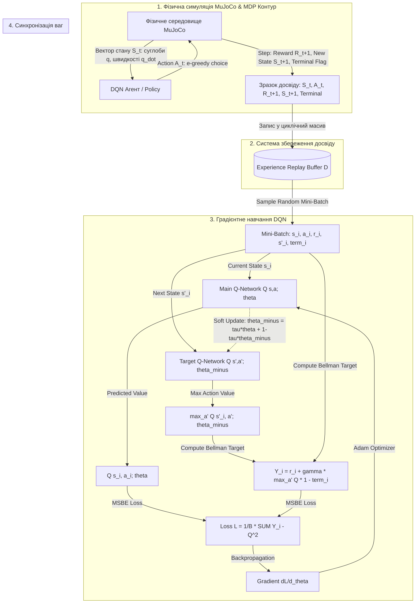

# Тема 11. Навчання з підкріпленням та автономні агенти. Марковські процеси прийняття рішень, рівняння Белмана, алгоритми Q-learning та Deep Q-Network у фізичному середовищі MuJoCo

## 1. Основний зміст та теоретичний базис

Парадигма **навчання з підкріпленням (Reinforcement Learning, RL)** являє собою третій фундаментальний напрям машинного навчання, що кардинально відрізняється від навчання з учителем (**Supervised Learning**) та навчання без учителя (**Unsupervised Learning**). На відміну від навчання з учителем, де алгоритм опрацьовує заздалегідь розмічену вибірку з еталонними відповідями, у концепції RL кибернетичний об'єкт — **агент (Agent)** — навчається шляхом активної цілеспрямованої взаємодії із зовнішнім **середовищем (Environment)** у режимі реального часу.

Основою парадигми RL є замкнений контур керування. У кожен дискретний момент часу $t$ агент сприймає поточний **стан середовища (State)** $S_t$, на основі якого вибирає та виконує певну **дію (Action)** $A_t$. Середовище реагує на дію агента: змінює свій внутрішній стан на новий $S_{t+1}$ та генерує скалярний чисельний сигнал **винагороди (Reward)** $R_{t+1}$. Метою агента є не просто максимізація миттєвої винагороди $R_{t+1}$, а максимізація сумарного виграшу на довготривалому часовому горизонті.

Для математичної формалізації процесів прийняття рішень в умовах невизначеності використовують концептуальний апарат **марковських процесів прийняття рішень (Markov Decision Processes, MDP)**. Ключовою передумовою MDP є **марковська властивість (Markov Property)**, яка стверджує, що майбутній стан середовища $S_{t+1}$ та винагорода $R_{t+1}$ залежать виключно від поточного стану $S_t$ та виконаної дії $A_t$, і повністю не залежать від усього передуючого анамнезу (історії) станів та дій. Іншими словами, поточний стан $S_t$ акумулює в собі всю необхідну інформацію про минуле для прийняття оптимального рішення у майбутньому.

Під час навчання агент вирішує фундаментальний дилематичний конфлікт — **пошук між дослідженням та використанням (Exploration vs. Exploitation Tradeoff)**:
* **Дослідження (Exploration)** — виконання нових, раніше не випробуваних дій для збору додаткової інформації про середовище та виявлення потенційно більш вигідних траєкторій.
* **Використання (Exploitation)** — вибір накопичених на даний момент дій, які гарантують отримання максимальної відомої винагороди.

Найбільш поширеним способом балансування цієї дилеми є **$\epsilon$-жадібна стратегія ($\epsilon$-greedy policy)**, де з ймовірністю $\epsilon$ агент обирає випадкову дію для дослідження, а з ймовірністю $1 - \epsilon$ обирає дію, що оцінюється як найкраща на основі поточних знань.

### Від табличного Q-Learning до Deep Q-Networks (DQN)
Класичний алгоритм **Q-Learning** належить до класу методів безмодельного керування (**Model-Free RL**) та позастратегічного навчання (**Off-Policy RL**). Він оцінює користь виконання дії $a$ у стані $s$ за допомогою функцій цінності дій — **Q-значень (Action-Value Function)** $Q(s, a)$. У табличному варіанті Q-Learning всі значення $Q(s, a)$ зберігаються в двовимірній таблиці. Позастратегічний характер алгоритму означає, що оцінка цінності здійснюється відносно оптимальної стратегії (через оператор $\max$), незалежно від того, за якою саме дослідницькою стратегією (наприклад, $\epsilon$-greedy) агент фактично обирає дії.

Однак табличний Q-Learning стає непридатним при переході до складних інженерних та робототехнічних задач через **прокляття розмірності (Curse of Dimensionality)**. Якщо простір станів є безперервним або містить мільйони комбінацій, розмістити таблицю у пам'яті та заповнити її під час експериментів стає апаратно неможливим.

У 2015 році дослідники з DeepMind (Mnih et al.) запропонували алгоритм **Deep Q-Network (DQN)**, який замінив таблицю $Q(s, a)$ на глибоку нейронну мережу-апроксиматор $Q(s, a; \theta)$ із вектором ваг $\theta$. Для подолання ефекту нестабільності навчання, викликаного кореляцією послідовних станів та рухомістю цільових міток у нейромережах, у DQN було впроваджено два ключові апаратні механізми:

1. **Буфер повтору досвіду (Experience Replay Buffer)** — зразок взаємодії агента $(S_t, A_t, R_{t+1}, S_{t+1})$ записується у циклічну пам'ять. Навчання нейромережі здійснюється шляхом вибірки випадкових mini-batch з цього буфера, що повністю розриває часову кореляцію між послідовними кроками та робить вибірку сумісною з вимогами градієнтного спуску.
2. **Фіксована цільова мережа (Target Network)** — для розрахунку цільового значення Белмана використовується окрема копія нейромережі з вагами $\theta^-$. Ваги цільової мережі заморожуються і оновлюються рідко (або плавно за допомогою Soft Update), що запобігає «гонитві за власною міткою» під час градієнтного оновлення основної мережі $Q(s, a; \theta)$.

### Робототехнічне середовище фізичного моделювання MuJoCo
Для тестування та відпрацювання алгоритмів RL у високоточних фізичних умовах застосовується середовище **MuJoCo (Multi-Joint dynamics with Contact)**. MuJoCo є сучасним фізичним рушієм, розробленим для моделювання багатоланкових кінематичних структур із складними контактними взаємодіями, сухим та вологим тертям, деформаціями та актуаторами (сервоприводами, пневматикою, м'язами).

У середовищі MuJoCo вектор стану $S_t$ містить безперервні фізичні величини: узагальнені координати суглобів $q$, узагальнені швидкості $\dot{q}$, сили контактного тертя та покази сенсорів (прискорювачів, гіроскопів). Оскільки в класичному DQN простір дій має бути дискретним, застосування DQN у MuJoCo вимагає або дискретизації керуючих моментів силовиків (**Torques**), або переходу до continuous-action алгоритмів класу Actor-Critic (наприклад, DDPG, SAC, PPO).

---

## 2. Математичний апарат, моделі та аналітичні залежності

### 1. Формалізація Марковського процесу прийняття рішень (MDP)
Марковський процес прийняття рішень формалізується кортежем із $5$ елементів:

$$\mathcal{M} = \langle \mathcal{S}, \mathcal{A}, \mathcal{P}, \mathcal{R}, \gamma \rangle$$

де $\mathcal{S}$ — простір станів середовища, $\mathcal{A}$ — простір дій агента, $\mathcal{P}$ — функція ймовірностей переходу станів, $\mathcal{R}$ — функція винагород, $\gamma$ — коефіцієнт дисконтування.

* **Функція ймовірностей переходу станів $\mathcal{P}$:**
  
$$\mathcal{P}(s' \mid s, a) = \mathbb{P}(S_{t+1} = s' \mid S_t = s, A_t = a)$$

  де $\mathcal{P}(s' \mid s, a)$ — ймовірність того, що виконання дії $a \in \mathcal{A}$ у стані $s \in \mathcal{S}$ призведе до переходу середовища в стан $s' \in \mathcal{S}$.

* **Функція винагороди $\mathcal{R}$:**

$$\mathcal{R}(s, a, s') = \mathbb{E}\left[ R_{t+1} \mid S_t = s, A_t = a, S_{t+1} = s' \right]$$

  де $R_{t+1} \in \mathbb{R}$ — скалярна математична сподівана винагорода.

* **Сумарний дисконтований виграш $G_t$ (Cumulative Discounted Return):**

$$G_t = \sum_{k=0}^{\infty} \gamma^k \cdot R_{t+k+1}$$

  де $G_t$ — сумарний виграш на момент часу $t$, $\gamma \in [0, 1)$ — коефіцієнт дисконтування, який математично забезпечує збіжність безкінечної суми та задає пріоритет миттєвим винагородам над віддаленими у часі.

### 2. Функції цінності та рівняння Белмана
Стратегія поведінки агента $\pi$ визначається як розподіл ймовірностей дій у станах: $\pi(a \mid s) = \mathbb{P}(A_t = a \mid S_t = s)$.

* **Функція цінності стану (State-Value Function) $V^\pi(s)$:**

$$V^\pi(s) = \mathbb{E}_\pi \left[ G_t \mid S_t = s \right] = \mathbb{E}_\pi \left[ \sum_{k=0}^{\infty} \gamma^k R_{t+k+1} \;\middle|\; S_t = s \right]$$

  *Рівняння усереднення Белмана для $V^\pi(s)$:*

$$V^\pi(s) = \sum_{a \in \mathcal{A}} \pi(a \mid s) \sum_{s' \in \mathcal{S}} \mathcal{P}(s' \mid s, a) \left[ \mathcal{R}(s, a, s') + \gamma \cdot V^\pi(s') \right]$$

* **Функція цінності дії (Action-Value / Q-Function) $Q^\pi(s, a)$:**

$$Q^\pi(s, a) = \mathbb{E}_\pi \left[ G_t \mid S_t = s, A_t = a \right]$$

  *Рівняння усереднення Белмана для $Q^\pi(s, a)$:*

$$Q^\pi(s, a) = \sum_{s' \in \mathcal{S}} \mathcal{P}(s' \mid s, a) \left[ \mathcal{R}(s, a, s') + \gamma \sum_{a' \in \mathcal{A}} \pi(a' \mid s') \cdot Q^\pi(s', a') \right]$$

* **Рівняння оптимальності Белмана (Bellman Optimality Equation) для $Q^*(s, a)$:**
  Оптимальна функція $Q^*(s, a) = \max_\pi Q^\pi(s, a)$ задовольняє нелінійному рівнянню:

$$Q^*(s, a) = \sum_{s' \in \mathcal{S}} \mathcal{P}(s' \mid s, a) \left[ \mathcal{R}(s, a, s') + \gamma \cdot \max_{a' \in \mathcal{A}} Q^*(s', a') \right]$$

### 3. Математичний алгоритм та оновлення табличного Q-Learning
Табличний алгоритм Q-Learning на кожному кроці розраховує **помилку часової різниці (Temporal Difference Error, TD-Error)** $\delta_t$ та оновлює елемент таблиці $Q(S_t, A_t)$ за правилом:

$$Q(S_t, A_t) \leftarrow Q(S_t, A_t) + \alpha \cdot \delta_t$$

$$\delta_t = R_{t+1} + \gamma \cdot \max_{a \in \mathcal{A}} Q(S_{t+1}, a) - Q(S_t, A_t)$$

де $\alpha \in (0, 1]$ — швидкість навчання (Learning Rate), $R_{t+1} + \gamma \max_a Q(S_{t+1}, a)$ — цільове значення часової різниці (**TD Target**), $\delta_t$ — відхилення поточного значення від цільового (TD-Error).

### 4. Математичний апарат алгоритму Deep Q-Network (DQN)
У DQN для апроксимації $Q(s, a) \approx Q(s, a; \theta)$ використовується нейромережа з вагами $\theta$.

* **Функція втрат DQN (Mean Squared Bellman Error, MSBE).** Навчання виконується шляхом мінімізації квадричної функції втрат за батчем розміром $B$, зчитаним з Replay Buffer $\mathcal{D}$:

$$\mathcal{L}(\theta) = \frac{1}{B} \sum_{i=1}^B \left( y_i^{\text{DQN}} - Q(s_i, a_i; \theta) \right)^2$$

  де $y_i^{\text{DQN}}$ — розрахована цільова мітка Белмана за допомогою замороженої Target Network з вагами $\theta^-$:

$$y_i^{\text{DQN}} = \begin{cases} r_i, & \text{якщо } s'_i \text{ є термінальним станом} \\ r_i + \gamma \cdot \max_{a' \in \mathcal{A}} Q(s'_i, a'; \theta^-), & \text{якщо } s'_i \text{ не є термінальним станом} \end{cases}$$

* **Градієнт функції втрат DQN.** Під час обчислення градієнта вектор $\theta^-$ розглядається як константа (градієнти крізь Target Network не протікають):

$$\nabla_\theta \mathcal{L}(\theta) = -\frac{2}{B} \sum_{i=1}^B \left( y_i^{\text{DQN}} - Q(s_i, a_i; \theta) \right) \cdot \nabla_\theta Q(s_i, a_i; \theta)$$

* **Схема оновлення ваг Target Network:**
  * Жорстке періодичне оновлення (**Hard Update**): $\theta^- \leftarrow \theta$ кожні $C$ кроків.
  * Плавне оновлення (**Soft Update**): $\theta^- \leftarrow \tau \theta + (1 - \tau) \theta^-$, де $\tau \ll 1$ (наприклад, $\tau = 0.005$).

---

## 3. Систематизація даних та порівняльний аналіз

Для системного порівняння ключвих алгоритмів та підходів у навчанні з підкріпленням нижче наведено порівняльний аналіз їхніх математичних та обчислювальних характеристик.

| Параметр порівняння | Tabular Q-Learning | Deep Q-Network (DQN) | Double DQN (DDQN) | Dueling DQN | Continuous Actor-Critic (DDPG / SAC) |
| :--- | :--- | :--- | :--- | :--- | :--- | :--- |
| **Простір станів $\mathcal{S}$** | Малий дискретний | Безперервний / Високовимірний | Безперервний / Високовимірний | Безперервний / Високовимірний | Безперервний фізичний (MuJoCo) |
| **Простір дій $\mathcal{A}$** | Малий дискретний | Дискретний (малий/середній) | Дискретний (малий/середній) | Дискретний (малий/середній) | Безперервний $\mathbb{R}^k$ (моменти суглобів) |
| **Апроксиматор $Q(s,a)$** | Таблиця в пам'яті | Глибока нейромережа $Q(s,a;\theta)$ | Глибока нейромережа $Q(s,a;\theta)$ | Розділені гілки $V(s)$ та $A(s,a)$ | Дві мережі: Actor $\mu(s;\phi)$ та Critic $Q(s,a;\theta)$ |
| **Усунення завищення цінності (Overestimation)** | Відсутнє | Відсутнє (схильний до завищення $Q$) | Присутнє (селекція дій через $\theta$, оцінка через $\theta^-$) | Часткове (за рахунок розділення $V$ та $A$) | Присутнє (Twin Q-Networks) |
| **Стабільність навчання** | Абсолютна (гарантована збіжність) | Середня (потребує Replay Buffer + Target Net) | Висока | Висока | Потребує ретельної настройки гіперпараметрів |
| **Основні сфери застосування** | Прості сіткові задачі (GridWorld) | Ігри Atari, дискретне розкладання задач | Складні ігрові середовища | Ігри з великою кількістю нейтральних дій | Робототехніка, MuJoCo, біомеханічне керування |

Систематизація алгоритмів показує еволюційний перехід від табулярних методик до глибинних мереж. Основною слабкістю класичного **DQN** є проблема завищення оцінки цінності дій (**Overestimation Bias**), яка виникає через присутність оператора $\max_{a'} Q(s', a'; \theta^-)$ у цільовій мітці Белмана. Оскільки максимальне значення беруть над зашумленими апроксимованими оцінками, модель систематично переоцінює виграш. 

Алгоритм **Double DQN** усуває цю проблему шляхом розділення вибору дії та її оцінки: дія обирається основною мережею $a^* = \arg\max_a Q(s', a; \theta)$, а її цінність оцінюється цільовою мережею $Q(s', a^*; \theta^-)$. 

Для робототехнічних застосувань у безперервних середовищах **MuJoCo** дискретні алгоритми роду DQN поступаються місцем алгоритмам **SAC (Soft Actor-Critic)** та **PPO (Proximal Policy Optimization)**, які здатні безпосередньо генерувати вектор безперервних керуючих векторів силовиків без вимушеної дискретизації.

---

## 4. Візуалізація процесів та структурних зв'язків

Нижче наведено деталізовану графічну схему, яка ілюструє замкнений контур взаємодії агента з середовищем MuJoCo, функціонування Replay Buffer, обчислення Loss на цільовій мережі та процес оновлення ваг у DQN.

*Рисунок 1 — Структурно-логічна схема замкненої системи навчання з підкріпленням, конвеєра DQN та взаємодії з фізичним середовищем MuJoCo*

Схема демонструє два паралельні процеси, що протікають в асинхронному або синхронному режимі. У першому блоці (`Environment_Loop`) агент взаємодіє з фізичним середовищем MuJoCo. Фізичний рушій обраховує диференціальні рівняння динаміки багатоланкової системи та повертає вектор стану $S_t$ (позиції та швидкості суглобів). Агент за $\epsilon$-жадібним правилом обирає дію $A_t$ (момент мотора). Отриманий кортеж перехода підкладається у циклічний буфер пам'яті Replay Buffer (`Memory_System`).

У третьому блоці (`Training_Pipeline`) із буфера відбирається випадковий батч минулого досвіду, що ліквідує кореляцію станів. Основна мережа `Q_Net` розраховує поточну оцінку $Q(s_i, a_i; \theta)$, а копія мережі `Target_Net` розраховує цільове значення Белмана за наступним станом $s'_i$. Різниця між ними формує помилку MSBE Loss, градієнт якої оновлює ваги основної мережі $\theta$. Наприкінці (блок `Network_Sync`) ваги основної мережі згладжено копіюються в цільову мережу за схемою Soft Update.

---

## 5. Питання для самоперевірки та аналітичного осмислення

1.   Формально виведіть рівняння оптимальності Белмана для функцій $V^*(s)$ та $Q^*(s, a)$. Поясніть, чому присутність оператора $\max$ у рівнянні оптимальності перетворює його з лінійного на нелінійне, і як це впливає на вибір чисельних методів його розв'язання.
2.   Доведіть, чому застосування класичного алгоритму Q-Learning без Replay Buffer та без Target Network до глибоких нейронних мереж призводить до вибуху градієнтів або розбіжності процесів навчання. Математично опишіть ефект «гонитви за власними мітками» (Chasing Targets).
3.   У чому полягає математична сутність проблеми завищення оцінки цінності дій (**Overestimation Bias**) у Deep Q-Networks? Наведіть математичну формулу розрахунку цільової мітки у модифікації **Double DQN** та поясніть, за рахунок чого усувається систематичне завищення.
4.   Опишіть особливості фізичного середовища **MuJoCo** як інструменту для проведення RL-експериментів. Які физичні величини складають вектор стану $S_t$ робототехнічної системи (наприклад, квадропеда чи маніпулятора), і чому застосування дискретного алгоритму DQN до вихідного вектора керуючих моментів суглобів є неефективним?
5.   Проаналізуйте роль коефіцієнта дисконтування $\gamma \in [0, 1)$. Як зміна значення $\gamma$ з $0.99$ до $0.1$ вплине на поведінку автономного навігаційного робота? Яким чином коефіцієнт дисконтування забезпечує математичну збіжність нескінченних часових рядів винагород у задачах із необмеженим часовим горизонтом (Continuing Tasks)?
