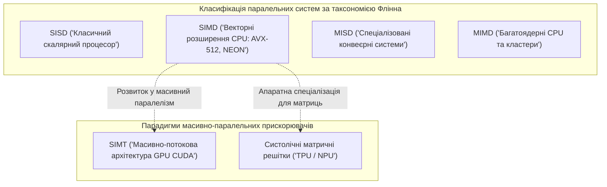
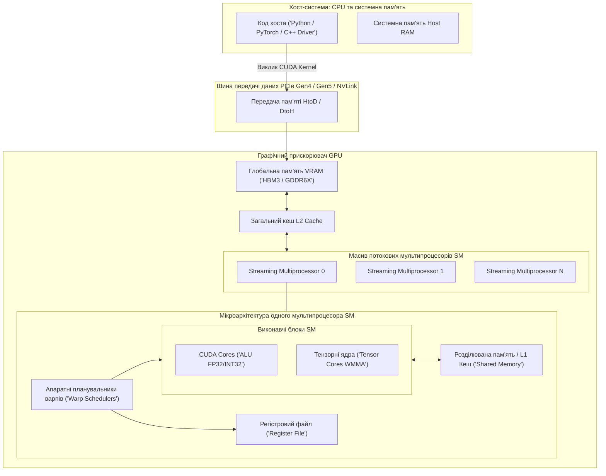
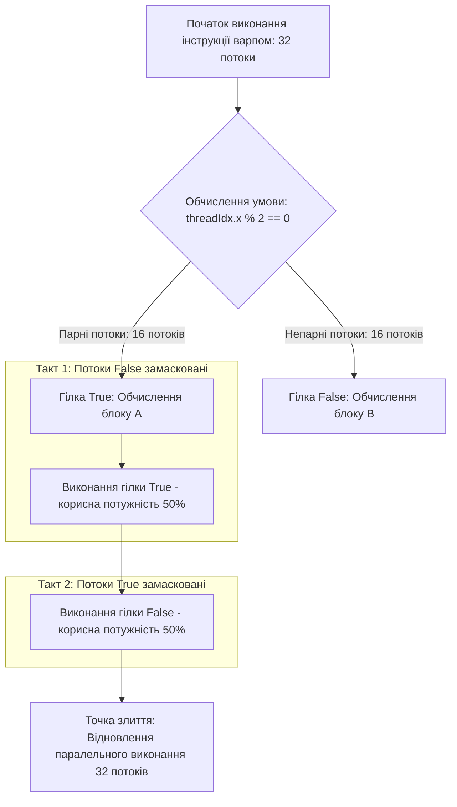
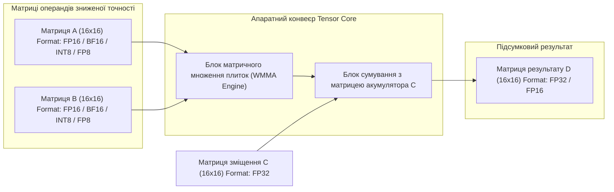
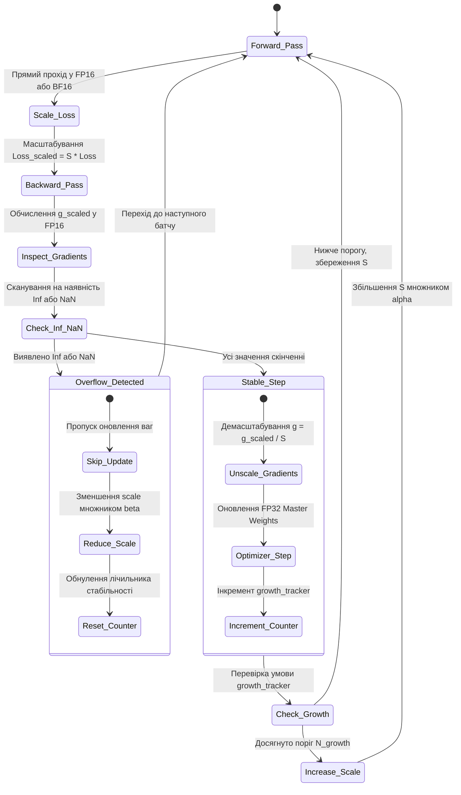
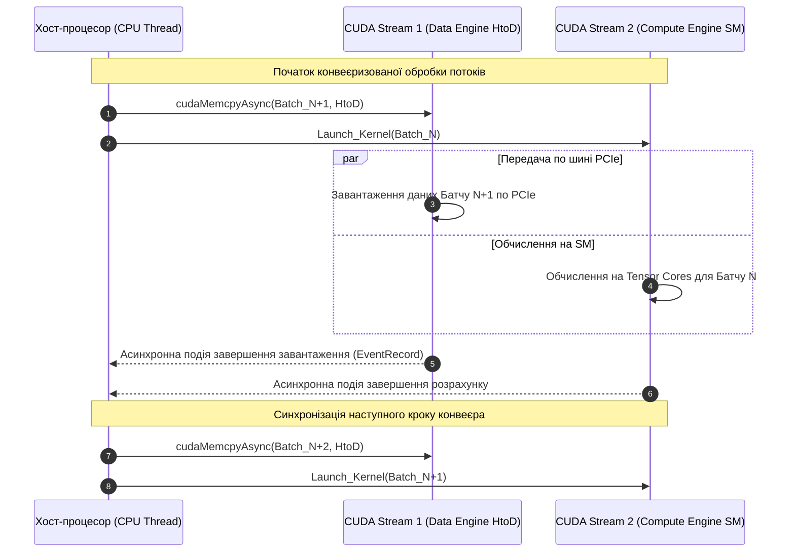
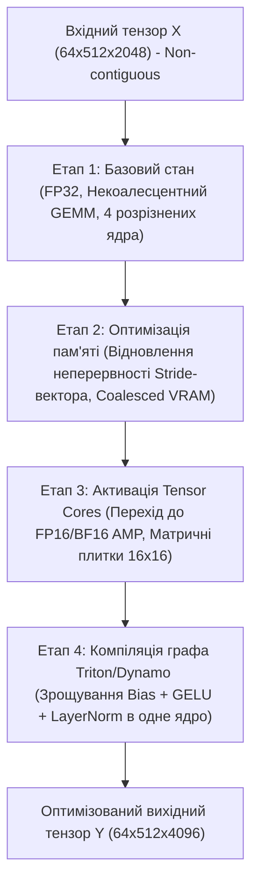

# Тема 2. Багатопотоковість, SIMD-векторизація та апаратне прискорення ШІ. Векторна обробка, архітектура GPU, тензорні ядра, векторизована тензорна алгебра на PyTorch

## Мета лекції

Метою лекції є формування у майбутніх інженерів комплексної системи знань та інженерних умінь щодо організації, оптимізації та математичного опису масивно-паралельних векторних і тензорних обчислень на сучасних процесорних архітектурах. У межах заняття досліджуються механізми переходу від послідовного скалярного виконання до багатопотокової SIMD/SIMT-обробки на CPU та GPU, специфіка функціонування спеціалізованих матричних блоків Tensor Cores, а також низькорівнева адресація багатовимірних тензорів у фреймворку PyTorch. Заняття покликане навчити студентів діагностувати апаратні обмеження за моделлю Roofline, запобігати дивергенції варпів, забезпечувати коалесцинг пам'яті та ефективно проєктувати обчислювальні конвеєри штучного інтелекту із застосуванням автоматичної змішаної точності й компіляції графів.

## Очікувані результати навчання

Після успішного засвоєння матеріалу лекції здобувачі вищої освіти зможуть продемонструвати такі результати:

1. **Знання та розуміння.** Студенти повинні демонструвати ґрунтовне розуміння фундаментальних відмінностей між парадигмами SIMD, SIMT та систолічними матричними обчисленнями, а також детально пояснювати мікроархітектуру потокових мультипроцесорів GPU, варп-планувальників, тензорних ядер і формати даних зниженої точності.

2. **Застосування.** Студенти мають уміти практично реалізовувати високопродуктивні векторизовані операції у середовищі PyTorch, налаштовувати механізми автоматичної змішаної точності (AMP) із масштабуванням градієнтів, керувати асинхронними CUDA-потоками та оптимізувати адресацію тензорів на основі вектора кроків у пам'яті.

3. **Аналіз.** Студенти повинні володіти методами аналітичного дослідження обчислювальних алгоритмів за моделлю Roofline для чіткої ідентифікації обмежень швидкодії (Memory-Bound проти Compute-Bound), а також аналізувати деградацію продуктивності, спричинену некоалесцентним доступом до глобальної пам'яті VRAM або дивергенцією варпів у розгалужених алгоритмах.

4. **Оцінювання та синтез.** Студенти мають набути здатність критично оцінювати компроміси між обчислювальною швидкістю, енергоефективністю та числовою стійкістю моделей при використанні форматів FP32, TF32, FP16, BF16, INT8 і FP8, а також проєктувати синтезовані, високооптимізовані конвеєри машинного навчання із застосуванням компілятора PyTorch 2.0 (TorchDynamo/Triton).

---

## Детальний покроковий план лекції

### 1. Теоретичний модуль. Архітектурні парадигми апаратного прискорення обчислень ШІ

* 1.1. Багатопотоковість процесорів CPU та векторна обробка даних SIMD (розширення AVX-512, ARM NEON, векторні регістри та компіляторні інтрінсики).
* 1.2. Масивно-паралельна архітектура GPU та обчислювальна модель NVIDIA CUDA (потокові мультипроцесори SM, концепція SIMT, ієрархія Grid-Block-Thread, планування варпів).
* 1.3. Фізичні та апаратні фактори деградації продуктивності GPU (явище розгалуження потоків Warp Divergence та некоалесцентний доступ до глобальної пам'яті Memory Coalescing).
* 1.4. Спеціалізовані матричні прискорювачі: мікроархітектура тензорних ядер (Tensor Cores) і матричних процесорів TPU/NPU (плиткові операції Tile WMMA, систолічні масиви та формати даних FP16, BF16, TF32, FP8).

### 2. Аналітичний модуль. Математичні моделі, формалізація пам'яті та алгоритмічні конвеєри

* 2.1. Формальна модель операційної інтенсивності Roofline (математичний зв'язок FLOP/Byte, визначення критичної межі переходу між режимами Memory-Bound та Compute-Bound).
* 2.2. Математична формалізація операцій на тензорних ядрах WMMA (матричне векторно-блочне перемноження та підсумовування Fused Multiply-Add над мікроматрицями, розрахунок пікової щільності FLOP/такт).
* 2.3. Алгебраїчна та адресна модель представлення тензорів у пам'яті (вектор кроків Strides, рекурентні умови контигуальності Contiguous та механіка безкоштовного транспонування зі зміною метаданих).
* 2.4. Математичні моделі змішаної точності (Automatic Mixed Precision) та динамічного масштабування градієнтів (запобігання явищам Underflow/Overflow за допомогою GradScaler).
* 2.5. Моделювання асинхронного виконання та паралелізму завдань через механізм CUDA Streams і зрощування операцій (Kernel Fusing) у середовищі PyTorch 2.0 / Triton.

### 3. Практично-розрахунковий кейс. Профілювання та інженерна оптимізація тензорної алгебри в PyTorch

**Тема наскрізної задачі.** «Комплексна інженерна оптимізація та профілювання обчислювального блоку глибокої нейронної мережі: перехід від скалярно-невирівняних операцій до тензорних ядер через Stride-оптимізацію, режим AMP та компіляцію графа TorchDynamo/Triton».

## 1. Фундаментальний теоретичний базис та концептуальні засади

Еволюція алгоритмів штучного інтелекту, зокрема глибоких нейронних мереж, трансформувала вимоги до апаратної бази обчислювальних комплексів. Якщо класичні алгоритми обробки інформації спиралися на складну логіку керування з високим рівнем галуження, то сучасні моделі машинного навчання є масивно-однорідними за своєю природою. Вони вимагають багаторазового виконання базових операцій лінійної алгебри над багатовимірними масивами даних. 

Традиційна мікропроцесорна парадигма, орієнтована на мінімізацію затримок виконання окремого послідовного потоку (**latency-oriented architecture**), досягла фізичних меж ефективності. Це обумовило перехід до масивно-паралельних архітектур, що оптимізують сумарну пропускну здатність обчислювального тракту (**throughput-oriented architecture**).

### 1.1. Багатопотоковість процесорів CPU та векторна обробка даних SIMD

Класичні центральні процесори (**Central Processing Unit, CPU**) оптимізовані для виконання послідовних інструкцій із мінімальною латентністю. Для цього значна частка площі напівпровідникового кристала відводиться під блоки динамічного передбачення переходів (**Branch Predictors**), механізми позачергового виконання інструкцій (**Out-of-Order Execution, OoO**) та багаторівневу ієрархію кеш-пам'яті (L1, L2, L3).

Згідно з класичною систематизацією паралельних архітектур за **таксономією Флінна**, обчислювальні процеси поділяються на чотири базові класи:
1. **SISD (Single Instruction, Single Data)** — традиційний послідовний потік, де один процесорний блок обробляє один потік скалярних даних за одиницю часу.
2. **SIMD (Single Instruction, Multiple Data)** — парадигма, в якій єдина апаратна інструкція одночасно застосовується до множини різних елементів даних, розміщених у спеціалізованих векторних регістрах.
3. **MISD (Multiple Instruction, Single Data)** — конвеєрна обробка єдиного потоку даних послідовністю різних команд, що рідко зустрічається в універсальних обчислювачах.
4. **MIMD (Multiple Instruction, Multiple Data)** — повноцінна багатоядерна або багатопроцесорна обробка, де кожне ядро виконує власний незалежний потік інструкцій над власним набором даних (**Thread-Level Parallelism, TLP**).

Для задач векторно-матричної алгебри на CPU застосовується парадигма **SIMD**. Сучасні процесори інтегрують векторні розширення: набір інструкцій **AVX-512** (Advanced Vector Extensions) у процесорах архітектури x86-64 або **ARM NEON / SVE** у мікроархітектурах ARM. 

Фізично SIMD спирається на наявність розширених регістрових файлів. Наприклад, у стандарті AVX-512 використовуються $32$ регістри шириною $512$ біт кожен (регістри `ZMM0`–`ZMM31`). Векторний регістр дозволяє розмістити одночасно $16$ чисел одинарної точності (**FP32**) або $8$ чисел подвійної точності (**FP64**). 

Виконання векторної інструкції типу **FMA (Fused Multiply-Add)** забезпечує паралельне обчислення виразу $a \cdot b + c$ для всіх елементів вектора за один такт процесора:

$$S_{\text{SIMD}} = \frac{1}{(1 - p) + \frac{p}{N_{\text{lanes}}}}$$

де:
* $S_{\text{SIMD}}$ — теоретичний коефіцієнт прискорення обчислень за рахунок векторизації (безрозмірна величина);
* $p$ — частка коду, яка піддається векторизації (дійсне число в діапазоні $[0, 1]$);
* $N_{\text{lanes}}$ — апаратна ширина векторного конвеєра, що визначає кількість одночасно оброблюваних скалярних елементів:

$$N_{\text{lanes}} = \frac{W_{\text{reg}}}{B_{\text{data}}}$$

де:
* $W_{\text{reg}}$ — розрядність векторного регістра процесора (наприклад, $512$ біт для архітектури AVX-512);
* $B_{\text{data}}$ — бітова ширина одного оброблюваного числа (наприклад, $32$ біти для формату FP32 або $16$ біт для формату FP16).

Векторизація коду здійснюється або автоматично компілятором (**Auto-vectorization**), або вручну розробником за допомогою низькорівневих функцій — **векторних інтрінсиків (Intrinsics)**, таких як `_mm512_fmadd_ps()`. 

Проте масштабування продуктивності CPU обмежене тепловим пакетом, малою кількістю фізичних ядер та недостатньою пропускною здатністю шини системної оперативної пам'яті (**DDR4/DDR5**).

---

### 1.2. Масивно-паралельна архітектура GPU та обчислювальна модель NVIDIA CUDA

Графічні процесори (**Graphics Processing Unit, GPU**) проєктуються за парадигмою максимізації пропускної здатності. На відміну від CPU, де більша частина кристала відведена під кеш-пам'ять та логіку передбачення, у GPU понад $80\%$ кремнієвої площі займають масиви арифметично-логічних пристроїв (**Arithmetic Logic Units, ALU**).

Латентність доступу до пам'яті в GPU не мінімізується гігантськими кешами, а **маскується (Latency Hiding)**: коли одна група обчислювальних потоків очікує на завантаження даних із глобальної пам'яті, апаратний планувальник миттєво перемикає виконавчий блок на виконання інструкцій іншої, готової до роботи групи потоків без накладних витрат.

Фізично графічний процесор складається з масиву потокових мультипроцесорів (**Streaming Multiprocessors, SM**). Кожен SM містить:
1. Множину універсальних ядер **CUDA Cores** для цілочисельних (INT32) та плаваючих (FP32, FP64) операцій.
2. Спеціалізовані апаратні модулі: тензорні ядра (**Tensor Cores**) та блоки спеціальних функцій (**Special Function Units, SFU**).
3. Високошвидкісний масив регістрів (**Register File**) великого обсягу (зазвичай $64\text{ КБ}$ – $256\text{ КБ}$ на один SM).
4. Програмно керовану розділювану пам'ять наднизької латентності (**Shared Memory**), фізично об'єднану з апаратним кешем першого рівня (**L1 Cache**).
5. Апаратні планувальники варпів (**Warp Schedulers**) та блоки диспетчеризації інструкцій.

На програмному рівні компанія NVIDIA запровадила модель **SIMT (Single Instruction, Multiple Threads)**. У моделі SIMT інженер створює програму з розрахунку на один абстрактний потік (**Thread**), а графічний процесор масштабує виконання на тисячі апаратних ниток. 

Програмна ієрархія CUDA організована таким чином:
1. **Потік (Thread)** — базовий елемент виконання, що має власний набір регістрів та локальну пам'ять.
2. **Блок потоків (Thread Block)** — група потоків (до $1024$), які виконуються на одному фізичному мультипроцесорі SM, мають доступ до спільної пам'яті Shared Memory та можуть синхронізуватися за допомогою бар'єрів `__syncthreads()`.
3. **Сітка (Grid)** — дво- або тривимірний масив блоків потоків, що формується під час запуску обчислювального ядра (**Kernel**).

На апаратному рівні мультипроцесор SM не оперує окремими потоками. Усі потоки всередині блоку групуються в неподільні кванти виконання — **варпи (Warps)**. Один варп складається строго з $32$ потоків. Усі $32$ потоки одного варпу в кожен системний такт отримують від планувальника одну й ту саму машинну команду та виконують її синхронно над власними даними.

---

### 1.3. Фізичні та апаратні фактори деградації продуктивності GPU

Розробка високоефективного програмного забезпечення для масивно-паралельних архітектур вимагає врахування двох фізичних обмежень мікроархітектури GPU: розгалуження потоків та структури транзакцій пам'яті.

#### Дивергенція варпу
Оскільки всі $32$ потоки одного варпу прив'язані до єдиного лічильника команд, наявність умовних переходів (`if-else`, цикли зі змінною кількістю ітерацій) створює явище **дивергенції варпу**.

Якщо різні потоки всередині одного варпу обирають різні шляхи виконання умови, апаратний планувальник змушений виконувати гілки **послідовно**:
1. Спочатку мультипроцесор виконує інструкції гілки `True`, при цьому потоки, для яких умова виявилася хибною, апаратно блокуються шляхом виставлення бітової маски активності (**Active Mask**).
2. Потім мультипроцесор виконує інструкції гілки `False`, маскуючи потоки першої групи.
3. У точці реконвергенції (**Reconvergence Point**) маска знову відкриває всі потоки, і синхронне виконання відновлюється.

Ефективність використання обчислювальної потужності варпу $\eta_{\text{warp}}$ за наявності розгалужень формалізується аналітичним виразом:

$$\eta_{\text{warp}} = \frac{\sum_{k=1}^{K} A_k}{K \cdot N_{\text{warp}}}$$

де:
* $\eta_{\text{warp}}$ — коефіцієнт обчислювальної ефективності варпу (безрозмірна величина в діапазоні $(0, 1]$);
* $K$ — загальна кількість взаємовиключних гілок виконання в умовному операторі (ціле додатне число);
* $A_k$ — кількість активних потоків, що задіяні у виконанні $k$-ї гілки розгалуження (ціле число від $1$ до $32$);
* $N_{\text{warp}}$ — фізичний розмір варпу (константа для архітектури NVIDIA CUDA, що дорівнює $32$).

#### Коалесцинг звернень до пам'яті (Memory Coalescing)
Глобальна пам'ять GPU (**VRAM / HBM**) має високу латентність (сотні системних тактів). Контролер пам'яті обробляє запити не окремими байтами, а пакетними транзакціями фіксованої ширини: сегментами по $32$, $64$ або $128$ байт.

**Коалесцинг пам'яті (Memory Coalescing)** — це процес об'єднання запитів на читання або запис до глобальної пам'яті від усіх $32$ потоків варпу в мінімально можливу кількість апаратних транзакцій шини пам'яті. 

Якщо $32$ потоки звертаються до суміжних елементів даних розміром $4$ байти (наприклад, масив `float`), сумарний запит становить:

$$32 \times 4\text{ байти} = 128\text{ байт}$$

Контролер пам'яті виконує цей доступ за **одну** транзакцію шириною $128$ байт. 

Якщо ж доступ здійснюється з кроком (наприклад, читання матриці по стовпцях без транспонування) або за випадковими індексами, кожен потік потрапляє в окремий сектор пам'яті. Це змушує контролер виконувати до $32$ окремих транзакцій по $32$ байти ($1024$ переданих байти заради отримання $128$ байт корисних даних). 

Коефіцієнт ефективності використання пропускної здатності шини пам'яті $\eta_{\text{mem}}$ визначається як:

$$\eta_{\text{mem}} = \frac{V_{\text{useful}}}{N_{\text{trans}} \cdot S_{\text{segment}}} \times 100\%$$

де:
* $\eta_{\text{mem}}$ — ефективність утилізації пропускної здатності шини пам'яті (виражається у відсотках, $\% \in (0, 100]$);
* $V_{\text{useful}}$ — сумарний обсяг корисних даних, безпосередньо запитаних потоками варпу (вимірюється в байтах, $\text{Bytes}$);
* $N_{\text{trans}}$ — фактична кількість згенерованих контролером апаратних транзакцій (ціле додатне число);
* $S_{\text{segment}}$ — апаратний розмір однієї транзакції шини пам'яті (становить $32$, $64$ або $128$ байт).

---

### 1.4. Спеціалізовані матричні прискорювачі: мікроархітектура тензорних ядер і матричних процесорів TPU/NPU

У класичній моделі CUDA Core кожне ядро виконує скалярну операцію над одним числом за такт. Для обчислення множення двох матриць потрібні мільйони незалежних інструкцій. Починаючи з архітектури **Volta** (2017 р.) та продовжуючи в **Ampere**, **Hopper** і **Blackwell**, компанія NVIDIA впровадила в структуру SM спеціалізовані апаратні блоки — **тензорні ядра (Tensor Cores)**.

Тензорне ядро реалізує концепцію виконання матричної операції над цілими підматрицями (плитками, або **Tiles**) за один системний такт варпу. Базова операція має назву **WMMA (Warp Matrix Multiply and Accumulate)**:

$$\mathbf{D} = \mathbf{A} \times \mathbf{B} + \mathbf{C}$$

де матриці $\mathbf{A}$ та $\mathbf{B}$ мають розмірність $16 \times 16$ елементів зниженої точності, а матриці $\mathbf{C}$ та $\mathbf{D}$ слугують акумуляторами підвищеної точності.

Еволюція форматів даних для тензорних обчислень стала ключовим фактором прискорення:
1. **FP32 (IEEE 754)** — $1$ біт знака, $8$ біт експоненти, $23$ біти мантиси (динамічний діапазон $\approx 10^{\pm 38}$, висока точність).
2. **FP16** — $1$ біт знака, $5$ біт експоненти, $10$ біт мантиси (вузький динамічний діапазон $\approx 10^{\pm 5}$, схильний до переповнення та зникнення градієнтів).
3. **BF16 (Bfloat16)** — $1$ біт знака, $8$ біт експоненти (як у FP32), $7$ біт мантиси (широкий динамічний діапазон, що виключає ризик числової нестабільності).
4. **TF32 (TensorFloat-32)** — внутрішній апаратний формат NVIDIA: $1$ біт знака, $8$ біт експоненти, $10$ біт мантиси (займає $19$ біт, зчитується з коду FP32 автоматично без зміни інтерфейсу).
5. **FP8 (E4M3 та E5M2)** — $8$-бітові формати плаваючої крапки для квантованого інференсу та навчання надвеликих мовних моделей (**LLM**).

Іншим архітектурним напрямом є **систолічні матричні решітки (Systolic Arrays)**, реалізовані в процесорах **Google TPU** та спеціалізованих нейропроцесорах (**NPU**). 

У систолічному масиві процесорні елементи (**Processing Elements, PE**) з'єднані в двовимірну регулярну сітку. Дані (ваги та активації) подаються на краї матриці й «пульсують» (передаються від одного вузла до сусіднього) крізь решітку за системними тактами без постійного проміжного збереження у великому регістровому файлі. Це знижує енергоспоживання шини даних у $5$–$10$ разів порівняно з класичними векторними регістрами.

---

### Систематизація та порівняльний аналіз обчислювальних платформ

Для обґрунтованого вибору апаратного забезпечення під конкретні задачі штучного інтелекту в таблиці наведено порівняльний аналіз базових архітектурних парадигм.

| Архітектурна платформа | Парадигма виконання | Базовий тип обчислювача | Основні підтримувані формати | Пропускна здатність та спеціалізація |
| :--- | :--- | :--- | :--- | :--- |
| **CPU SIMD (Intel AVX-512 / ARM NEON)** | Векторний паралелізм даних (SIMD) | Широкі векторні регістри (128–512 біт) | FP64, FP32, FP16, INT64–INT8 | Універсальна логіка, максимальна гнучкість при роботі з розгалуженим кодом; низька щільність FLOP/Ватт у тензорних задачах |
| **GPU CUDA Cores (NVIDIA Streaming MP)** | Масивно-потоковий паралелізм (SIMT) | Масиви скалярних ядер ALU | FP64, FP32, FP16, INT32, INT8 | Висока універсальна паралельна продуктивність для поелементних операцій; чутливість до дивергенції варпів |
| **GPU Tensor Cores (NVIDIA Volta – Blackwell)** | Блоково-матричний паралелізм (WMMA Tile) | Апаратні матричні FMA-множники підматриць $16 \times 16$ | TF32, BF16, FP16, FP8, INT8, INT4 | Екстремальна продуктивність GEMM-операцій (множення матриць); жорстка вимога до кратності розмірів шарів ($8, 16, 32$) |
| **Google TPU (Tensor Processing Unit)** | Систолічна матрична решітка (Systolic Array) | Двовимірний масив $128 \times 128$ процесорних елементів | BF16, FP32 (акумуляція), INT8 | Максимальна енергоефективність щільного матричного множення; повна відсутність підтримки довільного неструктурованого коду |
| **Edge NPU (Neural Processing Unit)** | Фіксований потік даних (Dataflow Engine) | Систолічні або векторні блоки фіксованої точності | INT8, INT4, FP16 (обмежено) | Мініатюрні енергетичні бюджети ($0.5$–$15\text{ Вт}$) для інференсу нейромереж на мобільних і вбудованих терміналах |

---

> **ТИПОВА ПОМИЛКА:**  
> Поширеним помилковим судженням серед інженерів-початківців є ототожнення технології **NVIDIA CUDA SIMT** із класичним векторним розширенням **CPU SIMD**. Принципова різниця полягає в тому, що в SIMD програміст або компілятор зобов'язаний явно запакувати вектор у регістр фіксованої довжини (наприклад, 16 чисел FP32 в один `__m512`), а будь-яке скалярне відхилення призводить до аварійного розпакування. 
> 
> У моделі SIMT інструкція пишеться як для повністю автономного скалярного потоку. Апаратне об'єднання $32$ потоків у варп виконується динамічно на рівні кремнію. Інженер взаємодіє з абстракцією віртуального потоку, а не апаратного регістра фіксованої довжини, що кардинально спрощує написання паралельного коду, хоча й створює ризики прихованої деградації продуктивності через дивергенцію.

---

> **КОНТРОЛЬНЕ ПИТАННЯ.**  
> Чому розробники глибоких нейронних мереж у фреймворку PyTorch намагаються завжди обирати розміри батчів (**Batch Size**) та розмірності схованих шарів (**Hidden Dimensions**), що є строго кратними числам $8$, $16$ або $32$? Які мікроархітектурні механізми GPU викликають катастрофічне падіння швидкодії, якщо розмір шару становить, наприклад, $513$ замість $512$?

Розгорнути відповідь

Падіння продуктивності зумовлене одночасно двома апаратними факторами архітектури GPU:

1. **Апаратна розмірність варпу та тензорних ядер:**
   Фізичний розмір варпу в архітектурі NVIDIA становить строго $N_{\text{warp}} = 32$ потоки, а тензорні ядра (**Tensor Cores**) виконують множення матриць виключно плитками розмірністю $16 \times 16 \times 16$ (або кратними субплитками $8 \times 8$). Якщо розмірність матриці становить $513$, то остання плитка не може бути заповнена повністю. 

   Для її обробки бібліотека **cuBLAS** змушена виділяти додатковий варп і цілий блок обчислень тензорного ядра, в якому $15$ із $16$ каналів маскуються або заповнюються нулями (**Padding**). Обчислювальна ефективність останнього блоку падає до:

   $$\eta = \frac{1}{16} = 6.25\%$$

2. **Руйнування коалесцингу пам'яті (Memory Unaligned Access):**
   При розмірі рядка матриці в $513$ елементів типу FP32 ($513 \times 4\text{ байти} = 2052\text{ байти}$) адреса початку кожного наступного рядка перестає бути вирівняною по межі апаратного сегмента контролера пам'яті ($128$ байт, оскільки $2052 \pmod{128} = 4 \neq 0$). 

   У результаті всі наступні транзакції читання рядків матриці з глобальної пам'яті VRAM розбиваються на дві незв'язані транзакції замість однієї коалесцентної. Це зменшує ефективну пропускну здатність шини пам'яті майже вдвічі.

---

### Вказівки для самостійного осмислення теоретичного базису

1. Порівняйте застосування інструкцій CPU AVX-512 та ядер GPU CUDA Cores для задач обробки табличних даних невеликого обсягу (до $10\text{ МБ}$). Обґрунтуйте, чому накладні витрати на копіювання даних через шину PCI Express роблять використання потужного GPU менш ефективним, ніж обчислення на CPU із SIMD-векторизацією.

2. Проаналізуйте різницю між представленням чисел у форматах FP16 та BF16. Поясніть, чому однаковий розмір бітової сітки ($16$ біт) забезпечує принципово різну поведінку під час зворотного поширення помилки у глибоких мережах, та за яких умов формат BF16 повністю усуває необхідність штучного масштабування градієнтів.

3. Визначте взаємозв'язок між кількістю локальних змінних у ядрі CUDA (що визначає тиск на регістровий файл — **Register Pressure**) та коефіцієнтом зайнятості мультипроцесора. Зробіть висновок про те, як надмірне використання регістрів одним потоком може знизити загальну паралельну продуктивність графічного прискорювача.

## 2. Аналітичні процеси, математичний апарат та моделювання

Сучасні методи апаратного прискорення алгоритмів штучного інтелекту спираються на суворі аналітичні моделі розподілу ресурсів, пропускної здатності та обчислювальної складності. Для проєктування високопродуктивних систем необхідна формалізація зв'язку між архітектурними параметрами процесорів (кількість обчислювальних блоків, ширина шини пам'яті) та характеристиками алгоритмів (кількість операцій, структура доступу до пам'яті, динамічний діапазон числових форматів).

---

### 2.1. Формальна модель операційної інтенсивності Roofline

Для аналітичного оцінювання продуктивності алгоритмів глибокого навчання на паралельних прискорювачах застосовується двопараметрична **модель Roofline**. Вона визначає верхню теоретичну межу швидкодії як функцію від операційної інтенсивності алгоритму.

Операційна (арифметична) інтенсивність $I$ визначає щільність обчислень на один байт переміщених даних і вимірюється в $\text{FLOP}/\text{Byte}$:

$$I = \frac{W}{V}$$

де:
* $I$ — операційна інтенсивність алгоритму ($\text{FLOP}/\text{Byte}$);
* $W$ — загальна кількість виконаних операцій із плаваючою крапкою ($\text{FLOP}$);
* $V$ — сумарний обсяг даних, переданих через шину між глобальною пам'яттю (VRAM) та процесорними ядрами (байтів, $\text{Bytes}$).

Функція досяжної продуктивності $P(I)$ описується нелінійним кусочно-лінійним виразом:

$$P(I) = \min\left(P_{\max}, I \cdot B_{\max}\right)$$

де:
* $P(I)$ — теоретично досяжна продуктивність системи для заданого алгоритму ($\text{FLOP}/\text{s}$);
* $P_{\max}$ — пікова обчислювальна потужність ядер або тензорних блоків прискорювача ($\text{FLOP}/\text{s}$);
* $B_{\max}$ — максимальна фізична пропускна здатність шини оперативної або відеопам'яті ($\text{Bytes}/\text{s}$).

Точка зламу функції визначає **критичну операційну інтенсивність** $I^*$:

$$I^* = \frac{P_{\max}}{B_{\max}}$$

де $I^*$ — порогове значення операційної інтенсивності ($\text{FLOP}/\text{Byte}$), що розділяє два принципово різні режими функціонування апаратного комплексу.

Покрокове аналітичне виведення граничної поведінки продуктивності системи має вигляд:

$$
\begin{aligned}
\text{Етап 1 (Режим обмеження пам'яттю, } I < I^*\text{):} & \quad P(I) = I \cdot B_{\max}, \quad \lim_{I \to 0} P(I) = 0 \\
\text{Етап 2 (Точка апаратного балансу, } I = I^*\text{):} & \quad P(I^*) = I^* \cdot B_{\max} = \frac{P_{\max}}{B_{\max}} \cdot B_{\max} = P_{\max} \\
\text{Етап 3 (Режим обмеження обчисленнями, } I > I^*\text{):} & \quad P(I) = P_{\max}, \quad \lim_{I \to \infty} P(I) = P_{\max}
\end{aligned}
$$

Для операції поелементного додавання двох векторів довжиною $N$ ($\mathbf{y} = \mathbf{x}_1 + \mathbf{x}_2$ у форматі FP32) необхідно виконати $W = N\text{ FLOP}$, зчитавши $2N \times 4\text{ байти}$ та записавши $N \times 4\text{ байти}$ ($V = 12N\text{ байт}$). Операційна інтенсивність становить:

$$I_{\text{add}} = \frac{N}{12N} = \frac{1}{12} \approx 0.083\text{ FLOP}/\text{Byte}$$

Оскільки для сучасних GPU (наприклад, NVIDIA H100 SXM, де $P_{\max} \approx 1000\text{ TFLOPS}$ у режимі TF32, а $B_{\max} \approx 3.35\text{ ТБ}/\text{s}$) критична межа дорівнює:

$$I^* = \frac{1000 \times 10^{12}}{3.35 \times 10^{12}} \approx 298.5\text{ FLOP}/\text{Byte}$$

Значення $I_{\text{add}} \ll I^*$ свідчить, що поелементні операції використовують менше $0.03\%$ пікової обчислювальної потужності кристала, повністю утилізуючи лише пропускну здатність шини VRAM (**Memory-Bound**). Навпаки, операція множення квадратних матриць розмірності $N \times N$ вимагає $W = 2N^3\text{ FLOP}$ при обсязі пам'яті $V = 3N^2 \times 4\text{ байти}$, що дає:

$$I_{\text{GEMM}} = \frac{2N^3}{12N^2} = \frac{N}{6}\text{ FLOP}/\text{Byte}$$

При $N > 1800$ операція переходить у зону $I > I^*$ (**Compute-Bound**), де досягається $100\%$ утилізація апаратних матричних конвеєрів.

---

### 2.2. Математичний апарат мікроматричних операцій WMMA на тензорних ядрах

Мікроархітектурна одиниця Tensor Core реалізує операцію **Warp Matrix Multiply and Accumulate (WMMA)**. На рівні одного варпу ($32$ потоки) обчислюється матричний добуток над мікроплитками (**Tiles**):

$$\mathbf{D} = \mathbf{A} \cdot \mathbf{B} + \mathbf{C}$$

де:
* $\mathbf{A} \in \mathbb{R}^{M_t \times K_t}$ — матриця вхідних активацій у форматі зниженої точності (FP16, BF16, FP8);
* $\mathbf{B} \in \mathbb{R}^{K_t \times N_t}$ — матриця вагових коефіцієнтів у форматі зниженої точності;
* $\mathbf{C} \in \mathbb{R}^{M_t \times N_t}$ — матриця початкового накопичення (Bias/Accumulator) у форматі FP32 або FP16;
* $\mathbf{D} \in \mathbb{R}^{M_t \times N_t}$ — результуюча матриця вихідних активацій у форматі FP32 або FP16;
* $M_t, N_t, K_t$ — просторові розмірності матричної плитки (канонічний базовий розмір в архітектурі NVIDIA Ampere/Hopper: $M_t = 16, N_t = 16, K_t = 16$).

Покомпонентне значення елемента результуючої плитки $d_{i,j}$ визначається аналітичним виразом:

$$d_{i,j} = \left(\sum_{k=1}^{K_t} a_{i,k} \cdot b_{k,j}\right) + c_{i,j}, \quad \forall i \in \{1, \dots, M_t\}, \; \forall j \in \{1, \dots, N_t\}$$

де $a_{i,k}$ — елемент $i$-го рядка та $k$-го стовпця матриці $\mathbf{A}$, а $b_{k,j}$ — елемент $k$-го рядка та $j$-го стовпця матриці $\mathbf{B}$.

Сумарна кількість операцій із плаваючою крапкою, виконуваних за одну інструкцію WMMA одним варпом, розраховується як:

$$W_{\text{WMMA}} = 2 \cdot M_t \cdot N_t \cdot K_t = 2 \cdot 16 \cdot 16 \cdot 16 = 8192\text{ FLOP}$$

Теоретична пікова продуктивність графічного процесора з тензорними ядрами $P_{\text{TC}}$ виводиться на основі апаратної конфігурації:

$$
\begin{aligned}
\text{Етап 1 (Обчислення потужності одного SM за такт):} & \quad W_{\text{SM}} = N_{\text{TC\_per\_SM}} \cdot W_{\text{WMMA}} \\
\text{Етап 2 (Масштабування на масив SM):} & \quad W_{\text{GPU}} = N_{\text{SM}} \cdot W_{\text{SM}} = N_{\text{SM}} \cdot N_{\text{TC\_per\_SM}} \cdot 8192 \\
\text{Етап 3 (Перехід до часової продуктивності):} & \quad P_{\text{TC}} = W_{\text{GPU}} \cdot f_{\text{clk}} = N_{\text{SM}} \cdot N_{\text{TC\_per\_SM}} \cdot 8192 \cdot f_{\text{clk}}
\end{aligned}
$$

де:
* $P_{\text{TC}}$ — пікова теоретична продуктивність тензорних блоків прискорювача ($\text{FLOP}/\text{s}$);
* $N_{\text{SM}}$ — загальна кількість потокових мультипроцесорів на кристалі (ціле додатне число);
* $N_{\text{TC\_per\_SM}}$ — кількість апаратних тензорних ядер у межах одного мультипроцесора SM;
* $f_{\text{clk}}$ — робоча тактова частота обчислювальних ядер GPU ($\text{Hz}$).

---

### 2.3. Алгебраїчна та адресна модель представлення тензорів у пам'яті

У фреймворках глибокого навчання (зокрема PyTorch) $D$-вимірний тензор $\mathcal{T}$ представляється парою: неперервним одновимірним фізичним буфером пам'яті $\mathcal{S}$ (**Storage**) та вектором метаданих, що задає просторову конфігурацію.

Формальний метричний простір тензора задається кортежем:

$$\mathcal{T} = \left(\mathcal{S}, \mathbf{S}, \mathbf{St}, \delta_{\text{offset}}\right)$$

де:
* $\mathcal{S}$ — одновимірний масив послідовних адрес у фізичній пам'яті (VRAM або RAM);
* $\mathbf{S} = (S_0, S_1, \dots, S_{D-1})$ — вектор форми (**Shape**), де $S_d \in \mathbb{N}$ визначає розмірність за віссю $d$;
* $\mathbf{St} = (St_0, St_1, \dots, St_{D-1})$ — вектор кроків (**Strides**), де $St_d \in \mathbb{Z}$ визначає кількість елементів у фізичній пам'яті, яку необхідно пропустити для переходу до наступного індексу за віссю $d$;
* $\delta_{\text{offset}}$ — базове початкове зміщення відносно нульового покажчика буфера $\mathcal{S}$ (вимірюється в кількості елементів, $\mathbb{N}_0$).

Фізична адреса елемента $A_{\text{elem}}$ із багатовимірним логічним індексом $(i_0, i_1, \dots, i_{D-1})$ обчислюється через скалярний добуток індексного вектора на вектор кроків:

$$A_{\text{elem}}(i_0, \dots, i_{D-1}) = \text{Ptr}(\mathcal{S}) + \left( \delta_{\text{offset}} + \sum_{d=0}^{D-1} i_d \cdot St_d \right) \cdot \text{sizeof}(\text{dtype})$$

де:
* $\text{Ptr}(\mathcal{S})$ — базовий 64-бітний покажчик на початок виділеної області пам'яті;
* $\text{sizeof}(\text{dtype})$ — апаратний розмір одного скалярного елемента в байтах (наприклад, $4$ для FP32, $2$ для FP16/BF16, $1$ для INT8/FP8).

Тензор задовольняє **умову строгої неперервності (C-Contiguous Invariant)** тоді й тільки тоді, коли вектор кроків відповідає системі рекурентних рівнянь:

$$
\begin{aligned}
\text{Етап 1 (Базовий крок останньої осі):} & \quad St_{D-1} = 1 \\
\text{Етап 2 (Рекурентний крок старших осей):} & \quad St_d = St_{d+1} \cdot S_{d+1}, \quad \forall d \in \{D-2, D-3, \dots, 0\} \\
\text{Етап 3 (Повна розгортка кроку осі } d\text{):} & \quad St_d = \prod_{k=d+1}^{D-1} S_k
\end{aligned}
$$

> **ВАЖЛИВО:**  
> Операції зміни порядку осей (наприклад, транспонування $\mathcal{T}^T$, `.permute()`, `.transpose()`) або виділення вузьких діапазонів (`.narrow()`, slicing) мають часову складність $O(1)$, оскільки модифікують виключно метадані $\mathbf{S}$ та $\mathbf{St}$, залишаючи фізичний буфер $\mathcal{S}$ інваріантним. 
> 
> Проте порушення умови $St_{D-1} = 1$ робить тензор неконтигуальним (**Non-contiguous**). Передача такого тензора у векторизовані ядра cuBLAS/cuDNN або Tensor Cores без виклику методу `.contiguous()` заборонена або викликає приховане копіювання пам'яті зі складністю $O(\prod_{d=0}^{D-1} S_d)$, оскільки апаратні блоки WMMA вимагають послідовного розташування елементів у рядках плиткової матриці.

---

### 2.4. Математичні засади автоматичної змішаної точності та динамічного масштабування градієнтів

Використання $16$-бітового формату з плаваючою крапкою IEEE 754 (**FP16**) забезпечує прискорення обчислень на Tensor Cores, але супроводжується різким звуженням динамічного діапазону порівняно з **FP32**:

$$\text{Range}_{\text{FP32}} \approx [1.4 \times 10^{-45}, 3.4 \times 10^{38}] \quad \Longleftrightarrow \quad \text{Range}_{\text{FP16}} \approx [5.96 \times 10^{-8}, 65504]$$

Під час фази зворотного поширення помилки (**Backpropagation**) значна частка компонентів вектора градієнтів ваг $\mathbf{g} = \nabla_{\mathbf{w}} \mathcal{L}$ набуває значень $|\mathbf{g}| < 2^{-24} \approx 5.96 \times 10^{-8}$. У форматі FP16 це викликає критичну втрату числових даних — **явище зникнення градієнта (Gradient Underflow)**, коли малі значення апаратно округлюються до нуля:

$$\forall g \in \mathbf{g} : |g| < 2^{-24} \implies \text{quantize}_{\text{FP16}}(g) \equiv 0$$

Для розв'язання цієї проблеми розроблено математичний апарат динамічного масштабування функціонала втрат (**Dynamic Loss Scaling**):

$$
\begin{aligned}
\text{Етап 1 (Масштабування втрат на хості):} & \quad \mathcal{L}_{\text{scaled}} = S \cdot \mathcal{L} \\
\text{Етап 2 (Диференціювання масштабованого виразу):} & \quad \mathbf{g}_{\text{scaled}} = \nabla_{\mathbf{w}} \mathcal{L}_{\text{scaled}} = \nabla_{\mathbf{w}} (S \cdot \mathcal{L}) = S \cdot \nabla_{\mathbf{w}} \mathcal{L} = S \cdot \mathbf{g} \\
\text{Етап 3 (Апаратна перевірка та демасштабування):} & \quad \mathbf{g}_{\text{true}} = \frac{1}{S} \cdot \mathbf{g}_{\text{scaled}} = \mathbf{g}
\end{aligned}
$$

де:
* $\mathcal{L}$ — початкове значення функції втрат (скаляр FP32);
* $S \in \mathbb{R}^+$ — адаптивний масштабний множник ($S \gg 1$, початково $S = 2^{16} = 65536$);
* $\mathbf{g}_{\text{scaled}}$ — масштабований вектор градієнтів, обчислений у форматі FP16 без зникнення молодших розрядів;
* $\mathbf{g}_{\text{true}}$ — відновлений вектор градієнтів, що передається в оптимізатор (FP32 Master Weights).

Алгоритм динамічного коригування масштабного коефіцієнта описується автоматом станів `GradScaler`:

---

### 2.5. Моделювання асинхронного виконання та паралелізму завдань через CUDA Streams і зрощування ядер

Час повного виконання обчислювального графа нейронної мережі на графічному прискорювачі визначається суперпозицією трьох складових: латентності передачі даних через шину PCIe ($T_{\text{transfer}}$), часу запуску обчислювальних ядер драйвером CPU ($T_{\text{launch}}$) та безпосереднього часу виконання обчислень на мультипроцесорах ($T_{\text{compute}}$).

При синхронному послідовному виконанні загальний час ітерації $T_{\text{sync}}$ для послідовності з $K$ шарів є сумою затримок:

$$T_{\text{sync}} = \sum_{k=1}^K \left( T_{\text{transfer}}^{(k)} + T_{\text{launch}}^{(k)} + T_{\text{compute}}^{(k)} \right)$$

Використання механізму незалежних асинхронних черг виконання — **CUDA Streams** — дає змогу сумістити операції передачі пам'яті (Host-to-Device / Device-to-Host) з виконанням обчислень попередніх батчів за схемою подвійної буферизації (**Double Buffering**).

Асимптотичний час конвеєризованого виконання $M$ ітерацій описується рівнянням максимуму затримок:

$$T_{\text{async}} = \left( T_{\text{transfer}}^{(1)} + T_{\text{compute}}^{(M)} \right) + \sum_{m=1}^{M-1} \max\left( T_{\text{transfer}}^{(m+1)}, \; T_{\text{compute}}^{(m)} \right) + M \cdot T_{\text{launch}}$$

При цьому, якщо $T_{\text{compute}} > T_{\text{transfer}}$, накладні витрати передачі даних повністю маскуються:

$$\lim_{M \to \infty} \frac{T_{\text{async}}}{M} = \max(T_{\text{transfer}}, T_{\text{compute}}) = T_{\text{compute}}$$

#### Математична модель зрощування операцій (Kernel Fusion)
У класичному середовищі виконання кожна поелементна операція над тензорами генерує окреме CUDA-ядро, що вимагає зчитування та зворотного запису проміжних результатів у VRAM. 

Для послідовності з $J$ поелементних операцій (наприклад: $\mathbf{Y} = \text{GELU}(\text{LayerNorm}(\mathbf{X} \cdot \mathbf{W} + \mathbf{b}))$) час виконання $T_{\text{unfused}}$ визначається сумарною латентністю шини пам'яті:

$$T_{\text{unfused}} = \sum_{j=1}^J \left( T_{\text{launch}} + \frac{V_{\text{read}}^{(j)} + V_{\text{write}}^{(j)}}{B_{\text{VRAM}}} + \frac{W_j}{P_{\text{ALU}}} \right)$$

де $V_{\text{read}}^{(j)}, V_{\text{write}}^{(j)}$ — обсяги проміжних тензорів, які прокачуються через VRAM.

Компілятор **Triton / PyTorch 2.0 TorchDynamo** об'єднує (зрощує) усю послідовність операцій в єдине ядро (**Fused Kernel**). Проміжні змінні утримуються виключно в надшвидких регістрах або спільній пам'яті Shared Memory мультипроцесора SM:

$$T_{\text{fused}} = T_{\text{launch}} + \frac{V_{\text{input}} + V_{\text{output}}}{B_{\text{VRAM}}} + \frac{\sum_{j=1}^J W_j}{P_{\text{ALU}}}$$

Коефіцієнт прискорення від зрощування ядер $S_{\text{fusion}}$ в асимптотиці великих розмірностей тензорів ($V \to \infty$) становить:

$$S_{\text{fusion}} = \lim_{V \to \infty} \frac{T_{\text{unfused}}}{T_{\text{fused}}} = \frac{\sum_{j=1}^J \left( V_{\text{read}}^{(j)} + V_{\text{write}}^{(j)} \right)}{V_{\text{input}} + V_{\text{output}}}$$

Для ланцюжка з 4-х послідовних поелементних трансформацій коефіцієнт скорочення трафіку пам'яті досягає $S_{\text{fusion}} \approx 3.5\text{ – }4.0$, що забезпечує пропорційне скорочення часу виконання операції.

---

### Аналітична матриця зіставлення обчислювальних моделей та оптимізаційних механізмів

У таблиці наведено зіставлення математичних моделей апаратного прискорення за ключовими системними критеріями.

| Модель / Механізм | Цільовий оптимізаційний критерій | Математичний апарат / Формалізація | Архітектурне вузьке місце (Bottleneck) | Асимптотичний ефект масштабування |
| :--- | :--- | :--- | :--- | :--- |
| **Модель Roofline** | Балансування обчислень і передачі даних | $P(I) = \min(P_{\max}, I \cdot B_{\max})$ | Пропускна здатність VRAM або пік TFLOPS | $\lim_{I \to \infty} P(I) = P_{\max}$; чітка межа переходу при $I^* = \frac{P_{\max}}{B_{\max}}$ |
| **WMMA Плиткове множення** | Максимізація щільності матричного FMA | $\mathbf{D} = \mathbf{A}_{16 \times 16} \cdot \mathbf{B}_{16 \times 16} + \mathbf{C}$ | Заповнення сітки плитками, кратність розмірів осей | Приріст щільності FLOP/такт у $8$–$16$ разів порівняно зі скалярними ядрами |
| **Stride-модель пам'яті** | Мінімізація затримок перетворення структур даних | $A_{\text{elem}} = \text{Ptr} + \sum i_d \cdot St_d$ | Розрив неперервності пам'яті ($St_{D-1} \neq 1$) | Транспонування за час $O(1)$ без виділення додаткової пам'яті |
| **Dynamic Loss Scaling (AMP)** | Усунення зникнення градієнтів у FP16 | $\mathbf{g}_{\text{true}} = \frac{1}{S} \cdot \nabla_{\mathbf{w}} (S \cdot \mathcal{L})$ | Апаратне переповнення експоненти FP16 ($> 65504$) | Скорочення використання VRAM у $2$ рази, збереження числової збіжності FP32 |
| **Kernel Fusing (Triton / Dynamo)** | Скорочення транзакцій до глобальної VRAM | $S_{\text{fusion}} = \frac{\sum V_{\text{unfused}}}{V_{\text{in}} + V_{\text{out}}}$ | Обсяг регістрового файлу та Shared Memory SM | Зниження трафіку шини пам'яті в $K$ разів, де $K$ — глибина ланцюжка операцій |

---

> **КОНТРОЛЬНЕ ПИТАННЯ.**  
> Обчислювальний блок глибокої нейронної мережі містить операцію нормалізації LayerNorm над тензором активацій розмірності $B \times L \times D = 32 \times 512 \times 4096$ у форматі FP32.  
> 1. Розрахуйте точну кількість операцій $W$ ($\text{FLOP}$) та обсяг пам'яті $V$ ($\text{Bytes}$), необхідні для прямого проходу LayerNorm (включаючи розрахунок середнього $\mu$, дисперсії $\sigma^2$, нормалізацію та масштабування коефіцієнтами $\gamma, \beta$).  
> 2. Обчисліть операційну інтенсивність $I_{\text{LN}}$.  
> 3. Визначте режим функціонування операції (Memory-Bound чи Compute-Bound) на прискорювачі з характеристиками $P_{\max} = 312\text{ TFLOPS}$ (TF32) та $B_{\max} = 2000\text{ ГБ}/\text{s}$.

Розгорнути аналіз відповіді

**1. Розрахунок кількості операцій $W$ та обсягу пам'яті $V$:**

* Загальна кількість елементів у тензорі становить:

$$N_{\text{total}} = B \cdot L \cdot D = 32 \cdot 512 \cdot 4096 = 67\,108\,864\text{ елементів}$$

* Кількість операцій $W$:  
  Для кожного з $B \cdot L = 16\,384$ векторів довжиною $D = 4096$ виконуються такі етапи:
  1. Розрахунок середнього $\mu = \frac{1}{D}\sum x_i$: $D$ операцій додавання та $1$ ділення ($D+1\text{ FLOP}$).
  2. Розрахунок дисперсії $\sigma^2 = \frac{1}{D}\sum (x_i - \mu)^2$: $D$ віднімань, $D$ множень, $D$ додавань та $1$ ділення ($3D+1\text{ FLOP}$).
  3. Нормалізація та афінне перетворення $\hat{x}_i = \frac{x_i - \mu}{\sqrt{\sigma^2 + \epsilon}} \cdot \gamma_i + \beta_i$: $1$ корінь, $1$ додавання, $1$ ділення, $D$ множень на масштабований коефіцієнт та $D$ додавань ($2D + 3\text{ FLOP}$).

  Разом на один вектор: $\approx 6D + 5 \approx 6 \cdot 4096 = 24\,576\text{ FLOP}$.  
  Сумарна кількість операцій становить:

$$W = N_{\text{total}} \cdot 6 = 67\,108\,864 \cdot 6 \approx 402.65 \times 10^6\text{ FLOP} = 402.65\text{ MFLOP}$$

* Обсяг передачі даних $V$:  
  Для розрахунку без зрощування ядер необхідно зчитати тензор $\mathbf{X}$ ($4\text{ байти}/\text{елемент}$), ваги $\gamma, \beta$ ($2 \times 4096 \times 4\text{ байти} \approx 32\text{ КБ}$, нехтувано мало) та записати вихідний тензор $\mathbf{Y}$ ($4\text{ байти}/\text{елемент}$).

$$V = N_{\text{total}} \cdot 4\text{ байти (read)} + N_{\text{total}} \cdot 4\text{ байти (write)} = 8 \cdot N_{\text{total}} = 536\,870\,912\text{ байтів} \approx 536.87\text{ МБ}$$

---

**2. Обчислення операційної інтенсивності $I_{\text{LN}}$:**

$$I_{\text{LN}} = \frac{W}{V} = \frac{6 \cdot N_{\text{total}}}{8 \cdot N_{\text{total}}} = \frac{6}{8} = 0.75\text{ FLOP}/\text{Byte}$$

---

**3. Визначення режиму функціонування за моделлю Roofline:**

* Критична інтенсивність прискорювача $I^*$:

$$I^* = \frac{P_{\max}}{B_{\max}} = \frac{312 \times 10^{12}\text{ FLOP}/\text{s}}{2000 \times 10^9\text{ Bytes}/\text{s}} = 156\text{ FLOP}/\text{Byte}$$

* Порівняння:

$$I_{\text{LN}} = 0.75\text{ FLOP}/\text{Byte} \ll I^* = 156\text{ FLOP}/\text{Byte}$$

**Висновок:** Операція є виражено **Memory-Bound** (обмежена пропускною здатністю шини пам'яті). Реальна швидкодія складе:

$$P = I_{\text{LN}} \cdot B_{\max} = 0.75 \cdot 2000\text{ ГБ}/\text{s} = 1.5\text{ TFLOPS}$$

Це становить лише $\frac{1.5}{312} \times 100\% \approx 0.48\%$ від пікової потужності прискорювача. Єдиним шляхом радикального підвищення швидкодії для цієї операції є **Kernel Fusion** (зрощування обчислення середнього, дисперсії та нормалізації в один прохід без скидання проміжних векторів у глобальну пам'ять VRAM).

## 3. Практично-прикладний блок

### 3.1. Комплексний інженерний кейс. Комплексна інженерна оптимізація та профілювання обчислювального блоку глибокої нейронної мережі

#### Постановка інженерної задачі

На серверному обчислювальному вузлі розгортається трансформерний блок генеративної моделі. У процесі профілювання виявлено суттєву деградацію пропускної здатності в модулі лінійної проєкції та наступної пост-обробки активацій. 

Початкова неоптимізована реалізація виконує операції у форматі **FP32** на стандартних ядрах CUDA, використовує неконтигуальне представлення тензора вхідних даних після операції зміни розмірностей, а також викликає окремі розрізнені ядра для зсуву (**Bias Add**), функції активації **GELU** та шару нормалізації **LayerNorm**.

Необхідно провести покрокову оптимізацію обчислювального конвеєра:
1. Розрахувати теоретичний та реальний час виконання базового неоптимізованого конвеєра з урахуванням деградації коалесцингу пам'яті.
2. Оцінити ефект відновлення контигуальності тензора пам'яті та коалесцентного зчитування.
3. Розрахувати виграш від переходу на змішану точність **AMP (BF16/FP16)** та активації тензорних ядер **Tensor Cores**.
4. Оцінити ефект повного зрощування ядер (**Kernel Fusion**) засобами компілятора **PyTorch 2.0 (TorchDynamo/Triton)**.

Вхідні параметри апаратного прискорювача та обчислювального блоку зведено в таблицю:

| Параметр системи | Позначення | Числове значення | Одиниця вимірювання |
| :--- | :--- | :--- | :--- |
| **Розмір вхідного батчу** | $B$ | $64$ | Елементів (векторів) |
| **Довжина послідовності токенів** | $L$ | $512$ | Токенів на послідовність |
| **Розмірність вхідного простору** | $D_{\text{in}}$ | $2048$ | Скалярних ознак |
| **Розмірність вихідного простору** | $D_{\text{out}}$ | $4096$ | Скалярних ознак |
| **Пікова продуктивність FP32 (CUDA Cores)** | $P_{\text{FP32}}$ | $19.5 \times 10^{12}$ | $\text{FLOP}/\text{s}$ ($19.5\text{ TFLOPS}$) |
| **Пікова продуктивність Tensor Cores (BF16)** | $P_{\text{TC}}$ | $312.0 \times 10^{12}$ | $\text{FLOP}/\text{s}$ ($312.0\text{ TFLOPS}$) |
| **Пропускна здатність шини пам'яті VRAM** | $B_{\max}$ | $2.0 \times 10^{12}$ | $\text{Bytes}/\text{s}$ ($2000\text{ GB/s}$) |
| **Латентність запуску ядра (Launch Overhead)** | $T_{\text{launch}}$ | $5.0 \times 10^{-6}$ | Секунд ($5.0\text{ }\mu\text{s}$) |

---

#### Покроковий аналітичний розрахунок

##### Крок 1. Базовий аналіз та розрахунок часу виконання неоптимізованого блоку

Загальна кількість токенів у батчі становить:

$$M = B \cdot L = 64 \cdot 512 = 32\,768\text{ токенів}$$

Обчислення лінійного шару $\mathbf{Y}_{\text{raw}} = \mathbf{X} \cdot \mathbf{W}$ ($\mathbf{X} \in \mathbb{R}^{32768 \times 2048}$, $\mathbf{W} \in \mathbb{R}^{2048 \times 4096}$) вимагає виконання матричного множення:

$$W_{\text{GEMM}} = 2 \cdot M \cdot D_{\text{in}} \cdot D_{\text{out}} = 2 \cdot 32768 \cdot 2048 \cdot 4096 = 549\,755\,813\,888\text{ FLOP} \approx 549.76\text{ GFLOP}$$

Оскільки вхідний тензор $\mathbf{X}$ є неконтигуальним у пам'яті (крок за останнім виміром $St_1 \neq 1$), ефективність транзакцій шини пам'яті під час зчитування матриці $\mathbf{X}$ падає до $\eta_{\text{mem}} \approx 25\%$. Час виконання неоптимізованого GEMM на стандартних ядрах FP32 CUDA Cores з урахуванням апаратного штрафу становить:

$$T_{\text{GEMM, base}} = \frac{W_{\text{GEMM}}}{P_{\text{FP32}} \cdot \eta_{\text{mem}}} = \frac{549.76 \times 10^9}{19.5 \times 10^{12} \cdot 0.25} \approx 112.77 \times 10^{-3}\text{ s} = 112.77\text{ ms}$$

Поелементні операції (Bias Add, GELU, LayerNorm) виконуються як три послідовні незрощені ядра. Для вихідного тензора розміром $N_{\text{out}} = M \cdot D_{\text{out}} = 32768 \cdot 4096 = 134\,217\,728\text{ елементів}$ обсяг одного тензора у форматі FP32 дорівнює:

$$V_{\text{tensor, FP32}} = N_{\text{out}} \cdot 4\text{ байти} = 536\,870\,912\text{ байтів} = 536.87\text{ МБ}$$

Кожне з трьох ядер зчитує вхідний тензор і записує результат назад у VRAM, прокачуючи $2 \times 536.87\text{ МБ} = 1073.74\text{ МБ}$ трафіку. Сумарний трафік пам'яті для 3-х ядер складає:

$$V_{\text{elem, total}} = 3 \cdot 1073.74\text{ МБ} = 3221.22\text{ МБ} \approx 3.221\text{ ГБ}$$

Час виконання поелементних операцій (Memory-Bound):

$$T_{\text{elem, base}} = 3 \cdot T_{\text{launch}} + \frac{V_{\text{elem, total}}}{B_{\max}} = 3 \cdot (5.0 \times 10^{-6}) + \frac{3.221 \times 10^9}{2.0 \times 10^{12}} \approx 0.015\text{ ms} + 1.61\text{ ms} = 1.625\text{ ms}$$

Сумарний базовий час ітерації:

$$T_{\text{total, base}} = T_{\text{GEMM, base}} + T_{\text{elem, base}} = 112.77\text{ ms} + 1.625\text{ ms} = 114.395\text{ ms}$$

---

##### Крок 2. Оптимізація пам'яті через Stride-вирівнювання та коалесцинг

Відновлення неперервного розміщення тензора $\mathbf{X}$ у фізичній пам'яті ($St_2 = 1, St_1 = D_{\text{in}}$) усуває штраф за некоалесцентний доступ, відновлюючи $\eta_{\text{mem}} \to 100\%$. 

Час виконання операції GEMM на ядрах FP32 CUDA Cores становить:

$$T_{\text{GEMM, coalesced}} = \frac{W_{\text{GEMM}}}{P_{\text{FP32}}} = \frac{549.76 \times 10^9}{19.5 \times 10^{12}} \approx 28.19\text{ ms}$$

Сумарний час конвеєра після оптимізації структури пам'яті:

$$T_{\text{total, step2}} = 28.19\text{ ms} + 1.625\text{ ms} = 29.815\text{ ms}$$

Коефіцієнт прискорення на даному етапі:

$$S_1 = \frac{T_{\text{total, base}}}{T_{\text{total, step2}}} = \frac{114.395}{29.815} \approx 3.84\text{ раза}$$

---

##### Крок 3. Перехід на змішану точність AMP (BF16) та активація Tensor Cores

Переведення обчислень лінійного шару у формат **BF16** активує тензорні ядра **Tensor Cores**, що збільшує пікову обчислювальну потужність до $P_{\text{TC}} = 312.0\text{ TFLOPS}$. Обсяг пам'яті тензорів скорочується вдвічі ($\text{sizeof}(\text{BF16}) = 2\text{ байти}$).

Час матричного множення на тензорних ядрах:

$$T_{\text{GEMM, TC}} = \frac{W_{\text{GEMM}}}{P_{\text{TC}}} = \frac{549.76 \times 10^9}{312.0 \times 10^{12}} \approx 1.762\text{ ms}$$

Трафік пам'яті для поелементних операцій у форматі BF16 зменшується у $2$ рази:

$$V_{\text{elem, BF16}} = \frac{V_{\text{elem, total}}}{2} = \frac{3.221\text{ ГБ}}{2} = 1.6105\text{ ГБ}$$

$$T_{\text{elem, BF16}} = 3 \cdot T_{\text{launch}} + \frac{1.6105 \times 10^9}{2.0 \times 10^{12}} \approx 0.015\text{ ms} + 0.805\text{ ms} = 0.820\text{ ms}$$

Сумарний час конвеєра на тензорних ядрах:

$$T_{\text{total, step3}} = T_{\text{GEMM, TC}} + T_{\text{elem, BF16}} = 1.762\text{ ms} + 0.820\text{ ms} = 2.582\text{ ms}$$

Коефіцієнт прискорення відносно попереднього кроку:

$$S_2 = \frac{T_{\text{total, step2}}}{T_{\text{total, step3}}} = \frac{29.815}{2.582} \approx 11.55\text{ раза}$$

---

##### Крок 4. Компіляція графа за допомогою PyTorch 2.0 / Triton (Kernel Fusing)

Застосування `torch.compile(mode='max-autotune')` об'єднує послідовність операцій (Bias Add + GELU + LayerNorm) в єдине високооптимізоване Triton-ядро. Проміжні результати зберігаються в реєстрах мультипроцесора SM, виключаючи $4$ транзакції до глобальної пам'яті VRAM.

Сумарний трафік пам'яті для зрощеного ядра складається лише з одного зчитування $\mathbf{Y}_{\text{raw}}$ та одного запису нормалізованого $\mathbf{Y}_{\text{final}}$ у форматі BF16:

$$V_{\text{fused}} = 2 \times (N_{\text{out}} \cdot 2\text{ байти}) = 2 \times 268.44\text{ МБ} = 536.87\text{ МБ} = 0.53687\text{ ГБ}$$

Час виконання зрощеного поелементного ядра:

$$T_{\text{elem, fused}} = 1 \cdot T_{\text{launch}} + \frac{0.53687 \times 10^9}{2.0 \times 10^{12}} = 0.005\text{ ms} + 0.268\text{ ms} = 0.273\text{ ms}$$

Підсумковий час виконання повністю оптимізованого конвеєра:

$$T_{\text{total, final}} = T_{\text{GEMM, TC}} + T_{\text{elem, fused}} = 1.762\text{ ms} + 0.273\text{ ms} = 2.035\text{ ms}$$

Підсумковий коефіцієнт прискорення конвеєра:

$$S_{\text{total}} = \frac{T_{\text{total, base}}}{T_{\text{total, final}}} = \frac{114.395\text{ ms}}{2.035\text{ ms}} \approx 56.21\text{ раза}$$

---

#### Інтерпретація результатів

1. Усунення фрагментації пам'яті та приведення тензорів до неперервного стану (**Contiguous Layout**) дозволило підвищити реальну швидкість GEMM у $3.84$ раза виключно за рахунок відновлення апаратного коалесцингу транзакцій контролера VRAM.

2. Перехід до змішаної точності **AMP BF16** забезпечив домінуючий внесок у продуктивність (прискорення в $11.55$ раза), оскільки операція GEMM із високою операційною інтенсивністю перейшла в зону максимальної утилізації блоків **Tensor Cores**.

3. Зрощування поелементних операцій (**Kernel Fusion**) скоротило затримку блоку пост-обробки активацій із $0.820\text{ ms}$ до $0.273\text{ ms}$ (у $3$ рази) за рахунок трикратного зменшення кількості звернень до глобальної пам'яті VRAM та усунення зайвих накладних витрат на диспетчеризацію ядер.

4. Комплексна синергетична оптимізація забезпечила сумарне прискорення конвеєра у **$56.21$ раза** без зміни вихідної топології нейронної мережі та без деградації підсумкової точності моделі.

---

### 3.2. Зведена довідкова система лекції

| Термін / Поняття | Формалізація / Формула | Сфера інженерного застосування | Граничні обмеження | Типові помилки інтерпретації |
| :--- | :--- | :--- | :--- | :--- |
| **SIMD-векторизація CPU** | $S_{\text{SIMD}} = \frac{1}{(1-p) + \frac{p \cdot B_{\text{data}}}{W_{\text{reg}}}}$ | Обробка невеликих масивів даних, аугментація на CPU, робота за відсутності GPU | Розрядність векторних регістрів (128–512 біт), пропускна здатність системної шини RAM | Ототожнення з багатопотоковістю: SIMD прискорює операції в межах одного ядра, а не між ядрами. |
| **Варп (CUDA Warp)** | $N_{\text{warp}} = 32\text{ потоки}$ | Базовий неподільний квант планування та диспетчеризації інструкцій у GPU SM | Фіксований апаратний розмір; втрата продуктивності при розгалуженні потоків | Спроба створити варп іншого розміру на рівні коду CUDA чи фреймворку PyTorch. |
| **Коалесцинг пам'яті** | $\eta_{\text{mem}} = \frac{V_{\text{useful}}}{N_{\text{trans}} \cdot S_{\text{segment}}}$ | Організація структур збереження тензорів у пам'яті VRAM, оптимізація Stride | Доступ суміжних 32 потоків варпу до неперервного сегмента пам'яті 128 байт | Припущення, що кеш L1 повністю компенсує втрати від хаотичного або крокового доступу до VRAM. |
| **Дивергенція варпу** | $\eta_{\text{warp}} = \frac{\sum A_k}{K \cdot 32}$ | Написання розгалужених обчислювальних ядер із конструкціями `if-else` | Послідовна серіалізація виконання гілок варпом із маскуванням неактивних потоків | Впевненість у тому, що гілки умовного оператора виконуються апаратно паралельно всередині одного варпу. |
| **Tensor Cores WMMA** | $\mathbf{D} = \mathbf{A}_{16 \times 16} \cdot \mathbf{B}_{16 \times 16} + \mathbf{C}$ | Прискорення щільних лінійних шарів (GEMM) та згорток у глибоких нейромережах | Обов'язкова кратність просторових розмірностей матриць числам $8, 16, 32$ | Використання Tensor Cores для поелементного додавання, ReLU або Softmax (вони не підтримуються). |
| **Вектор кроків (Strides)** | $\text{Offset} = \sum_{d=0}^{D-1} i_d \cdot St_d$ | Швидка зміна розмірностей і транспонування тензорів за час $O(1)$ | Порушення інваріанта неперервності $St_{D-1} = 1$ блокує виклик векторизованих CUDA-ядер | Хибне уявлення, що операція `.transpose()` або `.view()` фізично переставляє байти в пам'яті. |
| **Dynamic Loss Scaling** | $\mathbf{g}_{\text{true}} = \frac{1}{S} \cdot \nabla (S \cdot \mathcal{L})$ | Навчання нейромереж у режимі автоматичної змішаної точності FP16 | Динамічний діапазон чисел FP16 (максимум $65504$, мінімум $5.96 \times 10^{-8}$) | Застосування масштабування градієнтів для формату BF16, де діапазон експоненти збігається з FP32. |
| **Kernel Fusion (Triton)** | $S_{\text{fusion}} = \frac{\sum V_{\text{unfused}}}{V_{\text{in}} + V_{\text{out}}}$ | Оптимізація ланцюжків поелементних шарів (LayerNorm, GELU, Residual Add) | Обмежений обсяг регістрового файлу та пам'яті Shared Memory на один SM | Очікування прискорення Compute-Bound операцій від зрощування (воно оптимізує лише трафік пам'яті). |

---

### 3.3. Контрольні питання та завдання

#### Концептуальні тестові завдання

1. Тензор розмірності $(128, 256, 512)$ типу FP32 має канонічні кроки в пам'яті $(131072, 512, 1)$. До нього послідовно застосовують операції: `t2 = t.permute(1, 0, 2)` та `t3 = t2.reshape(256, 65536)`. Яка системна подія відбудеться на рівні пам'яті під час виконання виклику `reshape`?
   * A) Тензор `t3` буде створено миттєво за час $O(1)$ як новий метаданий View без копіювання фізичного буфера.
   * B) PyTorch викличе аварійне виключення `RuntimeError`, оскільки неконтигуальні тензори заборонено решейпити.
   * C) Відбудеться неявне алокування нового буфера VRAM та фізичне копіювання $67.1\text{ МБ}$ даних для забезпечення контигуальності.
   * D) Кроки тензора перерахуються автоматично за формулою $St_0 = 65536, St_1 = 1$ без виділення пам'яті.

Пояснення правильної відповіді

**Правильний варіант: C.**

1. Операція `permute(1, 0, 2)` міняє місцями нульову та першу осі тензора. Новий вектор кроків стає рівним $\mathbf{St}' = (512, 131072, 1)$. У цьому стані тензор втрачає властивість неперервності за першими двома осями, оскільки $St_0' < St_1'$. Метод `reshape()` намагається створити представлення View, проте об'єднання осей $0$ і $2$ розмірністю $128 \times 512 = 65536$ неможливе за допомогою єдиного лінійного кроку без порушення адресації пам'яті. Відповідно, фреймворк вимушений виконати прихований виклик `.contiguous()`, що виділяє новий масив пам'яті у VRAM обсягом $128 \cdot 256 \cdot 512 \cdot 4\text{ байти} = 67\,108\,864\text{ байти} = 67.1\text{ МБ}$ та здійснює фізичне копіювання елементів.

2. Аналіз дистракторів:

    * **Варіант A** є хибним, оскільки геометрія кроків несумісна з лінійним об'єднанням осей без фізичного копіювання даних.
    * **Варіант B** є некоректним, тому що метод `reshape()` (на відміну від суворого `.view()`) автоматично викликає копіювання при несумісності кроків.
    * **Варіант D** є помилковим, оскільки математично неможливо описати адреси елементів після зміни осей однією парою кроків $(65536, 1)$ без фізичної перестановки байтів у буфері.

---

2. Обчислювальне CUDA-ядро виконує обробку масиву даних за допомогою варпу з $32$ потоків. Код ядра містить наступну інструкцію:  
   `if (threadIdx.x < 8) { compute_A(); } else { compute_B(); }`  
   Час виконання функції `compute_A()` становить $100$ тактів, а `compute_B()` — $150$ тактів. Скільки системних тактів сумарно витратить варп на виконання даного умовного блоку?
   * A) $150$ тактів завдяки апаратному маскуванню меншої гілки.
   * B) $250$ тактів через повну послідовну серіалізацію гілок у варпі.
   * C) $125$ тактів як середньозважений час виконання потоків.
   * D) $100$ тактів, оскільки перші $8$ потоків мають пріоритет у планувальнику.

Пояснення правильної відповіді

**Правильний варіант: B.**

1. Оскільки всі $32$ потоки одного варпу підпорядковані єдиному лічильнику команд, при виникненні дивергенції варпу апаратний планувальник GPU виконує всі гілки розгалуження послідовно. Спочатку активується маска для потоків із $0$ по $7$, які виконують `compute_A()`, що займає $100$ тактів (потоки $8$–$31$ при цьому простоюють). Після цього маска перемикається на потоки з $8$ по $31$, які виконують `compute_B()`, що потребує ще $150$ тактів (потоки $0$–$7$ простоюють). Загальний час блоку є сумою тривалостей обох гілок:

$$T_{\text{total}} = T_A + T_B = 100 + 150 = 250\text{ тактів}$$

2. Аналіз дистракторів:

    * **Варіант A** є хибним, оскільки апаратні блоки SIMT не здатні виконувати різні інструкції паралельно в межах одного варпу.
    * **Варіант C** є некоректним, тому що час виконання адитивно підсумовується, а не усереднюється.
    * **Варіант D** є помилковим, оскільки завершення коротшої гілки не скасовує необхідність виконання довшої гілки рештою потоків.

---

3. За моделлю Roofline графічний прискорювач має пікову потужність $P_{\max} = 150\text{ TFLOPS}$ і фізичну пропускну здатність шини пам'яті $B_{\max} = 1500\text{ ГБ}/\text{s}$. Алгоритм виконує $3 \times 10^{11}\text{ FLOP}$, здійснюючи при цьому обмін із VRAM в обсязі $6 \times 10^9\text{ байтів}$. Який режим обчислень спостерігається і яка реальна швидкодія буде досягнута?
   * A) Режим Compute-Bound, досягнута швидкодія складе $150\text{ TFLOPS}$.
   * B) Режим Memory-Bound, досягнута швидкодія складе $75\text{ TFLOPS}$.
   * C) Режим Memory-Bound, досягнута швидкодія складе $50\text{ TFLOPS}$.
   * D) Режим Compute-Bound, досягнута швидкодія складе $100\text{ TFLOPS}$.

Пояснення правильної відповіді

**Правильний варіант: B.**

1. Розрахуємо критичну інтенсивність прискорювача:

$$I^* = \frac{P_{\max}}{B_{\max}} = \frac{150 \times 10^{12}\text{ FLOP/s}}{1500 \times 10^9\text{ Bytes/s}} = 100\text{ FLOP/Byte}$$

Операційна інтенсивність алгоритму:

$$I = \frac{W}{V} = \frac{3 \times 10^{11}\text{ FLOP}}{6 \times 10^9\text{ Bytes}} = 50\text{ FLOP/Byte}$$

Оскільки $I = 50 < I^* = 100$, процес є суворо **Memory-Bound** (обмежений пропускною здатністю пам'яті). Реальна швидкодія системи складе:

$$P = I \cdot B_{\max} = 50\text{ FLOP/Byte} \cdot 1500 \times 10^9\text{ Bytes/s} = 75 \times 10^{12}\text{ FLOP/s} = 75\text{ TFLOPS}$$

2. Аналіз дистракторів:

    * **Варіант A** є хибним, оскільки алгоритм не досягає точки зламу $I^*$ і не може утилізувати пікову потужність процесора.
    * **Варіант C** є некоректним через помилку в розрахунку підсумкового множення $I \cdot B_{\max}$.
    * **Варіант D** є помилковим, оскільки алгоритм помилково класифіковано як обмежений обчисленнями.

---

4. Під час навчання складної нейромережі у форматі FP16 із використанням модуля `torch.cuda.amp.GradScaler` на 100-й ітерації у векторі градієнтів було зафіксовано значення `+Inf`. Які дії виконає компонент `GradScaler` на цій ітерації?
   * A) Аварійно зупинить процес навчання з викиданням виключення `FloatingPointError`.
   * B) Замінить значення `Inf` на нулі, виконає крок оптимізатора `optimizer.step()` і збільшить масштабний коефіцієнт $S$ удвічі.
   * C) Пропустить оновлення ваг моделі, зменшить масштабний коефіцієнт $S$ за формулою $S \leftarrow S \cdot \beta$ та скине лічильник стабільних ітерацій.
   * D) Автоматично конвертує всю модель у формат FP32 і повторить ітерацію з тими самими вагами.

Пояснення правильної відповіді

**Правильний варіант: C.**

1. Наявність значень `+Inf` або `NaN` свідчить про виникнення числового переповнення (**Overflow**) під час зворотного поширення помилки через надмірно високе значення масштабного коефіцієнта $S$. Алгоритм `GradScaler` захищає параметри моделі від псування, повністю пропускаючи крок оновлення ваг `optimizer.step()`. Одночасно масштабний множник зменшується (за замовчуванням $\beta = 0.5$, тобто $S \leftarrow S \cdot 0.5$), а лічильник успішних стабільних кроків обнуляється, щоб запобігти передчасному зростанню масштабу на наступних батчах.

2. Аналіз дистракторів:

    * **Варіант A** є хибним, оскільки переповнення є штатним станом для алгоритму адаптивного скалювання втрат і не викликає аварійної зупинки.
    * **Варіант B** є некоректним, тому що оновлення параметрів із замаскованими градієнтами зруйнує стан оптимізатора (наприклад, оцінки моментів у Adam).
    * **Варіант D** є помилковим, оскільки автоматична зміна архітектурного типу даних моделі на льоту не підтримується і є надлишковою.

---

#### Завдання для самостійної роботи

##### Постановка задачі

Інженерна група проводить оптимізацію блоку багатовиголової уваги (**Multi-Head Attention, MHA**) на графічному прискорювачі з характеристиками:
* Пікова потужність тензорних ядер: $P_{\text{TC}} = 165.0\text{ TFLOPS}$ (формат FP16/BF16);
* Фізична пропускна здатність пам'яті HBM: $B_{\max} = 1200\text{ ГБ}/\text{s}$;
* Розмір батчу $B = 32$, довжина послідовності $L = 1024$, кількість голів уваги $H = 16$, розмірність голови $d_k = 64$ (загальна розмірність $D = H \cdot d_k = 1024$).

Блок розрахунку матриць уваги $\mathbf{Attention}(\mathbf{Q}, \mathbf{K}, \mathbf{V}) = \text{Softmax}\left(\frac{\mathbf{Q}\mathbf{K}^T}{\sqrt{d_k}}\right)\mathbf{V}$ у початковій реалізації виконує три операції окремо:
1. Батчеве множення матриць $\mathbf{S} = \mathbf{Q}\mathbf{K}^T$ у форматі FP16;
2. Поелементне масштабування та взяття функції $\mathbf{P} = \text{Softmax}(\mathbf{S})$ у форматі FP32;
3. Батчеве множення матриць $\mathbf{O} = \mathbf{P}\mathbf{V}$ у форматі FP16.

##### Завдання для виконання

1. Розрахуйте точну кількість операцій із плаваючою крапкою $W_{\text{FLOP}}$ та сумарний обсяг трафіку глобальної пам'яті $V_{\text{Bytes}}$ для базової незрощеної схеми розрахунку уваги (враховуючи запис проміжних матриць $\mathbf{S}$ та $\mathbf{P}$ у VRAM).

2. Обчисліть операційну інтенсивність $I$ кожного з трьох етапів та за моделлю Roofline класифікуйте кожен етап як **Memory-Bound** або **Compute-Bound**.

3. Розрахуйте теоретичний час виконання кожної операції та сумарний час розрахунку всього блоку уваги на заданому прискорювачі.

4. Оцініть аналітично, як зміниться час виконання та загальний обсяг трафіку пам'яті VRAM у разі переходу до технології **FlashAttention** (повне зрощування розрахунку уваги всередині Shared Memory SM без збереження проміжних матриць $\mathbf{S}$ та $\mathbf{P}$ розміром $B \times H \times L \times L$ у VRAM). Сформулюйте висновок у вигляді коефіцієнта прискорення $S_{\text{FlashAttention}}$.
