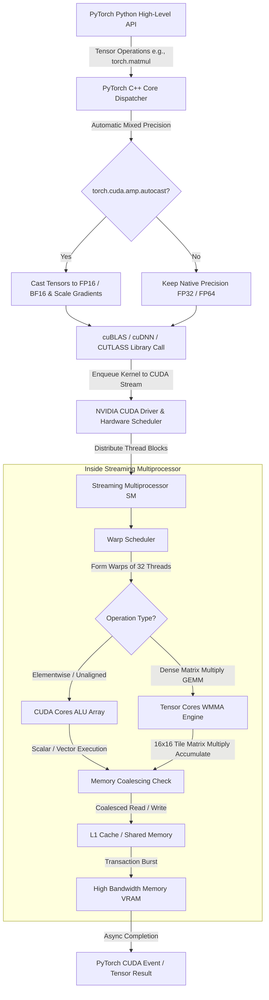

# Тема 2. Багатопотоковість, SIMD-векторизація та апаратне прискорення ШІ. Векторна обробка, архітектура GPU, тензорні ядра, векторизована тензорна алгебра на PyTorch

## 1. Основний зміст та теоретичний базис

Еволюція обчислювальних систем для задач штучного інтелекту та машинного навчання обумовила докорінну зміну підходів до організації програмно-апаратних обчислень. Задачі глибокого навчання (**Deep Learning**) та обробки великих масивів даних вимагають виконання мільярдів однотипних арифметичних операцій над матрицями та тензорами. Класичне послідовне виконання на центральному процесорі (**CPU**) з концепцією управління на основі затримок (**latency-oriented architecture**) поступається місцем векторизованим та масивно-паралельним архітектурам, орієнтованим на пропускну здатність (**throughput-oriented architecture**).

У межах даного освітнього компонента вивчення апаратного прискорення розпочинається з розмежування методів паралелізму на рівні інструкцій, даних та потоків:

1. **Паралелізм на рівні потоків CPU (Multithreading) та SIMD-векторизація.**  На рівні універсальних центральних процесорів підвищення продуктивності досягається поєднанням багатопотоковості (**Thread-Level Parallelism, TLP**) та векторизації на рівні інструкцій (**Single Instruction, Multiple Data, SIMD**). Багатопотоковість реалізується за допомогою системних функцій операційної системи (наприклад, POSIX Threads, OpenMP) або апаратної підтримки Hyper-Threading, дозволяючи кільком потокам автономно виконувати власні послідовності команд. 

   Разом із тим, кожен сучасний процесорний ядро містить розширені векторні регістри (наприклад, **AVX-512** у процесорах Intel або **ARM NEON** в архітектурі ARM). SIMD-векторизація дає змогу за одну машинну інструкцію завантажувати у векторний регістр шириною $256$ або $512$ біт кілька операндів одинарної чи подвійної точності та виконувати над ними одночасну паралельну операцію. Автоматична векторизація компілятором або використання спеціалізованих векторних інтрінсиків (**Intrinsics**) суттєво підвищує обчислювальну щільність CPU, проте фундаментальне обмеження кількості ядер та пропускної здатності шини пам'яті CPU не дозволяє масштабувати ці обчислення до потреб глибоких нейронних мереж.

2. **Масивно-паралельна архітектура GPU та технологія NVIDIA CUDA.** Графічні процесори (**Graphics Processing Units, GPU**) початково розроблялися для комп'ютерної графіки, де вимагається паралельна обробка мільйонів пікселів. Це зумовило їхню архітектуру: більша частина площі кремнієвого кристала віддається під арифметично-логічні пристрої (**ALU**), а не під складні блоки передбачення переходів чи великі кеші, як у CPU.

   Апаратна платформа NVIDIA реалізує програмно-апаратну архітектуру **CUDA (Compute Unified Device Architecture)**, яка трансформує GPU на універсальний обчислювальний прискорювач. На фізичному рівні GPU складається з масиву мультипроцесорів (**Streaming Multiprocessors, SM**). Кожен SM містить безліч ядер CUDA (**CUDA Cores**), регістровий файл, обчислювальні блоки для операцій із плаваючою крапкою та цілими числами, а також швидкісну розділювану пам'ять (**Shared Memory / L1 Cache**).

   На програмному рівні в CUDA застосовується модель **SIMT (Single Instruction, Multiple Threads)**. Обчислювальне завдання розбивається на сітку (**Grid**), яка складається з блоків потоків (**Thread Blocks**). На апаратному рівні потоки всередині блоку об'єднуються у групи по $32$ потоки, що називаються **варпами (Warps)**. Усі $32$ потоки одного варпу виконують одну й ту саму інструкцію синхронно над різними даними.
   
   Під час розробки програмного забезпечення для CUDA здобувачам вищої освіти необхідно враховувати два критичні апаратні ефекти:
   * **Дивергенція варпу (Warp Divergence):** якщо у коді присутній умовний оператор (наприклад, `if-else`), і потоки всередині одного варпу приймають різні гілки виконання, GPU змушений послідовно виконувати кожну гілку, маскуючи неактивні потоки. Це призводить до падіння продуктивності пропорційно кількості розгалужень.
   * **Коалесцинг пам'яті (Memory Coalescing):** глобальна пам'ять GPU (**Global Memory, VRAM**) має високу латентність. Якщо $32$ потоки варпу звертаються до суміжних вирівняних адрес у пам'яті, контролер пам'яті об'єднує ці запити в єдину транзакцію шириною $32$, $64$ або $128$ байт, досягаючи пікової пропускної здатності. При нерегулярному доскоку виникає деградація каналу зв'язку через безліч окремих транзакцій.

3. **Тензорні ядра (Tensor Cores) як спеціалізоване апаратне прискорення.** Починаючи з архітектури Volta та продовжуючи в Ampere, Hopper і Blackwell, NVIDIA впровадила в структуру SM спеціалізовані апаратні блоки — **тензорні ядра (Tensor Cores)**. На відміну від стандартних ядер CUDA, які виконують одну скалярну чи векторну операцію додавання-множення за такт, Tensor Cores виконують цілу матричну операцію множення та підсумовування **Fused Multiply-Add (FMA)** над мікроматрицями (плитками, або **Tiles**) за один системний такт варпу.

   Тензорні ядра оптимізовані для виконання обчислень у режимі змішаної точності (**Mixed Precision**). Вони перемножують матриці у форматах зниженої точності (FP16, BF16, TF32, INT8, FP8) й акумулюють результат у форматі високої точності (FP32). Це дає змогу зменшити вимоги до обсягу пам'яті у $2$--$4$ рази, подвоїти пропускну здатність шини даних та прискорити матричне множення в $4$--$16$ разів порівняно зі звичайними CUDA-ядрами без втрати підсумкової точності навчання нейронної мережі.

5. **Векторизована тензорна алгебра в середовищі PyTorch.** Фреймворк PyTorch надає високорівневу абстракцію над апаратним забезпеченням GPU. Тензор у PyTorch є багатовимірним масивом, який зберігає дані у послідовному блоці пам'яті (**Storage**) та описується метаданими: формою (**Shape**), кроками по пам'яті (**Strides**) та типом даних (**Dtype**).

   PyTorch транслює векторизовані операції безпосередньо у високооптимізовані CUDA-ядра через бібліотеки **cuBLAS**, **cuDNN** та **CUTLASS**. Для максимізації апаратного прискорення в PyTorch реалізовано:
   * **Автоматичну змішану точність (Automatic Mixed Precision, AMP)** через модуль `torch.cuda.amp.autocast` фреймворк динамічно вибирає формат FP16/BF16 для згорткових та лінійних шарів (активуючи Tensor Cores) та FP32 для критичних операцій (наприклад, Softmax, розрахунок Loss). Для запобігання анулюванню малих градієнтів застосовується масштабування градієнтів (`GradScaler`).
   * **Асинхронний режим виконання та CUDA-потоки (CUDA Streams)** оскільки операції на GPU виконуються асинхронно відносно центрального процесора. CUDA-потоки дають змогу паралельно суміщати обчислення на Tensor Cores із фоновим завантаженням наступного батчу даних через PCIe-шину (Host-to-Device Transfer).
   * **Компіляцію та векторизацію графа (TorchDynamo / PyTorch 2.0 / Triton)** як комбінація `torch.compile`, що аналізує Python-код, будує обчислювальний граф та за допомогою компілятора Triton генерує високоефективні зрощені (**Fused**) CUDA-ядра, виключаючи проміжні перезаписи тимчасових тензорів у глобальну пам'ять VRAM.

---

## 2. Математичний апарат, моделі та аналітичні залежності

### Модель обчислювальної інтенсивності
Для оцінювання того, чи є обчислювальний процес на GPU обмеженим швидкодією процесорних ядер (**Compute-Bound**) або пропускною здатністю пам'яті (**Memory-Bound**), застосовується аналітична модель Roofline.

Арифметика (операційна інтенсивність) $I$ визначається як відношення кількості виконаних плаваючих операцій (**FLOPs**) до обсягу переданих даних через шину пам'яті у байтах:

$$I = \frac{W}{V}$$

де $I$ — операційна інтенсивність ($FLOP / \text{Byte}$), $W$ — загальна кількість математичних операцій ($FLOP$), $V$ — сумарний обсяг даних, зчитаних та записаних у глобальну пам'ять VRAM ($\text{Bytes}$).

Гранична продуктивність системи $P$ ($FLOP / s$) описується формулою:

$$P = \min\left(P_{\max}, I \cdot B_{\max}\right)$$

де $P$ — реальна продуктивність прискорювача ($FLOP / s$), $P_{\max}$ — пикова обчислювальна потужність ядер GPU / Tensor Cores ($FLOP / s$), $I$ — операційна інтенсивність алгоритму ($FLOP / \text{Byte}$), $B_{\max}$ — фізична пропускна здатність шини пам'яті GPU ($\text{Bytes} / s$).

Якщо $I < \frac{P_{\max}}{B_{\max}}$, алгоритм є **Memory-Bound** (наприклад, поелементне додавання тензорів, Softmax). Якщо $I > \frac{P_{\max}}{B_{\max}}$, алгоритм є **Compute-Bound** (наприклад, плотне матричне множення GEMM, згортки), і саме в цьому режимі апаратна потужність Tensor Cores розкривається максимально.

### Математична модель операцій на Tensor Cores
Основною мікроархітектурною операцією тензорного ядра є матричне множення та підсумовування плиток **WMMA (Warp Matrix Multiply and Accumulate)**.

Для плиток матриць розмінністю $16 \times 16$ операція обчислюється як:

$$D = A \cdot B + C$$

де $A \in \mathbb{R}^{16 \times 16}$ — вихідна матриця операндів (формат FP16 або BF16), $B \in \mathbb{R}^{16 \times 16}$ — вихідна матриця операндів (формат FP16 або BF16), $C \in \mathbb{R}^{16 \times 16}$ — матриця акумулятора (формат FP32 або FP16), $D \in \mathbb{R}^{16 \times 16}$ — підсумкова матриця результату (формат FP32 або FP16).

У покомпонентній формі для кожного елемента $d_{i,j}$ плитки результату математичний вираз має вигляд:

$$d_{i,j} = \left(\sum_{k=1}^{16} a_{i,k} \cdot b_{k,j}\right) + c_{i,j}, \quad i,j \in \{1, \dots, 16\}$$

де $a_{i,k}$ — елементи $i$-го рядка матриці $A$, $b_{k,j}$ — елементи $j$-го стовпця матриці $B$, $c_{i,j}$ — початкове значення акумулятора.

За один системний такт один варп ($32$ потоки), використовуючи тензорні ядра, виконує $16 \times 16 \times 16 = 4096$ операцій множення та $4096$ операцій додавання, що сумарно становить $8192$ $FLOP / \text{такт}$ на варп.

### Математичний опис адресації тензорів у пам'яті
Для векторизованої обробки тензорів у PyTorch без фізичного копіювання даних використовується математична адресація через кроки (**Strides**).

Нехай задано $D$-вимірний тензор із формою $\mathbf{S} = (S_0, S_1, \dots, S_{D-1})$ та вектором кроків $\mathbf{St} = (St_0, St_1, \dots, St_{D-1})$. Зміщення елемента з багатовимірним індексом $(i_0, i_1, \dots, i_{D-1})$ у лінійному фізичному масиві пам'яті $\text{Offset}$ обчислюється за формулою:

$$\text{Offset}(i_0, i_1, \dots, i_{D-1}) = \sum_{d=0}^{D-1} i_d \cdot St_d$$

де $\text{Offset}$ — індекс елемента у плоскому $1D$-масиві пам'яті (вимірюється в кількості елементів), $i_d$ — індекс елемента за виміром $d$ ($0 \le i_d < S_d$), $St_d$ — значення кроку (stride) за виміром $d$, що показує, на скільки елементів у плоскому масиві потрібно зміститися при переході до наступного елемента за виміром $d$.

Тензор вважається безперервним у пам'яті (**Contiguous**), якщо його кроки задовольняють канонічній рекурентній умові:

$$St_{D-1} = 1, \quad St_d = St_{d+1} \cdot S_{d+1}, \quad \forall d \in \{0, 1, \dots, D-2\}$$

Якщо над тензором виконуються операції транспонування (`.transpose()`, `.t()`) або зміни порядку осей (`.permute()`), PyTorch змінює лише значення вектора кроків $\mathbf{St}$, залишаючи фізичний блок пам'яті $\text{Storage}$ незмінним. Це дає змогу виконувати миттєві реорганізації осей за $O(1)$, але вимагає виклику методу `.contiguous()` перед передачею тензора у векторизовані CUDA-ядра, що очікують строго послідовне розміщення даних у VRAM.

---

## 3. Систематизація даних та порівняльний аналіз

Для глибокого порівняльного аналізу методів векторизації та апаратних обчислювальних модулів нижче наведено порівняльну характеристику сучасних обчислювальних платформ, що застосовуються в системній інженерії та штучному інтелекті.

| Параметр порівняння | CPU SIMD (AVX-512) | GPU CUDA Cores | GPU Tensor Cores | TPU / NPU (Matrix Units) |
| :--- | :--- | :--- | :--- | :--- |
| **Архітектурний парадигмальний тип** | Векторний скалярний прискорювач (SIMD) | Масивно-паралельні скалярні ядра (SIMT) | Спеціалізовані матричні блоки (WMMA Tile-based) | Систолічна матрична решітка (Systolic Array) |
| **Підтримувані формати даних** | FP64, FP32, INT512 (пакетний), INT8 | FP64, FP32, FP16, INT8, INT4 | FP16, BF16, TF32, INT8, INT4, FP8 | BF16, FP16, INT8, INT4 |
| **Базова обчислювальна операція за такт** | Векторне FMA (наприклад, 16 FP32 чисел) | Скалярне FMA (1 операція $a \cdot b + c$ на ядро) | Матрична плитка $16 \times 16 \times 16$ ($D = A \cdot B + C$) | Систолічне множення великих матриць ($128 \times 128$) |
| **Теоретична продуктивність (порядок)** | $0.1$--$2$ TFLOPS | $10$--$40$ TFLOPS (FP32) | $100$--$2000+$ TFLOPS (Tensor FP16/INT8) | $100$--$1000+$ TOPS |
| **Вимоги до пам'яті та структури (Layout)** | Кеш-лінії CPU, вирівнювання по 64 байтам | Коалесцинг глобальної пам'яті VRAM | Формат масивів, кратний плиткам $8/16/32$ | Стрімінгова подача даних у систолічний масив |
| **Гнучкість та динамічне розгалуження** | Висока (підтримка будь-якого коду C/C++) | Середня (штрафи за дивергенцію варпу) | Низька (тільки фіксовані матричні операції) | Вкрай низька (статичний граф обчислень) |
| **Основний стек у PyTorch** | C++ Екстеншн, CPU Tensors, OpenMP | `torch.cuda` (загальні ядра cuBLAS) | `torch.cuda.amp`, TensorFloat32, cuDNN | `torch_xla`, PyTorch NPU extensions |

Порівняльний аналіз свідчить про глибоку спецiалізацію апаратних засобів. Central Processing Unit (CPU) забезпечує максимальну гнучкість для складної логіки з численними розгалуженнями, проте його обчислювальна щільність для тензорної алгебри є мінімальною. CUDA Cores надають універсальний масивно-паралельний середовищний рівень для скалярних та векторних обчислень. 

Водночас **Tensor Cores** та **NPU/TPU** репрезентують вузькоспеціалізовані матричні прискорювачі. Вони жертвують універсальністю виконання довільного коду заради досягнення колосальної обчислювальної щільності за рахунок обмеження розмірностей плиток (Tile-based processing) та застосування зниженої точності (FP16/BF16/TF32). Для здобувачів вищої освіти це означає: щоб ефективно використати потенціал Tensor Cores у фреймворку PyTorch, розмірності тензорних матриць (розміри прихованих шарів, кількість каналів згортки, розміри батчу) завжди повинні бути кратними $8$, $16$ або $32$.

---

## 4. Візуалізація процесів та структурних зв'язків

Для ілюстрації проходження векторизованої тензорної операції з високорівневого коду PyTorch через інфраструктуру CUDA, апаратні варпи та тензорні ядра SM нижче наведено деталізовану графічну схему.

*Рисунок 1 — Ієрархічна структура апаратного прискорення CUDA та обчислювальний конвеєр векторизованої алгебри в PyTorch*

Схема демонструє повний цикл виконання векторизованої операції. При виклику математичної операції (наприклад, `torch.matmul`) на рівні Python API (`A`), виклик передається у C++ ядро PyTorch (`B`). Якщо активовано режим AMP (`C`), тензори автоматично конвертуються у формат зниженої точності FP16/BF16 (`D`). 

Далі фреймворк формує виклик оптимізованої бібліотеки cuBLAS чи CUTLASS (`F`) і направляє CUDA-ядро у відповідний асинхронний потік CUDA Stream (`G`). Апаратний планувальник GPU розподіляє блоки потоків між вільними мультипроцесорами SM (`H`). Всередині SM планувальник варпів (`I`) розбиває потоки на групи по $32$. Якщо операція є щільним матричним множенням, виконується виклик тензорних ядер Tensor Cores (`L`), які здійснюють WMMA-обчислення над плитами $16 \times 16 \times 16$. 

Звернення до пам'яті перевіряються на коалесцинг (`M`), пропускаються через локальний L1-кеш/розділювану пам'ять (`N`) і транслюються в підсистему високошвидкісної графічної пам'яті VRAM (`O`). Після завершення асинхронної операції результат повертається у Python-середовище через об'єкт PyTorch Tensor (`P`).

---

## 5. Питання для самоперевірки та аналітичного осмислення

1. Поясніть апаратну різницю між векторизацією SIMD на центральному процесорі (на прикладі інструкцій Intel AVX-512) та концепцією SIMT на графічних прискорювачах NVIDIA. Чому високий рівень розгалуження коду (`if-else`) викликає деградацію продуктивності на GPU?
2. Здобувач вищої освіти тренує нейронну мережу в PyTorch і зіткнувся з тим, що зміна розміру прихованого шару з $512$ на $509$ нейронів призвела до різкого зниження швидкості обчислень на $40\%$. Поясніть причину цього явища з точки зору архітектури Tensor Cores та вирівнювання матричних плиток (Tile-based execution).
3. Проаналізуйте модель Roofline для двох операцій у глибокому навчанні: поелементного додавання двох тензорів $\mathbf{C} = \mathbf{A} + \mathbf{B}$ та щільного матричного множення $\mathbf{C} = \mathbf{A} \cdot \mathbf{B}$. Яка з цих операцій є Memory-Bound, а яка — Compute-Bound? Обґрунтуйте відповідь через розрахунок операційної інтенсивності $I$.
4. У чому полягає математична та апаратна сутність Automatic Mixed Precision (AMP) у PyTorch? Для чого під час використання точності FP16 потрібен компонент `GradScaler`, і які математичні проблеми він усуває при обчисленні зворотного поширення помилки (Backpropagation)?
5. Тензор у PyTorch має форму $(100, 100, 3)$ та канонічні кроки (strides) $(300, 3, 1)$. Після виконання операції `tensor.permute(2, 0, 1)` як зміняться його кроки у пам'яті? Чому безпосередній виклик деяких CUDA-ядер над цим тензором вимагає попереднього виклику методу `.contiguous()`?