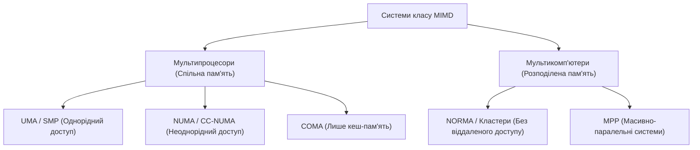
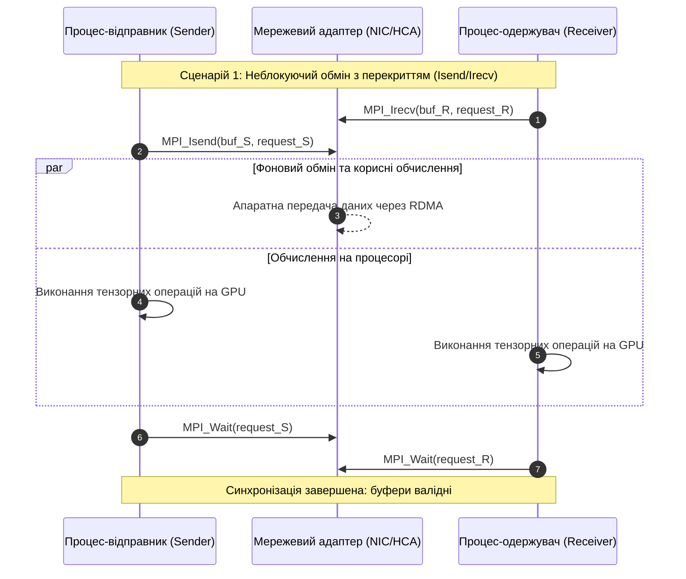
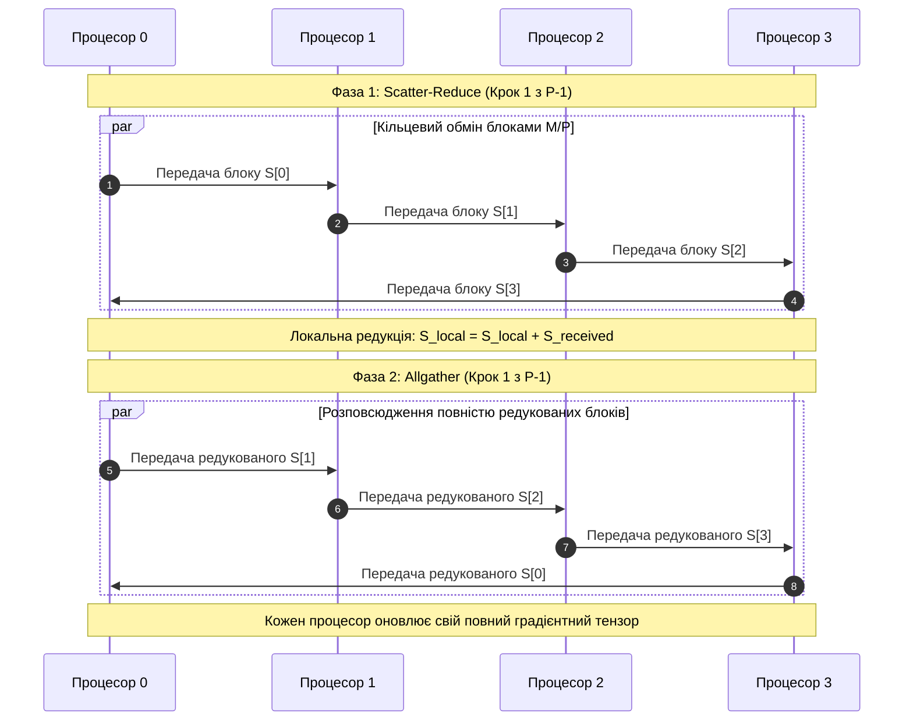
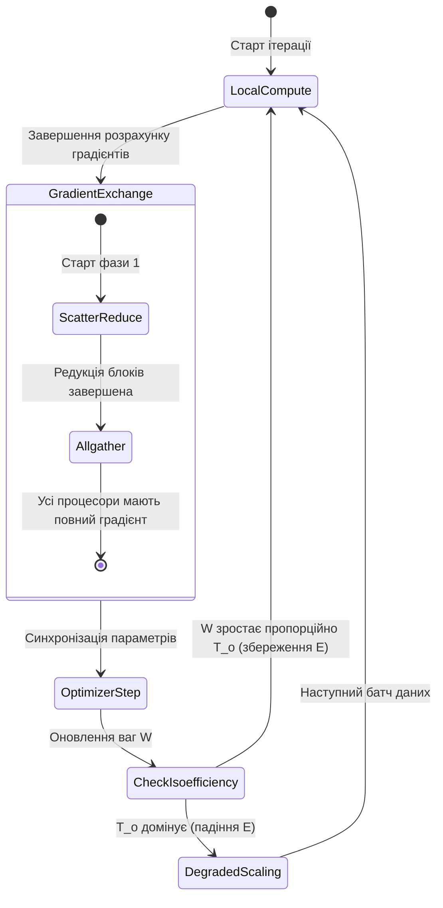
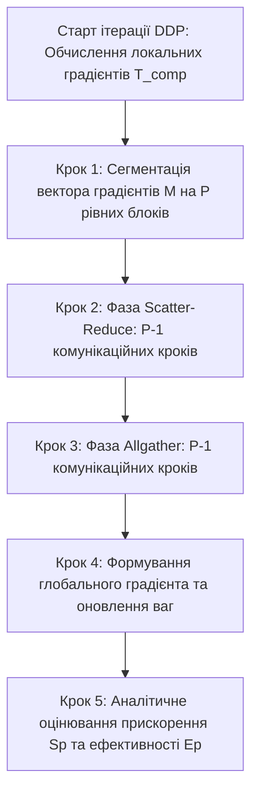

# Тема 3. Розподілені обчислювальні процеси та інтерфейс MPI: модель передачі повідомлень, точкові та колективні комунікаційні операції, топології зв'язку AI-кластерів

## Мета лекції

Метою лекції є формування у здобувачів вищої освіти комплексної системи теоретичних знань і прикладних інженерних компетентностей щодо організації розподілених обчислювальних процесів на базі стандарту Message Passing Interface (MPI) в інфраструктурах високопродуктивних систем штучного інтелекту. У межах навчальної пари розглядаються архітектурні принципи функціонування багатопроцесорних комплексів без спільного доступу до пам'яті (NORMA), апаратна та логічна семантика точкових і колективних комунікаційних примітивів, а також топологічні структури інтерконекту спеціалізованих AI-кластерів. Особливу увагу приділено математичному моделюванню мережевих затримок і аналізу обчислювальної складності децентралізованих алгоритмів синхронізації градієнтів, необхідних для масштабування навчання великих нейронних моделей.

## Очікувані результати навчання

Після успішного опанування матеріалу лекції здобувачі вищої освіти демонструватимуть такі результати:

1. **Знання та розуміння.** Здобувачі детально знають концептуальну модель передачі повідомлень, специфікацію стандарту MPI, життєвий цикл процесів у парадигмі SPMP, структуру комунікаторів, формати конвертів повідомлень, а також принципи взаємодії обчислювальних вузлів у кластерних мережах з різними фізичними та віртуальними топологіями.
2. **Застосування.** Здобувачі вміють самостійно проектувати паралельні програми мовами C/C++ та Python (за допомогою бібліотеки `mpi4py`), обирати оптимальні режими передачі даних (блокуючі, неблокуючі, синхронні, буферизовані), реалізовувати колективні операції збору і редукції, а також будувати безпечні схеми комунікації для виключення взаємних блокувань (дедлоків).
3. **Аналіз.** Здобувачі здатні аналітично оцінювати часові витрати на пересилання даних у розподілених середовищах із застосуванням моделей Хокні та LogGP, а також досліджувати кількісні параметри комунікаційних графів, включаючи діаметр, ступінь зв'язності, ширину бісекції та апаратну вартість ліній зв'язку.
4. **Оцінювання та синтез.** Здобувачі володіють навичками критичного порівняння архітектур розподіленого навчання систем штучного інтелекту (централізованої моделі Parameter Server та децентралізованого підходу Ring-Allreduce), синтезують оптимальні алгоритмічні схеми балансування навантаження та оптимізують комунікаційну складність алгоритмів паралелізму за даними (Data Parallelism) для великомасштабних GPU-кластерів.

---

## Детальний покроковий план лекції

### 1. Теоретичний модуль. Архітектурні засади розподілених обчислень, парадигма передачі повідомлень та специфікація MPI

* 1.1. Архітектурна диференціація багатопроцесорних комплексів: фундаментальні відмінності систем зі спільною пам'яттю (SMP, CC-NUMA) від розподілених кластерних комплексів без прямого віддаленого доступу до пам'яті (NORMA).
* 1.2. Концептуальна модель передачі повідомлень (Message Passing): парадигма «одна програма — множина процесів» (SPMP), простори адрес, контексти взаємодії, структура комунікаторів та ідентифікація рангів процесів у середовищі `MPI_COMM_WORLD`.
* 1.3. Точкові комунікаційні операції: порівняльна характеристика стандартного, блокуючого, неблокуючого, синхронного та буферизованого режимів обміну, протоколи квитування, причини виникнення ситуацій взаємного блокування (дедлоків) і методи їх усунення.
* 1.4. Мережеві комутаційні фабрики та топології сучасних AI-кластерів: аналіз повнозв'язних структур (NVSwitch / NVLink), ієрархічних потовщених дерев (Fat-Tree) і тороїдальних ґраток (2D/3D Torus), а також програмне конструювання віртуальних декартових топологій в MPI.

### 2. Аналітичний модуль. Математичні моделі комунікаційної затримки, топологічні метрики та алгоритмічна складність колективних операцій

* 2.1. Аналітичне оцінювання часу передачі повідомлень у кластерних системах на основі класичної двопараметричної моделі Хокні та багатопараметричної моделі LogGP.
* 2.2. Формалізація топологічних характеристик комунікаційних мереж: аналітичний розрахунок мережевого діаметра, ступеня зв'язності, ширини бінарного поділу (bisection width) та апаратної вартості ліній зв'язку.
* 2.3. Алгебраїчний та часовий аналіз базових колективних операцій: широкомовного розсилання (`MPI_Bcast`), розподілу масивів (`MPI_Scatter`), глобального збору (`MPI_Gather`), персоналізованого обміну (`MPI_Alltoall`) та глобальної редукції (`MPI_Reduce`, `MPI_Allreduce`).
* 2.4. Математичне виведення комунікаційної складності децентралізованого кільцевого алгоритму `Ring-Allreduce`: поетапний розрахунок фаз Scatter-Reduce та Allgather і доведення незалежності обсягу переданих даних від кількості процесорів.
* 2.5. Аналіз масштабованості паралельних процесів: формалізація функції ізоефективності та дослідження впливу комунікаційних накладних витрат на прискорення обчислень у моделях розподіленого навчання штучного інтелекту.

### 3. Практично-розрахунковий кейс. Проектування та реалізація децентралізованої синхронізації градієнтів у розподіленому навчанні нейромереж

**Тема наскрізної задачі.** «Аналітичний розрахунок мережевої трудомісткості та алгоритмічна реалізація децентралізованої синхронізації векторів градієнтів методом Ring-Allreduce для багатовузлового кластера навчання штучного інтелекту».

## 1. Фундаментальний теоретичний базис та концептуальні засади

### 1.1. Архітектурна диференціація багатопроцесорних комплексів: фундаментальні відмінності систем зі спільною пам'яттю (SMP, CC-NUMA) від розподілених кластерних комплексів без прямого віддаленого доступу до пам'яті (NORMA)

Сучасний розвиток систем штучного інтелекту характеризується експоненційним зростанням обчислювальної складності моделей глибокого навчання. Параметричний обсяг сучасних великих мовних моделей (**Large Language Models, LLM**), мультимодальних трансформерів та систем комп'ютерного зору досягає сотень мільярдів і трильйонів ваг. Збереження матриць параметрів таких розмірностей, проміжних активацій прямих проходів, векторів градієнтів та внутрішніх станів оптимізаторів потребує десятків терабайтів високошвидкісної пам'яті, що принципово перевищує фізичну ємність окремого апаратного прискорювача чи автономного обчислювального вузла. Подолання цього бар'єра вимагає агрегації обчислювальних потужностей багатьох процесорів у межах єдиної системи.

У класичній систематиці обчислювальних систем Майкла Флінна переважна більшість паралельних комплексів належить до класу **MIMD (Multiple Instruction stream, Multiple Data stream)**, де множинні потоки інструкцій обробляють множинні потоки даних. Проте внутрішня різнорідність класу MIMD є надзвичайно високою, через що виникає необхідність структурно-функціональної класифікації за способом організації пам'яті та механізмами доступу до неї.



Системи із спільною пам'яттю (**Shared Memory Systems, Multiprocessors**) характеризуються наявністю єдиного логічного або фізичного адресного простору, доступного всім обчислювальним ядрам. 

Першим базовим підвидом є архітектура **SMP (Symmetric Multiprocessor)**, яка реалізує концепцію однорідного доступу до пам'яті (**Uniform Memory Access, UMA**). У таких комплексах усі процесори володіють ідентичними характеристиками, функціонують під управлінням єдиного екземпляра операційної системи та з'єднані із централізованою пам'яттю через спільну системну шину або комутатор. Головною властивістю UMA є те, що час доступу $\tau$ від будь-якого процесора $P_i$ до будь-якої комірки пам'яті $M_j$ є строго інваріантним:

$$\tau(P_i, M_j) = \mathrm{const}, \quad \forall i, j.$$

де $\tau(P_i, M_j)$ позначає фізичний час затримки звернення процесора до адреси пам'яті, виражений у наносекундах ($\text{нс}$).

Основним лімітуючим фактором масштабування SMP-систем є конфлікт за смугу пропускання системної шини та апаратна **проблема когерентності кешів (Cache Coherence Problem)**. Оскільки кожне ядро має багаторівневу локальну кеш-пам'ять ($L1$, $L2$, $L3$), зміна значення спільної змінної одним процесором вимагає негайної інвалідації або оновлення відповідних копій у кешах інших процесорів через механізми відстеження шини (**Bus Snooping**) або каталогів (**Directory-based protocols**). При збільшенні кількості ядер понад 32–64 пропускна здатність шини насичується службовим трафіком синхронізації, що призводить до падіння ефективності системи.

Для подолання бар'єра масштабування UMA було створено архітектури неоднорідного доступу до пам'яті (**Non-Uniform Memory Access, NUMA**), серед яких домінують комплекси з апаратною підтримкою когерентності кешів (**Cache-Coherent NUMA, CC-NUMA**). У таких системах оперативна пам'ять фізично розподілена між окремими процесорними модулями (сокетами або лезами), проте логічно формує єдиний глобальний адресний простір. Звернення процесора до локальної пам'яті виконується безпосередньо через інтегрований контролер, тоді як доступ до пам'яті віддаленого вузла здійснюється через спеціалізовані мости інтерконекту (наприклад, Intel UPI, AMD Infinity Fabric). Це формує суттєву асиметрію часу доступу, яка описується коефіцієнтом неоднорідності:

$$\gamma_{\mathrm{NUMA}} = \frac{\tau(P_i, M_{\mathrm{remote}})}{\tau(P_i, M_{\mathrm{local}})} > 1.$$

де $\tau(P_i, M_{\mathrm{remote}})$ позначає латентність транзакції читання або запису до блоку пам'яті чужого вузла, виміряну в наносекундах ($\text{нс}$), $\tau(P_i, M_{\mathrm{local}})$ є латентністю доступу до локального банку пам'яті поточного вузла у наносекундах ($\text{нс}$), а $\gamma_{\mathrm{NUMA}}$ є безрозмірним коефіцієнтом затримки (зазвичай лежить у межах від $1{,}5$ до $4{,}0$).

Розподілені обчислювальні комплекси (**Multicomputers**) спираються на парадигму архітектури без прямого віддаленого доступу до пам'яті (**No-Remote Memory Access, NORMA**). До цього класу належать обчислювальні кластери (**Clusters**) та масивно-паралельні системи (**Massively Parallel Processors, MPP**). 

У системах архітектури NORMA відсутній глобальний апаратний адресний простір. Кожен обчислювальний вузол (сервер) є повністю автономною обчислювальною машиною, яка функціонує під управлінням власного екземпляра ядра операційної системи, володіє власними контролерами введення-виведення, локальною оперативною пам'яттю та прискорювачами. Жоден процесор системи NORMA не здатний апаратно адресувати або модифікувати комірки пам'яті іншого вузла за допомогою звичайних машинних інструкцій `LOAD` чи `STORE`. Обмін інформацією між компонентами здійснюється виключно на програмному рівні за допомогою **передачі повідомлень (Message Passing)** через виділені високошвидкісні комунікаційні мережі. Саме архітектура NORMA становить апаратний фундамент сучасних розподілених кластерів штучного інтелекту завдяки практично необмеженій горизонтальній масштабованості, що охоплює десятки тисяч прискорювачів.

---

### 1.2. Концептуальна модель передачі повідомлень (Message Passing): парадигма «одна програма — множина процесів» (SPMP), простори адрес, контексти взаємодії, структура комунікаторів та ідентифікація рангів процесів у середовищі `MPI_COMM_WORLD`

Відсутність єдиного фізичного адресного простору в кластерних системах вимагає спеціалізованої моделі програмування. Загальновизнаним індустріальним та академічним стандартом такої взаємодії є специфікація **MPI (Message Passing Interface)**, розроблена міжнародним консорціумом MPI Forum.

У системі координат MPI паралельна програма моделюється сукупністю незалежних **процесів (Processes)**, які виконуються одночасно. Кожен процес має повністю ізольований віртуальний адресний простір, що унеможливлює виникнення класичних конфліктів апаратної пам'яті на кшталт станів гонитви (**Race Conditions**) за несинхронізовані змінні. Для взаємодії процесів застосовується модель **SPMP (Single Program Multiple Processes)**, яка є алгоритмічним варіантом SPMD. Відповідно до цієї моделі, абсолютно всі вузли кластера запускають ідентичний бінарний виконуваний код. Диверсифікація функціональної логіки обчислень та обробка унікальних підмножин вхідних даних здійснюється за допомогою програмного розгалуження, що базується на унікальному номері процесу.

Фундаментальними категоріями середовища MPI є:

1. **Комунікатор (Communicator).** Службовий системний об'єкт непрозорого типу (`MPI_Comm`), який інкапсулює групу процесів, контекст зв'язку та топологічну структуру. Комунікатор ізолює комунікаційні операції всередині певної групи, гарантуючи, що повідомлення, відправлені в межах однієї бібліотеки чи модуля, не будуть помилково перехоплені іншими частинами програми.
2. **Базовий комунікатор `MPI_COMM_WORLD`.** Створюється автоматично під час ініціалізації середовища викликом `MPI_Init` та охоплює абсолютно всі процеси, виділені планувальником задач для виконання даної паралельної програми. Поряд із ним існує статичний комунікатор `MPI_COMM_SELF`, що містить виключно один викликаючий процес.
3. **Ранг процесу (Process Rank).** Унікальний цілочисельний ідентифікатор процесу всередині заданого комунікатора. Ранги нумеруються послідовно цілими числами від $0$ до $P - 1$, де $P$ — потужність групи комунікатора (розмір комунікатора). Ранг процесу не є фіксованою фізичною характеристикою процесора, а визначається логічно:

$$r \in \{0, 1, \dots, P - 1\}, \quad P = |\mathcal{G}|.$$

де $r$ — ранг процесу (безрозмірна величина типу `int`), $P$ — загальна кількість процесів у комунікаторі, а $\mathcal{G}$ позначає впорядковану множину процесів комунікатора.

Для отримання характеристик комунікаційного простору кожен процес викликає обов'язкові функції:

* `MPI_Comm_size(MPI_Comm comm, int *size)` — повертає загальну кількість процесів $P$ у комунікаторі `comm`.
* `MPI_Comm_rank(MPI_Comm comm, int *rank)` — повертає ранг $r$ поточного викликаючого процесу.

4. **Конверт повідомлення (Message Envelope).** Будь-яка передача даних у системі MPI супроводжується набором метаданих, що формують конверт повідомлення. Конверт однозначно ідентифікує пакет у комунікаційній мережі та містить такий кортеж параметрів:

$$\mathcal{E} = \langle \mathrm{src}, \, \mathrm{dst}, \, \mathrm{tag}, \, \mathrm{comm}, \, \mathrm{datatype}, \, \mathrm{count} \rangle.$$

де $\mathrm{src}$ — ранг процесу-відправника (`int`), $\mathrm{dst}$ — ранг процесу-одержувача (`int`), $\mathrm{tag}$ — користувацький цілочисельний маркер повідомлення для розрізнення типів даних (`int`), $\mathrm{comm}$ — дескриптор комунікатора (`MPI_Comm`), $\mathrm{datatype}$ — специфікатор типу елементів (`MPI_Datatype`), $\mathrm{count}$ — кількість елементів даного типу у буфері (`int`).

Життєвий цикл паралельної MPI-програми регламентується суворими правилами. Першим викликом бібліотеки завжди має бути `MPI_Init(&argc, &argv)`, який ініціалізує внутрішні комунікаційні структури та прив'язує процеси до мережевого середовища. Завершення паралельної секції здійснюється викликом `MPI_Finalize()`, після якого виконання будь-яких комунікаційних функцій стандарту категорично забороняється.

---

### 1.3. Точкові комунікаційні операції: порівняльна характеристика стандартного, блокуючого, неблокуючого, синхронного та буферизованого режимів обміну, протоколи квитування, причини виникнення ситуацій взаємного блокування (дедлоків) і методи їх усунення

Точкові операції (**Point-to-Point Communication**) забезпечують передачу дискретного масиву даних строго від одного процесу-джерела (**Source**) до одного процесу-одержувача (**Destination**). Успішність операції вимагає сумісності викликів: на стороні відправника має бути активована функція передачі, а на стороні одержувача — парна функція прийому з відповідними параметрами конверта.

Залежно від поведінки процесу та механізмів виділення пам'яті, стандарт MPI регламентує чотири базові режими передачі повідомлень:

1. **Стандартний режим (`MPI_Send`).** Поведінка виклику не зафіксована стандартом жорстко і залежить від внутрішньої реалізації бібліотеки MPI та розміру повідомлення. Для малих пакетів зазвичай активується **протокол швидкого пересилання (Eager Protocol)**: дані негайно копіюються в системний проміжний буфер процесу-одержувача або комунікаційного демона, після чого функція відправника негайно повертає управління, не чекаючи виклику `MPI_Recv`. Для великих повідомлень система автоматично перемикається на **протокол зустрічі (Rendezvous Protocol)**, де передача масиву розпочинається лише після того, як одержувач підтвердить готовність власного буфера за допомогою спеціального службового рукостискання (**Handshake**).
2. **Синхронний режим (`MPI_Ssend`).** Виклик завершується тоді й тільки тоді, коли процес-одержувач почав виконання відповідної операції прийому `MPI_Recv`. Цей режим повністю виключає використання неконтрольованих системних буферів і гарантує синхронізацію часових шкал процесів.
3. **Буферизований режим (`MPI_Bsend`).** Відправник примусово записує дані у попередньо виділений користувацький сегмент оперативної пам'яті за допомогою функції `MPI_Buffer_attach`. Виклик завершується миттєво після копіювання у буфер. Якщо розмір переданих даних перевищує виділену ємність буфера, програма генерує аварійну помилку переповнення пам'яті `MPI_ERR_BUFFER`.
4. **Режим передачі за готовністю (`MPI_Rsend`).** Може ініціюватися виключно за умови, що процес-одержувач уже запустив відповідну операцію `MPI_Recv`. Використання цього режиму усуває витрати на службове узгодження готовності каналу, однак, якщо одержувач не був готовий на момент старту відправки, поведінка програми стає невизначеною (**Undefined Behavior**).

За часовою семантикою виконання всі операції поділяються на **блокуючі** та **неблокуючі**.

Блокуючі функції (`MPI_Send`, `MPI_Recv`) призупиняють потік виконання викликаючого процесу до моменту, поки буфер передачі не звільниться для повторного безпечного запису (для відправника), або поки буфер прийому не буде повністю заповнений цільовими даними (для одержувача).

Неблокуючі функції додають до назви префікс `I` (**Immediate**) — `MPI_Isend`, `MPI_Irecv`. Вони лише реєструють комунікаційний запит у внутрішній черзі мережевого адаптера, повертають спеціальний непрозорий дескриптор операції `MPI_Request` і негайно повертають управління у програму. Це дозволяє організувати ефективне суміщення обчислень на CPU чи GPU з паралельним пересиланням даних через мережеві контролери (**DMA / RDMA**).



Для моніторингу стану неблокуючої комунікації використовуються такі операції:

* `MPI_Test(MPI_Request *request, int *flag, MPI_Status *status)` — неблокуюча перевірка завершення операції, що записує значення `true` або `false` у змінну `flag`.
* `MPI_Wait(MPI_Request *request, MPI_Status *status)` — блокуюче очікування остаточного завершення пересилання.
* Множинні виклики: `MPI_Waitall`, `MPI_Waitany`, `MPI_Waitsome`, які контролюють масиви дескрипторів запитів.

Некоректне структурування блокуючих точкових операцій призводить до критичної аномалії паралельних програм — **взаємного блокування (Deadlock)**. Класичний приклад виникає під час спроби симетричного обміну даними між двома процесами:

```c
// Потенційно тупикова ситуація (Deadlock)
if (rank == 0) {
    MPI_Send(send_buf, count, MPI_FLOAT, 1, 0, MPI_COMM_WORLD);
    MPI_Recv(recv_buf, count, MPI_FLOAT, 1, 0, MPI_COMM_WORLD, &status);
} else if (rank == 1) {
    MPI_Send(send_buf, count, MPI_FLOAT, 0, 0, MPI_COMM_WORLD);
    MPI_Recv(recv_buf, count, MPI_FLOAT, 0, 0, MPI_COMM_WORLD, &status);
}
```

Якщо розмір повідомлення перевищує поріг системного буферизування протоколу Eager, обидва процеси одночасно перейдуть у стан блокування всередині `MPI_Send` в очікуванні початку читання протилежною стороною, яка ніколи не настане. Для гарантованого запобігання дедлокам стандарт MPI надає комбінований атомарний виклик:

```c
int MPI_Sendrecv(
    const void *sendbuf, int sendcount, MPI_Datatype sendtype, int dest, int sendtag,
    void *recvbuf, int recvcount, MPI_Datatype recvtype, int source, int recvtag,
    MPI_Comm comm, MPI_Status *status
);
```

Функція `MPI_Sendrecv` гарантує безпечний одночасний прийом та передачу даних без небезпеки виникнення циклічних блокувань пам'яті завдяки внутрішньому управлінню чергами вводу-виводу на рівні бібліотеки.

---

### 1.4. Мережеві комутаційні фабрики та топології сучасних AI-кластерів: аналіз повнозв'язних структур (NVSwitch / NVLink), ієрархічних потовщених дерев (Fat-Tree) і тороїдальних ґраток (2D/3D Torus), а також програмне конструювання віртуальних декартових топологій в MPI

Продуктивність розподілених обчислень в інженерії штучного інтелекту безпосередньо обмежується архітектурою та топологією міжпроцесорного інтерконекту. Під **топологією мережі передачі даних** розуміють просторову структуру з'єднання обчислювальних вузлів (процесорів, прискорювачів) фізичними лініями комутації. 

У межах одного сервера високої щільності (наприклад, NVIDIA DGX) зв'язок між графічними прискорювачами організовується як **повнозв'язана комутаційна фабрика (Switch-Fabric)** на базі шин **NVLink** та комутаторів **NVSwitch**. Ця топологія функціонує як апаратний повний граф (**clique**), де кожен графічний процесор має прямий канал обміну з будь-яким іншим процесором із пропускною здатністю до $900$ ГБ/с на напрямок, забезпечуючи мінімальну затримку рівня десятків наносекунд.

При масштабуванні за межі одного сервера застосовуються мережеві інтерфейси **InfiniBand (HDR, NDR, XDR)** або **RoCE (RDMA over Converged Ethernet)**. Для об'єднання тисяч вузлів використовуються такі фундаментальні мережеві топології:

1. **Ієрархічне потовщене дерево (Fat-Tree).** Модифікація класичного дерева, у якій смуга пропускання каналів зв'язку збільшується в міру наближення до кореневих комутаторів. Завдяки дублюванню висхідних каналів топологія Fat-Tree забезпечує **повну неблокуючу бісекційну ширину (Non-blocking Bisection Bandwidth)**, що усуває падіння швидкості передачі при випадкових патернах одночасної міжвузлової комунікації. Це робить Fat-Tree промисловим стандартом для побудови суперкомп'ютерних кластерів навчання штучного інтелекту.
2. **Тороїдальні ґратки (2D/3D Torus).** Регулярні багатовимірні сітки, у яких граничні вузли з'єднані кільцевими лініями зв'язку із протилежними вузлами. Топології типу Torus характеризуються низькою вартістю та фіксованою локальною кількістю портів на вузол ($2N$ для $N$-вимірного тора), проте володіють відносно великим мережевим діаметром, що вимагає маршрутизації через багато проміжних транзитних вузлів (**Multi-hop Latency**).

Стандарт MPI абстрагує фізичну конфігурацію ліній зв'язку через механізм **віртуальних топологій**. Логічна топологія процесорної групи за замовчуванням завжди розглядається як повний граф. Проте відображення процесів на структури завдань чисельного аналізу (матричні множення, диференціальні сітки) найефективніше здійснюється за допомогою **декартових топологій (Cartesian Topologies)**.

Створення віртуальної декартової решітки виконується функцією:

```c
int MPI_Cart_create(
    MPI_Comm oldcomm, int ndims, const int dims[], 
    const int periods[], int reorder, MPI_Comm *cartcomm
);
```

де `ndims` задає розмірність просторової сітки ($N$), масив `dims` довжиною `ndims` фіксує кількість процесів уздовж кожного виміру, масив прапорців `periods` визначає наявність замкнених циклічних зв'язків (перетворення лінійки на кільце, а решітки — на тор), а параметр `reorder` дозволяє бібліотеці MPI перевпорядкувати ранги процесів для їх оптимального відображення на фізичні топологічні вузли кластера з мінімізацією довжини кабельних з'єднань.

Після створення комунікатора з декартовою топологією процеси здійснюють взаємну адресацію не за лінійними рангами, а за $N$-вимірними координатами:

* `MPI_Cart_coords(MPI_Comm comm, int rank, int maxdims, int coords[])` — перетворює глобальний лінійний ранг процесу `rank` у вектор декартових координат `coords`.
* `MPI_Cart_rank(MPI_Comm comm, const int coords[], int *rank)` — обчислює скалярний ранг процесу за його просторовими координатами `coords`.
* `MPI_Cart_sub(MPI_Comm comm, const int remain_dims[], MPI_Comm *newcomm)` — розбиває вихідну багатовимірну декартову решітку на підрешітки меншої розмірності (наприклад, виділення окремих вектор-комунікаторів для рядків або стовпців матриці).
* `MPI_Cart_shift(MPI_Comm comm, int direction, int disp, int *rank_source, int *rank_dest)` — визначає ранги сусідніх процесів для здійснення циклічного або лінійного зсуву вздовж вибраного координатного виміру `direction` на величину кроку `disp`.

---

### Систематизація та класифікація базових архітектур розподілених обчислень

Нижче наведено порівняльну характеристику сучасних архітектур багатопроцесорних комплексів за ключовими параметрами організації оперативної пам'яті, масштабованості та специфіки використання в розподілених завданнях штучного інтелекту.

| Архітектурний тип системи | Організація адресного простору | Механізм апаратної синхронізації | Масштабованість (кількість ядер / вузлів) | Затримка віддаленого доступу | Домінуюча сфера застосування у системах ШІ |
| :--- | :--- | :--- | :--- | :--- | :--- |
| **SMP (UMA)** | Єдиний фізичний та логічний адресний простір | Спільна системна шина, протоколи відстеження (Snooping) | Низька (до $32$–$64$ обчислювальних ядер) | Відсутня (однорідна затримка $\approx 50$–$100$ нс) | Інференс невеликих моделей машинного навчання на окремих серверах |
| **CC-NUMA** | Логічно єдиний, фізично розподілений простір | Каталожні протоколи когерентності (Directory-based) | Середня (до $128$–$512$ процесорних сокетів) | Низька або помірна ($\approx 150$–$350$ нс через міжсокетні мости) | Попереднє завантаження та обробка гігантських графів знань і табличних даних |
| **Switch-Fabric (NVLink/NVSwitch)** | Спільний віртуальний простір GPU (Unified Memory) | Прямі апаратні кросбари, протокол NVLink | Локальна (до $8$–$72$ GPU у межах одного вузла чи стійки) | Екстремально низька ($\approx 80$–$120$ нс, швидкість до $900$ ГБ/с) | Тензорний та конвеєрний паралелізм (Megatron-LM, Tensor Parallelism) |
| **NORMA / Кластери** | Повністю ізольовані локальні адресні простори | Відсутній (виключно програмні повідомлення по мережі) | Практично необмежена ($10^3$–$10^5$ серверних вузлів) | Висока ($\approx 1$–$5$ мкс для InfiniBand, до десятків мкс для Ethernet) | Паралелізм за даними (DDP), тренування базових моделей Foundation Models |
| **MPP (Massively Parallel)** | Фізично розподілена пам'ять зі спеціалізованим інтерконектом | Спеціалізовані мікроядра та апаратні роутери | Дуже висока ($10^4$–$10^6$ обчислювальних ядер) | Помірна ($\approx 0{,}8$–$2$ мкс завдяки виділеним лініям 3D-Torus) | Великомасштабне наукове чисельне моделювання та квантова хімія |

---

> **ТИПОВА ПОМИЛКА:** Поширеним хибним уявленням серед розробників-початківців є ототожнення успішного повернення управління з блокуючої функції `MPI_Send` із фактом фізичної доставки повідомлення процесу-одержувачу. 
> Насправді семантика виклику `MPI_Send` гарантує виключно безпеку повторного використання вхідного буфера в оперативній пам'яті програми. Це означає, що передані дані або повністю переміщені в мережевий адаптер, або скопійовані у внутрішній системний буфер середовища MPI. Сам процес-одержувач на цей момент може навіть не викликати функцію `MPI_Recv`. Спроба побудови логіки часової синхронізації або взаємного квитування дій на базі виклику `MPI_Send` призводить до прихованих гонитов пам'яті, некоректних замірів часу виконання алгоритмів та непрогнозованих дедлоків при зміні розміру вхідних тензорів. Для гарантованої фіксації початку отримання повідомлення слід застосовувати виключно синхронний режим `MPI_Ssend` або спеціалізовані бар'єри `MPI_Barrier`.

---

> **КОНТРОЛЬНЕ ПИТАННЯ.** У чому полягає принципова різниця в поведінці неблокуючих операцій `MPI_Isend` та блокуючих буферизованих операцій `MPI_Bsend` з точки зору управління оперативною пам'яттю та безпеки повторного запису у вихідний буфер повідомлення?

<details markdown="1">
<summary>Розгорнути відповідь</summary>

**Правильний аналіз відмінностей полягає у такому порівнянні механізмів буферизації та станів дескрипторів:**

1. Під час виконання блокуючого виклику `MPI_Bsend` середовище MPI виконує синхронне копіювання переданого повідомлення у попередньо виділений та зареєстрований користувачем системний буфер (`MPI_Buffer_attach`). 
Внаслідок цього вихідний буфер програми стає безпечним для перезапису або видалення негайно після виходу з функції `MPI_Bsend`, проте загальна ємність оперативної пам'яті зменшується на розмір буферного пулу.

2. На противагу цьому, неблокуюча функція `MPI_Isend` не виконує примусового дублювання масиву в окремий користувацький буфер пам'яті. Вона лише передає покажчик на вихідний масив комунікаційному рушію мережевої карти або DMA-контролеру. 
Тому вихідний буфер категорично забороняється змінювати або читати доти, доки відповідний дескриптор запиту `MPI_Request` не буде переведений у фінальний стан за допомогою виклику `MPI_Wait` або позитивного повернення `MPI_Test`. Модифікація буфера до завершення очікування призведе до спотворення даних у каналі передачі.

3. Аналіз альтернативних варіантів:

    * Припущення про те, що `MPI_Isend` створює копію даних у стеку виклику, є хибним, оскільки копіювання великих тензорів призвело б до неприпустимих часових затримок та переповнення стека.
    * Твердження, що `MPI_Bsend` потребує виклику `MPI_Wait`, є некоректним, оскільки префікс `B` позначає блокуючий за процесом виклик, який синхронізує стан буфера на момент виходу з функції.

</details>

---

### Вказівки для самостійного осмислення теоретичного базису

1. Проаналізуйте компроміс між апаратною підтримкою когерентності пам'яті в кластерах класу CC-NUMA та програмною моделлю передачі повідомлень у системах класу NORMA. Поясніть, чому розробники спеціалізованих суперкомп'ютерів для штучного інтелекту відмовляються від глобальної апаратної когерентності пам'яті на рівні тисяч вузлів на користь явного використання стандарту MPI.
2. Дослідіть вплив розміру мережевого пакета на вибір протоколу передачі (Eager проти Rendezvous) у внутрішніх механізмах стандартного виклику `MPI_Send`. Обґрунтуйте причини, з яких розробники розподілених нейромережевих фреймворків уникають використання стандартного режиму `MPI_Send` для передачі багатовимірних масивів градієнтів, віддаючи перевагу неблокуючим викликам `MPI_Isend` та колективним операціям.
3. Зіставте топологічні характеристики комутаційних мереж типу Fat-Tree та 3D-Torus. Визначте, які топологічні фактори спричиняють деградацію швидкодії під час виконання операцій глобального збору даних (`MPI_Alltoall`) у великих тороїдальних ґратках порівняно з ієрархічними фабриками без блокування бісекції.

## 2. Аналітичні процеси, математичний апарат та моделювання

### 2.1. Аналітичне оцінювання часу передачі повідомлень у кластерних системах на основі класичної двопараметричної моделі Хокні та багатопараметричної моделі LogGP

Для аналітичного розрахунку продуктивності та комунікаційної трудомісткості розподілених алгоритмів у системах без спільного доступу до пам'яті застосовуються формальні моделі мережевої взаємодії. Базовою моделлю для визначення тривалості точкового обміну повідомленнями між двома процесорними вузлами є класична двопараметрична **модель Хокні (Hockney model)**. 

У моделі Хокні сумарний час передачі дискретного повідомлення розміром $m$ байтів розглядається як лінійна функція від обсягу даних і складається з постійної затримки ініціалізації та адитивного часу транспортування:

$$T_{\mathrm{Hockney}}(m) = \alpha + \beta \cdot m = \alpha + \frac{m}{B}$$

де:

* $T_{\mathrm{Hockney}}(m)$ — загальна тривалість пересилання повідомлення між двома безпосередньо з'єднаними вузлами, виміряна в секундах ($\text{с}$).
* $\alpha$ — латентність мережі або час початкової підготовки зв'язку (startup latency), що включає програмні накладні витрати операційної системи на формування мережевого пакету, копіювання в буфери драйвера та апаратну комутацію, виміряна в секундах ($\text{с}$).
* $\beta$ — питомий час передачі одного байта інформації каналом зв'язку, що вимірюється в секундах на байт ($\text{с}/\text{байт}$).
* $B$ — реальна пропускна здатність комунікаційного каналу, яка визначається як величина, обернена до питомого часу передачі ($B = 1 / \beta$), виміряна в байтах за секунду ($\text{байт}/\text{с}$).
* $m$ — довжина переданого повідомлення, виражена в байтах ($\text{байт}$).

У реальних мережевих середовищах повідомлення передаються не безперервним масивом, а фрагментуються на пакети фіксованого розміру (MTU). Якщо розбити повідомлення $m$ на $n$ пакетів із максимальним розміром інформаційного поля $V_{\max}$ та обсягом заголовка службових даних $V_c$, то кількість пакетів становить $n = \lceil m / (V_{\max} - V_c) \rceil$. Уточнена модель враховує час передачі службової інформації $t_c$ та апаратну затримку комутатора $t_k$:

$$T_{\mathrm{packet}}(m) = t_{\mathrm{start}} + n \cdot t_c + (m + n \cdot V_c) \cdot t_k$$

де:

* $T_{\mathrm{packet}}(m)$ — тривалість пакетного пересилання повідомлення з урахуванням службових заголовків у секундах ($\text{с}$).
* $t_{\mathrm{start}}$ — апаратна латентність запуску інтерфейсу в секундах ($\text{с}$).
* $t_c$ — час обробки службового заголовка пакета комутаційним обладнанням у секундах ($\text{с}$).
* $t_k$ — темп передачі байта фізичним середовищем у секундах на байт ($\text{с}/\text{байт}$).
* $V_{\max}$ — максимальний обсяг корисного навантаження одного мережевого пакета в байтах ($\text{байт}$).
* $V_c$ — довжина заголовка службових даних пакета в байтах ($\text{байт}$).

Класична модель Хокні не враховує завантаження центрального процесора під час відправлення та асинхронні перекриття на рівні мережевих адаптерів. Для усунення цих обмежень застосовується багатопараметрична **модель LogGP**, яка формалізує комунікацію через п'ять апаратних параметрів:

$$T_{\mathrm{LogGP}}(m) = 2 \cdot o + L + (m - 1) \cdot g$$

де:

* $T_{\mathrm{LogGP}}(m)$ — час доставки повідомлення розміром $m$ байтів за моделлю LogGP у секундах ($\text{с}$).
* $L$ — фізична затримка поширення сигналу мережею від джерела до одержувача (Latency), виражена в секундах ($\text{с}$).
* $o$ — програмні накладні витрати процесора на ініціалізацію операції вводу-виводу (Overhead), протягом яких CPU зайнятий і не може виконувати корисні обчислення, виражені в секундах ($\text{с}$).
* $g$ — мінімальний інтервал часу між передачею послідовних повідомлень або байтів (Gap), що визначається граничною пропускною здатністю мережевого процесора, у секундах на байт ($\text{с}/\text{байт}$).
* $G$ — додатковий параметр для довгих повідомлень, що визначає темп передачі великих неперервних блоків пам'яті (величина, аналогічна $\beta$ в моделі Хокні), у секундах на байт ($\text{с}/\text{байт}$).
* $m$ — довжина повідомлення в байтах ($\text{байт}$).

Перехід від моделі Хокні до моделі LogGP дозволяє розділити комунікаційний час на латентність фізичного тракту ($L$), процесорні затримки ($o$) та апаратну межу пропускної здатності адаптера ($g, G$). Це має критичне значення для розрахунку неблокуючих операцій, оскільки процесор звільняється вже через час $o$, після чого пересилання виконується апаратними механізмами DMA без участі обчислювальних ядер.

---

### 2.2. Формалізація топологічних характеристик комунікаційних мереж: аналітичний розрахунок мережевого діаметра, ступеня зв'язності, ширини бінарного поділу та апаратної вартості ліній зв'язку

Топологія інтерконекту розподіленої системи описується неорієнтованим або орієнтованим графом $G = (V, E)$, де множина вершин $V$ відповідає обчислювальним процесорам (або вузлам), а множина ребер $E$ — фізичним дуплексним лініям зв'язку. Кількість вузлів системи позначається як $|V| = P$, а кількість каналів комунікації — як $|E| = M$.

Для математичного аналізу ефективності та масштабованості топологій застосовуються такі фундаментальні метрики:

1. **Діаметр мережі ($D$).** Максимальна відстань серед найкоротших шляхів між будь-якою парою вузлів графа:

$$D(G) = \max_{u, v \in V} d(u, v)$$

де $d(u, v)$ — довжина найкоротшого шляху (кількість транзитних переходів, hops) між вершинами $u$ та $v$. Діаметр визначає найгірший час доставки сигналу в мережі за відсутності колізій.

2. **Ступінь зв'язності ($\kappa$).** Мінімальна кількість ребер, видалення яких перетворює граф $G$ на незв'язний:

$$\kappa(G) = \min \{ |E'| : E' \subset E, \, G \setminus E' \text{ не є зв'язним} \}$$

Ступінь зв'язності характеризує відмовостійкість інтерконекту та наявність альтернативних маршрутів для обходу перевантажених або пошкоджених комутаторів.

3. **Ширина бінарного поділу або бісекції ($B_w$).** Мінімальна кількість ліній зв'язку, які необхідно перетнути або видалити, щоб розділити граф $G$ на дві ізольовані підмножини $V_1$ та $V_2$ однакової потужності ($|V_1| = |V_2| = P/2$):

$$B_w(G) = \min_{|V_1| = |V_2| = P/2} |\{ (u, v) \in E : u \in V_1, v \in V_2 \}|$$

Ширина бісекції визначає вузьке місце системи під час виконання глобальних перестановок даних: максимальна пропускна здатність між двома половинами кластера лімітується величиною $B_w \cdot B$.

4. **Апаратна вартість топології ($C$).** Визначається загальною кількістю фізичних комунікаційних каналів $M = |E|$, необхідних для побудови мережі з $P$ вузлів.

Нижче наведено порівняльний аналіз аналітичних залежностей метрик для базових топологій багатопроцесорних комплексів за умови кількості процесорів $P$.

| Топологічна структура | Діаметр мережі ($D$) | Ширина бісекції ($B_w$) | Ступінь зв'язності ($\kappa$) | Апаратна вартість ($C = \|E\|$) |
| :--- | :--- | :--- | :--- | :--- |
| **Повний граф (Clique)** | $1$ | $\frac{P^2}{4}$ | $P - 1$ | $\frac{P(P - 1)}{2}$ |
| **Лінійка (Linear Array)** | $P - 1$ | $1$ | $1$ | $P - 1$ |
| **Кільце (Ring)** | $\lfloor \frac{P}{2} \rfloor$ | $2$ | $2$ | $P$ |
| **Зірка (Star)** | $2$ | $1$ | $1$ | $P - 1$ |
| **Двовимірна ґратка (2D Mesh, $\sqrt{P} \times \sqrt{P}$)** | $2(\sqrt{P} - 1)$ | $\sqrt{P}$ | $2$ | $2(P - \sqrt{P})$ |
| **Двовимірний тор (2D Torus, $\sqrt{P} \times \sqrt{P}$)** | $2 \lfloor \frac{\sqrt{P}}{2} \rfloor$ | $2\sqrt{P}$ | $4$ | $2P$ |
| **Гіперкуб ($N$-Hypercube, $P = 2^N$)** | $\log_2 P$ | $\frac{P}{2}$ | $\log_2 P$ | $\frac{P \log_2 P}{2}$ |
| **Потовщене дерево (Fat-Tree, $k$-ary $n$-tree)** | $2n$ | $\frac{P}{2}$ | $k$ | $\mathcal{O}(P \log_k P)$ |

Аналіз матриці свідчить, що топологія повного графа забезпечує ідеальний діаметр $D = 1$ та максимальну бісекцію, але вимагає квадратичної кількості ліній зв'язку $\mathcal{O}(P^2)$, що апаратно неможливо реалізувати для $P > 64$. Натомість топології Fat-Tree та Hypercube підтримують логарифмічне зростання діаметра $\mathcal{O}(\log P)$ та лінійну ширину бісекції $\mathcal{O}(P)$ за квазілінійної вартості, завдяки чому вони є базовими для високопродуктивних кластерів.

---

### 2.3. Алгебраїчний та часовий аналіз базових колективних операцій: широкомовного розсилання, розподілу масивів, глобального збору, персоналізованого обміну та глобальної редукції

Колективні комунікаційні операції виконуються за участю всіх $P$ процесів заданого комунікатора. Часова складність цих операцій залежить від алгоритму передачі (лінійний, біноміальне дерево, кільце) та параметрів моделі Хокні $(\alpha, \beta)$.

#### Широкомовне розсилання (`MPI_Bcast`)
Один процес (root) передає ідентичне повідомлення розміром $m$ усім іншим $P - 1$ процесам. При використанні оптимального алгоритму логарифмічного біноміального дерева (Binomial Tree) процес подвоює кількість поінформованих вузлів на кожному кроці:

$$
\begin{aligned}
\text{Етап 1 (Визначення кількості рівнів дерева):} & \quad K = \lceil \log_2 P \rceil \\
\text{Етап 2 (Формування рекурентного часу кроку):} & \quad T_{\mathrm{step}} = \alpha + \beta \cdot m \\
\text{Етап 3 (Агрегація загального часу):} & \quad T_{\mathrm{Bcast}}(m, P) = \lceil \log_2 P \rceil \cdot (\alpha + \beta \cdot m)
\end{aligned}
$$

де:

* $T_{\mathrm{Bcast}}(m, P)$ — сумарний час широкомовного розсилання в секундах ($\text{с}$).
* $\lceil \log_2 P \rceil$ — висота біноміального дерева розсилки.
* $\alpha$ — латентність ініціалізації передачі в секундах ($\text{с}$).
* $\beta$ — питомий час передачі байта в секундах на байт ($\text{с}/\text{байт}$).
* $m$ — довжина трансльованого повідомлення в байтах ($\text{байт}$).

#### Розподіл масивів (`MPI_Scatter`) та глобальний збір (`MPI_Gather`)
Операція `MPI_Scatter` розділяє вхідний масив розміром $m$ на $P$ рівних сегментів розміром $m/P$ і розсилає по одному блоку кожному процесу. Операція `MPI_Gather` виконує строго дуальну дію: збирає блоки розміром $m/P$ від кожного процесу у впорядкований масив розміром $m$ на кореневому процесі. При деревоподібній реалізації тривалість обох операцій ідентична:

$$T_{\mathrm{Scatter}}(m, P) = T_{\mathrm{Gather}}(m, P) = \alpha \cdot \log_2 P + \beta \cdot \frac{P - 1}{P} \cdot m$$

де:

* $T_{\mathrm{Scatter}}(m, P)$ — час виконання розподілу даних у секундах ($\text{с}$).
* $\frac{P - 1}{P} \cdot m$ — сумарний обсяг корисних даних, що виходить за межі кореневого процесу, у байтах ($\text{байт}$).

#### Персоналізований обмін («кожен з кожним», `MPI_Alltoall`)
Кожен процес надсилає унікальне індивідуальне повідомлення розміром $m_{\mathrm{msg}}$ кожному іншому процесу. Загальний обсяг даних, що циркулює в системі, дорівнює $P^2 \cdot m_{\mathrm{msg}}$. Реалізація через послідовні зсуви або парні обміни вимагає $P - 1$ комунікаційних фаз:

$$T_{\mathrm{Alltoall}}(m_{\mathrm{msg}}, P) = (P - 1) \cdot \alpha + (P - 1) \cdot m_{\mathrm{msg}} \cdot \beta$$

де:

* $T_{\mathrm{Alltoall}}(m_{\mathrm{msg}}, P)$ — тривалість операції персоналізованого обміну в секундах ($\text{с}$).
* $m_{\mathrm{msg}}$ — розмір порції даних, що надсилається одному адресату, в байтах ($\text{байт}$).

#### Глобальна редукція (`MPI_Reduce` та `MPI_Allreduce`)
В операції `MPI_Reduce` вектори розміром $m$ від усіх процесів покроково агрегуються за допомогою асоціативної бінарної математичної операції $\otimes \in \{+, \times, \max, \min\}$, а кінцевий результат розміщується на root-процесі. Час виконання включає передачу мережею та виконання арифметичних дій:

$$T_{\mathrm{Reduce}}(m, P) = \log_2 P \cdot (\alpha + \beta \cdot m + \gamma \cdot m)$$

де $\gamma$ — час виконання елементарної арифметичної операції над одним байтом векторного буфера ($\text{с}/\text{байт}$).

Операція `MPI_Allreduce` повертає скоригований результат редукції всім процесам комунікатора. У разі класичної наївної реалізації вона складається з виклику `MPI_Reduce` та наступного `MPI_Bcast`:

$$T_{\mathrm{Allreduce\_naive}}(m, P) = T_{\mathrm{Reduce}} + T_{\mathrm{Bcast}} = 2 \log_2 P \cdot (\alpha + \beta \cdot m) + \log_2 P \cdot \gamma \cdot m$$

---

### 2.4. Математичне виведення комунікаційної складності децентралізованого кільцевого алгоритму `Ring-Allreduce`: поетапний розрахунок фаз Scatter-Reduce та Allgather і доведення незалежності обсягу переданих даних від кількості процесорів

У розподіленому синхронному навчанні великих моделей штучного інтелекту операція `MPI_Allreduce` виконується на кожній ітерації для усереднення градієнтів вагових коефіцієнтів. При великих розмірах моделей ($m > 100$ МБ) наївні деревоподібні схеми перевантажують мережеві інтерфейси окремих вузлів. Промисловим стандартом синхронізації градієнтів є децентралізований **кільцевий алгоритм (Ring-Allreduce)**.

Нехай $P$ процесорів логічно об'єднані в кільце: вузол $r$ надсилає повідомлення вузлу $(r + 1) \pmod P$ і приймає повідомлення від $(r - 1 + P) \pmod P$. Вектор градієнтів довжиною $M$ байтів логічно розбивається на $P$ рівних частин (блоків):

$$M = \sum_{k=0}^{P-1} S_k, \quad |S_k| = \frac{M}{P}$$

Алгоритм виконується у дві строго послідовні фази.



#### Фаза 1: Збір-редукція (Scatter-Reduce)
Фаза триває рівно $P - 1$ комунікаційних кроків. На кожному кроці кожен процесор відправляє сусіду по кільцю один свій блок розміром $\frac{M}{P}$ і одночасно приймає блок від попереднього процесора. Отриманий блок додається до відповідного локального сегмента:

$$
\begin{aligned}
\text{Етап 1 (Час комунікації на одному кроці):} & \quad t_{\mathrm{comm\_step}} = \alpha + \beta \cdot \frac{M}{P} \\
\text{Етап 2 (Час обчислень на одному кроці):} & \quad t_{\mathrm{comp\_step}} = \gamma \cdot \frac{M}{P} \\
\text{Етап 3 (Сумарний час фази Scatter-Reduce):} & \quad T_{\mathrm{SR}}(M, P) = (P - 1) \cdot \left( \alpha + \beta \cdot \frac{M}{P} + \gamma \cdot \frac{M}{P} \right)
\end{aligned}
$$

Після завершення $P - 1$ кроків кожен процес має рівно один повністю редукований (просумований по всьому кластеру) блок розміром $\frac{M}{P}$.

#### Фаза 2: Загальний збір (Allgather)
Фаза також триває $P - 1$ кроків. Вузли пересилають повністю обчислені блоки по кільцю, перезаписуючи старі значення без додаткових арифметичних дій:

$$T_{\mathrm{AG}}(M, P) = (P - 1) \cdot \left( \alpha + \beta \cdot \frac{M}{P} \right)$$

#### Повний час синхронізації Ring-Allreduce
Сумуючи часові витрати обох фаз, отримуємо точний аналітичний вираз:

$$T_{\mathrm{RingAllreduce}}(M, P) = T_{\mathrm{SR}} + T_{\mathrm{AG}} = 2(P - 1) \alpha + 2 \cdot \frac{P - 1}{P} M \beta + \frac{P - 1}{P} M \gamma$$

Дослідимо граничну поведінку функції при зростанні розміру моделі $M \to \infty$ та збільшенні кількості вузлів $P \to \infty$:

$$\lim_{M \to \infty} \frac{T_{\mathrm{RingAllreduce}}(M, P)}{M} = 2 \cdot \frac{P - 1}{P} \beta + \frac{P - 1}{P} \gamma$$

Оскільки при великій кількості процесорів дріб наближається до одиниці:

$$\lim_{P \to \infty} \frac{P - 1}{P} = 1$$

Отримуємо фундаментальну асимптотичну межу часу передачі:

$$T_{\mathrm{RingAllreduce}}(M, P) \approx 2(P - 1)\alpha + 2 M \beta + M \gamma, \quad \text{при } P \gg 1, M \gg 1$$

> **ВАЖЛИВО:** Теорема про пропускну здатність Ring-Allreduce стверджує: сумарний обсяг даних, що передається мережевим адаптером кожного окремого процесора протягом виконання повної операції Ring-Allreduce, строго дорівнює $2 \cdot \frac{P - 1}{P} \cdot M$ байтів і обмежений зверху константою $2M$. Комунікаційний час, зумовлений смугою пропускання, є асимптотично інваріантним до кількості обчислювальних вузлів $P$. Збільшення кількості процесорів призводить до лінійного зростання виключно латентнісного доданка $2(P - 1)\alpha$, вплив якого нівелюється при передачі великих масивів параметрів ($M \gg 1$).

---

### 2.5. Аналіз масштабованості паралельних процесів: формалізація функції ізоефективності та дослідження впливу комунікаційних накладних витрат на прискорення обчислень

Оцінювання якості паралельного розв'язку задачі обсягом $W$ (кількість базових операцій) на $P$ процесорах здійснюється за допомогою показників **прискорення ($S_P$)** та **ефективності ($E_P$)**:

$$S_P(W) = \frac{T_1(W)}{T_P(W)}, \quad E_P(W) = \frac{S_P(W)}{P} = \frac{T_1(W)}{P \cdot T_P(W)}$$

де:

* $T_1(W)$ — тривалість виконання послідовного алгоритму на одному процесорі в секундах ($\text{с}$).
* $T_P(W)$ — тривалість паралельного виконання задачі на $P$ процесорах у секундах ($\text{с}$).

Сумарний час паралельних обчислень $T_P$ містить обчислювальну компоненту та комунікаційні накладні витрати $T_o(W, P)$:

$$T_P(W) = \frac{T_1(W)}{P} + \frac{T_o(W, P)}{P}$$

де $T_o(W, P)$ — функція сумарних накладних витрат кластера (Total Overhead Function), що виражає втрати часу всіма процесорами на очікування повідомлень, простої та пересилання даних:

$$T_o(W, P) = P \cdot T_P(W) - T_1(W)$$

Підставивши вираз для $T_o$ у формулу ефективності, отримуємо базове метричне співвідношення:

$$E_P(W) = \frac{T_1(W)}{T_1(W) + T_o(W, P)} = \frac{1}{1 + \frac{T_o(W, P)}{T_1(W)}}$$



Аналіз формули свідчить: якщо обсяг обчислень залишається фіксованим ($T_1(W) = \mathrm{const}$), зі збільшенням кількості процесорів $P$ величина накладних витрат $T_o(W, P)$ зростає, що неминуче спричиняє деградацію ефективності ($E_P \to 0$). 

Для збереження стабільного рівня ефективності $E_P = E = \mathrm{const}$ ($0 < E < 1$) необхідно одночасно зі збільшенням $P$ нарощувати обчислювальний обсяг задачі $W$. 

Поклавши $E_P = E$ у рівнянні ефективності, отримуємо умову ізоефективності:

$$T_1(W) = \frac{E}{1 - E} \cdot T_o(W, P) = K_E \cdot T_o(W, P)$$

де $K_E = \frac{E}{1 - E}$ — безрозмірна константа, визначена заданим цільовим рівнем ефективності.

Функціональна залежність між обсягом обчислень $W$ та кількістю процесорів $P$, яка забезпечує незмінну ефективність $E$, називається **функцією ізоефективності (Isoefficiency Function)**:

$$W = \mathcal{F}_{\mathrm{iso}}(P)$$

У контексті розподіленого паралелізму за даними (Data Parallelism) у машинному навчанні, час виконання послідовного кроку на батчі розміром $B_{\mathrm{total}}$ дорівнює $T_1 = W \cdot t_{\mathrm{flop}}$, де $W \propto B_{\mathrm{total}} \cdot M$. Сумарні накладні витрати на синхронізацію градієнтів за алгоритмом Ring-Allreduce складають:

$$T_o(M, P) = P \cdot T_{\mathrm{RingAllreduce}} \approx 2 P (P - 1) \alpha + 2 (P - 1) M \beta$$

Звідси умова стабільної ефективності навчання записується як:

$$W \cdot t_{\mathrm{flop}} = K_E \cdot [2 P (P - 1) \alpha + 2 (P - 1) M \beta]$$

Асимптотична функція ізоефективності щодо кількості вузлів має вигляд:

$$W = \mathcal{O}(P^2) \quad \text{при домінуванні латентності } \alpha$$

$$W = \mathcal{O}(P) \quad \text{при домінуванні смуги пропускання } \beta$$

Це доводить, що за умови використання високошвидкісних мереж із високою смугою пропускання алгоритм Ring-Allreduce демонструє майже лінійну функцію ізоефективності $\mathcal{O}(P)$, що забезпечує масштабування розподіленого тренування штучного інтелекту до тисяч обчислювальних вузлів.

---

### Систематизація аналітичних моделей та алгоритмів комунікації

Нижче наведено зведену матрицю аналітичних характеристик комунікаційних моделей і алгоритмів, що використовуються для проектування розподілених систем штучного інтелекту.

| Модель / Алгоритм | Аналітичний вираз часової складності | Чутливість до латентності ($\alpha$) | Чутливість до смуги ($\beta$) | Асимптотична межа при $P \to \infty$ | Обмеження масштабованості в задачах ШІ |
| :--- | :--- | :--- | :--- | :--- | :--- |
| **Hockney (Точкова)** | $T = \alpha + \beta m$ | Висока при $m < 1$ КБ | Висока при $m > 1$ МБ | Не застосовується (для двох вузлів) | Не враховує навантаження на процесор і блокування черг |
| **LogGP (Точкова)** | $T = 2o + L + (m - 1)g$ | Локалізована параметрами $o$ та $L$ | Визначається параметром $g$ або $G$ | Не застосовується (для двох вузлів) | Складна процедура експериментальної ідентифікації констант |
| **Master-Worker Allreduce** | $T = 2(P-1)(\alpha + \beta M)$ | $\mathcal{O}(P)$ (лінійна) | $\mathcal{O}(P)$ (критична) | $T \to \infty$ при фіксованому $M$ | Пляшкове горло на адаптері Master-вузла, непридатна для $P > 8$ |
| **Binomial Tree Allreduce** | $T = 2\log_2 P (\alpha + \beta M)$ | $\mathcal{O}(\log P)$ (низька) | $\mathcal{O}(\log P \cdot M)$ | $T \propto \log_2 P$ | Неоптимальне використання каналів листкових вузлів дерева |
| **Ring-Allreduce** | $T = 2(P-1)\alpha + 2\frac{P-1}{P}M\beta$ | $\mathcal{O}(P)$ (помірна) | $\mathcal{O}(1)$ (інваріантна) | $T \to 2M\beta + \text{const}$ | Зростання латентності $2P\alpha$ при малих розмірах пакетів $M$ |
| **Recursive Halving-Doubling** | $T = 2\log_2 P \alpha + 2\frac{P-1}{P}M\beta$ | $\mathcal{O}(\log P)$ (мінімальна) | $\mathcal{O}(1)$ (інваріантна) | $T \to 2M\beta$ | Потребує, щоб $P$ було строго ступенем двійки ($P = 2^k$) |

---

> **КОНТРОЛЬНЕ ПИТАННЯ.** Для обчислювального кластера з $P = 16$ вузлів характеристики мережі становлять: латентність $\alpha = 2{,}0 \times 10^{-6}$ с, питомий час передачі $\beta = 1{,}0 \times 10^{-9}$ с/байт (пропускна здатність $B = 1$ ГБ/с). 
> 
> Визначте критичний розмір повідомлення градієнтів $M^*$, починаючи з якого децентралізований кільцевий алгоритм Ring-Allreduce стає швидшим за деревоподібну схему Binomial Tree Allreduce (вважати, що обчислювальні витрати $\gamma$ на редукцію є нехтовно малими).

<details markdown="1">
<summary>Розгорнути аналіз відповіді</summary>

**Аналітичний розв'язок задачі:**

1. Запишемо аналітичні вирази часу виконання для обох алгоритмів без урахування обчислювальних витрат ($\gamma = 0$):

$$T_{\mathrm{Tree}}(M, P) = 2 \lceil \log_2 P \rceil \alpha + 2 \lceil \log_2 P \rceil M \beta$$

$$T_{\mathrm{Ring}}(M, P) = 2(P - 1)\alpha + 2 \frac{P - 1}{P} M \beta$$

2. Для визначення точки рівноваги $M^*$ прирівняємо ці вирази:

$$2 \log_2 P \cdot \alpha + 2 \log_2 P \cdot M \beta = 2(P - 1)\alpha + 2 \frac{P - 1}{P} M \beta$$

3. Скоротимо на $2$ та згрупуємо члени, що містять $M$, з одного боку рівняння, а латентнісні константи — з іншого:

$$M \beta \left( \log_2 P - \frac{P - 1}{P} \right) = \alpha (P - 1 - \log_2 P)$$

$$M^* = \frac{\alpha}{\beta} \cdot \frac{P - 1 - \log_2 P}{\log_2 P - \frac{P - 1}{P}}$$

4. Підставимо числові дані: $P = 16$, $\log_2 16 = 4$, $\frac{P - 1}{P} = \frac{15}{16} = 0{,}9375$, $\alpha = 2{,}0 \times 10^{-6}$ с, $\beta = 1{,}0 \times 10^{-9}$ с/байт:

$$M^* = \frac{2{,}0 \times 10^{-6}}{1{,}0 \times 10^{-9}} \cdot \frac{15 - 4}{4 - 0{,}9375} = 2000 \cdot \frac{11}{3{,}0625} \approx 2000 \cdot 3{,}5918 \approx 7183{,}67 \text{ байт}$$

5. Висновок: критичний розмір повідомлення становить $M^* \approx 7{,}18$ КБ.
При будь-якому розмірі тензора градієнтів, що перевищує $7{,}2$ КБ, кільцевий алгоритм перевершує деревоподібну схему за швидкодією. Оскільки розмір градієнтів сучасних моделей ШІ вимірюється сотнями мегабайтів ($M \ge 10^8$ байт), алгоритм Ring-Allreduce забезпечує багаторазовий виграш у продуктивності.

</details>

---

### Вказівки для самостійного осмислення аналітичного базису

1. Виведіть функцію ізоефективності для топології тривимірного тора (3D-Torus) під час виконання операції матричного множення методом Кеннона. Оцініть, як впливає обмеження пропускної здатності бісекції $\mathcal{O}(P^{2/3})$ на граничну масштабованість алгоритму порівняно з повнозв'язною комутаційною фабрикою.
2. Дослідіть поведінку алгоритму Recursive Halving-Doubling для довільних значень кількості процесів $P$, які не є степенем двійки ($P \ne 2^k$). Побудуйте аналітичний вираз накладних витрат на попередній збір даних до найближчого степеня двійки та оцініть втрату продуктивності порівняно зі стандартним Ring-Allreduce.
3. Проаналізуйте компроміс між накладними витратами на синхронізацію в моделі LogGP при зміні політики черг передачі повідомлень. Покажіть аналітично, за якої умови розпаралелювання обчислювального потоку та неблокуючої передачі $T_{\mathrm{comp}} \approx T_{\mathrm{comm}}$ перетворює комунікаційні витрати на величину, залежну виключно від затримки обробки процесора $2 \cdot o$.

## 3. Практично-прикладний блок

### 3.1. Комплексний інженерний кейс. Аналітичний розрахунок мережевої трудомісткості та децентралізованої синхронізації градієнтів методом Ring-Allreduce для багатовузлового AI-кластера

#### Постановка інженерної задачі

Розглядається завдання проектування системи розподіленого синхронного тренування мовної моделі архітектури трансформер із $7$ мільярдами параметрів ($7\text{B}$) за парадигмою паралелізму за даними (**Distributed Data Parallel, DDP**). Обчислювальний комплекс складається з $64$ автономних серверних вузлів (робочих станцій із GPU-прискорювачами), об'єднаних у логічне комунікаційне кільце за допомогою високошвидкісного інтерконекту InfiniBand HDR. 

На кожній ітерації стохастичного градієнтного спуску обчислювальні вузли паралельно виконують прямий (**forward**) та зворотний (**backward**) проходи на локальних мікробатчах, генеруючи локальні градієнти вагових коефіцієнтів у 16-бітному форматі з плаваючою комою (**FP16**). Для поновлення глобального вектора ваг перед наступним кроком оптимізатора необхідно провести глобальне усереднення (синхронізацію) всіх градієнтних масивів за децентралізованою схемою **Ring-Allreduce**. 

Необхідно виконати строгий аналітичний розрахунок часових характеристик комунікації, оцінити накладні витрати передачі повідомлень, порівняти швидкодію алгоритму з централізованою архітектурою **Parameter Server** та визначити показники прискорення й ефективності паралельного кроку навчання.

Вхідні апаратні та алгоритмічні параметри системи наведено у таблиці нижче.

| Параметр системи | Позначення | Числове значення | Одиниця вимірювання |
| :--- | :--- | :--- | :--- |
| Кількість параметрів нейромережі | $N_{\mathrm{param}}$ | $7{,}0 \times 10^9$ | елементів |
| Розмір одного параметра (формат FP16) | $d_{\mathrm{elem}}$ | $2$ | байти ($\text{байт}$) |
| Кількість обчислювальних вузлів у кластері | $P$ | $64$ | одиниць |
| Латентність мережевої передачі (Startup time) | $\alpha$ | $1{,}2 \times 10^{-6}$ | секунди ($\text{с}$) |
| Реальна пропускна здатність каналу одного вузла | $B$ | $25{,}0 \times 10^9$ | байти за секунду ($\text{байт}/\text{с}$) |
| Питомий час передачі одного байта ($\beta = 1/B$) | $\beta$ | $4{,}0 \times 10^{-11}$ | секунди на байт ($\text{с}/\text{байт}$) |
| Питомий час векторного додавання двох FP16 елементів | $\gamma$ | $5{,}0 \times 10^{-11}$ | секунди на байт ($\text{с}/\text{байт}$) |
| Тривалість локальних обчислень (Forward + Backward) | $T_{\mathrm{comp}}$ | $0{,}420$ | секунди ($\text{с}$) |



#### Покроковий аналітичний розрахунок

##### Крок 1. Розрахунок фізичного розміру вектора градієнтів та розбиття на блоки

Загальний інформаційний обсяг масиву градієнтів $M$, що підлягає синхронізації, визначається добутком кількості параметрів моделі на розрядність формату представлення:

$$M = N_{\mathrm{param}} \cdot d_{\mathrm{elem}} = 7{,}0 \times 10^9 \cdot 2 = 1{,}4 \times 10^{10} \text{ байтів} = 14{,}0 \text{ ГБ}.$$

де:

* $M$ — сумарний обсяг градієнтного масиву моделі в байтах ($\text{байт}$).
* $N_{\mathrm{param}}$ — загальна кількість навчальних параметрів нейромережі.
* $d_{\mathrm{elem}}$ — розмірність типу даних FP16 у байтах ($\text{байт}$).

У межах алгоритму Ring-Allreduce вектор розміром $M$ розбивається на $P$ рівних неперервних блоків $S_k$, довжина кожного з яких складає:

$$S_{\mathrm{chunk}} = \frac{M}{P} = \frac{1{,}4 \times 10^{10} \text{ байтів}}{64} = 218\,750\,000 \text{ байтів} \approx 218{,}75 \text{ МБ}.$$

де $S_{\mathrm{chunk}}$ позначає фізичний обсяг сегмента тензора, який передається між суміжними вузлами кільця на кожному комунікаційному кроці, виражений у байтах ($\text{байт}$).

##### Крок 2. Розрахунок часу виконання фази Scatter-Reduce

Фаза Scatter-Reduce складається з $P - 1$ послідовних кроків пересилання та локального поблочного підсумовування. На кожному кроці кожен процесор передає $S_{\mathrm{chunk}}$ байтів сусідньому вузлу та виконує додавання отриманих значень зі швидкістю $\gamma$:

$$
\begin{aligned}
\text{Етап 1 (Час комунікації одного кроку):} & \quad t_{\mathrm{comm\_step}} = \alpha + \beta \cdot S_{\mathrm{chunk}} \\
& \quad t_{\mathrm{comm\_step}} = 1{,}2 \times 10^{-6} + 4{,}0 \times 10^{-11} \cdot 218\,750\,000 = 1{,}2 \times 10^{-6} + 0{,}00875 = 0{,}0087512 \text{ с}. \\
\text{Етап 2 (Час редукції одного кроку):} & \quad t_{\mathrm{comp\_step}} = \gamma \cdot S_{\mathrm{chunk}} \\
& \quad t_{\mathrm{comp\_step}} = 5{,}0 \times 10^{-11} \cdot 218\,750\,000 = 0{,}0109375 \text{ с}. \\
\text{Етап 3 (Сумарний час кроку):} & \quad t_{\mathrm{step\_SR}} = t_{\mathrm{comm\_step}} + t_{\mathrm{comp\_step}} = 0{,}0087512 + 0{,}0109375 = 0{,}0196887 \text{ с}. \\
\text{Етап 4 (Загальний час фази Scatter-Reduce):} & \quad T_{\mathrm{SR}} = (P - 1) \cdot t_{\mathrm{step\_SR}} = (64 - 1) \cdot 0{,}0196887 \approx 1{,}240388 \text{ с}.
\end{aligned}
$$

де $T_{\mathrm{SR}}$ — сумарна тривалість виконання фази Scatter-Reduce у секундах ($\text{с}$).

##### Крок 3. Розрахунок часу виконання фази Allgather

Фаза Allgather також вимагає $P - 1$ кроків передачі даних по кільцю для розповсюдження повністю редукованих блоків, проте не містить обчислювальної складової ($\gamma = 0$):

$$
\begin{aligned}
\text{Етап 1 (Час комунікації одного кроку):} & \quad t_{\mathrm{step\_AG}} = \alpha + \beta \cdot S_{\mathrm{chunk}} = 0{,}0087512 \text{ с}. \\
\text{Етап 2 (Загальний час фази Allgather):} & \quad T_{\mathrm{AG}} = (P - 1) \cdot t_{\mathrm{step\_AG}} = 63 \cdot 0{,}0087512 \approx 0{,}551326 \text{ с}.
\end{aligned}
$$

де $T_{\mathrm{AG}}$ — сумарна тривалість виконання фази Allgather у секундах ($\text{с}$).

##### Крок 4. Розрахунок сумарного часу Ring-Allreduce та зіставлення зі схемою Parameter Server

Повний час виконання децентралізованої синхронізації Ring-Allreduce становить:

$$T_{\mathrm{Ring}} = T_{\mathrm{SR}} + T_{\mathrm{AG}} = 1{,}240388 \text{ с} + 0{,}551326 \text{ с} = 1{,}791714 \text{ с} \approx 1{,}792 \text{ с}.$$

Для порівняння розрахуємо теоретичний час виконання синхронізації за централізованою схемою **Parameter Server (PS)**, де один центральний вузол приймає градієнти від $P - 1$ робітників і потім розсилає оновлені ваги. Центральний вузол повинен послідовно прийняти та відправити $(P - 1) \cdot M$ байтів даних:

$$T_{\mathrm{PS}} = 2(P - 1)\alpha + 2 \cdot (P - 1) \cdot M \cdot \beta$$

Підставимо числові параметри:

$$T_{\mathrm{PS}} = 2 \cdot 63 \cdot 1{,}2 \times 10^{-6} + 2 \cdot 63 \cdot 1{,}4 \times 10^{10} \cdot 4{,}0 \times 10^{-11} = 0{,}000151 + 70{,}56 \approx 70{,}560 \text{ с}.$$

Коефіцієнт переваги децентралізованого кільцевого підходу над централізованим сервером параметрів становить:

$$K_{\mathrm{speedup\_arch}} = \frac{T_{\mathrm{PS}}}{T_{\mathrm{Ring}}} = \frac{70{,}560 \text{ с}}{1{,}792 \text{ с}} \approx 39{,}38 \text{ раза}.$$

##### Крок 5. Оцінка прискорення та ефективності паралельного кроку навчання

Визначимо загальну тривалість однієї ітерації синхронного навчання на кластері з $P = 64$ вузлів:

$$T_P = T_{\mathrm{comp}} + T_{\mathrm{Ring}} = 0{,}420 \text{ с} + 1{,}792 \text{ с} = 2{,}212 \text{ с}.$$

Час виконання аналогічного обсягу обчислень на одному вузлі (без витрат на міжвузлову комунікацію для еквівалентного сумарного батчу):

$$T_1 = P \cdot T_{\mathrm{comp}} = 64 \cdot 0{,}420 \text{ с} = 26{,}880 \text{ с}.$$

Розрахуємо підсумкове реальне прискорення $S_P$ та обчислювальну ефективність використання кластера $E_P$:

$$S_P = \frac{T_1}{T_P} = \frac{26{,}880 \text{ с}}{2{,}212 \text{ с}} \approx 12{,}15.$$

$$E_P = \frac{S_P}{P} = \frac{12{,}15}{64} \approx 0{,}1898 \quad (18{,}98\%).$$

#### Інтерпретація результатів

1. Застосування децентралізованого алгоритму Ring-Allreduce скорочує час міжвузлової комунікації у $39{,}38$ раза порівняно із традиційною схемою Parameter Server, оскільки повністю виключає мережеве насичення центрального комутаційного вузла.
2. Комунікаційні накладні витрати на передачу великого градієнтного масиву ($14$ ГБ) за чистої послідовної схеми становлять $1{,}792$ с на ітерацію, що переважає час локальних обчислень ($0{,}420$ с) і призводить до падіння підсумкової ефективності кластера до $18{,}98\%$.
3. Для досягнення цільової ефективності масштабування ($E_P \ge 80\%$) у реальних виробничих AI-системах критично необхідно впроваджувати апаратне суміщення обчислень та передачі даних за допомогою неблокуючих викликів або конвеєризації блоків (Bucket-based gradient bucketing у фреймворках PyTorch DDP та DeepSpeed).

---

### 3.2. Зведена довідкова система лекції

| Термін / Поняття | Формалізація / Формула | Сфера інженерного застосування | Граничні обмеження | Типові помилки інтерпретації |
| :--- | :--- | :--- | :--- | :--- |
| **Модель Хокні (Hockney)** | $T(m) = \alpha + \beta \cdot m$ | Оцінювання часу точкової та колективної передачі повідомлень у мережах кластерів. | Не враховує накладні витрати CPU на обробку пакетів та асинхронні черги DMA. | Ототожнення параметра $\beta$ з паспортною пропускною здатністю без урахування службових заголовків. |
| **Модель LogGP** | $T(m) = 2o + L + (m - 1)g$ | Прецизійний аналіз неблокуючих пересилань і розрахунок інтервалів міжпроцесорного суміщення. | Складність експериментальної ідентифікації констант $o$ та $g$ на гетерогенному інтерконекті. | Плутанина між апаратною затримкою лінії $L$ та накладними витратами процесора $o$. |
| **Діаметр мережі ($D$)** | $D(G) = \max_{u, v} d(u, v)$ | Проектування топологій суперкомп'ютерів, мінімізація затримок багатохопової маршрутизації. | Характеризує тільки структурну довжину шляху і не враховує заторів у комутаторах під навантаженням. | Припущення, що мережі з однаковим діаметром мають однакову реальну пропускну здатність. |
| **Ширина бісекції ($B_w$)** | $B_w = \min_{V_1, V_2} \|E(V_1, V_2)\|$ | Розрахунок граничної смуги пропускання кластера під час операцій `Alltoall` та глобальних перестановок. | Вимагає симетричного поділу вершин навпіл ($IV_1I = IV_2I = P/2$), складна для нерегулярних графів. | Ігнорування бісекційного обмеження при масштабуванні задач із щільним інформаційним обміном. |
| **Ring-Allreduce** | $T = 2(P-1)\alpha + 2\frac{P-1}{P}M\beta$ | Синхронізація градієнтів у розподіленому навчанні моделей штучного інтелекту (DDP, Horovod, NCCL). | Зростання латентнісних втрат $2(P-1)\alpha$ при передачі великої кількості дрібних тензорів. | Хибне твердження, що час роботи кільцевого алгоритму зростає пропорційно кількості процесорів $P$. |
| **Декартова топологія** | `MPI_Cart_create` | Організація 2D/3D решіток та торів для матричних обчислень і розв'язання рівнянь у частинних похідних. | Вимагає регулярної факторизації кількості процесів за вимірами ($P = \prod P_i$). | Плутанина між віртуальною адресацією координат і фізичним розміщенням ядер у стійках. |
| **Взаємне блокування (Deadlock)** | Циклічне очікування в графі процесів-ресурсів | Спільний аналіз протоколів взаємодії, проектування надійних систем передачі повідомлень. | Виникає виключно за умови використання блокуючих примітивів без буферизації. | Переконання, що функції типу `MPI_Send` завжди безпечно завершуються без очікування `MPI_Recv`. |

---

### 3.3. Контрольні питання та завдання

#### Концептуальні тестові завдання

1. За якої з наведених умов під час використання стандартної функції `MPI_Send` у програмі гарантовано **НЕ** виникне станція взаємного блокування (Deadlock), якщо два процеси одночасно надсилають повідомлення один одному?
    * A. Якщо використовується комунікатор `MPI_COMM_WORLD` замість локального комунікатора.
    * B. Якщо розмір повідомлення є меншим за внутрішній системний поріг протоколу Eager, що дозволяє завершити виклик через копіювання в проміжний системний буфер.
    * C. Якщо значення числового тегу `tag` в обох процесах дорівнює нулю.
    * D. Якщо перед функцією `MPI_Send` викликано колективний бар'єр `MPI_Barrier`.

<details markdown="1">
<summary>Пояснення правильної відповіді</summary>

**Правильний варіант: B.**

1. У стандартному режимі `MPI_Send` для повідомлень малого обсягу середовище MPI застосовує протокол Eager: дані копіюються в системний буфер процесу-одержувача, і функція негайно повертає управління відправнику. Це тимчасово розриває циклічну залежність блокування, оскільки обидва процеси успішно завершують відправку і переходять до виклику `MPI_Recv`. Проте, якщо розмір повідомлення перевищує ємність системного буфера, реалізація перемикається на протокол Rendezvous, що призводить до дедлоку.

2. Аналіз дистракторів:

    * **Варіант A** є хибним, оскільки тип комунікатора не змінює семантику синхронізації та буферизації повідомлень.
    * **Варіант C** є некоректним, тому що значення тегу використовується виключно для фільтрації повідомлень і не впливає на блокування потоків виконання.
    * **Варіант D** є хибним, оскільки виклик `MPI_Barrier` лише синхронізує момент одночасного входу процесів у тупикову пару викликів `MPI_Send`, гарантуючи настання дедлоку.

</details>

2. Як зміниться сумарний комунікаційний час фази Allgather в алгоритмі Ring-Allreduce для масиву розміром $M$ байтів, якщо кількість процесорів $P$ у кільці збільшити з $16$ до $64$ при незмінній пропускній здатності каналів $\beta$?
    * A. Збільшиться рівно в 4 рази.
    * B. Зменшиться рівно в 4 рази.
    * C. Зросте на величину латентності $96\alpha$, а компонент передачі даних зросте лише у $\frac{63}{64} / \frac{15}{16} \approx 1{,}05$ раза, залишаючись майже незмінним.
    * D. Зменшиться до нуля завдяки горизонтальному масштабуванню.

<details markdown="1">
<summary>Пояснення правильної відповіді</summary>

**Правильний варіант: C.**

1. Час виконання фази Allgather описується виразом:

$$T_{\mathrm{AG}}(M, P) = (P - 1)\alpha + \frac{P - 1}{P} M \beta.$$

Для $P_1 = 16$: $T_{\mathrm{AG}, 16} = 15\alpha + \frac{15}{16} M \beta = 15\alpha + 0{,}9375 M \beta$.
Для $P_2 = 64$: $T_{\mathrm{AG}, 64} = 63\alpha + \frac{63}{64} M \beta = 63\alpha + 0{,}984375 M \beta$.
Різниця латентностей становить $(63 - 15)\alpha = 48\alpha$ (а для обох фаз Allreduce — $96\alpha$). Відношення коефіцієнтів при обсязі $M\beta$ дорівнює $\frac{0{,}984375}{0{,}9375} = 1{,}05$. Обсяг передачі даних через канал вузла залишається практично незмінним.

2. Аналіз дистракторів:

    * **Варіант A** є хибним, оскільки лінійно від $P$ масштабується лише централізована схема Parameter Server, а не Ring-Allreduce.
    * **Варіант B** є некоректним, тому що передача градієнтів за парадигмою паралелізму за даними вимагає розповсюдження повного масиву ваг на кожен процесор, що принципово не дозволяє зменшити мережевий обсяг.
    * **Варіант D** є абсурдним, оскільки комунікаційні операції мають фізичні обмеження швидкості передачі сигналу та смуги каналу.

</details>

3. Яка топологія комунікаційної мережі забезпечує найвищу відмовостійкість (ступінь зв'язності $\kappa$) та найменший діаметр $D$ при фіксованій кількості вузлів $P = 16$?
    * A. Двовимірна ґратка (2D Mesh $4 \times 4$).
    * B. Одновимірне замкнене кільце (Ring).
    * C. Топологія 4-вимірного двійкового гіперкуба (4-Hypercube).
    * D. Централізована зірка (Star).

<details markdown="1">
<summary>Пояснення правильної відповіді</summary>

**Правильний варіант: C.**

1. Розрахуємо характеристики представлених топологій для $P = 16$:
Для 4-гіперкуба ($N = \log_2 16 = 4$): діаметр $D = 4$, зв'язність $\kappa = 4$.
Для 2D Mesh $4 \times 4$: діаметр $D = 2(\sqrt{16} - 1) = 6$, зв'язність $\kappa = 2$.
Для Ring: діаметр $D = \lfloor 16/2 \rfloor = 8$, зв'язність $\kappa = 2$.
Для Star: діаметр $D = 2$, проте ступінь зв'язності $\kappa = 1$ (вихід з ладу центрального комутатора повністю руйнує всю мережу). Таким чином, 4-гіперкуб забезпечує оптимальне поєднання високої зв'язності ($\kappa = 4$) та малого діаметра ($D = 4$).

2. Аналіз дистракторів:

    * **Варіант A** є хибним, оскільки ґратка має більший діаметр ($6$) та вдвічі меншу зв'язність через наявність кутових вузлів із двома зв'язками.
    * **Варіант B** є некоректним, тому що кільце володіє неприпустимо великим діаметром ($8$) для 16 вузлів.
    * **Варіант D** є помилковим, оскільки зірка має мінімальну відмовостійкість ($\kappa = 1$) і створює критичну точку відмови.

</details>

4. У чому полягає основна відмінність між функціями `MPI_Reduce` та `MPI_Allreduce` відповідно до стандарту MPI?
    * A. `MPI_Reduce` є неблокуючою функцією, тоді як `MPI_Allreduce` — строго блокуючою.
    * B. `MPI_Reduce` обчислює скалярний результат, а `MPI_Allreduce` призначена виключно для багатовимірних тензорів.
    * C. `MPI_Reduce` записує підсумковий результат редукції лише в буфер кореневого процесу (root), тоді як `MPI_Allreduce` гарантує наявність однакового редукованого результату на всіх процесах комунікатора.
    * D. `MPI_Allreduce` виконує лише операцію підсумовування `MPI_SUM`, а `MPI_Reduce` підтримує довільні операції користувача.

<details markdown="1">
<summary>Пояснення правильної відповіді</summary>

**Правильний варіант: C.**

1. Семантична різниця між примітивами полягає у розподілі результату: сигнатура `MPI_Reduce` вимагає явного зазначення аргументу `root`, і результуючий буфер заповнюється лише на процесі з відповідним рангом. Функція `MPI_Allreduce` не потребує параметра `root`, оскільки семантично еквівалентна виклику `MPI_Reduce` з подальшим широкомовним розсиланням `MPI_Bcast` фінальних даних усім процесам групи.

2. Аналіз дистракторів:

    * **Варіант A** є хибним, оскільки обидві функції належать до колективних операцій і є логічно блокуючими відносно повторного використання буферів.
    * **Варіант B** є некоректним, тому що обидва методи оперують довільними одномірними та багатомірними буферами пам'яті через специфікатор `count`.
    * **Варіант D** є помилковим, оскільки обидві функції приймають однаковий набір базових (`MPI_MAX`, `MPI_MIN`, `MPI_PROD`) та призначених для користувача операцій `MPI_Op`.

</details>

---

#### Завдання для самостійної роботи

##### Постановка задачі

Для забезпечення масштабованого навчання нейромережі комп'ютерного зору (модель сегментації медичних зображень) розгортається кластер із $P = 32$ обчислювальних вузлів. Розмір масиву параметрів моделі становить $N_{\mathrm{param}} = 1{,}2 \times 10^9$ ваг у форматі FP32 ($4$ байти на елемент). Вузли зв'язані мережею з латентністю $\alpha = 2{,}5$ мкс ($2{,}5 \times 10^{-6}$ с) та смугою пропускання $B = 10$ ГБ/с ($1{,}0 \times 10^{10}$ байт/с). Час виконання локальної ітерації обчислень становить $T_{\mathrm{comp}} = 0{,}650$ с.

##### Завдання для виконання

1. Обчисліть повний обсяг вектора градієнтів $M$ у гігабайтах та визначте розмір одного блоку $S_{\mathrm{chunk}}$, що циркулює між вузлами в алгоритмі Ring-Allreduce.
2. Розрахуйте точний аналітичний час виконання синхронізації градієнтів за алгоритмом Ring-Allreduce (вважаючи питомі витрати на локальне векторне додавання рівними $\gamma = 1{,}0 \times 10^{-10}$ с/байт).
3. Зіставте отриманий час із тривалістю класичної централізованої синхронізації через Сервер Параметрів (Parameter Server) та визначте коефіцієнт прискорення комунікаційної фази.
4. Розрахуйте підсумкове прискорення $S_P$ та ефективність використання 32-вузлового кластера $E_P$, а також сформулюйте інженерні рекомендації щодо підвищення ефективності, якщо цільовий поріг становить $E_P \ge 75\%$.
