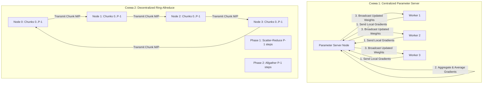

# Тема 3. Розподілені обчислювальні процеси та інтерфейс MPI. Модель передачі повідомлень (Message Passing), точкові та колективні комунікаційні операції, топології зв'язку AI-кластерів

## 1. Основний зміст та теоретичний базис

Сучасний прогрес у галузі штучного інтелекту, зокрема тренування генеративних великих мовних моделей (**Large Language Models, LLM**) та масивних згорткових нейромереж, спирається на використання розподілених обчислювальних систем. Оскільки розмірності параметрів сучасних моделей обчислюються сотнями мільярдів, вони не можуть бути розміщені в оперативній пам'яті одного апаратного прискорювача чи обчислювального вузла. Це зумовлює необхідність побудови обчислювальних кластерів, де сотні й тисячі графічних прискорювачів працюють як єдиний розподілений суперкомп'ютер.

На відміну від систем із загальною пам'яттю (**SMP/NUMA**), обчислювальні кластери будуються за архітектурою без спільного доступу до пам'яті (**No Remote Memory Access, NORMA**). Кожен вузол кластера функціонує в власному автономному адресному просторі, а взаємодія між окремими обчислювальними процесами здійснюється виключно шляхом явного обміну повідомленнями через високошвидкісні комунікаційні мережі (**InfiniBand**, **RoCE — RDMA over Converged Ethernet**, **NVLink / NVSwitch**).

Основою міжпроцесорної взаємодії у розподілених середовищах є специфікація **MPI (Message Passing Interface)** — індустріальний стандарт для розробки паралельних програм із розподіленою пам'яттю. У межах даного освітнього компонента здобувачі вищої освіти засвоюють концептуальні засади парадигми передачі повідомлень, реалізованої в MPI:

1. **Базові концепції та об'єкти середовища MPI.**
   * **Процес (Process)** — незалежна одиниця виконання, яка володіє власним адресованим простором пам'яті. У моделі **SPMP (Single Program Multiple Processes)** одна й та сама програма запускається одночасно на багатьох процесорах у вигляді множини автономних процесів.
   * **Комунікатор (Communicator)** — службовий об'єкт MPI, який об'єднує групу процесів та визначає контекст для здійснення комунікаційних операцій. Базовим комунікатором, що створюється автоматично під час ініціалізації середовища (`MPI_Init`), є `MPI_COMM_WORLD`, який охоплює абсолютно всі запущені процеси паралельної програми.
   * **Ранг процесу (Process Rank)** — унікальний цілочисельний ідентифікатор процесу всередині даного комунікатора, що приймає значення від $0$ до $P - 1$ (де $P$ — загальна кількість процесів у комунікаторі). Ранг використовується для адресації відправників і одержувачів повідомлень та для семантичного розгалуження обчислювальної логіки.
   * **Конверт повідомлення (Message Envelope)** — метадані, що однозначно ідентифікують повідомлення в мережі та включають ранг відправника (**Source**), ранг одержувача (**Destination**), числовий тег (**Tag**) для розрізнення типів повідомлень, комунікатор (**Communicator**), а також тип даних (**Datatype**) та кількість елементів (**Count**).

2. **Точкові (Point-to-Point) комунікаційні операції.** Точкові операції забезпечують передачу даних строго між двома процесами — відправником (**Source**) та одержувачем (**Destination**). Залежно від механізму синхронізації та управління буферами пам'яті, точкові операції поділяються на такі режими:
   * **Блокуюча передача (`MPI_Send` / `MPI_Recv`)** повертає управління програмі лише тоді, коли буфер пам'яті відправника можна безпечно повторно використовувати (тобто дані скопійовано у системний буфер або передано мережею). Процес-одержувач блокується на виклику `MPI_Recv` до повного прийому очікуваного повідомлення.
   * **Неблокуюча передача (`MPI_Isend` / `MPI_Irecv`)** ініціює операцію комунікації та негайно повертає управління, повертаючи дескриптор запиту (`MPI_Request`). Це дає змогу суміщати обчислення на CPU/GPU із фоновим пересиланням даних мережею. Перевірка завершення неблокуючої операції здійснюється викликами `MPI_Wait` (блокуюче очікування) або `MPI_Test` (перевірка прапорця готовності).
   * **Синхронна передача (`MPI_Ssend`)** завершується лише тоді, коли процес-одержувач ініціював відповідну операцію прийому `MPI_Recv` та розпочав копіювання даних.
   * **Буферизована передача (`MPI_Bsend`)** виконується шляхом примусового копіювання даних у попередньо виділений користувацький буфер пам'яті (`MPI_Buffer_attach`), що гарантує негайне повернення управління без очікування мережевих підтверджень.

   Некоректна організація послідовності викликів блокуючих точкових операцій (наприклад, коли два процеси одночасно викликають `MPI_Recv` в очікуванні один одного) призводить до виникнення безвихідних ситуацій (**Deadlocks**). Для безпечного двостороннього обміну в MPI застосовується комбінована функція `MPI_Sendrecv`.

3. **Колективні (Collective) комунікаційні операції.** Колективні операції вимагають одночасної та узгодженої участі абсолютно всіх процесів, що входять до складу вказаного комунікатора. Вони є принципово блокуючими відносно логічного стану даних та поділяються на три базові категорії:
   * **Розсилання та збір даних (Data Movement)** — `MPI_Bcast` (широкомовна розсилка одного повідомлення від кореня всім процесам), `MPI_Scatter` (розбиття вихідного масиву з кореневого процесу на рівні блоки та розподіл їх по одному блоку на кожен процес), `MPI_Gather` (збір однакових блоків з усіх процесів у єдиний впорядкований масив на кореневому процесі), `MPI_Allgather` (збір даних з усіх процесів із розміщенням підсумкового повного масиву на кожному процесі), `MPI_Alltoall` (персоналізований транспонований обмін, де кожен процес надсилає унікальний блок даних кожному іншому процесу).
   * **Колективна редукція (Global Reduction)** — `MPI_Reduce` (збір даних з усіх процесів із одночасним застосуванням поелементної математичної операції — суми `MPI_SUM`, максимуму `MPI_MAX`, добутку `MPI_PROD` — з фіксацією результату на кореневому процесі), `MPI_Allreduce` (виконання операції редукції з дублюванням підсумкового математичного результату на всіх процесах комунікатора).

   В інженерії штучного інтелекту операція **`MPI_Allreduce`** репрезентує фундаментальний обчислювальний механізм паралелізму за даними (**Data Parallelism**). Під час розподіленого тренування нейромереж кожен обчислювальний вузол розраховує градієнти вагових коефіцієнтів на власному локальному батчі, після чого викликом `MPI_Allreduce` здійснюється усереднення градієнтів між усіма вузлами кластера для збереження синхронності параметрів моделі.

4. **Топології зв'язку та інфраструктура AI-кластерів.** Ефективність виконання колективних операцій критично залежить від топології міжпроцесорного комунікаційного середовища. Фізична топологія описує схему з'єднання комутаторів (**Switches**) та обчислювальних вузлів кабелями, тоді як віртуальна (логічна) топологія в MPI перевизначає схему сусідства процесів у межах комунікатора (`MPI_Cart_create` для декартових сіток/торів, `MPI_Graph_create` для довільних графів).

   У сучасних AI-кластерах застосовуються такі типові мережеві топології:
   * **Повнозв'язаний граф / Switch-Fabric (NVLink/NVSwitch)** забезпечує прямий канал між усіма GPU всередині одного сервера з небувалою пропускною здатністю (до $900$ ГБ/с на GPU), мінімізуючи затримки.
   * **Fat-Tree (Потовщене дерево)** ієрархічна топологія на основі багатопортових комутаторів, у якій пропускна здатність між рівнями дерева зростає в напрямку до кореня. Це повністю усуває мережеве вузьке місце (**non-blocking bisection bandwidth**) при одночасних масових операціях `Allreduce`.
   * **Torus (2D/3D Тороїдальна сітка)** вузли з'єднані з найближчими сусідами у вигляді замкненої решітки; володіє низькою вартістю, але вимагає багатокрокової маршрутизації (**multi-hop routing**) для віддалених вузлів.

5. **MPI у сучасній екосистемі Python та PyTorch.**
   У мові Python високорівнева робота з MPI забезпечується бібліотекою `mpi4py`, яка надає об'єктно-орієнтований інтерфейс до стандартних C-функцій MPI з автоматичною серіалізацією об'єктів Python (через `pickle`) або прямою високошвидкісною передачею безперервних буферів пам'яті NumPy/PyTorch. У середовищі **PyTorch Distributed (`torch.distributed`)** MPI виступає одним із комунікаційних бекендів (поряд із **NCCL** від NVIDIA), забезпечуючи синхронізацію розподілених процесів навчання.

---

## 2. Математичний апарат, моделі та аналітичні залежності

### Моделі латентності та часу передачі повідомлень

#### Модель Хокні (Hockney Model)
Для аналітичного оцінювання часу точкової передачі повідомлення розміром $m$ байтів між двома вузлами кластера застосовується двопараметрична модель Хокні:

$$T_{\text{comm}}(m) = \alpha + \beta \cdot m$$

де $T_{\text{comm}}(m)$ — загальний час передачі повідомлення (секунди, $c$), $\alpha$ — латентність мережі або час початкової підготовки комунікації (startup time, $c$), $\beta$ — пиковий час передачі одного байта ($c / \text{байт}$), який є оберненою величиною до пропускної здатності каналу $B$ ($\beta = 1 / B$), $m$ — розмір повідомлення у байтах ($\text{Bytes}$).

#### Модель LogGP
Для більш точного врахування апаратних затримок, роботи мережевого процесора та некоалесцентних пауз застосовується розширена модель LogGP:

$$T_{\text{comm}}(m) = L + 2 \cdot o + (m - 1) \cdot g$$

де $L$ — фізична затримка сигналу в мережевому каналі (Latency, $c$), $o$ — накладні витрати CPU / мережевого адаптера на обробку пакета (Overhead, $c$), $g$ — часовий інтервал між послідовними байтами при передачі (Gap per byte, $c / \text{байт}$), $m$ — розмір повідомлення у байтах.

### Математичний аналіз та складність Кільцевого алгоритму Allreduce (Ring-Allreduce)

Для синхронізації градієнтів $M$ параметрів нейронної мережі між $P$ обчислювальними вузлами кластера пряма розсилка через центральний вузол створює мережеве пляшкове горло. Застосування Кільцевого алгоритму **Ring-Allreduce** дозволяє зробити час передачі даних майже незалежним від кількості вузлів $P$.

Розглянемо $P$ вузлів, об'єднаних у логічне кільце. Загальний обсяг градієнтних даних становить $M$ байтів.
Масив градієнтів розбивається на $P$ рівних блоків розміром $\frac{M}{P}$ байтів кожен.

Алгоритм складається з двох послідовних фаз:

1. **Фаза Scatter-Reduce (Збір-Редукція):**
   Виконується $(P - 1)$ послідовних кроків. На кожному кроці кожен вузол передає один свій блок розміром $\frac{M}{P}$ наступному сусідові по кільцю та одночасно приймає блок від попереднього сусіда, додаючи прийняті градієнти до свого поточного блоку.

   Час виконання фази Scatter-Reduce за моделлю Хокні становить:

   $$T_{\text{scatter-reduce}} = (P - 1) \cdot \left(\alpha + \beta \cdot \frac{M}{P}\right)$$

2. **Фаза Allgather (Загальний збір):**
   Після закінчення першої фази кожен вузол містить повністю підсумований підсумковий блок градієнтів розміром $\frac{M}{P}$. Для розповсюдження цих підсумкових блоків на всі інші вузли виконується ще $(P - 1)$ кроків передачі по кільцю без виконання математичних операцій.

   Час виконання фази Allgather становить:

   $$T_{\text{allgather}} = (P - 1) \cdot \left(\alpha + \beta \cdot \frac{M}{P}\right)$$

Сумарний час виконання операції **Ring-Allreduce** дорівнює сумі часу двох фаз:

$$T_{\text{RingAllreduce}}(M, P) = T_{\text{scatter-reduce}} + T_{\text{allgather}} = 2 \cdot (P - 1) \cdot \alpha + 2 \cdot \frac{P - 1}{P} \cdot M \cdot \beta$$

де $T_{\text{RingAllreduce}}$ — загальний час синхронізації градієнтів ($c$), $P$ — кількість обчислювальних вузлів у кільці, $\alpha$ — латентність мережі ($c$), $\beta$ — пикова питома затримка передачі байта ($c / \text{байт}$), $M$ — сумарний розмір градієнтів нейронної мережі у байтах.

Аналiтичний висновок:
При великих розмірах моделей ($M \gg 1$) коефіцієнт $\frac{P - 1}{P} \approx 1$. Отже, обсяг даних, який передає кожен вузол через мережевий канал, дорівнює $2 \cdot M \cdot \beta$, що **абсолютно не залежить від кількості процесорів $P$**. Зростання кількості вузлів додає лише незначний латентнісний доданок $2(P - 1)\alpha$, що робить Ring-Allreduce ідеальним алгоритмом для масштабування тренування глибоких нейромереж на тисячі GPU.

---

## 3. Систематизація даних та порівняльний аналіз

Для системного порівняння основних точкових та колективних комунікаційних операцій MPI нижче наведено порівняльну таблицю за обчислювальною та мережевою складністю, а також їх роллю в розподілених AI-системах.

| Назва операції MPI | Тип комунікації | Мережева складність за латентністю ($\alpha$) | Мережева складність за обсягом ($\beta \cdot M$) | Блокуюча / Неблокуюча аналогія | Основне застосування в розподіленому ШІ (Distributed AI) |
| :--- | :--- | :--- | :--- | :--- | :--- |
| **`MPI_Send` / `MPI_Recv`** | Точкова (Point-to-Point) | $\mathcal{O}(1)$ | $\mathcal{O}(M)$ | Блокуюча (Є неблокуючі `Isend`/`Irecv`) | Точковий пересил тензорів між двома суміжними вузлами пайплайну. |
| **`MPI_Bcast`** | Колективна (1-to-All) | $\mathcal{O}(\log P)$ (за деревом) | $\mathcal{O}(M \log P)$ | Блокуюча за станом даних | Ініціалізація початкових вагових коефіцієнтів моделей з Master-вузла. |
| **`MPI_Scatter`** | Колективна (1-to-All) | $\mathcal{O}(\log P)$ | $\mathcal{O}\left(M \cdot \frac{P-1}{P}\right)$ | Блокуюча за станом даних | Розподіл вихідного батчу даних (Dataset) з Master-вузла по Worker-вузлах. |
| **`MPI_Gather`** | Колективна (All-to-1) | $\mathcal{O}(\log P)$ | $\mathcal{O}\left(M \cdot \frac{P-1}{P}\right)$ | Блокуюча за станом даних | Збір локальних передбачень або метрик з усіх Worker-вузлів на Master. |
| **`MPI_Allreduce` (Ring)** | Колективна (All-to-All) | $\mathcal{O}(P)$ | $\mathcal{O}\left(M \cdot \frac{P-1}{P}\right)$ | Блокуюча (NCCL надає асинхронні еквиваленти) | Синхронізація градієнтів між вузлами в Data Parallel тренуванні (DDP). |
| **`MPI_Alltoall`** | Колективна (All-to-All) | $\mathcal{O}(P)$ | $\mathcal{O}(M \cdot (P - 1))$ | Блокуюча за станом даних | Перерозподіл тензорів у моделей з тензорним паралелізмом (Tensor Parallelism). |

Порівняльний аналіз показує, що вибір комунікаційної операції визначає схему паралелізму. Для традиційної схеми **Master-Worker** (або Parameter Server) операції типу `Scatter` та `Gather` створюють вузьке місце на центральному вузлі через залежність від пропускної здатності каналів Master-сервера. Натомість децентралізовані колективні операції, зокрема **`MPI_Allreduce`** на основі кільцевих топологій, забезпечують рівномірне завантаження мережевих адаптерів усіх вузлів, дозволяючи передавати великі масиви градієнтів $M$ за час, що практично не залежить від масштабу кластера.

---

## 4. Візуалізація процесів та структурних зв'язків

Для унаочнення відмінностей між застарілою централізованою схемою синхронізації градієнтів через Сервер Параметрів (**Parameter Server**) та сучасною децентралізованою схемою **Ring-Allreduce** нижче наведено порівняльну графічну діаграму.

*Рисунок 1 — Схема синхронізації градієнтів у розподіленому навчанні ШІ: парадигма Ring-Allreduce у порівнянні з Сервером Параметрів (Parameter Server)*

аНа Схемі 1 показано централізований підхід **Parameter Server**. Усі Worker-вузли одночасно надсилають свої локальні градієнти на єдиний сервер параметрів (крок 1). Це викликає мережеве перевантаження сумарним потоком даних $P \cdot M$ на мережевому адаптері сервера параметрів, створюючи критичне обчислювальне та комунікаційне вузьке місце.

На Схемі 2 показано децентралізований алгоритм **Ring-Allreduce**. Вузли з'єднані в логічне кільце. Під час виконання першої фази (Scatter-Reduce) та другої фази (Allgather) кожен вузол обмінюється даними строго зі своїм прямим сусідом по кільцю, передаючи лише малі блоки розміром $M/P$. Завдяки цьому жоден вузол не перевантажується мережевим трафіком, а загальна пропускна здатність кластера використовується на $100\%$, що забезпечує високу масштабованість для розподіленого тренування штучного інтелекту.

---

## 5. Питання для самоперевірки та аналітичного осмислення

1. Які фундаментальні обмеження архітектури без спільного доступу до пам'яті (NORMA) зумовили розробку специфікації MPI? У чому полягає відмінність моделі SPMP (Single Program Multiple Processes) від класичної однопотокової програми?
2. Проаналізуйте небезпеку виникнення станційного тупика (Deadlock) при використанні блокуючих точкових операцій `MPI_Send` та `MPI_Recv`. Яким чином функція `MPI_Sendrecv` або застосування неблокуючих викликів `MPI_Isend`/`MPI_Irecv` усувають цю проблему?
3. Використовуючи модель Хокні $T_{\text{comm}}(m) = \alpha + \beta \cdot m$, обчисліть час, необхідний для передачі тензора градієнтів обсягом $M = 500$ МБ через мережу InfiniBand з латентністю $\alpha = 1{,}5$ мкс та пропускною здатністю $B = 100$ Гбіт/с ($12{,}5$ ГБ/с).
4. Виведіть вираз для сумарного часу виконання операції `Ring-Allreduce` для $P$ вузлів та розміру градієнтів $M$. Чому при великих значеннях $M$ час виконання `Ring-Allreduce` практично не залежить від кількості вузлів $P$ у кластері?
5. У чому полягає відмінність між мережевими топологіями Fat-Tree та 3D-Torus для AI-кластерів? Чому топологія Fat-Tree вважається більш при придатною для гарантування безнапрямкової пропускної здатності (Non-blocking Bisection Bandwidth) під час масових колективних операцій `MPI_Allreduce`?