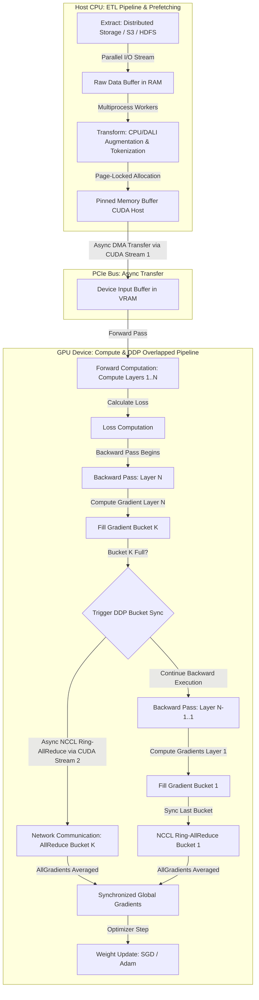

# Тема 4. Паралельна обробка великих масивів даних у розподілених пайплайнах. Конвеєризація обчислень, ETL-процеси для AI, Distributed Data Parallel підходи

## 1. Основний зміст та теоретичний базис

Ефективність функціонування сучасних інтелектуальних систем визначається не лише продуктивністю математичного ядра тензорного прискорювача, а й спроможністю всієї обчислювальної інфраструктури забезпечити безперервне підведення даних до обчислювальних ядер. У процесі навчання глибоких нейронних мереж великої розмірності виникає суттєвий системний дисбаланс, коли потужні графічні прискорювачі (**GPU**) або нейропроцесори (**NPU**) змушені простоювати у чеканні чергової порції даних через затримки читання з дисків, повільну декодифікацію форматів чи трансляцію через системну шину. Для усунення цього вузького місця в системній інженерії штучного інтелекту застосовується комплексний підхід, що поєднує паралельні конвеєризаційні обчислення, високопродуктивні **ETL-процеси** (Extract, Transform, Load) та паралелізм за даними на основі підходу **Distributed Data Parallel (DDP)**.

Центральною ідеєю конвеєризації обчислювальних процесів у задачх підготовки даних для штучного інтелекту є асинхронне суміщення у часі декількох послідовних стадій обробки. Замість послідовного виконання фаз завантаження масиву, його аугментації на центральному процесорі, передачі в оперативно-графічну пам'ять (**VRAM**) та прямого і зворотного проходів нейромережі, конвеєризація дає змогу виконувати ці етапи паралельно для різних міні-батчів. Для забезпечення максимальної пропускної здатності використовується сторінково-зафіксована оперативна пам'ять (**Pinned / Page-locked Memory**). Виділення такої пам'яті в системному ОЗП забороняє операційній системі вивантажувати її сторінки у файл підкачки на диску, що уможливлює використання апаратного прямого доступу до пам'яті (**Direct Memory Access, DMA**) через системну шину PCI Express без залучення ресурсів центрального процесора, суттєво прискорюючи трансляцію Host-to-Device (H2D).

Специфіка **ETL-процесів у галузі штучного інтелекту** полягає у високоінтенсивній трансформації неструктурованих мультимедійних або текстових масивів у прямому ефірі. Стадія **Extract** передбачає зчитування сирих даних із розподілених файлових систем (HDFS, Ceph) або об'єктних сховищ (Amazon S3) за допомогою спеціалізованих форматів, оптимізованих для послідовного читання великими блоками, таких як TFRecord або WebDataset. Стадія **Transform** охоплює декодування (наприклад, JPEG-декодування), деноізинг, нормалізацію, випадкові геометричні перетворення та аугментацію, які доцільно виносити на векторні розширення CPU чи спеціалізовані GPU-прискорювачі (наприклад, бібліотека NVIDIA DALI). Стадія **Load** здійснює асинхронне заповнення подвійних або потрійних тензорних буферів (**Double/Triple Buffering**) у VRAM з використанням окремих CUDA-потоків (CUDA Streams).

При переході від одного обчислювального вузла до розподіленого кластера постає завдання масштабування самого процесу навчання. У системній інженерії виділяють три базові парадигми розпаралелювання моделей штучного інтелекту:

* **Паралелізм за даними (Data Parallelism)** — кожна репліка обчислювального вузла містить повну копію вагових коефіцієнтів нейронної мережі, але опрацьовує свій унікальний підмасив (подбатч) загального набору даних, з наступною синхронізацією обчислених градієнтів.
* **Паралелізм за моделлю (Model / Tensor Parallelism)** — шари або окремі матриці ваг нейромережі розбиваються на частини та розподіляються між пам'яттю кількох прискорювачів, що необхідно у випадках, коли одна модель не вміщується в обсяг VRAM одного GPU.
* **Конвеєрний паралелізм (Pipeline Parallelism)** — послідовні шари глибокої мережі розбиваються на сегменти (стадії), розташовані на різних прискорювачах, а міні-батч розбивається на мікро-батчі, які послідовно проходять через ці стадії за принципом апаратного конвеєра.

Серед підходів паралелізму за даними у фреймворку PyTorch слід чітко розрізняти застарілий модуль `DataParallel` (DP) та сучасний модуль `DistributedDataParallel` (DDP). Модуль `DataParallel` реалізує однопроцесний багатопотоковий підхід у межах одного вузла, де один головний потік контролює всі GPU, збирає градієнти на одному прискорювачі та викликає проблеми блокування через інтерпретатор Python (Global Interpreter Lock, GIL), що створює серйозні системні затримки.

Натомість підхід **DistributedDataParallel (DDP)** створює окремий автономний процес для кожного прискорювача (GPU/NPU) як у межах одного вузла, так і в розподіленому кластері. Кожен процес має власний інтерпретатор Python, повністю позбавлений проблем GIL та виконує обчислення незалежно. Головною особливістю DDP є суміщення комунікації та обчислень під час зворотного проходу (**Backward Pass**). Для цього DDP групує градієнти вагових коефіцієнтів у спеціальні пам'ятні блоки — **бакети (Gradient Buckets)**. Як тільки під час зворотного проходу обчислюються градієнти для шарів, що входять до певного бакета, DDP негайно ініціює асинхронну мережеву операцію `Ring-AllReduce` для цього бакета через високошвидкісні бібліотеки комунікації (NCCL або Gloo), не чекаючи завершення обчислення градієнтів для всіх попередніх шарів мережі.

Для подолання обсягових обмежень VRAM при збереженні переваг DDP застосовуються технології оптимізації дублювання пам'яті, такі як **ZeRO (Zero Redundancy Optimizer)** та її стандартизована реалізація у PyTorch — **FSDP (Fully Sharded Data Parallel)**. Технологія ZeRO усуває надмірність пам'яті шляхом фрагментації (шардингу) трьох основних компонентів стану навчання між $P$ обчислювальними вузлами: станів оптимізатора (ZeRO-Stage 1), градієнтів (ZeRO-Stage 2) та самих параметрів моделі (ZeRO-Stage 3). Це дає змогу тренувати нейронні мережі з сотнями мільярдів параметрів на кластерах без необхідності складної ручної реорганізації коду моделі.

---

## 2. Математичний апарат, моделі та аналітичні залежності

### Аналітична модель обчислювального конвеєра ETL

Розглянемо математичну модель конвеєрної обробки даних у завантажувачі. Нехай загальний набір даних містить $N$ зразків, які об'єднуються у $N_b = \left\lceil \frac{N}{B} \right\rceil$ міні-батчів розміром $B$.

У випадку послідовного (неконвеєризованого) завантаження та навчання, загальний час виконання $T_{\text{seq}}$ обчислюється як сума часів виконання всіх етапів для кожного міні-батчу:

$$T_{\text{seq}} = \sum_{k=1}^{N_b} \left( T_{\text{extract}}^{(k)} + T_{\text{transform}}^{(k)} + T_{\text{h2d}}^{(k)} + T_{\text{compute}}^{(k)} \right)$$

де $T_{\text{extract}}$ — час зчитування батчу з диска або мережевого сховища ($c$), $T_{\text{transform}}$ — час ЦПУ-аугментації та трансформації ($c$), $T_{\text{h2d}}$ — час копіювання тензора з системного ОЗП у пам'ять VRAM через PCIe ($c$), $T_{\text{compute}}$ — час прямого та зворотного проходів на GPU ($c$).

За умови асинхронної $S$-стадійної конвеєризації з використанням сторінково-зафіксованої пам'яті та випереджального завантаження (**Prefetching**), час виконання обчислювального конвеєра $T_{\text{pipe}}$ обмежується найтривалішою (найповільнішою) стадією конвеєра (критичним шляхом):

$$T_{\text{pipe}} = \sum_{s=1}^{S-1} T_{\text{stage}, s} + N_b \cdot \max \left( T_{\text{extract}}, T_{\text{transform}}, T_{\text{h2d}}, T_{\text{compute}} \right) + T_{\text{drain}}$$

де $S = 4$ — кількість стадій конвеєра, $\sum T_{\text{stage}, s}$ — час заповнення конвеєра на першому кроці ($c$), $T_{\text{drain}}$ — час завершення останньої стадії ($c$).

При великих обсягах вибірки ($N_b \gg S$) прискорення конвеєра $S_{\text{pipe}}$ прямує до:

$$S_{\text{pipe}} = \frac{T_{\text{seq}}}{T_{\text{pipe}}} \approx \frac{T_{\text{extract}} + T_{\text{transform}} + T_{\text{h2d}} + T_{\text{compute}}}{\max \left( T_{\text{extract}}, T_{\text{transform}}, T_{\text{h2d}}, T_{\text{compute}} \right)}$$

Якщо обчислювальний процес є **Compute-Bound** (тобто $T_{\text{compute}} \ge \max(T_{\text{extract}}, T_{\text{transform}}, T_{\text{h2d}})$), то час на підготовку даних повністю приховується за обчисленнями на GPU, забезпечуючи максимальну стовідсоткову утилізацію прискорювача.

### Математична модель градієнтної агрегації у DDP

У концепції Distributed Data Parallel задіяна множина з $P$ процесів. Нехай $\theta \in \mathbb{R}^{|\Psi|}$ — вектор параметрів нейронної мережі розмірністю $|\Psi|$. Загальний набір даних розбивається на $P$ підмножин $\mathcal{B}_1, \mathcal{B}_2, \dots, \mathcal{B}_P$.

На ітерації $t$ кожен вузол $p \in \{1, \dots, P\}$ незалежно обчислює свій локальний вектор градієнтів $g_p^{(t)}(\theta)$ на локальному міні-батчі $\mathcal{B}_p$:

$$g_p^{(t)}(\theta) = \nabla_{\theta} \mathcal{L} \left( \theta^{(t)}; \mathcal{B}_p \right)$$

де $\mathcal{L}$ — цільова функція втрат (Loss function), $\theta^{(t)}$ — поточні вагові коефіцієнти.

Для оновлення параметрів модель вимагає обчислення усредненого глобального градієнта $\bar{g}^{(t)}(\theta)$ за допомогою колективної операції `AllReduce`:

$$\bar{g}^{(t)}(\theta) = \frac{1}{P} \sum_{p=1}^{P} g_p^{(t)}(\theta)$$

Оновлення вагових коефіцієнтів за допомогою стохастичного градієнтного спуску з моментом (SGD with Momentum) виконується синхронно на всіх вузлах:

$$v^{(t+1)} = \gamma \cdot v^{(t)} + \eta \cdot \bar{g}^{(t)}(\theta)$$

$$\theta^{(t+1)} = \theta^{(t)} - v^{(t+1)}$$

де $v^{(t)}$ — вектор швидкості (Momentum, $\mathbb{R}^{|\Psi|}$), $\gamma$ — коефіцієнт утримання моменту ($0 \le \gamma < 1$), $\eta$ — швидкість навчання (Learning rate, $\eta > 0$).

### Математичні засади розподілу пам'яті за технологією ZeRO / FSDP

Під час тренування глибокої мережі в режимі змішаної точності FP16/FP32 з використанням оптимізатора Adam статика обсягу пам'яті на кожен параметр $\Psi$ розподіляється наступним чином:

* Власне параметри моделі у форматі FP16: $2 \cdot |\Psi|$ байтів.
* Градієнти параметрів у форматі FP16: $2 \cdot |\Psi|$ байтів.
* Стан оптимізатора Adam у форматі FP32 (дубльовані FP32-ваги $4 \cdot |\Psi|$, перший момент Momentum $4 \cdot |\Psi|$, другий момент Variance $4 \cdot |\Psi|$): $12 \cdot |\Psi|$ байтів.

Отже, сумарна статична пам'ять $M_{\text{static}}$ на один вузол без використання ZeRO становить:

$$M_{\text{static}} = 2|\Psi| + 2|\Psi| + 12|\Psi| = 16|\Psi| \quad [\text{Байтів}]$$

Етапи розподілу пам'яті за концепцією ZeRO / FSDP на $P$ процесорах визначаються такими виразами:

* **ZeRO-Stage 1 (Фрагментація станів оптимізатора):**
  
$$M_{\text{ZeRO-1}} = 2|\Psi| + 2|\Psi| + \frac{12|\Psi|}{P} = 4|\Psi| + \frac{12|\Psi|}{P} \quad [\text{Байтів}]$$

* **ZeRO-Stage 2 (Фрагментація станів оптимізатора та градієнтів):**
  
$$M_{\text{ZeRO-2}} = 2|\Psi| + \frac{2|\Psi|}{P} + \frac{12|\Psi|}{P} = 2|\Psi| + \frac{14|\Psi|}{P} \quad [\text{Байтів}]$$

* **ZeRO-Stage 3 / Full FSDP (Повна фрагментація параметрів, градієнтів та оптимізатора):**
  
$$M_{\text{ZeRO-3}} = \frac{2|\Psi| + 2|\Psi| + 12|\Psi|}{P} = \frac{16|\Psi|}{P} \quad [\text{Байтів}]$$

За умови використання ZeRO-Stage 3 обсяг необхідної оперативної пам'яті на один GPU зменшується лінійно пропорційно кількості прискорювачів у кластері $P$, що дозволяє навчати модель розмірністю $|\Psi| = 100$ мільярдів параметрів на стандартних графічних прискорювачах.

---

## 3. Систематизація даних та порівняльний аналіз

Нижче наведено порівняльний аналіз архітектурних підходів до паралельної обробки даних та моделей розпаралелювання під час тренування штучного інтелекту.

| Параметр порівняння | PyTorch DataParallel (DP) | PyTorch DistributedDataParallel (DDP) | Fully Sharded Data Parallel (FSDP / ZeRO-3) | Pipeline Parallelism (GPipe / Megatron) |
| :--- | :--- | :--- | :--- | :--- |
| **Архітектурний тип** | Однопроцесний багатопотоковий | Багатопроцесний (Multi-Process) | Багатопроцесний із шардингом станів | Конвеєрне сегментування шарів |
| **Масштабованість за вузлами** | Обмежено 1 вузлом (Single-Node) | Мульти-вузлова (Multi-Node Кластери) | Масштабна мульти-вузлова (Тисячі GPU) | Мульти-вузлова для надвеликих моделей |
| **Міжпроцесна комунікація** | Потоки Python (обмеження GIL) | Окремі процеси Python, NCCL / Gloo | NCCL (All-Gather та Reduce-Scatter) | Точкові виклики (Peer-to-Peer NCCL) |
| **Синхронізація градієнтів** | Збір на 1 GPU, редукція та Broadcast | Кільцевий `Ring-AllReduce` через бакети | Асинхронна збір-редукція шардованих блоків | Передача активацій та градієнтів між стадіями |
| **Ефективність VRAM** | Низька (дублювання вагових коефіцієнтів та оптимізатора) | Середня (дублювання $16\Psi$ байтів на кожен GPU) | Максимальна (скорочення пам'яті у $P$ разів) | Висока (зберігаються лише шари даного сегмента) |
| **Суміщення обчислень і комунікації** | Відсутнє (послідовне заблоковане виконання) | Високе (Overlap AllReduce з Backward Pass) | Високе (Prefetch ваг перед Forward) | Залежить від кількості мікро-батчів |
| **Основне застосування в AI** | Прототипування на 1 сервері з кількома GPU | Тренування моделей середнього розміру (до ~10B) | Тренування надвеликих моделей (LLM >10B-100B+) | Навчання глибоких мереж з тисячами шарів |

Порівняльний аналіз демонструє еволюцію інженерних рішень. Стандартний модуль `DataParallel` є застарілим та неефективним через проблеми з GIL та монополізацією одного GPU як центру збору трафіку. Для переважної більшості задач комп'ютерного зору та обробки сигналів золотим стандартом є **DistributedDataParallel (DDP)**, який забезпечує асинхронне приховування комунікаційних затримок `Ring-AllReduce` за обчисленнями зворотного проходу. 

Проте для фундаментальних моделей великих мовних архітектур (LLM) класичний DDP стає непридатним через брак VRAM для зберігання дубльованих станів оптимізатора Adam. У таких сценаріях застосовується **FSDP (ZeRO-3)** або комбінація **FSDP + Pipeline Parallelism**, де максимальна ефективність використання пам'яті досягається ціною додаткових мережевих викликів `All-Gather` для тимчасової збірки ваг шару безпосередньо перед його прямим або зворотним проходом.

---

## 4. Візуалізація процесів та структурних зв'язків

На наведеній нижче діаграмі представлено скрізну схему функціонування високопродуктивного розподіленого пайплайну: від асинхронного завантаження та ETL-трансформації даних на CPU до обчислень на GPU та перекритої синхронізації градієнтів за допомогою DDP.

*Рисунок 1 — Структурна схема асинхронного розподіленого конвеєра обробки даних та синхронізації градієнтів у концепції Distributed Data Parallel (DDP)*

Діаграма ілюструє повний цикл роботи розподіленого обчислювального конвеєра. У лівій частині (Host CPU) реалізовано асинхронний **ETL-пайплайн**: баготопотокові процеси зчитують сирі дані із зовнішнього сховища (`A`), зберігають їх у буфері ОЗП (`B`) та здійснюють векторизовану аугментацію й нормалізацію (`C`). Отримані тензори розміщуються у сторінково-зафіксованій пам'яті Pinned Memory (`D`). 

Завдяки цьому передача даних у графічну пам'ять VRAM (`E`) здійснюється асинхронно через апаратний режим DMA за допомогою окремого потоку `CUDA Stream 1` без зупинки ядра GPU.

У правій частині (GPU Device) показано внутрішній механізм **DDP (Distributed Data Parallel)**. Після прямого проходу (`F`) та розрахунку функції втрат (`G`) розпочинається зворотний прохід (`H`). Під час обчислення градієнтів від останніх шарів до перших, градієнти упаковуються у градієнтні бакети (`I`). Як тільки бакет заповнюється (`J`), DDP асинхронно запускає мережеву операцію `Ring-AllReduce` у паралельному потоці `CUDA Stream 2` (`K`). 

У цей самий час обчислювальні ядра GPU продовжують виконувати зворотний прохід для попередніх шарів мережі (`L`). Таким чином, комунікаційні затримки мережі повністю приховуються за математичними обчисленнями GPU, що забезпечує лінійну масштабованість розподіленого тренування нейронних мереж.

---

## 5. Питання для самоперевірки та аналітичного осмислення

1.   Які системні проблеми виникають при використанні звичайної оперативної пам'яті (Pageable Memory) під час передачі великих тензорів із хоста на GPU через шину PCIe? Поясніть механізм роботи сторінково-зафіксованої пам'яті (Pinned Memory) та її роль у забезпеченні апаратної передачі через DMA.
2.   Проаналізуйте функціонування конвеєра підготовки даних у PyTorch за допомогою аргументів `num_workers`, `pin_memory` та `prefetch_factor` класу `DataLoader`. Як недоліки налаштування цих параметрів можуть призвести до простоювання GPU в режимі очікування даних (Memory/IO Bound)?
3.   У чому полягають фундаментальні архітектурні та системні відмінності між модулями `torch.nn.DataParallel` та `torch.nn.parallel.DistributedDataParallel` у PyTorch? Чому наявність Global Interpreter Lock (GIL) у Python унеможливлює високу ефективність модуля `DataParallel` на багатопроцесорних вузлах?
4.   Опишіть математичний та системний механізм суміщення обчислень і комунікацій (Overlapping) у підході DDP. Що таке градієнтні бакети (Gradient Buckets), як вибирається їхній оптимальний розмір, і чому зворотний прохід (Backward Pass) виконується у зворотному порядку відносно прямого проходу?
5.   Порівняйте етапи оптимізації пам'яті ZeRO-1, ZeRO-2 та ZeRO-3 (Fully Sharded Data Parallel). Обчисліть статичний обсяг пам'яті VRAM, необхідний для збереження стану навчання моделі з розмірністю $10$ мільярдів параметрів при використанні оптимізатора Adam в режимі FP16 без використання ZeRO та при використанні ZeRO-3 на кластері з $P = 16$ GPU.
