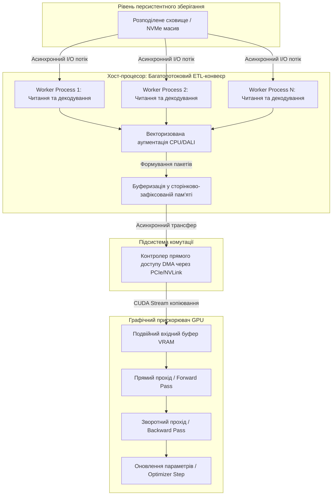
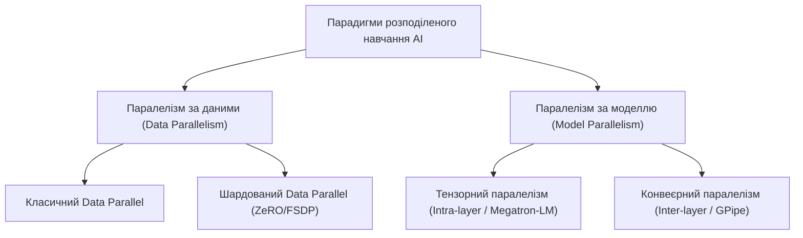
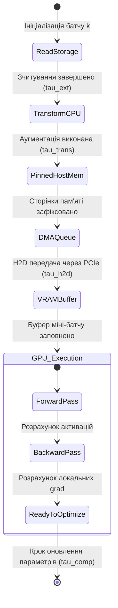
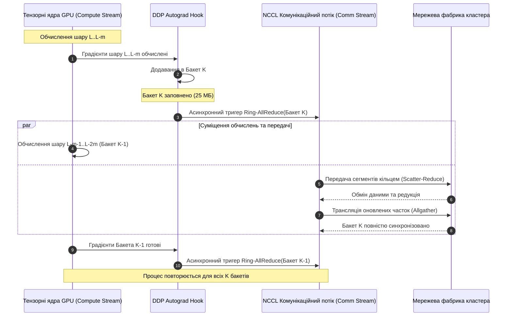
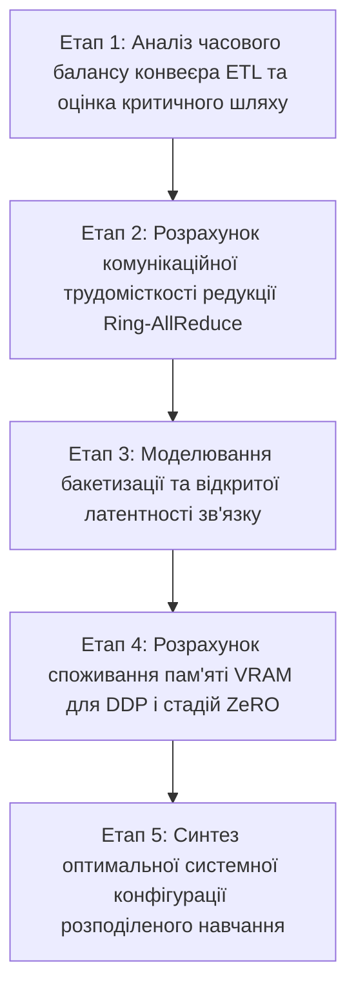

# Тема 4. Паралельна обробка великих масивів даних у розподілених пайплайнах. Конвеєризація обчислень, ETL-процеси для AI, Distributed Data Parallel підходи

## Мета лекції

Метою лекції є формування у здобувачів вищої освіти системних теоретичних знань і прикладних інженерних компетентностей щодо проектування високопродуктивних розподілених конвеєрів обробки даних та оптимізації процесів паралельного тренування великомасштабних моделей штучного інтелекту. У ході заняття розглядаються апаратні та програмні механізми усунення вузьких місць введення-виведення за рахунок асинхронної конвеєризації етапів вилучення, трансформації та завантаження даних, використання сторінково-зафіксованої пам'яті й прямого доступу DMA. Особлива увага приділяється формальному математичному моделюванню розподілених обчислень, порівняльному аналізу парадигм паралелізму за даними (зокрема модулів DataParallel і DistributedDataParallel), дослідженню алгоритмів просторово-часового суміщення комунікацій і математичних розрахунків, а також технологіям шардингу стану моделі сімейства Zero Redundancy Optimizer.

## Очікувані результати навчання

1. **Знання та розуміння.** Здобувачі вищої освіти повинні засвоїти фундаментальні принципи функціонування розподілених конвеєрів обробки інформації, архітектурні відмінності між однопроцесними та багатопроцесними підходами до паралелізму за даними, механізми усунення впливу глобального блокування інтерпретатора Python, а також фізичну сутність роботи апаратно-фіксованої пам'яті Pinned Memory та алгоритмів кільцевої редукції Ring-AllReduce.

2. **Застосування.** Студенти повинні набути навичок аналітичного розрахунку параметрів асинхронних конвеєрів підготовки даних, конфігурування завантажувачів тензорів для ліквідації станів простою обчислювальних ядер, а також розробки програмно-алгоритмічних схем розподіленого масштабування штучного інтелекту з використанням градієнтної бакетизації та паралельних комунікаційних потоків.

3. **Аналіз.** Здобувачі мають навчитися диференціювати затримки обчислювального процесу на складові дискового введення-виведення, шинної передачі Host-to-Device та міжвузлового мережевого обміну, аналізувати критичні шляхи виконання конвеєрів для визначення умов досягнення режиму Compute-Bound, а також досліджувати вплив топології комунікаційної мережі на масштабованість розподілених систем.

4. **Оцінювання та синтез.** Студенти повинні вміти критично оцінювати компроміси між обчислювальною потужністю та комунікаційними накладними витратами кластера, обирати оптимальну стратегію розподілу пам'яті між підходами DDP, Pipeline Parallelism та етапами шардингу ZeRO-1/2/3 або Fully Sharded Data Parallel для ефективного навчання моделей надвисокої розмірності за наявних апаратних обмежень.

---

## Детальний покроковий план лекції

### 1. Теоретичний модуль. Архітектурні принципи розподілених пайплайнів та паралелізму даних у штучному інтелекті

* 1.1. Системний дисбаланс дискових операцій і тензорних обчислювачів: архітектурна концепція конвеєризації та стадії спеціалізованих ETL-процесів для моделей штучного інтелекту.
* 1.2. Апаратні механізми прямого доступу до пам'яті DMA: організація сторінково-зафіксованої пам'яті (Pinned Memory) та асинхронне копіювання через інтерфейс PCI Express за допомогою незалежних апаратних черг і потоків.
* 1.3. Класифікація парадигм розподіленого тренування нейронних мереж: порівняння паралелізму за даними, тензорного паралелізму та конвеєрного паралелізму; системні обмеження моделі DataParallel, пов'язані з конкуренцією за пам'ять та блокуванням GIL.
* 1.4. Архітектура DistributedDataParallel (DDP): багатопроцесна ізоляція контекстів, розбиття градієнтного простору на бакети (Bucketing) та організація асинхронного перекриття комунікацій обчисленнями зворотного проходу.

### 2. Аналітичний модуль. Математичні моделі конвеєризації, колективних комунікацій та оптимізації ресурсів пам'яті

* 2.1. Формалізація багаторівневого обчислювального конвеєра: виведення співвідношень для загального часу виконання, аналіз критичного шляху та критерії переходу в режим обмеження обчисленнями (Compute-Bound).
* 2.2. Математична модель стохастичної оптимізації в середовищі DDP: формальний опис локального розрахунку градієнтів, колективного усереднення та синхронного кроку оптимізатора.
* 2.3. Комунікаційна складність та аналітична оцінка часових затримок колективної операції Ring-AllReduce за моделями Гокні та LogP залежно від розміру градієнтного бакета й топології мережі.
* 2.4. Математичне моделювання споживання пам'яті VRAM у режимі змішаної точності FP16/FP32: аналітичні формули фрагментації станів оптимізатора, градієнтів і параметрів моделі за технологією ZeRO (етапи 1, 2, 3) та FSDP.

### 3. Практично-розрахунковий кейс. Комплексний інженерний розрахунок параметрів розподіленого навчання

**Тема наскрізної задачі.** «Аналітичний розрахунок часового балансу конвеєра даних, комунікаційної трудомісткості операцій AllReduce та оптимізація розподілу відеопам'яті за технологією ZeRO-3 для навчання нейромережі на 10 мільярдів параметрів у 16-вузловому кластері».

## 1. Фундаментальний теоретичний базис та концептуальні засади

### 1.1. Системний дисбаланс дискових операцій і тензорних обчислювачів: архітектурна концепція конвеєризації та ETL-процеси для AI

Еволюція високопродуктивних обчислювальних систем у сфері штучного інтелекту характеризується експоненційним зростанням пікової швидкодії апаратних прискорювачів — графічних процесорів (**Graphics Processing Unit, GPU**) та нейропроцесорів (**Neural Processing Unit, NPU**). Архітектури сучасних обчислювальних ядер, таких як тензорні ядра (**Tensor Cores**) або систолічні матричні процесори, оптимізовані для виконання операцій узагальненого матричного множення (**General Matrix Multiply, GEMM**) у форматах низької та змішаної точності (FP16, BF16, FP8, INT8). Проте практична продуктивність розподілених систем глибокого навчання детермінується не лише піковим флопсом обчислювальних модулів, а й загальною пропускною здатністю підсистеми введення-виведення (**I/O Subsystem**), що здійснює доставку вхідних даних від накопичувачів до обчислювальних блоків.

У процесі тренування моделей глибокого навчання на масштабних наборах даних виникає критичний системний дисбаланс, відомий як **голодування обчислювача (Compute Starvation)**. Цей стан настає тоді, коли апаратні тензорні ядра переходять у режим простою (**GPU Idle**) внаслідок відсутності готових до обробки тензорів у локальній графічній пам'яті (**Video Random Access Memory, VRAM**). Подібна ситуація переводить обчислювальний процес із бажаного стану обмеження обчисленнями (**Compute-Bound**) у вкрай неефективний стан обмеження введенням-виведенням (**I/O-Bound**) або пам'яттю (**Memory-Bound**).

Для нейтралізації описаного дисбалансу цикл підготовки даних структурується у вигляді спеціалізованого конвеєра **ETL (Extract, Transform, Load)**, оптимізованого під задачі машинного навчання:

1. **Фаза Extract (Вилучення).** Передбачає асинхронне читання неструктурованих даних (зображень, фрагментів аудіо, нестиснених бінарних послідовностей, токенізованого тексту) із локальних накопичувачів NVMe SSD або розподілених об'єктних і файлових сховищ (Ceph, Lustre, NFS, Amazon S3). Головною проблемою цього етапу є накладні витрати операційної системи на операції позиціонування та системні виклики файлового дескриптора при читанні мільйонів дрібних файлів, що вимагає переходу до монолітних контейнерних форматів (TFRecord, WebDataset, HDF5).
2. **Фаза Transform (Трансформація).** Охоплює централізовану або розподілену декомпресію сирих даних (наприклад, десеріалізація та декодування JPEG/PNG), числову нормалізацію, приведення до цільових просторових розмірів, векторну токенізацію, а також стохастичну аугментацію даних (випадкові зсуви, обертання, колірні збурення, маскування токенів). Оскільки ці операції історично виконуються центральним процесором (**CPU**) з використанням векторних розширень (AVX-512, NEON), висока дисперсія часу трансформації кожного окремого зразка створює часовий джиттер, що блокує формування пакетів даних.
3. **Фаза Load (Завантаження).** Здійснює безпосередню серіалізацію трансформованих об'єктів у багатовимірні тензори заданого розміру батчу $B$, їх упакування у нерозривні блоки системної оперативної пам'яті та подальшу трансляцію через системну шину PCI Express у глобальну пам'ять VRAM прискорювача.

Формально умова безперервного завантаження обчислювального вузла виражається через баланс швидкості генерації даних конвеєром підготовки та швидкості їх утилізації тензорним прискорювачем. Нехай $B$ позначає розмір міні-батчу (кількість зразків у пакеті), а $S_{\text{sample}}$ — середній інформаційний розмір одного зразка після трансформації (вимірюється у байтах, $\text{Б}$). Тоді швидкість надходження інформації $\Phi_{\text{ingest}}$ (байт за секунду, $\text{Б/с}$) визначається співвідношенням:

$$\Phi_{\text{ingest}} = \frac{B \cdot S_{\text{sample}}}{T_{\text{extract}} + T_{\text{transform}} + T_{\text{load}}}$$

де $T_{\text{extract}}$ позначає фізичний час зчитування $B$ зразків із накопичувача (вимірюється у секундах, $\text{с}$); $T_{\text{transform}}$ позначає сумарний процесорний час виконання декодування та аугментації для $B$ зразків ($\text{с}$); $T_{\text{load}}$ позначає часову затримку безпосередньої передачі сформованого тензора батчу в пам'ять VRAM через системну шину ($\text{с}$).

Своєю чергою, пропускна здатність етапу обчислень $\Phi_{\text{compute}}$ ($\text{Б/с}$) визначається тривалістю виконання прямого (**Forward Pass**) та зворотного (**Backward Pass**) проходів нейронної мережі:

$$\Phi_{\text{compute}} = \frac{B \cdot S_{\text{sample}}}{T_{\text{compute}}}$$

де $T_{\text{compute}}$ позначає фізичний час виконання обчислень на GPU для даного батчу ($\text{с}$).

Для запобігання деградації продуктивності системи та виникнення простоїв обчислювальних ядер необхідно забезпечити виконання фундаментальної нерівності пропускної здатності конвеєра:

$$\Phi_{\text{ingest}} \ge \Phi_{\text{compute}} \iff T_{\text{compute}} \ge T_{\text{extract}} + T_{\text{transform}} + T_{\text{load}}$$

У разі послідовного синхронного виконання всіх операцій дана умова практично ніколи не виконується для складних моделей даних, що зумовлює необхідність використання концепції **асинхронного конвеєра обчислень**. Конвеєризація передбачає просторово-часове рознесення фаз: доки GPU обчислює крок навчання для батчу з індексом $k$, ресурси CPU виконують трансформацію батчу $k+1$, підсистема введення-виведення вилучає з накопичувача батч $k+2$, а незалежні канали шини передають попередньо підготовлений батч в пам'ять графічного адаптера.

### 1.2. Апаратні механізми прямого доступу до пам'яті DMA: організація Pinned Memory та асинхронні черги

Фізична трансляція даних між системною пам'яттю хоста (**Host RAM**) та локальною пам'яттю прискорювача (**Device VRAM**) є суттєвим латентним фактором. За замовчуванням операційна система виділяє віртуальну пам'ять у режимі сторінкової організації зі змінним розміщенням (**Pageable Memory**). Фізичні сторінки такої пам'яті можуть бути в будь-який момент переміщені підсистемою керування пам'яттю ядра операційної системи, скинуті на системний накопичувач у swap-простір або дефрагментовані. 

Через це контролер прискорювача GPU не може безпосередньо взаємодіяти з адресами сторінкової пам'яті, оскільки фізична адреса масиву під час трансляції може раптово змінитись. У разі запиту на передачу стандартного буфера драйвер GPU змушений спочатку виділити внутрішній службовий буфер у фізично заблокованій пам'яті, виконати синхронне процесорне копіювання даних із користувацького простору в службовий, і лише після цього ініціювати трансляцію шиною. Це призводить до подвійного копіювання даних та непродуктивних втрат циклів CPU.

Для вирішення цієї проблеми застосовується **сторінково-зафіксована пам'ять (Pinned / Page-locked Memory)**. Програмний виклик (наприклад, `cudaHostAlloc` або параметр `pin_memory=True` у високорівневих завантажувачах) інструктує диспетчер віртуальної пам'яті ядра операційної системи про фіксацію відповідного діапазону віртуальних адрес за конкретними фізичними сторінками оперативної пам'яті із прямою забороною їх вивантаження у файл підкачки на весь час існування дескриптора.

Фіксація сторінок уможливлює використання апаратного контролера **прямого доступу до пам'яті (Direct Memory Access, DMA)**. Контролер DMA інтегрований у периферійний пристрій або кореневий комплекс шини **PCI Express (PCIe Root Complex)**. Отримавши фізичний дескриптор сторінок, контролер DMA бере на себе повне керування транзакціями передачі блоків даних через шину PCIe, вивільняючи центральний процесор для паралельного виконання завдань трансформації наступних порцій даних.

Час безпосередньої апаратної передачі тензора через шину PCIe за допомогою DMA описується лінійною залежністю:

$$T_{\text{DMA}} = \alpha_{\text{PCIe}} + \frac{M_{\text{tensor}}}{\beta_{\text{PCIe}}}$$

де $\alpha_{\text{PCIe}}$ позначає латентність ініціалізації транзакції контролером DMA (вимірюється у секундах, $\text{с}$); $M_{\text{tensor}}$ позначає фізичний обсяг переданого тензора (байти, $\text{Б}$); $\beta_{\text{PCIe}}$ позначає реальну пропускну здатність шини інтерфейсу PCIe обраного покоління та конфігурації смуг (байт за секунду, $\text{Б/с}$).

На апаратному рівні сучасні прискорювачі мають окремі фізичні рушії копіювання (**Copy Engines / DMA Engines**) та обчислювальні рушії (**Compute Engines**), здатні функціонувати одночасно та незалежно. Програмна координація цих ресурсів реалізується через механізм незалежних апаратних черг команд — **CUDA-потоків (CUDA Streams)**. Запуск операції передачі пам'яті у неблокуючому асинхронному режимі (`cudaMemcpyAsync`) в окремому комунікаційному потоці дозволяє повністю сховати час $T_{\text{DMA}}$ за часом виконання обчислювальних ядер у паралельному обчислювальному потоці.

Для безперебійного живлення цього механізму застосовується системна технологія **подвійної або потрійної буферизації (Double/Triple Buffering)**. У графічній пам'яті виділяються два циклічні буфери: доки перший буфер $\text{Buf}_A$ бере участь у розрахунках прямого проходу ядра, у другий буфер $\text{Buf}_B$ контролер DMA здійснює фонове завантаження наступного міні-батчу. На наступному кроці ітерації вказівники на буфери атомарно міняються місцями без виклику блокуючих бар'єрів синхронізації.

```mermaid
gantt
    dateFormat X
    axisFormat %s
    title Часова діаграма конвеєра обробки даних (Подвійна буферизація та DMA)

    section CPU Workers
    Генерація Батчу 1 (Extract+Transform) :active, c1, 0, 10
    Генерація Батчу 2 (Extract+Transform) :active, c2, 10, 20
    Генерація Батчу 3 (Extract+Transform) :active, c3, 20, 30
    Генерація Батчу 4 (Extract+Transform) :active, c4, 30, 40

    section DMA Transfer (PCIe)
    Трансфер Батчу 1 (H2D)                :crit, d1, 10, 14
    Трансфер Батчу 2 (H2D)                :crit, d2, 20, 24
    Трансфер Батчу 3 (H2D)                :crit, d3, 30, 34

    section GPU Compute Engine
    Обчислення Батчу 1 (Forward+Backward) :done, g1, 14, 25
    Обчислення Батчу 2 (Forward+Backward) :done, g2, 25, 36
    Обчислення Батчу 3 (Forward+Backward) :done, g3, 36, 47
```

### 1.3. Класифікація парадигм розподіленого тренування нейронних мереж та системні обмеження DataParallel

Зі збільшенням обсягів навчальних вибірок та переходом до моделей архітектури трансформерів із мільярдами параметрів обчислювальні вимоги перевищують ресурсні ліміти будь-якого автономного сервера. Це обумовлює необхідність декомпозиції обчислювального процесу між багатьма вузлами кластера. 

У системній архітектурі штучного інтелекту виокремлюють три фундаментальні парадигми розподіленого навчання:

1. **Паралелізм за даними (Data Parallelism).** Модель повністю реплікується на кожному доступному обчислювальному вузлі (або прискорювачі). Кожна репліка одночасно обробляє неперетинну частину загального міні-батчу (так званий локальний підбатч). Для забезпечення математичної еквівалентності класичному навчанню локальні градієнти моделі усереднюються за всіма вузлами перед виконанням коригувального кроку оптимізатора.
2. **Паралелізм за моделлю / Тензорний паралелізм (Model / Tensor Parallelism).** Застосовується у випадках, коли параметри окремого шару нейромережі або внутрішні матриці ваг (наприклад, проекції механізму Self-Attention) перевищують фізичний обсяг VRAM одного прискорювача. У цьому випадку окремі вагові матриці розщеплюються за рядками чи стовпчиками між різними GPU, що потребує частих колективних обмінів проміжними активаціями безпосередньо всередині кожного шару мережі.
3. **Конвеєрний паралелізм (Pipeline Parallelism).** Передбачає розбиття послідовності шарів нейронної мережі на окремі вертикальні функціональні сегменти (стадії), кожен із яких закріплюється за окремим фізичним вузлом. Міні-батч розбивається на послідовність дрібніших мікро-батчів, які просуваються конвеєром прискорювачів крок за кроком, мінімізуючи простої устаткування (бульбашки конвеєра, **Pipeline Bubbles**).

Історично першим підходом до паралелізму за даними у фреймворку PyTorch була реалізація модуля `torch.nn.DataParallel` (**DP**). Проте архітектура DP володіє критичними системними вадами, через які вона вважається застарілою і непридатною для високопродуктивних середовищ:

* **Однопроцесна багатопотокова модель.** Модуль DP функціонує в межах одного процесу операційної системи, породжуючи окремі потоки виконання для кожного GPU. Через наявність у стандартному інтерпретаторі CPython механізму **Global Interpreter Lock (GIL)**, лише один потік може виконувати байткод у будь-який момент часу. Це викликає жорстку системну конкуренцію потоків, знецінюючи багатоядерну структуру хоста та створюючи серйозні затримки при диспетчеризації команд у графічні драйвери.
* **Асиметричне навантаження майстер-вузла (Master GPU Bottleneck).** У схемі DP один із прискорювачів призначається головним (**Master Device**). Цей прискорювач змушений самостійно приймати весь початковий міні-батч, нарізати його на підбатчі, здійснювати явне копіювання фрагментів на решту GPU через шину PCIe, а на зворотному проході — приймати всі локальні градієнти, виконувати операцію централізованої редукції, модифікувати глобальні ваги моделі та повторно розсилати оновлені ваги (**Broadcast**) всім іншим пристроям. 
* **Нерівномірне споживання пам'яті.** Через необхідність акумуляції градієнтів та активацій від усіх інших прискорювачів майстер-GPU використовує значно більший обсяг VRAM, ніж інші пристрої. Оскільки граничний розмір батчу обмежений пристроєм із найменшим доступним залишком пам'яті, значна частина ресурсів інших GPU залишається недовантаженою.
* **Неможливість міжвузлового масштабування.** Структура `DataParallel` фундаментально прив'язана до адресного простору одного вузла і не підтримує кластерні мережеві комунікації через стандартизовані мережеві інтерфейси InfiniBand або RoCE.

### 1.4. Архітектура DistributedDataParallel: багатопроцесна ізоляція, бакетизація та перекриття комунікацій

Сучасним стандартом масштабування паралелізму за даними є підхід **DistributedDataParallel (DDP)**. Архітектура DDP базується на парадигмі **SPMP (Single Program Multiple Processes)**: на кожному доступному графічному прискорювачі запускається окремий, повністю ізольований процес операційної системи, який володіє власним локальним інтерпретатором Python та виділеним адресним простором.

Такий підхід фундаментально усуває вплив Global Interpreter Lock, оскільки кожен процес взаємодіє зі своїм прискорювачем паралельно та без блокувань з боку сусідніх процесів. Кожен процес містить ідентичну копію параметрів нейромережі та локальний оптимізатор. Для підтримки повної математичної синхронності ваг у часі процеси повинні гарантувати абсолютно однаковий початковий стан ваг $\theta^{(0)}$ та ідентичність градієнтів після виконання зворотного проходу.

Для масштабованого обміну градієнтами DDP використовує операцію кільцевої редукції **Ring-AllReduce**, реалізовану на базі високооптимізованих комунікаційних бібліотек (наприклад, NVIDIA Collective Communications Library, **NCCL**). Проте наївна реалізація, за якої для градієнта кожного тензора параметрів ініціюється окремий мережевий виклик, є неефективною: для сучасних мереж із сотнями або тисячами шарів час ініціалізації та латентність мережевих інтерфейсів призводять до катастрофічного простою каналу зв'язку.

DDP вирішує цю проблему за допомогою механізму **бакетизації градієнтів (Gradient Bucketing)**. Усі параметри моделі реєструються у зворотному порядку їхнього проходження під час Backward Pass. У системній пам'яті формуються неперервні монолітні буфери — **бакети (Buckets)** фіксованого розміру (типово 25 МБ). 

Коли процес обчислює локальні градієнти певного шару, вони копіюються у відповідний бакет. Щойно сумарний розмір градієнтів у бакеті досягає ліміту, DDP негайно ініціює асинхронну операцію `AllReduce` для всього бакета через мережеву карту за допомогою технології **GPUDirect RDMA** (прямий обмін між графічними картами в обхід пам'яті хоста).

```mermaid
gantt
    dateFormat X
    axisFormat %s
    title Асинхронне перекриття обчислень та комунікацій у DDP

    section Обчислення на GPU (Backward Pass)
    Градієнти Шару N (Бакет 2)   :active, b1, 0, 10
    Градієнти Шару N-1 (Бакет 1) :active, b2, 10, 20
    Градієнти Шару 1 (Бакет 1)   :active, b3, 20, 28

    section Мережеві комунікації NCCL
    AllReduce Бакет 2 (Шар N)    :crit, c1, 10, 22
    AllReduce Бакет 1 (Шари N-1..1):crit, c2, 28, 40

    section Оновлення ваг (Optimizer)
    Крок оптимізатора            :done, op, 40, 46
```

Головна архітектурна перевага бакетизації полягає в **асинхронному суміщенні (Overlapping)** обчислень і передачі: операція мережевого усереднення градієнтів бакета $k$ виконується паралельно з обчисленням градієнтів для попередніх шарів мережі, що наповнюють бакет $k-1$. Завдяки цьому комунікаційні витрати практично повністю приховуються, що забезпечує лінійний коефіцієнт прискорення процесу навчання у великих кластерних системах.

---

### Систематизація та порівняльний аналіз архітектур розподіленої обробки

Для вибору оптимального інженерного рішення нижче наведено структуроване порівняння сучасних методів і технологій розпаралелювання моделей штучного інтелекту.

| Архітектурна технологія | Модель виконання процесів | Механізм синхронізації станів | Витрати пам'яті VRAM на вузол | Масштабованість за вузлами кластера | Вплив Global Interpreter Lock (GIL) | Перекриття обчислень і зв'язку |
| :--- | :--- | :--- | :--- | :--- | :--- | :--- |
| **PyTorch DataParallel (DP)** | Однопроцесна, багатопотокова | Централізована редукція на майстер-GPU | Високі: повне дублювання ваг і оптимізатора плюс буфери редукції | Неможлива (суворо один вузол) | Критичний: жорстка серіалізація потоків | Відсутнє: виконання є повністю синхронним і послідовним |
| **Distributed Data Parallel (DDP)** | Багатопроцесна (SPMP, процес на кожен GPU) | Кільцева редукція `Ring-AllReduce` через бакети | Середні: повне дублювання ваг, градієнтів та станів оптимізатора ($16\vert\Psi\vert$) | Висока: практично лінійне масштабування на сотні GPU | Відсутній: процеси володіють ізольованими просторами | Максимальне: комунікація бакетів прихована за зворотним проходом |
| **ZeRO-Stage 1** | Багатопроцесна із шардингом станів | Кільцева редукція градієнтів, трансляція оновлень | Помірні: параметри і градієнти дубльовані, стан оптимізатора розбито на $P$ частин | Висока: стабільна підтримка масштабних кластерів | Відсутній: повна ізоляція середовищ | Високе: суміщення редукції градієнтів із наступними кроками |
| **ZeRO-Stage 2** | Багатопроцесна із шардингом градієнтів | Операція `Reduce-Scatter` для градієнтів | Низькі: параметри дубльовані, градієнти та оптимізатор шардовані на $P$ вузлів | Дуже висока: значне вивільнення VRAM для збільшення батчу | Відсутній: ізольовані системні процеси | Високе: асинхронна агрегація градієнтів через бакети |
| **ZeRO-Stage 3 / FSDP** | Багатопроцесна з повною декомпозицією | `All-Gather` перед прямим/зворотним проходом, `Reduce-Scatter` після | Мінімальні: повне шардування ваг, градієнтів та оптимізатора ($16\vert\Psi\vert/P$) | Екстремальна: дозволяє навчати моделі з сотнями мільярдів параметрів | Відсутній: повна ізоляція процесів | Середнє/Високе: вимагає випереджального отримання ваг (Prefetch) |
| **Pipeline Parallelism** | Багатопроцесна з конвеєризацією шарів | Точкові передачі активацій і градієнтів (P2P) | Дуже низькі: вузол зберігає ваги лише призначених йому шарів | Висока: утилізує кластери зі специфічними повільними інтерконектами | Відсутній: автономні процеси на стадіях | Залежить від кількості мікро-батчів у конвеєрі |

---

> **ТИПОВА ПОМИЛКА:** 
> Поширеним хибним судженням серед інженерів-початківців є переконання, що виділення більшої кількості потоків завантажувача даних (наприклад, встановлення екстремально високих значень параметра `num_workers` у середовищі PyTorch — 32, 64 або більше) гарантовано ліквідує простій графічного прискорювача. 
> 
> На практиці кожен додатковий процес-воркер є окремим форком основного процесу в операційній системі Linux. Надмірне збільшення кількості воркерів призводить до вибухового зростання накладних витрат ядра ОС на перемикання контексту (**Context Switching**), деградації продуктивності дискової підсистеми через виникнення конкуренції за випадкове читання (**Disk Thrashing**) та вичерпання дескрипторів розділюваної пам'яті (**Shared Memory `/dev/shm`**). Якщо час затримки при міжпроцесній передачі тензора через чергу IPC починає перевищувати корисний час його генерації, спостерігається парадоксальний ефект: загальна пропускна здатність конвеєра різко падає, а графічний процесор простоює значно довше, ніж при помірній кількості воркерів (яка зазвичай має дорівнювати кількості фізичних ядер CPU, виділених на один GPU).

---

> **КОНТРОЛЬНЕ ПИТАННЯ.** 
> При побудові розподіленого пайплайна на базі підходу DDP для тренування моделі розмірністю $|\Psi| = 10^9$ параметрів у режимі половинної точності FP16 інженер встановив розмір градієнтного бакета, що дорівнює сумарному розміру всієї моделі (тобто весь градієнтний масив зливається в один гігантський бакет). Як це системне рішення вплине на час ітерації навчання та ефективність утилізації ресурсів мережевого адаптера і GPU?

Розгорнути відповідь

Встановлення розміру бакета, що дорівнює повному обсягу градієнтів усієї моделі, повністю нівелює головну архітектурну перевагу підходу DistributedDataParallel — **асинхронне просторово-часове перекриття обчислень та мережевих комунікацій**.

1. **Аналітичне обґрунтування.** У режимі FP16 кожен параметр займає $2\text{ байти}$. Таким чином, сумарний розмір градієнтного вектора становить:

   $M_{\text{grad}} = 10^9 \cdot 2\text{ байти} = 2 \cdot 10^9\text{ байтів} \approx 2\text{ ГБ}$

   За стандартної бакетизації (розмір бакета $B_{\text{size}} \approx 25\text{ МБ}$) загальний градієнтний простір розбивається приблизно на 80 незалежних блоків. Як тільки обчислюються градієнти останніх шарів нейромережі (які у зворотному проході обраховуються першими), перший бакет розміром 25 МБ негайно передається контролеру мережі для виконання операції `Ring-AllReduce`. Поки мережа утилізує комунікаційні канали, тензорні ядра GPU продовжують обчислювати градієнти для попередніх шарів.

2. **Наслідки об'єднання в один бакет:**

   * Операція синхронізації градієнтів взагалі не зможе розпочатися доти, доки зворотний прохід не досягне найпершого шару вхідних даних і не завершить розрахунок абсолютно всіх градієнтів мережі.
   * Графічний процесор після закінчення Backward Pass буде повністю заблокований і простоюватиме протягом усього часу, необхідного мережевому інтерфейсу для виконання редукції масиву обсягом 2 ГБ.
   * Виникає часова серіалізація: загальний час фази зворотного проходу збільшиться з $\max(T_{\text{backward}}, T_{\text{comm}})$ до суми $T_{\text{backward}} + T_{\text{comm}}$, що спричинить значне уповільнення кожної ітерації навчання.

3. **Аналіз вибору розміру бакета:**

   * Надмірно великий бакет веде до повної втрати перекриття обчислень і комунікацій.
   * Надмірно малий бакет (наприклад, окремо під кожен дрібний шар вагою у кілька кілобайт) веде до високих накладних витрат драйвера на ініціалізацію численних операцій передачі, через що пропускна здатність мережі не досягатиме стану насичення. Оптимальним є компромісне значення в діапазоні $25\text{--}50\text{ МБ}$.

---

### Вказівки для самостійного осмислення теоретичного базису

1. Проаналізуйте системні компроміси між використанням оперативної пам'яті хоста та фізичним лімітом пам'яті графічного адаптера при роботі з великими масивами даних. Дослідіть, чому механізм сторінкової фіксації Pinned Memory, оптимізуючи швидкість шинного обміну через механізми прямого доступу DMA, за умови надмірного виділення може призвести до дестабілізації підсистем операційної системи внаслідок дефіциту вільної кеш-пам'яті сторінок.

2. Порівняйте поведінку комунікаційного середовища при масштабуванні класичного DistributedDataParallel та Fully Sharded Data Parallel (ZeRO-3). Зверніть увагу на те, що повне усунення дублювання станів моделі у FSDP вивільняє ресурси VRAM ціною збільшення сумарного комунікаційного трафіку рівно у півтора рази внаслідок необхідності регулярної збірки параметрів (`All-Gather`) перед виконанням прямого та зворотного проходів.

## 2. Аналітичні процеси, математичний апарат та моделювання

### 2.1. Формалізація багатостадійного конвеєра обробки даних (ETL): аналіз критичного шляху та асимптотичної продуктивності

Для формального опису динаміки проходження інформаційних масивів крізь розподілений конвеєр підготовки даних та навчання моделей штучного інтелекту введемо дискретний метричний простір стадій обробки. Нехай навчальна вибірка загальним обсягом $N$ екземплярів квантується на множину з $N_b$ міні-батчів фіксованого розміру $B$:

$$N_b = \left\lceil \frac{N}{B} \right\rceil$$

де $N$ позначає загальну кількість елементів у вибірці даних (ціле додатне число, безрозмірна величина); $B$ позначає розмір міні-батчу, тобто кількість окремих зразків, що формують один узгоджений пакет для ітерації оптимізації (ціле додатне число, безрозмірна величина); $N_b$ позначає загальну кількість дискретних пакетів, необхідних для завершення однієї епохи навчання (ціле додатне число, безрозмірна величина).

Розглянемо класичну послідовну реалізацію циклу завантаження та виконання, у якій кожна ітерація розпадається на $S = 4$ послідовні фази: вилучення даних зі сховища ($\text{Extract}$, стадія $s_1$), виконання процесорних аугментацій та перетворень ($\text{Transform}$, стадія $s_2$), асинхронне копіювання тензорів через системну шину з оперативної пам'яті хоста до відеопам'яті ($\text{H2D / Load}$, стадія $s_3$) та безпосередній прямий і зворотний прохід нейромережі на тензорних ядрах прискорювача ($\text{Compute}$, стадія $s_4$). 

Загальний час послідовного виконання $T_{\text{seq}}$ обчислюється як сума тривалостей усіх фаз для кожного міні-батчу:

$$T_{\text{seq}} = \sum_{k=1}^{N_b} \left( \tau_{\text{ext}}^{(k)} + \tau_{\text{trans}}^{(k)} + \tau_{\text{h2d}}^{(k)} + \tau_{\text{comp}}^{(k)} \right)$$

де $\tau_{\text{ext}}^{(k)}$ позначає фізичний час зчитування $k$-го міні-батчу з дискового або мережевого масиву (вимірюється в секундах, $\text{с}$); $\tau_{\text{trans}}^{(k)}$ позначає тривалість програмного декодування, нормалізації та аугментації зразків $k$-го батчу на центральному процесорі (вимірюється в секундах, $\text{с}$); $\tau_{\text{h2d}}^{(k)}$ позначає затримку фізичного передавання даних через шину PCI Express від пам'яті хоста до VRAM прискорювача (вимірюється в секундах, $\text{с}$); $\tau_{\text{comp}}^{(k)}$ позначає сумарну тривалість обчислення прямого та зворотного проходів для $k$-го батчу безпосередньо на прискорювачі (вимірюється в секундах, $\text{с}$).

При переході до конвеєрної схеми з глибиною буферизації, еквівалентною кількості стадій $S$, стадії виконуються паралельно для різних послідовних міні-батчів. Виведемо аналітичну модель тривалості конвеєрного виконання $T_{\text{pipe}}$:

$$
\begin{aligned}
\text{Етап 1 (Визначення латентності заповнення):} & \quad T_{\text{fill}} = \sum_{i=1}^{S-1} \tau_i = \tau_{\text{ext}} + \tau_{\text{trans}} + \tau_{\text{h2d}} \\
\text{Етап 2 (Фаза стаціонарної роботи конвеєра):} & \quad T_{\text{steady}} = (N_b - 1) \cdot \tau_{\max} = (N_b - 1) \cdot \max_{1 \le i \le S} \{\tau_i\} \\
\text{Етап 3 (Фаза спустошення конвеєра):} & \quad T_{\text{drain}} = \tau_S = \tau_{\text{comp}} \\
\text{Етап 4 (Повна тривалість конвеєрного циклу):} & \quad T_{\text{pipe}} = T_{\text{fill}} + T_{\text{steady}} + T_{\text{drain}}
\end{aligned}
$$

де $\tau_{\max} = \max(\tau_{\text{ext}}, \tau_{\text{trans}}, \tau_{\text{h2d}}, \tau_{\text{comp}})$ визначає тривалість критичного шляху конвеєра, тобто затримку найповільнішої стадії (вимірюється в секундах, $\text{с}$).

Коефіцієнт прискорення конвеєризації $S_{\text{pipe}}(N_b)$ визначається відношенням послідовного часу виконання до конвеєрного:

$$S_{\text{pipe}}(N_b) = \frac{T_{\text{seq}}}{T_{\text{pipe}}} = \frac{N_b \sum_{i=1}^S \tau_i}{\sum_{i=1}^{S-1} \tau_i + (N_b - 1) \cdot \tau_{\max} + \tau_S}$$

Дослідимо асимптотичну поведінку функції прискорення при необмеженому збільшенні розміру навчальної вибірки ($N_b \to \infty$):

$$\lim_{N_b \to \infty} S_{\text{pipe}}(N_b) = \lim_{N_b \to \infty} \frac{\sum_{i=1}^S \tau_i}{\frac{1}{N_b}\sum_{i=1}^{S-1} \tau_i + \frac{N_b - 1}{N_b} \tau_{\max} + \frac{1}{N_b}\tau_S} = \frac{\tau_{\text{ext}} + \tau_{\text{trans}} + \tau_{\text{h2d}} + \tau_{\text{comp}}}{\max(\tau_{\text{ext}}, \tau_{\text{trans}}, \tau_{\text{h2d}}, \tau_{\text{comp}})}$$

Критерій переходу обчислювальної системи в режим повного насичення тензорних ядер (**Compute-Bound**) формулюється як мінімізація простоїв стадії $s_4$:

$$\tau_{\text{comp}} \ge \max(\tau_{\text{ext}}, \tau_{\text{trans}}, \tau_{\text{h2d}})$$

Якщо дана нерівність виконується, то $\tau_{\max} = \tau_{\text{comp}}$. У такому випадку апаратні потужності GPU утилізуються на $100\%$, оскільки корисні обчислення перекривають усі накладні витрати передавання та підготовки даних.

### 2.2. Математична модель стохастичної оптимізації у парадигмі Distributed Data Parallel

Розглянемо математичну модель паралелізму за даними, розгорнуту на множині з $P$ фізичних обчислювальних вузлів (процесів). Нехай параметри нейронної мережі описуються вектором ваг $\theta \in \mathbb{R}^{|\Psi|}$, де $|\Psi|$ позначає загальну кількість скалярних параметрів моделі. Загальний масив даних $\mathcal{D}$ розбивається на $P$ взаємно неперетинних підмножин $\mathcal{D}_1, \mathcal{D}_2, \dots, \mathcal{D}_P$, таких що:

$$\bigcup_{p=1}^P \mathcal{D}_p = \mathcal{D}, \quad \text{при цьому} \quad \mathcal{D}_i \cap \mathcal{D}_j = \emptyset \quad \forall i \ne j$$

На кожній дискретній ітерації оптимізації $t \in \{0, 1, 2, \dots\}$ кожен вузол $p \in \{1, \dots, P\}$ формує свій локальний міні-батч $\mathcal{B}_p^{(t)} \subset \mathcal{D}_p$ розмірністю $|\mathcal{B}_p^{(t)}| = B$. Сукупний глобальний батч системи становить $\mathcal{B}_{\text{glob}}^{(t)} = \bigcup_{p=1}^P \mathcal{B}_p^{(t)}$, а його потужність дорівнює:

$$B_{\text{glob}} = P \cdot B$$

Кожен процес $p$ паралельно та автономно здійснює диференціювання емпіричного ризику на своєму локальному піднаборі:

$$g_p^{(t)}(\theta^{(t)}) = \nabla_{\theta} \mathcal{L}_p\left(\theta^{(t)}; \mathcal{B}_p^{(t)}\right) = \frac{1}{B} \sum_{x \in \mathcal{B}_p^{(t)}} \nabla_{\theta} \ell\left(x; \theta^{(t)}\right)$$

де $\ell(x; \theta^{(t)})$ позначає значення функції втрат на окремому вхідному зразку $x$ (вимірюється в умовних одиницях функції втрат, дійсне число); $\mathcal{L}_p$ позначає середнє значення функції втрат на локальному міні-батчі процесу $p$ (дійсне число); $g_p^{(t)}(\theta^{(t)}) \in \mathbb{R}^{|\Psi|}$ позначає локальний градієнтний вектор, обчислений вузлом $p$ на ітерації $t$.

Математична еквівалентність розподіленого паралелізму послідовному навчанню на єдиному суперкомп'ютері вимагає точного узгодження глобального градієнта $\bar{g}^{(t)}(\theta^{(t)})$:

$$
\begin{aligned}
\text{Етап 1 (Формулювання локальних оцінок):} & \quad g_p^{(t)} = \frac{1}{B} \sum_{x \in \mathcal{B}_p^{(t)}} \nabla_{\theta} \ell(x; \theta^{(t)}) \\
\text{Етап 2 (Колективна редукція середнього):} & \quad \bar{g}^{(t)} = \frac{1}{P} \sum_{p=1}^P g_p^{(t)} = \frac{1}{P \cdot B} \sum_{p=1}^P \sum_{x \in \mathcal{B}_p^{(t)}} \nabla_{\theta} \ell(x; \theta^{(t)}) \\
\text{Етап 3 (Акумуляція імпульсу / моменту):} & \quad v^{(t+1)} = \gamma \cdot v^{(t)} + \eta_t \cdot \left( \bar{g}^{(t)} + \lambda \theta^{(t)} \right) \\
\text{Етап 4 (Синхронне оновлення ваг):} & \quad \theta^{(t+1)} = \theta^{(t)} - v^{(t+1)}
\end{aligned}
$$

де $v^{(t)} \in \mathbb{R}^{|\Psi|}$ позначає вектор швидкості оптимізатора стохастичного градієнтного спуску з моментом на кроці $t$ (розмірність збігається з простором параметрів); $\gamma \in [0, 1)$ позначає коефіцієнт згасання імпульсу (безрозмірний гіперпараметр); $\eta_t > 0$ позначає швидкість навчання на кроці $t$ (дійсне число); $\lambda \ge 0$ позначає коефіцієнт вагової регуляризації (**Weight Decay**, безрозмірний скаляр).

Дисперсія розподіленого оцінювача градієнта $\bar{g}^{(t)}$ зменшується обернено пропорційно кількості задіяних обчислювальних вузлів $P$:

$$\mathbb{E}\left[ \left\| \bar{g}^{(t)} - \nabla_{\theta} \mathcal{L}_{\text{global}}(\theta^{(t)}) \right\|_2^2 \right] = \frac{\sigma^2}{P \cdot B}$$

де $\sigma^2$ позначає внутрішню дисперсію градієнта окремого випадкового зразка. Це аналітично обґрунтовує правило лінійного масштабування швидкості навчання (**Linear Scaling Rule**): при зростанні розміру кластера у $P$ разів швидкість навчання повинна бути пропорційно збільшена $\eta_{\text{scaled}} = P \cdot \eta_{\text{base}}$ для збереження однакової амплітуди кроку оновлення параметрів у просторі оптимізації.

### 2.3. Аналітичне моделювання комунікаційної трудомісткості операцій Ring-AllReduce за моделями Гокні та LogP

Синхронізація градієнтних векторів розмірністю $|\Psi|$ між $P$ обчислювальними вузлами кластера становить основну комунікаційну фазу DDP. У класичній моделі комунікацій Гокні (**Hockney model**) час передачі повідомлення розміром $M$ байтів між двома суміжними вузлами мережі описується виразом:

$$T_{\text{Hockney}}(M) = \alpha_{\text{net}} + \frac{M}{\beta_{\text{net}}}$$

де $\alpha_{\text{net}}$ позначає латентність мережевого інтерфейсу, що включає накладні витрати стека протоколів та апаратного комутатора (вимірюється в секундах, $\text{с}$); $M$ позначає обсяг переданого повідомлення в байтах ($\text{Б}$); $\beta_{\text{net}}$ позначає фізичну пропускну здатність дуплексного мережевого каналу (байт за секунду, $\text{Б/с}$).

Алгоритм **Ring-AllReduce** об'єднує $P$ вузлів у логічне кільце, де кожен процесор $p$ має виділений канал передачі до вузла $(p+1) \pmod P$ та канал прийому від $(p-1) \pmod P$. Вхідний вектор даних розміром $M$ байтів розщеплюється на $P$ рівних сегментів розміром $\frac{M}{P}$ байтів. Операція реалізується двома послідовними фазами:

1. **Фаза Scatter-Reduce.** Виконується протягом $P-1$ комунікаційних тактів. На кожному такті кожен вузол передає сусідові в кільці один сегмент даних і одночасно приймає сегмент від попереднього вузла, виконуючи локальне покомпонентне додавання прийнятих градієнтів. Після $P-1$ кроків кожен із $P$ вузлів містить повністю редукований (підсумований) стан рівно одного унікального сегмента.
2. **Фаза Allgather.** Повністю підсумовані значення сегментів транслюються кільцем також протягом $P-1$ тактів, але вже без виконання операцій додавання, забезпечуючи оновлення всіх сегментів на кожному вузлі до фінального середнього значення.

Виведемо сумарні часові витрати на виконання алгоритму Ring-AllReduce:

$$
\begin{aligned}
\text{Етап 1 (Час фази Scatter-Reduce):} & \quad T_{\text{SR}} = (P - 1) \cdot \alpha_{\text{net}} + (P - 1) \cdot \frac{M}{P \cdot \beta_{\text{net}}} + (P - 1) \cdot \frac{M}{P} \cdot \gamma_{\text{comp}} \\
\text{Етап 2 (Час фази Allgather):} & \quad T_{\text{AG}} = (P - 1) \cdot \alpha_{\text{net}} + (P - 1) \cdot \frac{M}{P \cdot \beta_{\text{net}}} \\
\text{Етап 3 (Сумарна тривалість редукції):} & \quad T_{\text{Ring}}(M, P) = T_{\text{SR}} + T_{\text{AG}} \\
\text{Етап 4 (Зведення подібних членів):} & \quad T_{\text{Ring}}(M, P) = 2(P - 1)\alpha_{\text{net}} + 2\left(\frac{P - 1}{P}\right)\frac{M}{\beta_{\text{net}}} + \left(\frac{P - 1}{P}\right) M \gamma_{\text{comp}}
\end{aligned}
$$

де $\gamma_{\text{comp}}$ позначає питомий час обчислення операції додавання двох чисел із плаваючою комою на векторному прискорювачі (вимірюється в секундах на байт, $\text{с/Б}$).

Проаналізуємо асимптотичну залежність обсягу пропускної здатності від кількості процесорів $P$:

$$\lim_{P \to \infty} 2\left(\frac{P - 1}{P}\right)\frac{M}{\beta_{\text{net}}} = \frac{2M}{\beta_{\text{net}}}$$

$$\lim_{P \to \infty} 2(P - 1)\alpha_{\text{net}} = \infty$$

З наведеного граничного переходу випливає фундаментальний закон: при великих розмірах повідомлень ($M \gg 10^7\text{ Б}$) складова пропускної здатності $\frac{2M}{\beta_{\text{net}}}$ є строго інваріантною до кількості вузлів у кластері $P$. Загальний трафік, переданий кожним окремим вузлом, асимптотично прямує до подвоєного розміру моделі $2M$, незалежно від того, скільки сотень прискорювачів бере участь у паралельній редукції.

### 2.4. Математична формалізація перекриття обчислень і комунікацій: аналітика бакетизації та модель прихованої затримки

Якщо операція редукції запускається єдиним блоком після повного обчислення градієнтів усіх шарів нейронної мережі, час зворотного проходу стає строго послідовним:

$$T_{\text{bwd, non-overlapped}} = T_{\text{bwd\_comp}} + T_{\text{Ring}}(M_{\text{grad}}, P)$$

де $M_{\text{grad}} = |\Psi| \cdot S_{\text{param}}$ позначає сумарний розмір градієнтного тензора моделі в байтах; $S_{\text{param}}$ позначає розмір представлення одного параметра в пам'яті (для FP16 $S_{\text{param}} = 2\text{ Б}$, для FP32 $S_{\text{param}} = 4\text{ Б}$).

Підхід DistributedDataParallel розбиває множину з $L$ шарів моделі на $K$ дискретних бакетів $\mathcal{K}_1, \mathcal{K}_2, \dots, \mathcal{K}_K$, кожен з яких має обмежену ємність $C_{\text{bucket}}$ байтів:

$$K = \left\lceil \frac{|\Psi| \cdot S_{\text{param}}}{C_{\text{bucket}}} \right\rceil$$

Оскільки обчислення градієнтів під час зворотного проходу відбувається у зворотному хронологічному порядку (від шару $L$ до шару $1$), бакети заповнюються послідовно: спочатку наповнюється бакет $\mathcal{K}_K$, потім $\mathcal{K}_{K-1}$ і так далі до $\mathcal{K}_1$.

Виведемо математичну модель конвеєрного суміщення обчислень і зв'язку під час зворотного проходу:

$$
\begin{aligned}
\text{Етап 1 (Латентність наповнення першого бакета):} & \quad T_{\text{init\_bucket}} = T_{\text{comp}}(\mathcal{K}_K) \\
\text{Етап 2 (Ітеративне суміщення в конвеєрі):} & \quad T_{\text{overlap}}(k) = \max\left( T_{\text{comp}}(\mathcal{K}_k), T_{\text{comm}}(\mathcal{K}_{k+1}) \right), \quad k = K-1, \dots, 1 \\
\text{Етап 3 (Завершення редукції останнього бакета):} & \quad T_{\text{tail}} = T_{\text{comm}}(\mathcal{K}_1) \\
\text{Етап 4 (Повний час зворотного проходу):} & \quad T_{\text{bwd, overlapped}} = T_{\text{comp}}(\mathcal{K}_K) + \sum_{k=1}^{K-1} \max\left( T_{\text{comp}}(\mathcal{K}_k), T_{\text{comm}}(\mathcal{K}_{k+1}) \right) + T_{\text{comm}}(\mathcal{K}_1)
\end{aligned}
$$

де $T_{\text{comp}}(\mathcal{K}_k)$ позначає тривалість зворотного проходу GPU для шарів, що входять до бакета $\mathcal{K}_k$ (вимірюється в секундах, $\text{с}$); $T_{\text{comm}}(\mathcal{K}_{k+1}) = T_{\text{Ring}}(C_{\text{bucket}}, P)$ позначає час виконання кільцевої редукції для градієнтів бакета $\mathcal{K}_{k+1}$ у паралельному мережевому потоці (вимірюється в секундах, $\text{с}$).

Комунікаційні затримки є **повністю прихованими (Zero Exposed Latency)** за умови виконання системи нерівностей:

$$T_{\text{comp}}(\mathcal{K}_k) \ge T_{\text{comm}}(\mathcal{K}_{k+1}) \quad \forall k \in \{1, \dots, K-1\}$$

У цьому ідеальному випадку загальна тривалість зворотного проходу становить:

$$T_{\text{bwd, ideal}} = \sum_{k=1}^K T_{\text{comp}}(\mathcal{K}_k) + T_{\text{comm}}(\mathcal{K}_1) = T_{\text{bwd\_comp}} + T_{\text{Ring}}(C_{\text{bucket}}, P)$$

Накладні витрати мережі скорочуються від часу передачі всієї моделі $T_{\text{Ring}}(M_{\text{grad}}, P)$ до часу передачі лише одного фінального бакета $T_{\text{Ring}}(C_{\text{bucket}}, P)$.

### 2.5. Математичні моделі декомпозиції пам'яті VRAM у парадигмах ZeRO-1, ZeRO-2, ZeRO-3 та FSDP при змішаній точності

Тренування сучасних моделей штучного інтелекту відбувається переважно у режимі змішаної точності (**Mixed Precision FP16/BF16** із накопиченням у **FP32**) з використанням адаптивного оптимізатора Adam. Проаналізуємо структуру статичної пам'яті, необхідної для збереження компонентів стану моделі з кількістю параметрів $|\Psi|$.

Для кожного параметра моделі виділяються такі структури:

1. **Параметри моделі ($\text{FP16}$):** $2 \cdot |\Psi|$ байтів.
2. **Градієнти параметрів ($\text{FP16}$):** $2 \cdot |\Psi|$ байтів.
3. **Стани оптимізатора Adam ($\text{FP32}$):** майстер-копія ваг у високій точності для стабільного числового оновлення ($4 \cdot |\Psi|$ байтів), перший момент стохастичного градієнта / Momentum ($4 \cdot |\Psi|$ байтів), другий нецентрований момент градієнта / Variance ($4 \cdot |\Psi|$ байтів). Сумарний стан оптимізатора становить:
   
   $M_{\text{opt}} = 4|\Psi| + 4|\Psi| + 4|\Psi| = 12|\Psi| \quad [\text{Байтів}]$

Загальний базовий обсяг статичної пам'яті моделі $M_{\text{base}}$ без фрагментації (як у класичному DDP) становить:

$$M_{\text{base}} = 2|\Psi| + 2|\Psi| + 12|\Psi| = 16|\Psi| \quad [\text{Байтів}]$$

Технологія **ZeRO (Zero Redundancy Optimizer)** та її стандартизована реалізація **FSDP (Fully Sharded Data Parallel)** усувають надмірність пам'яті за рахунок шардингу компонентів між $P$ прискорювачами кластера. Виведемо аналітичні залежності обсягу споживання пам'яті на один GPU для кожного етапу оптимізації:

$$
\begin{aligned}
\text{Етап 1 (Базовий DDP, нульовий шардинг):} & \quad M_{\text{DDP}} = 2|\Psi| + 2|\Psi| + 12|\Psi| = 16|\Psi| \\
\text{Етап 2 (ZeRO-Stage 1: Шардинг станів оптимізатора):} & \quad M_{\text{ZeRO-1}} = 2|\Psi| + 2|\Psi| + \frac{12|\Psi|}{P} = 4|\Psi| + \frac{12|\Psi|}{P} \\
\text{Етап 3 (ZeRO-Stage 2: Шардинг оптимізатора і градієнтів):} & \quad M_{\text{ZeRO-2}} = 2|\Psi| + \frac{2|\Psi|}{P} + \frac{12|\Psi|}{P} = 2|\Psi| + \frac{14|\Psi|}{P} \\
\text{Етап 4 (ZeRO-Stage 3 / Full FSDP: Повний шардинг):} & \quad M_{\text{ZeRO-3}} = \frac{2|\Psi|}{P} + \frac{2|\Psi|}{P} + \frac{12|\Psi|}{P} = \frac{16|\Psi|}{P}
\end{aligned}
$$

де $P$ позначає фізичну кількість паралельних процесів (графічних прискорювачів у комунікаційній групі); $|\Psi|$ позначає кількість параметрів нейромережі.

Розрахуємо теоретичні асимптотичні межі стиснення статичної пам'яті при нескінченному масштабуванні кластера ($P \to \infty$):

$$\lim_{P \to \infty} M_{\text{ZeRO-1}} = 4|\Psi| \quad (\text{економія до } 75\%)$$

$$\lim_{P \to \infty} M_{\text{ZeRO-2}} = 2|\Psi| \quad (\text{економія до } 87.5\%)$$

$$\lim_{P \to \infty} M_{\text{ZeRO-3}} = 0 \quad (\text{лінійне скорочення до нуля})$$

Ціною повної декомпозиції стану в ZeRO-3 / FSDP є зміна комунікаційного шаблону. Оскільки параметри шардовані, кожен прискорювач перед виконанням прямого проходу шару $l$ повинен виконати операцію `All-Gather` для тимчасового збирання повної матриці ваг, а після розрахунку активацій — негайно звільнити цю пам'ять. 

Аналогічна операція `All-Gather` повторюється під час зворотного проходу, після чого обчислені градієнти редукуються операцією `Reduce-Scatter`. У результаті загальний комунікаційний обсяг на ітерацію зростає від $2|\Psi|$ (у DDP та ZeRO-1/2) до $3|\Psi|$ (у ZeRO-3/FSDP), що становить збільшення комунікаційного трафіку рівно на $50\%$.

---

> **ВАЖЛИВО:** 
> Теорема інваріантності пропускної здатності кільцевої редукції стверджує, що для логічного кільця з $P$ вузлів при передаванні масивів великої розмірності ($M \to \infty$) обсяг даних, переданий і прийнятий кожним окремим мережевим інтерфейсом за один повний цикл AllReduce, обмежений константою $\lim_{P \to \infty} 2 \cdot \frac{P - 1}{P} \cdot M = 2M$. 
> 
> Це означає, що за умови домінування фактора пропускної здатності ($\beta_{\text{net}}$) над латентністю ($\alpha_{\text{net}}$) час виконання синхронізації градієнтів у DDP не залежить від масштабу кластера і залишається постійним як для 4, так і для 4000 процесорів.

---

### Систематичний порівняльний аналіз моделей та алгоритмів розподіленої обробки

Нижче наведено зведену матрицю порівняння математичних та експлуатаційних показників розглянутих розподілених архітектур.

| Аналітичний критерій | Класичний DDP | ZeRO-Stage 1 | ZeRO-Stage 2 | ZeRO-Stage 3 / FSDP | Tensor Parallelism (TP) | Pipeline Parallelism (PP) |
| :--- | :--- | :--- | :--- | :--- | :--- | :--- |
| **Формула статичної пам'яті VRAM (байти)** | $16\vert\Psi\vert$ | $4\vert\Psi\vert + \frac{12\vert\Psi\vert}{P}$ | $2\vert\Psi\vert + \frac{14\vert\Psi\vert}{P}$ | $\frac{16\vert\Psi\vert}{P}$ | $\frac{16\vert\Psi\vert}{P_{\text{TP}}}$ | $\frac{16\vert\Psi\vert}{P_{\text{PP}}}$ |
| **Комунікаційний обсяг на ітерацію (байти)** | $2\vert\Psi\vert \cdot S_{\text{param}}$ | $2\vert\Psi\vert \cdot S_{\text{param}}$ | $2\vert\Psi\vert \cdot S_{\text{param}}$ | $3\vert\Psi\vert \cdot S_{\text{param}}$ | $2 \cdot L \cdot \vert\Psi_{\text{act}}\vert$ | $2 \cdot M_{\text{micro}} \cdot \vert\Psi_{\text{act}}\vert$ |
| **Використовувані колективні операції** | `Ring-AllReduce` | `AllReduce` | `Reduce-Scatter` | `All-Gather`, `Reduce-Scatter` | `All-Reduce` (в межах кожного шару) | `P2P Send/Recv` між сусідніми стадіями |
| **Чутливість до латентності мережі ($\alpha_{\text{net}}$)** | Низька (завдяки бакетизації) | Низька (бакетизація градієнтів) | Середня (бакетизація часток) | Висока (часті запити All-Gather) | Критично висока (вимагає NVLink) | Низька (потокова передача мікробатчів) |
| **Мінімально необхідний мережевий інтерфейс** | 10–25 Gbps Ethernet | 25–50 Gbps Ethernet | 100 Gbps RoCE/IB | 200–400 Gbps InfiniBand | NVLink / NVSwitch всередині вузла | 10–40 Gbps Ethernet / InfiniBand |
| **Рівень перекриття комунікацій (Overlap)** | Повний ($100\%$ у межах бакетів) | Повний (аналогічно DDP) | Повний (Reduce-Scatter у зворотному проході) | Частковий (вимагає префетчингу ваг) | Відсутній (сувора синхронізація шару) | Природний (через заповнення конвеєра) |
| **Граничний розмір моделі (параметри)** | До 1–2 млрд (обмежено VRAM 1 GPU) | До 3–5 млрд | До 10–15 млрд | Необмежений (масштабується за рахунок $P$) | До сотень мільярдів (у зв'язці з PP/DP) | До сотень мільярдів (у зв'язці з TP/DP) |

---

> **КОНТРОЛЬНЕ ПИТАННЯ.** 
> Розподілений обчислювальний кластер складається з $P = 8$ вузлів, об'єднаних інтерконектом із латентністю $\alpha_{\text{net}} = 5 \cdot 10^{-6}\text{ с}$ та пропускною здатністю $\beta_{\text{net}} = 12.5 \cdot 10^9\text{ Б/с}$ (100 Gbps). Виконується тренування моделі розмірністю $|\Psi| = 5 \cdot 10^8$ параметрів у режимі FP16 ($S_{\text{param}} = 2\text{ Б}$). На скільки секунд збільшиться комунікаційний час однієї ітерації при переході від архітектури DistributedDataParallel (DDP) до Fully Sharded Data Parallel (ZeRO-3), якщо накладними витратами на обчислення додавання знехтувати ($\gamma_{\text{comp}} = 0$)?

Розгорнути аналіз відповіді

Для розв'язання задачі необхідно розрахувати обсяг переданих даних для обох підходів та оцінити часові витрати за моделлю кільцевої передачі.

1. **Розрахунок інформаційного обсягу параметрів моделі:**

   $M = |\Psi| \cdot S_{\text{param}} = 5 \cdot 10^8 \cdot 2\text{ Б} = 10^9\text{ Б} = 1\text{ ГБ}$

2. **Розрахунок часу комунікації для DistributedDataParallel (DDP):**
   У класичному DDP виконується одна операція `Ring-AllReduce` для градієнтів моделі. Загальний час за формулою (2.3) становить:

   $T_{\text{DDP}} = 2(P - 1)\alpha_{\text{net}} + 2\left(\frac{P - 1}{P}\right)\frac{M}{\beta_{\text{net}}}$

   Підставимо чисельні значення:

   $2(P - 1)\alpha_{\text{net}} = 2 \cdot (8 - 1) \cdot 5 \cdot 10^{-6}\text{ с} = 14 \cdot 5 \cdot 10^{-6}\text{ с} = 7 \cdot 10^{-5}\text{ с} = 0.00007\text{ с}$

   $2\left(\frac{P - 1}{P}\right)\frac{M}{\beta_{\text{net}}} = 2 \cdot \frac{7}{8} \cdot \frac{10^9\text{ Б}}{12.5 \cdot 10^9\text{ Б/с}} = \frac{7}{4} \cdot 0.08\text{ с} = 0.14\text{ с}$

   $T_{\text{DDP}} = 0.00007\text{ с} + 0.14\text{ с} = 0.14007\text{ с}$

3. **Розрахунок часу комунікації для Fully Sharded Data Parallel (ZeRO-3):**
   У підході ZeRO-3 виконується:
   * Операція `All-Gather` для відновлення ваг перед прямим проходом: 
     $T_{\text{AG\_fwd}} = (P - 1)\alpha_{\text{net}} + \left(\frac{P - 1}{P}\right)\frac{M}{\beta_{\text{net}}}$
   * Операція `All-Gather` для відновлення ваг перед зворотним проходом:
     $T_{\text{AG\_bwd}} = (P - 1)\alpha_{\text{net}} + \left(\frac{P - 1}{P}\right)\frac{M}{\beta_{\text{net}}}$
   * Операція `Reduce-Scatter` для редукції та шардингу обчислених градієнтів:
     $T_{\text{RS\_bwd}} = (P - 1)\alpha_{\text{net}} + \left(\frac{P - 1}{P}\right)\frac{M}{\beta_{\text{net}}}$

   Сумарний час комунікації для ZeRO-3 дорівнює:

   $T_{\text{ZeRO-3}} = T_{\text{AG\_fwd}} + T_{\text{AG\_bwd}} + T_{\text{RS\_bwd}} = 3(P - 1)\alpha_{\text{net}} + 3\left(\frac{P - 1}{P}\right)\frac{M}{\beta_{\text{net}}}$

   Підставимо числові значення:

   $3(P - 1)\alpha_{\text{net}} = 3 \cdot 7 \cdot 5 \cdot 10^{-6}\text{ с} = 1.05 \cdot 10^{-4}\text{ с} = 0.000105\text{ с}$

   $3\left(\frac{P - 1}{P}\right)\frac{M}{\beta_{\text{net}}} = 3 \cdot \frac{7}{8} \cdot \frac{10^9\text{ Б}}{12.5 \cdot 10^9\text{ Б/с}} = \frac{21}{8} \cdot 0.08\text{ с} = 0.21\text{ с}$

   $T_{\text{ZeRO-3}} = 0.000105\text{ с} + 0.21\text{ с} = 0.210105\text{ с}$

4. **Різниця комунікаційного часу:**

   $\Delta T = T_{\text{ZeRO-3}} - T_{\text{DDP}} = 0.210105\text{ с} - 0.140070\text{ с} = 0.070035\text{ с} \approx 0.07\text{ с}$

**Висновок:** Комунікаційний час однієї ітерації збільшиться рівно на $0.070035\text{ с}$ (що відповідає рівно полуторному зростанню витрат передавання), проте обсяг статичної пам'яті VRAM під ваги та оптимізатор зменшиться у $P = 8$ разів (із $16\text{ ГБ}$ до $2\text{ ГБ}$ на прискорювач).

---

### Вказівки для самостійного осмислення теоретичного базису

1. Дослідіть вплив зміни ємності градієнтного бакета $C_{\text{bucket}}$ на граничне співвідношення між латентністю ініціалізації передачі та утилізацією смуги пропускання мережевої карти. Обґрунтуйте, чому зменшення розміру бакета нижче критичного порогу (наприклад, менше $5\text{ МБ}$) призводить до падіння ефективної пропускної здатності за моделлю LogP через домінування мережевих накладних витрат над корисним трафіком.

2. Порівняйте математичну модель конвеєрного паралелізму за схемою 1F1B (**One Forward, One Backward**) із моделлю повного шардингу FSDP. Проаналізуйте, у яких апаратних сценаріях (наприклад, повільний міжвузловий Ethernet проти швидкісного внутрішньовузлового NVLink) доцільно комбінувати ці два підходи для оптимізації загального часу ітерації навчання.

## 3. Практично-прикладний блок

### 3.1. Комплексний інженерний кейс. Аналітичний розрахунок часового балансу конвеєра даних, комунікаційної трудомісткості операцій AllReduce та оптимізація розподілу відеопам'яті за технологією ZeRO-3 для навчання нейромережі на 10 мільярдів параметрів у 16-вузловому кластері

#### Постановка інженерної задачі

Розглядається завдання проектування обчислювального середовища для розподіленого навчання мовної моделі архітектури Transformer із кількістю параметрів $|\Psi| = 10 \cdot 10^9$ (10 мільярдів). Обчислювальний кластер складається з $P = 16$ однорідних графічних прискорювачів з обсягом локальної пам'яті $\text{VRAM} = 80\text{ ГБ}$ кожен, об'єднаних комутаційною мережею InfiniBand HDR з ефективною пропускною здатністю $\beta_{\text{net}} = 25 \cdot 10^9\text{ Б/с}$ (200 Гбіт/с) та мережевою латентністю $\alpha_{\text{net}} = 3.5 \cdot 10^{-6}\text{ с}$ ($3.5\text{ мкс}$). Навчання здійснюється за технологією змішаної точності FP16/FP32 з використанням оптимізатора Adam. 

Для запобігання простою обчислювальних ядер необхідно:
1. Розрахувати часовий баланс і параметри асинхронного чотириетапного конвеєра завантаження даних (ETL) на хості, визначивши виконання умови режиму обмеження обчисленнями (Compute-Bound).
2. Оцінити комунікаційну трудомісткість операції редукції градієнтів за алгоритмом Ring-AllReduce.
3. Дослідити ефективність асинхронного перекриття обчислень та передавання даних за допомогою градієнтної бакетизації з фіксованим розміром бакета $C_{\text{bucket}} = 25\text{ МБ}$.
4. Провести порівняльний розрахунок статичного споживання відеопам'яті для архітектур DDP, ZeRO-1, ZeRO-2 та ZeRO-3 для з'ясування можливості фізичного розміщення моделі в доступному обсязі VRAM.

Нижче наведено зведену таблицю вхідних системних параметрів проектованого середовища.

| Параметр системи | Позначення | Числове значення | Одиниця вимірювання |
| :--- | :--- | :--- | :--- |
| Кількість параметрів моделі | $\vert\Psi\vert$ | $10 \cdot 10^9$ | Скаляр (безрозмірна величина) |
| Фізична кількість прискорювачів у кластері | $P$ | $16$ | Одиниць обладнання |
| Обсяг оперативної пам'яті одного прискорювача | $\text{VRAM}_{\text{total}}$ | $80$ | Гігабайт ($\text{ГБ}$) |
| Розмір локального батчу на один прискорювач | $B$ | $8$ | Зразків на ітерацію |
| Інформаційний обсяг одного зразка даних | $S_{\text{sample}}$ | $2 \cdot 10^6$ | Байт ($2\text{ МБ}$) |
| Фізичний час зчитування батчу зі сховища | $\tau_{\text{ext}}$ | $0.035$ | Секунд ($\text{с}$) |
| Час централізованої трансформації батчу на CPU | $\tau_{\text{trans}}$ | $0.075$ | Секунд ($\text{с}$) |
| Час DMA-передавання батчу Host-to-Device (PCIe) | $\tau_{\text{h2d}}$ | $0.008$ | Секунд ($\text{с}$) |
| Час прямого проходу моделі на GPU | $\tau_{\text{fwd}}$ | $0.180$ | Секунд ($\text{с}$) |
| Час зворотного проходу моделі на GPU | $\tau_{\text{bwd}}$ | $0.360$ | Секунд ($\text{с}$) |
| Розмір градієнтного бакета DDP | $C_{\text{bucket}}$ | $25 \cdot 10^6$ | Байт ($25\text{ МБ}$) |
| Фізична пропускна здатність мережі кластера | $\beta_{\text{net}}$ | $25 \cdot 10^9$ | Байт за секунду ($\text{Б/с}$) |
| Апаратна латентність мережевого пересилання | $\alpha_{\text{net}}$ | $3.5 \cdot 10^{-6}$ | Секунд ($\text{с}$) |

#### Покроковий аналітичний розрахунок

##### Крок 1. Розрахунок параметрів конвеєра даних (ETL) та аналіз критичного шляху

Сумарний час обчислень на графічному прискорювачі складається з тривалості прямого та зворотного проходів:

$$\tau_{\text{comp}} = \tau_{\text{fwd}} + \tau_{\text{bwd}} = 0.180\text{ с} + 0.360\text{ с} = 0.540\text{ с}$$

Визначимо тривалість критичного шляху конвеєра підготовки та обчислення даних:

$$\tau_{\max} = \max(\tau_{\text{ext}}, \tau_{\text{trans}}, \tau_{\text{h2d}}, \tau_{\text{comp}}) = \max(0.035, 0.075, 0.008, 0.540) = 0.540\text{ с}$$

Оскільки умова обмеження обчисленнями $\tau_{\text{comp}} \ge \max(\tau_{\text{ext}}, \tau_{\text{trans}}, \tau_{\text{h2d}})$ суворо виконується ($0.540\text{ с} \ge 0.075\text{ с}$), конвеєр функціонує в режимі Compute-Bound.

Розрахуємо сумарний час послідовної обробки $T_{\text{seq}}$ та конвеєрної обробки $T_{\text{pipe}}$ для навчальної епохи обсягом $N_b = 1000$ міні-батчів:

$$T_{\text{seq}} = N_b \cdot (\tau_{\text{ext}} + \tau_{\text{trans}} + \tau_{\text{h2d}} + \tau_{\text{comp}}) = 1000 \cdot (0.035 + 0.075 + 0.008 + 0.540) = 658.0\text{ с}$$

$$T_{\text{pipe}} = (\tau_{\text{ext}} + \tau_{\text{trans}} + \tau_{\text{h2d}}) + (N_b - 1) \cdot \tau_{\max} + \tau_{\text{comp}} = (0.035 + 0.075 + 0.008) + 999 \cdot 0.540 + 0.540 = 540.648\text{ с}$$

Коефіцієнт прискорення конвеєризації становить:

$$S_{\text{pipe}} = \frac{T_{\text{seq}}}{T_{\text{pipe}}} = \frac{658.0}{540.648} \approx 1.217$$

При цьому ступінь завантаження тензорних ядер GPU під час стаціонарної роботи конвеєра досягає:

$$\eta_{\text{GPU}} = \frac{\tau_{\text{comp}}}{\tau_{\max}} = \frac{0.540}{0.540} = 1.0 \quad (100\%)$$

##### Крок 2. Розрахунок комунікаційної трудомісткості операцій AllReduce

У режимі FP16 кожен параметр представляється двома байтами ($S_{\text{param}} = 2\text{ Б}$). Обсяг градієнтного масиву, що підлягає синхронізації, дорівнює:

$$M_{\text{grad}} = |\Psi| \cdot S_{\text{param}} = 10 \cdot 10^9 \cdot 2\text{ Б} = 20 \cdot 10^9\text{ Б} = 20\text{ ГБ}$$

Розрахуємо тривалість кільцевої редукції $T_{\text{Ring}}$ для всього градієнтного тензора моделі на кластері з $P = 16$ вузлів:

$$T_{\text{Ring}}(M_{\text{grad}}, P) = 2(P - 1)\alpha_{\text{net}} + 2\left(\frac{P - 1}{P}\right)\frac{M_{\text{grad}}}{\beta_{\text{net}}}$$

Підставимо числові значення:

$$T_{\text{latency}} = 2 \cdot (16 - 1) \cdot 3.5 \cdot 10^{-6}\text{ с} = 30 \cdot 3.5 \cdot 10^{-6}\text{ с} = 1.05 \cdot 10^{-4}\text{ с} = 0.000105\text{ с}$$

$$T_{\text{transfer}} = 2 \cdot \left(\frac{16 - 1}{16}\right) \cdot \frac{20 \cdot 10^9\text{ Б}}{25 \cdot 10^9\text{ Б/с}} = 2 \cdot \frac{15}{16} \cdot 0.8\text{ с} = 1.500\text{ с}$$

$$T_{\text{Ring}} = 0.000105\text{ с} + 1.500\text{ с} = 1.500105\text{ с}$$

У разі монолітної синхронізації без перекриття час ітерації збільшився б на $1.5\text{ с}$, що призвело б до падіння швидкодії майже в чотири рази відносно чистого часу обчислень $\tau_{\text{comp}} = 0.540\text{ с}$.

##### Крок 3. Оцінка часу перекриття у DDP та залишкової відкритої латентності

Розбиття градієнтного простору моделі обсягом $20\text{ ГБ}$ на бакети розміром $C_{\text{bucket}} = 25\text{ МБ} = 25 \cdot 10^6\text{ Б}$ дає кількість бакетів:

$$K = \frac{M_{\text{grad}}}{C_{\text{bucket}}} = \frac{20 \cdot 10^9\text{ Б}}{25 \cdot 10^6\text{ Б}} = 800\text{ бакетів}$$

Час комунікації одного бакета становить:

$$T_{\text{comm\_bucket}} = 2(P - 1)\alpha_{\text{net}} + 2\left(\frac{P - 1}{P}\right)\frac{C_{\text{bucket}}}{\beta_{\text{net}}} = 0.000105\text{ с} + 2 \cdot \frac{15}{16} \cdot \frac{25 \cdot 10^6}{25 \cdot 10^9} = 0.000105 + 0.001875 = 0.00198\text{ с}$$

Середній час обчислення градієнтів, що відповідають одному бакету, під час зворотного проходу ($\tau_{\text{bwd}} = 0.360\text{ с}$):

$$\tau_{\text{comp\_bucket}} = \frac{\tau_{\text{bwd}}}{K} = \frac{0.360\text{ с}}{800} = 0.00045\text{ с}$$

Оскільки $\tau_{\text{comp\_bucket}} = 0.00045\text{ с} < T_{\text{comm\_bucket}} = 0.00198\text{ с}$, обчислення зворотного проходу на окремому бакеті виконуються швидше, ніж мережевий переказ попереднього бакета. Проте загальний зворотний прохід триває довше, ніж пересилання одного бакета. Розрахуємо сумарний час зворотного проходу з урахуванням бакетизації:

$$T_{\text{bwd, overlapped}} = \tau_{\text{comp\_bucket}} + (K - 1) \cdot \max(\tau_{\text{comp\_bucket}}, T_{\text{comm\_bucket}}) + T_{\text{comm\_bucket}}$$

$$T_{\text{bwd, overlapped}} = 0.00045 + 799 \cdot 0.00198 + 0.00198 \approx 1.584\text{ с}$$

Відкрита комунікаційна затримка (**Exposed Latency**), яка додається до часу ітерації понад чистий час обчислень:

$$\Delta T_{\text{exposed}} = T_{\text{bwd, overlapped}} - \tau_{\text{bwd}} = 1.584\text{ с} - 0.360\text{ с} = 1.224\text{ с}$$

##### Крок 4. Розрахунок та оптимізація споживання статичної відеопам'яті (VRAM)

Розрахуємо вимоги до статичної пам'яті для зберігання компонентів моделі при використанні оптимізатора Adam (FP16 параметри: $2|\Psi|$, FP16 градієнти: $2|\Psi|$, FP32 стан оптимізатора: $12|\Psi|$):

1. **Класичний DDP (без шардингу):**
   $M_{\text{DDP}} = 16 \cdot |\Psi| = 16 \cdot 10 \cdot 10^9\text{ Б} = 160 \cdot 10^9\text{ Б} = 160\text{ ГБ}$
   Оскільки $160\text{ ГБ} > \text{VRAM}_{\text{total}} = 80\text{ ГБ}$, запуск моделі у стандартному DDP є неможливим через помилку вичерпання пам'яті (**Out-Of-Memory, OOM**).
2. **ZeRO-Stage 1 (Шардинг станів оптимізатора):**
   $M_{\text{ZeRO-1}} = 4|\Psi| + \frac{12|\Psi|}{P} = 4 \cdot 10\text{ ГБ} + \frac{12 \cdot 10\text{ ГБ}}{16} = 40\text{ ГБ} + 7.5\text{ ГБ} = 47.5\text{ ГБ}$
   Модель вміщується у $80\text{ ГБ}$, проте залишок для проміжних активацій та динамічних буферів становить лише $80 - 47.5 = 32.5\text{ ГБ}$, що накладає жорсткі обмеження на довжину послідовності.
3. **ZeRO-Stage 2 (Шардинг оптимізатора та градієнтів):**
   $M_{\text{ZeRO-2}} = 2|\Psi| + \frac{14|\Psi|}{P} = 2 \cdot 10\text{ ГБ} + \frac{14 \cdot 10\text{ ГБ}}{16} = 20\text{ ГБ} + 8.75\text{ ГБ} = 28.75\text{ ГБ}$
   Вивільняє понад $51\text{ ГБ}$ пам'яті на кожному прискорювачі без збільшення мережевого трафіку порівняно з DDP.
4. **ZeRO-Stage 3 / FSDP (Повний шардинг усіх компонентів):**
   $M_{\text{ZeRO-3}} = \frac{16|\Psi|}{P} = \frac{160\text{ ГБ}}{16} = 10.0\text{ ГБ}$
   Споживання статичної пам'яті скорочується рівно у 16 разів відносно базового DDP. Доступний простір для динамічних активацій становить $70\text{ ГБ}$ на кожному прискорювачі.

#### Інтерпретація результатів

1. Застосування асинхронного конвеєра даних забезпечує режим Compute-Bound із коефіцієнтом утилізації GPU $\eta_{\text{GPU}} = 100\%$, оскільки тривалість прямого та зворотного проходів ($0.540\text{ с}$) суттєво перевищує критичну затримку фази CPU-трансформації ($0.075\text{ с}$).
2. Масштабування моделі розмірністю 10 мільярдів параметрів на стандартній інфраструктурі DDP є фізично неможливим через дефіцит VRAM ($160\text{ ГБ}$ потреби проти $80\text{ ГБ}$ фізичного ліміту прискорювача).
3. Перехід до технології ZeRO-Stage 2 або ZeRO-Stage 3 (FSDP) є безальтернативним інженерним рішенням: ZeRO-3 зменшує статичний обсяг пам'яті до $10.0\text{ ГБ}$ на GPU, що залишає $87.5\%$ обсягу VRAM під збереження тензорів активацій великих контекстних вікон.
4. Швидкість комунікацій $200\text{ Гбіт/с}$ мережі InfiniBand зумовлює переважання часу мережевої передачі бакетів над локальними обчисленнями, у зв'язку з чим для максимальної оптимізації доцільно збільшити розмір градієнтного бакета $C_{\text{bucket}}$ до $50\text{--}100\text{ МБ}$ з метою насичення шини комутатора.

---

### 3.2. Зведена довідкова система лекції

| Термін / Поняття | Формалізація / Формула | Сфера інженерного застосування | Граничні обмеження | Типові помилки інтерпретації |
| :--- | :--- | :--- | :--- | :--- |
| **Сторінково-зафіксована пам'ять (Pinned Memory)** | $T_{\text{DMA}} = \alpha_{\text{PCIe}} + \frac{M}{\beta_{\text{PCIe}}}$ | Виділення неперервних буферів хоста під асинхронне H2D передавання даних на GPU через DMA. | Обмежена фізичним обсягом вільного ОЗП хоста; надмірне виділення дестабілізує ОС. | Ототожнення зі звичайною динамічною пам'яттю `malloc`, яка вимагає подвійного копіювання драйвером. |
| **Кільцева редукція (Ring-AllReduce)** | $T_{\text{Ring}} = 2(P-1)\alpha + 2\frac{P-1}{P}\frac{M}{\beta}$ | Масштабована синхронізація градієнтів у кластерах без виділеного Parameter Server. | Пропускна здатність обмежена найповільнішим лінком у кільці; чутлива до джиттеру вузлів. | Хибне уявлення, що обсяг переданого трафіку на один GPU зростає лінійно з кількістю процесорів $P$. |
| **Бакетизація градієнтів (Bucketing)** | $K = \lceil \frac{\vert\Psi\vert \cdot S_{\text{param}}}{C_{\text{bucket}}} \rceil$ | Суміщення зворотного проходу моделі на GPU з мережевими обмінами NCCL у DDP. | Малий розмір бакета викликає накладні витрати латентності, завеликий — руйнує перекриття. | Переконання, що бакетизація знижує сумарний обсяг переданих мережею байтів (вона змінює лише таймінг). |
| **Шардинг станів оптимізатора (ZeRO-1)** | $M_{\text{static}} = 4\vert\Psi\vert + \frac{12\vert\Psi\vert}{P}$ | Скорочення обсягу VRAM на 75% при тренуванні з адаптивними оптимізаторами (Adam). | Вимагає збереження повних реплік ваг і градієнтів на кожному окремому GPU. | Твердження про наявність додаткового комунікаційного трафіку (обсяг обміну ідентичний DDP). |
| **Повний шардинг параметрів (ZeRO-3 / FSDP)** | $M_{\text{static}} = \frac{16\vert\Psi\vert}{P}$ | Навчання екстремально великих нейромереж (LLM > 10B), що не вміщуються в пам'ять одного GPU. | Збільшує загальний обсяг мережевого трафіку на 50% внаслідок викликів `All-Gather`. | Вважати, що ZeRO-3 повністю усуває потребу у конвеєрному та тензорному паралелізмі. |
| **Критичний шлях конвеєра ETL** | $\tau_{\max} = \max_{1 \le i \le S} \{\tau_i\}$ | Визначення асимптотичної продуктивності конвеєра та виявлення вузьких місць системи. | Продуктивність конвеєра строго обмежена найповільнішою стадією, незалежно від оптимізації інших. | Спроби прискорити конвеєр шляхом оптимізації некритичних фаз (наприклад, PCIe замість диска). |

---

### 3.3. Контрольні питання та завдання

#### Концептуальні тестові завдання

1. Яким є теоретичний асимптотичний обсяг даних, що передається і приймається кожним окремим обчислювальним вузлом за один повний цикл роботи алгоритму Ring-AllReduce для тензора розміром $M$ байтів при необмеженому збільшенні кількості вузлів кластера ($P \to \infty$)?
   * A. $M$ байтів.
   * B. $2M$ байтів.
   * C. $P \cdot M$ байтів.
   * D. $\frac{2M}{P}$ байтів.

Пояснення правильної відповіді

**Правильний варіант: B.**

1. Алгоритм Ring-AllReduce складається з двох послідовних фаз: Scatter-Reduce та Allgather. Кожна фаза триває рівно $P-1$ комунікаційних кроків. На кожному кроці вузол відправляє блок розміром $\frac{M}{P}$ байтів. Сумарний обсяг переданих даних одним вузлом дорівнює:

   $V_{\text{node}} = 2 \cdot (P - 1) \cdot \frac{M}{P} = 2 \cdot \left( \frac{P - 1}{P} \right) \cdot M$

   Знаходячи границю при $P \to \infty$:

   $\lim_{P \to \infty} 2 \cdot \left( \frac{P - 1}{P} \right) \cdot M = 2M$

2. Аналіз дистракторів:

    * **Варіант A** є хибним, оскільки обсяг $M$ відповідає лише одній фазі алгоритму (наприклад, тільки Scatter-Reduce), ігноруючи необхідність розповсюдження редукованих сум у фазі Allgather.
    * **Варіант C** є некоректним, тому що передавання обсягу $P \cdot M$ характерне для наївного централізованого алгоритму Parameter Server на центральному вузлі, а не для кільцевої децентралізованої структури.
    * **Варіант D** описує розмір одного блоку, що передається за дві фази, а не сумарний інтегральний трафік вузла за всю ітерацію.

2. Чому модуль `torch.nn.DataParallel` (DP) демонструє суттєво гіршу масштабованість порівняно з `torch.nn.parallel.DistributedDataParallel` (DDP) навіть у межах одного фізичного сервера з кількома GPU?
   * A. Модуль DP не підтримує обчислення у форматі FP16.
   * B. Модуль DP вимагає обов'язкового використання комутаторів InfiniBand.
   * C. Модуль DP виконується в одному процесі Python, блокується GIL та централізує збір градієнтів на Master GPU.
   * D. Модуль DP не дозволяє застосовувати оптимізатор Adam.

Пояснення правильної відповіді

**Правильний варіант: C.**

1. Архітектура DataParallel реалізує однопроцесну багатопотокову модель. У мові Python наявність механізму Global Interpreter Lock (GIL) унеможливлює паралельне виконання байткоду декількома потоками, що спричиняє серіалізацію викликів керування прискорювачами. Додатково Master GPU стає вузьким місцем підсистеми пам'яті, оскільки здійснює копіювання вхідних пакетів, збір градієнтів від усіх GPU, редукцію та оновлення параметрів. На відміну від цього, DDP створює окремий ізольований процес під кожен прискорювач, повністю уникаючи проблем із GIL та реалізуючи децентралізований Ring-AllReduce.

2. Аналіз дистракторів:

    * **Варіант A** є хибним, оскільки модуль DataParallel підтримує операції автоматичного змішаного масштабування точності через `torch.cuda.amp`.
    * **Варіант B** є некоректним, оскільки DataParallel узагалі не здатен взаємодіяти з мережевими інтерфейсами міжвузлового рівня і працює виключно через системну шину PCIe одного вузла.
    * **Варіант D** є невірним, тому що тип використовуваного оптимізатора функціонально не залежить від вибору модуля паралелізму.

3. Яку ціну в термінах мережевого комунікаційного трафіку сплачує система при переході від оптимізатора ZeRO-Stage 2 до ZeRO-Stage 3 (Fully Sharded Data Parallel)?
   * A. Трафік залишається незмінним.
   * B. Трафік зростає рівно на $50\%$ (у $1.5$ раза).
   * C. Трафік збільшується рівно втричі ($300\%$).
   * D. Трафік скорочується вдвічі завдяки шардингу.

Пояснення правильної відповіді

**Правильний варіант: B.**

1. У ZeRO-Stage 2 параметри моделі дублюються на кожному GPU, а шардуються лише стани оптимізатора та градієнти. Комунікація полягає виключно в операції `Reduce-Scatter` градієнтів під час зворотного проходу, що вимагає передавання $2 \cdot \frac{P-1}{P} \cdot M \approx 2M$ байтів. 
   
   У ZeRO-Stage 3 параметри моделі також шардовані. Тому перед виконанням прямого проходу необхідно виконати `All-Gather` для збирання параметрів кожного шару (обсяг $M$), а перед зворотним проходом — повторний `All-Gather` ваг (обсяг $M$). Разом із редукцією градієнтів `Reduce-Scatter` (обсяг $M$) сумарний обсяг передавання зростає до $3M$. Відношення становить $\frac{3M}{2M} = 1.5$, тобто трафік зростає рівно на $50\%$.

2. Аналіз дистракторів:

    * **Варіант A** є хибним, оскільки шардинг ваг моделі фізично потребує додаткового відновлення повного стану шару перед кожним прямим і зворотним проходом.
    * **Варіант C** є некоректним через завищення обсягів: операція All-Gather передає $\frac{P-1}{P}M$, а не подвоєний обсяг на кожен прохід.
    * **Варіант D** є абсурдним, оскільки шардинг зменшує вимоги до фізичної пам'яті VRAM, а не мережевий трафік.

4. За якої умови виникає системний стан голодування обчислювальних ядер прискорювача (GPU Starvation) у тристадійному конвеєрі підготовки даних (читання з диска $\tau_{\text{ext}}$, процесорна трансформація $\tau_{\text{trans}}$, обчислення на GPU $\tau_{\text{comp}}$)?
   * A. $\tau_{\text{comp}} \ge \max(\tau_{\text{ext}}, \tau_{\text{trans}})$.
   * B. $\tau_{\text{comp}} < \max(\tau_{\text{ext}}, \tau_{\text{trans}})$.
   * C. $\tau_{\text{ext}} = \tau_{\text{trans}}$.
   * D. $\tau_{\text{trans}} = 0$.

Пояснення правильної відповіді

**Правильний варіант: B.**

1. Конвеєр переходить у стан голодування обчислювача (Compute Starvation), коли фаза обчислень на GPU завершується швидше, ніж найповільніша з попередніх фаз генерації чи трансформації даних на хості. У цьому випадку тензорні ядра змушені переходити в режим очікування на час $\Delta = \max(\tau_{\text{ext}}, \tau_{\text{trans}}) - \tau_{\text{comp}}$, утилізація GPU падає, а процес класифікується як I/O-Bound або CPU-Bound.

2. Аналіз дистракторів:

    * **Варіант A** описує бажаний збалансований режим Compute-Bound, за якого GPU утилізується на $100\%$, а затримки вводу-виводу повністю маскуються тривалістю матричних обчислень.
    * **Варіант C** визначає внутрішній баланс між стадіями підготовки на хості, але не враховує швидкодії самого обчислювача GPU.
    * **Варіант D** описує ідеальний випадок миттєвої трансформації, за якого система все одно може голодувати, якщо затримка читання диска $\tau_{\text{ext}}$ перевищує $\tau_{\text{comp}}$.

---

#### Завдання для самостійної роботи

##### Постановка задачі

Науково-дослідна лабораторія здійснює підготовку до розподіленого навчання мультимодальної моделі на 16 мільярдів параметрів ($|\Psi| = 16 \cdot 10^9$). Тренувальний кластер налічує $P = 32$ графічні прискорювачі з обсягом пам'яті $\text{VRAM} = 80\text{ ГБ}$ кожен, об'єднані інтерконектом із пропускною здатністю $\beta_{\text{net}} = 50 \cdot 10^9\text{ Б/с}$ ($400\text{ Gbps}$ InfiniBand NDR) та затримкою $\alpha_{\text{net}} = 2.0 \cdot 10^{-6}\text{ с}$. 

Навчання планується в режимі FP16 з оптимізатором Adam. Час обчислення прямого проходу становить $\tau_{\text{fwd}} = 0.220\text{ с}$, а зворотного — $\tau_{\text{bwd}} = 0.440\text{ с}$. Конвеєр завантаження даних забезпечує час вилучення пакета $\tau_{\text{ext}} = 0.040\text{ с}$, час CPU-аугментації $\tau_{\text{trans}} = 0.090\text{ с}$ та час H2D копіювання через PCIe $\tau_{\text{h2d}} = 0.010\text{ с}$.

##### Завдання для виконання

1. Визначити тип обмеження обчислювального процесу (Compute-Bound або I/O-Bound) для наведених часових параметрів стадій конвеєра даних, розрахувавши теоретичний коефіцієнт утилізації графічного прискорювача $\eta_{\text{GPU}}$.
2. Розрахувати точний час виконання операції редукції градієнтів моделі за алгоритмом Ring-AllReduce у разі відсутності просторово-часового перекриття обчислень та передавання даних.
3. Визначити аналітичні обсяги статичної відеопам'яті на один GPU, необхідні для розміщення компонентів навчання моделі (параметрів, градієнтів, станів оптимізатора Adam) у випадках використання DDP, ZeRO-Stage 1, ZeRO-Stage 2 та ZeRO-Stage 3 (FSDP). Зробити висновок щодо мінімально необхідного рівня оптимізації ZeRO для запобігання помилці Out-Of-Memory.
4. Розрахувати теоретичну відкриту латентність зв'язку під час зворотного проходу, якщо розмір градієнтного бакета встановлено рівним $C_{\text{bucket}} = 40\text{ МБ}$. Обґрунтувати, чи забезпечить дана конфігурація повне приховання комунікаційного часу за обчисленнями.
