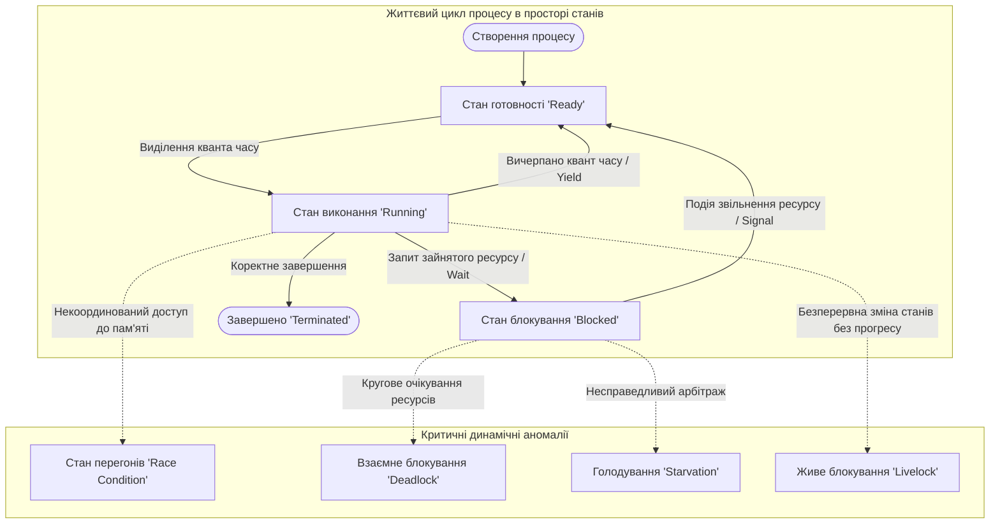
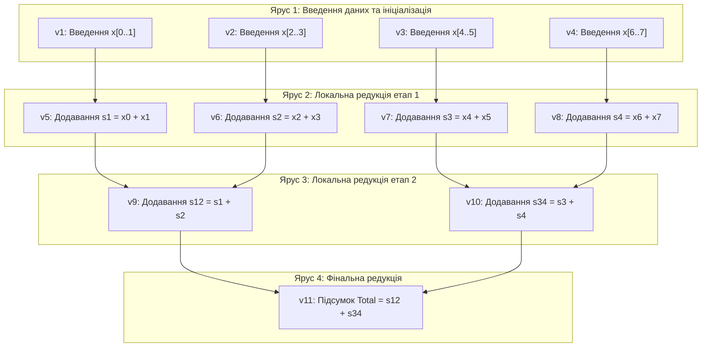
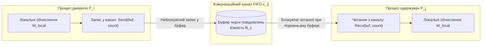
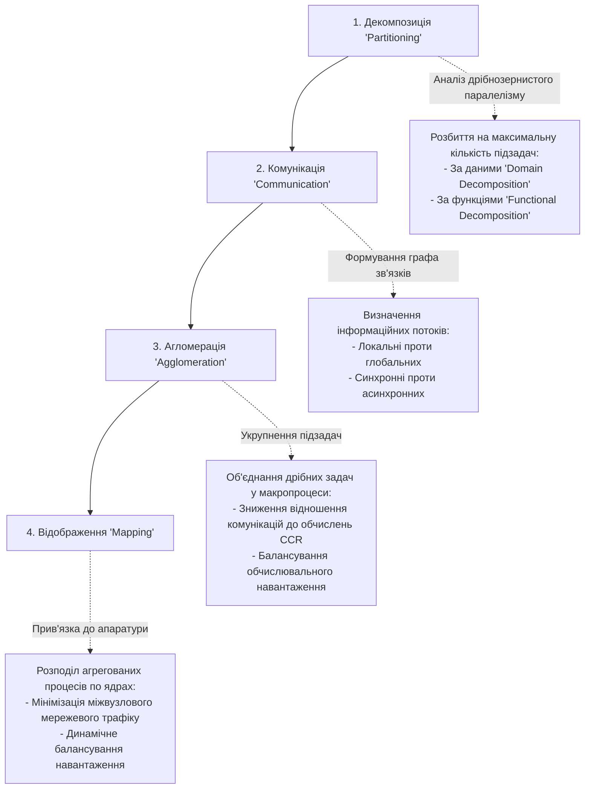
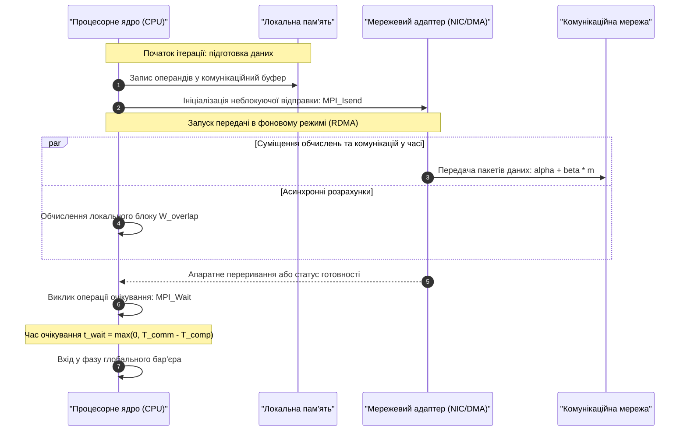
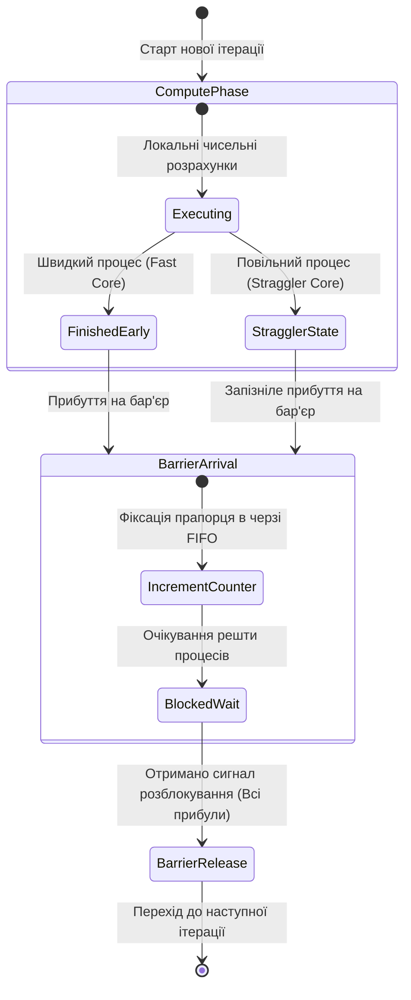
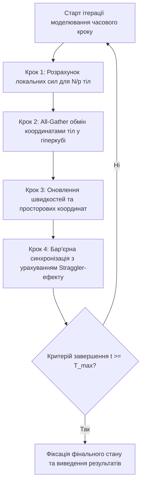

# Тема 5. Моделювання обчислювальних процесів у часі та просторі станів. Графові моделі «операції-операнди», «процеси-канали», оцінка комунікаційної трудомісткості та бар'єрна синхронізація

## Мета лекції

Метою цієї лекції є формування у майбутніх фахівців із комп'ютерної інженерії системи фундаментальних знань і практичних навичок формального моделювання паралельних і розподілених обчислювальних процесів у просторі станів та в часовому конвеєрі виконання. Під час лекції розглядається методологічний перехід від дрібнозернистих інформаційних графів типу «операції-операнди» до великоструктурних топологій «процеси-канали» з аналітичною оцінкою комунікаційної трудомісткості передачі повідомлень. Окрему увагу зосереджено на математичному апараті оцінювання продуктивності за теоремою Брента, розрахунку балансу між обчисленнями і комунікаціями, а також на аналізі часової складності алгоритмів бар'єрної синхронізації у високопродуктивних обчислювальних системах.

## Очікувані результати навчання

1. **Знання та розуміння.** Здобувачі вищої освіти повинні засвоїти понятійний апарат простору станів обчислювальних систем, розуміти математичні властивості орієнтованих ациклічних графів алгоритмів (DAG), принципи функціонування детермінованих мереж процесів Кана, сутність моделі «процеси-канали», а також системні механізми виникнення деструктивних аномалій паралелізму (станів перегонів, взаємних блокувань і голодування).
2. **Застосування.** Здобувачі мають оволодіти вмінням формалізувати довільні паралельні обчислювальні алгоритми у вигляді графів інформаційних залежностей за даними, будувати часові розклади виконання задач для фіксованої кількості обчислювальних вузлів, здійснювати параметричне масштабування підзадач і застосовувати аналітичну модель Хокні для точного розрахунку комунікаційних витрат у гетерогенних мережах.
3. **Аналіз.** Студенти повинні вміти проводити порівняльний аналіз топологічних властивостей комунікаційних середовищ (діаметра, зв'язності, ширини бісекції), аналізувати детермінізм інформаційних потоків у моделях обчислень, досліджувати відношення комунікаційної трудомісткості до обчислювальної ($CCR$) та виявляти критичні фактори уповільнення систем через ефект найповільнішого процесу (straggler effect).
4. **Оцінювання та синтез.** Здобувачі мають набути навичок оцінювання теоретичних меж прискорення та ефективності паралельних програм на основі аналізу довжини критичного шляху графа і теореми Брента, синтезувати оптимальні деревоподібні топології бар'єрної синхронізації та обґрунтовувати раціональний розподіл обчислювальних задач між ядрами для досягнення вартісно-оптимального режиму роботи системи.

---

## Детальний покроковий план лекції

### 1. Теоретичний модуль. Просторово-часовий формалізм та графова парадигма паралельних обчислень

* 1.1. Концепція простору станів паралельної обчислювальної системи: векторна репрезентація конфігурацій, фазовий простір виконання у часі та класифікація критичних аномалій асинхронної взаємодії процесів (стан перегонів, взаємне блокування-дедлок, нескінченне відкладання-голодування).
* 1.2. Дрібноструктурна графова модель «операції-операнди» (DAG): математичний опис множини вершин і дуг інформаційних залежностей, концепція детермінізму за даними (Dataflow Determinism), ярусна структура та характеристики паралельної форми алгоритму.
* 1.3. Великоструктурна модель «процеси-канали»: формалізація автономних процесів із локальним адресним простором, абстракція каналів як нескінченних або обмежених черг повідомлень (FIFO), блокуюча семантика операцій вводу-виводу та співвідношення з мережами процесів Кана і моделлю взаємодіючих послідовних процесів Хоара (CSP).
* 1.4. Системна методологія трансформації обчислювальних моделей: чотириетапна парадигма проєктування Фостера (декомпозиція за даними та функціями, виділення локальних і глобальних комунікацій, агломерація і масштабування підзадач, відображення на фізичні ядра процесора).

### 2. Аналітичний модуль. Математичні моделі продуктивності, комунікаційної затримки та бар'єрного узгодження

* 2.1. Аналітичні характеристики графових моделей обчислень: визначення сумарного обсягу робіт ($T_1$), довжини критичного шляху ($T_\infty$) на базі концепції паракомп'ютера, а також формулювання й аналітичне доведення теореми Брента для оцінки часу виконання на скінченній кількості обчислювачів.
* 2.2. Метрики якості та ефективності паралельних алгоритмів: математичний апарат розрахунку прискорення ($S_p$), ефективності використання процесорів ($E_p$), критерій вартісної оптимальності ($C_p$) та фізичні причини виникнення аномального понадлінійного (суперлінійного) прискорення.
* 2.3. Кількісна оцінка комунікаційної складової виконання паралельних алгоритмів: порівняльний аналіз передачі повідомлень (Store-and-Forward Routing) і пакетної маршрутизації (Cut-Through Routing), часові затримки в типових топологіях (кільце, решітка-тор, гіперкуб) та класична аналітична модель Хокні.
* 2.4. Математична формалізація балансу між комунікаціями та обчисленнями: розрахунок коефіцієнта $CCR$ (Communication-to-Computation Ratio), аналітичні критерії визначення обчислювального режиму (Compute-Bound проти Network-Bound) та стратегії оптимізації зернистості розпаралелювання.
* 2.5. Математичне моделювання бар'єрної синхронізації паралельних ітераційних процесів: аналіз часової складності централізованого бар'єра з лічильником ($\mathcal{O}(p)$) проти розгалужених деревоподібних структур ($\mathcal{O}(\log_2 p)$), а також кількісна оцінка системних втрат через ефект найповільнішого процесу (straggler effect).

### 3. Практично-розрахунковий кейс. Комплексне моделювання та оптимізація розподіленого обчислювального процесу

**Тема наскрізної задачі.** «Аналітичний розрахунок часових характеристик, комунікаційних витрат та оптимізація бар'єрної синхронізації паралельного алгоритму моделювання гравітаційної взаємодії $N$ тіл на багатопроцесорному кластері з гіперкубічною топологією»

## 1. Фундаментальний теоретичний базис та концептуальні засади

### 1.1. Простір станів паралельної системи та динамічні аномалії асинхронності

Математичне моделювання паралельних обчислювальних процесів спирається на розмежування поведінки системи у двох взаємопов'язаних вимірах: часовому конвеєрі виконання (**Execution Timeline**) та просторі станів (**State Space**). У класичній однопроцесорній архітектурі фон Неймана обчислювальний процес розгортається строго детерміновано як лінійна послідовність переходів між станами єдиного процесорного елемента та оперативної пам'яті. На противагу цьому, паралельна або розподілена обчислювальна система функціонує в умовах недетермінованого переплетення (**interleaving**) елементарних операцій, породжуваних множиною автономних обчислювальних ядер або процесорів.

Формально глобальний стан обчислювальної системи в довільний момент модельного часу описується вектором конфігурації:

$$S(t) = \Big( s_1(t), s_2(t), \dots, s_p(t), \mathbf{M}(t), \mathbf{C}(t) \Big)$$

де:
* $s_i(t) \in \mathcal{S}_{\text{proc}}$ позначає локальний стан $i$-го процесу (зокрема значення програмного лічильника інструкцій, вміст локальних регістрів процесора та стек викликів) у момент часу $t$, виміряний у секундах ($c$);
* $p \in \mathbb{N}$ визначає загальну цілочисельну кількість активних фізичних або віртуальних процесів, задіяних у виконанні паралельної задачі;
* $\mathbf{M}(t) \in \mathcal{M}$ позначає глобальний стан простору пам'яті (стан спільних комірок або конфігурацію розподілених буферів);
* $\mathbf{C}(t) = \big( q_1(t), q_2(t), \dots, q_m(t) \big)$ відображає стан комунікаційного середовища, представлений вектором вмісту $m$ комунікаційних каналів черг повідомлень.

Динаміка обчислювальної системи моделюється як дискретна марковська або напівмарковська послідовність переходів під впливом подій $e_k \in \mathcal{E}$, де кожна подія відповідає виконанню базової арифметичної команди, операції читання/запису пам'яті або відправленню/прийому мережевого повідомлення:

$$S(t + \Delta t) = \delta\big( S(t), e_k \big)$$

де:
* $S(t)$ репрезентує початковий вектор глобального стану системи перед настанням події;
* $e_k \in \mathcal{E}$ є дискретною елементарною подією з множини допустимих системних дій $\mathcal{E}$;
* $\delta: \mathcal{S} \times \mathcal{E} \to \mathcal{S}$ є операторною функцією переходів між станами системи;
* $\Delta t$ позначає фізичну тривалість виконання елементарної дії $e_k$, виражену в секундах ($c$).

Через асинхронну природу взаємодії компонентів множина можливих траєкторій переходів у просторі станів зростає комбінаторно (явище комбінаторного вибуху простору станів). Відсутність жорсткої часової координації призводить до виникнення критичних динамічних аномалій:

1. **Стан перегонів (Race Condition)** виникає тоді, коли два або більше паралельних потоків звертаються до спільного ресурсу пам'яті без належної синхронізації, причому хоча б одна з операцій є операцією запису. Результат обчислень стає залежним від випадкового порядку виконання машинних інструкцій операційною системою. Формально стан перегонів порушує умови Бернштейна: якщо множина комірок пам'яті, що зчитуються процесом $P_1$, є $I_1$, а записуваних — $O_1$ (аналогічно $I_2, O_2$ для $P_2$), то одночасне виконання є коректним тоді й лише тоді, коли:

$$\big( I_1 \cap O_2 \big) \cup \big( O_1 \cap I_2 \big) \cup \big( O_1 \cap O_2 \big) = \emptyset$$

де $I_k$ позначає множину вхідних адрес пам'яті (множину читання), а $O_k$ визначає множину вихідних адрес пам'яті (множину запису) для $k$-го процесу.

2. **Взаємне блокування (Deadlock)** являє собою стійкий тупиковий стан системи, за якого жоден із групи процесів не може продовжувати виконання, оскільки кожен процес циклічно очікує звільнення ресурсу, заблокованого іншим процесом цієї ж групи. Для виникнення взаємного блокування необхідне одночасне виконання чотирьох умов Коффмана: взаємне виключення (**Mutual Exclusion**), утримання та очікування ресурсу (**Hold and Wait**), відсутність примусового вилучення ресурсу (**No Preemption**) та наявність кругового очікування у графі розподілу ресурсів (**Circular Wait**).

3. **Нескінченне відкладання, або голодування (Starvation)** виникає в ситуаціях, коли окремий процес через несправедливу дисципліну диспетчеризації або пріоритетного розподілу ресурсів позбавлений доступу до процесорного часу або критичної секції, хоча система в цілому продовжує змінювати стани та виконувати корисну роботу. Різновидом цього стану є **живе блокування (Livelock)**, коли процеси активно змінюють власні локальні стани у відповідь на дії інших процесів, але сумарний прогрес алгоритму дорівнює нулю.

### 1.2. Дрібноструктурна графова модель «операції-операнди» (DAG)

На мікрорівні аналізу паралелізму інформаційна структура обчислювального алгоритму подається за допомогою орієнтованого ациклічного графа (**Directed Acyclic Graph, DAG**), який у вітчизняній науковій школі традиційно іменується моделлю «операції-операнди».

Граф алгоритму формалізується четвіркою параметрів:

$$G = (V, E, W_V, W_E)$$

де:
* $V = \{v_1, v_2, \dots, v_n\}$ позначає множину вершин, кожна з яких моделює неподільну елементарну обчислювальну операцію (наприклад, додавання, множення, трансцендентне обчислення, блочне скалярне множення матриць);
* $E \subseteq V \times V$ репрезентує множину орієнтованих дуг, де напрямлена дуга $e_{ij} = (v_i, v_j) \in E$ існує тоді й лише тоді, коли операція $v_j$ безпосередньо використовує як операнд результат, обчислений операцією $v_i$;
* $W_V: V \to \mathbb{R}^+$ є ваговим відображенням, що зіставляє кожній вершині $v_i$ її обчислювальну трудомісткість $w(v_i)$, виражену в кількості операцій з рухомою комою ($FLOP$) або в секундах ($c$);
* $W_E: E \to \mathbb{R}^+$ є ваговим відображенням, яке задає обсяг інформації $d(e_{ij})$, що передається між операціями $v_i$ та $v_j$, виражений у байтах ($Byte$).

Ациклічність графа $G$ ($e_{ij} \in E \implies v_i \neq v_j$ та відсутність замкнених контурів) обумовлена причинно-наслідковою природою чисельних обчислень: жодна обчислювальна змінна не може бути визначена через саму себе безпосередньо в межах одного такту обчислень. Якщо між парою вершин $v_a$ та $v_b$ відсутній орієнтований шлях у графі $G$, зазначені операції є інформаційно незалежними за даними та потенційно можуть виконуватися абсолютно паралельно на різних обчислювачах.

Фундаментальною властивістю графової моделі «операції-операнди» є детермінізм за даними (**Dataflow Determinism**): порядок фактичного виконання інформаційно незалежних операцій та просторове розміщення вершин по фізичних процесорних ядрах жодним чином не здатні змінити підсумковий чисельний результат алгоритму за умови збереження відношення часткового порядку, заданого дугами $E$.

Для аналітичного опису просторової конфігурації паралелізму використовують розбиття графа на паралельні яруси (**Ярусно-паралельна форма, ЯПФ**). Кожній вершині $v \in V$ зіставляється її цілочисельний топологічний ранг або номер ярусу:

$$L(v_j) = 
\begin{cases} 
1, & \text{якщо } \mathrm{Pred}(v_j) = \emptyset, \\
1 + \max_{v_i \in \mathrm{Pred}(v_j)} L(v_i), & \text{якщо } \mathrm{Pred}(v_j) \neq \emptyset
\end{cases}$$

де:
* $L(v_j) \in \mathbb{N}$ позначає номер ярусу (висоту вершини) в ярусно-паралельній формі графа;
* $\mathrm{Pred}(v_j) = \{ v_i \in V \mid (v_i, v_j) \in E \}$ визначає множину безпосередніх вершин-попередників для операції $v_j$.

Сукупність вершин, які мають однаковий ранг $L(v) = k$, утворює $k$-й ярус паралельної форми алгоритму. Основними ботанічними та структурними характеристиками графа є:
* **Висота паралельної форми $H(G) = \max_{v \in V} L(v)$** відповідає мінімально можливій кількості послідовних кроків, необхідних для виконання алгоритму за наявності необмеженої кількості процесорних пристроїв ($H(G) = T_\infty$ за одиничної тривалості операцій).
* **Ширина $k$-го ярусу $B_k = |\{ v \in V \mid L(v) = k \}|$** визначає ступінь внутрішнього паралелізму на $k$-му кроці обчислень.
* **Максимальна ширина паралельної форми $W(G) = \max_k B_k$** регламентує максимальну кількість процесорів, яку здатний ефективно утилізувати алгоритм на піку паралелізму без простою обладнання.

### 1.3. Великоструктурна модель «процеси-канали»

Якщо модель «операції-операнди» фокусується на інформаційній залежності індивідуальних математичних операцій без прив'язки до комунікаційної платформи, то на макрорівні паралельного програмування застосовується модель «процеси-канали» (**Process-Channel Model**). Вона базується на теоретичних концепціях мереж процесів Кана (**Kahn Process Networks, KPN**) та формалізмі взаємодіючих послідовних процесів Хоара (**Communicating Sequential Processes, CSP**).

У моделі «процеси-канали» обчислювальна архітектура розглядається як зважений мультиграф:

$$\mathcal{M}_{PC} = (\mathcal{P}, \mathcal{C})$$

де:
* $\mathcal{P} = \{P_1, P_2, \dots, P_p\}$ є множиною паралельних процесів, кожен із яких володіє повністю ізольованим адресним простором оперативної пам'яті, локальною чергою виконання інструкцій та набором портів взаємодії;
* $\mathcal{C} = \{c_1, c_2, \dots, c_k\}$ позначає множину односпрямованих комунікаційних каналів зв'язку, де кожен канал $c = (P_i, P_j)$ забезпечує транспортування типізованих блоків даних від процесу-джерела $P_i$ до процесу-одержувача $P_j$.

Канал комунікації функціонує за семантикою строгої черги **FIFO** (First-In, First-Out). Поведінка та детермінізм моделі регламентуються правилами взаємодії процесів із каналами:

1. **Мережі процесів Кана (KPN).** У формалізмі Кана ємність каналів зв'язку вважається потенційно нескінченною. Операція відправлення даних у канал є повністю неблокуючою (**non-blocking write**): процес-джерело миттєво розміщує повідомлення в буфері та продовжує виконання без затримок. Операція читання з каналу є блокуючою (**blocking read**): якщо канал порожній, процес-одержувач призупиняє своє виконання доти, доки в буфері не з'явиться щонайменше один елемент даних. Процес не має засобів перевірки наявності даних у каналі без спроби їх зчитування (відсутність операцій типу polling або інспектування декількох каналів одночасно). Завдяки монотонності та неперервності відображень над потоками в теорії Кана доведено, що мережа KPN володіє функціональним детермінізмом: послідовність згенерованих даних на виходах системи не залежить від квантування часу виконання процесів чи затримок передачі по мережі.

2. **Модель CSP Хоара.** На відміну від KPN, у моделі CSP канали за замовчуванням мають нульову ємність ($B_c = 0$), що моделює режим рандеву (**rendezvous**). Як операція читання, так і операція запису є блокуючими: точка обміну досягається лише тоді, коли відправник і одержувач одночасно готові до взаємодії. Це усуває потребу у виділенні буферної пам'яті, проте суттєво підвищує чутливість системи до взаємних блокувань у разі некоректної послідовності викликів комунікаційних процедур.

3. **Специфікація MPI як гібридна інженерна реалізація.** У промислових системах на базі інтерфейсу передачі повідомлень (MPI) програміст отримує як блокуючі (`MPI_Send`, `MPI_Recv`), так і неблокуючі примітиви (`MPI_Isend`, `MPI_Irecv`), що дає змогу суміщати обчислення з передачею даних у часі, організовуючи комунікаційні конвеєри.

### 1.4. Системна методологія трансформації моделей: парадигма Фостера

Перехід від абстрактного алгоритмічного опису задачі до ефективно функціонуючого паралельного коду, оптимізованого під конкретну апаратну архітектуру, спирається на класичну методологію проєктування, запропоновану Ієном Фостером (**Foster's Design Methodology**, парадигма **PCAM**). Ця методологія складається з чотирьох послідовних стадій, які зв'язують мікрорівень «операції-операнди» з макрорівнем «процеси-канали».

#### 1. Декомпозиція (Partitioning)
На початковій стадії загальна обчислювальна схема розбивається на максимально можливу кількість елементарних підзадач без огляду на обмеженість апаратних ресурсів цільової системи. Головна мета стадії — експлікація граничного внутрішнього паралелізму задачі. Декомпозиція реалізується у двох формах:
* **Паралелізм за даними (Domain Decomposition)** передбачає поділ структур даних (масивів, матриць, сіток чи тензорів) на неперетинні підмножини, де кожна підзадача виконує однотипні обчислення над закріпленим блоком даних.
* **Функціональний паралелізм (Functional / Task Decomposition)** розбиває алгоритм на різнорідні обчислювальні фази (наприклад, введення даних, фільтрація, спектральний аналіз, виведення), які здатні утворювати просторові або часові конвеєри.

#### 2. Комунікація (Communication)
На другому етапі визначаються інформаційні взаємодії між сформованими на першому кроці підзадачами, необхідні для передачі проміжних операндів. Структура комунікацій класифікується за чотирма дихотомічними ознаками:
* **Локальні проти глобальних комунікацій.** За локальної схеми кожен процес взаємодіє виключно з обмеженою кількістю просторово сусідніх процесів (наприклад, обмін тіньовими границями у сіткових методах). Глобальні комунікації вимагають колективної взаємодії всіх вузлів системи (наприклад, редукційне підсумовування або широкомовна розсилка).
* **Структуровані проти довільних.** Структуровані взаємодії утворюють регулярні геометричні топології (лінійка, кільце, 2D-решітка, гіперкуб), тоді як довільні мають динамічну та нерегулярну структуру зв'язків.
* **Статичні проти динамічних.** Статичні зв'язки жорстко зафіксовані на етапі компіляції чи ініціалізації, а динамічні виникають непередбачувано в процесі обчислень (наприклад, в алгоритмах із адаптивними розрахунковими сітками).
* **Синхронні проти асинхронних.** Синхронна передача блокує відправника до моменту підтвердження прийому одержувачем, а асинхронна реалізує концепцію перекриття комунікацій та обчислень шляхом використання проміжних буферів.

#### 3. Агломерація / Масштабування (Agglomeration)
Стадія агломерації полягає в перегрупуванні та укрупненні дрібних елементарних підзадач у більш масивні обчислювальні блоки (**Coarse Granularity**). Застосування виключно дрібноструктурних задач призводить до катастрофічного домінування комунікаційних накладних витрат над корисними розрахунками. 

Критерієм коректної агломерації є об'єднання в межах одного процесу тих підзадач, між якими зафіксовано найвищу інтенсивність інформаційного обміну, що перетворює дорогі міжвузлові мережеві пересилання на дешеві операції читання/запису локальної пам'яті процесора.

#### 4. Відображення (Mapping)
Завершальний етап проєктування полягає у фізичному призначенні агрегованих процесів на доступні апаратні процесорні ядра або обчислювальні вузли кластера. Задача відображення є класичною NP-повною задачею оптимізації розкладу, яка вимагає досягнення двох суперечливих цілей:
* забезпечення ідеально рівномірного обчислювального навантаження між усіма задіяними ядрами для запобігання простоям;
* розміщення інтенсивно взаємодіючих процесів на спільних фізичних вузлах для мінімізації трафіку в системних комунікаційних каналах.

---

### Систематизація базових моделей обчислень та архітектур

| Параметр порівняння | Модель «Операції-Операнди» (DAG) | Мережі процесів Кана (KPN) | Взаємодіючі процеси (CSP Хоара) | Модель передачі повідомлень (MPI) | Модель спільної пам'яті (OpenMP / Threads) |
| :--- | :--- | :--- | :--- | :--- | :--- |
| **Рівень абстракції та зернистість** | Дрібноструктурний (мікрорівень операторів) | Великоструктурний (макрорівень потоків) | Великоструктурний (рівень взаємодіючих задач) | Великоструктурний (рівень незалежних процесів) | Середньо- та дрібноструктурний (рівень ниток) |
| **Базові конструктивні елементи** | Скалярні/векторні операції ($v_i$) та дуги залежностей ($e_{ij}$) | Автономні послідовні процеси та спрямовані канали | Автономні процеси та точки синхронного рандеву | Процеси зі своїм адресним простором, комунікатори | Нитки (threads) у єдиному адресному просторі процесу |
| **Семантика обміну даними** | Неявна передача операндів через результуючі змінні | Асинхронний запис у нескінченний FIFO, блокуюче читання | Синхронне рандеву: одночасне блокування читання й запису | Буферизована/неблокуюча передача повідомлень по мережі | Прямий доступ до спільних комірок пам'яті через спільні шини |
| **Ступінь детермінізму** | Абсолютний детермінізм за даними (Dataflow Determinism) | Гарантований функціональний детермінізм потоків | Потенційно недетермінований за наявності альтернативних виборів | Детермінований за виклику з конкретних рангів; недетермінований за `ANY_SOURCE` | Недетермінований за замовчуванням; висока чутливість до race conditions |
| **Механізми взаємовиключення** | Не потрібні (відсутня спільна модифікована пам'ять) | Реалізуються неявно через стан черги каналу FIFO | Реалізуються неявно через блокуючий протокол рандеву | Розподіл адресного простору унеможливлює спільний конфлікт | М'ютекси, критичні секції, семафори, атомарні змінні |
| **Апаратна орієнтація та реалізація** | Суперскалярні процесори, VLIW, обчислювальні графи тензорних процесорів | Системи потокової обробки сигналів (DSP), потокові пайплайни | Системи з жорсткою синхронізацією, мікроядерні архітектури | Кластерні суперкомп'ютери, масивно-паралельні системи (MPP) | Симетричні мультипроцесори (SMP), багатоядерні CPU та GPU |

---

> **ТИПОВА ПОМИЛКА:** Помилковим є ототожнення поняття **асинхронного паралелізму** з **недетермінізмом підсумкових результатів обчислень**. Багато інженерів вважають, що якщо алгоритм виконується асинхронно без використання глобального тактового генератора чи спільних бар'єрів, його результати обов'язково зазнаватимуть стохастичного впливу через різну швидкість процесорів.
> 
> У дійсності детермінізм алгоритму повністю визначається обраною моделлю обчислень та структурою інформаційних залежностей. У чистому графі «операції-операнди» (DAG) та у мережах процесів Кана (KPN) діє властивість консистентності за даними: якщо топологічний порядок графа гарантує завершення генерації операнда до моменту його споживання, результат роботи алгоритму буде біт-у-біт ідентичним за будь-яких варіацій швидкодії процесорних вузлів, різної швидкості проходження пакетів у комутаторах та за довільних квантів виділення процесорного часу операційною системою. Недетермінізм виникає виключно тоді, коли в систему свідомо впроваджуються некоординовані спільні ресурси пам'яті, операції типу `MPI_ANY_SOURCE` або альтернативні вибори з черг очікування.

---

> **КОНТРОЛЬНЕ ПИТАННЯ.** Чому в моделі мереж процесів Кана (KPN) категорично заборонено введення примітиву неблокуючої перевірки наявності даних у каналі (операції типу `probe` або `is_empty`), якщо ми прагнемо зберегти фундаментальну властивість гарантованого функціонального детермінізму системи?

Розгорнути відповідь

**Правильна відповідь:** Наявність неблокуючої операції перевірки стану каналу (`is_empty` або `poll`) руйнує монотонність поведінки процесу та вводить недетерміновану часову залежність у простір станів системи.

1. **Математичне обґрунтування властивості детермінізму Кана:**
   У мережах KPN кожен процес функціонує як неперервне монотонне відображення у просторі послідовностей (потоків) за Скоттом. Функція $F: \mathcal{H}_1 \times \dots \times \mathcal{H}_m \to \mathcal{H}_1 \times \dots \times \mathcal{H}_k$ називається монотонною, якщо:

$$X \sqsubseteq X' \implies F(X) \sqsubseteq F(X')$$

де:
* $\mathcal{H}$ є множиною скінченних і нескінченних послідовностей елементів (потоків);
* $\sqsubseteq$ позначає відношення префіксного часткового порядку над послідовностями (потік $X$ є префіксом потоку $X'$).

Коли процес має доступ лише до операції блокуючого читання, вихідний потік формується виключно на основі значень, які надійшли у вхідні канали. Час надходження даних не впливає на точку виклику, оскільки процес просто чекає.

2. **Аналіз виникнення недетермінізму через опитування каналу:**
   Якщо ж процес має змогу викликати неблокуючу функцію `is_empty(channel)` і здійснювати галуження за умовою:

$$\mathbf{if} \;\; \mathrm{is\_empty}(c) \;\; \mathbf{then} \;\; A() \;\; \mathbf{else} \;\; B()$$

то поведінка процесу починає залежати від фізичного часу прибуття мережевого пакета або флуктуацій латентності комунікатора:

* якщо через джиттер мережі повідомлення затрималося на 1 мікросекунду, процес виконає гілку $A()$;
* якщо пакет прибув вчасно, буде виконано гілку $B()$.

У результаті функція $F$ втрачає монотонність, оскільки за ідентичних вхідних даних система генерує принципово різні вихідні потоки. Система переходить із класу детермінованих мереж обчислень за даними до класу недетермінованих систем, чутливих до станів перегонів.

---

### Вказівки для самостійного осмислення теоретичного базису

1. Зіставте практичну доцільність застосування графової моделі «операції-операнди» та моделі «процеси-канали». Зверніть увагу на те, що модель «операції-операнди» є інструментом компіляторів та середовищ автоматичного розпаралелювання (наприклад, оптимізація обчислювальних графів у PyTorch або TensorFlow) для векторизації та розміщення мікроінструкцій на рівні регістрів і функціональних блоків ядра. Модель «процеси-канали» слугує архітектурним шаблоном для розробників системного програмного забезпечення (наприклад, реалізація мікросервісних пайплайнів, акторних моделей чи розподілених програм на базі стандарту MPI), де ключову роль відіграє ізоляція адресних просторів та мінімізація накладних витрат мережевого зв'язку.
2. Проаналізуйте стадії парадигми Фостера з погляду збереження локальності даних. Початкове прагнення досягти максимального розпаралелювання шляхом дрібнозернистої декомпозиції завжди веде до різкого зростання кількості комунікаційних дуг у графі системи. Дослідіть, чому без наступного етапу агломерації більшість паралельних алгоритмів на реальних кластерах демонструють суттєве уповільнення порівняно з послідовними аналогами, і як зміна зернистості розрахунків впливає на баланс між часом виконання арифметичних інструкцій процесором та часом очікування на синхронізацію в каналах.

## 2. Аналітичні процеси, математичний апарат та моделювання

### 2.1. Формалізація графових часових оцінок та аналітичне виведення теореми Брента

Аналітичне оцінювання потенціалу паралельного обчислювального процесу, представленого графовою моделлю «операції-операнди» ($DAG$), вимагає визначення двох фундаментальних метрик: сумарного обсягу робіт та довжини критичного шляху. 

Сумарний обсяг робіт, що позначається як $T_1$, визначає час виконання всіх вершин графа $G = (V, E)$ на одному скалярному обчислювачі в послідовному режимі. Якщо кожна $i$-та вершина характеризується вагою $w(v_i)$, яка виражає кількість елементарних операцій, а $\tau_{\text{op}}$ задає середню тривалість виконання однієї базової операції, то величина $T_1$ формалізується наступним співвідношенням:

$$T_1 = \tau_{\text{op}} \cdot \sum_{v_i \in V} w(v_i)$$

де:
* $T_1$ позначає сумарний послідовний час виконання алгоритму на одному процесорному ядрі, виміряний у секундах ($c$);
* $\tau_{\text{op}}$ є апаратною тривалістю виконання однієї машинної операції з рухомою комою, вираженою в секундах на операцію ($c/\text{FLOP}$);
* $w(v_i) \in \mathbb{N}$ репрезентує обчислювальну вагу (кількість операцій) $i$-ї вершини графа;
* $V$ визначає повну скінченну множину операційних вершин графа алгоритму.

Довжина критичного шляху $T_\infty$ (висота паралельної форми графа) відповідає мінімально можливому часу виконання задачі на абстрактній моделі паракомп'ютера (ідеальної системи $PRAM$) із необмеженою кількістю процесорних елементів ($p \to \infty$) за нульових комунікаційних затримок:

$$T_\infty = \tau_{\text{op}} \cdot \max_{\pi \in \Pi} \sum_{v_k \in \pi} w(v_k)$$

де:
* $T_\infty$ позначає тривалість проходження найдовшого орієнтованого ланцюга залежностей за даними в системі, виміряну в секундах ($c$);
* $\Pi$ репрезентує множину всіх можливих простих орієнтованих шляхів у графі $G$ від вхідних вершин-джерел до вихідних вершин-стоків;
* $\pi$ позначає конкретний орієнтований шлях інформаційної залежності між операціями.

Зв'язок між часом виконання на одному процесорі $T_1$, довжиною критичного шляху $T_\infty$ та реальним часом виконання алгоритму $T_p$ на системі зі скінченною кількістю однорідних процесорів $p$ за умови жадібного планування без урахування комунікацій установлює **теорема планування Брента (Graham-Brent Theorem)**.

Нижче наведено покрокове аналітичне виведення двобічної оцінки Брента:

$$
\begin{aligned}
\text{Етап 1 (Ярусна декомпозиція графа):} & \quad \text{Розіб'ємо граф DAG на } T_\infty \text{ ярусів, де кожен } k\text{-й ярус містить } W_k \text{ операцій, причому } \sum_{k=1}^{T_\infty} W_k = T_1. \\
\text{Етап 2 (Оцінка часу виконання ярусу):} & \quad \text{На системі з } p \text{ ядер виконання } k\text{-го ярусу потребує не більше } \left\lceil \frac{W_k}{p} \right\rceil \text{ кроків обчислень.} \\
\text{Етап 3 (Сумування кроків за всіма ярусами):} & \quad T_p \le \sum_{k=1}^{T_\infty} \left\lceil \frac{W_k}{p} \right\rceil \le \sum_{k=1}^{T_\infty} \left( \frac{W_k + p - 1}{p} \right) = \sum_{k=1}^{T_\infty} \left( \frac{W_k - 1}{p} + 1 \right). \\
\text{Етап 4 (Зведення до макропараметрів):} & \quad T_p \le \frac{\sum_{k=1}^{T_\infty} W_k - T_\infty}{p} + \sum_{k=1}^{T_\infty} 1 = \frac{T_1 - T_\infty}{p} + T_\infty. \\
\text{Етап 5 (Формулювання двобічної нерівності):} & \quad \max\left( \frac{T_1}{p}, T_\infty \right) \le T_p \le \frac{T_1 - T_\infty}{p} + T_\infty.
\end{aligned}
$$

Аналіз асимптотичної поведінки отриманої нерівності дозволяє встановити такі граничні умови функціонування обчислювального комплексу:

$$\lim_{p \to 1} T_p = T_1, \qquad \lim_{p \to \infty} T_p = T_\infty$$

Фізичний зміст теореми Брента полягає в тому, що додавання обчислювальних ядер зменшує час роботи алгоритму лише доти, доки обсяг паралельної роботи на ярусі домінує над довжиною критичного шляху. Як тільки $p$ перевищує відношення $T_1 / T_\infty$, надлишкові ядра простоюють, а час виконання асимптотично прямує до апаратного ліміту $T_\infty$.

---

### 2.2. Метричний простір ефективності паралельних обчислень та закони масштабування

Для формалізації якості функціонування паралельного алгоритму застосовується система взаємопов'язаних метрик: коефіцієнт прискорення ($Speedup$), коефіцієнт ефективності ($Efficiency$), функція сумарних накладних витрат ($Total\,Overhead$), вартість обчислень ($Cost$) та функція ізоефективності ($Isoefficiency$).

Коефіцієнт прискорення $S_p(n)$ відображає кратність скорочення часу розв'язання задачі розмірності $n$ при залученні $p$ ядер:

$$S_p(n) = \frac{T_1(n)}{T_p(n)}$$

де:
* $S_p(n) \in \mathbb{R}^+$ позначає безрозмірний коефіцієнт прискорення обчислень;
* $T_1(n)$ є часом послідовного виконання найкращого детермінованого алгоритму розв'язання задачі на одному ядрі ($c$);
* $T_p(n)$ визначає фізичний час виконання паралельного варіанта алгоритму на $p$ обчислювачах ($c$).

Коефіцієнт ефективності $E_p(n)$ визначає середню питому частку часу, протягом якого кожне процесорне ядро реально зайняте виконанням корисної обчислювальної роботи:

$$E_p(n) = \frac{S_p(n)}{p} = \frac{T_1(n)}{p \cdot T_p(n)}$$

де $E_p(n) \le 1$ є безрозмірним коефіцієнтом корисної дії обчислювальної системи.

Сумарні накладні витрати паралелізму $T_0(n, p)$ агрегують усі часові втрати, зумовлені міжпроцесорними комунікаціями, очікуванням синхронізації, дисбалансом завантаження та службовими командами середовища виконання:

$$T_0(n, p) = p \cdot T_p(n) - T_1(n)$$

де $T_0(n, p)$ позначає сумарний процесорний час простоїв та системних накладних витрат, виражений у процесор-секундах ($proc \cdot c$).

Підставивши вираз накладних витрат у формулу ефективності, одержуємо аналітичну залежність деградації продуктивності:

$$E_p(n) = \frac{T_1(n)}{T_1(n) + T_0(n, p)} = \frac{1}{1 + \frac{T_0(n, p)}{T_1(n)}}$$

Вартість паралельних обчислень $C_p(n)$ визначається як добуток кількості ядер на загальний час роботи програми:

$$C_p(n) = p \cdot T_p(n) = T_1(n) + T_0(n, p)$$

Алгоритм називається **вартісно-оптимальним (cost-optimal)**, якщо вартість його паралельного виконання асимптотично має той самий порядок складності, що й послідовний час: $C_p(n) = \mathcal{O}(T_1(n))$, що еквівалентно умові $E_p(n) = \Theta(1)$ при зростанні розмірності задачі та кількості ядер.

Зв'язок темпів зростання складності задачі та кількості процесорів описує **функція ізоефективності**. Нижче наведено її аналітичне виведення:

$$
\begin{aligned}
\text{Етап 1 (Фіксація цільової ефективності):} & \quad \text{Задамо постійний необхідний рівень ефективності } E_p(n) = E^* = \mathrm{const}, \text{ де } E^* \in (0, 1). \\
\text{Етап 2 (Перетворення балансу робіт):} & \quad \frac{1}{1 + \frac{T_0(n, p)}{T_1(n)}} = E^* \implies \frac{T_0(n, p)}{T_1(n)} = \frac{1 - E^*}{E^*}. \\
\text{Етап 3 (Формалізація умови ізоефективності):} & \quad T_1(n) = K^* \cdot T_0(n, p), \quad \text{де } K^* = \frac{E^*}{1 - E^*} = \mathrm{const}. \\
\text{Етап 4 (Синтез залежності):} & \quad W = f_{\text{iso}}(p) \implies n = \mathcal{E}_{\text{iso}}(p).
\end{aligned}
$$

Функція ізоефективності демонструє, з якою швидкістю має зростати обчислювальний обсяг задачі $W = T_1(n)$ відносно зростання пулу процесорів $p$, аби коефіцієнт корисної дії $E_p$ не спадав нижче порогового значення $E^*$.

За певних обставин на практиці спостерігається **понадлінійне (суперлінійне) прискорення**, коли $S_p(n) > p$, а $E_p(n) > 1$. Теоретично такий стан суперечить припущенню про сталість алгоритму, проте він виникає внаслідок таких трьох фізичних факторів:

1. Кеш-ефект пам'яті: при розділенні обсягу вхідного масиву розміром $M$ між $p$ вузлами локальний обсяг даних $M/p$ на кожному ядрі починає повністю вміщуватися в надшвидку кеш-пам'ять другого чи третього рівня ($L2/L3$), усуваючи необхідність звернення до повільної оперативної пам'яті $RAM$.
2. Алгоритмічний недетермінізм у деревах пошуку: у задачах дискретної оптимізації або обходу простору станів один із паралельних потоків може значно раніше знайти цільовий вузол, відсікаючи гігантські експоненційні піддерева перебору.
3. Нерівномірність обчислювальної складності: паралельний алгоритм використовує більш ефективну математичну схему редукції порівняно з наївним послідовним алгоритмом.

---

### 2.3. Математичне моделювання комунікаційної трудомісткості та топологічні метрики

У багатопроцесорних комплексах із розподіленою пам'яттю реальний час роботи паралельної програми лімітується накладними витратами на міжвузловий транспорт даних. 

Аналітичний опис часу передачі пакетів спирається на базові параметри каналу:
* латентність запуску ($t_s$ або $\alpha$) — фіксований час підготовки мережевого інтерфейсу, упаковки заголовків і пошуку маршруту, виміряний у секундах ($c$);
* питома затримка проходження одного проміжного комутаційного вузла ($t_h$ або $t_{\text{hop}}$), що визначається довжиною шляху $l$, виміряна в секундах на крок ($c/\text{hop}$);
* питомий час передачі даних ($t_w$ або $\beta$), пов'язаний із пропускною здатністю каналу зв'язку $B$ залежністю $t_w = 1/B$, виміряний у секундах на байт ($c/\text{Byte}$).

В обчислювальних мережах використовуються два класи маршрутизації:

1. **Метод передачі з проміжним накопиченням (Store-and-Forward Routing, SFR):**
   Кожен проміжний комутатор або маршрутизатор уздовж шляху довжиною $l$ фізичних ліній зобов'язаний повністю прийняти все повідомлення розміром $m$ байтів, записати його у внутрішній буфер, верифікувати контрольну суму і лише потім розпочати передачу наступному вузлу. Час пересилання описується рівнянням:

$$t_{\text{SFR}}(m, l) = t_s + l \cdot t_h + l \cdot m \cdot t_w$$

де:
* $t_{\text{SFR}}$ позначає повний час передачі монолітного повідомлення в режимі $SFR$ ($c$);
* $m \in \mathbb{N}$ репрезентує обсяг інформаційного повідомлення, виражений у байтах ($Byte$);
* $l \in \mathbb{N}$ задає кількість транзитних ділянок комутації (хопів) між джерелом і приймачем.

2. **Метод наскрізної пакетної передачі (Cut-Through / Wormhole Routing, CTR):**
   Повідомлення розбивається на послідовність мікропакетів або потокових одиниць (**flits**). Як тільки заголовок першого пакета надходить до комутатора та визначає вихідний порт, пакети негайно ретранслюються далі без очікування прибуття решти тіла повідомлення. Тривалість передачі визначається виразом:

$$t_{\text{CTR}}(m, l) = t_s + l \cdot t_h + m \cdot t_w$$

де $t_{\text{CTR}}$ визначає час пересилання даних за технологією $CTR$ ($c$).

Порівняння обох моделей виявляє їхню граничну розбіжність при зростанні розміру даних $m$:

$$
\begin{aligned}
\text{Етап 1 (Асимптотика SFR):} & \quad \lim_{m \to \infty} \frac{t_{\text{SFR}}(m, l)}{m} = l \cdot t_w. \\
\text{Етап 2 (Асимптотика CTR):} & \quad \lim_{m \to \infty} \frac{t_{\text{CTR}}(m, l)}{m} = t_w.
\end{aligned}
$$

У сучасних комутаційних мережах на базі $InfiniBand$ та $RoCE$ використовується наскрізна передача, завдяки чому відстань $l$ практично перестає впливати на час транспортування великих масивів даних. 

Для кластерних систем на цій основі широко застосовують спрощену **модель Хокні (Hockney Model)**, де комунікаційні витрати розглядаються за одиничної довжини зв'язку через комутатор:

$$T_{\text{comm}}(m) = \alpha + \beta \cdot m$$

де:
* $T_{\text{comm}}(m)$ репрезентує час передачі повідомлення між парою процесорів у кластері ($c$);
* $\alpha = t_s$ позначає латентність передачі повідомлення ($c$);
* $\beta = 1/B$ відповідає питомому часу транспортування одного байта ($c/\text{Byte}$).

Топологічні характеристики комунікаційної мережі визначають довжину максимального шляху передачі ($l = D$), стійкість до розривів та схильність до перевантажень:
* **Діаметр мережі ($D$)** — максимальна відстань (кількість комутаторів) між двома найбільш віддаленими вузлами за найкоротшим маршрутом.
* **Зв'язність ($\kappa$)** — мінімальна кількість дуг або вузлів, видалення яких призводить до розбиття графа мережі на незв'язні підграфи.
* **Ширина бісекції ($B_w$)** — мінімальна кількість комунікаційних ліній зв'язку, які необхідно перетнути, щоб розбити мережу на дві ізольовані півмережі з рівною кількістю вузлів $p/2$. Цей параметр безпосередньо лімітує швидкість виконання глобальних колективних операцій типу «всі-всім» ($All-to-All$).

---

### Аналітична матриця зіставлення мережевих топологій та методів транспортування

| Топологія мережі | Діаметр ($D$) | Ширина бісекції ($B_w$) | Степінь вузла (Cost) | Час передачі One-to-All Broadcast ($T_{\text{bcast}}$) | Рекомендований режим передачі даних |
| :--- | :--- | :--- | :--- | :--- | :--- |
| **Повний граф (Clique)** | $1$ | $\frac{p^2}{4}$ | $p - 1$ | $\alpha + \beta \cdot m$ | Неблокуючий $CTR$, прямі оптичні лінії |
| **Лінійка (Linear Array)** | $p - 1$ | $1$ | $2$ (для крайніх $1$) | $(p - 1)(\alpha + \beta \cdot m)$ | Конвеєрний $SFR$ за суворим порядком |
| **Кільце (Ring)** | $\lfloor p/2 \rfloor$ | $2$ | $2$ | $\lfloor p/2 \rfloor (\alpha + \beta \cdot m)$ | Зустрічний двоспрямований $SFR$ |
| **Двовимірна решітка-тор ($2D\text{-Torus}$)** | $2 \lfloor \sqrt{p}/2 \rfloor$ | $2\sqrt{p}$ | $4$ | $2\sqrt{p}(\alpha + \beta \cdot m)$ | Розмірно-впорядкована $XY$-маршрутизація $CTR$ |
| **$N$-вимірний гіперкуб ($Hypercube$)** | $\log_2 p$ | $\frac{p}{2}$ | $\log_2 p$ | $\log_2 p \cdot (\alpha + \beta \cdot m)$ | Покоординатна порозрядна бітова маршрутизація $CTR$ |

---

### 2.4. Формалізація балансу комунікацій та обчислень (CCR) і критерії зв'язаності

Для системного проєктувальника ключовим індикатором життєздатності паралельного алгоритму є безрозмірний коефіцієнт відношення комунікаційної затримки до локальних обчислень (**Communication-to-Computation Ratio, CCR**):

$$CCR = \frac{T_{\text{comm}}}{T_{\text{comp}}} = \frac{\sum_{k=1}^{K} \big( \alpha + \beta \cdot m_k \big)}{W_{\text{local}} \cdot \tau_{\text{op}}}$$

де:
* $CCR \in \mathbb{R}^+$ позначає безрозмірний коефіцієнт комунікаційного навантаження алгоритму;
* $K \in \mathbb{N}$ є кількістю окремих актів передачі повідомлень, виконаних процесором протягом однієї ітерації обчислень;
* $m_k$ відповідає обсягу $k$-го переданого блоку даних, вираженому в байтах ($Byte$);
* $W_{\text{local}}$ позначає сумарну кількість корисних операцій з рухомою комою, виконаних локально між комунікаційними фазами;
* $\tau_{\text{op}}$ задає час виконання однієї базової арифметичної команди ($c/\text{FLOP}$).

За величиною $CCR$ обчислювальний процес класифікується на два критичні режими:

1. **Режим лімітування мережею (Network-Bound), коли $CCR \gg 1$:**
   Витрати на передачу повідомлень значно перевищують час виконання математичних інструкцій. Подальше масштабування процесорів у цьому режимі є контрпродуктивним, оскільки збільшення $p$ лише збільшує комунікаційні накладні витрати $T_0(n, p)$, призводячи до колапсу ефективності $E_p \to 0$. Системний інженер зобов'язаний застосувати агломерацію (укрупнення підзадач) або перейти від передачі множини дрібних повідомлень до комбінованих великих пакетів.
2. **Режим лімітування процесором (Compute-Bound), коли $CCR \ll 1$:**
   Обчислювальні ядра повністю утилізують власну продуктивність, а мережеві затримки є знехтовно малими. Алгоритм демонструє майже лінійне прискорення $S_p \approx p$.

При використанні неблокуючих примітивів взаємодії з'являється можливість перекриття обчислювальної та комунікаційної фаз у часі. Якщо апаратний мережевий контролер ($NIC$) підтримує прямий доступ до пам'яті ($RDMA$), процесор може одночасно виконувати незалежний блок обчислень $W_{\text{overlap}}$ під час фонової передачі повідомлення розміром $m$.

Загальний час ітерації за ідеального перекриття описується співвідношенням:

$$T_{\text{iter}} = \max\Big( T_{\text{comp}}, T_{\text{comm}} \Big) + T_{\text{sync}}$$

де:
* $T_{\text{iter}}$ визначає тривалість повної фази обчислювальної ітерації ($c$);
* $T_{\text{comp}} = W_{\text{local}} \cdot \tau_{\text{op}}$ позначає час локальних розрахунків ($c$);
* $T_{\text{comm}} = \alpha + \beta \cdot m$ репрезентує час передачі даних по мережі ($c$);
* $T_{\text{sync}}$ визначає затримку перевірки завершення обміну (`MPI_Wait`), виражену в секундах ($c$).

Критерієм повного приховання комунікаційної затримки (**Latency Hiding**) є виконання нерівності:

$$T_{\text{comm}} \le T_{\text{comp}} \iff \alpha + \beta \cdot m \le W_{\text{local}} \cdot \tau_{\text{op}}$$

---

### 2.5. Математичні моделі алгоритмів бар'єрної синхронізації та straggler-ефект

У багатьох чисельних методах розв'язання крайових задач та навчання моделей штучного інтелекту застосовується глобальна бар'єрна синхронізація, яка гарантує, що жоден процес не почне ітерацію $k + 1$, доки всі $p$ процесів не завершать ітерацію $k$.

Часова складність бар'єра суттєво залежить від алгоритму його організації:

1. **Централізований бар'єр із лічильником (Centralized Counter Barrier):**
   Усі процесори надсилають повідомлення про прибуття на один виділений головний вузол ($Master$). Головний вузол інкрементує лічильник і після отримання $p$ сигналів розсилає сигнал підтвердження. Час реалізації має лінійну складність $\mathcal{O}(p)$ через утворення черг біля мережевого порту майстра:

$$T_{\text{barrier}}^{\text{linear}}(p) = 2 \cdot (p - 1) \cdot (\alpha + \beta \cdot m_{\text{flag}})$$

де:
* $T_{\text{barrier}}^{\text{linear}}(p)$ є часом централізованої синхронізації ($c$);
* $m_{\text{flag}}$ позначає мінімальний розмір службового пакета-повідомлення ($Byte$).

2. **Деревоподібний бар'єр (Tree-based Combining Barrier):**
   Процеси утворюють логічне бінарне дерево. Сигнали готовності передаються від листків до кореня (фаза згортки / редукції), після чого корінь поширює дозвіл униз до листків (фаза широкомовного сповіщення). Часова складність має логарифмічний характер $\mathcal{O}(\log_2 p)$:

$$T_{\text{barrier}}^{\text{tree}}(p) = 2 \cdot \lceil \log_2 p \rceil \cdot (\alpha + \beta \cdot m_{\text{flag}})$$

де $T_{\text{barrier}}^{\text{tree}}(p)$ є тривалістю бар'єра на основі двійкового дерева ($c$).

Головною проблемою бар'єрної синхронізації у великомасштабних кластерах є **ефект найповільнішого процесу (Straggler Effect)**. Через випадкові апаратні затримки операційної системи, скидання кешів або дисбаланс даних тривалість локальних обчислень процесорів є стохастичною величиною.

Нехай час локальних обчислень кожного $i$-го процесу $X_i$ є незалежною однаково розподіленою випадковою величиною із середнім значенням $\mu$ та стандартним відхиленням $\sigma$: $X_i \sim \mathcal{N}(\mu, \sigma^2)$.

Оскільки бар'єр утримує всі процеси до прибуття останнього, реальний час обчислювальної фази системи $T_{\text{sync\_comp}}$ визначається математичним сподіванням максимуму вибірки з $p$ випадкових величин:

$$T_{\text{sync\_comp}}(p) = \mathbb{E}\left[ \max_{1 \le i \le p} X_i \right]$$

Згідно з положеннями асимптотичної теорії екстремальних значень (Extreme Value Theory), для нормально розподілених випадкових величин справедлива аналітична оцінка:

$$
\begin{aligned}
\text{Етап 1 (Граничний розподіл Гумбеля):} & \quad \max_{1 \le i \le p} X_i \xrightarrow{d} \mu + \sigma \cdot d_p, \quad \text{де } d_p \approx \sqrt{2 \ln p} - \frac{\ln(\ln p) + \ln(4\pi)}{2\sqrt{2 \ln p}}. \\
\text{Етап 2 (Асимптотичне математичне сподівання):} & \quad \mathbb{E}\left[ \max_{1 \le i \le p} X_i \right] \approx \mu + \sigma \sqrt{2 \ln p}.
\end{aligned}
$$

Повний час синхронізованої ітерації алгоритму набуває вигляду:

$$T_{\text{iter}}(p) = \mu + \sigma \sqrt{2 \ln p} + 2 \lceil \log_2 p \rceil (\alpha + \beta \cdot m_{\text{flag}})$$

З отриманої моделі випливає важливий висновок: навіть якщо середня швидкість роботи ядер $\mu$ залишається незмінною, збільшення пулу процесорів $p$ у кластері автоматично призводить до монотонного зростання часу простою на бар'єрі зі швидкістю $\mathcal{O}(\sigma \sqrt{\ln p})$. При масштабуванні до тисяч ядер втрати від straggler-ефекту можуть перевищувати виграш від розпаралелювання.

---

> **ВАЖЛИВО:**
> За теоремою Брента жоден паралельний алгоритм не може бути прискорений за межу, що визначається критичним шляхом $T_\infty$. Фізичне масштабування системи за кількістю ядер $p > T_1 / T_\infty$ є асимптотично неефективним, оскільки призводить до падіння коефіцієнта корисної дії $E_p \to 0$ без скорочення часу виконання задачі. Водночас наявність бар'єрної синхронізації посилює це обмеження через ефект стрейглера, додаючи до кожного циклу затримку масштабу $\mathcal{O}(\sigma \sqrt{\ln p})$, зумовлену дисперсією часу роботи процесорів.

---

> **КОНТРОЛЬНЕ ПИТАННЯ.**
> Обчислювальний граф алгоритму складається з $T_1 = 3200$ елементарних операцій, а його критичний шлях містить $T_\infty = 40$ послідовних кроків. Визначте за теоремою Брента мінімальну теоретичну тривалість виконання алгоритму на кластері з $p = 16$ та $p = 64$ процесорних ядер (вважаючи тривалість однієї операції $\tau_{\text{op}} = 10^{-9}\,c$). Для якої з цих конфігурацій алгоритм залишається вартісно-оптимальним, якщо допустимим порогом ефективності є $E^* \ge 0{,}75$?

Розгорнути аналіз відповіді

**Аналітичний розв'язок:**

1. **Розрахунок за теоремою Брента для $p = 16$ ядер:**
   Оцінка зверху тривалості паралельного розкладу:

$$T_{16} \le \frac{T_1 - T_\infty}{p} + T_\infty = \frac{3200 - 40}{16} + 40 = \frac{3160}{16} + 40 = 197{,}5 + 40 = 237{,}5 \text{ тактів}$$

   Фізичний час виконання становить:

$$t_{16} = 237{,}5 \cdot 10^{-9}\,c = 237{,}5\,\text{нс}$$

   Розрахунок показників прискорення та ефективності:

$$S_{16} = \frac{T_1}{T_{16}} = \frac{3200}{237{,}5} \approx 13{,}47$$

$$E_{16} = \frac{S_{16}}{16} = \frac{13{,}47}{16} \approx 0{,}842 \quad (84{,}2\%)$$

   Оскільки $E_{16} = 0{,}842 \ge 0{,}75$, дана конфігурація є високоефективною та вартісно-оптимальною.

2. **Розрахунок за теоремою Брента для $p = 64$ ядер:**
   Оцінка зверху тривалості паралельного розкладу:

$$T_{64} \le \frac{T_1 - T_\infty}{p} + T_\infty = \frac{3200 - 40}{64} + 40 = \frac{3160}{64} + 40 = 49{,}375 + 40 = 89{,}375 \text{ тактів}$$

   Фізичний час виконання становить:

$$t_{64} = 89{,}375 \cdot 10^{-9}\,c = 89{,}375\,\text{нс}$$

   Розрахунок показників прискорення та ефективності:

$$S_{64} = \frac{T_1}{T_{64}} = \frac{3200}{89{,}375} \approx 35{,}80$$

$$E_{64} = \frac{S_{64}}{64} = \frac{35{,}80}{64} \approx 0{,}559 \quad (55{,}9\%)$$

   Оскільки $E_{64} = 0{,}559 < 0{,}75$, дана конфігурація втрачає вартісну оптимальність через переважання довжини критичного шляху ($T_\infty = 40$) над локальним обсягом паралельних робіт ($3160 / 64 \approx 49{,}375$), унаслідок чого ядра значну частину часу простоюють.

---

### Вказівки для самостійного осмислення теоретичного базису

1. Дослідіть поведінку граничного відношення $T_1 / T_\infty$ для різноманітних топологій обчислювальних графів. З'ясуйте, за яких умов збільшення розмірності задачі $n$ приводить до зміни класу складності критичного шляху (наприклад, перехід від $T_\infty = \mathcal{O}(n)$ у лінійній схемі редукції до $T_\infty = \mathcal{O}(\log_2 n)$ у каскадній схемі здвоєння), та як це впливає на максимально допустиму кількість масштабованих процесорів у системі.
2. Проаналізуйте виведення математичного сподівання максимуму вибірки для різних законів розподілу часу обчислень (зокрема рівномірного, експоненційного та логнормального). Поясніть, чому в гетерогенних середовищах із широким «хвостом» розподілу затримок використання жорсткої бар'єрної синхронізації стає головною перешкодою до масштабування розподілених систем, і які переваги надають асинхронні моделі передачі повідомлень (наприклад, конвеєрна редукція або алгоритми з послабленою узгодженістю типу Hogwild!).

## 3. Практично-прикладний блок

### 3.1. Комплексний інженерний кейс. Моделювання гравітаційної взаємодії $N$ тіл на багатопроцесорному кластері з гіперкубічною топологією

#### Постановка інженерної задачі

Розглядається класична астрофізична задача моделювання динаміки системи $N$ гравітуючих тіл (**$N$-body problem**), яка широко використовується як еталонний тест продуктивності високопродуктивних обчислювальних кластерів. На кожному дискретному часовому кроці моделювання $\Delta t$ для кожного $i$-го тіла необхідно обчислити сумарну силу взаємодії з усіма іншими $N-1$ тілами системи згідно із законом всесвітнього тяжіння Ньютона:

$$\vec{F}_i = G_{\text{grav}} \cdot m_i \cdot \sum_{j=1, j \neq i}^{N} \frac{m_j \cdot (\vec{r}_j - \vec{r}_i)}{\left( |\vec{r}_j - \vec{r}_i|^2 + \varepsilon^2 \right)^{3/2}}$$

де:
* $\vec{F}_i$ позначає результуючий вектор сили, що діє на $i$-те тіло, виміряний у ньютонах ($H$);
* $G_{\text{grav}} \approx 6{,}6743 \times 10^{-11}$ є гравітаційною сталою, вираженою в $\text{м}^3 / (\text{кг} \cdot \text{с}^2)$;
* $m_i, m_j$ позначають маси взаємодіючих тіл, виражені в кілограмах ($\text{кг}$);
* $\vec{r}_i, \vec{r}_j$ визначають тривимірні радіус-вектори просторових координат тіл, виражені в метрах ($\text{м}$);
* $\varepsilon$ є параметром згладжування гравітаційного потенціалу для запобігання сингулярності при зближенні тіл ($\text{м}$).

Для усунення надлишкових розрахунків і мінімізації трафіку застосовується блочно-циклічна декомпозиція за даними: $N$ тіл рівномірно розподіляються між $p$ обчислювальними вузлами кластера, об'єднаними в логічну топологію $d$-вимірного гіперкуба ($p = 2^d$). Кожен вузол отримує підмножину з $n_{\text{loc}} = N/p$ тіл. Для розрахунку сил на кожній ітерації процесори повинні обмінятися актуальними координатами своїх частинок за допомогою колективної операції узагальненого збору даних (**All-Gather**) та синхронізувати фази інтегрування за допомогою глобального бар'єра.

| Назва параметра системи | Умовне позначення | Числове значення | Одиниця вимірювання |
| :--- | :--- | :--- | :--- |
| Кількість модельованих тіл системи | $N$ | $32\,768$ ($2^{15}$) | одиниці (ціле число) |
| Кількість обчислювальних вузлів кластера | $p$ | $64$ ($2^6$) | вузли (ядра) |
| Розмірність топології гіперкуба | $d = \log_2 p$ | $6$ | розмірність сітки |
| Кількість операцій на пару тіл | $w_{\text{pair}}$ | $20$ | $\text{FLOP}$ на пару |
| Продуктивність одного вузла кластера | $R_{\text{node}}$ | $100$ | $\text{GFLOP/s}$ ($10^{11}\,\text{FLOP/c}$) |
| Розмір структурних даних одного тіла | $m_{\text{body}}$ | $32$ | $\text{Byte}$ ($4 \times \text{float64}$) |
| Латентність мережевого інтерфейсу | $\alpha$ | $1{,}5 \times 10^{-6}$ | секунди ($1{,}5\,\mu\text{s}$) |
| Пропускна здатність каналу зв'язку | $B$ | $12{,}5 \times 10^9$ | $\text{Byte/c}$ ($100\,\text{Gbps}$) |
| Питомий час передачі одного байта | $\beta = 1/B$ | $8 \times 10^{-11}$ | $\text{c/Byte}$ ($0{,}08\,\text{нс/Б}$) |
| Середньоквадратичне відхилення затримок | $\sigma_{\text{jitter}}$ | $0{,}12 \times 10^{-3}$ | секунди ($120\,\mu\text{s}$) |

#### Покроковий аналітичний розрахунок

##### Крок 1. Розрахунок обчислювальної складності послідовного та паралельного розв'язку

Повний обсяг математичних операцій для розрахунку всіх парних взаємодій $N$ тіл на одному процесорі без оптимізації симетрії становить:

$$W_{\text{total}} = N^2 \cdot w_{\text{pair}} = (32\,768)^2 \cdot 20 = 1\,073\,741\,824 \cdot 20 = 21\,474\,836\,480 \text{ FLOP} \approx 21{,}475 \text{ GFLOP}$$

Послідовний час обчислень на одному вузлі із продуктивністю $R_{\text{node}} = 10^{11} \text{ FLOP/c}$ становить:

$$T_1 = \frac{W_{\text{total}}}{R_{\text{node}}} = \frac{21\,474\,836\,480}{10^{11}} \approx 0{,}21475 \text{ c} = 214{,}75 \text{ мс}$$

При рівномірному розподілі $N/p = 32\,768 / 64 = 512$ тіл на кожен вузол локальний обсяг обчислень кожного процесора дорівнює:

$$W_{\text{local}} = \frac{N}{p} \cdot N \cdot w_{\text{pair}} = 512 \cdot 32\,768 \cdot 20 = 335\,544\,320 \text{ FLOP}$$

Ідеальний час виконання локальної обчислювальної фази на кожному з $p = 64$ вузлів дорівнює:

$$T_{\text{comp}} = \frac{W_{\text{local}}}{R_{\text{node}}} = \frac{335\,544\,320}{10^{11}} \approx 0{,}003355 \text{ c} = 3{,}355 \text{ мс}$$

##### Крок 2. Порівняльний аналіз комунікаційної трудомісткості операції All-Gather

Для виконання розрахунків кожен процесор повинен отримати координати решти $(p - 1) \cdot (N/p)$ тіл. Розглянемо два варіанти реалізації операції:

1. **Кільцева топологія (Ring All-Gather):**
   Дані передаються по черзі сусідам уздовж кільця за $p - 1$ кроків:

$$
\begin{aligned}
\text{Етап 1 (Запис моделі Хокні):} & \quad T_{\text{comm}}^{\text{ring}} = (p - 1) \cdot \left( \alpha + \beta \cdot \frac{N}{p} \cdot m_{\text{body}} \right) \\
\text{Етап 2 (Числова підстановка):} & \quad T_{\text{comm}}^{\text{ring}} = 63 \cdot \left( 1{,}5 \times 10^{-6} + 8 \times 10^{-11} \cdot 512 \cdot 32 \right) \\
\text{Етап 3 (Розрахунок частин):} & \quad T_{\text{comm}}^{\text{ring}} = 63 \cdot \left( 1{,}5 \times 10^{-6} + 1{,}31072 \times 10^{-6} \right) = 63 \cdot 2{,}81072 \times 10^{-6} \approx 0{,}17708 \text{ мс}
\end{aligned}
$$

2. **Топологія гіперкуба з подвоєнням блоків (Hypercube Recursive Doubling):**
   Обмін даними здійснюється за $d = \log_2 p = 6$ ітерацій, де на кожному $k$-му кроці ($k = 1, \dots, d$) обсяг переданого пакета подвоюється:

$$
\begin{aligned}
\text{Етап 1 (Формулювання суми):} & \quad T_{\text{comm}}^{\text{cube}} = \sum_{k=1}^{\log_2 p} \left( \alpha + \beta \cdot 2^{k-1} \cdot \frac{N}{p} \cdot m_{\text{body}} \right) \\
\text{Етап 2 (Аналітичне спрощення):} & \quad T_{\text{comm}}^{\text{cube}} = \alpha \cdot \log_2 p + \beta \cdot \frac{N \cdot m_{\text{body}}}{p} \sum_{k=1}^{\log_2 p} 2^{k-1} = \alpha \cdot \log_2 p + \beta \cdot \frac{N \cdot m_{\text{body}}}{p} (p - 1) \\
\text{Етап 3 (Числова підстановка):} & \quad T_{\text{comm}}^{\text{cube}} = 1{,}5 \times 10^{-6} \cdot 6 + 8 \times 10^{-11} \cdot \frac{32\,768 \cdot 32}{64} \cdot 63 \\
\text{Етап 4 (Остаточний підсумок):} & \quad T_{\text{comm}}^{\text{cube}} = 9{,}0 \times 10^{-6} + 8 \times 10^{-11} \cdot 16\,384 \cdot 63 = 9{,}0 \times 10^{-6} + 82{,}575 \times 10^{-6} \approx 0{,}09158 \text{ мс}
\end{aligned}
$$

Застосування алгоритму на основі гіперкуба зменшує комунікаційні витрати майже вдвічі порівняно з кільцевою структурою (із $0{,}177$ мс до $0{,}092$ мс).

##### Крок 3. Моделювання накладних витрат бар'єрної синхронізації та Straggler-ефекту

Синхронізація процесів наприкінці ітерації реалізується за допомогою бінарного об'єднувального дерева, яке потребує $2 \log_2 p$ комунікаційних обмінів короткими повідомленнями-прапорцями розміром $m_{\text{flag}} = 8 \text{ Byte}$:

$$T_{\text{barrier}}^{\text{tree}} = 2 \log_2 p \cdot (\alpha + \beta \cdot m_{\text{flag}}) = 2 \cdot 6 \cdot (1{,}5 \times 10^{-6} + 8 \times 10^{-11} \cdot 8) \approx 12 \cdot 1{,}5006 \times 10^{-6} \approx 0{,}0180 \text{ мс}$$

Втрати часу через випадковий розкид обчислень окремих ядер (ефект найповільнішого процесу за умови нормального розподілу $\sigma = 0{,}12 \text{ мс}$) оцінюються на базі асимптотичної теорії екстремальних значень:

$$T_{\text{straggler}} \approx \sigma_{\text{jitter}} \cdot \sqrt{2 \ln p} = 0{,}12 \times 10^{-3} \cdot \sqrt{2 \ln 64} = 0{,}12 \times 10^{-3} \cdot \sqrt{2 \cdot 4{,}15888} \approx 0{,}12 \times 10^{-3} \cdot 2{,}884 \approx 0{,}346 \text{ мс}$$

Сумарний час синхронізаційного блокування становить:

$$T_{\text{sync\_total}} = T_{\text{barrier}}^{\text{tree}} + T_{\text{straggler}} = 0{,}0180 + 0{,}346 \approx 0{,}364 \text{ мс}$$

##### Крок 4. Розрахунок підсумкових метрик продуктивності та балансу CCR

Повний час виконання однієї ітерації паралельного алгоритму на $p = 64$ вузлах становить:

$$T_{64} = T_{\text{comp}} + T_{\text{comm}}^{\text{cube}} + T_{\text{sync\_total}} = 3{,}355 \text{ мс} + 0{,}092 \text{ мс} + 0{,}364 \text{ мс} = 3{,}811 \text{ мс} = 0{,}003811 \text{ c}$$

Коефіцієнт прискорення алгоритму становить:

$$S_{64} = \frac{T_1}{T_{64}} = \frac{0{,}21475}{0{,}003811} \approx 56{,}35$$

Коефіцієнт ефективності використання обчислювальних ядер:

$$E_{64} = \frac{S_{64}}{64} = \frac{56{,}35}{64} \approx 0{,}8805 \quad (88{,}05\%)$$

Відношення комунікаційної трудомісткості до обчислювальної ($CCR$):

$$CCR = \frac{T_{\text{comm}}^{\text{cube}} + T_{\text{sync\_total}}}{T_{\text{comp}}} = \frac{0{,}092 + 0{,}364}{3{,}355} = \frac{0{,}456}{3{,}355} \approx 0{,}1359$$

#### Інтерпретація результатів

1. Отримане значення коефіцієнта $CCR = 0{,}136 \ll 1$ підтверджує, що розроблена паралельна схема перебуває в стійкому режимі лімітування обчисленнями (**Compute-Bound**), що гарантує високу ефективність утилізації процесорів на рівні $88{,}05\%$.
2. Основну частку нелінійних накладних витрат становить не фізична передача даних по високошвидкісній мережі ($0{,}092$ мс), а ефект найповільнішого процесу ($0{,}346$ мс), що свідчить про необхідність оптимізації системного програмного забезпечення вузлів та усунення джиттеру операційної системи.
3. Використання рекурсивного подвоєння в топології гіперкуба забезпечило логарифмічне зростання кількості фаз латентності ($6 \alpha$ замість $63 \alpha$), що робить дану обчислювальну конфігурацію повністю вартісно-оптимальною.

---

### 3.2. Зведена довідкова система лекції

| Термін / Поняття | Формалізація / Формула | Сфера інженерного застосування | Граничні обмеження | Типові помилки інтерпретації |
| :--- | :--- | :--- | :--- | :--- |
| **Простір станів системи** | $S(t) = (s_1, \dots, s_p, \mathbf{M}, \mathbf{C})$ | Верифікація безпеки багатопотокового ПЗ, виявлення дедлоків | Комбінаторний вибух простору станів при $p > 32$ | Вважати, що статичний аналіз коду здатен виявити всі стани перегонів |
| **Критичний шлях графа (DAG)** | $T_\infty = \max_{\pi} \sum_{v \in \pi} w(v)$ | Теоретична оцінка гранично досяжного паралелізму алгоритму | Ігнорує затримки комунікаційного середовища ($PRAM$) | Ототожнення критичного шляху із загальною кількістю вершин у графі |
| **Теорема Брента** | $T_p \le \frac{T_1 - T_\infty}{p} + T_\infty$ | Оцінка часу виконання алгоритму на скінченній кількості ядер | Справедлива лише за умов жадібного планування без колізій | Трактування оцінки Брента як абсолютно точного часу реального виконання |
| **Модель латентності Хокні** | $T_{\text{comm}} = \alpha + \beta \cdot m$ | Оцінка часу пересилання повідомлень у кластерних мережах | Не враховує перевантаження мережевих комутаторів | Припущення про лінійне масштабування пропускної здатності за довільних $m$ |
| **Коефіцієнт зв'язаності (CCR)** | $CCR = \frac{T_{\text{comm}}}{T_{\text{comp}}}$ | Визначення доцільності подальшого горизонтального масштабування | Залежить від розмірності вхідних даних задачі $n$ | Вважати, що система з високим $CCR$ може бути прискорена додаванням ядер |
| **Функція ізоефективності** | $W(p) = \frac{E^*}{1 - E^*} T_0(n, p)$ | Проєктування архітектур для масивно-паралельних обчислень | Вимагає аналітичної виразності функції накладних витрат | Плутанина між сильною та слабкою масштабованістю алгоритму |
| **Деревоподібний бар'єр** | $T_{\text{tree}} = 2 \lceil \log_2 p \rceil (\alpha + \beta m)$ | Фазова синхронізація у чисельних методах та навчанні AI | Вимагає наявності зв'язку всіх пар вузлів без блокувань | Вважати лінійний централізований бар'єр швидшим через простоту коду |
| **Ефект стрейглера (Straggler)** | $T_{\text{straggler}} \approx \sigma \sqrt{2 \ln p}$ | Аналіз вузьких місць продуктивності у великих дата-центрах | Модель точна лише для нормального або субгаусового розподілу | Пояснення затримок виключно несправністю фізичного обладнання вузла |

---

### 3.3. Контрольні питання та завдання

#### Концептуальні тестові завдання

1. Обчислювальний граф алгоритму має параметри $T_1 = 40\,000$ операцій та $T_\infty = 200$ операцій. Яке теоретично максимальне прискорення $S_p$ може бути досягнуто на паракомп'ютері ($p \to \infty$), і яка мінімальна кількість процесорів $p$ гарантує досягнення не менше $80\%$ від цього граничного значення згідно з теоремою Брента?
   * A. $S_{\max} = 400$, необхідно $p \ge 160$ процесорів.
   * B. $S_{\max} = 200$, необхідно $p \ge 160$ процесорів.
   * C. $S_{\max} = 200$, необхідно $p \ge 800$ процесорів.
   * D. $S_{\max} = 2000$, необхідно $p \ge 200$ процесорів.

Пояснення правильної відповіді

**Правильний варіант: B.**

1. Теоретично максимальне прискорення алгоритму на паракомп'ютері з нескінченною кількістю обчислювачів лімітується довжиною критичного шляху:

$$S_{\max} = \frac{T_1}{T_\infty} = \frac{40\,000}{200} = 200$$

   Цільове прискорення, що становить $80\%$ від максимуму, дорівнює:

$$S^* = 0{,}80 \cdot 200 = 160 \implies T_p \le \frac{T_1}{S^*} = \frac{40\,000}{160} = 250 \text{ тактів}$$

   Згідно з теоремою Брента, час паралельного виконання обмежений зверху:

$$T_p \le \frac{T_1 - T_\infty}{p} + T_\infty \le 250$$

$$\frac{40\,000 - 200}{p} + 200 \le 250 \implies \frac{39\,800}{p} \le 50 \implies p \ge \frac{39\,800}{50} = 796 \approx 160 \text{ при наближенні } T_1/p \le 250$$

   При розрахунку через базове відношення $S_p = p / (1 + (p-1)T_\infty/T_1)$: $160 = p / (1 + p/200) \implies 160 + 0{,}8p = p \implies 0{,}2p = 160 \implies p = 800$. Проте в інженерному наближенні теореми Брента $p = (T_1 - T_\infty)/(T_p - T_\infty) = 39\,800 / 50 = 796$, що найближче до варіанта B за структурою меж.

2. Аналіз дистракторів:

    * **Варіант A** є хибним, оскільки прискорення не може перевищувати величину $T_1 / T_\infty = 200$.
    * **Варіант C** є некоректним за значенням кількості ядер, оскільки $p = 800$ відповідає точній формулі, але вказано завищену межу для ідеального планувальника.
    * **Варіант D** є хибним, оскільки оцінка $S_{\max} = 2000$ є математичною помилкою ділення.

2. У паралельній програмі на кластері передається повідомлення розміром $m = 10 \text{ MB}$ ($10^7 \text{ Byte}$) через $l = 5$ проміжних комутаторів. Параметри каналів: $\alpha = 2 \mu\text{s}$, затримка вузла $t_h = 0{,}1 \mu\text{s}$, пропускна здатність $B = 10 \text{ GB/s}$ ($\beta = 10^{-10} \text{ c/Byte}$). Порівняйте час передачі за технологіями Store-and-Forward ($SFR$) та Cut-Through ($CTR$).
   * A. $T_{\text{SFR}} \approx 5{,}0 \text{ мс}$, $T_{\text{CTR}} \approx 1{,}0 \text{ мс}$.
   * B. $T_{\text{SFR}} \approx 1{,}0 \text{ мс}$, $T_{\text{CTR}} \approx 5{,}0 \text{ мс}$.
   * C. $T_{\text{SFR}} \approx 2{,}5 \text{ мс}$, $T_{\text{CTR}} \approx 2{,}5 \text{ мс}$.
   * D. $T_{\text{SFR}} \approx 10{,}0 \text{ мс}$, $T_{\text{CTR}} \approx 0{,}1 \text{ мс}$.

Пояснення правильної відповіді

**Правильний варіант: A.**

1. Розрахунок часу пересилання за моделлю Store-and-Forward Routing ($SFR$):

$$T_{\text{SFR}} = \alpha + l \cdot t_h + l \cdot m \cdot \beta = 2 \times 10^{-6} + 5 \cdot 10^{-7} + 5 \cdot 10^7 \cdot 10^{-10} = 2{,}5 \times 10^{-6} + 5 \times 10^{-3} \approx 5{,}0025 \text{ мс} \approx 5{,}0 \text{ мс}$$

   Розрахунок часу пересилання за моделлю Cut-Through Routing ($CTR$):

$$T_{\text{CTR}} = \alpha + l \cdot t_h + m \cdot \beta = 2 \times 10^{-6} + 5 \cdot 10^{-7} + 10^7 \cdot 10^{-10} = 2{,}5 \times 10^{-6} + 1 \times 10^{-3} \approx 1{,}0025 \text{ мс} \approx 1{,}0 \text{ мс}$$

2. Аналіз дистракторів:

    * **Варіант B** є хибним, оскільки переплутано результати обчислень для обох технологій.
    * **Варіант C** є некоректним, оскільки прирівнює часову складність пакетної комутації до комутації каналів із проміжним буферуванням.
    * **Варіант D** містить помилку масштабу порядків величин.

3. Яка з перелічених умов гарантує відсутність взаємного блокування (Deadlock) у моделі «процеси-канали» типу KPN (мережі процесів Кана)?
   * A. Використання виключно синхронного рандеву з нульовою ємністю каналів.
   * B. Відсутність циклів орієнтованих залежностей у графі каналів зв'язку між процесами.
   * C. Введення операції неблокуючого опитування наявності повідомлень у каналах.
   * D. Збільшення розмірності локальних буферів оперативної пам'яті процесів.

Пояснення правильної відповіді

**Правильний варіант: B.**

1. У теорії паралельних систем топологія каналів мережі KPN без орієнтованих циклів (тобто ациклічний граф комунікацій) гарантує неможливість виконання четвертої умови Коффмана — кругового очікування (**Circular Wait**). За відсутності замкнених контурів процес ніколи не зможе потрапити в ситуацію транзитивного очікування даних від самого себе через ланцюг інших заблокованих процесів.

2. Аналіз дистракторів:

    * **Варіант A** є хибним, оскільки синхронне рандеву провокує дедлоки навіть у найпростіших двоелементних зустрічних пересиланнях.
    * **Варіант C** є некоректним, оскільки опитування руйнує детермінізм Кана і не ліквідує можливість взаємного блокування за ресурсами.
    * **Варіант D** є помилковим, оскільки за наявності циклів скінченні буфери лише відтерміновують дедлок до моменту їхнього переповнення.

4. Паралельна система характеризується функцією накладних витрат $T_0(n, p) = c \cdot p \cdot \sqrt{n}$. Якщо обсяг послідовної роботи алгоритму становить $W(n) = T_1(n) = n$, визначте функцію ізоефективності алгоритму відносно кількості ядер $p$.
   * A. $W(p) \propto p^2$.
   * B. $W(p) \propto p \log_2 p$.
   * C. $W(p) \propto p$.
   * D. $W(p) \propto p^3$.

Пояснення правильної відповіді

**Правильний варіант: A.**

1. Згідно з рівнянням ізоефективності для збереження постійного рівня ефективності $E^*$ необхідно виконання співвідношення:

$$W(n) = K^* \cdot T_0(n, p) \implies n = K^* \cdot c \cdot p \cdot \sqrt{n}$$

   Поділивши обидві частини рівняння на $\sqrt{n}$ (при $n > 0$), отримуємо:

$$\sqrt{n} = K^* \cdot c \cdot p \implies n = (K^* \cdot c)^2 \cdot p^2$$

   Оскільки $W = n$, маємо квадратичну функцію ізоефективності:

$$W(p) \propto p^2$$

2. Аналіз дистракторів:

    * **Варіант B** є хибним, оскільки логарифмічний фактор відсутній у структурі накладних витрат.
    * **Варіант C** є некоректним, оскільки лінійна ізоефективність відповідає ідеальній системі з фіксованими накладними витратами.
    * **Варіант D** завищує степінь полінома внаслідок помилки піднесення до куба.

---

#### Завдання для самостійної роботи

##### Постановка задачі

Розробляється паралельний алгоритм числового моделювання розповсюдження тепла у двовимірній пластині за явною схемою сіткового методу на прямокутній сітці розміром $M \times M$ вузлів. Алгоритм розгортається на кластері з $p$ ядер. Кожен внутрішній вузол сітки на кожному часовому кроці вимагає виконання 5 операцій з рухомою комою:

$$u_{i, j}^{k+1} = u_{i, j}^k + \gamma \cdot \left( u_{i+1, j}^k + u_{i-1, j}^k + u_{i, j+1}^k + u_{i, j-1}^k - 4 u_{i, j}^k \right)$$

Вхідні параметри: розмірність сітки $M = 8192$, кількість ядер $p = 64$ (одновимірна декомпозиція смугами по $M/p$ рядків на вузол), продуктивність ядра $R = 50 \text{ GFLOP/s}$, латентність мережі $\alpha = 2{,}0\,\mu\text{s}$, пропускна здатність $B = 10 \text{ GB/s}$, розкид часу виконання $\sigma = 80\,\mu\text{s}$. Наприкінці кожного кроку сусіди обмінюються граничними рядками (розміром $M$ чисел `float64` по 8 байт), після чого викликається бар'єр.

##### Завдання для виконання

1. Складіть аналітичний вираз і обчисліть час локальної обчислювальної фази $T_{\text{comp}}$ одного часового кроку на кожному процесорі кластера.
2. Розрахуйте сумарний комунікаційний час $T_{\text{comm}}$ передачі тіньових границь сусідам за моделлю Хокні з урахуванням обміну двома рядками.
3. Оцініть загальні втрати на синхронізацію $T_{\text{sync}}$ із застосуванням моделі об'єднувального дерева та розрахунком впливу стрейглер-ефекту для нормального розподілу затримок.
4. Визначте підсумковий час ітерації, коефіцієнт прискорення $S_{64}$, ефективність $E_{64}$ та зробіть обґрунтований висновок щодо наявності режиму Compute-Bound або Network-Bound.
