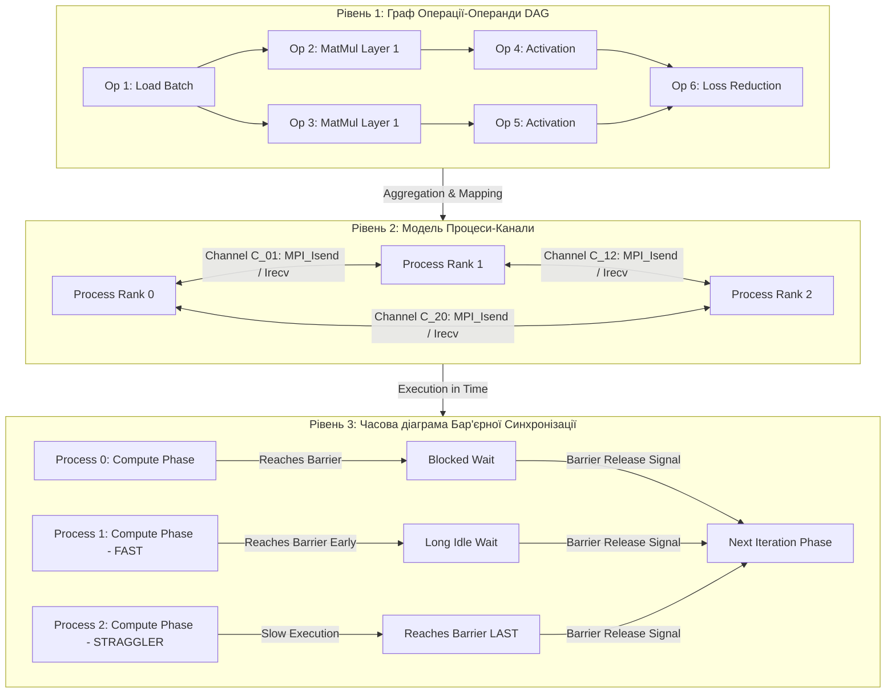

# Тема 5. Моделювання обчислювальних процесів у часі та просторі станів. Графові моделі «операції-операнди», «процеси-канали», оцінка комунікаційної трудомісткості та бар'єрна синхронізація

## 1. Основний зміст та теоретичний базис

Ефективне проєктування, аналіз та оптимізація високопродуктивних паралельних і розподілених систем вимагають суворого математичного формалізму для опису обчислювальних процесів. Здобувачі вищої освіти в межах даного освітнього компонента засвоюють фундаментальні концепції моделювання обчислень, які дають змогу абстрагуватися від конкретної апаратної реалізації та оцінити граничні можливості розпаралелювання алгоритмів. 

Моделювання паралельного обчислювального процесу здійснюється у двох часово-просторових вимірах: у **просторі станів (State Space)** та в **часовому конвеєрі (Execution Timeline)**. Простір станів обчислювальної системи репрезентує множину всіх можливих конфігурацій, яких може набувати система в процесі виконання паралельної програми. Стан системи описується вектором $S = (s_1, s_2, \dots, s_n)$, де кожен компонент $s_i$ відповідає поточному стану $i$-го автономного процесу, значенням його програмного лічильника та вмісту локальної пам'яті. Перехід системи з одного стану в інший відбувається під впливом подій — виконання дискретних операцій, відправлення чи отримання мережевих повідомлень, загарбання або звільнення системних ресурсів.

Формалізація простору станів є критично важливою для виявлення та запобігання аномаліям асинхронного паралельного виконання. До основними небезпечних станів належать:
* **Стан перегонів (Race Condition)** — ситуація, за якої підсумковий результат обчислень залежить від невизначеного порядку виконання некоординованих операцій читання та запису у спільну пам'ять різними процесами.
* **Безвихідний стан (Deadlock)** — тупикова конфігурація простору станів, за якої кожен із циклювальних процесів заблокований у чеканні ресурсу або повідомлення, що утримується іншим заблокованим процесом.
* **Стан голодування (Starvation / Livelock)** — динамічна аномалія, при якій процеси безперервно змінюють свої внутрішні стани, проте не здійснюють жодного прогресу у виконанні корисної обчислювальної роботи.

Для формального опису інформаційної структури та логіки паралельних алгоритмів у теорії обчислювальних систем застосовують два базові рівні графового моделювання: дрібноструктурну модель **«операції-операнди»** та великоструктурну модель **«процеси-канали»**.

### Модель «операції-операнди»
Модель «операції-операнди» репрезентує обчислювальний процес у вигляді орієнтованого ациклічного графа $G = (V, E)$. 

Вершини графа $V = \{v_1, v_2, \dots, v_n\}$ відповідають фундаментальним скалярним чи тензорним операціям (наприклад, додавання, множення матриць, обчислення функції активації). Орієнтовані дуги $E = \{(v_i, v_j)\}$ відображають інформаційні залежності за даними між операціями. Наявність дуги $(v_i, v_j)$ означає, що результат виконання операції $v_i$ є вхідним операндом для операції $v_j$, що задає суворий частковий порядок виконання: операція $v_j$ не може розпочатися раніше, ніж завершиться операція $v_i$.

Модель «операції-операнди» володіє властивістю суворого детермінізму за даними (**Dataflow Determinism**): підсумковий результат обчислень є абсолютно незалежним від того, у якій саме послідовності та на яких фізичних ядрах виконуються інформаційно незалежні вершини графа. Головними аналітичними параметрами DAG-моделі є:
* **Загальний обсяг робіт (Total Work) $T_1$** — сумарний час або кількість операцій, необхідних для послідовного виконання всіх вершин графа на одному процесорі.
* **Критичний шлях (Critical Path) $T_\infty$** — найдовший за часом орієнтований шлях від вхідної до вихідної вершини графа, який визначає мінімально можливий час виконання алгоритму навіть за наявності нескінченної кількості процесорних ядер.
* **Максимально досяжний паралелізм** — відношення загального обсягу робіт до довжини критичного шляху ($S_\infty = T_1 / T_\infty$).

### Модель «процеси-канали»
Якщо модель «операції-операнди» відображає дрібноструктурний паралелізм на рівні окремих математичних операторів, то модель «процеси-канали» (заснована на мережах процесів Кана та формалізмі послідовних процесів, що взаємодіють, Hoare's CSP) використовується для моделювання великоструктурного паралелізму.

У цій моделі вершини графа $P = \{p_1, p_2, \dots, p_k\}$ репрезентують автономні послідовні процеси (задачі, потоки), кожен з яких має власний стан і виконує власну програму. Орієнтовані дуги $C = \{c_1, c_2, \dots, c_m\}$ відповідають логічним комунікаційним каналам, через які процеси обмінюються повідомленнями. Канали моделюються як черги першим прийшов — першим пішов (**FIFO**) необмеженої або скінченної ємності. 

Запис у канал є неблокуючою операцією (якщо ємність не обмежена), тоді як читання з порожнього каналу є блокуючою операцією: процес-одержувач призупиняє своє виконання до моменту надходження даних від процесу-відправника. Модель «процеси-канали» лежить в основі проєктування розподілених пайплайнів, архітектур на основі акторів та міжпроцесорного обміну через специфікацію MPI.

### Оцінка комунікаційної трудомісткості та баланс обчислень
Практична реалізація графа «процеси-канали» на фізичному кластері вимагає вирішення задачі відображення (**Mapping**) логічних процесів на фізичні процесорні ядра. При цьому виникає фундаментальний компроміс між зернистістю паралелізму (**Granularity**) та комунікаційними накладними витратами.

Зернистість обчислень визначається відношенням часу виконання локальних обчислень усередині процесу до часу, витраченого на міжпроцесорну комунікацію. Для кількісної оцінки використовується **відношення комунікацій затримок до обчислень (Communication-to-Computation Ratio, CCR)**. Якщо $CCR \gg 1$, обчислювальний процес є дрібноструктурним та обмежується пропускною здатністю мережі (**Network-Bound**); якщо $CCR \ll 1$, процес є великоструктурним та обмежується потужністю обчислювальних ядер (**Compute-Bound**).

### Бар'єрна синхронізація
У багатьох паралельних ітераційних алгоритмах (наприклад, у чисельних методах сіток, математичній фізиці, алгоритмах розрахунку градієнтного спуску) виникає потреба фазового узгодження процесів. Для цього застосовується **бар'єрна синхронізація**.

Бар'єр — це точка в паралельній програмі, досягши якої кожен процес призупиняє своє подальше виконання доти, доки абсолютно всі інші процеси, що входять до даної групи комунікатора, не досягнуть цієї самої точки. Лише після зафіксованого прибуття останнього процесу бар'єр «відкривається», і всі процеси одночасно відновлюють виконання наступної ітерації.

Головною системною проблемою бар'єрної синхронізації у великомасштабних кластерах є **ефект найповільнішого процесу (Straggler Effect)**. Якщо хоча б один із $P$ процесів виконується повільніше через флуктуації мережевої латентності, апаратні помилки або дисбаланс обчислювального навантаження, усі інші $P-1$ процесів змушені марно простоювати на бар'єрі, що призводить до падіння підсумкового коефіцієнта ефективності $E_p$.

---

## 2. Математичний апарат, моделі та аналітичні залежності

### Теорема Брента
Теорема Брента дає аналітичну оцінку часу виконання паралельного алгоритму, заданого графом «операції-операнди» (DAG), на системі з $p$ фізичних процесорів за умови ідеального розкладу без урахування комунікаційних витрат.

Нехай $T_1 = W = |V|$ — загальна кількість операцій у графі (сумарна робота), а $T_\infty = L$ — довжина критичного шляху графа (висота паралельної форми). Тоді час виконання $T_p$ на $p$ процесорах задовольняє нерівності:

$$\frac{T_1}{p} \le T_p \le \frac{T_1 - T_\infty}{p} + T_\infty$$

де $T_p$ — час виконання паралельного графа на $p$ процесорах (секунди, $c$), $T_1$ — сумарний обсяг робіт графа ($FLOP$ або $c$), $T_\infty$ — довжина критичного шляху графа ($c$), $p$ — кількість доступних фізичних процесорів.

З теореми Брента випливає, що для досягнення прискорення, близького до максимального ($S_p \approx p$), необхідно, щоб обсяг робіт суттєво перевищував довжину критичного шляху: $T_1 \gg p \cdot T_\infty$.

### Математична модель оцінки комунікаційної трудомісткості
Нехай паралельний процес виконує $W_{\text{local}}$ локальних математичних операцій між комунікаційними фазами та здійснює $K$ комунікаційних обмінів повідомленнями із середнім розміром $m$ байтів.

Загальний час виконання паралельного процесу $T_p(n, p)$ з урахуванням обчислень, комунікації за моделлю Хокні та бар'єрної синхронізації описується виразом:

$$T_p(n, p) = W_{\text{local}} \cdot \tau_{\text{op}} + \sum_{k=1}^{K} \left( \alpha + \beta \cdot m_k \right) + T_{\text{barrier}}(p)$$

де $T_p(n, p)$ — загальний час виконання ітерації паралельного процесу ($c$), $W_{\text{local}}$ — кількість локальних операцій процесу, $\tau_{\text{op}}$ — середня тривалість виконання однієї базової операції ($c / FLOP$), $K$ — кількість викликів комунікаційних операцій за ітерацію, $\alpha$ — латентність мережевого з'єднання ($c$), $\beta$ — питомий час передачі одного байта ($c / \text{Byte}$), $m_k$ — розмір $k$-го повідомлення у байтах, $T_{\text{barrier}}(p)$ — часові накладні витрати на виконання бар'єрної синхронізації між $p$ процесами ($c$).

Відношення комунікаційної трудомісткості до обчислювальної $CCR$ математично виражається як:

$$CCR = \frac{T_{\text{comm}}}{T_{\text{comp}}} = \frac{\sum_{k=1}^{K} \left( \alpha + \beta \cdot m_k \right)}{W_{\text{local}} \cdot \tau_{\text{op}}}$$

Якщо $CCR > 1$, системний інженер має виконати агрегацію (укрупнення) процесів для зменшення кількості дрібних мережевих повідомлень $K$.

### Математичні моделі алгоритмів бар'єрної синхронізації

1. **Централізований бар'єр із лічильником (Centralized Counter Barrier):**
   Усі $p$ процесів атомарно інкрементують єдиний спільний лічильник у системній пам'яті. Часова складність такого бар'єра через колізії звернення до пам'яті або мережевого адаптера становить:

$$T_{\text{central\_barrier}}(p) = \mathcal{O}(p \cdot \alpha)$$

2. **Деревоподібний / Диссемінаційний бар'єр (Tree / Dissemination Barrier):**
   Процеси організуються у логічну бінарну або диссемінаційну структуру, де синхронізаційні сигнали передаються пошарово. Часова складність зменшується до логарифмічної:

$$T_{\text{tree\_barrier}}(p) = 2 \cdot \lceil \log_2 p \rceil \cdot \left( \alpha + \beta \cdot m_{\text{sync}} \right)$$

де $p$ — кількість процесів у комунікаторі, $\alpha$ — латентність мережі, $m_{\text{sync}}$ — мінімальний розмір управляючого прапорця синхронізації (зазвичай $4$ або $8$ байтів).

---

## 3. Систематизація даних та порівняльний аналіз

Для глибокої систематизації відмінностей між двома фундаментальними рівнями графового моделювання обчислювальних процесів нижче наведено порівняльну таблицю.

| Параметр порівняння | Модель «Операції-Операнди» (DAG) | Модель «Процеси-Канали» (KPN / CSP) |
| :--- | :--- | :--- |
| **Рівень абстракції та зернистість (Granularity)** | Дрібноструктурний паралелізм (мікрорівень окремих операторів та інструкцій) | Великоструктурний паралелізм (макрорівень автономних задач, потоків або сервісів) |
| **Елементи графа: Вершини** | Фундаментальні математичні/скалярні/тензорні операції ($v_i \in V$) | Незалежні послідовні процеси або обчислювальні вузли ($p_i \in P$) |
| **Елементи графа: Дуги** | Інформаційні залежності за даними (операнди) | Логічні комунікаційні канали зв'язку / FIFO-буфери ($c_i \in C$) |
| **Часовий характер зв'язків** | Суворий ациклічний частковий порядок (DAG, без циклів у часі) | Можливість наявності зворотних зв'язків, циклів та довготривалих потоків даних |
| **Детермінізм виконання** | Абсолютний детермінізм за даними (Dataflow Determinism) | Залежить від типу каналів; детермінований у KPN, потенційно недетермінований при конкуренції |
| **Основна мета використання** | Аналіз граничного паралелізму, довжини критичного шляху ($T_\infty$) та векторизації | Планування навантаження (Mapping), оптимізація комунікацій $CCR$ та розробка MPI-коду |
| **Інструментарій у програмуванні** | Обчислювальні графи PyTorch / TensorFlow, компілятори XLA / Triton | Специфікація MPI (`mpi4py`), актори (Ray, Erlang), канальна комунікація Go |

Системний аналіз табличних даних свідчить про те, що обидві моделі не виключають, а ієрархічно доповнюють одна одну. Під час розробки високопродуктивних інтелектуальних систем інженер на верхньому рівні застосовує модель **«процеси-канали»** для розподілу масштабної задачі між вузлами кластера, мінімізуючи відношення комунікацій до обчислень $CCR$. 

Водночас усередині кожного окремого процесу на обчислювальному вузлі компілятор створює граф **«операції-операнди» (DAG)**, оптимізуючи критичний шлях $T_\infty$, виконуючи зрощення (**Fusion**) операцій та векторизацію обчислень на тензорних ядрах прискорювача.

---

## 4. Візуалізація процесів та структурних зв'язків

Нижче наведено деталізовану графічну діаграму, яка ілюструє трансформацію дрібноструктурного графа «операції-операнди» у великоструктурну модель «процеси-канали», а також показує часову діаграму виконання процесів із виникненням ефекту найповільнішого процесу (Straggler Effect) під час бар'єрної синхронізації.

*Рисунок 1 — Трансформація графа «операції-операнди» у модель «процеси-канали» з часовою діаграмою бар'єрної синхронізації*

Діаграма демонструє трирівневу концепцію моделювання обчислювальних процесів. На першому рівні (DAG_Model) описується дрібноструктурний граф «операції-операнди», де вершини $v_1 \dots v_6$ відображають абсолютну залежність за даними між окремими математичними операторами. 

На другому рівні (Process_Channel_Model) відбуваються агрегація та відображення вершин DAG на автономні процеси $P_0, P_1, P_2$, які взаємодіють через логічні комунікаційні канали $C_{ij}$ за допомогою неблокуючих операцій обміну. 

На третьому рівні (Timeline_Barrier_Sync) показано розгортку обчислювального процесу в часі. Процес $P_1$ виконує свою локальну фазу швидко та входить у стан блокованого очікування (Idle Wait). Процес $P_2$ є найповільнішим процесом (**Straggler**). Усі інші процеси змушені марно простоювати на бар'єрі в очікуванні завершення обчислень процесом $P_2$. Лише після прибуття $P_2$ бар'єр генерує глобальний сигнал звільнення (Barrier Release Signal), і всі процеси одночасно переходять до наступної ітерації.

---

## 5. Питання для самоперевірки та аналітичного осмислення

1.   Які основні відмінності між простором станів (State Space) та часовою діаграмою виконання (Execution Timeline) паралельного процесу? Поясніть причини виникнення ситуації безвиході (Deadlock) у просторі станів на рівні взаємодії логічних каналів.
2.   Сформулюйте теорему Брента. Якщо граф «операції-операнди» має загальний обсяг робіт $T_1 = 1000$ операцій та довжину критичного шляху $T_\infty = 50$ операцій, обчисліть теоретичний мінімальний час виконання цієї задачі на паралельній системі з $p = 10$ процесорів та оцініть коефіцієнт прискорення $S_p$.
3.   У чому полягає фундаментальна відмінність між модельним формалізмом «операції-операнди» (DAG) та моделлю «процеси-канали» (KPN/CSP)? Чому модель «операції-операнди» є строго детермінованою за даними?
4.   Дайте визначення показника комунікаційної трудомісткості $CCR$. Якщо в результаті профілювання паралельної програми виявилося, що $CCR = 4{,}5$, які архітектурні та програмні рішення повинен прийняти системний інженер для покращення масштабованості системи?
5.   Опишіть механізм виникнення «ефекту найповільнішого процесу» (Straggler Effect) під час бар'єрної синхронізації у розподілених кластерах. Чому часова складність деревного бар'єра $\mathcal{O}(\log_2 p)$ є більш переважною порівняно з централізованим бар'єром $\mathcal{O}(p)$ у масивно-паралельних системах?
