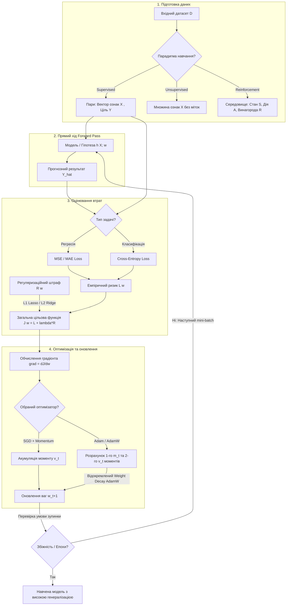

# Тема 6. Машинне навчання: концепції, оптимізація та регуляризація. Постановка задач Supervised/Unsupervised/RL. Функції втрат, градієнтний спуск, L1/L2 регуляризація

## 1. Основний зміст та теоретичний базис

Парадигма **машинного навчання (Machine Learning, ML)** репрезентує фундаментальний зсув у комп'ютерній інженерії та прикладному математичному моделюванні. На відміну від детермінованого імперативного програмування, де алгоритм побудовано на явних формальних правилах, закладених інженером, машинне навчання реалізує дата-центричний підхід. У даній концепції обчислювальна система самостійно формує функціональні залежності та виявляє приховані патерни шляхом опрацювання прецедентів — емпіричних даних. 

У межах даного освітнього компонента концептуальний базис машинного навчання систематизується за трьома провідними парадигмами навчання, які відрізняються характером зворотного зв'язку, структурою вихідної інформації та формалізацією цільової функції:

1. **Навчання з учителем (Supervised Learning).**
   Навчання з учителем спирається на наявність розміченого набору даних, де для кожного вхідного вектора ознак існує відомий істинний цільовий маркер (еталонний результат). Основною метою є побудова мапінгу (функції відображення) з простору вхідних ознак у простір цільових змінних. 
   
   Залежно від топології та природи цільового маркера, Supervised Learning розпадається на дві фундаментальні задачі:
   * **Регресія (Regression):** простір цільових значень є безперервною множиною дійсних чисел ($\mathbb{R}^k$). Прикладами є прогнозування часових рядів, визначення фізичних параметрів об'єктів або оцінювання неперервних технологічних величин.
   * **Класифікація (Classification):** простір цільових значень є дискретною множиною класів чи категорій. Залежно від кількості категорій розрізняють бінарну класифікацію, багатокласову класифікацію (**Multiclass Classification**) та багатоміткову класифікацію (**Multilabel Classification**), де об'єкт може одночасно належати до кількох категорій.

2. **Навчання без учителя (Unsupervised Learning).**
   У цій парадигмі розмітка даних повністю відсутня. Обчислювальний процес опрацьовує неструктурований простір ознак із метою виявлення внутрішньої топологічної структури, прихованих причинних зв'язків або щільності розподілу ймовірностей. 
   
   Ключовими задачами Unsupervised Learning є:
   * **Кластеризація (Clustering):** групування об'єктів у геометрично або семантично близькі кластери на основі обраної метрики відстані.
   * **Зменшення розмірності (Dimensionality Reduction):** ортогональне або нелінійне проектування високовимірного простору ознак у підпростір меншої розмірності зі збереженням максимальної дисперсії чи локальних сусідських зв'язків.
   * **Оцінювання щільності та виявлення аномалій (Density Estimation & Anomaly Detection):** ідентифікація рідкісних спостережень, що суттєво відхиляються від генеральної сукупності.

3. **Навчання з підкріпленням (Reinforcement Learning, RL).**
   Навчання з підкріпленням моделює адаптивну поведінку інтелектуального агента, який взаємодіє з динамічним (часто невизначеним) середовищем. На відміну від Supervised Learning, агент не отримує прямих вказівок про правильність кожної окремої дії. Замість цього середовище повертає скалярний сигнал винагороди або покарання у відповідь на виконані дії. Метою агента є синтез оптимальної стратегії поведінки (**Policy**), яка максимізує сумарну дисконтовану винагороду на довготривалому часовому горизонті.

Усі три парадигми об'єднує загальний концептуальний конвеєр. Для оцінювання якості роботи ML-моделі вводиться **функція втрат (Loss Function)**, що математично формалізує розмір розходження між передбаченням моделі та істинним станом. Завдання навчання моделі зводиться до задачі математичного програмування — пошуку вектора параметрів (ваг) моделі, що мінімізує емпіричний ризик на навчальній вибірці.

Процес мінімізації виконується за допомогою чисельних алгоритмів оптимізації, найважливішими з яких є варіанти **градієнтного спуску (Gradient Descent)**. Однак сліпа мінімізація втрат лише на навчальних даних призводить до ефекту **перенавчання (Overfitting)** — ситуації, коли модель «запам'ятовує» шум і конкретні деталі навчальної вибірки, втрачаючи здатність до узагальнення (**Generalization**) на нових, не бачених раніше даних. 

Для розв'язання цієї проблеми застосовують **регуляризацію (Regularization)** — накладання додаткових математичних обмежень на гладкість, норму або складність вектора параметрів моделі.

---

## 2. Математичний апарат, моделі та аналітичні залежності

### 1. Формалізація патернів даних та векторних просторів
Нехай задано навчальну вибірку $\mathcal{D} = \{(x_i, y_i)\}_{i=1}^N$, де $x_i \in \mathbb{R}^M$ — $M$-вимірний вектор ознак $i$-го об'єкта, $y_i$ — відповідний цільовий маркер, $N$ — загальний обсяг вибірки.

Модель машинного навчання представляє собою сімейство гіпотез $h(x; w)$, де $w \in \mathbb{R}^K$ — вектор внутрішніх параметрів (ваг) моделі розмінністю $K$.

### 2. Математичні моделі функцій втрат

**А. Функції втрат для задач регресії.**

* **Середньоквадратична помилка (Mean Squared Error, MSE).** Використовується при припущенні про нормальний (гаусівський) розподіл шуму в цільовій змінній. Формула має вигляд:

$$\mathcal{L}_{\text{MSE}}(w) = \frac{1}{N} \sum_{i=1}^N \left( y_i - h(x_i; w) \right)^2$$

  де $\mathcal{L}_{\text{MSE}}$ — середньоквадратична функція втрат ($\text{одиниці вимірювання } y^2$), $N$ — кількість об'єктів у вибірці, $y_i$ — істинне значення цільової змінної для $i$-го об'єкта, $h(x_i; w)$ — прогноз моделі для $i$-го об'єкта.
  
  *Властивість:* MSE сильно штрафує за великі відхилення (через наявність квадрата), що робить її чутливою до викидів (**Outliers**) у даних.

* **Середня абсолютна помилка (Mean Absolute Error, MAE).** Застосовується при розподілі Лапласа для шуму і є більш стійкою (**Robust**) до викидів:

$$\mathcal{L}_{\text{MAE}}(w) = \frac{1}{N} \sum_{i=1}^N \left| y_i - h(x_i; w) \right|$$

  де $\mathcal{L}_{\text{MAE}}$ — середня абсолютна помилка (одиниці вимірювання $y$). Градієнт MAE є константним за модулем, що може викликати нестабільність поблизу мінімуму.

**Б. Функції втрат для задач класифікації.**

* **Бінарна крос-ентропія (Binary Cross-Entropy, BCE / Log Loss).** Виводиться з принципу максимізації правдоподібності (**Maximum Likelihood Estimation, MLE**) для бернуллівського розподілу цільової змінної $y_i \in \{0, 1\}$. Прогноз моделі $\hat{y}_i = h(x_i; w) \in (0, 1)$ інтерпретується як ймовірність належності до класу $1$:

$$\mathcal{L}_{\text{BCE}}(w) = -\frac{1}{N} \sum_{i=1}^N \left[ y_i \log(\hat{y}_i) + (1 - y_i) \log(1 - \hat{y}_i) \right]$$

  де $\mathcal{L}_{\text{BCE}}$ — значення бінарної крос-ентропії (безрозмірна величина), $y_i \in \{0, 1\}$ — істинний бінарний клас, $\hat{y}_i$ — оцінена модельна ймовірність.

* **Категоріальна крос-ентропія (Categorical Cross-Entropy, CCE).** Узагальнення BCE на випадок $C$ взаємовиключних класів ($C > 2$), де $y_{i,c} \in \{0, 1\}$ — One-Hot кодований вектор цільового класу, а $\hat{y}_{i,c}$ — ймовірність класу $c$, отримана на виході функції Softmax:

$$\mathcal{L}_{\text{CCE}}(w) = -\frac{1}{N} \sum_{i=1}^N \sum_{c=1}^C y_{i,c} \log(\hat{y}_{i,c})$$

  *Зв'язок із дивергенцією Кульбака-Лейблера:* Мінімізація CCE еквівалентна мінімізації дивергенції KL між істинним емпіричним розподілом ймовірностей $P(Y|X)$ та оціненим розподілом $Q_w(Y|X)$:

$$D_{\text{KL}}(P \parallel Q_w) = \sum_{c=1}^C P(y_c) \log \frac{P(y_c)}{Q_w(y_c)} = H(P, Q_w) - H(P)$$

  де $H(P, Q_w)$ — крос-ентропія, а $H(P)$ — абсолютна ентропія істинного розподілу (константа).

### 3. Алгоритми градієнтної оптимізації
Для оновлення ваг $w$ у напрямку, протилежному до градієнта функції втрат $\nabla_w \mathcal{L}(w)$, застосовуються ітераційні схеми.

* **Класичний стохастичний градієнтний спуск (Stochastic Gradient Descent, SGD).** Оновлення ваг виконується на основі підмножини даних (mini-batch) обсягом $B$:

$$w_{t+1} = w_t - \eta \cdot g_t$$

  де $w_t$ — вектор параметрів на ітерації $t$, $\eta > 0$ — швидкість навчання (**Learning Rate**), $g_t = \nabla_w \mathcal{L}_B(w_t)$ — градієнт функції втрат, обчислений на поточним батчі $B$.

* **SGD із моментом (Momentum).**   Згладжує осциляції градієнта у вузьких ярах шляхом акумуляції векторів попередніх рухів:

$$v_{t+1} = \beta \cdot v_t + (1 - \beta) \cdot g_t$$
$$w_{t+1} = w_t - \eta \cdot v_{t+1}$$

  де $v_t$ — вектор швидкості (моменту), $\beta \in [0, 1)$ — коефіцієнт згасання моменту (зазвичай $\beta = 0.9$).

* **Адаптивний оптимізатор Adam (Adaptive Moment Estimation).**   Обєднує ідеї Momentum (перший момент градієнта) та RMSprop (другий неопосередкований момент градієнта):

$$m_t = \beta_1 \cdot m_{t-1} + (1 - \beta_1) \cdot g_t \quad \text{(оцінка експоненційного середнього)}$$
$$v_t = \beta_2 \cdot v_{t-1} + (1 - \beta_2) \cdot g_t^2 \quad \text{(оцінка експоненційного дисперсійного кроку)}$$

  Оскільки $m_0 = 0$ та $v_0 = 0$, на початкових ітераціях виконується коригування зсуву (**Bias Correction**):

$$\hat{m}_t = \frac{m_t}{1 - \beta_1^t}, \quad \hat{v}_t = \frac{v_t}{1 - \beta_2^t}$$

  Оновлення ваг здійснюється за формулою:

$$w_{t+1} = w_t - \frac{\eta}{\sqrt{\hat{v}_t} + \epsilon} \cdot \hat{m}_t$$

  де $m_t, v_t$ — вектори першого та другого моментів, $\beta_1, \beta_2$ — коефіцієнти гіперпараметрів (стандартно $\beta_1 = 0.9, \beta_2 = 0.999$), $\epsilon \approx 10^{-8}$ — мала константа для запобігання діленню на нуль.

### 4. Математичний апарат регуляризації
Регуляризація додає до цільової функції втрат додатковий штрафний доданок $\mathcal{R}(w)$, обмежений гіперпараметром $\lambda \ge 0$:

$$\mathcal{J}(w) = \mathcal{L}(w) + \lambda \cdot \mathcal{R}(w)$$

* **$L_2$-регуляризація (Ridge / Weight Decay):**
  Штрафує суму квадратів ваг, стискаючи параметри до нуля та запобігаючи надмірному зростанню амплітуди ваг:

$$\mathcal{R}_{L_2}(w) = \frac{1}{2} \|w\|_2^2 = \frac{1}{2} \sum_{j=1}^M w_j^2 \implies \nabla_w \mathcal{R}_{L_2}(w) = w$$

  Градієнтне оновлення з $L_2$-штрафом набуває вигляду:

$$w_{t+1} = w_t (1 - \eta \lambda) - \eta \nabla_w \mathcal{L}(w_t)$$

  *Байєсівська інтерпретація:* $L_2$-регуляризація еквівалентна введенню апріорного нормального (гаусівського) розподілу з нульовим середнім на ваги моделі $p(w) \sim \mathcal{N}(0, \sigma^2)$.

* **$L_1$-регуляризація (Lasso).** Штрафує суму абсолютних значень ваг, що призводить до занулення частини неефективних коефіцієнтів та забезпечення відбору ознак (**Feature Selection / Sparsity**):

  $$\mathcal{R}_{L_1}(w) = \|w\|_1 = \sum_{j=1}^M |w_j| \implies \nabla_w \mathcal{R}_{L_1}(w) = \text{sign}(w)$$

  *Байєсівська інтерпретація:* $L_1$-регуляризація еквівалентна введенню апріорного розподілу Лапласа $p(w) \sim \text{Laplace}(0, b)$.

* **ElasticNet регуляризація.**   Лінійна комбінація $L_1$ та $L_2$ штрафів для збалансування занулення та загального стиснення ваг:

  $$\mathcal{R}_{\text{ElasticNet}}(w) = \alpha \|w\|_1 + \frac{1 - \alpha}{2} \|w\|_2^2, \quad \alpha \in [0, 1]$$

---

## 3. Систематизація даних та порівняльний аналіз

Для глибокого системного порівняння математичних властивостей, швидкості збіжності та специфіки застосування алгоритмів градієнтної оптимізації нижче наведено порівняльну таблицю.

| Параметр / Алгоритм | Batch Gradient Descent (BGD) | Stochastic Gradient Descent (SGD) | SGD + Momentum | RMSprop | Adam (Adaptive Moment) | AdamW (Decoupled Weight Decay) |
| :--- | :--- | :--- | :--- | :--- | :--- | :--- |
| **Обсяг батчу для 1 кроку ($B$)** | Весь датасет ($B = N$) | 1 елемент ($B = 1$) | Mini-batch ($1 < B < N$) | Mini-batch ($1 < B < N$) | Mini-batch ($1 < B < N$) | Mini-batch ($1 < B < N$) |
| **Адаптація Learning Rate** | Відсутня (єдиний $\eta$) | Відсутня (єдиний $\eta$) | Відсутня (єдиний $\eta$) | Поелементна за $v_t$ (2-й момент) | Поелементна за $m_t$ та $v_t$ | Поелементна за $m_t$ та $v_t$ |
| **Обробка градієнтного шуму** | Шуму немає (точний градієнт) | Високий рівень шуму | Згладжування через вектор моменту | Часткове згладжування | Повне скориговане згладжування | Повне скориговане згладжування |
| **Механізм Weight Decay ($L_2$)** | Вбудований у градієнт $\mathcal{L}$ | Вбудований у градієнт $\mathcal{L}$ | Вбудований у градієнт $\mathcal{L}$ | Вбудований у градієнт $\mathcal{L}$ | Вбудований у градієнт (викликає викривлення $m_t, v_t$) | Явно відокремлений від адаптивного кроку |
| **Швидкість збіжності** | Низька (повільний 1 крок) | Низька / Нестабільна | Середня | Висока | Дуже висока | Висока (з кращою генералізацією) |
| **Сфера застосування** | Малі датасети, локальна регресія | Онлайн-навчання, виклики пам'яті | Класичні CNN, комп'ютерний зір | Рекурентні мережі (RNN/LSTM) | Загальні глибокі мережі, GAN | Трансформери (LLM), сучасний Deep Learning |

Аналіз алгоритмів оптимізації демонструє еволюцію від точного, але обчислювально витратного Batch Gradient Descent до адаптивних методів. Ключовою проблемою класичного застосування $L_2$-регуляризації в адаптивних алгоритмах (таких як Adam) є те, що штраф $L_2$ додається безпосередньо до градієнта $g_t$. У результаті скалювання на другий момент $\sqrt{\hat{v}_t}$ регуляризаційний внесок для ваг з великими адаптивними кроками зменшується, що спотворює дію $L_2$-штрафу. 

Алгоритм **AdamW** усуває цей недолік шляхом прямого віднімання $w_t \cdot \lambda$ від ваг поза розрахунком адаптивних моментів $m_t$ та $v_t$. Саме тому AdamW став стандартом для тренування великомасштабних нейромережевих моделей (LLM, ViT, Transformers).

---

## 4. Візуалізація процесів та структурних зв'язків

Для ілюстрації цілісного циклу навчання машинного навчання — від завантаження даних до обчислення Loss-функції, зворотного поширення градієнтів, адаптивної оптимізації та регуляризації — нижче наведено структурну схему.

*Рисунок 1 — Структурно-логічна схема концептуального конвеєра машинного навчання, систем оптимізації та регуляризації*

Схема показує повний замкнений цикл навчання машинного навчання. Конвеєр розпочинається з вибору парадигми та підготовки даних (`Data_Pipeline`). У режимі Supervised Learning вектор ознак $X$ передається на прямий хід у модель $h(X; w)$ (`Forward_Pass`), яка формує прогноз $\hat{Y}$. 

На етапі оцінювання втрат (`Loss_Evaluation`) обчислюється емпіричний ризик $\mathcal{L}(w)$ через MSE для регресії або Cross-Entropy для класифікації. Для запобігання перенавчанню до емпіричного ризику додається регуляризаційний штраф $\mathcal{R}(w)$ ($L_1$ або $L_2$), формуючи загальну цільову функцію $\mathcal{J}(w)$. 

На етапі зворотного ходу (`Backward_Pass`) обчислюються градієнти $\nabla_w \mathcal{J}$, які передаються в оптимізатор (SGD+Momentum або AdamW). Оптимізатор розраховує оновлення параметрів $w_{t+1}$ з урахуванням адаптивних моментів або моменту інерції. Цикл повторюється ітеративно по mini-батчах до досягнення збіжності за критерієм мінімуму функції втрат на валидаційній вибірці.

---

## 5. Питання для самоперевірки та аналітичного осмислення

1.   Математично доведіть, чому мінімізація категоріальної крос-ентропії ($\mathcal{L}_{\text{CCE}}$) для задачі багатокласової класифікації є еквівалентною максимізації логарифма функції правдоподібності (**Log-Likelihood**) та мінімізації дивергенції Кульбака-Лейблера ($D_{\text{KL}}$).
2.   Поясніть геометричну та байєсівську інтерпретацію $L_1$ (Lasso) та $L_2$ (Ridge) регуляризації. Чому використання $L_1$-штрафу призводить до точного занулення частини ваг (утворення розріджених векторів параметрів), тоді як $L_2$-штраф лише наближає ваги до нуля, але рідко робить їх точними нулями?
3.   У чому полягає математична проблема концептуального об'єднання класичного $L_2$-штрафу (Weight Decay) з адаптивними алгоритмами оптимізації типу Adam? Яким чином алгоритм AdamW розв'язує цю проблему, і як це впливає на генералізаційні властивості глибоких нейронних мереж?
4.   Проаналізуйте компроміс між зсувом та дисперсією (**Bias-Variance Tradeoff**). Як зміна обсягу навчальної вибірки $N$, складності моделі (кількості параметрів $K$) та коефіцієнта регуляризації $\lambda$ впливає на складові загальної помилки моделі?
5.   Розгляньте задачу класифікації з вираженим дисбалансом класів (наприклад, $99,9\%$ об'єктів належать до класу $0$, і $0,1\%$ — до класу $1$). Чому стандартна функція втрат Binary Cross-Entropy може виявитися неефективною в даному випадку, і які модифікації (наприклад, Weighted Cross-Entropy або Focal Loss) застосовуються для математичного вирішення цієї проблеми?
