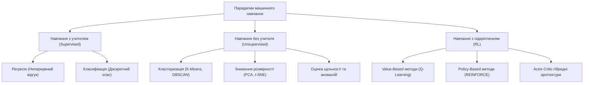
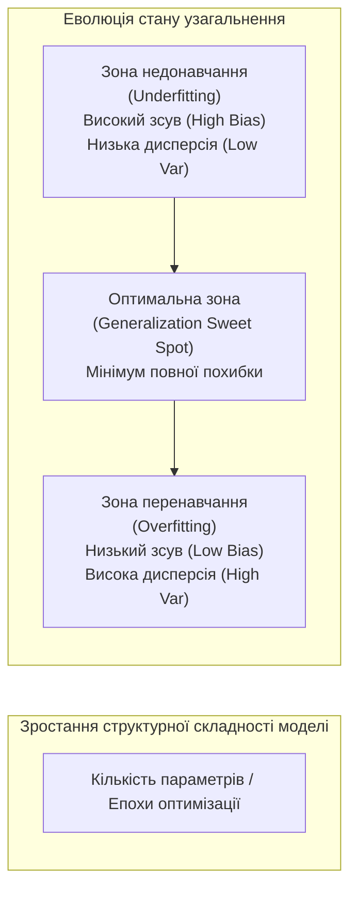
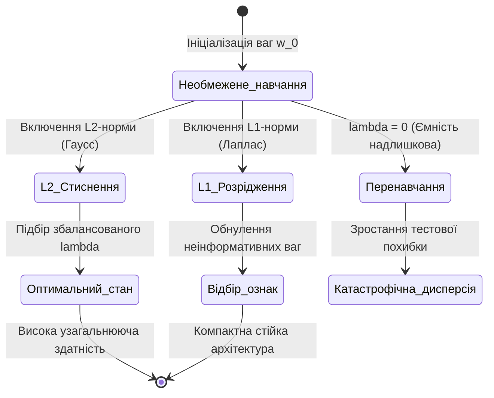
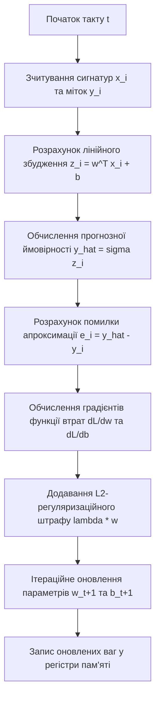

# Тема 6. Машинне навчання: концепції, оптимізація та регуляризація. Постановка задач Supervised/Unsupervised/RL, функції втрат, градієнтний спуск, L1/L2 регуляризація

## Мета лекції

Метою лекції є формування у здобувачів вищої освіти спеціальності «Комп'ютерна інженерія» фундаментальної системи знань щодо теоретичних засад, аналітичних моделей оптимізації та методів регуляризації в машинному навчанні. У межах заняття розглядаються математичні постановки базових парадигм навчання, досліджуються диференційовні функції втрат, а також розбираються чисельні алгоритми градієнтної оптимізації в просторах параметрів обчислювальних систем. Окрему увагу приділено аналізу компромісу між зсувом і дисперсією та математичному апарату подолання явища перенавчання за допомогою штрафних обмежень $L_1$ та $L_2$.

## Очікувані результати навчання

1. **Знання та розуміння.** Здобувачі вищої освіти повинні засвоїти математичні формулювання парадигм навчання з учителем, без учителя та з підкріпленням, розуміти структуру емпіричного ризику та усвідомлювати причини виникнення ефекту перенавчання за високої розмірності простору ознак.
2. **Застосування.** Студенти мають уміти коректно обирати й аналітично розраховувати функції втрат для задач регресії та класифікації, обчислювати їхні векторні градієнти, а також формулювати ітераційні кроки методів оптимізації першого порядку.
3. **Аналіз.** Слухачі курсу повинні вміти критично досліджувати компроміс між зсувом та дисперсією (Bias-Variance Tradeoff), зіставляти поведінку класичних і адаптивних оптимізаторів на неідеальних ландшафтах цільових функцій, а також аналізувати геометричні та байєсівські відмінності між $L_1$- і $L_2$-регуляризацією.
4. **Оцінювання та синтез.** Здобувачі мають набути здатності обґрунтовано проектувати алгоритми навчання з механізмами стабілізації збіжності, самостійно обирати силу регуляризаційного впливу відповідно до складності моделі та синтезувати відмовостійкі обчислювальні конвеєри машинного навчання для завдань комп'ютерної інженерії.

---

## Детальний покроковий план лекції

### 1. Теоретичний модуль. Концептуальний базис машинного навчання та проблема узагальнення

* 1.1. Парадигма машинного навчання реалізує дата-центричний підхід, замінюючи жорстко детерміноване алгоритмічне проектування процесом автоматичного виявлення прихованих закономірностей на основі емпіричних прецедентів.
* 1.2. Постановка задачі навчання з учителем формалізується як пошук відображення простору вхідних векторів ознак у неперервний простір відгуків для регресії або дискретний набір міток для класифікації.
* 1.3. Специфіка навчання без учителя та навчання з підкріпленням полягає у відсутності явної розмітки даних, що вимагає виявлення внутрішньої топологічної структури вибірки або максимізації кумулятивної винагороди агента під час динамічної взаємодії із середовищем.
* 1.4. Феномен перенавчання та узагальнююча здатність алгоритмів описуються через фундаментальну декомпозицію очікуваної помилки на компоненти зсуву, дисперсії та незвідного шуму спостережень.

### 2. Аналітичний модуль. Математичний апарат функцій втрат, методів градієнтної оптимізації та регуляризації

* 2.1. Формалізація функцій втрат для регресії та класифікації спирається на принципи максимізації правдоподібності гаусівських і бернуллівських розподілів, а також мінімізацію дивергенції Кульбака-Лейблера.
* 2.2. Математична схема градієнтного спуску та його стохастичних модифікацій описує оновлення вектора параметрів моделі в напрямку антиградієнта функції втрат.
* 2.3. Адаптивні алгоритми оптимізації акумулюють перші та другі моменти градієнтів для динамічної зміни кроку навчання вздовж кожного координатного напрямку та подолання ярів цільової функції.
* 2.4. Геометричний та байєсівський аналіз $L_1$- і $L_2$-регуляризації демонструє механізм утворення розріджених векторів параметрів у методі Lasso та пропорційного стиснення амплітуди ваг у гребеневій регресії.
* 2.5. Модель відокремленого затухання ваг в алгоритмі AdamW усуває деформацію регуляризаційного штрафу, що спричинена масштабуванням градієнта на другий момент у класичному підході Adam.

### 3. Практично-розрахунковий кейс. Оптимізація та регуляризація класифікаційної моделі

**Тема наскрізної задачі.** «Синтез та розрахунок параметричної збіжності регуляризованої логістичної регресії для високошвидкісної класифікації сигнатур мережевого трафіку у вбудованих обчислювальних вузлах»

## 1. Фундаментальний теоретичний базис та концептуальні засади

### 1.1. Еволюція парадигм: від класичного детермінованого програмування до дата-центричного машинного навчання

Розвиток обчислювальної техніки та прикладної математики протягом десятиліть базувався на парадигмі класичного детермінованого програмування, сформованій у межах архітектури фон Неймана. У цій традиційній парадигмі інженер-дослідник володіє вичерпним аналітичним або феноменологічним описом досліджуваної предметної області. Він самостійно формулює строгий детермінований алгоритм, транслюючи математичну модель у послідовність машинних інструкцій. Подібний підхід демонструє граничну ефективність у задачах із чітко формалізованою аксіоматикою — таких як чисельне інтегрування диференціальних рівнянь, лінійна алгебра чи структурні симуляції фізичних систем.

Проте під час розв'язання задач перцептивного характеру, опрацювання мультимедійних потоків, ідентифікації складних стохастичних залежностей та аналізу багатовимірних сенсорних даних у реальних комп'ютерних комплексах детермінована модель натрапляє на нездоланні труднощі. Головною причиною є так званий бар'єр комбінаторної складності, за якого кількість нелінійних зв'язків та варіантів стану системи перевищує можливості їхнього ручного алгоритмічного опису. У таких умовах виникає необхідність заміни класичного алгоритмічного підходу на **машинне навчання (Machine Learning)**, що реалізує індуктивну, дата-центричну концепцію проектування обчислювальних процесів.

Фундаментальне формальне визначення процесу комп'ютерного навчання запропонував Том Мітчелл: комп'ютерна програма навчається на основі отриманого досвіду $E$ стосовно деякого класу задач $T$ та критерію ефективності $P$, якщо якість розв'язання задач із множини $T$, оцінена за метрикою $P$, монотонно зростає зі збільшенням обсягу накопиченого досвіду $E$. 

У термінах теорії ймовірностей та обчислювальної статистики задача машинного навчання формалізується через припущення про існування фіксованого, але невідомого спільного розподілу ймовірностей $\mathcal{D}$ над простором вхідних об'єктів $\mathcal{X}$ та цільових значень $\mathcal{Y}$. Навчальна вибірка формується як набір незалежних однаково розподілених спостережень, отриманих із цього розподілу:

$$S = \left\{ (x_i, y_i) \right\}_{i=1}^N \sim \mathcal{D}^{N}, \quad x_i \in \mathcal{X} \subseteq \mathbb{R}^d, \quad y_i \in \mathcal{Y}$$

У наведеній математичній моделі використовуються такі аналітичні змінні:
* Змінна $S$ позначає скінченну навчальну вибірку емпіричних спостережень, яка має тип структурного масиву пар векторів та цільових значень.
* Змінна $N$ визначає цілочисельний розмір емпіричної вибірки, тобто сумарну кількість доступних прецедентів для підбору внутрішніх параметрів системи.
* Символ $\mathcal{D}^{N}$ позначає $N$-кратний добуток істинного генерального розподілу ймовірностей над простором прецедентів, з якого незалежно генерується кожне спостереження.
* Вектор $x_i$ являє собою $d$-вимірний вектор числових або закодованих ознак $i$-го об'єкта, що належить підпростору дійсних чисел $\mathbb{R}^d$.
* Символ $y_i$ репрезентує скалярне або векторне еталонне цільове значення, що зіставлене $i$-му об'єкту у вихідному просторі відгуків $\mathcal{Y}$.

Перехід до дата-центричної схеми докорінно трансформує інформаційний потік в архітектурі обчислювальної системи, що схематично відображено на рисунку нижче:


### 1.2. Формалізація навчання з учителем: регресійний та класифікаційний аналіз

Парадигма **навчання з учителем (Supervised Learning)** є найбільш строгим і аналітично опрацьованим класом методів штучного інтелекту. Її головна відмінність полягає в тому, що кожному прецеденту вхідного простору ознак однозначно зіставлено істинний еталонний маркер (supervisor feedback), наданий зовнішнім джерелом або експертною системою. Метою процесу є відшукання серед заданого параметричного сімейства гіпотез $\mathcal{H}$ функції відображення $h(x; w): \mathcal{X} \to \mathcal{Y}$, яка мінімізує відхилення від істинного значення не лише на навчальній множині, але й на всій генеральній сукупності $\mathcal{D}$.

Залежно від топології та алгебраїчної природи множини відгуків $\mathcal{Y}$, задачі навчання з учителем поділяються на дві магістральні категорії:

1. **Задачі регресійного аналізу (Regression Analysis).** Простір вихідних значень є неперервною множиною дійсних чисел $\mathcal{Y} \subseteq \mathbb{R}^k$. У задачах комп'ютерної інженерії регресія моделює такі фізичні величини, як затримки передачі сигналів у лініях комутації, температуру кристалів багатоядерних процесорів, енергоспоживання вузлів кластера або неперервні амплітуди оброблюваних сигналів.
2. **Задачі класифікаційного аналізу (Classification Analysis).** Простір вихідних значень є дискретною скінченною множиною взаємовиключних категорійних міток $\mathcal{Y} = \{1, 2, \dots, C\}$. У бінарній класифікації ($C = 2$) відгук інтерпретується як булева ідентифікація наявності чи відсутності ознаки (наприклад, детекція аномальних пакетів у мережевому трафіку). У випадку багатокласової задачі ($C > 2$) цільовий простір часто перетворюється у ймовірнісний симплекс $\Delta^{C-1}$, де координати вихідного вектора моделі відображають апостеріорні ймовірності належності об'єкта до кожного окремого класу.

Для кількісної оцінки якості обраної гіпотези вводиться **функція втрат (Loss Function)** $L(h(x; w), y): \mathcal{Y} \times \mathcal{Y} \to \mathbb{R}_{\ge 0}$, яка зіставляє парі «прогноз — еталон» невід'ємне штрафне значення. Тоді **істинний (генералізаційний) ризик (True Risk)** моделі визначається як математичне сподівання функції втрат за генеральним розподілом $\mathcal{D}$:

$$R(w) = \mathbb{E}_{(x, y) \sim \mathcal{D}} \left[ L(h(x; w), y) \right] = \int_{\mathcal{X} \times \mathcal{Y}} L(h(x; w), y) \, dP(x, y)$$

У цій інтегральній рівності використовуються такі математичні позначення:
* Величина $R(w)$ визначає істинний інтегральний функціонал ризику моделі як скалярну безрозмірну міру помилки на всій генеральній сукупності.
* Символ $\mathbb{E}_{(x, y) \sim \mathcal{D}}$ позначає оператор математичного сподівання за невідомим спільним розподілом ймовірностей спостережень і міток.
* Функція $L(h(x; w), y)$ являє собою конкретну метричну функцію втрат, що повертає невід'ємне дійсне число за допущене моделлю розходження.
* Вектор $w \in \mathbb{R}^p$ містить параметри (ваги) моделі розмірності $p$, конфігурація яких однозначно задає обрану гіпотезу із простору $\mathcal{H}$.
* Міра $dP(x, y)$ визначає елементарну ймовірнісну міру над декартовим добутком просторів ознак та цільових значень $\mathcal{X} \times \mathcal{Y}$.

Оскільки спільний розподіл $P(x, y)$ у реальних прикладних задачах апріорі невідомий, пряме обчислення істинного ризику $R(w)$ є неможливим. Замість нього застосовують принцип **мінімізації емпіричного ризику (Empirical Risk Minimization, ERM)**, що обчислює середнє арифметичне значення штрафів на скінченній навчальній вибірці:

$$R_{\text{emp}}(w) = \frac{1}{N} \sum_{i=1}^N L(h(x_i; w), y_i)$$

Згідно із законом великих чисел, при прямуванні обсягу вибірки до нескінченності ($N \to \infty$) емпіричний ризик збігається за ймовірністю до істинного ризику. Проте на скінченних вибірках необмежена мінімізація $R_{\text{emp}}(w)$ створює загрозу виродження моделі, коли мінімум емпіричного ризику супроводжується різким зростанням істинного ризику $R(w)$.

### 1.3. Принципи навчання без учителя та навчання з підкріпленням

На відміну від задач із зовнішнім навчальним сигналом, **навчання без учителя (Unsupervised Learning)** оперує нерозміченими масивами даних $\mathcal{D}_X = \{x_i\}_{i=1}^N$, де цільові маркери $y_i$ повністю відсутні. Головною метою цієї парадигми є вивчення внутрішньої структури розподілу даних $p(x)$, знаходження прихованих зв'язків та вилучення компактних представлень інформації. 

В обчислювальній практиці задачі навчання без учителя формалізуються за такими напрямками:

1. **Кластеризація (Clustering).** Поділ вхідного простору векторів на $K$ неперетинних або м'яких кластерів $\{C_1, C_2, \dots, C_K\}$, де об'єкти всередині одного кластера мають мінімальну попарну відстань у заданій метриці, а відстані між різними кластерами є максимальними.
2. **Зниження розмірності (Dimensionality Reduction).** Побудова проекційного оператора $\psi: \mathbb{R}^D \to \mathbb{R}^d$, де $d \ll D$, зі збереженням максимального рівня дисперсії вхідного сигналу або топологічної структури вкладеного многовиду (manifold learning). Це критично важливо для стиснення даних, усунення колізій та візуалізації станів багатовимірних систем.
3. **Оцінювання щільності (Density Estimation).** Ідентифікація функції густини ймовірності $p(x)$, що дає змогу виявляти аномалії в роботі апаратних компонентів системи через фіксацію прецедентів з низькою ймовірністю генерації.

Принципово іншу архітектуру взаємодії репрезентує **навчання з підкріпленням (Reinforcement Learning, RL)**. Тут навчальний суб'єкт розглядається як активний автономний **агент (Agent)**, занурений у динамічне стохастичне **середовище (Environment)**. Процес взаємодії моделюється як **марковський процес прийняття рішень (Markov Decision Process, MDP)**, що формалізується кортежем:

$$\mathcal{M} = \langle \mathcal{S}, \mathcal{A}, \mathcal{P}, \mathcal{R}, \gamma \rangle$$

У зазначеному формальному кортежі елементи мають таку математичну сутність:
* Множина $\mathcal{S}$ позначає повний простір можливих дискретних або неперервних станів динамічного середовища, у якому перебуває агент.
* Множина $\mathcal{A}$ репрезентує простір дій, доступних агенту для виконання в довільний дискретний момент часу.
* Тензор $\mathcal{P}(s' \mid s, a) = \mathbb{P}(S_{t+1} = s' \mid S_t = s, A_t = a)$ визначає ймовірність переходу системи в новий стан $s'$ за умови виконання дії $a$ у стані $s$.
* Функція $\mathcal{R}(s, a, s')$ являє собою скалярну детерміновану або стохастичну функцію винагороди, що повертає числову реакцію середовища на перехід.
* Коефіцієнт $\gamma \in [0, 1)$ позначає коефіцієнт дисконтування, що математично задає пріоритет миттєвих винагород над віддаленими в часі виграшами.

Агент керується внутрішньою **стратегією (Policy)** $\pi(a \mid s) = \mathbb{P}(A_t = a \mid S_t = s)$, оптимізуючи її з метою максимізації математичного сподівання кумулятивного дисконтованого виграшу на часовому горизонті функціонування:

$$G_t = \sum_{k=0}^{\infty} \gamma^k R_{t+k+1}$$

Де змінна $G_t$ позначає сумарну дисконтовану віддачу агента починаючи з моменту часу $t$, а $R_{t+k+1}$ — значення скалярної винагороди, отриманої на кроці $t+k+1$.

Архітектурні зв'язки між усіма базовими класами систем штучного інтелекту унаочнює наведена класифікаційна діаграма:



Для чіткої систематизації відмінностей між зазначеними парадигмами їхні характеристики зведено в порівняльну таблицю:

| Парадигма навчання | Вхідна інформаційна структура | Характер зворотного зв'язку | Критерій цільової оптимізації | Типові інженерні задачі в галузі |
| :--- | :--- | :--- | :--- | :--- |
| **Supervised Learning** | Вектори ознак із явними цільовими мітками $(x_i, y_i)$ | Безпосередня похибка між виходом $h(x)$ та істинним $y$ | Мінімізація емпіричного ризику на заданій вибірці | Прогнозування тепловиділення, розпізнавання образів, бінарна діагностика вузлів |
| **Unsupervised Learning** | Неструктуровані масиви спостережень без міток $\{x_i\}$ | Повністю відсутній; самоорганізація за метрикою | Максимізація правдоподібності або мінімізація втрат стиснення | Компресія даних у шинах пам'яті, сегментація абонентів, детекція зламів систем |
| **Reinforcement Learning** | Стани динамічного фізичного або цифрового середовища $S_t$ | Затриманий у часі скалярний сигнал винагороди чи штрафу $R_t$ | Максимізація інтегральної дисконтованої віддачі $G_t$ | Адаптивне динамічне керування маршрутизацією, оптимізація частоти ядер процесорів |
| **Semi-Supervised Learning** | Великий обсяг нерозмічених даних і мала розмічена підмножина | Частковий зворотний зв'язок на окремих прецедентах | Узгодження розділювальної межі з геометрією щільності | Медична діагностика, аудит безпеки великих сховищ інформації |
| **Self-Supervised Learning** | Нерозмічені сирі послідовності (текст, код, телеметрія) | Псевдомітки, сгенеровані із контексту самих вхідних даних | Мінімізація втрат передбачення прихованих фрагментів | Попереднє тренування великих мовних моделей, аналіз черг комп'ютерних шин |

### 1.4. Проблема перенавчання, недонавчання та компроміс зсуву і дисперсії (Bias-Variance Decomposition)

Центральною проблемою теорії навчання машин є досягнення високої **узагальнюючої здатності (Generalization Ability)** алгоритму, тобто збереження низького рівня помилки на нових наборах тестових даних, які не входили до навчального датасету $S$. У процесі оптимізації моделі параметричний простір може демонструвати два граничні патологічні стани:

1. **Недонавчання (Underfitting).** Стан, за якого обране сімейство гіпотез $\mathcal{H}$ є занадто простим (має малу ємність або структурну потужність), через що модель неспроможна виявити навіть домінуючі регулярні патерни у навчальних даних. У цьому разі спостерігається високий рівень похибки як на навчальному, так і на валідаційному наборах даних.
2. **Перенавчання (Overfitting).** Стан, за якого надмірно складна модель із надлишковим числом вільних параметрів повністю підлаштовується під випадкові стохастичні шуми та специфічні артефакти навчальної вибірки. У цій ситуації емпіричний ризик $R_{\text{emp}}(w)$ наближається до нуля, проте істинний ризик $R(w)$ катастрофічно зростає, роблячи модель абсолютно непридатною для практичної експлуатації.

Аналітичну природу цього явища розкриває класична **теорема про декомпозицію зсуву та дисперсії (Bias-Variance Decomposition)**. Нехай залежність у даних описується істинною функцією $f(x)$ за наявності адитивного стохастичного шуму спостереження:

$$y = f(x) + \epsilon, \quad \mathbb{E}[\epsilon] = 0, \quad \text{Var}(\epsilon) = \sigma^2$$

Тут величина $\epsilon$ є випадковою величиною стохастичного шуму з нульовим середнім, а параметр $\sigma^2$ визначає незвідну дисперсію помилки вимірювань. 

Припустимо, що за допомогою обраного алгоритму на базі випадкової навчальної вибірки $S$ отримано оцінку $\hat{f}(x; S)$. Розглянемо очікувану середньоквадратичну похибку моделі в довільній фіксованій точці $x$ за всіма можливими навчальними підвибірками $S$:

$$\mathbb{E}_{S, \epsilon} \left[ (y - \hat{f}(x; S))^2 \right] = \text{Bias}^2(\hat{f}(x)) + \text{Var}(\hat{f}(x)) + \sigma^2$$

Аналітичне розгортання даної рівності демонструє її внутрішню структуру:

$$\mathbb{E}_{S, \epsilon} \left[ (y - \hat{f}(x; S))^2 \right] = \left( f(x) - \mathbb{E}_S[\hat{f}(x; S)] \right)^2 + \mathbb{E}_S \left[ \left( \hat{f}(x; S) - \mathbb{E}_S[\hat{f}(x; S)] \right)^2 \right] + \sigma^2$$

Складові елементи отриманого розкладу інтерпретуються наступним чином:
* Доданок $\text{Bias}^2(\hat{f}(x)) = \left( f(x) - \mathbb{E}_S[\hat{f}(x; S)] \right)^2$ позначає **зсув (Bias)** моделі, тобто різницю між істинною цільовою функцією та середнім прогнозом гіпотези, усередненим за всіма можливими навчальними вибірками однакового розміру. Високий зсув є індикатором недонавчання через структурну невідповідність моделі.
* Доданок $\text{Var}(\hat{f}(x)) = \mathbb{E}_S \left[ \left( \hat{f}(x; S) - \mathbb{E}_S[\hat{f}(x; S)] \right)^2 \right]$ позначає **дисперсію (Variance)** моделі, що кількісно оцінює чутливість прогнозу до випадкових флуктуацій навчальної вибірки $S$. Висока дисперсія свідчить про надмірну лабільність системи і слугує маркером перенавчання.
* Доданок $\sigma^2$ репрезентує **незвідну похибку (Irreducible Error)**, викликану фундаментальною ентропією самого фізичного процесу або шумом сенсорів, зменшити яку в межах обраного простору ознак математично неможливо.

Компроміс між зсувом та дисперсією демонструє обернену взаємодію: спроби знизити зсув шляхом ускладнення параметричної архітектури моделі неминуче призводять до зростання її дисперсії, і навпаки. Оптимальна обчислювальна схема моделі повинна досягати балансу, мінімізуючи сумарну похибку, що зображено на діаграмі життєвого циклу навчання:



> **ТИПОВА ПОМИЛКА:** Серед інженерів-початківців поширена омана, що досягнення нульової похибки моделі на навчальній вибірці ($R_{\text{emp}}(w) = 0$) є показником ідеальної якості побудованої системи штучного інтелекту. Насправді рівність емпіричного ризику нулю у складних багатопараметричних моделях майже завжди вказує на деструктивне перенавчання (Overfitting). У цьому стані модель не здійснює індуктивного узагальнення знань, а просто запам'ятовує координати об'єктів разом зі стохастичним шумом вибірки, що призводить до повної втрати працездатності системи на нових реальних даних.

> **КОНТРОЛЬНЕ ПИТАННЯ.** Чому при фіксованому обсязі навчальної вибірки $N$ необмежене розширення простору ознак шляхом генерації поліноміальних взаємодій високого порядку веде спочатку до зменшення похибки апроксимації, а потім до катастрофічного зростання похибки прогнозу на тестових даних?

<details markdown="1">
<summary>Розгорнути відповідь</summary>

Описаний ефект пояснюється теоремою про декомпозицію зсуву та дисперсії, а також фундаментальним феноменом «прокляття розмірності» (Curse of Dimensionality). 

1. Формальне обґрунтування через ємність моделі:

$$E_{\text{total}} = \text{Bias}^2(\hat{f}) + \text{Var}(\hat{f}) + \sigma^2$$

При додаванні поліноміальних ознак зростає ємність простору гіпотез $\mathcal{H}$ (що формально оцінюється розмірністю Вапніка-Червоненкіса $\text{VC}(\mathcal{H})$). Це дозволяє моделі формувати складні нелінійні розділювальні поверхні, знижуючи системний зсув $\text{Bias}^2(\hat{f}) \to 0$. Проте об'єм високовимірного простору зростає експоненційно відносно кількості ознак, внаслідок чого фіксована вибірка з $N$ прецедентів стає вкрай розрідженою.

2. Аналіз складових похибки:

    * Зсув моделі зменшується, оскільки поліноміальний базис високого степеня теоретично здатний наблизити довільну неперервну функцію з будь-якою наперед заданою точністю.
    * Дисперсія $\text{Var}(\hat{f})$ різко зростає через надлишкову чутливість моделі до вибіркових варіацій, коли незначна зміна одного прецеденту в навчальному наборі зумовлює суттєву осциляцію розрахункових вагових коефіцієнтів.
    * Повна очікувана помилка на нових даних, будучи сумою квадрата зсуву і дисперсії, починає домінуватися експоненційно зростаючою дисперсією, що й формує параболоподібну криву генералізаційної втрати.

</details>

### Вказівки для самостійного осмислення теоретичного базису

1. Порівняльний аналіз парадигми мінімізації емпіричного ризику (ERM) та принципу мінімізації структурного ризику (SRM) демонструє, що накладання апріорних обмежень на топологічну місткість класу гіпотез є математичною необхідністю для забезпечення стійкості узагальнення.
2. Дослідження поведінки агентів у марковських процесах прийняття рішень вимагає чіткого усвідомлення ролі коефіцієнта дисконтування $\gamma$, оскільки його значення безпосередньо балансує локальну вигоду найближчого кроку та глобальну стратегічну стабільність поведінки системи.
3. Осмислення декомпозиції похибки спонукає інженера комп'ютерних систем розглядати процес регуляризації не просто як евристичне згладжування ваг, а як цілеспрямоване внесення керованого малого зсуву для радикального пригнічення нестабільної дисперсії моделі.

## 2. Аналітичні процеси, математичний апарат та моделювання

### 2.1. Аналітична формалізація функцій втрат: принципи правдоподібності та теорія інформації

Вибір функції втрат у машинному навчанні не є евристичним рішенням, а базується на фундаментальних положеннях теорії ймовірностей та математичної статистики. Базовим аналітичним інструментом для виведення цільових функцій є метод **максимальної правдоподібності (Maximum Likelihood Estimation, MLE)**. Відповідно до принципу MLE, оптимальний вектор параметрів моделі $w^*$ максимізує ймовірність генерації спостережуваної вибірки даних $S = \{(x_i, y_i)\}_{i=1}^N$. За умови незалежності та однакової розподіленості прецедентів спільна функція правдоподібності факторизується в добуток умовних щільностей розподілу:

$$L(w) = \prod_{i=1}^N p(y_i \mid x_i; w)$$

Для спрощення аналітичних викладок та усунення проблеми зникнення порядку чисел при обчисленнях на комп'ютерних системах переходять до мінімізації від'ємного логарифма правдоподібності (Negative Log-Likelihood, NLL), що перетворює операцію множення на суму:

$$\mathcal{L}_{\text{NLL}}(w) = -\ln L(w) = -\sum_{i=1}^N \ln p(y_i \mid x_i; w)$$

Розглянемо аналітичне виведення **середньоквадратичної помилки (Mean Squared Error, MSE)** для задач регресійного аналізу в умовах наявності адитивного гаусівського шуму.

$$
\begin{aligned}
\text{Етап 1 (Формулювання щільності ймовірності):} & \quad p(y_i \mid x_i; w) = \frac{1}{\sqrt{2\pi\sigma^2}} \exp\left( -\frac{(y_i - h(x_i; w))^2}{2\sigma^2} \right) \\
\text{Етап 2 (Логарифмування функції правдоподібності):} & \quad \ln L(w) = -\frac{N}{2} \ln(2\pi\sigma^2) - \frac{1}{2\sigma^2} \sum_{i=1}^N (y_i - h(x_i; w))^2 \\
\text{Етап 3 (Інверсія знака та редукція констант):} & \quad \arg\min_w \mathcal{L}_{\text{NLL}}(w) = \arg\min_w \left[ \frac{1}{N} \sum_{i=1}^N (y_i - h(x_i; w))^2 \right] = \mathcal{L}_{\text{MSE}}(w)
\end{aligned}
$$

У наведеному аналітичному виведенні використовуються такі математичні величини:
* Величина $p(y_i \mid x_i; w)$ визначає умовну щільність ймовірності отримання неперервного значення відгуку $y_i$ за заданого вектора ознак $x_i$ та параметрів моделі $w$.
* Символ $\sigma^2$ репрезентує дисперсію нормального розподілу стохастичного шуму вимірювань, виражену в одиницях квадрата цільової змінної.
* Функція $h(x_i; w)$ задає детермінований прогноз моделі для $i$-го спостереження, який формується у просторі дійсних чисел $\mathbb{R}$.
* Функціонал $\mathcal{L}_{\text{MSE}}(w)$ визначає середньоквадратичну функцію втрат, що вимірюється у квадратичних одиницях цільової величини.

Для задач бінарної класифікації цільова змінна приймає значення $y_i \in \{0, 1\}$ і підпорядковується розподілу Бернуллі з параметром $\hat{y}_i = \sigma(z_i) = (1 + e^{-z_i})^{-1}$, де $z_i = h(x_i; w)$. Імовірнісна щільність окремого спостереження записується як:

$$p(y_i \mid x_i; w) = \hat{y}_i^{y_i} (1 - \hat{y}_i)^{1 - y_i}$$

Логарифмування та зміна знака формують **бінарну крос-ентропію (Binary Cross-Entropy, BCE)**:

$$\mathcal{L}_{\text{BCE}}(w) = -\frac{1}{N} \sum_{i=1}^N \left[ y_i \ln(\hat{y}_i) + (1 - y_i) \ln(1 - \hat{y}_i) \right]$$

У цьому виразі використовуються такі змінні:
* Параметр $y_i \in \{0, 1\}$ є цілочисельним індикатором істинного класу об'єкта.
* Змінна $\hat{y}_i \in (0, 1)$ являє собою безрозмірну ймовірність належності до додатного класу, згенеровану логістичною сигмоїдою.
* Значення $\mathcal{L}_{\text{BCE}}(w)$ визначає ентропійні втрати класифікації, виражені в натах або бітах.

В умовах багатокласової класифікації на $C$ категорій розподіл виходів моделі формується оператором Softmax:

$$\hat{y}_{i,c} = \frac{\exp(z_{i,c})}{\sum_{k=1}^C \exp(z_{i,k})}$$

Мінімізація **категоріальної крос-ентропії (Categorical Cross-Entropy, CCE)** має прямий зв'язок із теорією інформації через **дивергенцію Кульбака-Лейблера (Kullback-Leibler Divergence, $D_{\text{KL}}$)**:

$$
\begin{aligned}
\text{Етап 1 (Визначення дивергенції):} & \quad D_{\text{KL}}(P_i \parallel Q_i) = \sum_{c=1}^C y_{i,c} \ln\left( \frac{y_{i,c}}{\hat{y}_{i,c}} \right) \\
\text{Етап 2 (Декомпозиція на ентропії):} & \quad D_{\text{KL}}(P_i \parallel Q_i) = \sum_{c=1}^C y_{i,c} \ln(y_{i,c}) - \sum_{c=1}^C y_{i,c} \ln(\hat{y}_{i,c}) = -H(P_i) + H(P_i, Q_i) \\
\text{Етап 3 (Гранична поведінка та оптимізація):} & \quad \lim_{\hat{y}_{i,c} \to y_{i,c}} D_{\text{KL}}(P_i \parallel Q_i) = 0 \implies \arg\min_w D_{\text{KL}} = \arg\min_w H(P_i, Q_i) = \mathcal{L}_{\text{CCE}}(w)
\end{aligned}
$$

У наведених рівняннях фігурують такі компоненти:
* Величина $D_{\text{KL}}(P_i \parallel Q_i)$ задає квазіметричну відстань між істинним розподілом $P_i$ та прогнозним розподілом $Q_i$.
* Змінна $y_{i,c} \in \{0, 1\}$ позначає елемент унітарного One-Hot вектора, який дорівнює одиниці лише для істинного класу $c$.
* Компонента $\hat{y}_{i,c}$ являє собою розраховану моделлю ймовірність приналежності об'єкта до класу $c$.
* Функція $H(P_i)$ є власною ентропією Шеннона апріорного розподілу, яка є незмінною константою щодо параметрів $w$.
* Функція $H(P_i, Q_i)$ визначає перехресну ентропію розподілів, мінімізація якої гарантує збіжність модельного розподілу до емпіричного.

---

### 2.2. Математичний апарат градієнтного спуску та його стохастичних модифікацій

Мінімізація диференційовного емпіричного ризику $\mathcal{L}(w)$ в евклідовому просторі параметрів $\mathbb{R}^p$ здійснюється за допомогою методів локальної лінійної апроксимації. Класичний **градієнтний спуск (Gradient Descent, GD)** базується на ітераційному зміщенні вздовж вектора антиградієнта:

$$w_{t+1} = w_t - \eta \nabla_w \mathcal{L}(w_t)$$

Де вектор $w_t \in \mathbb{R}^p$ визначає просторові координати ваг на кроці $t$, скаляр $\eta > 0$ задає швидкість навчання (Learning Rate), а $\nabla_w \mathcal{L}(w_t)$ є вектором часткових похідних функції втрат.

Дослідимо аналітичну збіжність градієнтного спуску для класу $L$-гладких та $\mu$-сильно опуклих функцій. Функція $\mathcal{L}(w)$ задовольняє умову $L$-гладкості (Ліпшицева неперервність градієнта), якщо для довільних $u, v \in \mathbb{R}^p$ виконується нерівність:

$$\|\nabla \mathcal{L}(u) - \nabla \mathcal{L}(v)\| \le L \|u - v\| \implies \mathcal{L}(v) \le \mathcal{L}(u) + \langle \nabla \mathcal{L}(u), v - u \rangle + \frac{L}{2} \|v - u\|^2$$

Підставимо формулу ітераційного кроку градієнтного спуску $w_{t+1} - w_t = -\eta \nabla \mathcal{L}(w_t)$ у квадратичну мажоранту Ліпшиця:

$$
\begin{aligned}
\text{Етап 1 (Підстановка кроку оптимізатора):} & \quad \mathcal{L}(w_{t+1}) \le \mathcal{L}(w_t) - \eta \|\nabla \mathcal{L}(w_t)\|^2 + \frac{\eta^2 L}{2} \|\nabla \mathcal{L}(w_t)\|^2 \\
\text{Етап 2 (Факторизація градієнтного множника):} & \quad \mathcal{L}(w_{t+1}) \le \mathcal{L}(w_t) - \eta \left( 1 - \frac{\eta L}{2} \right) \|\nabla \mathcal{L}(w_t)\|^2 \\
\text{Етап 3 (Оптимізація довжини кроку):} & \quad \frac{d}{d\eta} \left( \eta - \frac{\eta^2 L}{2} \right) = 1 - \eta L = 0 \implies \eta_{\text{opt}} = \frac{1}{L}
\end{aligned}
$$

При виборі $\eta = \frac{1}{L}$ гарантується монотонне монополічне спадання функції втрат на кожній ітерації:

$$\mathcal{L}(w_{t+1}) \le \mathcal{L}(w_t) - \frac{1}{2L} \|\nabla \mathcal{L}(w_t)\|^2$$

Для $\mu$-сильно опуклої функції (де виконується умова $\mathcal{L}(v) \ge \mathcal{L}(u) + \langle \nabla \mathcal{L}(u), v - u \rangle + \frac{\mu}{2} \|v - u\|^2$) градієнтний спуск зі швидкістю $\eta = \frac{2}{L + \mu}$ демонструє лінійну швидкість збіжності за геометричною прогресією:

$$\|w_t - w^*\| \le \left( \frac{\kappa - 1}{\kappa + 1} \right)^t \|w_0 - w^*\|, \quad \kappa = \frac{L}{\mu}$$

Де безрозмірна величина $\kappa \ge 1$ є числом обумовленості матриці Гессе в околі екстремуму. 

Аналітичний розрахунок граничної поведінки показує:

$$\lim_{t \to \infty} \left( \frac{\kappa - 1}{\kappa + 1} \right)^t = 0 \quad \text{при } \kappa < \infty$$

Однак при $\kappa \gg 1$ (наявність сильно витягнутих долин з анізотропною кривизною) знаменник наближається до чисельника, що викликає різке уповільнення збіжності та паразитні поперечні осциляції траєкторії.

Для подолання обчислювальної складності повнопакетного розрахунку на вибірках розміру $N$ застосовують **стохастичний градієнтний спуск (Stochastic Gradient Descent, SGD)** та його пакетну модифікацію (**Mini-batch SGD**), де оцінка градієнта здійснюється на випадковій підмножині $\mathcal{B}_t \subset S$ потужністю $B = |\mathcal{B}_t|$:

$$g_t = \nabla_w \mathcal{L}_{\mathcal{B}_t}(w_t) = \frac{1}{B} \sum_{i \in \mathcal{B}_t} \nabla_w L(h(x_i; w_t), y_i)$$

Оцінка $g_t$ є незсуненою ($\mathbb{E}_{\mathcal{B}_t}[g_t] = \nabla \mathcal{L}(w_t)$), але володіє залишковою коваріацією шуму, дисперсія якої зворотно пропорційна обсягу підпакета:

$$\text{Var}(g_t) = \mathbb{E}\left[ \|g_t - \nabla \mathcal{L}(w_t)\|^2 \right] \le \frac{\sigma_{\text{batch}}^2}{B}$$

Зниження дисперсії стохастичного шуму вимагає поступового зменшення швидкості навчання відповідно до класичних умов Роббінса-Монро:

$$\sum_{t=1}^\infty \eta_t = \infty \quad \text{та} \quad \sum_{t=1}^\infty \eta_t^2 < \infty$$

---

### 2.3. Адаптивні алгоритми оптимізації першого та другого порядків (Momentum, RMSprop, Adam)

Для демпфування стохастичних осциляцій та прискорення руху вздовж пологих ділянок цільового ландшафту класичну схему оптимізації доповнюють механізмами акумуляції фізичного моменту та координатної адаптації кроку.

**SGD з інерційним моментом Поляка (Polyak Momentum)** емулює рух масивної частки у в'язкому середовищі:

$$v_{t+1} = \beta v_t + g_t, \quad w_{t+1} = w_t - \eta v_{t+1}$$

Де $v_t \in \mathbb{R}^p$ позначає вектор швидкості накопичення імпульсу, а $\beta \in [0, 1)$ є коефіцієнтом числового згасання інерції.

Алгоритм **RMSprop** вирішує проблему неоднакового масштабу компонент градієнта шляхом нормування кроку на корінь з експоненційного ковзного середнього квадратів похідних:

$$s_{t+1} = \beta_2 s_t + (1 - \beta_2) g_t^2, \quad w_{t+1} = w_t - \frac{\eta}{\sqrt{s_{t+1}} + \epsilon} \odot g_t$$

Де вектор $s_t \in \mathbb{R}^p$ містить накопичені другі нецентровані моменти градієнта вздовж кожного координатного виміру, символ $\odot$ позначає поелементний добуток Адамара, а константа $\epsilon \approx 10^{-8}$ гарантує стійкість операції ділення.

Алгоритм **Adam (Adaptive Moment Estimation)** об'єднує властивості накопичення імпульсу першого порядку та адаптивного масштабування другого порядку. Розглянемо аналітичне виведення поправок на зсув (**Bias Correction**) для алгоритму Adam. Оскільки вектори моментів ініціалізуються нулями ($m_0 = \vec{0}, v_0 = \vec{0}$), їхні початкові оцінки виявляються суттєво зміщеними в бік нуля.

$$
\begin{aligned}
\text{Етап 1 (Аналітичне розгортання рекурентності):} & \quad m_t = (1 - \beta_1) \sum_{i=1}^t \beta_1^{t-i} g_i \\
\text{Етап 2 (Взяття математичного сподівання):} & \quad \mathbb{E}[m_t] = \mathbb{E}\left[ (1 - \beta_1) \sum_{i=1}^t \beta_1^{t-i} g_i \right] \approx \mathbb{E}[g_t] (1 - \beta_1) \sum_{i=1}^t \beta_1^{t-i} \\
\text{Етап 3 (Розрахунок суми геометричної прогресії):} & \quad \sum_{i=1}^t \beta_1^{t-i} = \frac{1 - \beta_1^t}{1 - \beta_1} \implies \mathbb{E}[m_t] = \mathbb{E}[g_t](1 - \beta_1^t) \\
\text{Етап 4 (Формування незсуненої оцінки):} & \quad \hat{m}_t = \frac{m_t}{1 - \beta_1^t}, \quad \text{аналогічно} \quad \hat{v}_t = \frac{v_t}{1 - \beta_2^t}
\end{aligned}
$$

Аналіз асимптотичної поведінки коригувальних коефіцієнтів показує:

$$\lim_{t \to \infty} (1 - \beta_1^t) = 1, \quad \lim_{t \to \infty} (1 - \beta_2^t) = 1$$

Це доводить, що на пізніх етапах навчання поправка природно вироджується в одиницю і перестає впливати на динаміку оновлення ваг.

Фінальне правило оновлення параметрів в Adam записується як:

$$w_{t+1} = w_t - \frac{\eta}{\sqrt{\hat{v}_t} + \epsilon} \odot \hat{m}_t$$

Динаміку синхронної взаємодії компонентів у процесі обчислення кроку оптимізатора Adam наведено на наступній діаграмі:

```mermaid
sequenceDiagram
    autonumber
    participant Engine as Обчислювальний конвеєр
    participant Grad as Блок диференціювання
    participant Opt as Оптимізатор Adam
    participant Param as Регістри параметрів w

    Engine->>Grad: Передача вибірки батчу B_t
    Grad->>Opt: Вектор стохастичного градієнта g_t
    Note over Opt: Оновлення першого моменту: m_t = beta1*m_t-1 + (1-beta1)*g_t
    Note over Opt: Оновлення другого моменту: v_t = beta2*v_t-1 + (1-beta2)*g_t^2
    par Коригування зміщень нульової ініціалізації
        Opt->>Opt: Розрахунок m_hat = m_t / (1 - beta1^t)
    and
        Opt->>Opt: Розрахунок v_hat = v_t / (1 - beta2^t)
    end
    Note over Opt: Синтез адаптивного градієнтного вектора delta_w
    Opt->>Param: Оновлення стану: w_t+1 = w_t - eta * delta_w
    Param-->>Engine: Підтвердження готовності до наступної ітерації
```

---

### 2.4. Геометрична та байєсівська теорія регуляризації: порівняльний аналіз L1 і L2

Проблема перенавчання аналітично вирішується за допомогою обмеження норми вектора параметрів. У термінах математичного програмування регуляризована оптимізація формулюється як задача на умовний екстремум із нерівністю-обмеженням:

$$\min_{w} \mathcal{L}(w) \quad \text{при умові} \quad \|w\|_p^p \le C$$

Де параметр $C > 0$ визначає допустимий радіус ізотропної кулі в метриці $L_p$. Згідно з теоремою Куна-Таккера (Karush-Kuhn-Tucker, KKT), у точці умовного мінімуму $w^*$ градієнт цільової функції втрат колінеарний градієнту активного обмеження:

$$-\nabla_w \mathcal{L}(w^*) = \lambda \nabla_w (\|w^*\|_p^p), \quad \lambda \ge 0, \quad \lambda (\|w^*\|_p^p - C) = 0$$

Перехід до безумовної форми через множники Лагранжа формує функціонал регуляризованого ризику:

$$\mathcal{J}(w) = \mathcal{L}(w) + \lambda \mathcal{R}(w)$$

1. **Регуляризація Тихонова ($L_2$-штраф, Ridge):** $\mathcal{R}_{L_2}(w) = \frac{1}{2} \|w\|_2^2 = \frac{1}{2} \sum_{j=1}^p w_j^2$. Градієнт штрафу дорівнює $\nabla \mathcal{R}_{L_2}(w) = w$. На кожному кроці вага множиться на стискаючий фактор $(1 - \eta \lambda) < 1$.
2. **Регуляризація Лассо ($L_1$-штраф, Lasso):** $\mathcal{R}_{L_1}(w) = \|w\|_1 = \sum_{j=1}^p |w_j|$. Субградієнт штрафу задається як $\partial |w_j| = \text{sign}(w_j)$ при $w_j \neq 0$ та $\partial |w_j| \in [-1, 1]$ при $w_j = 0$.

Геометрична відмінність між $L_1$ та $L_2$ полягає в топології ліній рівня їхніх куль обмежень у просторі параметрів $\mathbb{R}^p$. Поверхня $L_2$-кулі є гладким гіперсфероїдом, до якого концентричні еліпсоїди ліній рівня функції втрат $\mathcal{L}(w)$ майже завжди дотикаються в гладких точках простору, де жодна з координат $w_j$ не дорівнює нулю. 

Натомість одинична куля $L_1$-норми є гостроверхим гіпероктаедром (політопом). Його кутові вершини розташовані строго на осях координат, де частина компонент вектора $w$ дорівнює нулю. Оскільки лінії рівня втрат найчастіше контактують з октаедром саме в його вершинах (наявність сингулярності похідної), розв'язок задачі набуває **розрідженого (sparse)** вигляду. Цей математичний механізм реалізує автоматичний відбір найбільш значущих інформаційних ознак (Feature Selection).

З погляду байєсівської теорії ймовірностей мінімізація регуляризованого функціоналу є пошуком **максимуму апостеріорної оцінки (Maximum A Posteriori, MAP)**:

$$w_{\text{MAP}} = \arg\max_w p(w \mid S) = \arg\max_w \left[ \ln p(S \mid w) + \ln p(w) \right]$$

$$
\begin{aligned}
\text{Етап 1 (Введення нормального апріорного розподілу):} & \quad p(w) = \prod_{j=1}^p \frac{1}{\sqrt{2\pi\sigma_0^2}} \exp\left( -\frac{w_j^2}{2\sigma_0^2} \right) \implies \ln p(w) = -\frac{1}{2\sigma_0^2} \|w\|_2^2 + \text{const} \\
\text{Етап 2 (Введення апріорного розподілу Лапласа):} & \quad p(w) = \prod_{j=1}^p \frac{1}{2b} \exp\left( -\frac{|w_j|}{b} \right) \implies \ln p(w) = -\frac{1}{b} \|w\|_1 + \text{const} \\
\text{Етап 3 (Зіставлення з множником Лагранжа):} & \quad \lambda_{L_2} = \frac{\sigma^2}{\sigma_0^2}, \quad \lambda_{L_1} = \frac{\sigma^2}{b}
\end{aligned}
$$

Таким чином, $L_2$-регуляризація строго еквівалентна припущенню про нормальний апріорний розподіл ваг Гаусса з нульовим середнім, а $L_1$-регуляризація — апріорному розподілу Лапласа з гострим піком у нулі.

Еволюцію просторового стану параметрів при зміні сили регуляризаційного впливу відображено на діаграмі переходів станів системи:



---

### 2.5. Модель відокремленого затухання ваг (Decoupled Weight Decay) в алгоритмі AdamW

Протягом тривалого часу в інженерній практиці помилково ототожнювали концепцію $L_2$-регуляризації та механізм **затухання ваг (Weight Decay)**. У класичному алгоритмі SGD з додаванням $L_2$-штрафу до функції втрат ці концепції дійсно математично еквівалентні:

$$\nabla_w \mathcal{J}(w) = \nabla_w \mathcal{L}(w) + \lambda w \implies w_{t+1} = w_t - \eta \nabla \mathcal{L}(w_t) - \eta \lambda w_t = (1 - \eta \lambda) w_t - \eta \nabla \mathcal{L}(w_t)$$

Проте в адаптивних оптимізаторах сімейства Adam пряме додавання $\lambda w$ до градієнта спотворює фізику регуляризації. Розглянемо модифікований градієнт $\tilde{g}_t = g_t + \lambda w_t$. У цьому випадку оновлення моментів набуває вигляду:

$$m_t = \beta_1 m_{t-1} + (1 - \beta_1)(g_t + \lambda w_t), \quad v_t = \beta_2 v_{t-1} + (1 - \beta_2)(g_t + \lambda w_t)^2$$

Оновлення параметрів у класичному Adam з $L_2$-регуляризацією аналітично записується як:

$$w_{t+1} = w_t - \frac{\eta}{\sqrt{\hat{v}_t} + \epsilon} \left( \frac{m_t(g_t)}{1 - \beta_1^t} + \frac{\lambda m_t(w_t)}{1 - \beta_1^t} \right)$$

З отриманого виразу випливає деструктивний математичний ефект: штраф за величину ваги масштабується обернено пропорційно величині $\sqrt{\hat{v}_t}$. Якщо певний параметр має велику історичну дисперсію градієнтів ($\hat{v}_{t, j} \gg 1$), його ефективний регуляризаційний коефіцієнт штучно зменшується:

$$\lambda_{\text{eff}} \sim \frac{\lambda}{\sqrt{\hat{v}_{t, j}}}$$

І навпаки, для ваг із рідкісними та малими градієнтами регуляризаційний штраф стає надмірно агресивним. Це призводить до спотворення відносної ваги ознак та погіршення генералізації в глибоких нейромережевих моделях (зокрема у трансформерах).

Алгоритм **AdamW (Loshchilov & Hutter)** усуває цю проблему за допомогою **відокремленого затухання ваг (Decoupled Weight Decay)**, виключаючи регуляризаційний член з обчислення адаптивних моментів $m_t$ та $v_t$:

$$
\begin{aligned}
\text{Етап 1 (Розрахунок чистих моментів):} & \quad m_t = \beta_1 m_{t-1} + (1 - \beta_1) g_t, \quad v_t = \beta_2 v_{t-1} + (1 - \beta_2) g_t^2 \\
\text{Етап 2 (Незсунена нормалізація):} & \quad \hat{m}_t = \frac{m_t}{1 - \beta_1^t}, \quad \hat{v}_t = \frac{v_t}{1 - \beta_2^t} \\
\text{Етап 3 (Відокремлене оновлення ваг):} & \quad w_{t+1} = w_t - \eta \lambda w_t - \frac{\eta}{\sqrt{\hat{v}_t} + \epsilon} \odot \hat{m}_t = (1 - \eta \lambda) w_t - \frac{\eta}{\sqrt{\hat{v}_t} + \epsilon} \odot \hat{m}_t
\end{aligned}
$$

У такій постановці кожна вага пропорційно стискається на множник $(1 - \eta \lambda)$ незалежно від амплітуди її градієнта, що відновлює первинний зміст регуляризації Тихонова в нелінійних адаптивних оптимізаторах.

> **ВАЖЛИВО:** В адаптивних методах оптимізації першого порядку класична $L_2$-регуляризація шляхом додавання штрафу до функції втрат ($\mathcal{L} + \frac{\lambda}{2}\|w\|^2$) не є еквівалентною затуханню ваг (Weight Decay). Адаптивне масштабування знаменника $\sqrt{\hat{v}_t}$ пригнічує регуляризацію для часто оновлюваних ваг і гіпертрофує її для рідкісних ознак, тому для збереження інваріантності штрафу необхідно застосовувати алгоритм AdamW із відокремленим затуханням ваг.

Для порівняльного зіставлення базових оптимізаційних алгоритмів нижче наведено аналітичну матрицю їхніх структурних характеристик:

| Алгоритм оптимізації | Математична схема оновлення параметрів | Адаптація швидкості $\eta$ | Механізм регуляризації $L_2$ | Витрати пам'яті на стан (тензори) | Сфера домінуючої ефективності |
| :--- | :--- | :--- | :--- | :--- | :--- |
| **Batch GD** | $w_{t+1} = w_t - \eta \nabla \mathcal{L}(w_t)$ | Відсутня (глобальний $\eta$) | Класичний градієнтний доданок | 0 (лише поточний вектор $w$) | Малі аналітичні задачі, опуклий аналіз |
| **SGD + Momentum** | $v_{t+1} = \beta v_t + g_t$; $w_{t+1} = w_t - \eta v_{t+1}$ | Інерційна екстраполяція | Еквівалентний Weight Decay | $1 \times p$ (вектор швидкості $v$) | Згорткові мережі комп'ютерного зору (CNN) |
| **AdaGrad** | $w_{t+1} = w_t - \frac{\eta}{\sqrt{\sum g_\tau^2} + \epsilon} \odot g_t$ | Монотонне згасання за історією | Вбудований у градієнт | $1 \times p$ (сума квадратів $G$) | Розріджені текстові ознаки (NLP) |
| **RMSprop** | $w_{t+1} = w_t - \frac{\eta}{\sqrt{\text{EMA}(g^2)} + \epsilon} \odot g_t$ | Координатна експоненційна | Вбудований у градієнт | $1 \times p$ (експоненційне середнє $s$) | Рекурентні архітектури (RNN, LSTM) |
| **Adam** | $w_{t+1} = w_t - \frac{\eta}{\sqrt{\hat{v}_t} + \epsilon} \odot \hat{m}_t$ | Покоординатна (1-й і 2-й моменти) | Спотворений масштабуванням $\sqrt{\hat{v}}$ | $2 \times p$ (вектори $m_t$ та $v_t$) | Generative Adversarial Networks (GAN) |
| **AdamW** | $w_{t+1} = (1 - \eta \lambda) w_t - \frac{\eta}{\sqrt{\hat{v}_t} + \epsilon} \odot \hat{m}_t$ | Покоординатна (відокремлена) | Справжній Decoupled Weight Decay | $2 \times p$ (вектори $m_t$ та $v_t$) | Великі мовні моделі (LLM), Transformers |

> **КОНТРОЛЬНЕ ПИТАННЯ.** Нехай одновимірна квадратична функція втрат має вигляд $\mathcal{L}(w) = \frac{1}{2} a w^2$, де параметр крутизни дорівнює $a = 10$. Дослідіть поведінку одновимірного градієнтного спуску $w_{t+1} = w_t - \eta \nabla \mathcal{L}(w_t)$ при значеннях кроку навчання $\eta_1 = 0.05$, $\eta_2 = 0.2$ та $\eta_3 = 0.25$. Визначте границю $\lim_{t \to \infty} w_t$ для кожного випадку за умови $w_0 = 1$.

<details markdown="1">
<summary>Розгорнути аналіз відповіді</summary>

Для розв'язання обчислимо аналітичний вираз градієнта та запишемо різницеве рівняння динаміки оптимізатора.

1. Аналітичний вивід різницевого рівняння:

$$
\begin{aligned}
\text{Градієнт функції втрат:} & \quad \nabla \mathcal{L}(w) = \frac{d}{dw}\left(\frac{1}{2} a w^2\right) = a w \\
\text{Ітераційний крок:} & \quad w_{t+1} = w_t - \eta (a w_t) = (1 - \eta a) w_t \\
\text{Загальний розв'язок рекурентності:} & \quad w_t = (1 - \eta a)^t w_0
\end{aligned}
$$

2. Аналітичне дослідження випадків для $a = 10$ та $w_0 = 1$:

    * **Варіант $\eta_1 = 0.05$:** Знаменник геометричної прогресії дорівнює $q = 1 - 0.05 \cdot 10 = 1 - 0.5 = 0.5$. Оскільки $|q| < 1$, процес монотонно збігається до нуля: $\lim_{t \to \infty} w_t = \lim_{t \to \infty} (0.5)^t \cdot 1 = 0$.
    * **Варіант $\eta_2 = 0.2$:** Знаменник прогресії становить $q = 1 - 0.2 \cdot 10 = 1 - 2.0 = -1.0$. Отримуємо гармонічні незгасаючі осциляції між двома станами: $w_t = (-1)^t$, отже границя послідовності не існує (процес не збігається).
    * **Варіант $\eta_3 = 0.25$:** Знаменник прогресії дорівнює $q = 1 - 0.25 \cdot 10 = 1 - 2.5 = -1.5$. Оскільки $|q| > 1$, амплітуда коливань експоненційно зростає: $\lim_{t \to \infty} |w_t| = \lim_{t \to \infty} (1.5)^t = \infty$, що демонструє чисельну розбіжність градієнтного спуску через перевищення критичного порогу $\eta_{\text{crit}} = \frac{2}{L} = \frac{2}{10} = 0.2$.

</details>

## 3. Практично-прикладний блок

### 3.1. Комплексний інженерний кейс. Синтез та розрахунок параметричної збіжності регуляризованої логістичної регресії для класифікації сигнатур мережевого трафіку

#### Постановка інженерної задачі
У вбудованих мережевих шлюзах інтернету речей (IoT Edge Gateways) виникає критична потреба автономного виявлення аномальних сплесків трафіку (DoS/DDoS-атак типу SYN-Flood) в умовах обмежених обчислювальних ресурсів оперативної пам'яті та енергоспоживання мікроконтролера. Задача зводиться до швидкісної бінарної класифікації поточних зрізів мережевих пакетів: клас $y = 1$ відповідає сигнатурі аномального (шкідливого) трафіку, а клас $y = 0$ — штатному режиму передачі даних. 

Для реалізації на кристалі без використання важких нейромережевих бібліотек обрано лінійну модель логістичної регресії з $L_2$-регуляризацією (Ridge penalty), що запобігає розходженню вагових коефіцієнтів при виявленні мультиколінеарних ознак у каналах зв'язку. Вхідний простір сформовано двома нормалізованими метриками: $x_1$ — питома інтенсивність надходження TCP SYN-пакетів за квант часу $\Delta t$, $x_2$ — нормалізована ентропія розподілу портів призначення.

Вхідні параметри мікропакета даних, початкові ваги та гіперпараметри алгоритму наведено в таблиці нижче:

| Параметр системи | Позначення | Числове значення | Одиниці вимірювання / Тип | Опис інженерної сутності |
| :--- | :--- | :--- | :--- | :--- |
| Спостереження 1 (Атака) | $(x^{(1)}, y^{(1)})$ | $([1.0, 0.5]^T, 1)$ | Безрозмірний вектор / Клас | Висока інтенсивність SYN, аномальна концентрація портів |
| Спостереження 2 (Штатний) | $(x^{(2)}, y^{(2)})$ | $([-0.5, 1.0]^T, 0)$ | Безрозмірний вектор / Клас | Помірна інтенсивність трафіку, рівномірний розподіл |
| Початкові ваги моделі | $w^{(0)} = [w_1^{(0)}, w_2^{(0)}]^T$ | $[0.20, -0.40]^T$ | Вектор дійсних чисел | Апріорні коефіцієнти чутливості за вхідними каналами |
| Початковий зсув (bias) | $b^{(0)}$ | $0.10$ | Дійсне число | Зсув розділювальної гіперплощини від початку координат |
| Швидкість навчання | $\eta$ | $0.10$ | Безрозмірний скаляр | Крок ітераційного оновлення вагових параметрів |
| Параметр регуляризації | $\lambda$ | $0.05$ | Безрозмірний коефіцієнт | Сила штрафу $L_2$-норми за амплітуду ваг |
| Обсяг оброблюваного батчу | $N$ | $2$ | Ціле число | Кількість пакетних сигнатур в одному такті обробки |

Процедура виконання одного ітераційного кроку наведена на блок-схемі:



#### Покроковий аналітичний розрахунок

##### Крок 1. Розрахунок лінійних комбінацій та сигмоїдних активацій (Forward Pass)
Для кожного з прецедентів навчального мікробатчу обчислюється скалярний потенціал активації $z^{(i)} = w_1 x_1^{(i)} + w_2 x_2^{(i)} + b$ та відповідне значення логістичної функції $\hat{y}^{(i)} = \sigma(z^{(i)}) = \frac{1}{1 + \exp(-z^{(i)})}$.

Для першого вектора $x^{(1)} = [1.0, 0.5]^T$:

$$z^{(1)} = 0.20 \cdot 1.0 + (-0.40) \cdot 0.5 + 0.10 = 0.20 - 0.20 + 0.10 = 0.10$$

$$\hat{y}^{(1)} = \sigma(0.10) = \frac{1}{1 + \exp(-0.10)} \approx \frac{1}{1 + 0.904837} \approx 0.524979$$

Для другого вектора $x^{(2)} = [-0.5, 1.0]^T$:

$$z^{(2)} = 0.20 \cdot (-0.5) + (-0.40) \cdot 1.0 + 0.10 = -0.10 - 0.40 + 0.10 = -0.40$$

$$\hat{y}^{(2)} = \sigma(-0.40) = \frac{1}{1 + \exp(0.40)} \approx \frac{1}{1 + 1.491825} \approx 0.401312$$

У наведених розрахунках використовуються такі змінні:
* Скаляри $z^{(1)}$ та $z^{(2)}$ позначають проміжні значення лінійного збудження класифікатора, що вимірюються в умовних одиницях лінійного простору.
* Величини $\hat{y}^{(1)}$ та $\hat{y}^{(2)}$ задають апостеріорні ймовірності належності досліджуваних сигнатур до класу аномального мережевого трафіку.

##### Крок 2. Обчислення значення повної регуляризованої функції втрат
Цільова функція складається з бінарної крос-ентропії $\mathcal{L}_{\text{BCE}}$ та $L_2$-штрафу за амплітуду вагових коефіцієнтів:

$$\mathcal{J}(w, b) = -\frac{1}{N} \sum_{i=1}^N \left[ y^{(i)} \ln \hat{y}^{(i)} + (1 - y^{(i)}) \ln(1 - \hat{y}^{(i)}) \right] + \frac{\lambda}{2} \left( w_1^2 + w_2^2 \right)$$

Розрахуємо внесок емпіричних втрат для кожного прецеденту:

$$\ell^{(1)} = -\left[ 1 \cdot \ln(0.524979) + 0 \right] = -(-0.644437) = 0.644437$$

$$\ell^{(2)} = -\left[ 0 + 1 \cdot \ln(1 - 0.401312) \right] = -\ln(0.598688) = -(-0.513013) = 0.513013$$

Середня бінарна крос-ентропія на батчі:

$$\mathcal{L}_{\text{BCE}} = \frac{0.644437 + 0.513013}{2} = 0.578725$$

Регуляризаційний штраф Тихонова ($L_2$):

$$\mathcal{R}_{L_2} = \frac{0.05}{2} \left( 0.20^2 + (-0.40)^2 \right) = 0.025 \cdot (0.04 + 0.16) = 0.025 \cdot 0.20 = 0.005000$$

Сумарне значення регуляризованого функціонала:

$$\mathcal{J}(w, b) = 0.578725 + 0.005000 = 0.583725$$

##### Крок 3. Аналітичний розрахунок градієнтів за параметрами моделі
Вектор нев'язок між модельним прогнозом та еталоном для кожного спостереження становить $e^{(i)} = \hat{y}^{(i)} - y^{(i)}$:

$$e^{(1)} = 0.524979 - 1.0 = -0.475021$$

$$e^{(2)} = 0.401312 - 0.0 = 0.401312$$

Аналітичні вирази для компонент градієнта повної цільової функції набувають вигляду:

$$\frac{\partial \mathcal{J}}{\partial w_j} = \frac{1}{N} \sum_{i=1}^N e^{(i)} x_j^{(i)} + \lambda w_j, \quad \frac{\partial \mathcal{J}}{\partial b} = \frac{1}{N} \sum_{i=1}^N e^{(i)}$$

Обчислимо градієнт за параметром $w_1$:

$$\frac{\partial \mathcal{L}_{\text{BCE}}}{\partial w_1} = \frac{1}{2} \left[ (-0.475021) \cdot 1.0 + 0.401312 \cdot (-0.5) \right] = \frac{-0.475021 - 0.200656}{2} = \frac{-0.675677}{2} = -0.337839$$

$$\frac{\partial \mathcal{J}}{\partial w_1} = -0.337839 + 0.05 \cdot 0.20 = -0.337839 + 0.010000 = -0.327839$$

Обчислимо градієнт за параметром $w_2$:

$$\frac{\partial \mathcal{L}_{\text{BCE}}}{\partial w_2} = \frac{1}{2} \left[ (-0.475021) \cdot 0.5 + 0.401312 \cdot 1.0 \right] = \frac{-0.237511 + 0.401312}{2} = \frac{0.163801}{2} = 0.081901$$

$$\frac{\partial \mathcal{J}}{\partial w_2} = 0.081901 + 0.05 \cdot (-0.40) = 0.081901 - 0.020000 = 0.061901$$

Обчислимо градієнт за вільним членом $b$ (зсув не підлягає штрафу регуляризації для збереження інваріантності положення поверхні):

$$\frac{\partial \mathcal{J}}{\partial b} = \frac{-0.475021 + 0.401312}{2} = \frac{-0.073709}{2} = -0.036855$$

##### Крок 4. Ітераційне оновлення ваг моделі
Оновлення здійснюється за правилом стохастичного градієнтного спуску з кроком $\eta = 0.10$:

$$w_1^{(1)} = w_1^{(0)} - \eta \frac{\partial \mathcal{J}}{\partial w_1} = 0.20 - 0.10 \cdot (-0.327839) = 0.20 + 0.032784 = 0.232784$$

$$w_2^{(1)} = w_2^{(0)} - \eta \frac{\partial \mathcal{J}}{\partial w_2} = -0.40 - 0.10 \cdot (0.061901) = -0.40 - 0.006190 = -0.406190$$

$$b^{(1)} = b^{(0)} - \eta \frac{\partial \mathcal{J}}{\partial b} = 0.10 - 0.10 \cdot (-0.036855) = 0.10 + 0.003686 = 0.103686$$

#### Інтерпретація результатів

1. Збільшення ваги першої ознаки з $w_1^{(0)} = 0.20$ до $w_1^{(1)} = 0.232784$ свідчить про те, що оптимізатор підвищив чутливість моделі до фактора інтенсивності надходження пакетів SYN-Flood, оскільки високе значення цієї ознаки корелює з цільовим класом $y = 1$.
2. Вплив $L_2$-регуляризації зменшив абсолютну швидкість нарощування коефіцієнтів, оскільки член $\lambda w_j$ протидіє необмеженому збільшенню ваг у напрямку зменшення помилки на одиничному спостереженні.
3. Вільний член $b$ зазнав незначного додатного зміщення, компенсуючи середній дисбаланс похибок мікробатчу для вирівнювання положення розділювальної площини.

---

### 3.2. Зведена довідкова система лекції

| Термін / Поняття | Формалізація / Формула | Сфера інженерного застосування | Граничні обмеження | Типові помилки інтерпретації |
| :--- | :--- | :--- | :--- | :--- |
| **Емпіричний ризик (ERM)** | $R_{\text{emp}}(w) = \frac{1}{N}\sum_{i=1}^N L(h(x_i), y_i)$ | Базова оптимізація моделей регресії та класифікації | Не гарантує узагальнення при скінченному $N$ | Ототожнення мінімуму на вибірці з якістю на реальних даних |
| **Бінарна крос-ентропія** | $\mathcal{L}_{\text{BCE}} = -\frac{1}{N}\sum [y\ln\hat{y} + (1-y)\ln(1-\hat{y})]$ | Бінарна класифікація, сигмоїдні вихідні нейрони | Нестійкість при $\hat{y} \to 0$ або $\hat{y} \to 1$ | Використання безпосередньо для багатокласових взаємовиключних задач |
| **Умова Ліпшицевої гладкості** | $\|\nabla \mathcal{L}(u) - \nabla \mathcal{L}(v)\| \le L \|u - v\|$ | Доведення збіжності градієнтних методів, вибір $\eta$ | Не виконується для функцій з розривами градієнта | Припущення про стабільність за кроку навчання $\eta > \frac{2}{L}$ |
| **Імпульс Поляка (Momentum)** | $v_{t+1} = \beta v_t + g_t; \quad w_{t+1} = w_t - \eta v_{t+1}$ | Прискорення оптимізації в ярах цільових поверхонь | Можливе виникнення перерегулювання (overshooting) | Сприйняття моменту як заміни адаптивного масштабування координат |
| **Оптимізатор AdamW** | $w_{t+1} = (1 - \eta\lambda)w_t - \frac{\eta}{\sqrt{\hat{v}_t}+\epsilon}\hat{m}_t$ | Навчання трансформерів, глибоких мереж, LLM | Вищі вимоги до пам'яті (зберігання двох моментів) | Трактування AdamW як повного еквівалента класичного Adam з $L_2$ |
| **$L_1$-регуляризація (Lasso)** | $\mathcal{J} = \mathcal{L} + \lambda \|w\|_1$ | Відбір інформативних ознак, стиснення моделей | Недиференційовність у нулі, нестабільність при колінеарності | Очікування збереження однакових ваг для сильно корельованих ознак |
| **$L_2$-регуляризація (Ridge)** | $\mathcal{J} = \mathcal{L} + \frac{\lambda}{2} \|w\|_2^2$ | Запобігання перенавчанню, боротьба з мультиколінеарністю | Не забезпечує розрідження (ваги не занулюються строго) | Включення параметра вільного члена $b$ до сфери дії штрафу |

---

### 3.3. Контрольні питання та завдання

#### Концептуальні тестові завдання

1. Розглядається задача мінімізації двічі диференційовної опуклої функції втрат $\mathcal{L}(w)$, для якої константа Ліпшиця градієнта становить $L = 20$, а параметр сильної опуклості дорівнює $\mu = 4$. Яке максимальне теоретичне значення швидкості навчання $\eta$ гарантує строгу монотонну збіжність класичного градієнтного спуску до точки глобального мінімуму з будь-якого початкового наближення?
   * A. $\eta < 0.05$
   * B. $\eta < 0.10$
   * C. $\eta < 0.25$
   * D. $\eta < 0.50$

<details markdown="1">
<summary>Пояснення правильної відповіді</summary>

**Правильний варіант: B.**

1. Відповідно до теореми про збіжність градієнтного спуску для $L$-гладких функцій, монотонне спадання значення функції на кожному кроці гарантується за умови виконання нерівності $\eta < \frac{2}{L}$. Для заданого значення константи Ліпшиця:

$$\eta_{\text{max}} = \frac{2}{L} = \frac{2}{20} = 0.10$$

Якщо швидкість навчання задовольняє умову $0 < \eta < 0.10$, оператор градієнтного кроку є стискаючим, а при оптимальному виборі $\eta_{\text{opt}} = \frac{2}{L + \mu} = \frac{2}{24} \approx 0.0833$ досягається максимальна швидкість збіжності за нормою.

2. Аналіз дистракторів:

    * **Варіант A** є надмірно консервативним обмеженням, яке забезпечує збіжність, але не є максимально допустимою теоретичною межею.
    * **Варіант C** є хибним, оскільки при $\eta = 0.25$ знаменник прогресії перевищує одиницю за модулем, що призводить до розбіжності траєкторії.
    * **Варіант D** є некоректним, тому що крок $\eta = 0.50$ значно перевищує критичну точку стійкості різницевої схеми.

</details>

2. Чому використання регуляризації Лассо ($L_1$) призводить до формування розрідженого вектора ваг із точними нулями, тоді як гребенева регуляризація ($L_2$) лише асимптотично наближає ваги до нуля?
   * A. Через використання нормального апріорного розподілу параметрів у методі $L_1$.
   * B. Через недиференційовність $L_1$-норми в точці нуля та постійну за модулем величину субградієнта поза нулем.
   * C. Через наявність квадратичного затухання швидкості навчання в алгоритмах оптимізації $L_2$.
   * D. Через те, що константа регуляризації $\lambda$ для $L_1$ завжди обирається більшою за одиницю.

<details markdown="1">
<summary>Пояснення правильної відповіді</summary>

**Правильний варіант: B.**

1. Математична похідна штрафу $L_1$ має вигляд $\frac{\partial}{\partial w_j} |w_j| = \text{sign}(w_j)$, що формує постійну силу притягання до нуля навіть для нескінченно малих значень ваги:

$$w_{t+1} = w_t - \eta \lambda \cdot \text{sign}(w_t)$$

Унаслідок цього значення ваги перетинає нульову позначку і фіксується в нулі оператором м'якого порогу (Soft-Thresholding). Для $L_2$-штрафу похідна дорівнює $\lambda w_j$, тобто швидкість зменшення ваги пропорційна самій вазі ($w_{t+1} = w_t(1 - \eta\lambda)$), що призводить лише до експоненційного асимптотичного наближення до нуля без його досягнення за скінченну кількість ітерацій.

2. Аналіз дистракторів:

    * **Варіант A** є хибним, оскільки нормальний апріорний розподіл відповідає $L_2$-регуляризації, тоді як $L_1$ спирається на розподіл Лапласа.
    * **Варіант C** є некоректним, тому що швидкість навчання регулюється планувальником кроку незалежно від типу регуляризатора.
    * **Варіант D** є помилковим твердженням, оскільки гіперпараметр $\lambda$ є довільним додатним дійсним числом і часто набуває значень значно менших за одиницю.

</details>

3. У чому полягає математична причина того, що в глибоких моделях нейронних мереж оптимізатор AdamW забезпечує кращу узагальнюючу здатність порівняно з класичною реалізацією Adam із додаванням $L_2$-штрафу до функції втрат?
   * A. AdamW повністю відключає обчислення других моментів градієнта для прискорення обчислень на графічних процесорах.
   * B. Класичний Adam зменшує ефективну регуляризацію для ваг з великими градієнтами через ділення на корінь із другого моменту.
   * C. AdamW використовує виключно стохастичні вибірки розміру $B = 1$, що створює оптимальний регуляризаційний шум.
   * D. В алгоритмі AdamW градієнт функції втрат обчислюється аналітично без використання методу зворотного поширення помилки.

<details markdown="1">
<summary>Пояснення правильної відповіді</summary>

**Правильний варіант: B.**

1. Якщо додати $L_2$-штраф до функції втрат у стандартному Adam, градієнт модифікується як $\tilde{g}_t = g_t + \lambda w_t$. Другий момент $v_t$ починає накопичувати квадрати зміненого градієнта, а крок оновлення ваги набуває вигляду:

$$\Delta w_t \propto \frac{g_t + \lambda w_t}{\sqrt{v_t} + \epsilon}$$

Для параметрів, які мають високу дисперсію та великі історичні градієнти ($v_t \gg 1$), фактичний коефіцієнт штрафу масштабується як $\frac{\lambda}{\sqrt{v_t}}$, тобто регуляризаційний вплив практично повністю нівелюється. Натомість AdamW реалізує відокремлене затухання ваг $w_{t+1} = (1 - \eta\lambda)w_t - \dots$, забезпечуючи однаковий відносний штраф для всіх параметрів незалежно від амплітуди їхніх градієнтів.

2. Аналіз дистракторів:

    * **Варіант A** є хибним, оскільки AdamW зберігає повноцінне обчислення як першого, так і другого моментів градієнта.
    * **Варіант C** є некоректним, тому що розмір пакета в AdamW визначається інженером і зазвичай становить від десятків до тисяч елементів.
    * **Варіант D** є абсурдним, оскільки диференціювання в усіх градієнтних методах для складних мереж спирається на зворотне поширення помилки.

</details>

4. За якого співвідношення між емпіричною коваріаційною матрицею ознак $X^T X$ та коефіцієнтом $L_2$-регуляризації $\lambda$ задача аналітичного оцінювання ваг лінійної регресії методом найменших квадратів $w = (X^T X + \lambda I)^{-1} X^T y$ гарантовано стає коректно поставленою за Адамаром?
   * A. Лише за умови повної відсутності шуму у векторі цільових відгуків $y$.
   * B. При будь-якому строго додатному значенні $\lambda > 0$, незалежно від можливого виродження матриці $X^T X$.
   * C. Тільки якщо розмірність простору ознак $d$ строго менша за кількість спостережень $N$.
   * D. За умови, що власні числа матриці $X^T X$ є від'ємними дійсними числами.

<details markdown="1">
<summary>Пояснення правильної відповіді</summary>

**Правильний варіант: B.**

1. Матриця Грама $X^T X$ для довільної вибірки $X \in \mathbb{R}^{N \times d}$ є симетричною та напіввизначеною додатно, тобто її власні числа задовольняють умову $\sigma_i(X^T X) \ge 0$. Додавання скалярної матриці $\lambda I$ за умови $\lambda > 0$ зсуває спектр власних чисел:

$$\sigma_i(X^T X + \lambda I) = \sigma_i(X^T X) + \lambda \ge \lambda > 0$$

Оскільки всі власні числа результуючої матриці стають строго додатними, матриця є строго додатно визначеною, її визначник $\det(X^T X + \lambda I) \ge \lambda^d > 0$, а обернена матриця завжди існує та має скінченну норму. Це гарантує єдиність та стійкість розв'язку навіть за умов $d > N$ або повної лінійної залежності вхідних стовпців.

2. Аналіз дистракторів:

    * **Варіант A** є хибним, оскільки шум у векторі $y$ впливає на зміщення розв'язку, але не порушує невиродженість оборотної матриці оператора.
    * **Варіант C** є некоректним, тому що техніка регуляризації Тихонова розроблена саме для подолання проблеми виродженості у надвисоковимірних просторах, коли $d > N$.
    * **Варіант D** суперечить фундаментальним властивостям матриці Грама, оскільки $X^T X$ ніколи не може мати від'ємних власних чисел.

</details>

#### Завдання для самостійної роботи

##### Постановка задачі
У системі моніторингу інтелектуальної енергетичної мережі (Smart Grid) задіяно мікроконтролерний модуль для класифікації стабільності шини живлення. Вектор стану формується за двома показниками: відхилення напруги від номіналу $\Delta U$ (ознака $x_1$) та швидкість зміни частоти струму $df/dt$ (ознака $x_2$). Доступна вибірка з чотирьох спостережень нормалізованих сигналів:

$$S = \left\{ ([0.8, -0.2]^T, 1), ([0.4, 0.6]^T, 1), ([-0.7, 0.1]^T, 0), ([-0.3, -0.8]^T, 0) \right\}$$

Початковий стан моделі логістичної регресії задано вектором ваг $w^{(0)} = [0.10, 0.10]^T$ та нульовим зсувом $b^{(0)} = 0.00$. Застосовується $L_2$-регуляризація з коефіцієнтом $\lambda = 0.04$, а швидкість навчання фіксована на рівні $\eta = 0.20$.

##### Завдання для виконання

1. Виконати аналітичний розрахунок прямого проходу (Forward Pass) для всіх чотирьох прецедентів навчальної вибірки, визначивши значення лінійного відгуку $z^{(i)}$ та відповідної ймовірності $\hat{y}^{(i)}$ за допомогою логістичної функції.
2. Розрахувати числове значення емпіричної бінарної крос-ентропії $\mathcal{L}_{\text{BCE}}$ на заданому пакеті та обчислити сумарні втрати з урахуванням квадратичного регуляризаційного доданка Тихонова.
3. Аналітично визначити числові значення компонентів вектора повного градієнта $\nabla_w \mathcal{J}$ та $\frac{\partial \mathcal{J}}{\partial b}$, деталізуючи внесок кожного спостереження у вектор нев'язки.
4. Здійснити розрахунок оновлених вагових коефіцієнтів $w_1^{(1)}, w_2^{(1)}$ та зсуву $b^{(1)}$ за формулою градієнтного спуску та зробити аргументований висновок щодо напрямку зміщення розділювальної межі класифікатора.
