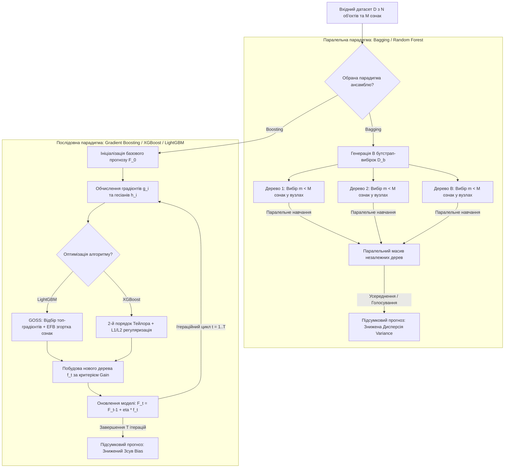

# Тема 7. Ансамблеві методи машинного навчання. Принципи Bagging та Boosting. Алгоритми Random Forest, Gradient Boosting, XGBoost та LightGBM для інженерних даних

## 1. Основний зміст та теоретичний базис

У сучасній інженерії даних та штучному інтелекті **ансамблеві методи (Ensemble Learning)** або композиції алгоритмів посідають чільне місце серед інструментів роботи зі структурованими (табличними) даними. Основна ідея ансамблювання полягає у проведенні синтезу розв'язувального правила шляхом об'єднання пропозицій множини окремих моделей, які називаються **базовими або слабкими учнями (Base / Weak Learners)**. 

Емпірично та математично доведено, що колективне рішення групи узгоджених базових моделей зазвичай володіє суттєво вищою узагальнювальною здатністю, ніж будь-яка з окремих базових моделей. Математичне обґрунтування цього явища спирається на аналог **теореми Кондорсе про журі**: якщо кожен незалежний базовий класифікатор приймає правильне рішення з ймовірністю $p > 0.5$, то при збільшенні кількості таких класифікаторів ймовірність помилки мажоритарного голосування ансамблю монотонно прямує до нуля.

Для оцінювання помилки машинного навчання використовують концепцію **розкладу помилки на зсув та дисперсію (Bias-Variance Decomposition)**. Загальна очікувана помилка моделі складається з трьох компонентів:
* **Зсув (Bias):** помилка, зумовлена спрощеними припущеннями алгоритму; високий Bias свідчить про недонавчання (**Underfitting**).
* **Дисперсія (Variance):** чутливість моделі до малих коливань у навчальній вибірці; високий Variance свідчить про перенавчання (**Overfitting**).
* **Неусувний шум (Irreducible Error):** шумова складова у самих даних.

У якості базових алгоритмів в ансамблях найчастіше використовуються **дерева рішень (Decision Trees)**. Дерева рішень є непараметричними алгоритмами, що здійснюють рекурсивне бінарне розщеплення простору ознак на прямокутні області. Окреме глибоке дерево рішень володіє вкрай низьким зсувом (Low Bias), але високою дисперсією (High Variance). Залежно від того, на компенсацію якої складності помилки спрямовано ансамбль, утворюються дві основні парадигми:

1. **Парадигма Bagging (Bootstrap Aggregating) — зменшення дисперсії (Variance Reduction).**
   Бетгінг орієнтований на об'єднання складних, глибоких моделей із високою дисперсією (наприклад, неспідрізаних дерев рішень). Для створення різноманіття серед базових моделей застосовується техніка **бутстрапу (Bootstrap)** — формування $B$ автономних навчальних підвибірок шляхом випадкового вибору $N$ елементів із вихідного датасету обсягом $N$ **із поверненням (with replacement)**. При цьому приблизно $36.8\%$ об'єктів вихідної вибірки не потрапляють у конкретну бутстрап-підвибірку і утворюють так званий **Out-of-Bag (OOB)** набір, який використовується для валидації моделі без залучення окремого контрольного датасету. 
   
   Усі базові моделі в беггінгу навчаються абсолютно паралельно та незалежно одна від одної, а підсумкове рішення обчислюється як усреднення (для регресії) або мажоритарне голосування (для класифікації).

   Удосконаленням беггінгу є алгоритм **Random Forest (Випадковий ліс)**, запропонований Лео Бреманом. Окрім бутстрапу спостережень, Random Forest впроваджує **метод випадкових підпросторів (Random Subspace Method)** на рівні ознак: під час пошуку оптимального розщеплення у кожному вузлі дерева алгоритм вибирає не з усіх $M$ наявних ознак, а лише з випадкової підмножини розмірністю $m \le M$ (стандартно $m = \sqrt{M}$ для класифікації та $m = M/3$ для регресії). Це примусово декорелює базові дерева між собою, що дає змогу максимально ефективно знизити підсумкову дисперсію ансамблю.

2. **Парадигма Boosting — зменшення зсуву (Bias Reduction).**
   Бустинг реалізує послідовну (ітераційну) схему побудови ансамблю, де кожна наступна базова модель навчається так, щоб компенсувати помилки, допущені композицією попередніх моделей. На відміну від беггінгу, у якості базових моделей використовуються прості моделі з високим зсувом та низькою дисперсією (наприклад, мілкі дерева рішень — «пеньки», **Decision Stumps**).

   Сучасним стандартом бустингу є **градієнтний бустинг (Gradient Boosting Decision Trees, GBDT)**, запропонований Джеромом Фрідманом. Градієнтний бустинг інтерпретує процес навчання як градієнтний спуск у функціональному просторі. На кожному кроці алгоритм обчислює псевдозалишки (**Pseudo-Residuals**) — від'ємні градієнти обраної функції втрат щодо передбачень поточної композиції, і навчає нове базове дерево на ці залишки.

3. **Промислові високопродуктивні реалізації градієнтного бустингу.**
   Для роботи з великими обсягами інженерних даних звичайний GBDT є обчислювально витратним, що зумовило появу високпродуктивних алгоритмів:
   * **XGBoost (eXtreme Gradient Boosting):** розроблений Тянкі Ченом. Застосовує розклад Тейлора 2-го порядку для апроксимації функції втрат (враховує як перші градієнти, так і другі гесіани), впроваджує строгу $L_1$/$L_2$ регуляризацію структури та ваг листя, автоматично опрацьовує пропущені значення (**Sparsity-aware Split Finding**) та підтримує паралелізм на рівні блоків пам'яті.
   * **LightGBM (Light Gradient Boosting Machine):** розроблений Microsoft. Оптимізований для високої швидкодії за рахунок двох технологій: **GOSS (Gradient-based One-Side Sampling)** — збереження всіх об'єктів із великими градієнтами та випадкове вибіркове збереження об'єктів із малими градієнтами; **EFB (Exclusive Feature Bundling)** — об'єднання взаємовиключних розріджених ознак для зменшення розмірності простору. Крім того, LightGBM використовує стратегію росту дерев за принципом **Leaf-wise (Best-First)** замість класичного **Level-wise**, що суттєво прискорює збіжність.

---

## 2. Математичний апарат, моделі та аналітичні залежності

### 1. Математична модель зниження дисперсії у Bagging / Random Forest
Нехай ансамбль складається з $B$ базових моделей $\hat{f}_b(x)$, кожна з яких має дисперсію $\sigma^2(x)$, а парний коефіцієнт кореляції між передбаченнями двох різних моделей дорівнює $\rho(x)$.

Дисперсія усредненого передбачення ансамблю $\hat{f}_{\text{ens}}(x) = \frac{1}{B} \sum_{b=1}^B \hat{f}_b(x)$ обчислюється за формулою:

$$\text{Var}\left(\hat{f}_{\text{ens}}(x)\right) = \rho(x) \cdot \sigma^2(x) + \frac{1 - \rho(x)}{B} \cdot \sigma^2(x)$$

де $\text{Var}\left(\hat{f}_{\text{ens}}(x)\right)$ — підсумкова дисперсія ансамблю, $\rho(x)$ — коефіцієнт кореляції між базовими деревами ($0 \le \rho \le 1$), $\sigma^2(x)$ — дисперсія окремого базового дерева, $B$ — кількість дерев у беггінгу.

*Аналіз:* При $B \to \infty$ другий доданок прямує до нуля, і мінімально досяжна дисперсія визначається величиною $\rho(x) \cdot \sigma^2(x)$. Алгоритм Random Forest за рахунок рандомізації ознак у вузлах зменшує кореляцію $\rho(x)$, знижуючи загальну дисперсію ансамблю без збільшення $\sigma^2(x)$.

### 2. Критерії розщеплення у базових деревах рішень
Для вибору оптимального розщеплення вузла $A$ на лівий $A_L$ та правий $A_R$ дочірні вузли за ознакою $x_j$ та порогу $s$ максимізується приріст інформації (**Information Gain, $\Delta I$**):

$$\Delta I(A, j, s) = I(A) - \left( \frac{N_L}{N_A} I(A_L) + \frac{N_R}{N_A} I(A_R) \right)$$

де $I(A)$ — функція неоднорідності (**Impurity**) вузла $A$, $N_A, N_L, N_R$ — кількість об'єктів у батьківському та дочірніх вузлах відповідно.

Функції Impurity для задач класифікації ($K$ класів, $p_k$ — частка класу $k$ у вузлі):
* **Неоднорідність Джині (Gini Impurity):**

$$I_G(A) = 1 - \sum_{k=1}^K p_k^2$$

* **Ентропія Шеннона (Entropy):**

$$I_H(A) = -\sum_{k=1}^K p_k \log_2(p_k)$$

### 3. Математичний апарат XGBoost (Тейлорівська апроксимація 2-го порядку)
Цільова функція XGBoost на ітерації $t$ для передбачення $\hat{y}_i^{(t)} = \hat{y}_i^{(t-1)} + f_t(x_i)$ має вигляд:

$$\mathcal{Ob}^{(t)} = \sum_{i=1}^N l\left(y_i, \hat{y}_i^{(t-1)} + f_t(x_i)\right) + \Omega(f_t)$$

де $l$ — диференційовна функція втрат, $f_t(x_i)$ — структура нового дерева, що додається, $\Omega(f_t)$ — регуляризаційний штраф за складність дерева:

$$\Omega(f_t) = \gamma T + \frac{1}{2} \lambda \sum_{j=1}^T w_j^2 + \alpha \sum_{j=1}^T |w_j|$$

де $T$ — кількість листків у дереві, $w_j$ — вектор ваг (значень) у листках, $\gamma, \lambda, \alpha$ — гіперпараметри регуляризації.

Розкладаючи функцію втрат $l$ у ряд Тейлора до другого порядку поблизу $\hat{y}_i^{(t-1)}$, отримуємо спрощене значення об'єктива (відкидаючи константні члени):

$$\tilde{\mathcal{Ob}}^{(t)} \approx \sum_{i=1}^N \left[ g_i f_t(x_i) + \frac{1}{2} h_i f_t^2(x_i) \right] + \gamma T + \frac{1}{2} \lambda \sum_{j=1}^T w_j^2$$

де $g_i$ та $h_i$ — перша та друга похідні (градієнт та гесіан) функції втрат по передбаченню моделі:

$$g_i = \frac{\partial l(y_i, \hat{y}_i^{(t-1)})}{\partial \hat{y}_i^{(t-1)}}, \quad h_i = \frac{\partial^2 l(y_i, \hat{y}_i^{(t-1)})}{\partial \left(\hat{y}_i^{(t-1)}\right)^2}$$

Перегруповуючи суму за сукупністю об'єктів $I_j$, що потрапили до кожного $j$-го листка ($j = 1, \dots, T$), маємо:

$$\tilde{\mathcal{Ob}}^{(t)} = \sum_{j=1}^T \left[ \left(\sum_{i \in I_j} g_i\right) w_j + \frac{1}{2} \left(\sum_{i \in I_j} h_i + \lambda\right) w_j^2 \right] + \gamma T$$

Ввівши позначення $G_j = \sum_{i \in I_j} g_i$ та $H_j = \sum_{i \in I_j} h_i$, знайдемо оптимальну вагу $w_j^*$ для листка $j$ із умови $\frac{\partial \tilde{\mathcal{Ob}}}{\partial w_j} = 0$:

$$w_j^* = -\frac{G_j}{H_j + \lambda}$$

Підставляючи $w_j^*$ у цільову функцію, отримуємо оптимальне значення якості структури дерева (Score):

$$\mathcal{Ob}^* = -\frac{1}{2} \sum_{j=1}^T \frac{G_j^2}{H_j + \lambda} + \gamma T$$

Формула розрахунку приросту якості при розщепленні листка на лівий ($L$) та правий ($R$) підвузли в XGBoost:

$$\text{Gain} = \frac{1}{2} \left[ \frac{G_L^2}{H_L + \lambda} + \frac{G_R^2}{H_R + \lambda} - \frac{(G_L + G_R)^2}{H_L + H_R + \lambda} \right] - \gamma$$

де $\text{Gain}$ — коефіцієнт доцільності розщеплення (якщо $\text{Gain} < 0$, розщеплення відкидається, що реалізує автоматичну відбраковку / **Pruning**).

---

## 3. Систематизація даних та порівняльний аналіз

Нижче наведено порівняльний аналіз характеристик та інженерних властивостей чотирьох провідних алгоритмів ансамблевого навчання.

| Критерій порівняння | Random Forest | Classic GBDT | XGBoost | LightGBM |
| :--- | :--- | :--- | :--- | :--- |
| **Базова парадигма ансамблю** | Bagging + Random Subspace | Gradient Boosting | Gradient Boosting (Regularized) | Gradient Boosting (GOSS + EFB) |
| **Оптимізація Error Tradeoff** | Зменшення Variance (Дисперсії) | Зменшення Bias (Зсуву) | Зменшення Bias та Variance | Зменшення Bias та Variance |
| **Стратегія росту дерев** | Level-wise (Balanced) | Level-wise (Depth-wise) | Level-wise або Leaf-wise | Leaf-wise (Best-First) |
| **Порядок апроксимації Loss** | Не використовує (Impurity) | 1-й порядок (Градієнт) | 2-й порядок (Градієнт + Гесіан) | 2-й порядок (Градієнт + Гесіан) |
| **Швидкість навчання та пам'ять** | Висока пам'ять, легко розпаралелюється | Повільне навчання, послідовне | Швидкий (Cache-aware, Block parallelism) | Екстремально швидкий, низька пам'ять |
| **Опрацювання пропущених значень** | Вимагає попередньої імпутації | Вимагає імпутації | Автоматичне виділення гілки (Default direction) | Автоматична обробка на рівні гістограм |
| **Специфіка для інженерних даних** | Стійкий до шуму, не перенавчається | Чутливий до аномалій | Висока точність на середніх таблицях | Найкращий для надвеликих інженерних масивів |

Порівняльний аналіз показує чітку інженерну диференціацію. **Random Forest** є ідеальним вибором у ситуаціях із високим рівнем шуму у датчиках та відносно невеликим обсягом вибірки, оскільки паралельна структура та декореляція дерев гарантують захист від перенавчання. 

Для складних промислових задач із великою кількістю табличних даних перевагу мають **XGBoost** та **LightGBM**. XGBoost забезпечує високу точність завдяки точній тотожності Тейлора 2-го порядку та суворому контролю регуляризації $\gamma$ і $\lambda$. Водночас **LightGBM** переважає за швидкістю на датасетах з мільйонами рядків завдяки використання алгоритму GOSS (який відкидає об'єкти з малими градієнтами) та росту дерев Leaf-wise, що мінімізує обчислювальні витрати при збереженні точності.

---

## 4. Візуалізація процесів та структурних зв'язків

Нижче наведено графічну діаграму, яка порівнює паралельний конвеєр Bagging/Random Forest та послідовно-коригуючий конвеєр Boosting/XGBoost/LightGBM.

*Рисунок 1 — Структурно-логічна схема ансамблевих парадигм Bagging та Boosting з елементами оптимізації XGBoost та LightGBM*

Схема деталізує фундаментальну різницю двох підходів. У лівій гілці (**Bagging / Random Forest**) з вихідного датасету $D$ формуються автономні бутстрап-підвибірки $D_b$. Кожне дерево навчається паралельно з використанням випадкових підпросторів ознак $m < M$. Результуючий блок $F$ знижує дисперсію за рахунок декорельованого голосування. 

У правій гілці (**Boosting**) процес є строго послідовним. Починаючи з $F_0$, на кожній ітерації обчислюються перші $g_i$ та другі $h_i$ похідні функції втрат. Залежно від обраного алгоритму (XGBoost або LightGBM) застосовуються спеціалізовані методи прискорення: GOSS/EFB у LightGBM або тейлорівський розклад із регуляризацією $\Omega$ у XGBoost. Нове дерево $f_t$ будується на градієнти і додається до загальної композиції з коефіцієнтом швидкості навчання $\eta$, поступово мінімізуючи зсув моделі.

---

## 5. Питання для самоперевірки та аналітичного осмислення

1.   Математично поясніть, чому збільшення кількості дерев $B$ в алгоритмі Random Forest не призводить до перенавчання (Overfitting) моделі, тоді як надмірне збільшення кількості дерев $T$ у градієнтному бустингу (GBDT) неминуче викликає перенавчання.
2.   Виведіть формулу для оптимальної ваги листка $w_j^*$ та коефіцієнта розщеплення $\text{Gain}$ в алгоритмі XGBoost. Як параметри регуляризації $\lambda$ (L2) та $\gamma$ (Complexity Penalty) впливають на запобігання побудові надмірно складних дерев?
3.   У чому полягають фундаментальні відмінності між стратегіями росту дерев **Level-wise (Depth-wise)** та **Leaf-wise (Best-First)**? Чому стратегія Leaf-wise у LightGBM досягає меншого значення функції втрат за меншу кількість ітерацій, але вимагає обов'язкового обмеження гіперпараметра `max_depth` або `num_leaves`?
4.   Детально опишіть механізми **GOSS (Gradient-based One-Side Sampling)** та **EFB (Exclusive Feature Bundling)** в алгоритмі LightGBM. Яким чином GOSS зберігає точність оцінки градієнта при відкиданні великого обсягу об'єктів з малими градієнтами?
5.   Інженерна задача передбачає аналіз телеметричних даних із датчиків обладнання, де $20\%$ значень відсутні через збої передачі мережі. Порівняйте поведінку Random Forest та XGBoost при роботі з такими даними. Опишіть алгоритм **Sparsity-aware Split Finding** у XGBoost.
