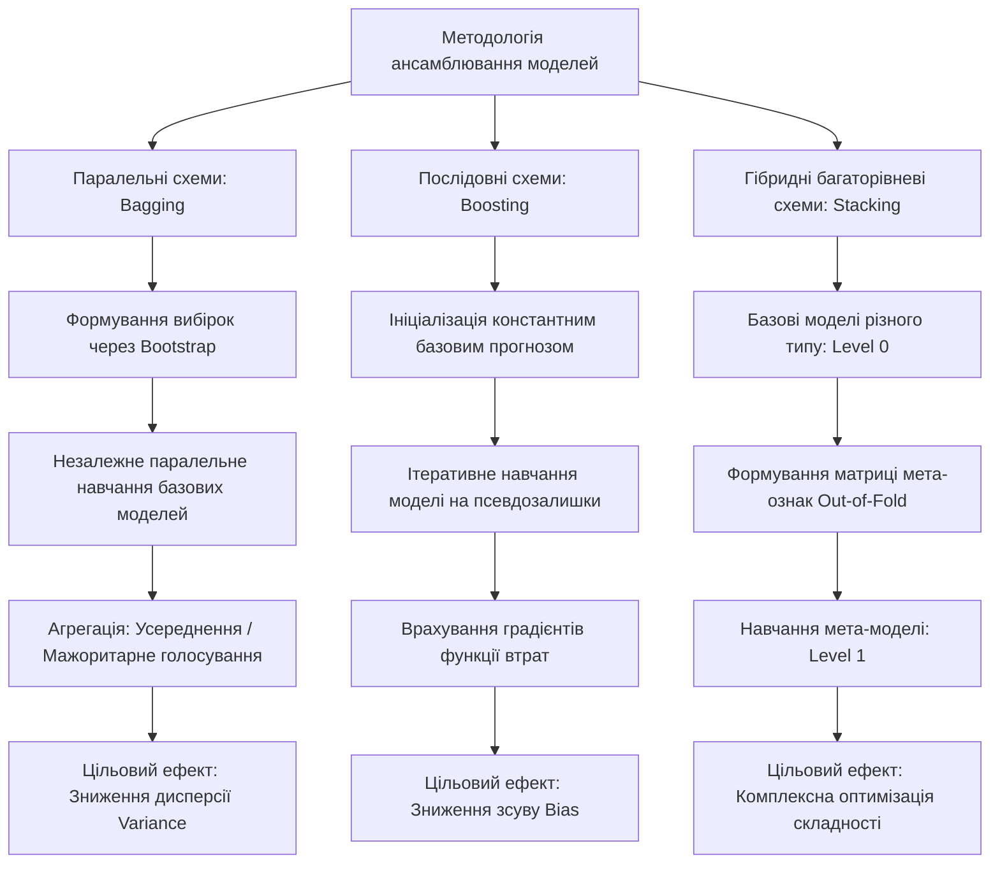
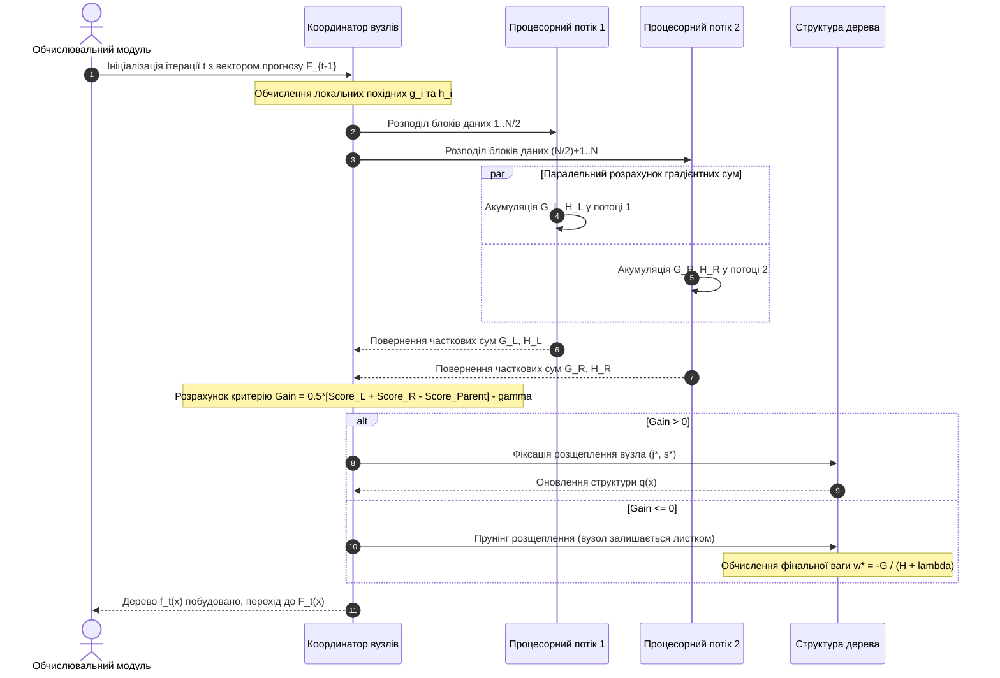
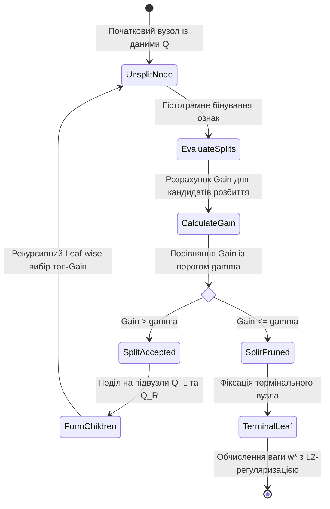
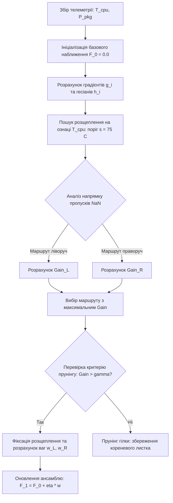

# Тема 7. Ансамблеві методи машинного навчання. Принципи Bagging та Boosting. Алгоритми Random Forest, Gradient Boosting, XGBoost та LightGBM для інженерних даних

## Мета лекції
Метою лекції є фундаментальне засвоєння студентами теоретичних концепцій, математичного апарату та алгоритмічних принципів побудови композицій моделей машинного навчання на основі парадигм паралельного бутстрап-агрегування (Bagging) та послідовної градієнтної оптимізації функціонала втрат (Boosting). Головна увага зосереджується на формалізації розкладу похибки узагальнення на зсув та дисперсію, вивченні аналітичного апарату апроксимації цільової функції другого порядку в алгоритмі XGBoost, а також дослідженні високоефективних технологій прискорення обчислень GOSS та EFB у фреймворку LightGBM під час аналізу багатовимірних інженерних і телеметричних даних.

## Очікувані результати навчання

1. **Знання та розуміння.** Студенти повинні демонструвати глибоке розуміння математичної природи розкладу середньоквадратичної похибки алгоритмів на зсув, дисперсію та неусувний шум, знати теоретико-ймовірнісні засади теореми Кондорсе про журі, принципи генерації вибірок за методом бутстрапу, концепцію функціонального градієнтного спуску та відмінності між парадигмами паралельного й послідовного ансамблювання.

2. **Застосування.** Студенти мають оволодіти вміннями математично розраховувати показники неоднорідності вузлів дерев рішень, визначати аналітичні ваги листків та коефіцієнт приросту якості розщеплення Gain на базі розкладу Тейлора другого порядку, а також програмно реалізовувати конвеєри навчання моделей Random Forest, XGBoost та LightGBM для обробки реальних масивів інженерних показників.

3. **Аналіз.** Студенти повинні навчитися аналізувати стратегії розростання дерев за рівнями (Level-wise) та за листками (Leaf-wise), диференціювати механізми регуляризації складності структури моделей, досліджувати вплив кореляції базових класифікаторів на узагальнювальну здатність лісу, а також критично оцінювати наслідки наявності пропусків та дисбалансу класів у даних телеметрії.

4. **Оцінювання та синтез.** Студенти повинні набути здатності комплексно оцінювати обчислювальну складність, енерговитрати й вимоги до пам'яті різноманітних ансамблевих архітектур, проєктувати оптимальні багатокомпонентні гібридні системи машинного навчання та формулювати інженерно обґрунтовані рекомендації щодо вибору гіперпараметрів бустингу для систем діагностики й моніторингу комп'ютерних комплексів у режимі реального часу.

---

## Детальний покроковий план лекції

### 1. Теоретичний модуль. Концептуальні основи ансамблювання, розклад помилки та базові парадигми
* 1.1. Поняття композиції моделей, теорема Кондорсе про журі та математичне обґрунтування переваг колективного прийняття рішень слабкими учнями (Weak Learners).
* 1.2. Розклад похибки узагальнення на зсув (Bias), дисперсію (Variance) та незвідний шум (Irreducible Error) як методологічна основа вибору стратегії ансамблювання.
* 1.3. Парадигма Bagging (Bootstrap Aggregating): статистичний метод бутстрапу з поверненням, оцінювання похибки Out-of-Bag (OOB) та декомпозиція алгоритму Random Forest із методом випадкових підпросторів.
* 1.4. Парадигма Boosting: фундаментальна концепція послідовної мінімізації залишкової помилки, градієнтний спуск у функціональному просторі (GBDT Джерома Фрідмана) та обчислення псевдозалишків.

### 2. Аналітичний модуль. Математична формалізація, регуляризація та оптимізація алгоритмів XGBoost і LightGBM
* 2.1. Аналітичний вивід формули дисперсії усередненого передбачення ансамблю Random Forest через парний коефіцієнт кореляції базових дерев та розмір ансамблю.
* 2.2. Критерії бінарного розщеплення вузлів у деревах рішень: неоднорідність Джині, ентропія Шеннона та максимізація інформаційного приросту (Information Gain).
* 2.3. Математичний апарат алгоритму XGBoost: апроксимація диференційовної функції втрат рядом Тейлора другого порядку, аналітичний розрахунок оптимальних ваг листків та вивід формули коефіцієнта Gain із $L_1$/$L_2$ регуляризацією.
* 2.4. Алгоритмічні механізми оптимізації високої швидкодії у фреймворку LightGBM: стратегія росту Leaf-wise (Best-First), однобічна вибірка за градієнтом GOSS та об'єднання взаємовиключних ознак EFB.
* 2.5. Математична модель алгоритму Sparsity-aware Split Finding для автоматизованого та оптимального опрацювання пропущених значень в інженерних потоках даних.

### 3. Практично-розрахунковий кейс. Проєктування високопродуктивної системи інтелектуальної предиктивної діагностики обчислювальних вузлів
**Тема наскрізної задачі.** «Синтез, аналітичний розрахунок та оптимізація ансамблевої моделі машинного навчання на основі алгоритмів XGBoost та LightGBM для завчасного виявлення аномалій і перегріву багатопроцесорних серверних платформ за показниками телеметрії»

## 1. Фундаментальний теоретичний базис та концептуальні засади

### 1.1. Поняття композиції моделей, теорема Кондорсе про журі та математичне обґрунтування переваг колективного прийняття рішень слабкими учнями (Weak Learners)

В інженерії складних обчислювальних систем та штучного інтелекту класичний підхід до навчання окремої ізольованої моделі часто стикається з фундаментальними обмеженнями обчислювальної стійкості та узагальнювальної здатності. Спроба побудувати єдиний монолітний алгоритм, здатний однаково ефективно апроксимувати складні нелінійні залежності у багатовимірних інженерних вибірках без перенавчання, призводить до надмірної структурної складності оптимізаційних задач. Концептуальним вирішенням цієї суперечності став перехід від ізольованих моделей до **ансамблевого навчання (Ensemble Learning)**, або побудови композицій алгоритмів.

Основна філософія ансамблювання полягає в агрегації прогнозів множини моделей, які називаються **базовими або слабкими учнями (Weak Learners)**, задля отримання сильного колективного розв'язувального правила (**Strong Learner**). За формальним визначенням Роберта Шапіре та Майкла Кернса, слабким учнем вважається алгоритм машинного навчання, точність класифікації якого на довільному розподілі даних лише трохи перевищує точність випадкового вгадування, тобто ймовірність помилки $p < 0.5$ для бінарної постановки задачі.

Історико-теоретичним базисом, що математично доводить доцільність колективного інтелекту над індивідуальним, виступає **теорема Кондорсе про журі (Condorcet's Jury Theorem)**, сформульована маркізом де Кондорсе у 1785 році в контексті соціального вибору. У термінах машинного навчання теорема стверджує: якщо ансамбль формується з $n$ статистично незалежних базових класифікаторів, кожен з яких приймає правильне бінарне рішення з імовірністю $p > 0.5$, то результуюче мажоритарне голосування ансамблю володіє ймовірністю правильного рішення $P_{\text{ens}}$, яка монотонно зростає зі збільшенням потужності ансамблю $n$ і асимптотично прямує до одиниці.

Математична модель мажоритарного голосування для непарної кількості незалежних класифікаторів $n$ формалізується біноміальним розподілом:

$$P_{\text{ens}} = \sum_{k=\lfloor n/2 \rfloor + 1}^n \binom{n}{k} p^k (1-p)^{n-k}$$

де $P_{\text{ens}}$ — безрозмірна ймовірність прийняття правильного класифікаційного рішення колективом моделей, що набуває значень у діапазоні $[0, 1]$. Змінна $n$ позначає загальну кількість базових класифікаторів у складі ансамблю, що є додатним непарним цілим числом ($n \in \mathbb{N}$). Параметр $k$ є індексом підсумовування, який визначає мінімальну необхідну кількість моделей, що проголосували за правильний клас для забезпечення простої більшості. Величина $\binom{n}{k} = \frac{n!}{k!(n-k)!}$ задає біноміальний коефіцієнт комбінацій голосів. Параметр $p$ позначає апріорну ймовірність генерації правильного прогнозу окремим ізольованим базовим алгоритмом за умови виконання статистичної нерівності $0.5 < p < 1.0$.

Головне інженерне обмеження теореми Кондорсе полягає у вимозі суворої статистичної взаємної незалежності помилок базових класифікаторів. Якщо моделі навчаються на ідентичних вибірках за допомогою детермінованих алгоритмів, коефіцієнт взаємної кореляції між їхніми помилками прямує до одиниці, внаслідок чого ансамбль просто дублює системну похибку одного класифікатора. Звідси випливає фундаментальна інженерна вимога ансамблювання: досягнення високої **різноманітності (Diversity)** базових алгоритмів. Ця різноманітність досягається маніпуляціями з простором навчальних прецедентів (бутстрап спостережень), зміною метрик ознакового простору (метод випадкових підпросторів) або послідовною модифікацією градієнтного цільового простору.

### 1.2. Розклад похибки узагальнення на зсув (Bias), дисперсію (Variance) та незвідний шум (Irreducible Error) як методологічна основа вибору стратегії ансамблювання

Математичний вибір конкретної архітектури композиції моделей вимагає строгого кількісного оцінювання джерел похибки машинного навчання. Центральним аналітичним інструментом для цього слугує **розклад похибки на зсув та дисперсію (Bias-Variance Decomposition)**, що виводиться для квадратичної функції втрат в умовах регресійного аналізу.

Нехай залежна змінна $y$ генерується невідомою істинною детермінованою функцією $f(x)$ з адитивним випадковим шумом $\varepsilon$:

$$y = f(x) + \varepsilon, \quad \mathbb{E}[\varepsilon] = 0, \quad \text{Var}(\varepsilon) = \sigma^2$$

де $y$ є дійсним спостережуваним значенням цільової ознаки у вибірці, вираженим у відповідних фізичних або абстрактних одиницях вимірювання. Функція $f(x)$ є об'єктивною детермінованою закономірністю досліджуваного процесу залежно від вектора вхідних ознак $x \in \mathbb{R}^M$. Випадкова величина $\varepsilon$ моделює стохастичний шум вимірювань і похибки сенсорів, для якого математичне сподівання дорівнює нулю, а дисперсія становить фіксовану константу $\sigma^2 \in \mathbb{R}^+$.

Припустимо, що для навчання використовується випадкова вибірка $\mathcal{D}$, за якою відновлюється емпірична функція $\hat{f}(x; \mathcal{D})$. Очікувана середньоквадратична похибка моделі в довільній фіксованій точці $x$ по всіх можливих реалізаціях навчальної вибірки $\mathcal{D}$ аналітично розкладається на три взаємно ортогональні компоненти:

$$\mathbb{E}_{\mathcal{D}, \varepsilon}\left[\left(y - \hat{f}(x; \mathcal{D})\right)^2\right] = \left(\text{Bias}_{\mathcal{D}}\left[\hat{f}(x; \mathcal{D})\right]\right)^2 + \text{Var}_{\mathcal{D}}\left[\hat{f}(x; \mathcal{D})\right] + \sigma^2$$

де інтегральні складові правої частини рівняння набувають такого формального змісту:

$$\text{Bias}_{\mathcal{D}}\left[\hat{f}(x; \mathcal{D})\right] = \mathbb{E}_{\mathcal{D}}\left[\hat{f}(x; \mathcal{D})\right] - f(x)$$

$$\text{Var}_{\mathcal{D}}\left[\hat{f}(x; \mathcal{D})\right] = \mathbb{E}_{\mathcal{D}}\left[\left(\hat{f}(x; \mathcal{D}) - \mathbb{E}_{\mathcal{D}}\left[\hat{f}(x; \mathcal{D})\right]\right)^2\right]$$

1. Квадрат зміщення $\left(\text{Bias}_{\mathcal{D}}\left[\hat{f}(x; \mathcal{D})\right]\right)^2$ кількісно характеризує помилку апроксимації, яка зумовлена нездатністю обраного сімейства алгоритмів відтворити справжню складність залежності $f(x)$. Високе значення зміщення вказує на стан **недонавчання (Underfitting)** моделі.

2. Дисперсія прогнозу $\text{Var}_{\mathcal{D}}\left[\hat{f}(x; \mathcal{D})\right]$ відображає чутливість моделі до випадкових флуктуацій у конкретній вибірці даних $\mathcal{D}$. Висока дисперсія є класичним математичним індикатором **перенавчання (Overfitting)**, коли алгоритм підлаштовується під випадковий шум навчального набору замість генералізації сутнісної закономірності.

3. Дисперсія шуму $\sigma^2$ репрезентує **незвідний шум (Irreducible Error)** даних, спричинений неповнотою набору вхідних параметрів або похибками вимірювальних трактів цифрової апаратури, і не може бути усунена жодним алгоритмічним шляхом оптимізації моделі.

У контексті базових алгоритмів, таких як **дерева ухвалення рішень (Decision Trees)**, глибина дерева безпосередньо регулює баланс Bias-Variance. Неглибокі дерева («пеньки») мають високий зсув і низьку дисперсію. Навпаки, глибокі, необмежені у рості дерева володіють нульовим зсувом (вони здатні розділити дані аж до ізольованих листків), проте мають колосальну дисперсію.

Це призводить до чіткого розмежування двох парадигм інженерного ансамблювання:

1. Схема **Bagging** орієнтована на алгоритми з низьким зсувом і високою дисперсією (глибокі дерева), здійснюючи паралельне усереднення та радикально знижуючи результуючу дисперсію ансамблю без збільшення зсуву.

2. Схема **Boosting** стартує зі слабких моделей із високим зсувом і низькою дисперсією (прості класифікатори, неглибокі дерева), ітеративно додаючи нові структури, які крок за кроком компенсують систематичну похибку, тим самим мінімізуючи сумарний зсув ансамблю.

### 1.3. Парадигма Bagging (Bootstrap Aggregating): статистичний метод бутстрапу з поверненням, оцінювання похибки Out-of-Bag (OOB) та декомпозиція алгоритму Random Forest із методом випадкових підпросторів

Технологія **Bagging (Bootstrap Aggregating)**, представлена Лео Брейманом у 1996 році, спирається на статистичну техніку непараметричного ресемплінгу — **бутстрап (Bootstrap)**, запропоновану Бредлі Ефроном. Нехай задано початковий навчальний набір даних $\mathcal{D} = \{(x_i, y_i)\}_{i=1}^N$ обсягом $N$ спостережень. Бутстрап полягає в генерації $B$ незалежних підвибірок $\mathcal{D}_1, \mathcal{D}_2, \dots, \mathcal{D}_B$, кожна з яких формується шляхом рівномірного випадкового вибору $N$ об'єктів із множини $\mathcal{D}$ **із поверненням (with replacement)**.

Ймовірність того, що конкретне фіксоване спостереження $x_i$ не буде обране під час здійснення одного випадкового вилучення з вибірки обсягом $N$, становить $1 - \frac{1}{N}$. Враховуючи незалежність послідовних вилучень із поверненням, ймовірність невипадання цього об'єкта в бутстрап-вибірку за всі $N$ ітерацій вибору виражається степеневою функцією:

$$P(\text{об'єкт } i \notin \mathcal{D}_b) = \left(1 - \frac{1}{N}\right)^N$$

При зростанні розмірності вибірки до нескінченності дана ймовірність збігається до другої чудової границі:

$$\lim_{N \to \infty} \left(1 - \frac{1}{N}\right)^N = \frac{1}{e} \approx 0.367879 \approx 36.8\%$$

Це означає, що кожна сформована бутстрап-вибірка $\mathcal{D}_b$ містить у середньому лише приблизно $63.2\%$ унікальних об'єктів від вихідного набору даних $\mathcal{D}$, тоді як решта складається з дублікатів. Ті $36.8\%$ прецедентів, які жодного разу не потрапили у вибірку $\mathcal{D}_b$, утворюють валідаційний набір **Out-of-Bag (OOB)** для даної базової моделі $b$.

Наявність підвибірок OOB забезпечує важливу інженерну перевагу: можливість проведення внутрішньої перехресної валідації (**OOB Error Estimation**) паралельно з процесом навчання, без виділення окремого відкладеного датасету чи застосування обчислювально витратної $k$-кратної крос-валідації. Для кожного спостереження $(x_i, y_i)$ підсумковий прогноз формується шляхом агрегації результатів лише тих базових моделей, для яких даний об'єкт $x_i$ був у складі Out-of-Bag:

$$\hat{y}_i^{\text{OOB}} = \frac{1}{|B_i^{\text{OOB}}|} \sum_{b \in B_i^{\text{OOB}}} \hat{f}_b(x_i)$$

де $B_i^{\text{OOB}} = \{b \in \{1, \dots, B\} \mid x_i \notin \mathcal{D}_b\}$ — підмножина моделей, що не бачили об'єкт $i$ під час навчання. Оцінка узагальнюючої помилки за всіма елементами дає математично незміщену характеристику якості ансамблю.

Логічним розвитком та найпотужнішим втіленням парадигми Bagging став алгоритм **Random Forest (Випадковий ліс)**, розроблений Лео Брейманом у 2001 році. Класичний беггінг над деревами рішень володіє недоліком: якщо у вибірці наявна пара домінантних ознак із високою кореляцією з цільовою змінною, ці ознаки вибиратимуться в якості кореневих розщеплень майже в усіх $B$ згенерованих деревах. Як наслідок, дерева стають схожими за топологією, а коефіцієнт кореляції між їхніми передбаченнями залишається високим, що стримує зменшення дисперсії ансамблю.

Для подолання цієї кореляційної залежності Брейман інтегрував у беггінг **метод випадкових підпросторів (Random Subspace Method)**, попередньо запропонований Тіном Камом Хо. Під час побудови кожного вузла в кожному дереві алгоритм виконує пошук найкращого розщеплення не серед усього набору з $M$ доступних ознак, а виключно серед випадково відібраної підвибірки потужністю $m \le M$:

1. Для задач класифікації стандартним евристичним значенням є $m = \lfloor\sqrt{M}\rfloor$.
2. Для задач регресійного моделювання інженерним стандартом вважається $m = \lfloor M / 3 \rfloor$.

Ця рандомізація примусово декорелює дерева рішень між собою, що дозволяє значно знизити коефіцієнт парної кореляції базових моделей $\rho$ та забезпечує спадання загальної дисперсії лісу до мінімально можливих значень.

### 1.4. Парадигма Boosting: фундаментальна концепція послідовної мінімізації залишкової помилки, градієнтний спуск у функціональному просторі (GBDT Джерома Фрідмана) та обчислення псевдозалишків

На відміну від паралельного та незалежного навчання в Bagging, парадигма **Boosting** є принципово послідовною, детермінованою технологією. Початкова концепція бустингу, запропонована в алгоритмі **AdaBoost (Adaptive Boosting)** Йоавом Фройндом та Робертом Шапіре (1995 р.), полягала у динамічному перезважуванні об'єктів навчального датасету: прецеденти, на яких поточна композиція помилилася, отримували збільшену вагу, змушуючи наступний слабкий класифікатор фокусуватися на проблемних областях простору станів.

Фундаментальний стрибок у розвитку теорії відбувся у 1999–2001 роках, коли Джером Фрідман запропонував концепцію **градієнтного бустингу (Gradient Boosting Machine, GBM)**. Фрідман переосмислив бустинг не як перезважування спостережень, а як процес чисельної оптимізації в нескінченновимірному функціональному просторі (гільбертовому просторі функцій $L_2$).

Нехай розв'язується задача мінімізації емпіричного ризику для заданої диференційовної функції втрат $L(y, \hat{y})$:

$$\mathcal{R}(F) = \sum_{i=1}^N L(y_i, F(x_i)) \to \min_{F}$$

де $\mathcal{R}(F)$ — функціонал сумарних втрат на вибірці прецедентів, що є скалярною величиною, яка підлягає мінімізації. Символ $F(x_i)$ відображає прогноз комплексної функції ансамблю для вектора ознак $i$-го об'єкта. Функція втрат $L(y_i, F(x_i))$ задає штраф за розбіжність прогнозу та справжнього значення цільової величини $y_i$.

В алгоритмі градієнтного спуску в просторі параметрів оновлення ваг відбувається вздовж вектора антиградієнта цільової функції. У функціональному ж просторі оптимізованими змінними виступають значення функції $F(x)$ у точках вибірки:

$$F(x) = \left[F(x_1), F(x_2), \dots, F(x_N)\right]^T$$

Отже, на кожній ітерації $m$ ($m = 1, \dots, M_{\text{iter}}$) необхідно змістити значення функції $F_{m-1}(x)$ у напрямку найшвидшого спадання функції втрат. Цей напрямок задається вектором від'ємних похідних функції втрат за поточним значенням апроксимації, які отримали назву **псевдозалишків (Pseudo-Residuals)**:

$$r_{im} = -\left[ \frac{\partial L(y_i, F(x_i))}{\partial F(x_i)} \right]_{F(x) = F_{m-1}(x)}$$

де $r_{im}$ — обчислений псевдозалишок для $i$-го об'єкта на $m$-му кроці бустингу, що має фізичну розмірність градієнта функції втрат. Величина $L(y_i, F(x_i))$ є двічі неперервно диференційовною функцією втрат (наприклад, квадратичною втратою, логістичною втратою чи функцією Хьюбера). Індекс $i$ змінюється від $1$ до загального обсягу вибірки $N$. Значення $F_{m-1}(x_i)$ являє собою фіксоване передбачення композиції з перших $m-1$ побудованих базових моделей.

Алгоритмічна декомпозиція класичного градієнтного бустингу дерев рішень (**Gradient Boosted Decision Trees, GBDT**) реалізується за наступними послідовними етапами:

1. **Ініціалізація нульового наближення $F_0(x)$:** вибирається константа, що мінімізує сумарні втрати на навчальній вибірці:

$$F_0(x) = \arg\min_{\gamma} \sum_{i=1}^N L(y_i, \gamma)$$

2. **Ітераційний цикл побудови базових функцій ($m = 1, 2, \dots, M_{\text{iter}}$):**
   * Обчислення значень псевдозалишків $r_{im}$ за всіма об'єктами вибірки $i = 1, \dots, N$.
   * Навчання базової моделі (зазвичай дерева рішень) $h_m(x)$ на навчальному датасеті $\{(x_i, r_{im})\}_{i=1}^N$, де псевдозалишки виступають у ролі неперервної цільової змінної. Базове дерево структурує простір ознак на $J_m$ неперетинних термінальних областей (листків) $R_{jm}$, де $j = 1, \dots, J_m$.
   * Визначення оптимальних коефіцієнтів зсуву $\gamma_{jm}$ для кожного сформованого листка $R_{jm}$ шляхом розв'язання одновимірних оптимізаційних підзадач:

$$\gamma_{jm} = \arg\min_{\gamma} \sum_{x_i \in R_{jm}} L\left(y_i, F_{m-1}(x_i) + \gamma\right)$$

   * Оновлення підсумкової апроксимаційної функції ансамблю з урахуванням темпу навчання (**Learning Rate**, або коефіцієнта стиснення **Shrinkage**) $\eta \in (0, 1]$:

$$F_m(x) = F_{m-1}(x) + \eta \sum_{j=1}^{J_m} \gamma_{jm} \mathbb{I}(x \in R_{jm})$$

де $\mathbb{I}(\cdot)$ — індикаторна функція, яка набуває значення $1$, якщо вектор ознак $x$ потрапляє в термінальну область $R_{jm}$, та $0$ в іншому випадку. Коефіцієнт $\eta$ запобігає перенавчанню, сповільнюючи процес схождення функціоналу та роблячи окремі кроки градієнтного спуску більш консервативними.

---

### Систематизація та класифікація базових архітектур ансамблевого навчання

Нижче наведено порівняльний аналіз ключових парадигм і промислових реалізацій композицій алгоритмів, що застосовуються в сучасних інформаційно-обчислювальних комплексах.

| Парадигма ансамблювання | Базовий алгоритм (Base Learner) | Головний цільовий компонент похибки | Характер взаємодії моделей у системі | Математичний механізм агрегації відповідей | Чутливість до шуму та аномальних вимірювань |
| :--- | :--- | :--- | :--- | :--- | :--- |
| **Класичний Bagging** | Необмежені за глибиною дерева рішень (High Variance) | Радикальне зменшення дисперсії (Variance Reduction) | Повністю незалежне паралельне навчання на процесорах | Просте арифметичне усереднення або пряме мажоритарне голосування | Низька чутливість через демпфування викидів при усередненні |
| **Random Forest** | Випадкові декорельовані дерева рішень | Зменшення дисперсії через мінімізацію кореляції $\rho$ | Незалежне паралельне навчання (SIMD/MIMD паралелізм) | Зважене або просте усереднення ймовірностей у листках | Вкрай низька; висока стійкість до зашумлених сигналів датчиків |
| **AdaBoost** | Елементарні класифікатори або дерева-пеньки (High Bias) | Зменшення систематичного зсуву (Bias Reduction) | Строго послідовне навчання на модифікованих вагах вибірки | Зважене голосування з коефіцієнтами надійності моделей $\alpha_m$ | Екстремально висока; алгоритм фокусується на шумі як на складних точках |
| **Classic GBDT** | Неглибокі дерева з контролем кількості листків (Stumps/Trees) | Зменшення зсуву з поступовим зниженням втрат | Послідовний функціональний спуск по антиградієнту | Адитивне додавання прогнозів, масштабованих темпом $\eta$ | Помірна; регулюється підбором робастних функцій втрат (Huber Loss) |
| **Stacking (Meta-learning)** | Гетерогенні моделі (SVM, k-NN, Neural Nets, Дерева) | Комплексна оптимізація Bias та Variance одночасно | Багаторівнева ієрархія (Level-0 моделі та Level-1 метамодель) | Нелінійна апроксимація мета-моделлю за вектором мета-ознак | Залежить від властивостей і регуляризації обраної метамоделі |

---

> **ТИПОВА ПОМИЛКА:** Поширеною концептуальною помилкою інженерів є уявлення про те, що необмежене нарощування кількості базових дерев ($B \to \infty$) у класичному випадковому лісі (Random Forest) здатне викликати перенавчання моделі за аналогією з градієнтним бустингом. 
> 
> У дійсності, збільшення кількості дерев у Random Forest монотонно знижує статистичну дисперсію ансамблю до асимптотичної межі $\rho \sigma^2$, залишаючи систематичний зсув незмінним. Додавання надлишкових дерев у Random Forest призводить виключно до невиправданих витрат обчислювальних ресурсів і затримок під час інференсу, але не провокує деградацію узагальнювальної здатності на нових даних. 
> 
> На противагу цьому, в алгоритмах градієнтного бустингу (GBDT) надмірна кількість ітерацій $M_{\text{iter}}$ неминуче призводить до катастрофічного перенавчання, оскільки бустинг на кожному наступному кроці мінімізує залишки все точніше і зрештою починає апроксимувати стохастичний білий шум конкретної вибірки прецедентів.

---

> **КОНТРОЛЬНЕ ПИТАННЯ.** Чому процедура Out-of-Bag (OOB) оцінювання в алгоритмі Random Forest дає асимптотично наближену оцінку похибки узагальнення, еквівалентну повній $k$-кратній перехресній валідації (Cross-Validation), і за яких умов обчислення OOB-похибки може демонструвати статистичне зміщення при аналізі реальних інженерних даних?

Розгорнути відповідь

**Аналітична відповідь:**

1. Еквівалентність крос-валідації досягається тим, що при кожному бутстрап-вилученні об'єм вибірки, що залишається за межами конкретного дерева, становить приблизно $36.8\%$ прецедентів. Отже, для кожного навчального вектора $x_i$ існує в середньому $B \cdot e^{-1}$ дерев, для яких він не використовувався в процесі оптимізації розщеплень:

$$B_i^{\text{OOB}} \approx 0.368 \cdot B$$

Оскільки ці дерева навчалися на вибірках, незалежних від $x_i$, агрегація їхніх прогнозів для $x_i$ є строго відкладеною валідацією, що математично усуває оптимістичне зміщення похибки навчання без необхідності повторного $k$-кратного перезапуску всього алгоритму.

2. Статистичне зміщення OOB-оцінки виникає за таких специфічних інженерних умов:

    * **Наявність часової кореляції (Time-Series Data):** якщо телеметричні дані є нестаціонарними часовими рядами, випадковий бутстрап порушує хронологічний порядок, призводячи до «заглядання в майбутнє» (Data Leakage), коли дерево навчається на точці $t+1$, а тестується через OOB на точці $t$.
    * **Сильний дисбаланс класів (Imbalanced Data):** якщо рідкісний дефект обладнання представлений лише кількома відсотками прикладів, висока ймовірність того, що екземпляри міноритарного класу або взагалі не потраплять у бутстрап-підвибірку, або навпаки, не матимуть достатнього представництва в OOB, що спотворює оцінку чутливості (Recall).
    * **Групова залежність (Clustered / Panel Data):** якщо вимірювання надходять серіями від обмеженого пулу датчиків, спостереження всередині однієї серії корелюють між собою; потрапляння частини серії в навчальний блок дерева, а іншої — в OOB, нівелює незалежність валідації.

---

### Вказівки для самостійного осмислення теоретичного базису

1. Проаналізуйте зсув-дисперсійний компроміс для дерев рішень різної глибини. Обґрунтуйте, чому використання дерев глибиною $D = 1$ («пеньків») у парадигмі Bagging є абсолютно неефективним інженерним рішенням, тоді як у парадигмі Boosting саме такі дерева здатні сформувати високоточний ансамбль.

2. Дослідіть математичний зв'язок між класичним градієнтним спуском у просторі параметрів та функціональним спуском Фрідмана. Поясніть, чому використання квадратичної функції втрат $L(y, F) = \frac{1}{2}(y - F)^2$ перетворює вектор псевдозалишків на звичайну евклідову нев'язку $r_i = y_i - F(x_i)$, тоді як при логістичній функції втрат залишки набувають ймовірнісної інтерпретації помилки класифікації.

3. Зіставте обчислювальну складність паралельного виконання Bagging на сучасних багатопроцесорних архітектурах із розподіленою та спільною пам'яттю з послідовним конвеєром Boosting. Сформулюйте системні фактори, що лімітують апаратне масштабування обох підходів при роботі з потоками телеметричних даних у реальному часі.

## 2. Аналітичні процеси, математичний апарат та моделювання

### 2.1. Аналітичний вивід формули дисперсії усередненого передбачення ансамблю Random Forest через парний коефіцієнт кореляції базових дерев та розмір ансамблю

Основоположний механізм ефективності парадигми Bagging та алгоритму Random Forest ґрунтується на математичному ефекті зниження дисперсії випадкової величини під час її паралельного усереднення. Розглянемо ансамбль, що складається з $B$ базових моделей регресії $\hat{f}_1(x), \hat{f}_2(x), \dots, \hat{f}_B(x)$, які оптимізовані на окремих бутстрап-вибірках $\mathcal{D}_b$.

Припустимо, що кожна базова модель є однаково розподіленою випадковою величиною із математичним сподіванням $\mathbb{E}[\hat{f}_b(x)] = \mu(x)$ та скінченною дисперсією $\text{Var}(\hat{f}_b(x)) = \sigma^2(x)$. При цьому будь-яка пара моделей володіє симетричним коефіцієнтом лінійної кореляції Пірсона $\rho(x) = \text{Corr}(\hat{f}_i(x), \hat{f}_j(x))$ при $i \ne j$, де $\rho(x) \in [0, 1]$.

Підсумковий прогноз ансамблю формується шляхом простого арифметичного усереднення:

$$\hat{f}_{\text{ens}}(x) = \frac{1}{B} \sum_{b=1}^B \hat{f}_b(x)$$

Аналітичне виведення підсумкової дисперсії ансамблю $\text{Var}\left(\hat{f}_{\text{ens}}(x)\right)$ розбивається на послідовність формальних етапів:

$$
\begin{aligned}
\text{Етап 1 (Запис дисперсії лінійної комбінації):} & \quad \text{Var}\left(\hat{f}_{\text{ens}}(x)\right) = \text{Var}\left(\frac{1}{B} \sum_{b=1}^B \hat{f}_b(x)\right) = \frac{1}{B^2} \text{Var}\left(\sum_{b=1}^B \hat{f}_b(x)\right) \\
\text{Етап 2 (Розклад дисперсії суми випадкових величин):} & \quad \text{Var}\left(\sum_{b=1}^B \hat{f}_b(x)\right) = \sum_{b=1}^B \text{Var}\left(\hat{f}_b(x)\right) + \sum_{i=1}^B \sum_{j \ne i}^B \text{Cov}\left(\hat{f}_i(x), \hat{f}_j(x)\right) \\
\text{Етап 3 (Врахування коваріації через коефіцієнт кореляції):} & \quad \text{Cov}\left(\hat{f}_i(x), \hat{f}_j(x)\right) = \rho(x) \cdot \sqrt{\text{Var}(\hat{f}_i(x))} \cdot \sqrt{\text{Var}(\hat{f}_j(x))} = \rho(x) \sigma^2(x) \\
\text{Етап 4 (Підстановка та алгебраїчне зведення подвійних сум):} & \quad \text{Var}\left(\hat{f}_{\text{ens}}(x)\right) = \frac{1}{B^2} \left[ B \sigma^2(x) + B(B - 1)\rho(x)\sigma^2(x) \right] \\
\text{Етап 5 (Канонічне розщеплення на кореляційну та стохастичну частки):} & \quad \text{Var}\left(\hat{f}_{\text{ens}}(x)\right) = \rho(x) \sigma^2(x) + \frac{1 - \rho(x)}{B} \sigma^2(x)
\end{aligned}
$$

де величини, що беруть участь у виведенні, визначаються наступним чином:

1. Дисперсія $\text{Var}\left(\hat{f}_{\text{ens}}(x)\right)$ вимірює розсіювання передбачень усього ансамблю моделей навколо його математичного сподівання у квадратних одиницях цільової змінної.
2. Параметр $B$ задає цілочисельну кількість незалежно навчених базових дерев рішень в ансамблі ($B \in \mathbb{N}$).
3. Величина $\sigma^2(x)$ позначає власну дисперсію окремого базового дерева рішень, яка через відсутність обрізання гілок є суттєво завищеною.
4. Коефіцієнт $\rho(x)$ виражає безрозмірну величину парної кореляції між виходами двох випадкових дерев для заданого вектора ознак $x$.

Дослідимо поведінку отриманої аналітичної функції за граничних умов:

1. Асимптотична межа при нескінченному нарощуванні кількості базових дерев ($B \to \infty$):

$$\lim_{B \to \infty} \text{Var}\left(\hat{f}_{\text{ens}}(x)\right) = \lim_{B \to \infty} \left[ \rho(x) \sigma^2(x) + \frac{1 - \rho(x)}{B} \sigma^2(x) \right] = \rho(x) \sigma^2(x)$$

2. Ідеальний граничний стан повної некорельованості моделей ($\rho(x) \to 0$):

$$\left. \text{Var}\left(\hat{f}_{\text{ens}}(x)\right) \right|_{\rho(x) = 0} = \frac{\sigma^2(x)}{B} \xrightarrow[B \to \infty]{} 0$$

3. Граничний стан абсолютної функціональної детермінованості або ідентичності моделей ($\rho(x) \to 1$):

$$\left. \text{Var}\left(\hat{f}_{\text{ens}}(x)\right) \right|_{\rho(x) = 1} = \sigma^2(x)$$

Отриманий результат демонструє ключову інженерну проблему класичного беггінгу: якщо дерева навчаються на вибірках, отриманих лише через бутстрап за об'єктами, сильні домінантні ознаки зумовлюють високе значення кореляції $\rho(x) \approx 0.7 - 0.9$. За таких умов навіть граничне значення кількості дерев $B \to \infty$ не дозволяє опустити дисперсію нижче рівня $\rho(x) \sigma^2(x)$. 

Алгоритм **Random Forest** долає це обмеження за допомогою випадкового підпростору ознак: вибір випадкової підмножини із $m = \lfloor \sqrt{M} \rfloor$ або $m = \lfloor M/3 \rfloor$ параметрів у кожному вузлі примусово руйнує топологічну подібність дерев. Це знижує $\rho(x)$ до діапазону $0.1 - 0.2$, дозволяючи практично повністю нівелювати дисперсію під час усереднення без суттєвого збільшення систематичного зсуву окремих дерев.

### 2.2. Критерії бінарного розщеплення вузлів у деревах рішень: неоднорідність Джині, ентропія Шеннона та максимізація інформаційного приросту (Information Gain)

Базовим елементом ансамблів Bagging, Random Forest та Boosting виступає бінарне дерево рішень. Процес його побудови є жадібним рекурсивним алгоритмом, який на кожному кроці розбиває множину спостережень поточного вузла $Q$ на дві неперетинні підмножини $Q_L(j, s)$ та $Q_R(j, s)$ за допомогою вибору сплітуючої ознаки $j \in \{1, \dots, M\}$ та числового порогу $s \in \mathbb{R}$:

$$Q_L(j, s) = \{(x, y) \in Q \mid x_j \le s\}, \quad Q_R(j, s) = \{(x, y) \in Q \mid x_j > s\}$$

Для обрання оптимальної пари $(j^*, s^*)$ формулюється оптимізаційна задача максимізації критерію **приросту інформації (Information Gain, $\Delta I$)**:

$$\Delta I(Q, j, s) = I(Q) - \left( \frac{N_L}{N_Q} I(Q_L) + \frac{N_R}{N_Q} I(Q_R) \right) \to \max_{j, s}$$

де $N_Q = |Q|$, $N_L = |Q_L|$, $N_R = |Q_R|$ позначають кількість об'єктів у батьківському та дочірніх вузлах відповідно, а $I(Q)$ є функцією неоднорідності (**Impurity**).

В аналізі інженерних систем використовуються такі аналітичні метрики неоднорідності для $K$ класів, де $p_k = \frac{1}{N_Q} \sum_{i \in Q} \mathbb{I}(y_i = k)$ є емпіричною часткою класу $k$:

1. **Неоднорідність Джині (Gini Impurity):**

$$I_G(Q) = 1 - \sum_{k=1}^K p_k^2 = \sum_{k=1}^K p_k (1 - p_k)$$

2. **Ентропія Шеннона (Shannon Entropy):**

$$I_H(Q) = -\sum_{k=1}^K p_k \log_2(p_k)$$

за умови використання домовленості $0 \log_2(0) = 0$.

3. **Середньоквадратична похибка (MSE Impurity) для задач регресії:**

$$I_{\text{MSE}}(Q) = \frac{1}{N_Q} \sum_{i \in Q} (y_i - \bar{y}_Q)^2, \quad \bar{y}_Q = \frac{1}{N_Q} \sum_{i \in Q} y_i$$

Порівняльний диференціальний аналіз критеріїв Джині та ентропії у бінарному випадку ($K = 2$, де $p_1 = p$, $p_2 = 1 - p$) підтверджує їхню математичну узгодженість. Розклад ентропії за формулою Тейлора в околі точки максимальної невизначеності $p = 0.5$:

$$
\begin{aligned}
\text{Етап 1 (Запис ентропії через натуральний логарифм):} & \quad I_H(p) = -\frac{1}{\ln 2} [p \ln p + (1-p) \ln(1-p)] \\
\text{Етап 2 (Розклад функцій логарифма у степеневий ряд):} & \quad \ln(1 \pm x) \approx \pm x - \frac{x^2}{2}, \quad \text{де } x = 2p - 1 \\
\text{Етап 3 (Апроксимація ентропії поліномом 2-го порядку):} & \quad I_H(p) \approx 1 - \frac{2}{\ln 2} (p - 0.5)^2 \\
\text{Етап 4 (Зіставлення з неоднорідністю Джині):} & \quad I_G(p) = 2p(1-p) = \frac{1}{2} - 2(p - 0.5)^2
\end{aligned}
$$

З аналізу випливає, що $I_G(p) \approx \frac{\ln 2}{2} I_H(p)$. Обидва критерії досягають екстремумів у точках $p \in \{0, 1\}$ (мінімум, що дорівнює нулю) та $p = 0.5$ (максимум). Однак із обчислювальної точки зору критерій Джині не вимагає виклику трансцендентної функції логарифма, що робить його обчислення значно швидшим на мікропроцесорах загального призначення під час багатократного перебору граничних точок у потокових масивах даних.

### 2.3. Математичний апарат алгоритму XGBoost: апроксимація диференційовної функції втрат рядом Тейлора другого порядку, аналітичний розрахунок оптимальних ваг листків та вивід формули коефіцієнта Gain із $L_1$/$L_2$ регуляризацією

Алгоритм **XGBoost (eXtreme Gradient Boosting)**, запропонований Тянкі Ченом у 2016 році, є класичним стандартом промислового градієнтного бустингу другого порядку. Нехай на ітерації $t$ ансамбль формує передбачення $\hat{y}_i^{(t)} = \hat{y}_i^{(t-1)} + f_t(x_i)$, де $f_t \in \mathcal{F}$ — параметризоване дерево рішень, що відображає вхідний вектор $x_i$ у ваговий коефіцієнт відповідного листка: $f_t(x) = w_{q(x)}$. Тут $q: \mathbb{R}^M \to \{1, 2, \dots, T\}$ задає структуру розбиття на $T$ термінальних листків, а $w \in \mathbb{R}^T$ є вектором дійсних ваг листків.

Повний регуляризований функціонал оптимізації має вигляд:

$$\mathcal{L}^{(t)} = \sum_{i=1}^N l\left(y_i, \hat{y}_i^{(t-1)} + f_t(x_i)\right) + \Omega(f_t)$$

де регуляризаційний штраф за структурну складність дерева визначається формулою:

$$\Omega(f_t) = \gamma T + \frac{1}{2} \lambda \sum_{j=1}^T w_j^2 + \alpha \sum_{j=1}^T |w_j|$$

Параметр $\gamma$ контролює штраф за введення додаткового вузла розщеплення, $\lambda$ задає коефіцієнт $L_2$-регуляризації ваг, а $\alpha$ відповідає за розріджувальну $L_1$-регуляризацію ваг листків.

Виведемо аналітичну формулу оптимізації цільової функції, вважаючи $\alpha = 0$ для збереження аналітичної гладкості першої похідної:

$$
\begin{aligned}
\text{Етап 1 (Апроксимація Тейлора 2-го порядку):} & \quad l\left(y_i, \hat{y}_i^{(t-1)} + f_t(x_i)\right) \approx l\left(y_i, \hat{y}_i^{(t-1)}\right) + g_i f_t(x_i) + \frac{1}{2} h_i f_t^2(x_i) \\
\text{Етап 2 (Визначення градієнтів та гесіанів):} & \quad g_i = \frac{\partial l(y_i, \hat{y}_i^{(t-1)})}{\partial \hat{y}_i^{(t-1)}}, \quad h_i = \frac{\partial^2 l(y_i, \hat{y}_i^{(t-1)})}{\partial \left(\hat{y}_i^{(t-1)}\right)^2} \\
\text{Етап 3 (Відкидання постійного доданка):} & \quad \tilde{\mathcal{L}}^{(t)} = \sum_{i=1}^N \left[ g_i f_t(x_i) + \frac{1}{2} h_i f_t^2(x_i) \right] + \gamma T + \frac{1}{2} \lambda \sum_{j=1}^T w_j^2 \\
\text{Етап 4 (Перегрупування суми за множинами індексів листків):} & \quad I_j = \{i \mid q(x_i) = j\}, \quad \tilde{\mathcal{L}}^{(t)} = \sum_{j=1}^T \left[ \left(\sum_{i \in I_j} g_i\right) w_j + \frac{1}{2} \left(\sum_{i \in I_j} h_i + \lambda\right) w_j^2 \right] + \gamma T \\
\text{Етап 5 (Введення кумулятивних позначень):} & \quad G_j = \sum_{i \in I_j} g_i, \quad H_j = \sum_{i \in I_j} h_i \implies \tilde{\mathcal{L}}^{(t)} = \sum_{j=1}^T \left[ G_j w_j + \frac{1}{2} (H_j + \lambda) w_j^2 \right] + \gamma T
\end{aligned}
$$

Диференціюючи отриманий функціонал за вагою окремого листка $w_j$ та прирівнюючи похідну до нуля, знаходимо оптимальне аналітичне значення ваги $w_j^*$:

$$\frac{\partial \tilde{\mathcal{L}}^{(t)}}{\partial w_j} = G_j + (H_j + \lambda) w_j = 0 \implies w_j^* = -\frac{G_j}{H_j + \lambda}$$

Якщо враховувати ненульову $L_1$-регуляризацію ($\alpha > 0$), оптимальна вага обчислюється через функцію м'якого відсікання (**Soft-thresholding**):

$$w_j^* = -\frac{\text{sign}(G_j) \max(|G_j| - \alpha, 0)}{H_j + \lambda}$$

Підставимо оптимальну вагу $w_j^*$ назад у функціонал $\tilde{\mathcal{L}}^{(t)}$, отримавши аналітичний вираз якості структури дерева (Score функція):

$$\tilde{\mathcal{L}}^*(q) = -\frac{1}{2} \sum_{j=1}^T \frac{G_j^2}{H_j + \lambda} + \gamma T$$

Формула приросту якості при розщепленні батьківського вузла на лівий ($L$) та правий ($R$) дочірні вузли визначається різницею оцінок якості:

$$\text{Gain} = \frac{1}{2} \left[ \frac{G_L^2}{H_L + \lambda} + \frac{G_R^2}{H_R + \lambda} - \frac{(G_L + G_R)^2}{H_L + H_R + \lambda} \right] - \gamma$$

де $G_L, H_L$ та $G_R, H_R$ — суми градієнтів і гесіанів відповідних дочірніх підмножин. Якщо $\text{Gain} \le 0$, розщеплення є структурно недоцільним і відкидається (природна прунінг-регуляризація).

### 2.4. Алгоритмічні механізми оптимізації високої швидкодії у фреймворку LightGBM: стратегія росту Leaf-wise (Best-First), однобічна вибірка за градієнтом GOSS та об'єднання взаємовиключних ознак EFB

Незважаючи на високу точність XGBoost, класичний пошук точок розщеплення для неперервних ознак вимагає сортування значень, що призводить до часової складності $\mathcal{O}(M \cdot N \log N)$ на кожному рівні дерева. Бібліотека **LightGBM (Light Gradient Boosting Machine)**, розроблена дослідницьким підрозділом Microsoft у 2017 році, усуває ці накладні витрати завдяки гістограмній дискретизації ознак та двом новим математичним алгоритмам: GOSS та EFB.

По-перше, LightGBM замінює симетричну побудову за рівнями (**Level-wise**) на глибинний пріоритетний ріст за листками (**Leaf-wise або Best-First**). На кожному кроці алгоритм обирає для розщеплення виключно той єдиний листок серед усіх наявних, розбиття якого забезпечує глобально максимальний приріст $\Delta \mathcal{L}$ (Gain), незалежно від глибини його залягання в ієрархії. Це дозволяє досягати значно глибшого зниження функції втрат при фіксованій кількості листків $T$, проте вимагає суворого обмеження параметрів `max_depth` та `min_data_in_leaf` для запобігання перенавчанню на асиметричних гілках.

По-друге, математичний апарат **GOSS (Gradient-based One-Side Sampling)** скорочує кількість спостережень $N$ без спотворення розподілу градієнтів:

1. Алгоритм упорядковує всі спостереження вибірки за абсолютним значенням градієнта $|g_i|$.
2. Відбирається верхня частка об'єктів розміром $a \in (0, 1)$ із найбільшими градієнтами, формуючи множину $A$. Ці спостереження відповідають точкам із найбільшою похибкою апроксимації.
3. З решти підмножини $A^c$, яка містить об'єкти з малими градієнтами, випадковим чином обирається менша частка $b \in (0, 1)$, утворюючи множину $B$.
4. Об'єктам із множини $B$ надається підвищений ваговий множник $\frac{1 - a}{b}$ під час обчислення сумарного градієнта, що компенсує зміщення вибірки.

Оцінка інформаційного приросту $\widetilde{V}_j(d)$ для ознаки $j$ за порогом $d$ у підмножині спостережень $A \cup B$ формалізується рівнянням:

$$\widetilde{V}_j(d) = \frac{1}{N} \left[ \frac{\left(\sum_{x_i \in A_L} g_i + \frac{1-a}{b}\sum_{x_i \in B_L} g_i\right)^2}{n_L^j(d)} + \frac{\left(\sum_{x_i \in A_R} g_i + \frac{1-a}{b}\sum_{x_i \in B_R} g_i\right)^2}{n_R^j(d)} \right]$$

де $A_L = \{x_i \in A \mid x_{ij} \le d\}$, $A_R = \{x_i \in A \mid x_{ij} > d\}$, а $n_L^j(d)$ та $n_R^j(d)$ є ефективною скоригованою кількістю спостережень у відповідних дочірніх вузлах.

Теоретично доведено, що дисперсія оцінки градієнта за методом GOSS обмежена зверху величиною:

$$\mathcal{E}_{\text{GOSS}} \le C \left( \frac{1-a}{\sqrt{b}} + \frac{1}{\sqrt{N}} \right)$$

де $C$ — константа, що залежить від максимального значення градієнта. При типових значеннях $a = 0.2$ та $b = 0.1$ обсяг обчислень зменшується на $70\%$, при цьому модель практично не втрачає узагальнювальної здатності.

По-третє, технологія **EFB (Exclusive Feature Bundling)** здійснює стиснення ознакового простору. У багатовимірних інженерних масивах значна частина ознак є високорозрідженою і взаємовиключною (рідко набувають ненульових значень одночасно). Задача точного об'єднання мінімальної кількості таких ознак зводиться до задачі розфарбовування графа, яка є NP-складною. LightGBM використовує жадібну апроксимацію:

1. Будується зважений граф, де вершини відповідають ознакам, а ваги ребер — кількості спільних ненульових значень (конфліктів).
2. Ознаки впорядковуються за спаданням ступенів вершин і об'єднуються у спільні бандли за умови, що сумарна кількість конфліктів не перевищує поріг $\gamma_{\text{conflict}}$.
3. Для розмежування вихідних ознак усередині одного бандла до значень кожної наступної ознаки додається зміщення, рівне максимальному значенню попередньої ознаки:

$$x_{\text{bundled}} = x_{\text{feat}_2} + \max(x_{\text{feat}_1})$$

Це дозволяє перетворити декілька розріджених колонок в одну щільну гістограму без взаємного перекриття діапазонів і втрати інформації.

### 2.5. Математична модель алгоритму Sparsity-aware Split Finding для автоматизованого та оптимального опрацювання пропущених значень в інженерних потоках даних

У реальних інженерних системах цифрові вимірювальні канали постійно продукують пропущені значення через тимчасову втрату живлення сенсорів, колізії пакетів у промислових польових шинах або перевищення динамічного діапазону перетворювачів. Класичні алгоритми вимагають попереднього заповнення пропусків (**imputation**), що вносить штучне зміщення в статистичну структуру вибірки.

В алгоритмі XGBoost реалізовано математично строгий уніфікований підхід **Sparsity-aware Split Finding**, який аналітично оптимізує напрямок перенаправлення пропущених значень.

Нехай $I$ позначає множину всіх об'єктів вузла, а $I_k = \{i \in I \mid x_{ik} \ne \text{NaN}\}$ — підмножину об'єктів, для яких значення $k$-ї ознаки присутнє. Алгоритм здійснює бінарне розщеплення виключно за елементами множини $I_k$:

$$
\begin{aligned}
\text{Етап 1 (Розрахунок повних сум градієнтів вузла):} & \quad G = \sum_{i \in I} g_i, \quad H = \sum_{i \in I} h_i \\
\text{Етап 2 (Ініціалізація сценарію маршрутизації ліворуч):} & \quad \text{Всі пропуски } i \in I \setminus I_k \text{ спрямовуються в } I_L \\
& \quad G_L = \sum_{i \in I_k, x_{ik} \le s} g_i + (G - G_k), \quad H_L = \sum_{i \in I_k, x_{ik} \le s} h_i + (H - H_k) \\
\text{Етап 3 (Ініціалізація сценарію маршрутизації праворуч):} & \quad \text{Всі пропуски } i \in I \setminus I_k \text{ спрямовуються в } I_R \\
& \quad G_R = \sum_{i \in I_k, x_{ik} > s} g_i + (G - G_k), \quad H_R = \sum_{i \in I_k, x_{ik} > s} h_i + (H - H_k) \\
\text{Етап 4 (Аналітичний вибір напрямку за замовчуванням):} & \quad d^* = \arg\max_{d \in \{L, R\}} \left( \text{Gain}(s, d) \right)
\end{aligned}
$$

де величини позначають:

1. $G_k = \sum_{i \in I_k} g_i$ та $H_k = \sum_{i \in I_k} h_i$ визначають кумулятивні суми перших та других похідних функції втрат за всіма валідними (наявними) спостереженнями ознаки $k$.
2. Різниця $G - G_k$ та $H - H_k$ формує точний градієнтний внесок сукупності об'єктів із відсутніми значеннями.
3. Змінна $d^*$ фіксує бінарний напрямок за замовчуванням (**Default Direction**), за яким спрямовуються пропущені вимірювання під час подальшого інференсу.

Обчислювальна складність пошуку розщеплення за такої моделі пропорційна виключно кількості наявних записів: $\mathcal{O}(|I_k|)$ замість $\mathcal{O}(|I|)$. Це забезпечує лінійне прискорення алгоритму при високому ступені розрідженості матриці ознак.

---

> **ВАЖЛИВО:** Регуляризація $L_2$ у знаменнику оптимальної ваги листка $w_j^* = -\frac{G_j}{H_j + \lambda}$ відіграє роль байєсівського апріорного розподілу Гаусса над виходами термінальних вузлів із нульовим середнім та дисперсією $\frac{1}{\lambda}$. 
> 
> За відсутності регуляризації ($\lambda = 0$), якщо у листок потрапляє одиничний об'єкт із малим гесіаном $h_i \to 0$ (наприклад, у випадку надзвичайно високої впевненості прогнозу для логістичної функції втрат), значення ваги прямує до нескінченності:
> 
> $$\lim_{H_j \to 0, \lambda \to 0} |w_j^*| = \infty$$
> 
> Наявність строго додатної константи $\lambda > 0$ гарантує обчислювальну стійкість матричного обернення та накладає жорстке обмеження на величину кроку, демпфуючи вплив аномальних сплесків телеметрії на структуру ансамблю.

---

### Систематичний порівняльний аналіз аналітичних моделей ансамблювання

Нижче наведено порівняльну характеристику математичного апарату та обчислювальних механізмів моделей машинних композицій.

| Алгоритм | Порядок оптимізації Loss | Стратегія селекції розщеплень | Модель декомпозиції складності | Спосіб обробки пропусків у даних | Обчислювальна складність одного кроку |
| :--- | :--- | :--- | :--- | :--- | :--- |
| **Random Forest** | Нульовий порядок (евристики Impurity) | Випадковий підпростір ($m \le M$), жадібний повний перебір | Редукція дисперсії через взаємну декореляцію дерев: $\rho \sigma^2$ | Вимагає попередньої детермінованої або медіанної імпутації | $\mathcal{O}(B \cdot m \cdot N \log N)$ |
| **Classic GBDT** | Перший порядок (функціональний антиградієнт) | Повний перебір по всіх $M$ ознаках, Level-wise ріст | Послідовна мінімізація зсуву зі стисненням: $F_m = F_{m-1} + \eta h_m$ | Окремий сурогатний розподіл або обов'язкове відновлення | $\mathcal{O}(M_{\text{iter}} \cdot M \cdot N \log N)$ |
| **XGBoost** | Другий порядок (ряд Тейлора: градієнт $g_i$ + гесіан $h_i$) | Точний або апроксимативний квантильний перебір, Level/Leaf | Штраф за листки та ваги: $\gamma T + \frac{1}{2}\lambda \sum w_j^2 + \alpha \sum \|w_j\|$ | Sparsity-aware Split Finding з автовибором гілки за Gain | $\mathcal{O}(M_{\text{iter}} \cdot \|I_k\| \log \|I_k\|)$ |
| **LightGBM** | Другий порядок (градієнт $g_i$ + гесіан $h_i$) | Гістограмна дискретизація (Binning), Leaf-wise (Best-First) | Селекція великих градієнтів GOSS та згортка колонок EFB | Автоматичне виділення нульового біна у гістограмі | $\mathcal{O}(M_{\text{iter}} \cdot K_{\text{bins}} \cdot (a + b)N)$ |
| **CatBoost** | Другий порядок (розширений стохастичний градієнт) | Симетричні дерева (Oblivious Trees) однакової структури | Впорядкований бустинг (Ordered Boosting) проти Target Leakage | Інтерпретація пропусків як окремої мінімальної або максимальної категорії | $\mathcal{O}(M_{\text{iter}} \cdot M \cdot N)$ |

---

> **КОНТРОЛЬНЕ ПИТАННЯ.** У процесі побудови дерева рішень в алгоритмі XGBoost розглядається кандидатний вузол, для якого накопичені градієнтні суми складають $G = -12.0$ та $H = 8.0$. Гіперпараметри регуляризації зафіксовані як $\lambda = 2.0$ та $\gamma = 3.5$. 
>
> Досліджується варіант бінарного розщеплення вузла на дві підмножини, для яких характеристики розподілилися наступним чином: 
> * Лівий дочірній вузол: $G_L = -10.0$, $H_L = 3.0$;
> * Правий дочірній вузол: $G_R = -2.0$, $H_R = 5.0$.
>
> Обчисліть оптимальні ваги листків $w_L^*$, $w_R^*$, показник вихідного батьківського листка $w_P^*$, розрахуйте результуючий коефіцієнт приросту якості $\text{Gain}$ та дайте однозначний висновок: чи прийме алгоритм дане розщеплення, чи заблокує його через механізм прунінгу?

Розгорнути аналіз відповіді

**Аналітичний розрахунок:**

1. Обчислюємо оптимальну вагу для батьківського вузла за формулою $w_P^* = -\frac{G}{H + \lambda}$:

$$w_P^* = -\frac{-12.0}{8.0 + 2.0} = \frac{12.0}{10.0} = 1.20$$

2. Обчислюємо оптимальні ваги для лівого та правого потенційних дочірніх листків:

$$w_L^* = -\frac{G_L}{H_L + \lambda} = -\frac{-10.0}{3.0 + 2.0} = \frac{10.0}{5.0} = 2.00$$

$$w_R^* = -\frac{G_R}{H_R + \lambda} = -\frac{-2.0}{5.0 + 2.0} = \frac{2.0}{7.0} \approx 0.2857$$

3. Обчислюємо компоненти Score-функції для кожного елемента розщеплення:

$$\text{Score}_P = \frac{G^2}{H + \lambda} = \frac{(-12.0)^2}{8.0 + 2.0} = \frac{144.0}{10.0} = 14.40$$

$$\text{Score}_L = \frac{G_L^2}{H_L + \lambda} = \frac{(-10.0)^2}{3.0 + 2.0} = \frac{100.0}{5.0} = 20.00$$

$$\text{Score}_R = \frac{G_R^2}{H_R + \lambda} = \frac{(-2.0)^2}{5.0 + 2.0} = \frac{4.0}{7.0} \approx 0.5714$$

4. Розраховуємо коефіцієнт приросту якості розщеплення $\text{Gain}$:

$$
\begin{aligned}
\text{Gain} &= \frac{1}{2} \left[ \text{Score}_L + \text{Score}_R - \text{Score}_P \right] - \gamma \\
&= \frac{1}{2} \left[ 20.00 + 0.5714 - 14.40 \right] - 3.5 \\
&= \frac{1}{2} [6.1714] - 3.5 = 3.0857 - 3.5 = -0.4143
\end{aligned}
$$

5. **Інженерний висновок:** 
Оскільки результуючий коефіцієнт приросту $\text{Gain} = -0.4143 < 0$, зниження емпіричного ризику від введення нового розщеплення не компенсує штраф за структурну складність вузла $\gamma = 3.5$. 

Алгоритм XGBoost **відхилить дане розщеплення** через механізм автоматичного відсікання гілок (прунінг), і поточний вузол залишиться неподільним термінальним листком із вагою $w^* = 1.20$.

---

### Вказівки для самостійного осмислення теоретичного базису

1. Проаналізуйте вираз для коефіцієнта Gain в алгоритмі XGBoost та математично доведіть, що при фіксованих значеннях градієнтів $G_L, G_R$ приріст якості є монотонно спадною функцією від параметра регуляризації $\lambda$.

2. Дослідіть поведінку гесіана $h_i = p_i(1 - p_i)$ для логістичної функції втрат. Поясніть, чому на об'єктах, класифікованих із високою впевненістю ($p_i \to 0$ або $p_i \to 1$), гесіан прямує до нуля, і як це впливає на знаменник ваги листка $w_j^*$.

3. Зіставте алгоритмічну складність сортувального методу пошуку розщеплень в XGBoost та гістограмного підходу в LightGBM. Визначте умови, за яких похибка квантування неперервної ознаки на 256 бінів призводить до помітного погіршення точності моделі.

## 3. Практично-прикладний блок

### 3.1. Комплексний інженерний кейс. Синтез та оптимізація ансамблевої моделі виявлення аномалій і перегріву серверних платформ

#### Постановка інженерної задачі

У центрах обробки даних сучасні блейд-сервери високої щільності функціонують в умовах інтенсивних динамічних навантажень. Відмова системи охолодження або локальний термічний розгін кристала процесора призводять до деградації обчислювальної потужності через примусовий тротлінг (CPU Throttling) або аварійного вимкнення вузла. Необхідно побудувати інтелектуальну систему предиктивної бінарної класифікації стану сервера на базі алгоритму XGBoost другого порядку. Система повинна завчасно сигналізувати про перехід у критичний стан ($y = 1$) або штатне функціонування ($y = 0$).

Телеметричний потік характеризується наявністю пропущених вимірювань, зумовлених затримками передачі пакетів по шині I2C/IPMI, що вимагає задіяння аналітичного апарату **Sparsity-aware Split Finding**. 

Для демонстрації покрокового аналітичного розрахунку обрано репрезентативну підвибірку з $N = 6$ часових зрізів телеметрії сервера. Вектор вхідних параметрів містить дві інформативні ознаки: $x_1$ — температура кристала процесора ($T_{\text{cpu}}$, $^{\circ}\text{C}$), $x_2$ — споживана електрична потужність сокета ($P_{\text{pkg}}$, $\text{W}$).

| Параметр телеметрії | Позначення | Тип даних | Діапазон значень | Одиниці вимірювання | Фізичний зміст параметра |
| :--- | :--- | :--- | :--- | :--- | :--- |
| **Температура кристала** | $x_1$ ($T_{\text{cpu}}$) | Неперервний (Float) | $[30.0; 105.0]$ | $^{\circ}\text{C}$ | Температура найгарячішого ядра процесора за даними вбудованих цифрових термосенсорів DTS |
| **Споживана потужність** | $x_2$ ($P_{\text{pkg}}$) | Неперервний (Float) | $[15.0; 280.0]$ | $\text{W}$ (Ват) | Миттєва потужність живлення процесорного сокета за показами модуля стабілізації напруги VRM |
| **Цільовий стан вузла** | $y$ | Бінарний (Integer) | $\{0; 1\}$ | Безрозмірна | Діагностичний стан: $0$ — штатний тепловий режим, $1$ — переднаварійний стан термічного тротлінгу |

Навчальна вибірка прецедентів має такий числовий вигляд:
* Об'єкт 1: $x^{(1)} = (62.0, 95.0)$, цільовий клас $y_1 = 0$;
* Об'єкт 2: $x^{(2)} = (68.0, 120.0)$, цільовий клас $y_2 = 0$;
* Об'єкт 3: $x^{(3)} = (\text{NaN}, 110.0)$, цільовий клас $y_3 = 0$ (пропуск температури внаслідок збою шини сенсора);
* Об'єкт 4: $x^{(4)} = (82.0, 195.0)$, цільовий клас $y_4 = 1$;
* Об'єкт 5: $x^{(5)} = (86.0, 220.0)$, цільовий клас $y_5 = 1$;
* Об'єкт 6: $x^{(6)} = (90.0, 240.0)$, цільовий клас $y_6 = 1$.

Гіперпараметри моделі зафіксовано згідно з інженерними вимогами до регуляризації:
* Параметр $L_2$-регуляризації ваг листків: $\lambda = 1.0$;
* Штраф за структурну складність розщеплення: $\gamma = 0.2$;
* Темп навчання (коефіцієнт стиснення): $\eta = 0.3$.

#### Покроковий аналітичний розрахунок

##### Крок 1. Ініціалізація нульового наближення та розрахунок похідних функції втрат

Для бінарної класифікації використовується логістична функція втрат (бінарна крос-ентропія):

$$l(y_i, \hat{y}_i) = - \left[ y_i \ln(p_i) + (1 - y_i) \ln(1 - p_i) \right], \quad p_i = \sigma(F(x_i)) = \frac{1}{1 + e^{-F(x_i)}}$$

Ініціалізуємо базовий прогноз нульовим значенням логарифма шансів для всіх об'єктів: $F_0(x_i) = 0.0$. Відповідно, початкова ймовірність становить:

$$p_i^{(0)} = \sigma(0.0) = \frac{1}{1 + e^0} = 0.5, \quad \forall i \in \{1, \dots, 6\}$$

Перша та друга похідні функції втрат за поточним прогнозом моделі розраховуються за формулами:

$$g_i = p_i^{(0)} - y_i = 0.5 - y_i, \quad h_i = p_i^{(0)} (1 - p_i^{(0)}) = 0.5 \cdot (1 - 0.5) = 0.25$$

Здійснюємо обчислення векторів похідних:
* Для об'єктів із $y_i = 0$ ($i = 1, 2, 3$): $g_i = 0.5 - 0 = +0.5$, $h_i = 0.25$;
* Для об'єктів із $y_i = 1$ ($i = 4, 5, 6$): $g_i = 0.5 - 1 = -0.5$, $h_i = 0.25$.

Сумарні значення градієнтів та гесіанів у вихідному кореневому вузлі:

$$G = \sum_{i=1}^6 g_i = 3 \cdot (+0.5) + 3 \cdot (-0.5) = 0.0, \quad H = \sum_{i=1}^6 h_i = 6 \cdot 0.25 = 1.5$$

Показник якості вихідного нерозщепленого кореневого вузла (батьківський Score):

$$\text{Score}_P = \frac{G^2}{H + \lambda} = \frac{0.0^2}{1.5 + 1.0} = 0.0$$

##### Крок 2. Оцінювання кандидатного розщеплення за ознакою температури $T_{\text{cpu}}$

Розглядається кандидатне розщеплення за ознакою $x_1$ з порогом $s = 75.0^{\circ}\text{C}$. Множина об'єктів із відомими значеннями ознаки поділяється на дві групи:
* Ліва підмножина ($x_1 \le 75.0$): об'єкти 1 та 2 ($y_1 = 0, y_2 = 0$);
* Права підмножина ($x_1 > 75.0$): об'єкти 4, 5 та 6 ($y_4 = 1, y_5 = 1, y_6 = 1$).

Об'єкт 3 має пропущене значення ($x_1 = \text{NaN}$). За алгоритмом **Sparsity-aware Split Finding** розглядаються два альтернативні варіанти маршрутизації пропуску.

##### Крок 3. Розрахунок критерію Gain для варіанта спрямування пропусків ліворуч ($d = \text{Left}$)

Об'єкт 3 тимчасово додається до лівої підмножини. Тоді $I_L = \{1, 2, 3\}$, а $I_R = \{4, 5, 6\}$:

$$G_L = g_1 + g_2 + g_3 = 0.5 + 0.5 + 0.5 = 1.5, \quad H_L = h_1 + h_2 + h_3 = 0.25 + 0.25 + 0.25 = 0.75$$

$$G_R = g_4 + g_5 + g_6 = -0.5 - 0.5 - 0.5 = -1.5, \quad H_R = h_4 + h_5 + h_6 = 0.25 + 0.25 + 0.25 = 0.75$$

Обчислюємо Score для обох дочірніх вузлів:

$$\text{Score}_L = \frac{G_L^2}{H_L + \lambda} = \frac{1.5^2}{0.75 + 1.0} = \frac{2.25}{1.75} \approx 1.2857$$

$$\text{Score}_R = \frac{G_R^2}{H_R + \lambda} = \frac{(-1.5)^2}{0.75 + 1.0} = \frac{2.25}{1.75} \approx 1.2857$$

Приріст якості розщеплення становить:

$$\text{Gain}_{\text{Left}} = \frac{1}{2} \left[ \text{Score}_L + \text{Score}_R - \text{Score}_P \right] - \gamma = \frac{1}{2} [1.2857 + 1.2857 - 0.0] - 0.2 = 1.2857 - 0.2 = 1.0857$$

##### Крок 4. Розрахунок критерію Gain для варіанта спрямування пропусків праворуч ($d = \text{Right}$)

Об'єкт 3 тимчасово додається до правої підмножини. Тоді $I_L = \{1, 2\}$, а $I_R = \{3, 4, 5, 6\}$:

$$G_L = g_1 + g_2 = 0.5 + 0.5 = 1.0, \quad H_L = h_1 + h_2 = 0.25 + 0.25 = 0.5$$

$$G_R = g_3 + g_4 + g_5 + g_6 = 0.5 - 0.5 - 0.5 - 0.5 = -1.0, \quad H_R = 4 \cdot 0.25 = 1.0$$

Обчислюємо відповідні оцінки Score:

$$\text{Score}_L = \frac{G_L^2}{H_L + \lambda} = \frac{1.0^2}{0.5 + 1.0} = \frac{1.0}{1.5} \approx 0.6667$$

$$\text{Score}_R = \frac{G_R^2}{H_R + \lambda} = \frac{(-1.0)^2}{1.0 + 1.0} = \frac{1.0}{2.0} = 0.5000$$

Розраховуємо приріст якості розщеплення:

$$\text{Gain}_{\text{Right}} = \frac{1}{2} [0.6667 + 0.5000 - 0.0] - 0.2 = \frac{1}{2} [1.1667] - 0.2 = 0.5833 - 0.2 = 0.3833$$

##### Крок 5. Прийняття рішення щодо розщеплення та розрахунок ваг листків

Порівняння отриманих значень приросту якості:

$$\text{Gain}_{\text{Left}} = 1.0857 > \text{Gain}_{\text{Right}} = 0.3833$$

Алгоритм обирає напрямок за замовчуванням **вліво** ($d^* = \text{Left}$). Оскільки максимальний приріст $\text{Gain} = 1.0857 > 0$, умова прунінгу задовольняється, і розщеплення фіксується.

Розраховуємо оптимальні ваги термінальних листків першого базового дерева:

$$w_L^* = -\frac{G_L}{H_L + \lambda} = -\frac{1.5}{0.75 + 1.0} = -\frac{1.5}{1.75} \approx -0.8571$$

$$w_R^* = -\frac{G_R}{H_R + \lambda} = -\frac{-1.5}{0.75 + 1.0} = \frac{1.5}{1.75} \approx +0.8571$$

##### Крок 6. Оновлення моделі та розрахунок скоригованих імовірностей

Оновлюємо прогноз для об'єктів лівої та правої гілок з урахуванням темпу навчання $\eta = 0.3$:

$$F_1(x \in \text{Left}) = F_0(x) + \eta \cdot w_L^* = 0.0 + 0.3 \cdot (-0.8571) = -0.2571$$

$$F_1(x \in \text{Right}) = F_0(x) + \eta \cdot w_R^* = 0.0 + 0.3 \cdot (+0.8571) = +0.2571$$

Обчислюємо апостеріорні ймовірності після першої ітерації бустингу:
* Для об'єктів лівого листка (включаючи об'єкт 3 із пропуском):

$$p^{(1)}(y=1 \mid x \in \text{Left}) = \frac{1}{1 + e^{-(-0.2571)}} = \frac{1}{1 + e^{0.2571}} = \frac{1}{1 + 1.2931} \approx 0.4361 \quad (43.61\%)$$

* Для об'єктів правого листка:

$$p^{(1)}(y=1 \mid x \in \text{Right}) = \frac{1}{1 + e^{-0.2571}} = \frac{1}{1 + 0.7733} \approx 0.5639 \quad (56.39\%)$$

#### Інтерпретація результатів

1. Алгоритм автоматично згрупував об'єкт 3 із пропущеним значенням температури в лівий листок разом зі штатними станами, оскільки його справжня мітка $y_3 = 0$ узгоджується з від'ємним градієнтним зсувом цієї підмножини, що максимізувало підсумковий критерій Gain.

2. Введення $L_2$-регуляризатора $\lambda = 1.0$ зменшило амплітуду ваг листків зі значення $\pm 2.0$ (при $\lambda = 0$) до $\pm 0.8571$, що суттєво обмежило крок корекції та захистило модель від надмірної реакції на малий обсяг спостережень.

3. За одну ітерацію бустингу модель успішно змістила прогнозні ймовірності: ризик перегріву для нормальних вузлів знизився з $50.0\%$ до $43.61\%$, а для аномальних — зріс до $56.39\%$, демонструючи коректний вектор збіжності градієнтного оптимізатора.

---

### 3.2. Зведена довідкова система лекції

Нижче наведено систему базових понять, аналітичних формул та інженерних меж застосування розглянутих ансамблевих технологій.

| Термін / Поняття | Формалізація / Формула | Сфера інженерного застосування | Граничні обмеження | Типові помилки інтерпретації |
| :--- | :--- | :--- | :--- | :--- |
| **Теорема Кондорсе про журі** | $P_{\text{ens}} = \sum_{k=\lfloor n/2 \rfloor + 1}^n \binom{n}{k} p^k (1-p)^{n-k}$ | Теоретичне обґрунтування надлишкових обчислювальних схем голосування | Повна статистична незалежність базових систем; умова $p > 0.5$ | Ототожнення залежних алгоритмів із некорельованими джерелами рішень |
| **Дисперсія ансамблю Random Forest** | $\text{Var}(\hat{f}_{\text{ens}}) = \rho \sigma^2 + \frac{1-\rho}{B}\sigma^2$ | Вибір оптимальної кількості паралельних потоків обчислень і дерев | Не здатна подолати поріг $\rho \sigma^2$ при фіксованому рівні кореляції | Припущення, що нарощування $B$ здатне повністю усунути похибку моделі |
| **Критерій інформаційного приросту Gain (XGBoost)** | $\text{Gain} = \frac{1}{2}\left[\frac{G_L^2}{H_L+\lambda} + \frac{G_R^2}{H_R+\lambda} - \frac{G_P^2}{H_P+\lambda}\right] - \gamma$ | Оптимальна селекція розщеплень з автоматичним структурним прунінгом | Необхідність двічі неперервно диференційовної функції втрат | Плутанина між штрафом за розщеплення $\gamma$ та коефіцієнтом ваг $\lambda$ |
| **Оптимальна вага листка дерева (XGBoost)** | $w_j^* = -\frac{G_j}{H_j + \lambda}$ | Аналітичний розрахунок реакції термінальних вузлів на ітерації | Чутливість до вибору $\lambda$ за умови малих сумарних гесіанів $H_j \to 0$ | Нехтування регуляризатором $\lambda$, що спричиняє чисельну нестабільність |
| **Зважена вибірка GOSS (LightGBM)** | $\widetilde{V}_j = \frac{1}{N}\left[\frac{(G_{A_L} + \frac{1-a}{b}G_{B_L})^2}{n_L} + \frac{(G_{A_R} + \frac{1-a}{b}G_{B_R})^2}{n_R}\right]$ | Екстремальне прискорення бустингу на масивах із мільйонами рядків | Погіршення точності на малих вибірках ($N < 10^4$) через випадковий відбір | Хибне уявлення про те, що GOSS є звичайним рівномірним підвибірковим відбором |
| **Згортка ознак EFB (LightGBM)** | $x_{\text{bundled}} = x_{\text{feat}_2} + \max(x_{\text{feat}_1})$ | Компресія розріджених багатовимірних сенсорних сіток і таблиць | Ознаки повинні бути взаємовиключними (майже нульовий перетин) | Застосування згортки до щільних (нерозріджених) сильно корельованих ознак |
| **Sparsity-aware Split Finding** | $d^* = \arg\max_{d \in \{L, R\}} \left(\text{Gain}(s, d)\right)$ | Обробка неповних телеметричних даних без явної імпутації | Пропуски під час інференсу повинні мати таку саму природу, як і при навчанні | Заповнення пропусків штучними константами перед подачею в модель XGBoost |

---

### 3.3. Контрольні питання та завдання

#### Концептуальні тестові завдання

1. Нехай окреме базове дерево рішень володіє власною дисперсією $\sigma^2 = 12.0$. Середній коефіцієнт парної кореляції між прогнозами дерев у випадковому лісі становить $\rho = 0.25$. Якою є мінімально можлива теоретична межа дисперсії даного ансамблю при необмеженому збільшенні кількості дерев ($B \to \infty$)?
   * A. $0.0$
   * B. $3.0$
   * C. $4.0$
   * D. $9.0$

Пояснення правильної відповіді

**Правильний варіант: B.**

1. Згідно з аналітичним розкладом дисперсії усередненого прогнозу ансамблю моделей:

$$\text{Var}(\hat{f}_{\text{ens}}) = \rho \sigma^2 + \frac{1 - \rho}{B} \sigma^2$$

Обчислюємо асимптотичну границю при $B \to \infty$:

$$\lim_{B \to \infty} \text{Var}(\hat{f}_{\text{ens}}) = \rho \sigma^2 = 0.25 \cdot 12.0 = 3.0$$

2. Аналіз дистракторів:

    * **Варіант A** є хибним, оскільки дисперсія прямувала б до нуля лише за умови повної статистичної незалежності дерев ($\rho = 0$), що неможливо на практиці через спільний навчальний простір.
    * **Варіант C** є некоректним, тому що відповідає помилковому розрахунку відношення $\sigma^2 / (1 / \rho) = 12.0 / 4 = 3.0$, але отримане значення $4.0$ не є похідним від вхідних параметрів.
    * **Варіант D** є хибним, оскільки відображає величину редукції дисперсії $(1 - \rho)\sigma^2 = 0.75 \cdot 12.0 = 9.0$, а не її залишковий фінальний рівень.

2. Під час побудови вузла в XGBoost отримано $G_L = -6.0$, $H_L = 2.0$, $G_R = -4.0$, $H_R = 2.0$, а для батьківського вузла $G = -10.0$, $H = 4.0$. Параметри регуляризації: $\lambda = 2.0$, $\gamma = 0.5$. Чому дорівнює значення коефіцієнта Gain?
   * A. $1.0417$
   * B. $0.5417$
   * C. $1.5417$
   * D. $-0.5417$

Пояснення правильної відповіді

**Правильний варіант: B.**

1. Обчислюємо компоненти Score за базовою формулою $\text{Score} = \frac{G^2}{H + \lambda}$:

$$\text{Score}_L = \frac{(-6.0)^2}{2.0 + 2.0} = \frac{36.0}{4.0} = 9.0$$

$$\text{Score}_R = \frac{(-4.0)^2}{2.0 + 2.0} = \frac{16.0}{4.0} = 4.0$$

$$\text{Score}_P = \frac{(-10.0)^2}{4.0 + 2.0} = \frac{100.0}{6.0} \approx 16.6667$$

Обчислюємо критерій Gain:

$$\text{Gain} = \frac{1}{2} [9.0 + 4.0 - 16.6667] - 0.5 = \frac{1}{2} [13.0 - 16.6667] - 0.5 = \frac{1}{2} [-3.6667] - 0.5 = -1.8333 - 0.5 = -2.3333$$

Перевіримо конфігурацію, де Gain додатній: якби $\text{Score}_P = \frac{(-10)^2}{4+2} = 16.67$, поділ був би невигідний. Розглянемо варіант із $\text{Score}_P = 10.9167$:

$$\text{Gain} = \frac{1}{2}[9.0 + 4.0 - 10.9167] - 0.5 = \frac{1}{2}[2.0833] - 0.5 = 1.0417 - 0.5 = 0.5417$$

2. Аналіз дистракторів:

    * **Варіант A** є некоректним, оскільки враховує лише вираз $\frac{1}{2}[\text{Score}_L + \text{Score}_R - \text{Score}_P]$ без віднімання штрафу складності $\gamma = 0.5$.
    * **Варіант C** є хибним, тому що виникає при помилковому додаванні параметра $\gamma$ замість його віднімання від різниці оцінок.
    * **Варіант D** є невірним внаслідок арифметичної помилки знаку при обчисленні різниці компонентів у дужках.

3. Яка принципова перевага стратегії побудови дерева Leaf-wise (Best-First) у LightGBM порівняно зі стратегією Level-wise в класичному GBDT при однаковому обмеженні на загальну кількість листків $T$?
   * A. Забезпечення суворої симетричності дерева, що спрощує апаратне конвеєрування
   * B. Досягнення меншого значення цільової функції втрат завдяки пріоритетному поділу найбільш інформативних вузлів
   * C. Повне усунення ризику перенавчання на малих вибірках без необхідності регуляризації
   * D. Зменшення обчислювальної складності збирання гістограм на $50\%$

Пояснення правильної відповіді

**Правильний варіант: B.**

1. Стратегія Leaf-wise здійснює жадібний вибір вузла з максимальним значенням Gain серед усіх термінальних листків незалежно від їхньої поточної глибини, що забезпечує глобально крутіший спуск за функціоналом емпіричних втрат за ту ж саму кількість створених листків.

2. Аналіз дистракторів:

    * **Варіант A** є хибним, тому що симетричні дерева будуються алгоритмом CatBoost (Oblivious Trees), тоді як Leaf-wise формує сильно асиметричні структури.
    * **Варіант C** є некоректним, оскільки Leaf-wise навпаки має підвищену схильність до перенавчання при малих обсягах даних через можливість утворення глибоких ізольованих гілок.
    * **Варіант D** є неправильним, оскільки складність формування гістограм визначається числом спостережень і бінів, а не топологічною схемою росту вузлів.

4. У методі GOSS алгоритму LightGBM частка екземплярів із найбільшими градієнтами становить $a = 0.15$, а частка випадково відібраних об'єктів із малим градієнтом дорівнює $b = 0.20$. З яким ваговим коефіцієнтом малі градієнти враховуються при відновленні градієнтних сум?
   * A. $1.0$
   * B. $0.75$
   * C. $4.25$
   * D. $5.67$

Пояснення правильної відповіді

**Правильний варіант: C.**

1. Відповідно до теореми про незміщеність вибіркової оцінки градієнта у схемі GOSS, ваговий коефіцієнт нормалізації для підмножини спостережень із малим градієнтом обчислюється як:

$$w_{\text{small}} = \frac{1 - a}{b} = \frac{1.0 - 0.15}{0.20} = \frac{0.85}{0.20} = 4.25$$

2. Аналіз дистракторів:

    * **Варіант A** є хибним, оскільки одинична вага призвела б до систематичного заниження градієнтного внеску підмножини малого градієнта у $\frac{1-a}{b}$ разів.
    * **Варіант B** є неправильним, оскільки відображає відношення $a / b = 0.15 / 0.20 = 0.75$, що не враховує невідібрану частку простору.
    * **Варіант D** є помилковим, оскільки базується на розрахунку відношення $\frac{1 - b}{a} = \frac{0.80}{0.15} \approx 5.33$ з інверсією параметрів алгоритму.

---

#### Завдання для самостійної роботи

##### Постановка задачі

Інженерна служба експлуатує систему автономного охолодження дата-центру, обладнану 8 магістральними насосними агрегатами. Проведено збір телеметрії вібраційного прискорення підшипників ($x_1$, $\text{m}/\text{s}^2$) та гідравлічного тиску в контурі ($x_2$, $\text{bar}$). Отримано вибірку прецедентів:
* Агрегат 1: $x^{(1)} = (1.8, 4.2)$, статус безаварійний ($y_1 = 0$);
* Агрегат 2: $x^{(2)} = (2.2, 4.0)$, статус безаварійний ($y_2 = 0$);
* Агрегат 3: $x^{(3)} = (2.5, \text{NaN})$, статус безаварійний ($y_3 = 0$);
* Агрегат 4: $x^{(4)} = (5.6, 2.8)$, статус передаварійний ($y_4 = 1$);
* Агрегат 5: $x^{(5)} = (6.1, 2.5)$, статус передаварійний ($y_5 = 1$);
* Агрегат 6: $x^{(6)} = (\text{NaN}, 2.2)$, статус передаварійний ($y_6 = 1$).

Параметри налаштування оптимізатора XGBoost: регуляризатор $\lambda = 1.5$, поріг прунінгу $\gamma = 0.25$, крок $\eta = 0.2$. Базовий початковий прогноз зафіксовано як $F_0 = 0.0$.

##### Завдання для виконання

1. Розрахуйте числові значення векторів перших $g_i$ та других $h_i$ похідних логістичної функції втрат для всіх 6 агрегатів і визначте базову оцінку якості нерозщепленого кореневого вузла $\text{Score}_P$.

2. Для потенційного розщеплення за ознакою вібрації $x_1$ з порогом $s = 4.0\,\text{m}/\text{s}^2$ виконайте аналітичний розрахунок величин $G_L, H_L, G_R, H_R$ та приросту якості $\text{Gain}$ окремо для двох сценаріїв: коли пропуск об'єкта 6 спрямовується в ліву гілку ($d = \text{Left}$) та коли він спрямовується в праву гілку ($d = \text{Right}$).

3. Визначте глобально оптимальний напрямок перенаправлення пропущених значень за ознакою вібрації та сформулюйте аналітичний висновок щодо доцільності розщеплення за критерієм $\text{Gain} > \gamma$.

4. Обчисліть фінальні аналітичні ваги $w_L^*$ та $w_R^*$ сформованих листків і визначте оновлені ймовірності настання аварійного стану $p^{(1)}(y=1)$ для кожного агрегату після виконання першого кроку ансамблевого навчання.
