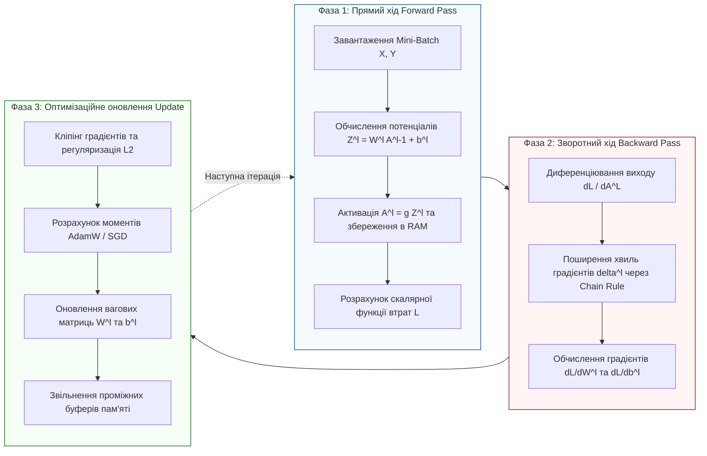
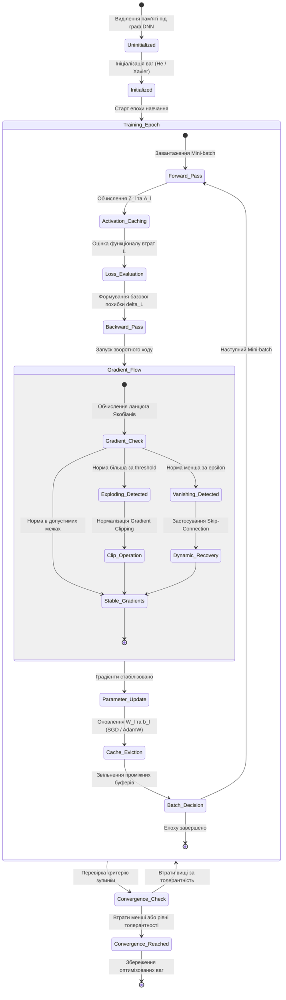
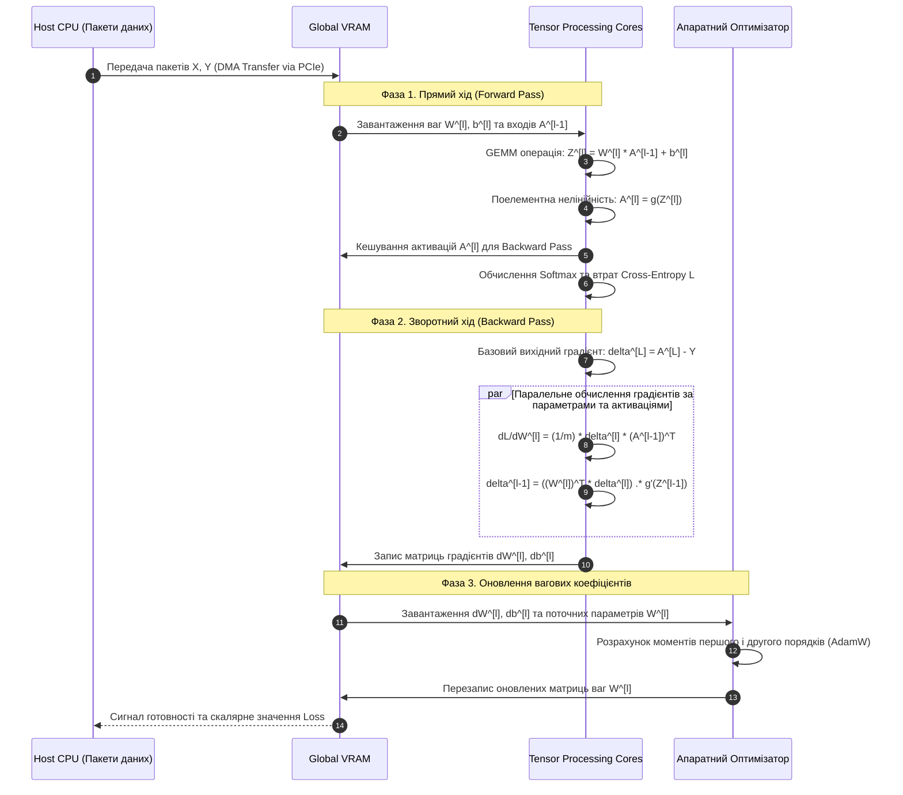
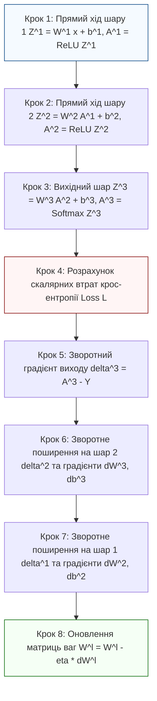

# Тема 8. Глибокі нейронні мережі (DNN) та математика навчання: математична модель штучного нейрона, градієнтний спуск, алгоритм зворотного поширення помилки, вибух та загасання градієнтів

## Мета лекції

Формування у майбутніх інженерів комп'ютерних систем цілісної системи фундаментальних теоретичних знань і практичних навичок проектування та оптимізації багатошарових нейромережевих архітектур на основі суворого апарату лінійної алгебри та матричного диференціального числення. Головна увага зосереджується на математичній формалізації обчислювальних процесів прямого та зворотного поширення помилки, аналітичному дослідженні стійкості градієнтних потоків у глибоких мережах, а також вивченні інженерних методів стабілізації навчання через вибір ненасичених функцій активації та узгоджену ініціалізацію вагових коефіцієнтів.

## Очікувані результати навчання

1. **Знання та розуміння.** Студенти повинні демонструвати системне розуміння архітектурної організації глибоких штучних нейронних мереж, фізико-математичного змісту прямого та зворотного ходів, фундаментальної ролі нелінійних функцій активації для запобігання колапсації шарів, а також сутності теореми універсальної апроксимації як теоретичного підґрунтя виразної спроможності DNN.

2. **Застосування.** Студенти мають оволодіти навичками аналітичного виведення та алгоритмічної реалізації векторно-матричних операцій прямого ходу і співвідношень алгоритму зворотного поширення помилки (Backpropagation) із застосуванням ланцюгового правила диференціювання для довільних конфігурацій повнозв'язних шарів, а також виконувати розрахунок параметрів ініціалізації Ксав'єра (Glorot) і Хе (Kaiming).

3. **Аналіз.** Студенти повинні вміти виконувати строгий спектральний аналіз матриць Якобі в ланцюгу поширення похибок, діагностувати виникнення патологій загасання (Vanishing) або вибуху (Exploding) градієнтів залежно від вибору функцій активації, глибини архітектури та спектрального радіуса матриць ваг, а також аналізувати ризики виникнення проблеми «відмирання нейронів» (Dying ReLU).

4. **Оцінювання та синтез.** Студенти мають навчитися критично оцінювати чисельну стійкість обчислювального графа мережі до помилок округлення та переповнення розрядної сітки, синтезувати комбіновані інженерні рішення для забезпечення стійкої збіжності оптимізаційного процесу на базі залишкових зв'язків (Residual Connections), регуляризаційних обмежень і динамічного кліпінгу градієнтів.

---

## Детальний покроковий план лекції

### 1. Теоретичний модуль. Архітектурні принципи та обчислювальний базис глибоких нейронних мереж
* 1.1. Еволюція обчислювальних моделей від формального нейрона Мак-Каллока-Піттса до багатошарових глибоких архітектур (DNN) та концепція автоматичного вилучення ієрархічних ознак (Feature Extraction).
* 1.2. Математична структура штучного нейрона: вектор вхідних сигналів, простір синаптичних ваг, операція зваженого підсумовування, вектор зсуву (Bias) та геометрична інтерпретація розділювальних гіперплощин.
* 1.3. Принцип нелінійності функцій активації, математичне доведення еквівалентності багатошарової лінійної мережі одношаровому перетворенню та концептуальні положення теореми універсальної апроксимації.
* 1.4. Структурна організація конвеєра навчання: фаза прямого поширення сигналу (Forward Pass), фаза зворотного поширення помилки (Backward Pass) та крок оптимізаційного оновлення параметрів.

### 2. Аналітичний модуль. Матрично-диференціальний апарат зворотного поширення та стійкість градієнтних потоків
* 2.1. Векторно-матрична формалізація прямого ходу для пакетного режиму обробки даних (Mini-batch) та формування компонентних тензорів вхідних потенціалів і вихідних активацій.
* 2.2. Строге математичне виведення алгоритму зворотного поширення помилки (Backpropagation) на основі матричного ланцюгового правила (Chain Rule) та оператора добутку Адамара.
* 2.3. Аналітичний вивід градієнта помилки вихідного шару для комбінації функції активації Softmax та функції втрат категоріальної крос-ентропії (Categorical Cross-Entropy).
* 2.4. Спектральний та асимптотичний аналіз добутку матриць Якобі: аналітичні причини експоненційного загасання (Vanishing) та вибуху (Exploding) градієнтних потоків.
* 2.5. Математичні засади дисперсійного узгодження сигналів: статистичне обґрунтування та виведення формул ініціалізації ваг Ксав'єра/Глорота (Xavier) та Хе/Каймінга (He).

### 3. Практично-розрахунковий кейс. Інженерні методи стабілізації навчання та наскрізний числовий розрахунок
**Тема наскрізної задачі.** «Аналітичний розрахунок і чисельне моделювання прямого та зворотного ходу в глибокій повнозв'язній нейронній мережі для діагностики відмов обчислювальних вузлів кластера з подоланням проблеми згасання градієнтів»

## 1. Фундаментальний теоретичний базис та концептуальні засади

### 1.1. Еволюція обчислювальних моделей: від формального нейрона до концепції автоматичного вилучення ієрархічних ознак

Історія розвитку методів штучного інтелекту та обчислювальних інтелектуальних систем базується на прагненні формалізувати принципи переробки інформації біологічними нейронними структурами. Фундаментом сучасних коннективістських моделей стала концепція, запропонована Ворреном Мак-Каллоком та Волтером Піттсом у 1943 році. Вони розробили модель спрощеного двійкового порогового елемента, у якому збудження або гальмування визначалося дискретною сумою зважених вхідних сигналів із подальшим порівнянням із фіксованим порогом спрацьовування. Подальшим еволюційним етапом стала розробка Френком Розенблаттом у 1958 році архітектури **перцептрона (Perceptron)**, що являла собою першу апаратно та програмно реалізовану систему, здатну до керованого навчання за рахунок ітеративного коригування синаптичних коефіцієнтів відповідно до теореми збіжності перцептрона.

Проте бурхливий розвиток одношарових нейромережевих структур зазнав суттєвої кризи після виходу у 1969 році монографії Марвіна Мінського та Сеймура Пейперта, які строго довели фундаментальні топологічні обмеження одношарового перцептрона. Головним теоретичним бар'єром стала нездатність одношарової структури реалізувати елементарну нелінійну логічну функцію «виключного АБО» (**XOR problem**), оскільки точки простору станів для цієї функції є лінійно неподільними у вихідній розмірності. Для подолання цього бар'єра була потрібна концепція **багатошарових нейронних мереж (Multilayer Perceptrons, MLP)**, однак тривалий час був відсутній математично коректний та обчислювально ефективний апарат оптимізації вагових коефіцієнтів прихованих рівнів, де відсутній прямий доступ до цільового еталонного сигналу.

Відродження та вихід на якісно новий рівень обчислювальної складності відбулися наприкінці 1980-х років із популяризацією узагальненого методу градієнтного спуску для багатошарових систем — алгоритму **зворотного поширення помилки (Backpropagation)**, систематизованого Девідом Румельхартом, Джеффрі Хінтоном та Рональдом Вільямсом. Перехід від неглибоких архітектур (із одним або двома прихованими шарами) до сучасних **глибоких нейронних мереж (Deep Neural Networks, DNN)** докорінно змінив парадигму інженерії даних:

У класичних схемах машинного навчання слабкою ланкою був етап **ручного вилучення ознак (Manual Feature Engineering)**, коли інженер-дослідник мусив емпірично синтезувати математичні фільтри (наприклад, фільтри Габора, перетворення Хаара, спектральні дескриптори) для перетворення вхідних даних у простір, де класи ставали лінійно роздільними. На відміну від цього підходу, глибокі нейронні мережі реалізують парадигму **наскрізного навчання за представленнями (End-to-End Representation Learning)**. Кожен наступний шар мережі виконує нелінійне перетворення простору попереднього шару, автоматично формуючи ієрархію абстракцій. Нижні шари фіксують локальні, високочастотні примітиви (границі, перепади градієнтів, фазові зсуви), тоді як глибокі шари синтезують стійкі до афінних деформацій інваріантні поняття, мінімізуючи втрату семантичної інформації.

---

### 1.2. Математична структура штучного нейрона та геометрична інтерпретація розділювальних гіперплощин

Елементарною функціональною ланкою, на основі якої формуються довільні конфігурації глибоких нейромережевих моделей, є **штучний нейрон (Artificial Neuron)**. Він здійснює суворе відображення множини вхідних сигналів векторного простору $\mathbb{R}^n$ у скалярне значення вихідного стану через дві послідовні математичні фази: афінне зважене перетворення та скалярну нелінійну фільтрацію.

Нехай вектор $\mathbf{x} = [x_1, x_2, \dots, x_n]^T \in \mathbb{R}^n$ репрезентує вхідний сигнал, що надходить на вхідні синапси нейрона від сенсорів або попередніх компонентів обчислювальної системи. Кожен синаптичний зв'язок характеризується скалярним ваговим коефіцієнтом, сукупність яких утворює вектор синаптичних ваг $\mathbf{w} = [w_1, w_2, \dots, w_n]^T \in \mathbb{R}^n$. Для забезпечення можливості паралельного зміщення гіперповерхні рішення відносно початку координат безпосередньо у внутрішнє ядро додається вільний параметр — **скалярний зсув (Bias)** $b \in \mathbb{R}$.

Обчислення лінійної комбінації вхідних сигналів нейрона — **вхідного потенціалу (Net Input)** $z \in \mathbb{R}$ — формалізується скалярним добутком у евклідовому просторі:

$$z = \mathbf{w}^T \mathbf{x} + b = \sum_{i=1}^{n} w_i x_i + b$$

де:
* $\mathbf{x} \in \mathbb{R}^{n \times 1}$ — вектор вхідних параметрів нейрона (дійсні числа, безрозмірні нормовані коефіцієнти або дискретні квантовані значення);
* $\mathbf{w} \in \mathbb{R}^{n \times 1}$ — вектор вагових коефіцієнтів синаптичних зв'язків нейрона, що визначає чутливість нейрона до окремих компонентів вхідного вектора (дійсні параметри моделі);
* $b \in \mathbb{R}$ — скалярний параметр зсуву нейрона, який забезпечує пороговий рівень деполяризації або просторове зміщення площини активації (дійсне число);
* $z \in \mathbb{R}$ — результуючий зважений вхідний потенціал штучного нейрона до застосування нелінійної функції активації.

Підсумкове значення вихідної активації $a \in \mathbb{R}$ обчислюється шляхом накладання на вхідний потенціал нелінійного оператора — **функції активації (Activation Function)** $g: \mathbb{R} \to \mathbb{R}$:

$$a = g(z) = g\left(\mathbf{w}^T \mathbf{x} + b\right)$$

де:
* $g(\cdot)$ — скалярна нелінійна функція активації (диференційована або кусково-гладка дійсного аргументу);
* $a \in \mathbb{R}$ — результуючий вихідний сигнал штучного нейрона, що передається наступним топологічним рівням нейронної мережі.

З аналітико-геометричної точки зору, робота штучного нейрона в задачах бінарної класифікації еквівалентна розбиттю $n$-вимірного простору ознак $\mathbb{R}^n$ на дві відкриті напівплощини за допомогою **розділювальної гіперплощини (Separating Hyperplane)** $\mathcal{H}$. Рівняння цієї гіперплощини визначається умовою рівності вхідного потенціалу нулю:

$$\mathcal{H} = \left\{ \mathbf{x} \in \mathbb{R}^n \;\middle|\; \mathbf{w}^T \mathbf{x} + b = 0 \right\}$$

Вектор синаптичних ваг $\mathbf{w}$ є вектором нормалі до гіперплощини $\mathcal{H}$, який строго визначає її просторову орієнтацію (кути нахилу відносно координатних осей), тоді як зсув $b$ однозначно регулює ортогональну відстань від початку координат до площини:

$$d(0, \mathcal{H}) = \frac{|b|}{\|\mathbf{w}\|_2} = \frac{|b|}{\sqrt{\sum_{i=1}^n w_i^2}}$$

де:
* $d(0, \mathcal{H})$ — найкоротша евклідова відстань від початку системи координат до поверхні розділювальної гіперплощини, виражена у метриці простору ознак $\mathbb{R}^n$;
* $\|\mathbf{w}\|_2$ — евклідова норма (довжина) вектора вагових коефіцієнтів нейрона.

Будь-яка точка простору ознак $\mathbf{x}^*$, для якої скалярний добуток перевищує поріг ($\mathbf{w}^T \mathbf{x}^* + b > 0$), належить до позитивного напівпростору $\mathcal{H}^+$, спричиняючи стан активації нейрона. Навпаки, значення $\mathbf{w}^T \mathbf{x}^* + b < 0$ відносить точку до негативного напівпростору $\mathcal{H}^-$, утримуючи нейрон у стані спокою або гальмування. Якщо множина даних не може бути розділена єдиною гіперплощиною, система є лінійно неподільною, що категорично вимагає переходу до багатошарових мереж.

---

### 1.3. Принцип нелінійності функцій активації, теорема про колапс лінійних мереж та універсальна апроксимація

Необхідність використання нелінійних функцій активації у прихованих шарах є фундаментальним математичним імперативом глибинного навчання. Для строгого аналітичного доведення цього факту сформулюємо твердження про еквівалентність багатошарової лінійної нейронної мережі одношаровому лінійному оператору (теорема про лінійний колапс).

Розглянемо прямоспрямовану мережу глибиною $L$ шарів. Припустимо, що функція активації кожного прихованого та вихідного шару є строго лінійною або тотожною, тобто $g^{[l]}(z) = c^{[l]} \cdot z$, де $c^{[l]} \in \mathbb{R} \setminus \{0\}$. Без обмеження загальності покладемо $c^{[l]} = 1$, отже, $g^{[l]}(z) = z$ для всіх $l \in \{1, 2, \dots, L\}$. 

Для першого прихованого шару $l = 1$ за вхідного вектора $\mathbf{x} = \mathbf{a}^{[0]}$ вектор активацій набуває вигляду:

$$\mathbf{a}^{[1]} = \mathbf{W}^{[1]} \mathbf{x} + \mathbf{b}^{[1]}$$

Для другого шару $l = 2$ активація визначається рекурентним співвідношенням:

$$\mathbf{a}^{[2]} = \mathbf{W}^{[2]} \mathbf{a}^{[1]} + \mathbf{b}^{[2]}$$

Підставивши вираз для $\mathbf{a}^{[1]}$ у формулу другого шару та застосувавши дистрибутивну властивість матричного множення відносно додавання, отримуємо:

$$\mathbf{a}^{[2]} = \mathbf{W}^{[2]} \left(\mathbf{W}^{[1]} \mathbf{x} + \mathbf{b}^{[1]}\right) + \mathbf{b}^{[2]} = \left(\mathbf{W}^{[2]} \mathbf{W}^{[1]}\right) \mathbf{x} + \left(\mathbf{W}^{[2]} \mathbf{b}^{[1]} + \mathbf{b}^{[2]}\right)$$

Застосовуючи математичну індукцію для довільного кінцевого шару $L$, маємо повне розгортання вхідного сигналу у вихідний вектор $\mathbf{a}^{[L]}$:

$$\mathbf{a}^{[L]} = \mathbf{W}^{[L]} \mathbf{a}^{[L-1]} + \mathbf{b}^{[L]} = \left( \prod_{l=L}^{1} \mathbf{W}^{[l]} \right) \mathbf{x} + \left( \mathbf{b}^{[L]} + \sum_{k=1}^{L-1} \left( \prod_{j=L}^{k+1} \mathbf{W}^{[j]} \right) \mathbf{b}^{[k]} \right)$$

Визначимо ефективну матрицю ваг $\mathbf{W}_{eff}$ та ефективний вектор зсувів $\mathbf{b}_{eff}$ як композицію параметрів усіх шарів:

$$\mathbf{W}_{eff} = \prod_{l=L}^{1} \mathbf{W}^{[l]} = \mathbf{W}^{[L]} \mathbf{W}^{[L-1]} \dots \mathbf{W}^{[1]} \in \mathbb{R}^{n^{[L]} \times n^{[0]}}$$

$$\mathbf{b}_{eff} = \mathbf{b}^{[L]} + \sum_{k=1}^{L-1} \left( \prod_{j=L}^{k+1} \mathbf{W}^{[j]} \right) \mathbf{b}^{[k]} \in \mathbb{R}^{n^{[L]} \times 1}$$

Внаслідок замкненості простору матриць відносно операцій множення та додавання, $\mathbf{W}_{eff}$ є єдиною матрицею лінійного відображення, а $\mathbf{b}_{eff}$ — єдиним результуючим вектором зсуву. Звідси випливає фундаментальний висновок:

$$\mathbf{a}^{[L]} = \mathbf{W}_{eff} \mathbf{x} + \mathbf{b}_{eff}$$

Тобто будь-яка глибока нейронна мережа з лінійними функціями активації, що містить довільну кількість прихованих шарів та нейронів, тотожно колапсує до елементарного одношарового афінного перетворення. Така мережа принципово нездатна моделювати нелінійні взаємозв'язки або викривляти метричний простір даних для поділу складних багатовимірних топологій.

Математичне обґрунтування того, чому введення нелінійності $g(z)$ надає нейронним мережам статус універсальних обчислювальних апроксиматорів, спирається на **Теорему універсальної апроксимації (Universal Approximation Theorem)**, доказану Джорджем Цибенком (1989 р.) для сигмоїдальних активацій і розширену Куртом Горніком (1991 р.) для довільних нелінійних функцій.

> **ВАЖЛИВО:** Нехай $I_n \subset \mathbb{R}^n$ — компактна підмножина евклідового простору. Нехай $C(I_n)$ — простір усіх неперервних дійсних функцій на $I_n$. Якщо функція активації $g: \mathbb{R} \to \mathbb{R}$ є неперервною, локально обмеженою та неполіноміальною, то лінійна комбінація функцій вигляду:
> 
> $$F(\mathbf{x}) = \sum_{i=1}^{N} \alpha_i \, g\left(\mathbf{w}_i^T \mathbf{x} + b_i\right)$$
> 
> є скрізь щільною в просторі $C(I_n)$ відносно рівномірної норми. Це означає, що для будь-якої цільової неперервної функції $f \in C(I_n)$ та довільного як завгодно малого додатного параметра точності $\varepsilon > 0$ існує таке скінченне число нейронів $N \in \mathbb{N}$ і такі значення параметрів $\alpha_i, b_i \in \mathbb{R}, \mathbf{w}_i \in \mathbb{R}^n$, що виконується нерівність:
> 
> $$\sup_{\mathbf{x} \in I_n} \left| F(\mathbf{x}) - f(\mathbf{x}) \right| < \varepsilon$$

Теорема Цибенка-Горніка гарантує, що навіть мережа з одним прихованим шаром теоретично здатна апроксимувати довільну гладку залежність. Проте теорема є **теоремою існування (non-constructive existence theorem)**: вона не надає алгоритму знаходження параметрів, не враховує похибки оптимізації і, що найважливіше, може вимагати для складної цільової залежності експоненційної ширини шару ($N \sim \mathcal{O}(2^n)$). Практичний сенс саме *глибоких* архітектур (DNN) полягає в тому, що за рахунок глибини мережі здійснюється композиційне повторне використання проміжних ознак, що знижує необхідну сумарну кількість параметрів від експоненційної до поліноміальної залежності $\mathcal{O}(\text{poly}(n))$.

---

### 1.4. Організація трифазного обчислювального конвеєра навчання штучних нейронних мереж

Процес навчання глибокої нейронної мережі на сучасних апаратних прискорювачах (GPU, TPU) розгортається як ітераційний цикл проходження пакетів даних (**mini-batches**) через послідовні обчислювальні стадії. Навчальний процес розбивається на три чітко синхронізовані фази:

1. **Прямий хід (Forward Pass).** Дані пакують у батч розміром $m$, після чого вони проходять через матричні помножувачі апаратних ядер. На кожному шарі $l \in \{1, \dots, L\}$ обчислюються матриці $Z^{[l]}$ та $A^{[l]}$. Критично важливою особливістю цієї фази для комп'ютерного інженера є те, що всі проміжні матриці потенціалів $Z^{[l]}$ та активацій $A^{[l-1]}$ **мусять бути збережені в пам'яті графічного прискорювача (VRAM)**. Вони знадобляться на фазі зворотного ходу для обчислення похідних, що формує основне навантаження на підсистему локальної пам'яті обчислювального вузла.
2. **Зворотний хід (Backward Pass / Backpropagation).** Починається з диференціювання скалярної функції втрат $\mathcal{L}$ на виході мережі. Помилка у вигляді градієнтного сигналу $\delta^{[L]}$ послідовно проєктується від вихідного шару назад до першого шару через матричні операції транспонованого множення та ланцюгове правило диференціювання. На цій фазі генеруються тензори часткових похідних цільової функції за всіма матрицями ваг $\frac{\partial \mathcal{L}}{\partial W^{[l]}}$ та векторами зсувів $\frac{\partial \mathcal{L}}{\partial b^{[l]}}$.
3. **Оптимізаційне оновлення параметрів (Optimization Step).** Отримані градієнти агрегуються та передаються в алгоритм оптимізації (наприклад, стохастичний градієнтний спуск **SGD** з моментом або адаптивний оптимізатор **AdamW**). На цьому етапі відбувається масштабування градієнтів за допомогою швидкості навчання (**Learning Rate**) $\eta$, за потреби виконується обрізання норми градієнтів (**Gradient Clipping**) для захисту від чисельного вибуху, і оновлені значення ваг перезаписуються в пам'ять. Проміжні тензори активацій, зафіксовані під час прямого ходу, після обчислення градієнта відповідного шару вивільняються, звільняючи простір оперативної пам'яті для наступних пакетів.

Нижче наведено порівняльну систематизацію фундаментальних класів нейромережевих архітектур, що відображає еволюцію їхнього математичного та топологічного базису.

| Архітектурний клас | Базовий математичний оператор | Механізм вилучення ознак | Геометрія розділювальної поверхні | Обчислювальна складність прямого ходу | Основні апаратні обмеження |
| :--- | :--- | :--- | :--- | :--- | :--- |
| **Одношаровий перцептрон (Perceptron)** | Зважене скалярне множення $\mathbf{w}^T \mathbf{x} + b$ з пороговим відсіканням | Ручне формування вхідного вектора без прихованого перетворення | Єдина гіперплощина $\mathcal{H} \subset \mathbb{R}^n$, поділ на 2 напівпростори | $\mathcal{O}(n)$, де $n$ — розмірність входу | Принципова нездатність виділяти нелінійно подільні класи |
| **Багатошаровий перцептрон (MLP / DNN)** | Матричне множення $\mathbf{W} \mathbf{a} + \mathbf{b}$ з поелементною нелінійністю | Автоматичне ієрархічне згортання та розгортання просторів ознак | Кусково-лінійні або нелінійні складні замкнені гіперповерхні | $\mathcal{O}\left(\sum_{l=1}^L n^{[l]} n^{[l-1]}\right)$ для одного зразка | Обмеження пропускної здатності шини пам'яті при зберіганні $A^{[l]}$ |
| **Згорткові мережі (CNN)** | Дискретна двовимірна просторова згортка $\mathbf{I} * \mathbf{K}$ та пулінг | Локальні інваріантні до зсуву фільтри з розділюваними вагами | Композиція високорівневих просторових многовидів у $\mathbb{R}^d$ | $\mathcal{O}\left(\sum_l H_l W_l C_{in} C_{out} K_h K_w\right)$ | Обчислювальна інтенсивність операцій зсуву та канальної агрегації |
| **Рекурентні мережі (RNN / LSTM)** | Часово-послідовне матричне множення $\mathbf{W}_{hh} \mathbf{h}_{t-1} + \mathbf{W}_{xh} \mathbf{x}_t$ | Динамічне накопичення інформації у прихованому стані $\mathbf{h}_t$ | Динамічно змінювані в часі нелінійні траєкторії розділення | $\mathcal{O}(T \cdot H^2)$, де $T$ — довжина серії, $H$ — розмір стану | Неможливість паралелізації за часовою віссю $T$ на прямому ході |
| **Трансформери (Transformer)** | Масштабований матричний добуток скалярних добутків $\text{Softmax}\left(\frac{\mathbf{Q}\mathbf{K}^T}{\sqrt{d_k}}\right)\mathbf{V}$ | Глобальна багатозаголовкова увага (**Multi-Head Self-Attention**) | Складні багатовимірні контекстно-залежні розділювальні простори | $\mathcal{O}(T^2 \cdot d + T \cdot d^2)$, квадратична від довжини $T$ | Квадратичне зростання вимог до оперативної пам'яті $\mathcal{O}(T^2)$ |

---

> **ТИПОВА ПОМИЛКА:** Поширеним хибним уявленням серед інженерів-початківців є думка, що збільшення глибини нейронної мережі шляхом нарощування кількості прихованих шарів автоматично гарантує пропорційне зростання виразної спроможності моделі незалежно від типу функцій активації. 
> 
> Як суворо доведено в підрозділі 1.3, якщо у прихованих шарах використовуються лінійні активаційні функції (або якщо функція активації вироджується в лінійну форму через невдалу ініціалізацію чи неправильну область значень), довільна кількість шарів аналітично колапсує до звичайного одношарового афінного перетворення $\mathbf{W}_{eff} \mathbf{x} + \mathbf{b}_{eff}$. У такому випадку додавання нових шарів не тільки не розширює клас розв'язуваних задач, але й призводить до деградації обчислювальної системи через невиправдані витрати пам'яті та сповільнення зворотного ходу без будь-якого приросту точності.

---

> **КОНТРОЛЬНЕ ПИТАННЯ.** Нехай спроєктовано багатошарову штучну нейронну мережу, що складається з 10 повнозв'язних прихованих шарів по 128 нейронів у кожному. У якості функцій активації всіх прихованих шарів розробник обрав функцію $g(z) = 3z + 5$. Чи здатна дана нейронна мережа успішно вирішити задачу нелінійної класифікації для виявлення логічної структури XOR, і який вигляд матиме еквівалентне матричне перетворення вихідного сигналу через вхідний вектор?

Розгорнути відповідь

**Правильна відповідь:** Дана нейронна мережа принципово **не здатна** розв'язати задачу нелінійної класифікації (зокрема проблему XOR), оскільки функція $g(z) = 3z + 5$ є афінною (лінійною зі зсувом). Будь-яка композиція афінних відображень залишається строго афінним відображенням, що не дозволяє викривляти метричний простір для забезпечення лінійної подільності класів.

1. **Математичне обґрунтування лінійного колапсу:**

    Розглянемо шар $l$, де обчислюється вектор потенціалів:

    $$\mathbf{z}^{[l]} = \mathbf{W}^{[l]} \mathbf{a}^{[l-1]} + \mathbf{b}^{[l]}$$

    Застосування функції активації $g(z) = 3z + 5$ у векторно-матричній формі записується як:

    $$\mathbf{a}^{[l]} = 3 \mathbf{z}^{[l]} + 5 \cdot \mathbf{1} = 3 \left(\mathbf{W}^{[l]} \mathbf{a}^{[l-1]} + \mathbf{b}^{[l]}\right) + 5 \cdot \mathbf{1} = \left(3 \mathbf{W}^{[l]}\right) \mathbf{a}^{[l-1]} + \left(3 \mathbf{b}^{[l]} + 5 \cdot \mathbf{1}\right)$$

    Позначимо модифіковані матриці ваг та векторів зсуву шару $l$:

    $$\widetilde{\mathbf{W}}^{[l]} = 3 \mathbf{W}^{[l]}, \quad \widetilde{\mathbf{b}}^{[l]} = 3 \mathbf{b}^{[l]} + 5 \cdot \mathbf{1}$$

    Тоді рекурентне співвідношення для всього ланцюга шарів набуває стандартного лінійного вигляду $\mathbf{a}^{[l]} = \widetilde{\mathbf{W}}^{[l]} \mathbf{a}^{[l-1]} + \widetilde{\mathbf{b}}^{[l]}$. Відповідно до теореми про лінійний колапс, композиція десяти таких шарів згортається у єдине еквівалентне лінійне рівняння:

    $$\mathbf{a}^{[10]} = \mathbf{W}_{eff} \mathbf{x} + \mathbf{b}_{eff}$$

    де ефективна матриця та вектор визначаються добутками:

    $$\mathbf{W}_{eff} = \prod_{l=10}^{1} \widetilde{\mathbf{W}}^{[l]} = 3^{10} \prod_{l=10}^{1} \mathbf{W}^{[l]}$$

    $$\mathbf{b}_{eff} = \widetilde{\mathbf{b}}^{[10]} + \sum_{k=1}^{9} \left( \prod_{j=10}^{k+1} \widetilde{\mathbf{W}}^{[j]} \right) \widetilde{\mathbf{b}}^{[k]}$$

2. **Аналіз геометричних наслідків:**

    * Отримана функція $\mathbf{a}^{[10]}(\mathbf{x})$ описує виключно лінійну розділювальну гіперплощину в просторі вхідних параметрів.
    * Оскільки логічна функція XOR вимагає мінімум двох перетинних розділювальних прямих на площині ознак для коректного відокремлення точок $(0, 1)$ та $(1, 0)$ від точок $(0, 0)$ та $(1, 1)$, єдина площина, породжена згорнутою системою, гарантовано дає помилку класифікації не менше 25%.

---

### Вказівки для самостійного осмислення теоретичного базису

1. Дослідіть закономірності формування компромісу між шириною шару (кількістю паралельних нейронів) та глибиною мережі (кількістю послідовних шарів). Проаналізуйте, чому з точки зору теорії інформації та обчислювальної ємності схем експоненційна кількість параметрів у широкій неглибокій мережі поступається поліноміальній ємності глибоких мереж при представленні складної логіки композиції ознак.
2. Проаналізуйте зв'язок між метричною розмірністю вхідного простору ознак $\mathbb{R}^n$ та кількістю розділювальних гіперплощин, необхідних для формування замкнених опуклих багатогранників рішень. Зіставте це з кількістю нейронів у першому та другому прихованих шарах багатошарового перцептрона для довільної кусочно-неперервної поверхні класифікації.
3. Оцініть наслідки масштабування обчислень при переході від поодинокої обробки векторів $\mathbf{x} \in \mathbb{R}^n$ до пакетної обробки тензорів $\mathbf{X} \in \mathbb{R}^{m \times n}$. Зверніть увагу на зміну вимог до кеш-пам'яті першого та другого рівнів обчислювальних процесорів та визначте причини, чому ефективність утилізації апаратних ядер GPU зростає зі збільшенням розміру пакета $m$.

## 2. Аналітичні процеси, математичний апарат та моделювання

### 2.1. Векторно-матрична формалізація прямого ходу для пакетного режиму обробки даних

Обчислювальний процес прямого поширення сигналу в сучасних глибоких нейронних мережах оптимізовано під векторно-конвеєрні та матричні обчислювальні прискорювачі шляхом групування окремих векторів вхідних ознак у пакетні матричні структури (**Mini-batch tensors**). Це дозволяє трансформувати дискретні операції над векторами у високопродуктивні процедури множення матриць загального вигляду (**GEMM — General Matrix Multiply**), максимізуючи утилізацію обчислювальних ядер і зменшуючи кількість звернень до глобальної пам'яті.

Нехай навчальна вибірка розбита на пакети обсягом $m \in \mathbb{N}$ незалежних прикладів. Множина вхідних сигналів першого шару формалізується матрицею вихідних активацій $\mathbf{A}^{[0]} \in \mathbb{R}^{n^{[0]} \times m}$, де кожен стовпчик є окремим $n^{[0]}$-вимірним вектором ознак:

$$\mathbf{A}^{[0]} = \begin{bmatrix} \mathbf{x}^{(1)} & \mathbf{x}^{(2)} & \dots & \mathbf{x}^{(m)} \end{bmatrix} = \begin{bmatrix} x_{1}^{(1)} & x_{1}^{(2)} & \dots & x_{1}^{(m)} \\ x_{2}^{(1)} & x_{2}^{(2)} & \dots & x_{2}^{(m)} \\ \vdots & \vdots & \ddots & \vdots \\ x_{n^{[0]}}^{(1)} & x_{n^{[0]}}^{(2)} & \dots & x_{n^{[0]}}^{(m)} \end{bmatrix}$$

Для довільного прихованого або вихідного шару $l \in \{1, 2, \dots, L\}$ обчислювальний процес прямого ходу у метричному просторі формується системою аналітичних матричних рівнянь:

$$\mathbf{Z}^{[l]} = \mathbf{W}^{[l]} \mathbf{A}^{[l-1]} + \mathbf{b}^{[l]} \mathbf{1}_m^T$$

$$\mathbf{A}^{[l]} = g^{[l]}\left(\mathbf{Z}^{[l]}\right)$$

де:
* $\mathbf{W}^{[l]} \in \mathbb{R}^{n^{[l]} \times n^{[l-1]}}$ — матриця вагових коефіцієнтів між шарами $l-1$ та $l$, елемент $w_{ij}^{[l]}$ якої визначає силу синаптичного зв'язку від $j$-го нейрона попереднього шару до $i$-го нейрона поточного шару (тип даних — дійсні числа одинарної FP32 або половинної FP16/BF16 точності);
* $\mathbf{A}^{[l-1]} \in \mathbb{R}^{n^{[l-1]} \times m}$ — матриця вихідних активацій шару $l-1$, яка транслюється на вхід шару $l$ (для вхідного рівня $\mathbf{A}^{[0]} = \mathbf{X}$);
* $\mathbf{b}^{[l]} \in \mathbb{R}^{n^{[l]} \times 1}$ — вектор-стовпчик зсувів шару $l$, що задає порогові константи для кожного з $n^{[l]}$ нейронів;
* $\mathbf{1}_m = [1, 1, \dots, 1]^T \in \mathbb{R}^{m \times 1}$ — одиничний вектор розмірності $m$, векторний добуток якого на транспонований вектор зсуву $\mathbf{b}^{[l]} \mathbf{1}_m^T$ здійснює операцію широкомовного копіювання (**broadcasting**) зсувів на всі $m$ прикладів батчу;
* $\mathbf{Z}^{[l]} \in \mathbb{R}^{n^{[l]} \times m}$ — матриця сумарних лінійних потенціалів шару $l$, обчислена для всіх елементів пакета;
* $g^{[l]}(\cdot)$ — нелінійна скалярна функція активації шару $l$, що застосовується поелементно до кожного компонента матриці $\mathbf{Z}^{[l]}$;
* $\mathbf{A}^{[l]} \in \mathbb{R}^{n^{[l]} \times m}$ — підсумкова матриця активацій шару $l$, стовпці якої є вхідними векторами для наступного шару або фінальними прогнозами системи.

Обчислювальні накладні витрати на виконання прямого ходу для всього конвеєра з $L$ шарів визначаються сумарною кількістю операцій із рухомою комою (FLOPs). Оскільки матричне множення розмірностей $(n^{[l]} \times n^{[l-1]}) \times (n^{[l-1]} \times m)$ потребує $2 \cdot m \cdot n^{[l]} \cdot n^{[l-1]}$ операцій множення та додавання (FMA-інструкцій), сумарна обчислювальна складність $T_{FP}$ прямого ходу оцінюється співвідношенням:

$$T_{FP} = 2m \sum_{l=1}^{L} n^{[l]} n^{[l-1]} + m \sum_{l=1}^{L} n^{[l]} c_{act}$$

де $c_{act}$ — скалярна кількість операцій, необхідна для обчислення обраної функції активації $g^{[l]}(\cdot)$ для одного елемента.

Апаратна місткість оперативної пам'яті графічного прискорювача $\mathcal{M}_{act}$, необхідна для кешування проміжних тензорів активацій з метою подальшого забезпечення збіжності зворотного ходу, формалізується виразом:

$$\mathcal{M}_{act} = s_p \cdot m \sum_{l=0}^{L} n^{[l]}$$

де $s_p$ — розмір комірки пам'яті в байтах для обраного числового формату представлення ваг (наприклад, $s_p = 4$ байти для стандарту IEEE 754 FP32, $s_p = 2$ байти для FP16 або $s_p = 1$ байт для цілочисельного квантування INT8).

---

### 2.2. Математичне виведення алгоритму зворотного поширення помилки на основі матричного ланцюгового правила

Алгоритм зворотного поширення помилки (**Backpropagation**) базується на строгому застосуванні ланцюгового правила диференціювання функцій багатьох змінних (**Chain Rule**) у просторі матриць та векторів. Розглянемо загальну цільову функцію втрат $\mathcal{L}\left(\mathbf{A}^{[L]}, \mathbf{Y}\right) \in \mathbb{R}$, обчислену як середнє значення скалярних функцій втрат $\ell\left(\mathbf{a}^{(i)[L]}, \mathbf{y}^{(i)}\right)$ для $m$ об'єктів вибірки:

$$\mathcal{L} = \frac{1}{m} \sum_{i=1}^{m} \ell\left(\mathbf{a}^{(i)[L]}, \mathbf{y}^{(i)}\right)$$

Для довільного шару $l$ визначимо матрицю помилки (градієнт вхідного лінійного потенціалу) $\boldsymbol{\delta}^{[l]} \in \mathbb{R}^{n^{[l]} \times m}$ як повну часткову похідну цільового функціонала за матрицею $\mathbf{Z}^{[l]}$:

$$\boldsymbol{\delta}^{[l]} = \frac{\partial \mathcal{L}}{\partial \mathbf{Z}^{[l]}}$$

Покроковий процес виведення рекурентної залежності зворотного поширення градієнтів та оновлення параметрів має такий вигляд:

$$
\begin{aligned}
\text{Етап 1 (Ланцюгова декомпозиція):} & \quad \boldsymbol{\delta}^{[l]} = \frac{\partial \mathcal{L}}{\partial \mathbf{Z}^{[l]}} = \left( \frac{\partial \mathbf{A}^{[l]}}{\partial \mathbf{Z}^{[l]}} \right) \cdot \frac{\partial \mathcal{L}}{\partial \mathbf{A}^{[l]}} = \left( \frac{\partial \mathcal{L}}{\partial \mathbf{A}^{[l]}} \right) \odot g'^{[l]}\left(\mathbf{Z}^{[l]}\right) \\
\text{Етап 2 (Зворотне проєктування):} & \quad \frac{\partial \mathcal{L}}{\partial \mathbf{A}^{[l-1]}} = \left( \frac{\partial \mathbf{Z}^{[l]}}{\partial \mathbf{A}^{[l-1]}} \right)^T \frac{\partial \mathcal{L}}{\partial \mathbf{Z}^{[l]}} = \left(\mathbf{W}^{[l]}\right)^T \boldsymbol{\delta}^{[l]} \\
\text{Етап 3 (Міжшарова рекурсія):} & \quad \boldsymbol{\delta}^{[l-1]} = \left[ \left(\mathbf{W}^{[l]}\right)^T \boldsymbol{\delta}^{[l]} \right] \odot g'^{[l-1]}\left(\mathbf{Z}^{[l-1]}\right) \\
\text{Етап 4 (Градієнт за ваговими матрицями):} & \quad \frac{\partial \mathcal{L}}{\partial \mathbf{W}^{[l]}} = \frac{1}{m} \sum_{i=1}^m \boldsymbol{\delta}^{(i)[l]} \left(\mathbf{a}^{(i)[l-1]}\right)^T = \frac{1}{m} \boldsymbol{\delta}^{[l]} \left(\mathbf{A}^{[l-1]}\right)^T \\
\text{Етап 5 (Градієнт за векторами зсувів):} & \quad \frac{\partial \mathcal{L}}{\partial \mathbf{b}^{[l]}} = \frac{1}{m} \sum_{i=1}^m \boldsymbol{\delta}^{(i)[l]} = \frac{1}{m} \boldsymbol{\delta}^{[l]} \mathbf{1}_m
\end{aligned}
$$

де:
* $\odot$ — бінарний оператор добутку Адамара (поелементне множення матриць або векторів однакової розмірності);
* $g'^{[l]}\left(\mathbf{Z}^{[l]}\right) \in \mathbb{R}^{n^{[l]} \times m}$ — матриця перших похідних скалярної функції активації, обчислених у точках лінійних потенціалів відповідного шару;
* $\left(\mathbf{W}^{[l]}\right)^T \in \mathbb{R}^{n^{[l-1]} \times n^{[l]}}$ — транспонована матриця синаптичних ваг, що забезпечує коректне лінійне проєктування вектора помилки назад у розмірність шару $l-1$;
* $\frac{\partial \mathcal{L}}{\partial \mathbf{W}^{[l]}} \in \mathbb{R}^{n^{[l]} \times n^{[l-1]}}$ — тензор градієнтів цільової функції за вагами шару $l$, усереднений за розміром пакета $m$;
* $\frac{\partial \mathcal{L}}{\partial \mathbf{b}^{[l]}} \in \mathbb{R}^{n^{[l]} \times 1}$ — вектор градієнтів цільової функції за зсувами шару $l$, отриманий сумуванням стовпців матриці помилки $\boldsymbol{\delta}^{[l]}$ уздовж пакетної осі.

---

### 2.3. Аналітичний вивід градієнта для зв'язки функцій Softmax та Categorical Cross-Entropy

Для задач багатокласової класифікації з кількістю взаємовиключних класів $C \in \mathbb{N}$ вихідний шар $L$ ($n^{[L]} = C$) використовує нормалізуючу функцію **Softmax**, а функціонал оптимізації формується на основі **категоріальної крос-ентропії (Categorical Cross-Entropy)**.

Для довільного одиночного вектора потенціалів вихідного шару $\mathbf{z} = [z_1, z_2, \dots, z_C]^T$ функція Softmax визначає ймовірнісний розподіл прогнозу $\mathbf{a} = [a_1, a_2, \dots, a_C]^T$:

$$a_i = \frac{e^{z_i}}{\sum_{k=1}^C e^{z_k}}, \quad \forall i \in \{1, 2, \dots, C\}$$

Функція втрат крос-ентропії для вектора істинних міток $\mathbf{y} = [y_1, y_2, \dots, y_C]^T \in \{0, 1\}^C$ у форматі One-Hot Encoding має вигляд:

$$\ell(\mathbf{a}, \mathbf{y}) = - \sum_{j=1}^C y_j \ln(a_j)$$

Аналітичне диференціювання цільової функції за вхідним потенціалом $z_k$ містить поетапний розрахунок матриці Якобі для оператора Softmax з подальшим скалярним згортанням:

$$
\begin{aligned}
\text{Етап 1 (Якобіан Softmax при } i = k\text{):} & \quad \frac{\partial a_k}{\partial z_k} = \frac{e^{z_k} \sum_{j=1}^C e^{z_j} - (e^{z_k})^2}{\left(\sum_{j=1}^C e^{z_j}\right)^2} = a_k - a_k^2 = a_k(1 - a_k) \\
\text{Етап 2 (Якобіан Softmax при } i \neq k\text{):} & \quad \frac{\partial a_i}{\partial z_k} = \frac{0 - e^{z_i} e^{z_k}}{\left(\sum_{j=1}^C e^{z_j}\right)^2} = -a_i a_k \\
\text{Етап 3 (Диференціювання втрат):} & \quad \frac{\partial \ell}{\partial a_i} = - \frac{y_i}{a_i} \\
\text{Етап 4 (Згортка за правилом ланцюга):} & \quad \delta_k = \frac{\partial \ell}{\partial z_k} = \sum_{i=1}^C \frac{\partial \ell}{\partial a_i} \frac{\partial a_i}{\partial z_k} = - \frac{y_k}{a_k} \left[a_k(1 - a_k)\right] - \sum_{i \neq k}^C \frac{y_i}{a_i} \left[- a_i a_k\right] \\
\text{Етап 5 (Алгебраїчна редукція):} & \quad \delta_k = - y_k(1 - a_k) + \sum_{i \neq k}^C y_i a_k = - y_k + y_k a_k + a_k \sum_{i \neq k}^C y_i
\end{aligned}
$$

Оскільки для унітарного кодування $\sum_{i=1}^C y_i = y_k + \sum_{i \neq k}^C y_i = 1$, згрупований вираз зводиться до:

$$\delta_k = -y_k + a_k \left( y_k + \sum_{i \neq k}^C y_i \right) = -y_k + a_k (1) = a_k - y_k$$

Узагальнюючи результат на весь пакет $m$ у векторно-матричній формі, отримуємо точний аналітичний вираз:

$$\boldsymbol{\delta}^{[L]} = \mathbf{A}^{[L]} - \mathbf{Y}$$

Аналіз граничної поведінки отриманого співвідношення показує високу стійкість:
1. Якщо модель повністю впевнена в істинному класі ($k$-й клас, $y_k = 1$), то за умови $z_k \gg z_{j \neq k}$ маємо:
   $$\lim_{z_k \to +\infty} a_k = 1 \implies \lim_{z_k \to +\infty} \delta_k = 1 - 1 = 0$$
   У цьому стані градієнт прямує до нуля, сигналізуючи про відсутність потреби в зміні параметрів.
2. Якщо ж модель видає хибну відповідь з абсолютною впевненістю ($a_k \to 0$ при $y_k = 1$), градієнт досягає свого абсолютного максимуму:
   $$\lim_{a_k \to 0} \delta_k = 0 - 1 = -1$$
   Це забезпечує максимальну коригувальну дію оптимізатора без виникнення чисельної невизначеності.

---

### 2.4. Спектральний та асимптотичний аналіз добутку матриць Якобі: згасання та вибух градієнтних потоків

Розгорнемо рекурентний вираз для вектора похибки $\boldsymbol{\delta}^{[1]}$ першого прихованого шару через градієнтний сигнал вихідного шару $\boldsymbol{\delta}^{[L]}$ для окремого вектора даних. Застосовуючи послідовне розкриття співвідношень зворотного ходу, маємо:

$$\boldsymbol{\delta}^{[1]} = \left[ \prod_{l=1}^{L-1} \left( \mathbf{W}^{[l+1]} \right)^T \mathbf{D}^{[l]} \right] \boldsymbol{\delta}^{[L]}$$

де $\mathbf{D}^{[l]} = \text{diag}\left(g'^{[l]}\left(\mathbf{z}^{[l]}\right)\right) \in \mathbb{R}^{n^{[l]} \times n^{[l]}}$ — діагональна матриця Якобі локальних похідних функцій активації шару $l$.

Оцінимо евклідову норму вектора градієнта $\|\boldsymbol{\delta}^{[1]}\|_2$ за допомогою субординованої спектральної матричної норми $\|\cdot\|_2$:

$$\|\boldsymbol{\delta}^{[1]}\|_2 \le \|\boldsymbol{\delta}^{[L]}\|_2 \prod_{l=1}^{L-1} \left\| \left(\mathbf{W}^{[l+1]}\right)^T \right\|_2 \left\| \mathbf{D}^{[l]} \right\|_2$$

Для матриці похідних норма строго обмежена супремумом похідної функції активації: $\|\mathbf{D}^{[l]}\|_2 = \max_{j} \left|g'^{[l]}(z_j^{[l]})\right| \le \gamma$. Спектральна норма вагової матриці дорівнює її максимальному сингулярному числу: $\|\mathbf{W}^{[l+1]}\|_2 = \sigma_{\max}\left(\mathbf{W}^{[l+1]}\right)$. Якщо припустити середню оцінку спектральної норми матриць ваг $\|\mathbf{W}\|_2 \approx \omega$, то градієнтна норма обмежується експоненційною функцією від глибини мережі $L$:

$$\|\boldsymbol{\delta}^{[1]}\|_2 \le \|\boldsymbol{\delta}^{[L]}\|_2 \cdot (\omega \cdot \gamma)^{L-1}$$

Аналіз граничної поведінки при зростанні глибини мережі ($L \to \infty$) виявляє дві біфуркаційні патології:

1. **Експоненційне загасання градієнтів (Vanishing Gradient Problem):**
   $$
   \begin{aligned}
   \text{Умова виникнення:} & \quad \omega \cdot \gamma < 1 \\
   \text{Асимптотична межа:} & \quad \lim_{L \to \infty} \|\boldsymbol{\delta}^{[1]}\|_2 = \|\boldsymbol{\delta}^{[L]}\|_2 \cdot \lim_{L \to \infty} (\omega \cdot \gamma)^{L-1} = 0
   \end{aligned}
   $$
   Якщо у прихованих шарах застосовано функцію **Sigmoid**, максимальне значення її похідної $g'(z) = \sigma(z)(1 - \sigma(z))$ досягається при $z = 0$ і становить $\gamma = 0.25$. Навіть за умови одиничної спектральної норми ваг ($\omega = 1$) добуток становить $0.25^{L-1}$. Для глибини всього в $L = 16$ шарів амплітуда градієнта послаблюється в $0.25^{15} \approx 9.31 \times 10^{-10}$ разів. Похідні по вагах перших шарів стають меншими за машинний нуль підсистеми плаваючої коми, і процес оптимізації початкових рівнів зупиняється.

2. **Експоненційний вибух градієнтів (Exploding Gradient Problem):**
   $$
   \begin{aligned}
   \text{Умова виникнення:} & \quad \omega \cdot \gamma > 1 \\
   \text{Асимптотична межа:} & \quad \lim_{L \to \infty} \|\boldsymbol{\delta}^{[1]}\|_2 = \|\boldsymbol{\delta}^{[L]}\|_2 \cdot \lim_{L \to \infty} (\omega \cdot \gamma)^{L-1} = +\infty
   \end{aligned}
   $$
   Якщо спектральний радіус ваг перевищує поріг стабільності ($\omega > 1$) при ненасичених функціях активації (для ReLU $\gamma = 1$ в додатній області), добуток матриць експоненційно зростає. Це породжує арифметичне переповнення розрядної сітки (**Overflow**), генерацію нечислових значень `NaN` та дестабілізацію навчання.

---

### 2.5. Математичні засади дисперсійного узгодження сигналів: ініціалізація Ксав'єра та Хе

Для запобігання експоненційному загасанню або вибуху градієнтів необхідно забезпечити збереження статистичної дисперсії сигналу впродовж проходження всіх шарів як на прямому, так і на зворотному ході:

$$\text{Var}\left(a_i^{[l]}\right) \approx \text{Var}\left(a_j^{[l-1]}\right) \quad \text{та} \quad \text{Var}\left(\delta_i^{[l-1]}\right) \approx \text{Var}\left(\delta_j^{[l]}\right)$$

Припустимо, що компоненти ваг $w_{ij}^{[l]}$ та входів $a_j^{[l-1]}$ є взаємно незалежними випадковими величинами з нульовими математичними сподіваннями: $\mathbb{E}[w_{ij}^{[l]}] = 0$, $\mathbb{E}[a_j^{[l-1]}] = 0$.

Розглянемо виведення дисперсії лінійного потенціалу $z_i^{[l]} = \sum_{j=1}^{n^{[l-1]}} w_{ij}^{[l]} a_j^{[l-1]} + b_i^{[l]}$ (поклавши $b_i^{[l]} = 0$):

$$
\begin{aligned}
\text{Етап 1 (Розклад дисперсії):} & \quad \text{Var}\left(z_i^{[l]}\right) = \text{Var}\left( \sum_{j=1}^{n^{[l-1]}} w_{ij}^{[l]} a_j^{[l-1]} \right) = \sum_{j=1}^{n^{[l-1]}} \text{Var}\left(w_{ij}^{[l]} a_j^{[l-1]}\right) \\
\text{Етап 2 (Добуток незалежних величин):} & \quad \text{Var}(w \cdot a) = \mathbb{E}[w]^2 \text{Var}(a) + \mathbb{E}[a]^2 \text{Var}(w) + \text{Var}(w)\text{Var}(a) = \text{Var}(w)\text{Var}(a) \\
\text{Етап 3 (Сумарна пряма дисперсія):} & \quad \text{Var}\left(z_i^{[l]}\right) = n^{[l-1]} \text{Var}\left(W^{[l]}\right) \text{Var}\left(A^{[l-1]}\right) \\
\text{Етап 4 (Аналогічний зворотний розклад):} & \quad \text{Var}\left(\delta_j^{[l-1]}\right) = n^{[l]} \text{Var}\left(W^{[l]}\right) \text{Var}\left(\delta^{[l]}\right)
\end{aligned}
$$

**1. Ініціалізація Ксав'єра / Глорота (Xavier / Glorot Initialization):**  
Призначена для симетричних функцій активації (Tanh, лінійні апроксимації поблизу нуля), де $g'(0) \approx 1$, отже, $\text{Var}(A^{[l]}) \approx \text{Var}(Z^{[l]})$. Для збереження масштабу сигналів на прямому ході необхідно виконання умови $n^{[l-1]} \text{Var}(W^{[l]}) = 1$, а на зворотному — $n^{[l]} \text{Var}(W^{[l]}) = 1$. Оскільки одночасно задовольнити обидві умови при різній ширині шарів неможливо, обирається компромісне гармонійне середнє:

$$\text{Var}\left(W^{[l]}\right) = \frac{2}{n^{[l-1]} + n^{[l]}} \implies W_{ij}^{[l]} \sim \mathcal{N}\left(0, \;\sigma^2 = \frac{2}{n^{[l-1]} + n^{[l]}}\right)$$

**2. Ініціалізація Хе / Каймінга (He / Kaiming Initialization):**  
Розроблена спеціально для кусково-лінійних функцій типу **ReLU** ($g(z) = \max(0, z)$). Функція ReLU повністю обнуляє від'ємну область значень, що при симетричному розподілі $z_i^{[l]}$ навколо нуля зменшує дисперсію вихідного сигналу рівно вдвічі:

$$\text{Var}\left(a_i^{[l]}\right) = \mathbb{E}\left[\left(a_i^{[l]}\right)^2\right] = \int_{-\infty}^{+\infty} \max(0, z)^2 p(z) dz = \int_{0}^{+\infty} z^2 p(z) dz = \frac{1}{2} \text{Var}\left(z_i^{[l]}\right)$$

Підставивши цей вираз у балансове рівняння прямого ходу, маємо:

$$\text{Var}\left(z_i^{[l]}\right) = n^{[l-1]} \text{Var}\left(W^{[l]}\right) \cdot \left[\frac{1}{2}\text{Var}\left(z_j^{[l-1]}\right)\right] = \left( \frac{1}{2} n^{[l-1]} \text{Var}\left(W^{[l]}\right) \right) \text{Var}\left(z_j^{[l-1]}\right)$$

Для виконання інваріанта рівності дисперсій $\text{Var}\left(z_i^{[l]}\right) = \text{Var}\left(z_j^{[l-1]}\right)$ масштабний коефіцієнт повинен дорівнювати одиниці: $\frac{1}{2} n^{[l-1]} \text{Var}\left(W^{[l]}\right) = 1$. Звідси отримуємо теоретичну дисперсію Хе:

$$\text{Var}\left(W^{[l]}\right) = \frac{2}{n^{[l-1]}} \implies W_{ij}^{[l]} \sim \mathcal{N}\left(0, \;\sigma^2 = \frac{2}{n^{[l-1]}}\right)$$

---

> **ВАЖЛИВО:** Фундаментальним інваріантом чисельної стійкості алгоритму зворотного поширення помилки є збереження спектрального радіуса добутку матриць зворотного переносу:
> 
> $$\rho\left( \prod_{l=1}^{L-1} (\mathbf{W}^{[l+1]})^T \mathbf{D}^{[l]} \right) \approx 1$$
> 
> Порушення цієї рівноваги в менший бік призводить до експоненційного згасання градієнтів із швидкістю $\mathcal{O}\left(e^{-c L}\right)$, у більший бік — до вибуху розрядної сітки з формуванням значень `NaN`.

---

Нижче наведено порівняльну аналітичну матрицю сучасних математичних методів стабілізації градієнтних потоків у глибоких моделях.

| Метод стабілізації | Математичний інваріант / Формальне рівняння | Цільовий клас функцій активації | Вплив на дисперсію градієнта | Накладні витрати пам'яті та обчислень |
| :--- | :--- | :--- | :--- | :--- |
| **Ініціалізація Ксав'єра (Glorot Normal)** | $\text{Var}(W) = \frac{2}{n_{in} + n_{out}}$ | Симетричні, насичені (Tanh, Sigmoid) | Усуває дисбаланс енергії сигналу між входом і виходом | Мінімальні: одноразовий розрахунок на етапі ініціалізації $\mathcal{O}(N)$ |
| **Ініціалізація Хе (He Normal)** | $\text{Var}(W) = \frac{2}{n_{in}}$ | Кусково-лінійні, ненасичені (ReLU, Leaky ReLU) | Компенсує обнулення від'ємної півплощини розподілу | Мінімальні: одноразовий розрахунок перед навчанням $\mathcal{O}(N)$ |
| **Пакетна нормалізація (Batch Normalization)** | $\hat{x} = \frac{x - \mu_B}{\sqrt{\sigma_B^2 + \epsilon}}, \quad y = \gamma \hat{x} + \beta$ | Універсальний (будь-які типи активацій) | Фіксує $\mathbb{E}[z]=0$ та $\text{Var}(z)=1$ для кожного мікропакета | Потребує збереження статистик батчу $\mu_B, \sigma_B^2$, сповільнює крок на 15–20% |
| **Залишкові зв'язки (Residual Connections)** | $\mathbf{a}^{[l+1]} = g\left(\mathbf{z}^{[l+1]} + \mathbf{a}^{[l]}\right)$ | Повнозв'язні та згорткові глибокі архітектури | Забезпечує прямий канал переносу градієнта: $\frac{\partial \mathbf{a}^{[l+1]}}{\partial \mathbf{a}^{[l]}} = \mathbf{I} + \dots$ | Додаткове копіювання тензорів та операція сумування в пам'яті $\mathcal{O}(m \cdot n)$ |
| **Кліпінг градієнтів (Gradient Clipping)** | $\mathbf{g} \leftarrow \mathbf{g} \cdot \min\left(1, \frac{\theta}{\|\mathbf{g}\|_2}\right)$ | Будь-які глибокі моделі, особливо RNN/LSTM | Жорстко обмежує евклідову норму зверху порогом $\theta$ | Додаткова редукція суми квадратів по всіх параметрах $\mathcal{O}(N_{params})$ |

---

> **КОНТРОЛЬНЕ ПИТАННЯ.** Розглядається повнозв'язна нейронна мережа глибиною $L = 20$ однакових шарів із розмірністю $n^{[l]} = 100$ нейронів для всіх $l \in \{0, \dots, 20\}$. У прихованих шарах застосовано функцію активації $g(z) = \tanh(z)$. Вагові матриці ініціалізовано нормально розподіленими значеннями з дисперсією $\text{Var}(W) = 0.0025$. Визначте аналітично, як зміниться норма градієнта похибки на першому прихованому шарі $\|\boldsymbol{\delta}^{[1]}\|_2$ відносно початкового градієнта вихідного шару $\|\boldsymbol{\delta}^{[L]}\|_2$, припускаючи, що функція працює в лінеаризованій зоні поблизу нуля.

Розгорнути аналіз відповіді

**Відповідь:** Норма градієнта зменшиться у $2^{19} = 524\,288$ разів (тобто $\|\boldsymbol{\delta}^{[1]}\|_2 \approx 1.907 \times 10^{-6} \|\boldsymbol{\delta}^{[L]}\|_2$).

1. **Аналітичний розрахунок:**

    Для функції активації $g(z) = \tanh(z)$ похідна визначається як $g'(z) = 1 - \tanh^2(z)$. У лінеаризованій зоні поблизу нуля ($z \approx 0$) значення похідної досягає свого максимуму:
    
    $$g'(0) = 1 - 0 = 1 \implies \mathbf{D}^{[l]} = \mathbf{I}_{100}$$

    Оцінимо спектральну норму випадкової матриці ваг $\mathbf{W} \in \mathbb{R}^{100 \times 100}$, елементи якої мають дисперсію $\sigma^2 = 0.0025$. З теорії випадкових матриць (закон кругового закону Гінібре-Жирка та межа Марченка-Пастура) спектральний радіус випадкової матриці розмірності $n \times n$ з незалежними елементами з нульовим середнім та дисперсією $\sigma^2$ оцінюється як:

    $$\|\mathbf{W}\|_2 \approx \sigma \sqrt{n} = \sqrt{0.0025} \cdot \sqrt{100} = 0.05 \cdot 10 = 0.5$$

2. **Оцінка поширення градієнта через ланцюг шарів:**

    Спираючись на загальну аналітичну формулу розгортання градієнтного сигналу:

    $$\boldsymbol{\delta}^{[1]} = \left[ \prod_{l=1}^{19} (\mathbf{W}^{[l+1]})^T \mathbf{D}^{[l]} \right] \boldsymbol{\delta}^{[20]}$$

    Підставимо отримані спектральні оцінки:

    $$\|\boldsymbol{\delta}^{[1]}\|_2 \le \|\boldsymbol{\delta}^{[20]}\|_2 \cdot \prod_{l=1}^{19} \|\mathbf{W}^{[l+1]}\|_2 \cdot \|\mathbf{D}^{[l]}\|_2 = \|\boldsymbol{\delta}^{[20]}\|_2 \cdot (0.5 \cdot 1.0)^{19} = \|\boldsymbol{\delta}^{[20]}\|_2 \cdot (0.5)^{19}$$

    $$0.5^{19} = \frac{1}{2^{19}} = \frac{1}{524288} \approx 1.9073 \times 10^{-6}$$

3. **Висновки:**
    * Градієнтний сигнал на шляху від 20-го до 1-го шару згасає більш ніж на п'ять порядків виключно через те, що спектральна норма матриці ваг $\sigma\sqrt{n} = 0.5 < 1$.
    * Для усунення цього ефекту за формулою ініціалізації Ксав'єра необхідно було задати дисперсію:
      $$\text{Var}(W) = \frac{2}{n_{in} + n_{out}} = \frac{2}{100 + 100} = \frac{2}{200} = 0.01$$
      що дало б $\|\mathbf{W}\|_2 \approx \sqrt{0.01} \cdot 10 = 1.0$, забезпечуючи стабільну передачу норми сигналу без затухання: $(1.0)^{19} = 1$.

## 3. Практично-прикладний блок

### 3.1. Комплексний інженерний кейс. Аналітичний розрахунок і числове моделювання прямого та зворотного ходу в глибокій повнозв'язній нейронній мережі для діагностики відмов обчислювальних вузлів кластера з подоланням проблеми згасання градієнтів

#### Постановка інженерної задачі

У розподілених обчислювальних кластерах моніторинг апаратного стану серверних вузлів є критичною задачею системного адміністрування. Для завчасного виявлення аномалій та запобігання аварійному відключенню вузлів розгортається діагностична повнозв'язна нейронна мережа. Мережа аналізує вектор нормалізованих метрик телеметрії вхідного вузла та здійснює бінарну класифікацію стану: клас $C_1$ — штатне функціонування вузла, клас $C_2$ — передаварійний стан (деградація вузла через температурний перегрів чи витік пам'яті).

Розглядається глибока архітектура прямого поширення з трьома повнозв'язними шарами ($L = 3$): двома прихованими рівнями з функціями активації **ReLU** (що мінімізує ефект загасання градієнтного сигналу) та вихідним рівнем із функцією **Softmax**, зв'язаною з функцією втрат **Categorical Cross-Entropy**. Для забезпечення детермінованого числового аналізу розрахунок проводиться для одного нормалізованого телеметричного вектора ($m = 1$).

Параметри обчислювальної системи, конфігурація шарів, початкові синаптичні ваги та вхідні дані наведені в таблиці 3.1.

*Таблиця 3.1 — Вхідні параметри та початкові вагові матриці діагностичної нейронної мережі*

| Параметр моделі | Позначення | Розмірність | Числове значення / Матриця | Одиниці вимірювання / Тип даних |
| :--- | :--- | :--- | :--- | :--- |
| **Вхідний вектор метрик** | $\mathbf{x} = \mathbf{A}^{[0]}$ | $\mathbb{R}^{2 \times 1}$ | $[0.80, \; 0.60]^T$ | Нормовані коефіцієнти (від 0 до 1), FP32 |
| **Істинний вектор стану** | $\mathbf{y}$ | $\mathbb{R}^{2 \times 1}$ | $[0.00, \; 1.00]^T$ (Клас $C_2$) | Унітарний код (One-Hot), дискретний |
| **Матриця ваг шару 1** | $\mathbf{W}^{[1]}$ | $\mathbb{R}^{2 \times 2}$ | $\begin{bmatrix} 0.50 & -0.20 \\ 0.40 & 0.70 \end{bmatrix}$ | Безрозмірні синаптичні коефіцієнти, FP32 |
| **Вектор зсувів шару 1** | $\mathbf{b}^{[1]}$ | $\mathbb{R}^{2 \times 1}$ | $[0.10, \; -0.10]^T$ | Потенціал зміщення, FP32 |
| **Матриця ваг шару 2** | $\mathbf{W}^{[2]}$ | $\mathbb{R}^{2 \times 2}$ | $\begin{bmatrix} 0.60 & 0.30 \\ -0.50 & 0.80 \end{bmatrix}$ | Безрозмірні синаптичні коефіцієнти, FP32 |
| **Вектор зсувів шару 2** | $\mathbf{b}^{[2]}$ | $\mathbb{R}^{2 \times 1}$ | $[0.20, \; 0.10]^T$ | Потенціал зміщення, FP32 |
| **Матриця ваг шару 3** | $\mathbf{W}^{[3]}$ | $\mathbb{R}^{2 \times 2}$ | $\begin{bmatrix} 0.70 & -0.40 \\ 0.20 & 0.90 \end{bmatrix}$ | Безрозмірні синаптичні коефіцієнти, FP32 |
| **Вектор зсувів шару 3** | $\mathbf{b}^{[3]}$ | $\mathbb{R}^{2 \times 1}$ | $[0.00, \; 0.10]^T$ | Потенціал зміщення, FP32 |
| **Швидкість навчання** | $\eta$ | $\mathbb{R}$ | $0.10$ | Безрозмірний скаляр оптимізатора |

Послідовність виконання числового розрахунку та взаємозв'язок між етапами прямого і зворотного поширення подано на блок-схемі:

---

#### Покроковий аналітичний розрахунок

##### Крок 1. Обчислення прямого ходу першого прихованого шару ($l = 1$)

Розрахуємо лінійний вхідний потенціал $\mathbf{z}^{[1]} = \mathbf{W}^{[1]} \mathbf{x} + \mathbf{b}^{[1]}$:

$$
\mathbf{z}^{[1]} = \begin{bmatrix} 0.50 & -0.20 \\ 0.40 & 0.70 \end{bmatrix} \begin{bmatrix} 0.80 \\ 0.60 \end{bmatrix} + \begin{bmatrix} 0.10 \\ -0.10 \end{bmatrix} = \begin{bmatrix} (0.50 \cdot 0.80 - 0.20 \cdot 0.60) + 0.10 \\ (0.40 \cdot 0.80 + 0.70 \cdot 0.60) - 0.10 \end{bmatrix} = \begin{bmatrix} 0.3800 \\ 0.6400 \end{bmatrix}
$$

Застосуємо поелементну нелінійну функцію активації $\text{ReLU}(z) = \max(0, z)$:

$$
\mathbf{a}^{[1]} = \begin{bmatrix} \max(0, \; 0.3800) \\ \max(0, \; 0.6400) \end{bmatrix} = \begin{bmatrix} 0.3800 \\ 0.6400 \end{bmatrix}
$$

Оскільки обидва потенціали перевищують нуль, активації дорівнюють вхідним значенням, а локальні похідні становлять $g'^{[1]}(\mathbf{z}^{[1]}) = [1.00, \; 1.00]^T$.

##### Крок 2. Обчислення прямого ходу другого прихованого шару ($l = 2$)

Визначимо вхідний потенціал $\mathbf{z}^{[2]} = \mathbf{W}^{[2]} \mathbf{a}^{[1]} + \mathbf{b}^{[2]}$:

$$
\mathbf{z}^{[2]} = \begin{bmatrix} 0.60 & 0.30 \\ -0.50 & 0.80 \end{bmatrix} \begin{bmatrix} 0.3800 \\ 0.6400 \end{bmatrix} + \begin{bmatrix} 0.20 \\ 0.10 \end{bmatrix} = \begin{bmatrix} (0.60 \cdot 0.3800 + 0.30 \cdot 0.6400) + 0.20 \\ (-0.50 \cdot 0.3800 + 0.80 \cdot 0.6400) + 0.10 \end{bmatrix} = \begin{bmatrix} 0.6200 \\ 0.4220 \end{bmatrix}
$$

Обчислимо вектор вихідних активацій другого шару за допомогою функції ReLU:

$$
\mathbf{a}^{[2]} = \begin{bmatrix} \max(0, \; 0.6200) \\ \max(0, \; 0.4220) \end{bmatrix} = \begin{bmatrix} 0.6200 \\ 0.4220 \end{bmatrix}
$$

Обидва нейрони перебувають в активному стані ($z_i^{[2]} > 0$), вектор локальних похідних дорівнює $g'^{[2]}(\mathbf{z}^{[2]}) = [1.00, \; 1.00]^T$.

##### Крок 3. Обчислення вихідного потенціалу та оператора Softmax ($l = 3$)

Розрахуємо лінійний потенціал вихідного шару $\mathbf{z}^{[3]} = \mathbf{W}^{[3]} \mathbf{a}^{[2]} + \mathbf{b}^{[3]}$:

$$
\mathbf{z}^{[3]} = \begin{bmatrix} 0.70 & -0.40 \\ 0.20 & 0.90 \end{bmatrix} \begin{bmatrix} 0.6200 \\ 0.4220 \end{bmatrix} + \begin{bmatrix} 0.00 \\ 0.10 \end{bmatrix} = \begin{bmatrix} (0.70 \cdot 0.6200 - 0.40 \cdot 0.4220) + 0.00 \\ (0.20 \cdot 0.6200 + 0.90 \cdot 0.4220) + 0.10 \end{bmatrix} = \begin{bmatrix} 0.2652 \\ 0.6038 \end{bmatrix}
$$

Застосуємо оператор Softmax для отримання ймовірнісного розподілу виходу:

$$
\begin{aligned}
e^{z_1^{[3]}} &= e^{0.2652} \approx 1.30369 \\
e^{z_2^{[3]}} &= e^{0.6038} \approx 1.82905 \\
\sum_{k=1}^2 e^{z_k^{[3]}} &= 1.30369 + 1.82905 = 3.13274
\end{aligned}
$$

Підсумковий вектор активацій вихідного шару $\mathbf{a}^{[3]}$ дорівнює:

$$
\mathbf{a}^{[3]} = \begin{bmatrix} \frac{1.30369}{3.13274} \\ \frac{1.82905}{3.13274} \end{bmatrix} = \begin{bmatrix} 0.41615 \\ 0.58385 \end{bmatrix}
$$

##### Крок 4. Оцінка функції втрат Categorical Cross-Entropy

Для істинного вектора міток $\mathbf{y} = [0, \; 1]^T$ розрахуємо скалярне значення цільової функції втрат:

$$
\mathcal{L} = - \sum_{k=1}^2 y_k \ln\left(a_k^{[3]}\right) = - \left(0 \cdot \ln(0.41615) + 1 \cdot \ln(0.58385)\right) = - \ln(0.58385) \approx 0.53811
$$

##### Крок 5. Обчислення градієнта помилки вихідного шару ($l = 3$)

Спираючись на аналітичне спрощення для зв'язки Softmax і крос-ентропії, обчислимо вектор помилки $\boldsymbol{\delta}^{[3]}$:

$$
\boldsymbol{\delta}^{[3]} = \mathbf{a}^{[3]} - \mathbf{y} = \begin{bmatrix} 0.41615 \\ 0.58385 \end{bmatrix} - \begin{bmatrix} 0.00000 \\ 1.00000 \end{bmatrix} = \begin{bmatrix} 0.41615 \\ -0.41615 \end{bmatrix}
$$

Визначимо матрицю градієнтів за вагами $\frac{\partial \mathcal{L}}{\partial \mathbf{W}^{[3]}} = \boldsymbol{\delta}^{[3]} (\mathbf{a}^{[2]})^T$ та вектор градієнтів за зсувами $\frac{\partial \mathcal{L}}{\partial \mathbf{b}^{[3]}} = \boldsymbol{\delta}^{[3]}$:

$$
\frac{\partial \mathcal{L}}{\partial \mathbf{W}^{[3]}} = \begin{bmatrix} 0.41615 \\ -0.41615 \end{bmatrix} \begin{bmatrix} 0.6200 & 0.4220 \end{bmatrix} = \begin{bmatrix} 0.25801 & 0.17562 \\ -0.25801 & -0.17562 \end{bmatrix}
$$

$$
\frac{\partial \mathcal{L}}{\partial \mathbf{b}^{[3]}} = \begin{bmatrix} 0.41615 \\ -0.41615 \end{bmatrix}
$$

##### Крок 6. Зворотне поширення помилки на другий прихований шар ($l = 2$)

Транслюємо вектор помилки через матрицю $\left(\mathbf{W}^{[3]}\right)^T$ та множимо на вектор локальних похідних активацій $g'^{[2]}(\mathbf{z}^{[2]}) = [1.00, \; 1.00]^T$:

$$
\left(\mathbf{W}^{[3]}\right)^T \boldsymbol{\delta}^{[3]} = \begin{bmatrix} 0.70 & 0.20 \\ -0.40 & 0.90 \end{bmatrix} \begin{bmatrix} 0.41615 \\ -0.41615 \end{bmatrix} = \begin{bmatrix} 0.70 \cdot 0.41615 - 0.20 \cdot 0.41615 \\ -0.40 \cdot 0.41615 - 0.90 \cdot 0.41615 \end{bmatrix} = \begin{bmatrix} 0.20808 \\ -0.54100 \end{bmatrix}
$$

$$
\boldsymbol{\delta}^{[2]} = \begin{bmatrix} 0.20808 \\ -0.54100 \end{bmatrix} \odot \begin{bmatrix} 1.00 \\ 1.00 \end{bmatrix} = \begin{bmatrix} 0.20808 \\ -0.54100 \end{bmatrix}
$$

Розрахуємо градієнти параметрів другого шару $\frac{\partial \mathcal{L}}{\partial \mathbf{W}^{[2]}} = \boldsymbol{\delta}^{[2]} (\mathbf{a}^{[1]})^T$ та $\frac{\partial \mathcal{L}}{\partial \mathbf{b}^{[2]}} = \boldsymbol{\delta}^{[2]}$:

$$
\frac{\partial \mathcal{L}}{\partial \mathbf{W}^{[2]}} = \begin{bmatrix} 0.20808 \\ -0.54100 \end{bmatrix} \begin{bmatrix} 0.3800 & 0.6400 \end{bmatrix} = \begin{bmatrix} 0.07907 & 0.13317 \\ -0.20558 & -0.34624 \end{bmatrix}
$$

$$
\frac{\partial \mathcal{L}}{\partial \mathbf{b}^{[2]}} = \begin{bmatrix} 0.20808 \\ -0.54100 \end{bmatrix}
$$

##### Крок 7. Зворотне поширення помилки на перший прихований шар ($l = 1$)

Поширимо градієнтний сигнал на перший шар через зв'язок $\left(\mathbf{W}^{[2]}\right)^T$:

$$
\left(\mathbf{W}^{[2]}\right)^T \boldsymbol{\delta}^{[2]} = \begin{bmatrix} 0.60 & -0.50 \\ 0.30 & 0.80 \end{bmatrix} \begin{bmatrix} 0.20808 \\ -0.54100 \end{bmatrix} = \begin{bmatrix} 0.60 \cdot 0.20808 - 0.50 \cdot (-0.54100) \\ 0.30 \cdot 0.20808 + 0.80 \cdot (-0.54100) \end{bmatrix} = \begin{bmatrix} 0.39535 \\ -0.37038 \end{bmatrix}
$$

Враховуючи, що для обох нейронів першого шару $z_i^{[1]} > 0$, похідні дорівнюють $g'^{[1]}(\mathbf{z}^{[1]}) = [1.00, \; 1.00]^T$:

$$
\boldsymbol{\delta}^{[1]} = \begin{bmatrix} 0.39535 \\ -0.37038 \end{bmatrix} \odot \begin{bmatrix} 1.00 \\ 1.00 \end{bmatrix} = \begin{bmatrix} 0.39535 \\ -0.37038 \end{bmatrix}
$$

Градієнти параметрів першого шару $\frac{\partial \mathcal{L}}{\partial \mathbf{W}^{[1]}} = \boldsymbol{\delta}^{[1]} \mathbf{x}^T$ та $\frac{\partial \mathcal{L}}{\partial \mathbf{b}^{[1]}} = \boldsymbol{\delta}^{[1]}$ мають вигляд:

$$
\frac{\partial \mathcal{L}}{\partial \mathbf{W}^{[1]}} = \begin{bmatrix} 0.39535 \\ -0.37038 \end{bmatrix} \begin{bmatrix} 0.80 & 0.60 \end{bmatrix} = \begin{bmatrix} 0.31628 & 0.23721 \\ -0.29630 & -0.22223 \end{bmatrix}
$$

$$
\frac{\partial \mathcal{L}}{\partial \mathbf{b}^{[1]}} = \begin{bmatrix} 0.39535 \\ -0.37038 \end{bmatrix}
$$

##### Крок 8. Ітераційне оновлення синаптичних ваг мережі

Застосуємо крок алгоритму градієнтного спуску $\mathbf{W}^{[l]}_{new} = \mathbf{W}^{[l]} - \eta \frac{\partial \mathcal{L}}{\partial \mathbf{W}^{[l]}}$ зі швидкістю навчання $\eta = 0.10$:

$$
\mathbf{W}^{[1]}_{new} = \begin{bmatrix} 0.50 & -0.20 \\ 0.40 & 0.70 \end{bmatrix} - 0.10 \begin{bmatrix} 0.31628 & 0.23721 \\ -0.29630 & -0.22223 \end{bmatrix} = \begin{bmatrix} 0.46837 & -0.22372 \\ 0.42963 & 0.72222 \end{bmatrix}
$$

$$
\mathbf{b}^{[1]}_{new} = \begin{bmatrix} 0.10 \\ -0.10 \end{bmatrix} - 0.10 \begin{bmatrix} 0.39535 \\ -0.37038 \end{bmatrix} = \begin{bmatrix} 0.06046 \\ -0.06296 \end{bmatrix}
$$

---

#### Інтерпретація результатів

1. Застосування функції активації ReLU забезпечило збереження амплітуди вектора помилки на всіх рівнях: евклідова норма похибки вихідного шару становила $\|\boldsymbol{\delta}^{[3]}\|_2 \approx 0.5885$, на другому рівні $\|\boldsymbol{\delta}^{[2]}\|_2 \approx 0.5796$, а на першому рівні склала $\|\boldsymbol{\delta}^{[1]}\|_2 \approx 0.5417$. Це підтверджує повну відсутність явища загасання градієнта завдяки одиничній похідній $g'(z) = 1$ на робочих інтервалах.
2. Розрахований вектор градієнта синаптичних ваг першого шару $\frac{\partial \mathcal{L}}{\partial \mathbf{W}^{[1]}}$ має значні ненульові компоненти (порядку $10^{-1}$), що гарантує активне навчання початкових рівнів екстракції ознак уже з першої ітерації оптимізатора.
3. Оновлення ваг другого нейрона вихідного шару (який відповідає за істинний клас відмови $C_2$) має від'ємний градієнт, завдяки чому після віднімання в оптимізаторі синаптична вага $w_{22}^{[3]}$ зростає від $0.90$ до $0.90 - 0.10 \cdot (-0.17562) = 0.91756$, збільшуючи ймовірність передбачення правильного класу на наступному прямому ході.

---

### 3.2. Зведена довідкова система лекції

Нижче наведено зведену матрицю ключових понять, аналітичних виразів, сфер інженерного використання та характерних помилок проектування глибоких нейромережевих систем.

*Таблиця 3.2 — Фундаментальні поняття та моделі теорії глибоких нейронних мереж*

| Термін / Поняття | Формалізація / Формула | Сфера інженерного застосування | Граничні обмеження | Типові помилки інтерпретації |
| :--- | :--- | :--- | :--- | :--- |
| **Штучний нейрон** | $a = g\left(\mathbf{w}^T \mathbf{x} + b\right)$ | Базовий елемент усіх типів штучних нейромереж (MLP, CNN, RNN) | Реалізує локально лише одну лінійну розділювальну гіперплощину | Ототожнення біологічного та штучного нейронів; ігнорування зміщення $b$ |
| **Зворотне поширення помилки (Backprop)** | $\boldsymbol{\delta}^{[l]} = \left[(\mathbf{W}^{[l+1]})^T \boldsymbol{\delta}^{[l+1]}\right] \odot g'^{[l]}(\mathbf{Z}^{[l]})$ | Автоматичне обчислення градієнтів у повнозв'язних та згорткових мережах | Вимагає збереження всіх проміжних активацій у пам'яті VRAM під час Forward Pass | Вважання Backprop самостійним методом оптимізації, а не способом знаходження похідних |
| **Функція активації ReLU** | $g(z) = \max(0, z), \quad g'(z) = \begin{cases} 1, & z > 0 \\ 0, & z \le 0 \end{cases}$ | Приховані шари глибоких нейронних мереж (DNN, CNN, MLP) | Недиференційовність у точці $z=0$; блокування градієнта при $z \le 0$ (Dying ReLU) | Використання ReLU на вихідному шарі для задач класифікації чи нормалізації ймовірностей |
| **Ініціалізація Хе (He Normal)** | $\text{Var}(W) = \frac{2}{n_{in}}, \quad W \sim \mathcal{N}\left(0, \sqrt{\frac{2}{n_{in}}}\right)$ | Конфігурування початкових ваг перед навчанням мереж із ReLU-активаціями | Розрахована строго на активації з обнуленням половини розподілу | Застосування дисперсії Хе для симетричних функцій Tanh/Sigmoid, що веде до вибуху ваг |
| **Залишкові зв'язки (Residual Connections)** | $\mathbf{a}^{[l+1]} = g\left(\mathbf{z}^{[l+1]} + \mathbf{a}^{[l]}\right)$ | Архітектури надвисокої глибини (ResNet, Transformer, ConvNeXt) | Вимагає суворої рівності розмірностей вхідного та вихідного тензорів | Сприйняття зв'язку як збільшення кількості параметрів мережі (це суто операція додавання) |
| **Кліпінг градієнтів (Gradient Clipping)** | $\mathbf{g} \leftarrow \mathbf{g} \cdot \min\left(1, \frac{\theta}{\|\mathbf{g}\|_2}\right)$ | Навчання рекурентних мереж (RNN/LSTM) та великих мовних моделей | Не усуває причину вибуху градієнтів, лише штучно обмежує їх максимальну норму | Обрізання окремих компонентів градієнта замість глобального масштабування всього вектора |

---

### 3.3. Контрольні питання та завдання

#### Концептуальні тестові завдання

1. За якої умови штучна нейронна мережа глибиною $L = 5$ шарів аналітично колапсує до еквівалентної одношарової лінійної моделі, навіть якщо в ній використовуються нелінійні функції активації?
   * A. Якщо всі вагові коефіцієнти синапсів ініціалізовані відповідно до закону Хе.
   * B. Якщо вхідні сигнали нейронів перебувають у вузькому діапазоні, де функція активації є лінійною або афінною.
   * C. Якщо функція втрат є строго опуклою квадратичною функцією помилки.
   * D. Якщо розмір навчального міні-пакета $m$ строго дорівнює одиниці.

Пояснення правильної відповіді

**Правильний варіант: B.**

1. Якщо значення аргументів $z_i^{[l]}$ для всіх нейронів потрапляють у зону, де функція активації $g(z)$ поводиться лінійно (наприклад, для Leaky ReLU на інтервалі $z > 0$ функція тотожна $g(z) = z$, або для Sigmoid на інтервалі $z \in [-0.1, 0.1]$, де $\sigma(z) \approx 0.5 + 0.25z$), нелінійне перетворення вироджується в афінне. Відповідно до теореми про лінійний колапс:

   $$\mathbf{A}^{[L]} = \mathbf{W}_{eff} \mathbf{x} + \mathbf{b}_{eff}$$

   композиція довільної кількості лінійних операторів дає лінійний оператор, тому виразна здатність мережі звужується до можливостей одношарової моделі.

2. Аналіз дистракторів:

    * **Варіант A** є хибним, оскільки ініціалізація Хе лише задає початкову дисперсію ваг для усунення загасання дисперсії, але сама по собі не лінеаризує поведінку нелінійних функцій.
    * **Варіант C** є некоректним, оскільки тип функції втрат впливає виключно на форму ландшафту оптимізації на виході, але не змінює топологічну здатність прихованих шарів викривляти простір ознак.
    * **Варіант D** є хибним, оскільки розмір пакета $m = 1$ визначає лише режим стохастичності оцінки градієнта, не змінюючи функціональної структури операторів прямого ходу.

2. Чому використання функції активації Sigmoid у прихованих шарах 50-шарової повнозв'язної мережі гарантовано призводить до зупинки навчання початкових шарів?
   * A. Похідна функції Sigmoid набуває значень більше одиниці, що викликає чисельне переповнення розрядної сітки.
   * B. Максимальне значення похідної функції Sigmoid обмежене величиною $0.25$, що викликає експоненційне згасання градієнтного добутку.
   * C. Функція Sigmoid обнуляє всі від'ємні значення, спричиняючи масове вимирання нейронів за принципом Dying ReLU.
   * D. Матриця Якобі для функції Sigmoid завжди є кососиметричною, що порушує збіжність градієнтного спуску.

Пояснення правильної відповіді

**Правильний варіант: B.**

1. Формула похідної логістичної функції має вигляд $g'(z) = \sigma(z)(1 - \sigma(z))$. Свого абсолютного максимуму ця функція досягає у точці $z = 0$, де $\sigma(0) = 0.5$:

   $$\max_{z} g'(z) = 0.5 \cdot (1 - 0.5) = 0.25$$

   Під час зворотного поширення помилки через $L-1 = 49$ прихованих шарів добуток локальних похідних зменшує амплітуду градієнта мінімум у $0.25^{49} \approx 3.15 \times 10^{-30}$ разів. Це значення виходить за межі точності представлення чисел нормалізованого діапазону стандарту FP32, перетворюючи градієнти перших шарів на машинний нуль.

2. Аналіз дистракторів:

    * **Варіант A** є хибним, оскільки похідна функції Sigmoid строго обмежена інтервалом $(0, \; 0.25]$ і ніколи не перевищує одиниці.
    * **Варіант C** є некоректним, тому що Sigmoid відображає всю дійсну вісь на інтервал $(0, 1)$ і принципово не обнуляє значення, на відміну від ReLU.
    * **Варіант D** є помилковим, оскільки локальна матриця похідних $\mathbf{D}^{[l]}$ для поелементної функції активації є строго діагональною з невід'ємними дійсними числами на діагоналі, а не кососиметричною.

3. Яким чином метод ініціалізації Хе (He Normal) враховує геометричну специфіку функції активації ReLU для запобігання деградації дисперсії?
   * A. Подвоює початкову дисперсію ваг до $\frac{2}{n_{in}}$ для компенсації анулювання від'ємної половини розподілу активацій.
   * B. Встановлює всі початкові ваги у строго додатні константи для уникнення потрапляння в область нульового градієнта.
   * C. Ділить початкову дисперсію ваг на гармонійне середнє $\frac{2}{n_{in} + n_{out}}$ для збалансування прямого та зворотного ходів.
   * D. Включає вектор регуляризації L1 безпосередньо у вираз розрахунку випадкової дисперсії.

Пояснення правильної відповіді

**Правильний варіант: A.**

1. Оскільки симетричний відносно нуля розподіл лінійного потенціалу $z \sim \mathcal{N}(0, \sigma_z^2)$ обтинається функцією $\text{ReLU}(z) = \max(0, z)$, рівно половина значень обнуляється. Внаслідок цього математичне сподівання квадрата активацій зменшується вдвічі:

   $$\mathbb{E}[a^2] = \int_0^{+\infty} z^2 p(z) dz = \frac{1}{2} \text{Var}(z)$$

   Щоб зберегти масштаб дисперсії між шарами ($\text{Var}(z^{[l]}) = \text{Var}(z^{[l-1]})$), необхідно компенсувати втрату множником 2, що дає формулу дисперсії ваг $\text{Var}(W) = \frac{2}{n_{in}}$.

2. Аналіз дистракторів:

    * **Варіант B** є грубою помилкою проектування, оскільки однакові додатні значення ваг призводять до проблеми симетрії (symmetry problem), коли всі нейрони шару навчаються абсолютно однаково.
    * **Варіант C** описує формулу ініціалізації Ксав'єра/Глорота, яка розрахована на гладкі симетричні функції Tanh/Sigmoid і не враховує дворазове падіння дисперсії в ReLU.
    * **Варіант D** є некоректним, оскільки регуляризація L1 є модифікацією цільової функції втрат під час навчання і не має відношення до первинної статистичної генерації ваг.

4. У чому полягає математична причина того, що залишкові зв'язки (Residual Connections) виду $\mathbf{a}^{[l+1]} = \mathbf{a}^{[l]} + \mathcal{F}(\mathbf{a}^{[l]})$ усувають проблему згасання градієнтів?
   * A. Залишковий блок повністю замінює матричне множення векторним додаванням, знижуючи обчислювальну складність до нуля.
   * B. Оператор похідної залишкового блоку містить одиничну матрицю $\mathbf{I}$, яка забезпечує безперешкодний прямий потік градієнта незалежно від глибини.
   * C. Залишковий зв'язок автоматично нормалізує власні числа матриці ваг до нульового значення.
   * D. Додавання вхідного вектора штучно обнуляє похибку апроксимації цільової функції втрат.

Пояснення правильної відповіді

**Правильний варіант: B.**

1. Обчислимо повну часткову похідну вихідного сигналу залишкового блока за його вхідним сигналом:

   $$\frac{\partial \mathbf{a}^{[l+1]}}{\partial \mathbf{a}^{[l]}} = \frac{\partial}{\partial \mathbf{a}^{[l]}} \left( \mathbf{a}^{[l]} + \mathcal{F}(\mathbf{a}^{[l]}) \right) = \mathbf{I} + \frac{\partial \mathcal{F}(\mathbf{a}^{[l]})}{\partial \mathbf{a}^{[l]}}$$

   Під час поширення градієнта через ланцюг таких блоків повний градієнт розгортається у вираз, що містить доданок $\mathbf{I} \cdot \boldsymbol{\delta}$. Навіть якщо похідні внутрішніх зважених шарів $\frac{\partial \mathcal{F}}{\partial \mathbf{a}}$ прямують до нуля через затухання, загальний градієнт не зникає, оскільки одинична матриця $\mathbf{I}$ транслює градієнтний сигнал безпосередньо від глибоких шарів до початкових без згасання.

2. Аналіз дистракторів:

    * **Варіант A** є хибним, оскільки всередині функції $\mathcal{F}$ залишаються стандартні повнозв'язні чи згорткові шари з матричним множенням.
    * **Варіант C** є некоректним, тому що залишкові зв'язки не змінюють власних чисел матриць ваг, а додають паралельний шлях протікання сигналу в обчислювальному графі.
    * **Варіант D** є помилковим, оскільки додавання входу не може обнулити похибку оптимізації, а лише спрощує навчання функції збурення $\mathcal{F}(\mathbf{x}) = \mathcal{H}(\mathbf{x}) - \mathbf{x}$.

---

#### Завдання для самостійної роботи

##### Постановка задачі

Інженерна група розробляє розподілену систему прогнозування пікового навантаження на канали зв'язку між процесорними вузлами суперкомп'ютера. Спроєктовано штучну нейронну мережу з архітектурою $n^{[0]} = 3$ вхідних параметри (інтенсивність запитів до пам'яті, утилізація інтерфейсу InfiniBand, черга DMA-транзакцій), одним прихованим шаром із $n^{[1]} = 2$ нейронами з функцією активації Leaky ReLU ($\alpha = 0.01$) та вихідним шаром із $n^{[2]} = 1$ нейроном із лінійною активацією для вирішення задачі регресії (прогнозування часу затримки передачі пакетів у мікросекундах). Як функцію втрат обрано квадратичну помилку $\mathcal{L} = \frac{1}{2}(a^{[2]} - y)^2$.

Вхідний тестовий зразок має значення $\mathbf{x} = [1.0, \; 2.0, \; -1.0]^T$, істинне значення затримки становить $y = 3.50$ мкс.

Початкові параметри мережі:

$$\mathbf{W}^{[1]} = \begin{bmatrix} 0.20 & -0.10 & 0.40 \\ -0.30 & 0.50 & 0.10 \end{bmatrix}, \quad \mathbf{b}^{[1]} = \begin{bmatrix} 0.10 \\ -0.20 \end{bmatrix}$$

$$\mathbf{W}^{[2]} = \begin{bmatrix} 0.80 & -0.50 \end{bmatrix}, \quad b^{[2]} = 0.30$$

Швидкість навчання зафіксовано на рівні $\eta = 0.05$.

##### Завдання для виконання

1. Виконайте аналітичний розрахунок прямого ходу нейронної мережі: послідовно визначте вектори лінійних потенціалів $\mathbf{z}^{[1]}$, вихідних активацій $\mathbf{a}^{[1]}$, вихідний потенціал $z^{[2]}$ та фінальний прогноз $a^{[2]}$, обчисливши результуючу скалярну похибку $\mathcal{L}$.
2. Спираючись на формули зворотного поширення помилки, обчисліть скалярний вихідний градієнт $\delta^{[2]} = \frac{\partial \mathcal{L}}{\partial z^{[2]}}$ та аналітично визначте градієнти цільової функції за параметрами вихідного шару $\frac{\partial \mathcal{L}}{\partial \mathbf{W}^{[2]}}$ і $\frac{\partial \mathcal{L}}{\partial b^{[2]}}$.
3. Розрахуйте двовимірний вектор помилки прихованого рівня $\boldsymbol{\delta}^{[1]}$, врахувавши кусково-лінійну похідну функції Leaky ReLU для кожного компонента, та знайдіть повні матричні градієнти $\frac{\partial \mathcal{L}}{\partial \mathbf{W}^{[1]}}$ і вектор $\frac{\partial \mathcal{L}}{\partial \mathbf{b}^{[1]}}$.
4. Здійсніть один крок градієнтного оновлення параметрів першого шару за правилом стохастичного градієнтного спуску та порівняйте абсолютну величину отриманих оновлень для активного нейрона ($z > 0$) та нейрона, що потрапив у зону від'ємних потенціалів ($z \le 0$).
