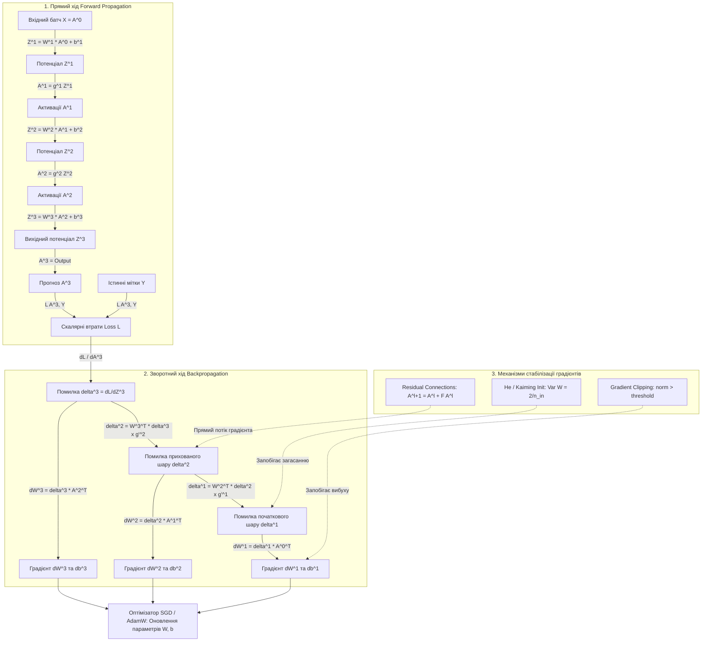

# Тема 8. Глибокі нейронні мережі (DNN) та математика Навчання. Математична модель штучного нейрона, градієнтний спуск та алгоритм зворотного поширення помилки, вибух та загасання градієнтів

## 1. Основний зміст та теоретичний базис

Глибокі нейронні мережі (**Deep Neural Networks, DNN**) є базовим класичним класом моделей глибокого навчання, що забезпечують побудову багаторівневих ієрархічних абстракцій над вхідними даними. На відміну від одношарових або перцептронних моделей, додавання прихованих шарів дозволяє мережі автоматично формувати складні нелінійні розділювальні поверхні та виділяти високоривневі ознаки (**Feature Extraction**) без необхідності ручного проєктування ознак інженером.

Математичним фундаментом DNN є елементарна обчислювальна одиниця — **штучний нейрон (Artificial Neuron)**, формалізований Ворреном Мак-Каллоком та Уолтером Піттсом. Нейрон здійснює дві послідовні математичні операції:
1. **Лінійне зважене підсумовування** — обчислення скалярного добутку вектора вхідних сигналів на вектор синаптичних ваг з додаванням скалярного зсуву (**Bias**).
2. **Нелінійне перетворення** — пропускання отриманої лінійної комбінації через нелінійну **функцію активації (Activation Function)**.

Нелінійність функції активації має критичне значення для всієї архітектури DNN. Якби функції активації були лінійними ($g(z) = c \cdot z$), то будь-яка багатошарова нейронна мережа незалежно від кількості прихованих шарів та нейронів була б математично еквівалентною звичайному одношаровому лінійному перетворенню, оскільки композиція лінійних функцій є лінійною функцією.

Фундаментальне теоретичне обґрунтування виразної здатності нейронних мереж надає **Теорема універсальної апроксимації (Universal Approximation Theorem)**, доведена Гарольдом Горніком, Джорджем Цибенком та Куртом Лешно. Теорема стверджує, що прямоспрямована нейронна мережа з хоча б одним прихованим шаром, скінченною кількістю нейронів та нелінійною безперервною функцією активації здана апроксимувати будь-яку безперервну функцію багатьох змінних на компактних підмножинах евклідового простору з довільною наперед заданою точністю $\epsilon > 0$. Проте теорема не вказує на алгоритм побудови такої мережі, а на практиці одношарова мережа для складної задачі вимагала б експоненційно великої кількості нейронів. Саме глибокі архітектури (з багатьма послідовними шарами) дозволяють представляти складні функції з експоненційно меншою кількістю параметрів за рахунок повторного використання обчислених ознак нижчих рівнів.

Процес навчання DNN складається з трьох послідовних фаз:
* **Прямий хід (Forward Pass)** — послідовне обчислення активацій від вхідного шару через усі приховані шари до вихідного шару та розрахунок підсумкового значення функції втрат $\mathcal{L}$.
* **Зворотний хід (Backward Pass / Backpropagation)** — аналітичне обчислення часткових похідних функції втрат по всіх вагах та зсувах мережі за допомогою ланцюгового правила диференціювання складного векторного аргументу (**Chain Rule**).
* **Оновлення параметрів (Optimization Step)** — коригування ваг у напрямку, протилежному до обчислених градієнтів, із використанням алгоритмів градієнтного спуску.

Під час тренування глибоких мереж (із десятками та сотнями шарів) виникають дві фундаментальні патології градієнтного спуску: **загасання градієнтів (Vanishing Gradients)** та **вибух градієнтів (Exploding Gradients)**. 

Загасання градієнтів полягає у тому, що при проходженні помилки від вихідного шару до початкових шарів через ланцюгове множення Якобіанів та похідних насичених функцій активації (Sigmoid, Tanh) значення градієнтів експоненційно зменшуються до нуля. У результаті ваги початкових шарів мережі практично не оновлюються, і мережа припиняє навчатися. 

Вибух градієнтів, навпаки, полягає в експоненційному зростанні амплітуди градієнтів через великі значення вагових коефіцієнтів, що призводить до чисельної нестабільності, переповнення розрядної сітки (**NaN-overflow**) та хаотичного стрибання ваг у просторі параметрів.

Для подолання цих патологій у сучасній комп'ютерній інженерії застосовують комплекс рішень:
* використання ненасичених функцій активації (ReLU, Leaky ReLU, GELU);
* спеціалізовані методи ініціалізації ваг (Xavier/Glorot та He/Kaiming);
* нормалізаційні шари (Batch Normalization, Layer Normalization);
* залишкові зв'язки (**Residual / Skip Connections**), що пропускають градієнти напряму через шари;
* кліпінг градієнтів (**Gradient Clipping**).

---

## 2. Математичний апарат, моделі та аналітичні залежності

### 1. Векторно-матрична модель прямого ходу
Розглянемо прямоспрямовану нейронну мережу, яка складається з $L$ шарів. Шари нумеруються як $l \in \{0, 1, \dots, L\}$, де $l = 0$ — вхідний шар ($a^{[0]} = x$), $l = L$ — вихідний шар, а $l \in \{1, \dots, L-1\}$ — приховані шари.

Нехай $n^{[l]}$ — кількість нейронів у шарі $l$. Для mini-batch обсягом $m$ обчислення прямого ходу на шарі $l$ у матричній формі описуються рівняннями:

$$Z^{[l]} = W^{[l]} \cdot A^{[l-1]} + b^{[l]}$$

$$A^{[l]} = g^{[l]}\left(Z^{[l]}\right)$$

де $W^{[l]} \in \mathbb{R}^{n^{[l]} \times n^{[l-1]}}$ — матриця вагових коефіцієнтів шару $l$, $A^{[l-1]} \in \mathbb{R}^{n^{[l-1]} \times m}$ — матриця активацій попереднього шару $l-1$, $b^{[l]} \in \mathbb{R}^{n^{[l]} \times 1}$ — вектор зсувів шару $l$ (широкомовне додавання по батчу), $Z^{[l]} \in \mathbb{R}^{n^{[l]} \times m}$ — матриця зважених сумарних входів (вхідних потенціалів) шару $l$, $g^{[l]}(\cdot)$ — поелементна нелінійна функція активації шару $l$, $A^{[l]} \in \mathbb{R}^{n^{[l]} \times m}$ — підсумкова матриця активацій шару $l$.

### 2. Виведення алгоритму зворотного поширення помилки
Нехай $\mathcal{L}\left(A^{[L]}, Y\right)$ — скалярна функція втрат, обчислена на виході мережі для батчу даних $Y \in \mathbb{R}^{n^{[L]} \times m}$.

Введемо вектор помилки (градієнт вхідного потенціалу) шару $l$ як часткову похідну функції втрат за потенціалом $Z^{[l]}$:

$$\delta^{[l]} = \frac{\partial \mathcal{L}}{\partial Z^{[l]}}$$

Застосовуючи базоване на матричному численні ланцюгове правило диференціювання (**Chain Rule**), виведемо рекурентні формули обчислення градієнтів від вихідного шару $L$ до першого прихованого шару $1$.

**Крок 1. База рекурсії — вихідний шар $L$:**

$$\delta^{[L]} = \frac{\partial \mathcal{L}}{\partial Z^{[L]}} = \frac{\partial \mathcal{L}}{\partial A^{[L]}} \odot g'^{[L]}\left(Z^{[L]}\right)$$

де $\odot$ — оператор добутку Адамара (поелементне множення матриць однакової розмірності), $g'^{[L]}(\cdot)$ — перша похідна функції активації вихідного шару.

*Приклад для Cross-Entropy та Softmax:* Якщо вихідний шар використовує Softmax з категоріальною крос-ентропією, то комбінований градієнт спрощується до точного виразу:

$$\delta^{[L]} = A^{[L]} - Y$$

**Крок 2. Рекурентне поширення помилки для прихованого шару $l \in \{L-1, L-2, \dots, 1\}$.**

Для обчислення $\delta^{[l]}$ виходимо з за залежності $Z^{[l+1]} = W^{[l+1]} A^{[l]} + b^{[l+1]}$ та $A^{[l]} = g^{[l]}(Z^{[l]})$:

$$\delta^{[l]} = \frac{\partial \mathcal{L}}{\partial Z^{[l]}} = \left( \frac{\partial Z^{[l+1]}}{\partial A^{[l]}} \cdot \frac{\partial \mathcal{L}}{\partial Z^{[l+1]}} \right) \odot \frac{\partial A^{[l]}}{\partial Z^{[l]}} = \left( \left(W^{[l+1]}\right)^T \cdot \delta^{[l+1]} \right) \odot g'^{[l]}\left(Z^{[l]}\right)$$

де $\left(W^{[l+1]}\right)^T \in \mathbb{R}^{n^{[l]} \times n^{[l+1]}}$ — транспонована матриця ваг наступного шару.

**Крок 3. Розрахунок градієнтів за параметрами $W^{[l]}$ та $b^{[l]}$.**

Використовуючи обчислений вектор помилки $\delta^{[l]}$, знайдемо градієнти цільової функції по вагах та зсувах для всього батчу з $m$ об'єктів:

$$\frac{\partial \mathcal{L}}{\partial W^{[l]}} = \frac{1}{m} \cdot \delta^{[l]} \cdot \left(A^{[l-1]}\right)^T$$

$$\frac{\partial \mathcal{L}}{\partial b^{[l]}} = \frac{1}{m} \sum_{i=1}^m \delta^{[l]}_{:, i} = \frac{1}{m} \cdot \text{sum\_rows}\left(\delta^{[l]}\right)$$

де $\frac{\partial \mathcal{L}}{\partial W^{[l]}} \in \mathbb{R}^{n^{[l]} \times n^{[l-1]}}$ — градієнт матриці ваг, $\frac{\partial \mathcal{L}}{\partial b^{[l]}} \in \mathbb{R}^{n^{[l]} \times 1}$ — градієнт вектора зсувів.

### 3. Аналітична причина загасання та вибуху градієнтів
Розкриємо рекурентний вираз для помилки $1$-го прихованого шару $\delta^{[1]}$ через помилку вихідного шару $\delta^{[L]}$:

$$\delta^{[1]} = \left[ \prod_{k=1}^{L-1} \left(W^{[k+1]}\right)^T \cdot \text{diag}\left(g'^{[k]}\left(Z^{[k]}\right)\right) \right] \cdot \delta^{[L]}$$

де $\text{diag}\left(g'^{[k]}\left(Z^{[k]}\right)\right)$ — діагональна матриця Похідних функцій активації.

Амплітуда градієнта $\delta^{[1]}$ визначається добутком $L-1$ матриць Якобі. 
* **Аналіз загасання (Vanishing).** Якщо як функцію активації обрано Sigmoid, її похідна $g'(z) = \sigma(z)(1 - \sigma(z))$ має максимальне значення $\max g'(z) = 0.25$ при $z = 0$. У разі глибини $L = 10$ шарів множник похідних дає $(0.25)^{10} \approx 9.5 \times 10^{-7}$, що практично анулює вектор градієнта для перших шарів.
* **Аналіз вибуху (Exploding).** Якщо власні значення матриць ваг $\|\lambda(W^{[k]})\|_2 > 1$, то добуток $L$ таких матриць зростає як $(\lambda_{\max})^L \to \infty$, викликаючи чисельний вибух градієнтів.

### 4. Математичні методи ініціалізації ваг
Для збереження дисперсії сигналів прямого ходу $\text{Var}\left(a^{[l]}\right)$ та градієнтів зворотного ходу $\text{Var}\left(\delta^{[l]}\right)$ однакове значення на всіх шарах застосовують теоретично обґрунтовану ініціалізацію:

* **Ініціалізація Ксав'єра / Глорота (Xavier / Glorot Initialization).**
  Розроблена для симетричних функцій активації поблизу нуля (Tanh, Sigmoid). Початкові ваги вибираються з нормального розподілу з нульовим середнім та дисперсією:

  $$\text{Var}\left(W^{[l]}\right) = \frac{2}{n^{[l-1]} + n^{[l]}} \implies W^{[l]} \sim \mathcal{N}\left(0, \sqrt{\frac{2}{n^{[l-1]} + n^{[l]}}}\right)$$

* **Ініціалізація Хе / Каймінга (He / Kaiming Initialization).**
  Розроблена спеціально для функцій активації типу ReLU, які обнуляють від'ємну півплощину (зменшуючи ефективну дисперсію вдвічі):

  $$\text{Var}\left(W^{[l]}\right) = \frac{2}{n^{[l-1]}} \implies W^{[l]} \sim \mathcal{N}\left(0, \sqrt{\frac{2}{n^{[l-1]}}}\right)$$

---

## 3. Систематизація даних та порівняльний аналіз

Нижче наведено порівняльний аналіз математичних властивостей сучасних функцій активації, що застосовуються у глибоких нейронних мережах, та їхньої чутливості до патологій градієнтів.

| Функція активації | Математична формула $g(z)$ | Область значень | Перша похідна $g'(z)$ | Максимум похідної $\max g'(z)$ | Схильність до загасання градієнта | Основна сфера застосування |
| :--- | :--- | :--- | :--- | :--- | :--- | :--- |
| **Sigmoid** | $\frac{1}{1 + e^{-z}}$ | $(0, 1)$ | $g(z)(1 - g(z))$ | $0.25$ (при $z=0$) | **Вкрай висока** (насичується при $\|z\| > 4$) | Вихідний шар бінарної класифікації |
| **Tanh** | $\frac{e^z - e^{-z}}{e^z + e^{-z}}$ | $(-1, 1)$ | $1 - g(z)^2$ | $1.0$ (при $z=0$) | **Висока** (насичується при $\|z\| > 3$) | Класичні рекурентні мережі (RNN/LSTM) |
| **ReLU** | $\max(0, z)$ | $[0, +\infty)$ | $\begin{cases} 1, & z > 0 \\ 0, & z < 0 \end{cases}$ | $1.0$ (при $z > 0$) | **Низька** (відсутня при $z > 0$) | Приховані шари згорткових та плотних DNN |
| **Leaky ReLU** | $\max(\alpha z, z), \, \alpha \approx 0.01$ | $(-\infty, +\infty)$ | $\begin{cases} 1, & z > 0 \\ \alpha, & z \le 0 \end{cases}$ | $1.0$ (при $z > 0$) | **Вкрай низька** (усуває проблему «Dying ReLU») | Глибокі мережі, GAN-архітектури |
| **GELU** | $z \cdot \Phi(z) \approx 0.5z\left(1 + \tanh\left(\sqrt{\frac{2}{\pi}}(z + 0.044715z^3)\right)\right)$ | $\approx [-0.17, +\infty)$ | Гладка нелінійна форма | $\approx 1.08$ | **Вкрай низька** | Сучасні Transformers (GPT, BERT, ViT) |

Порівняльний аналіз демонструє еволюцію функцій активації від насичених гладких S-подібних кривих (Sigmoid, Tanh) до кусково-лінійних та ймовірнісно-гладких нелінійностей. Головним недоліком Sigmoid є те, що її похідна обмежена значенням $0.25$. У глибоких мережах це призводить до експоненційного загасання градієнтного сигналу. 

Застосування **ReLU** розв'язало проблему загасання для додатних входів ($g'(z) = 1.0$), проте створило проблему «відмирання нейронів» (**Dying ReLU**), коли при $z \le 0$ градієнт обнуляється і нейрон назавжди припиняє оновлювати ваги. Сучасні функції **Leaky ReLU** та **GELU** усувають цей недолік, пропускаючи малі від'ємні градієнти, що забезпечує стабільну збіжність алгоритму Backpropagation у мережах із сотнями шарів.

---

## 4. Візуалізація процесів та структурних зв'язків

Нижче наведено граф обчислень, що демонструє потоки даних прямого ходу (Forward Pass) та зворотної хвилі поширення градієнтів (Backpropagation) у 3-шаровій глибокій нейронній мережі.

*Рисунок 1 — Структурно-логічна схема обчислювального графа прямого (Forward) та зворотного (Backpropagation) ходів глибокої нейронної мережі з механізмами стабілізації градієнтів*

Діаграма ілюструє симетричну двопрохідну природу навчання глибокої нейронної мережі. Під час прямого ходу (`Forward_Pass`) вхідний вектор $A^{[0]} = X$ трансформується у матрицях потенціалів $Z^{[l]}$ та активацій $A^{[l]}$ до формування прогнозу $A^{[3]}$, за яким у вузлі `I` розраховується підсумкова функція втрат $\mathcal{L}$.

Зворотний хід (`Backward_Pass`) розгортається у зворотному напрямку. На основі диференціювання втрат обчислюється помилка вихідного шару $\delta^{[3]}$ (`J`), яка дає змогу одразу розрахувати градієнти ваг $\frac{\partial \mathcal{L}}{\partial W^{[3]}}$ (`K`). Далі помилка транслюється на прихований шар $l=2$ через скалярний добуток із транспонованою матрицею ваг $(W^{[3]})^T$ та поелементне множення на похідну $g'^{[2]}$ (`L`). Аналогічним чином помилка поширюється на початковий шар $l=1$ (`N`).

Для захисту від згасання чи вибуху градієнтів у процес інтегровано механізми стабілізації (`Initialization_Guard`): ініціалізація Хе (`P`) запевняє нормальну дисперсію градієнтів на шарі $1$, залишкові зв'язки (`Q`) пропускають градієнт вхідного сигналу без згасання через шар $2$, а кліпінг градієнтів (`R`) обрізає вибухові значення перед підсумковим оновленням параметрів в оптимізаторі (`S`).

---

## 5. Питання для самоперевірки та аналітичного осмислення

1.   Виведіть повні матричні формули для зворотного поширення помилки (Backpropagation) у шарі $l$ глибокої нейронної мережі для обчислення градієнтів $\frac{\partial \mathcal{L}}{\partial W^{[l]}}$, $\frac{\partial \mathcal{L}}{\partial b^{[l]}}$ та $\delta^{[l]}$. Поясніть роль оператора Адамара ($\odot$) у цих виразах.
2.   Математично поясніть, чому функція активації Sigmoid викликає ефект загасання градієнтів у мережах із великою кількістю прихованих шарів. Яке максимальне значення може приймати похідна Sigmoid, і як це впливає на добуток Якобіанів у глибині мережі?
3.   У чому полягає відмінність між методами ініціалізації ваг Ксав'єра (Glorot) та Хе (Kaiming)? Проведіть математичний розрахунок збереження дисперсії сигналів для обґрунтування введення коефіцієнта $2$ у формулу дисперсії ваг для функції активації ReLU.
4.   Детально опишіть проблему «відмирання нейронів» (**Dying ReLU Problem**). За яких умов під час градієнтного спуску нейрон із функцією активації ReLU може назавжди припинити навчатися, і як використання Leaky ReLU або GELU усуває цю патологію?
5.   Яким чином архітектурне впровадження залишкових зв'язків (**Residual Connections / Skip Connections**) у мережах ResNet математично вирішує проблему загасання градієнтів при збільшенні глибини мережі до сотень шарів? Покажіть вираз для градієнта $\frac{\partial A^{[l+1]}}{\partial A^{[l]}}$ у блоці $A^{[l+1]} = A^{[l]} + \mathcal{F}(A^{[l]}; W^{[l]})$.