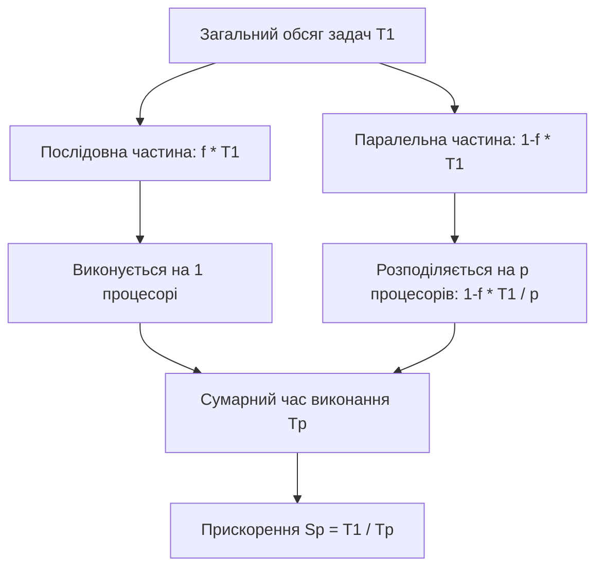
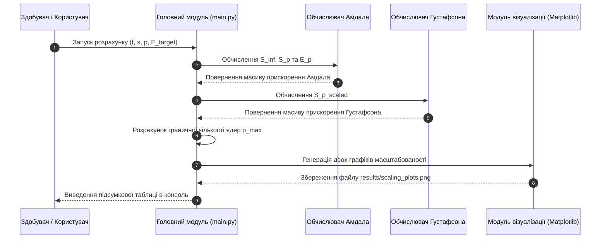

# Практичне заняття № 1. Оцінювання масштабованості паралельних систем за законами Амдала та Густафсона-Барсіса

## Мета роботи та стек технологій

**Мета.** Засвоєння теоретичних основ аналізу ефективності та масштабованості високопродуктивних обчислювальних систем; набуття практичних навичок аналітичного розрахунку граничного прискорення, ефективності використання обчислювальних ресурсів, частки послідовних обчислень та функції ізоефективності за допомогою законів Амдала та Густафсона-Барсіса; розробка програмного інструментарію на мові Python для автоматизованого моделювання та візуалізації залежностей прискорення від кількості процесорних ядер.

**Стек технологій та інструменти:**
* **Мова програмування / Середовище:** Python 3.11+ / Jupyter Notebook або VS Code.
* **Платформа / Бібліотеки:** `NumPy` (версії 1.24+ — для векторизованих матрично-векторних обчислень), `Matplotlib` (версії 3.7+ — для побудови графіків масштабованості).
* **Інструменти розробки:** Консоль/Термінал (Bash або PowerShell), менеджер пакетів `pip`.

---

## 1. Теоретичні відомості

Оцінювання ефективності паралельних обчислювальних систем є фундаментальним етапом проєктування високопродуктивних архітектур та програмного забезпечення для задач штучного інтелекту. Головною метою паралелізації є зменшення часу виконання алгоритму шляхом розподілу обчислювального навантаження між $p$ процесорними вузлами (ядрами).

Класичним критерієм оцінювання ефективності є показник прискорення (з англ. *Speedup*), який позначається як $S_p(n)$ і визначається як відношення часу виконання послідовного алгоритму $T_1(n)$ на одному процесорі до часу виконання паралельного алгоритму $T_p(n)$ на $p$ процесорах за умови фіксованого розміру задачі $n$:

$$S_p(n) = \frac{T_1(n)}{T_p(n)}$$

Ефективність використання процесорних ресурсів $E_p(n)$ (з англ. *Efficiency*) визначає середню частку корисної роботи, яку виконує кожен процесор протягом усього часу обчислень:

$$E_p(n) = \frac{S_p(n)}{p} = \frac{T_1(n)}{p \cdot T_p(n)}$$

Закон Амдала формулює граничні можливості прискорення за умови, що розмір задачі $n$ залишається постійним (модель фіксованого обсягу обчислень, з англ. *Strong Scaling*). Якщо алгоритм містить частку послідовних обчислень $f$ ($0 \le f \le 1$), які принципово не піддаються розпаралелюванню, а решта $(1-f)$ розподіляється рівномірно між $p$ процесорами, то час виконання паралельної програми становить:

$$T_p = f \cdot T_1 + \frac{(1-f) \cdot T_1}{p}$$

Підставляючи цей вираз у формулу прискорення, отримуємо закон Амдала:

$$S_p = \frac{T_1}{f \cdot T_1 + \frac{(1-f) \cdot T_1}{p}} = \frac{1}{f + \frac{1-f}{p}}$$

При безмежному збільшенні кількості процесорних ядер ($p \to \infty$) прискорення прямує до свого теоретичного максимуму, який визначається виключно послідовною часткою програми:

$$S_\infty = \lim_{p \to \infty} S_p = \frac{1}{f}$$

З аналізу закону Амдала випливає, що навіть за наявності лише 5% послідовного коду ($f = 0.05$) максимально досяжне прискорення системи принципово обмежене величиною $S_\infty = 20$, незалежно від того, скільки тисяч обчислювальних ядер буде залучено.


*Рисунок 1 — Схема декомпозиції обчислювального процесу за законом Амдала*

Для подолання песимістичного обмеження закону Амдала Джон Густафсон та Едвін Барсіс запропонували альтернативну модель оцінювання (модель масштабованого обсягу задач, з англ. *Weak Scaling*). У цій моделі припускається, що зі збільшенням кількості процесорів $p$ пропорційно зростає розмір обчислювальної задачі $n$, тоді як загальний час виконання програми $T_p$ залишається постійним.

Якщо $s$ становить частку часу, витраченого на послідовні розрахунки в паралельному виконанні, а $(1-s)$ — частку часу паралельних обчислень, то абсолютний час виконання на одному процесорі аналогічного за масштабом обсягу задач дорівнював би $T_1 = s \cdot T_p + (1-s) \cdot p \cdot T_p$. Звідси випливає закон Густафсона-Барсіса для масштабованого прискорення (з англ. *Scaled Speedup*):

$$S_p^{scaled} = \frac{s \cdot T_p + (1-s) \cdot p \cdot T_p}{T_p} = s + (1-s)p = p + (1-p)s$$

Закон Густафсона-Барсіса демонструє, що при лінійному збільшенні обсягу обчислювальних даних разом із зростанням кількості процесорів прискорення зростає майже лінійно, що робить високопродуктивні кластери надзвичайно ефективними для масштабних задач штучного інтелекту та машинного навчання.

Аналіз масштабованості розглядає сумарні накладні витрати $T_0(n, p) = p \cdot T_p(n) - T_1(n)$, пов'язані з міжпроцесорними комунікаціями, затримками синхронізації та передачею даних. Паралельна система називається масштабованою, якщо при зростанні $p$ існує така функція зростання обсягу обчислень $T_1 = E(p)$ (функція ізоефективності, з англ. *Isoefficiency Function*), яка дозволяє підтримувати коефіцієнт ефективності $E_p$ на постійному заданому рівні.

---

## 2. Підготовка середовища та розгортання проєкту (Крок 0)

Для виконання практичних розрахунків необхідно налаштувати ізольоване середовище виконання Python та встановити базові наукові бібліотеки.

### 2.1. Команди для терміналу (CLI)

Перевірка встановленої версії Python:
```bash
python3 --version
```

Створення віртуального середовища розробки:
```bash
python3 -m venv venv_scaling
```

Активація віртуального середовища:
* Для ОС Linux / macOS:
```bash
source venv_scaling/bin/activate
```
* Для ОС Windows (PowerShell):
```powershell
.\venv_scaling\Scripts\Activate.ps1
```

Встановлення необхідних залежностей:
```bash
pip install --upgrade pip
pip install numpy matplotlib
```

### 2.2. Структура каталогів проєкту

Створіть наступну деревоподібну структуру файлів у робочій директорії:

```
amdahl_scaling_project/
├── main.py
├── requirements.txt
└── results/
    └── scaling_plots.png
```

Вміст файлу `requirements.txt`:
```text
numpy>=1.24.0
matplotlib>=3.7.0
```

---

## 3. Порядок виконання роботи

### 3.1. Індивідуальні завдання

Кожен здобувач виконує розрахунки відповідно до свого варіанта з наведеної нижче Markdown-таблиці. Необхідно обчислити граничне прискорення за Амдалом $S_\infty$, теоретичне прискорення за Амдалом $S_p$, масштабоване прискорення за Густафсоном-Барсісом $S_p^{scaled}$, ефективність $E_p$, а також визначити необхідний обсяг задач для збереження ефективності $E_{target}$.

| Варіант | Назва алгоритму / Задачі | Частка послідовних обчислень $f$ | Частка послідовного часу $s$ | Кількість ядер $p$ | Цілова ефективність $E_{target}$ |
| :---: | :--- | :---: | :---: | :---: | :---: |
| **1** | Навчання MLP (Backpropagation) | $0.02$ | $0.015$ | $64$ | $0.80$ |
| **2** | Згортка тензорів (CNN Layer) | $0.05$ | $0.040$ | $128$ | $0.75$ |
| **3** | Обчислення Self-Attention (Transformer) | $0.01$ | $0.008$ | $256$ | $0.85$ |
| **4** | Градієнтний бустинг (XGBoost tree) | $0.08$ | $0.060$ | $32$ | $0.70$ |
| **5** | Кластеризація $K$-Means | $0.04$ | $0.030$ | $64$ | $0.80$ |
| **6** | Множення матриць (GEMM CUDA) | $0.005$ | $0.004$ | $512$ | $0.90$ |
| **7** | Симуляція середовища MuJoCo (RL) | $0.10$ | $0.080$ | $16$ | $0.65$ |
| **8** | Обробка графічних сигналів (OpenCV) | $0.03$ | $0.025$ | $128$ | $0.75$ |
| **9** | Фільтрація кастомного Dataset | $0.06$ | $0.050$ | $64$ | $0.80$ |
| **10** | Оновлення вагових коефіцієнтів SGD | $0.015$ | $0.010$ | $256$ | $0.85$ |
| **11** | Розподілений AllReduce (mpi4py) | $0.025$ | $0.020$ | $128$ | $0.75$ |
| **12** | Побудова дерев у Random Forest | $0.035$ | $0.030$ | $32$ | $0.80$ |
| **13** | Генерація векторних ембеддінгів | $0.012$ | $0.009$ | $512$ | $0.85$ |
| **14** | Інференс глибокої мережі ResNet | $0.045$ | $0.035$ | $64$ | $0.75$ |
| **15** | Пошук найкоротших шляхів у графах | $0.12$ | $0.090$ | $16$ | $0.60$ |
| **16** | Векторизоване ресемплювання аудіо | $0.02$ | $0.018$ | $256$ | $0.80$ |
| **17** | Декомпозиція матриць SVD | $0.07$ | $0.055$ | $32$ | $0.70$ |
| **18** | Оптимізація Адама (AdamW Optimizer) | $0.018$ | $0.012$ | $128$ | $0.85$ |
| **19** | Парсинг та структ. векторизація | $0.15$ | $0.110$ | $16$ | $0.60$ |
| **20** | Квантування вагових моделей (FP16/INT8) | $0.008$ | $0.006$ | $1024$ | $0.90$ |

### 3.2. Покроковий алгоритм та розв'язок еталонного прикладу

Розглянемо еталонний приклад аналізу масштабованості для **Варіанта №1**:
* Модель: Навчання багатошарового перцептрона (MLP Backpropagation).
* Послідовна частка обчислень за Амдалом: $f = 0.02$ (тобто 2% коду є послідовним).
* Частка послідовного часу за Густафсоном-Барсісом: $s = 0.015$ (1.5%).
* Кількість процесорних ядер: $p = 64$.
* Цільовий рівень ефективності: $E_{target} = 0.80$.

**Математичний розрахунок еталонного прикладу:**
1. Граничне прискорення за Амдалом ($p \to \infty$):
   $$S_\infty = \frac{1}{f} = \frac{1}{0.02} = 50.0$$
2. Теоретичне прискорення за Амдалом на $p = 64$ ядрах:
   $$S_{64} = \frac{1}{f + \frac{1-f}{p}} = \frac{1}{0.02 + \frac{1 - 0.02}{64}} = \frac{1}{0.02 + \frac{0.98}{64}} = \frac{1}{0.02 + 0.0153125} = \frac{1}{0.0353125} \approx 28.3186$$
3. Ефективність використання $p = 64$ ядер за законами Амдала:
   $$E_{64} = \frac{S_{64}}{64} = \frac{28.3186}{64} \approx 0.4425 \quad (44.25\%)$$
4. Масштабоване прискорення за Густафсоном-Барсісом на $p = 64$ ядрах:
   $$S_{64}^{scaled} = s + (1 - s) \cdot p = 0.015 + (1 - 0.015) \cdot 64 = 0.015 + 0.985 \cdot 64 = 0.015 + 63.04 = 63.055$$
5. Максимально припустима кількість ядер $p_{max}$ для збереження ефективності не нижче $E_{target} = 0.80$ за Амдалом:
   $$E_p = \frac{1}{p \cdot f + 1 - f} \ge E_{target} \implies p \cdot f + 1 - f \le \frac{1}{E_{target}}$$
   $$p \le \frac{\frac{1}{E_{target}} - (1 - f)}{f} = \frac{\frac{1}{0.80} - 0.98}{0.02} = \frac{1.25 - 0.98}{0.02} = \frac{0.27}{0.02} = 13.5$$
   Отже, для збереження ефективності понад 80% кількість ядер не повинна перевищувати $p = 13$ ядер.

Нижче наведено повний, готовий до запуску Python-скрипт `main.py`, який виконує всі вищевказані розрахунки, моделює динаміку прискорення від $p=1$ до $p=256$ і зберігає результуючий графік.

```python
import os
import numpy as np
import matplotlib.pyplot as plt

def amdahl_speedup(f: float, p: np.ndarray) -> np.ndarray:
    """
    Обчислення прискорення за законом Амдала.
    f: частка послідовних обчислень (0 <= f <= 1)
    p: масив кількості процесорних ядер
    """
    return 1.0 / (f + (1.0 - f) / p)

def gustafson_speedup(s: float, p: np.ndarray) -> np.ndarray:
    """
    Обчислення масштабованого прискорення за законом Густафсона-Барсіса.
    s: частка послідовного часу в паралельному виконанні (0 <= s <= 1)
    p: масив кількості процесорних ядер
    """
    return s + (1.0 - s) * p

def calculate_max_processors(f: float, target_efficiency: float) -> int:
    """
    Розрахунок максимальної кількості процесорів для збереження заданої ефективності.
    """
    if f <= 0:
        return 999999
    max_p = ((1.0 / target_efficiency) - (1.0 - f)) / f
    return int(np.floor(max_p))

def main():
    # Параметри еталонного варіанта №1
    variant_id = 1
    task_name = "Навчання MLP (Backpropagation)"
    f = 0.02          # 2% послідовного коду
    s = 0.015         # 1.5% послідовного часу
    p_target = 64     # Цільова кількість ядер
    e_target = 0.80   # Цільова ефективність

    # 1. Математичні розрахунки для фіксованого p_target
    s_inf = 1.0 / f
    s_amdahl_target = amdahl_speedup(f, np.array([p_target]))[0]
    e_amdahl_target = s_amdahl_target / p_target
    s_gustafson_target = gustafson_speedup(s, np.array([p_target]))[0]
    p_max_eff = calculate_max_processors(f, e_target)

    # Друк аналітичних результатів у консоль
    print("=" * 70)
    print(f"РОЗРАХУНОК МАСШТАБОВАНОСТІ ДЛЯ ВАРІАНТА №{variant_id}")
    print(f"Задача: {task_name}")
    print("=" * 70)
    print(f"Вхідні параметри:")
    print(f"  - Частка послідовних обчислень (f): {f:.4f}")
    print(f"  - Частка послідовного часу (s):      {s:.4f}")
    print(f"  - Цільова кількість ядер (p):       {p_target}")
    print(f"  - Бажана ефективність (E_target):   {e_target * 100:.1f}%")
    print("-" * 70)
    print(f"Результати обчислень:")
    print(f"  1. Граничне прискорення (Amdahl S_infinity): {s_inf:.4f}")
    print(f"  2. Прискорення за Амдалом (S_64):            {s_amdahl_target:.4f}")
    print(f"  3. Ефективність за Амдалом (E_64):           {e_amdahl_target * 100:.2f}%")
    print(f"  4. Прискорення за Густафсоном (S_64_scaled):  {s_gustafson_target:.4f}")
    print(f"  5. Макс. ядер для E >= {e_target * 100:.0f}%:              {p_max_eff} ядер")
    print("=" * 70)

    # 2. Моделювання залежностей від кількості ядер p від 1 до 256
    processors_range = np.arange(1, 257)
    sp_amdahl = amdahl_speedup(f, processors_range)
    sp_gustafson = gustafson_speedup(s, processors_range)
    efficiency_amdahl = sp_amdahl / processors_range

    # 3. Графічна візуалізація за допомогою Matplotlib
    os.makedirs("results", exist_ok=True)
    fig, (ax1, ax2) = plt.subplots(1, 2, figsize=(14, 5))

    # Графік 1: Прискорення Амдала vs Густафсона
    ax1.plot(processors_range, sp_amdahl, label=f'Амдал (f={f})', color='crimson', linewidth=2)
    ax1.plot(processors_range, sp_gustafson, label=f'Густафсон-Барсіс (s={s})', color='navy', linestyle='--', linewidth=2)
    ax1.axhline(y=s_inf, color='darkgreen', linestyle=':', label=f'Границя Амдала (S={s_inf:.0f})')
    ax1.plot(processors_range, processors_range, color='gray', linestyle='-.', alpha=0.5, label='Ідеальне лінійне')
    ax1.set_title('Залежність прискорення (Speedup) від кількості ядер $p$')
    ax1.set_xlabel('Кількість процесорних ядер ($p$)')
    ax1.set_ylabel('Прискорення ($S_p$)')
    ax1.grid(True, linestyle='--', alpha=0.6)
    ax1.legend()

    # Графік 2: Ефективність використання ресурсів
    ax2.plot(processors_range, efficiency_amdahl, label='Ефективність $E_p$', color='darkorange', linewidth=2)
    ax2.axhline(y=e_target, color='purple', linestyle=':', label=f'Цільова ефективність ({e_target*100:.0f}%)')
    ax2.axvline(x=p_max_eff, color='red', linestyle='--', label=f'Макс. $p={p_max_eff}$')
    ax2.set_title('Ефективність використання ядер ($E_p = S_p / p$)')
    ax2.set_xlabel('Кількість процесорних ядер ($p$)')
    ax2.set_ylabel('Ефективність ($E_p$)')
    ax2.grid(True, linestyle='--', alpha=0.6)
    ax2.legend()

    plt.tight_layout()
    plot_path = os.path.join("results", "scaling_plots.png")
    plt.savefig(plot_path, dpi=300)
    print(f"\n[INFO] Графіки успішно збережено у файл: {plot_path}")

if __name__ == "__main__":
    main()
```

### 3.3. Графічна візуалізація обчислювального процесу

Нижче наведено діаграму послідовності обчислень та тестування аналітичних моделей у вигляді Mermaid-схеми.


*Рисунок 2 — Діаграма послідовності процесів розрахунку та візуалізації показників масштабованості*

### 3.4. Запуск, тестування та перевірка результатів

Для запуску розробленої програми виконайте команду у терміналі:
```bash
python main.py
```

**Еталонне виведення програми в консоль для перевірки:**

```text
======================================================================
РОЗРАХУНОК МАСШТАБОВАНОСТІ ДЛЯ ВАРІАНТА №1
Задача: Навчання MLP (Backpropagation)
======================================================================
Вхідні параметри:
  - Частка послідовних обчислень (f): 0.0200
  - Частка послідовного часу (s):      0.0150
  - Цільова кількість ядер (p):       64
  - Бажана ефективність (E_target):   80.0%
----------------------------------------------------------------------
Результати обчислень:
  1. Граничне прискорення (Amdahl S_infinity): 50.0000
  2. Прискорення за Амдалом (S_64):            28.3186
  3. Ефективність за Амдалом (E_64):           44.25%
  4. Прискорення за Густафсоном (S_64_scaled):  63.0550
  5. Макс. ядер для E >= 80%:              13 ядер
======================================================================

[INFO] Графіки успішно збережено у файл: results/scaling_plots.png
```

---

## 4. Вимоги до змісту звіту

Звіт про виконання практичного заняття оформлюється у форматі PDF або Markdown та повинен містити наступні обов'язкові розділи:

1. **Титульна сторінка.** Назва вищого навчального закладу, кафедри, дисципліни, номер практичного заняття, тема, ПІБ здобувача, група та номер індивідуального варіанта.
2. **Мета роботи та постановка задачі.** Формулювання мети практичного заняття та індивідуальне завдання з параметрами згідно з обраним варіантом із Таблиці 3.1.
3. **Теоретична та математична частина.** Розрахункові формули законів Амдала та Густафсона-Барсіса, пояснення фізичного змісту змінних, розрахунок $S_\infty$, $S_p$, $E_p$, $S_p^{scaled}$ та $p_{max}$ у форматі LaTeX.
4. **Програмна реалізація.** Повний вихідний код програми на мові Python з детально прокоментованими блоками.
5. **Результати тестування та візуалізації.** Скріншот виведення консолі з результатами обчислень та збережений графік масштабованості з каталогу `results/`.
6. **Аналітичний висновок.** Порівняльний аналіз моделей Амдала та Густафсона-Барсіса; обґрунтування того, чому закон Амдала обмежує прискорення при фіксованому розмірі проблеми, тоді як закон Густафсона-Барсіса демонструє ефективність обчислень при її масштабуванні.

---

## 5. Контрольні запитання для захисту роботи

1. У чому полягає принципова відмінність між концепцією закономірності Амдала (*Strong Scaling*) та концепцією закономірності Густафсона-Барсіса (*Weak Scaling*)?
2. Як зміниться граничне прискорення за законом Амдала $S_\infty$, якщо частка послідовного коду $f$ зменшиться з $0.05$ до $0.01$?
3. Поясніть фізичний та алгоритмічний зміст коефіцієнта ефективності $E_p$. Чому на реальних обчислювальних кластерах значення $E_p$ завжди менше за $1.0$?
4. За яких умов на практиці може спостерігатися ефект понадлінійного (суперлінійного) прискорення ($S_p > p$), та якими апаратними факторами він зумовлений?
5. Що показує функція ізоефективності $T_1 = E(p)$, і яким чином вона використовується при проєктуванні паралельних алгоритмів для AI-задач?