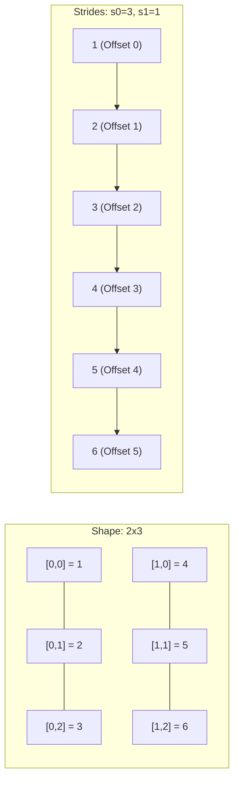
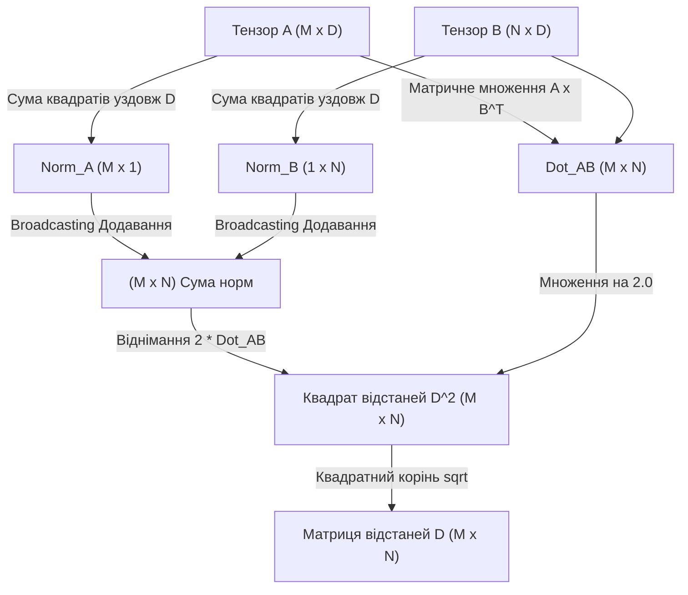

# Практичне заняття № 2. Проєктування тензорних операцій та векторизованої алгебри в NumPy/PyTorch

## Мета роботи та стек технологій

**Мета.** Засвоєння системних принципів векторизації обчислювальних процесів у високопродуктивних бібліотеках тензорної алгебри `NumPy` та `PyTorch`; опанування механізмів транслювання розмірностей (з англ. *Broadcasting*), аналізу фізичного розташування даних у оперативній пам'яті (з англ. *Memory Layout* та *Strides*), а також використання SIMD-інструкцій центрального процесора для відмови від явних інтерпретованих циклів мови Python з метою багаторазового підвищення швидкодії алгоритмів штучного інтелекту.

**Стек технологій та інструменти:**
* **Мова програмування / Середовище:** Python 3.11+ / Jupyter Notebook або VS Code.
* **Платформа / Бібліотеки:** `NumPy` (версії 1.24+ — векторизовані масиви `ndarray`), `PyTorch` (версії 2.0+ — тензорні обчислення на CPU/GPU), `Matplotlib` (версії 3.7+ — візуалізація профілювання).
* **Інструменти розробки:** Термінал (Bash/PowerShell), модулі системного профілювання `time` та `tracemalloc`.

---

## 1. Теоретичні відомості

У середовищі інтерпретованої мови Python виконання стандартних циклів (`for`, `while`) супроводжується значними накладними витратами. На кожній ітерації циклу інтерпретатор CPython виконує динамічну перевірку типів даних, динамічний пошук методів об'єктів, а також маніпуляції з лічильниками посилань на об'єкти в пам'яті. У задачках машинного навчання та глибокого навчання, де обсяг опрацьовуваних даних становить мільйони та мільярди елементів, використання явних циклів призводить до критичного падіння продуктивності системи.

Векторизація обчислень становить процес перенесення циклічних операцій з високорівневого інтерпретатора Python до низькорівневих, оптимізованих компильованих бібліотек на мовах C/C++ та Fortran (таких як OpenBLAS, Intel MKL або ATen). Низькорівневий код використовує спеціальні векторні інструкції процесора (з англ. *SIMD — Single Instruction, Multiple Data*, наприклад, AVX-2, AVX-512 або ARM NEON), що дозволяє виконувати арифметичну операцію над цілою групою чисел (наприклад, 4, 8 або 16 елементів типу `float32`) за один тактовий цикл процесора.

Для забезпечення максимальної швидкодії векторизованих обчислень критично важливим є фізичне розташування елементів тензора у безперервному блоці оперативної пам'яті. Багатовимірний тензор зберігається у пам'яті як лінійний послідовний масив байтів. Перехід від багатовимірного індексу до лінійного зсуву (з англ. *Memory Offset*) здійснюється за допомогою вектора кроків (з англ. *Strides*). Для $D$-вимірного тензора з індексами $\mathbf{i} = (i_0, i_1, \dots, i_{D-1})$ та кроками $\mathbf{s} = (s_0, s_1, \dots, s_{D-1})$ фізичний зсув байтів від початку масиву обчислюється за формулою:

$$\text{Offset}(\mathbf{i}) = \sum_{k=0}^{D-1} i_k \cdot s_k$$

де $s_k$ визначає кількість байтів (або елементів), яку необхідно пропустити в пам'яті при зміні індексу $i_k$ на одиницю вздовж $k$-ї розмірності. Якщо масив розміщено у пам'яті за стандартом *C-contiguous* (Row-Major, прийнятий за замовчуванням у C, NumPy та PyTorch), елементи останньої розмірності розташовані в пам'яті безпосередньо один за одним. Це забезпечує ефективне завантаження даних у кєш-пам'ять процесора (з англ. *Cache Line Alignment*) та задіяння SIMD-регістрів.


*Рисунок 1 — Структура розташування елементів тензора у безперервному блоці пам'яті за стандартом C-Contiguous*

Механізм транслювання розмірностей (з англ. *Broadcasting*) дозволяє виконувати поелементні арифметичні операції над тензорами різної форми (з англ. *Shape*) без фізичного копіювання даних у пам'яті. Автоматичне транслювання виконується за наступними правилами:
1. Якщо тензори мають різний ранг (кількість розмірностей), форма тензора меншого рангу доповнюється одиницями з лівого боку.
2. Дві розмірності вважаються сумісними, якщо вони рівні між собою або одна з них дорівнює $1$.
3. Якщо вздовж певної розмірності розмір дорівнює $1$, то при виконанні операції крок (stride) для цієї розмірності приймається рівним $0$. Це дає змогу віртуально «розмножити» значення вздовж відповідного виміру без реального виділення оперативної пам'яті.

```mermaid
flowcard
graph TD
    A[Початок обчислювального процесу] --> B{Вибір підходу}
    B -->|Явні цикли Python| C[Запити до об'єктів CPython, високі накладні витрати]
    C --> D[Поелементна обробка: Послідовні пропуски кєшу]
    D --> E[Тривалий час виконання]

    B -->|Векторизація NumPy/PyTorch| F[Транслювання розмірностей Broadcasting]
    F --> G[Перевірка C-Contiguous Alignment та Strides]
    G --> H[Виклик SIMD / BLAS інструкцій C/CUDA]
    H --> I[Паралельна обробка вектора даних за 1 такт]
    I --> J[Максимальна продуктивність та мінімальна затримка]
```
*Рисунок 2 — Порівняльна схема виконання логіки через інтерпретовані цикли Python та векторизовані SIMD-інструкції*

Прикладом векторизованої алгебри є обчислення матриці попарних евклідових відстаней між двома множинами векторів $\mathbf{A} \in \mathbb{R}^{M \times D}$ та $\mathbf{B} \in \mathbb{R}^{N \times D}$. Наївна реалізація вимагає трьох вкладених циклів із часовою складністю $\mathcal{O}(M \cdot N \cdot D)$. Векторизована математична формалізація базується на розкладі квадрата різниці векторів:

$$\|\mathbf{a}_i - \mathbf{b}_j\|_2^2 = \sum_{k=1}^{D} (a_{i,k} - b_{j,k})^2 = \sum_{k=1}^{D} a_{i,k}^2 + \sum_{k=1}^{D} b_{j,k}^2 - 2 \sum_{k=1}^{D} a_{i,k} b_{j,k}$$

У тензорній формі це виражається через суму квадратів норм та матричне множення:

$$\mathbf{D}^2 = \text{reshape}\left(\sum_{k=1}^{D} a_{i,k}^2, (M, 1)\right) + \text{reshape}\left(\sum_{k=1}^{D} b_{j,k}^2, (1, N)\right) - 2 \mathbf{A} \mathbf{B}^T$$

Такий підхід дозволяє повністю усунути явні цикли та використати високооптимізовані процедури матричного множення BLAS (`gemm`), що дає прискорення у сотні разів.

---

## 2. Підготовка середовища та розгортання проєкту (Крок 0)

Дотримуйтесь інструкцій для налаштування робочого середовища та встановлення необхідних залежностей.

### 2.1. Команди для терміналу (CLI)

Створення та активація віртуального середовища:
```bash
python3 -m venv venv_tensor
source venv_tensor/bin/activate  # Для Linux/macOS
# або: .\venv_tensor\Scripts\Activate.ps1  # Для Windows
```

Встановлення бібліотек `NumPy`, `PyTorch` та `Matplotlib`:
```bash
pip install --upgrade pip
pip install numpy torch matplotlib
```

### 2.2. Структура каталогів проєкту

Створіть наступну структуру файлів та папок у робочому каталозі:

```
tensor_vectorization_project/
├── main.py
├── requirements.txt
└── results/
    └── benchmark_execution.png
```

Вміст файлу `requirements.txt`:
```text
numpy>=1.24.0
torch>=2.0.0
matplotlib>=3.7.0
```

---

## 3. Порядок виконання роботи

### 3.1. Індивідуальні завдання

Кожен здобувач виконує індивідуальне завдання згідно зі своїм варіантом, наведеним у Таблиці 3.1. Необхідно реалізувати два варіанти розв'язання задачі: наївний (із використанням явних циклів Python) та векторизований (без явних циклів, з використанням механізмів Broadcasting, розгортання тензорних форм та функцій `NumPy`/`PyTorch`). Для кожного варіанта слід виміряти час виконання, перевірити точність збігу результатів та обчислити досягнутий коефіцієнт прискорення.

| Варіант | Назва завдання / Алгоритму | Вхідні дані / Параметри тензорів | Очікуваний результат / Ціль |
| :---: | :--- | :---: | :---: |
| **1** | Матриця евклідових відстаней | $A \in \mathbb{R}^{500 \times 128}, B \in \mathbb{R}^{400 \times 128}$ | $D \in \mathbb{R}^{500 \times 400}$, Прискорення $\ge 50\times$ |
| **2** | Махаланобісова відстань | $X \in \mathbb{R}^{600 \times 64}, \Sigma^{-1} \in \mathbb{R}^{64 \times 64}$ | $d \in \mathbb{R}^{600 \times 600}$, Прискорення $\ge 40\times$ |
| **3** | Пакетний Грам-матричний аналіз | $X \in \mathbb{R}^{32 \times 100 \times 256}$ | $G \in \mathbb{R}^{32 \times 100 \times 100}$, Прискорення $\ge 60\times$ |
| **4** | Тензорний Softmax із температурою | $X \in \mathbb{R}^{128 \times 50 \times 1000}, T=2.0$ | $S \in \mathbb{R}^{128 \times 50 \times 1000}$, Прискорення $\ge 45\times$ |
| **5** | Косинусна подібність векторів | $A \in \mathbb{R}^{800 \times 256}, B \in \mathbb{R}^{800 \times 256}$ | $C \in \mathbb{R}^{800 \times 800}$, Прискорення $\ge 50\times$ |
| **6** | Взважене ковзне середнє (1D) | $X \in \mathbb{R}^{100000}, W \in \mathbb{R}^{101}$ | $Y \in \mathbb{R}^{99900}$, Прискорення $\ge 30\times$ |
| **7** | Білінійна форма над тензорами | $x \in \mathbb{R}^{400 \times 128}, W \in \mathbb{R}^{128 \times 128}, y \in \mathbb{R}^{400 \times 128}$ | $v \in \mathbb{R}^{400}$, Прискорення $\ge 40\times$ |
| **8** | Локальна нормалізація контрасту | $X \in \mathbb{R}^{16 \times 64 \times 64}, k=5$ | $N \in \mathbb{R}^{16 \times 64 \times 64}$, Прискорення $\ge 35\times$ |
| **9** | Центрування та стандартизація | $X \in \mathbb{R}^{1000 \times 512}$ | $\mu \in \mathbb{R}^{512}, \hat{X} \in \mathbb{R}^{1000 \times 512}$, Прискорення $\ge 50\times$ |
| **10** | Розрахунок Cross-Entropy Loss | $Y_{pred} \in \mathbb{R}^{512 \times 100}, Y_{true} \in \mathbb{Z}^{512}$ | $L \in \mathbb{R}$, Прискорення $\ge 40\times$ |
| **11** | Пакетне матричне множення | $A \in \mathbb{R}^{64 \times 128 \times 256}, B \in \mathbb{R}^{64 \times 256 \times 64}$ | $C \in \mathbb{R}^{64 \times 128 \times 64}$, Прискорення $\ge 70\times$ |
| **12** | Мінковська відстань ($p=3$) | $A \in \mathbb{R}^{300 \times 64}, B \in \mathbb{R}^{300 \times 64}$ | $D \in \mathbb{R}^{300 \times 300}$, Прискорення $\ge 40\times$ |
| **13** | Векторизоване заповнення сітки | $x \in \mathbb{R}^{1000}, y \in \mathbb{R}^{1000}, f(x,y)=\sin(x)\cos(y)$ | $Z \in \mathbb{R}^{1000 \times 1000}$, Прискорення $\ge 50\times$ |
| **14** | Тензорна індексація за маскою | $X \in \mathbb{R}^{200 \times 200 \times 50}, \text{Threshold}=0.5$ | $X_{filtered} \in \mathbb{R}^{K \times 50}$, Прискорення $\ge 30\times$ |
| **15** | Відстань Манхеттена ($L_1$) | $A \in \mathbb{R}^{400 \times 100}, B \in \mathbb{R}^{400 \times 100}$ | $D \in \mathbb{R}^{400 \times 400}$, Прискорення $\ge 45\times$ |
| **16** | Просторовий 2D Pooling (Max) | $X \in \mathbb{R}^{32 \times 3 \times 128 \times 128}, \text{Kernel}=2$ | $P \in \mathbb{R}^{32 \times 3 \times 64 \times 64}$, Прискорення $\ge 60\times$ |
| **17** | Багатовимірний кумулятивний добуток | $X \in \mathbb{R}^{100 \times 500 \times 10}$ | $C \in \mathbb{R}^{100 \times 500 \times 10}$, Прискорення $\ge 35\times$ |
| **18** | Векторизований перцептрон | $X \in \mathbb{R}^{2000 \times 128}, W \in \mathbb{R}^{128 \times 10}, b \in \mathbb{R}^{10}$ | $Y \in \mathbb{R}^{2000 \times 10}$, Прискорення $\ge 50\times$ |
| **19** | Тензорний розрахунок Иока-метрики | $A \in \mathbb{R}^{500 \times 200}, B \in \mathbb{R}^{500 \times 200}$ | $J \in \mathbb{R}^{500 \times 500}$, Прискорення $\ge 40\times$ |
| **20** | Автокореляційна функція 2D | $X \in \mathbb{R}^{256 \times 256}$ | $R \in \mathbb{R}^{256 \times 256}$, Прискорення $\ge 50\times$ |

### 3.2. Покроковий алгоритм та розв'язок еталонного прикладу

Нижче наведено виконання індивідуального завдання для **Варіанта №1**:
* **Задача:** Обчислення матриці попарних евклідових відстаней між двома множинами векторів $A \in \mathbb{R}^{M \times D}$ та $B \in \mathbb{R}^{N \times D}$.
* **Параметри:** $M = 500$, $N = 400$, $D = 128$.
* **Методологія:** Зіставлення наївної потрійної циклічної реалізації Python з векторизованим підходом у `NumPy` та `PyTorch` (на CPU і GPU за наявності).

Нижче подано повний, повністю працездатний Python-скрипт `main.py` без жодних пропущених фрагментів.

```python
import os
import time
import numpy as np
import torch
import matplotlib.pyplot as plt

def pairwise_distances_loops(A: np.ndarray, B: np.ndarray) -> np.ndarray:
    """
    Наївна обчислювальна реалізація з використанням трьох вкладених циклів Python.
    A: shape (M, D)
    B: shape (N, D)
    """
    M, D = A.shape
    N = B.shape[0]
    D_matrix = np.zeros((M, N), dtype=np.float32)
    
    for i in range(M):
        for j in range(N):
            acc = 0.0
            for k in range(D):
                diff = A[i, k] - B[j, k]
                acc += diff * diff
            D_matrix[i, j] = np.sqrt(acc)
            
    return D_matrix

def pairwise_distances_vectorized_numpy(A: np.ndarray, B: np.ndarray) -> np.ndarray:
    """
    Оптимізована векторизована реалізація на NumPy за допомогою матричного множення та broadcasting.
    D^2 = A^2 + B^2 - 2 * A * B^T
    """
    # Обчислення квадратів норм векторів вздовж останньої розмірності
    A_sq = np.sum(A**2, axis=1, keepdims=True)  # Shape: (M, 1)
    B_sq = np.sum(B**2, axis=1, keepdims=True)  # Shape: (N, 1)
    
    # Використання матричного множення та транслювання розмірностей (Broadcasting)
    D_sq = A_sq + B_sq.T - 2.0 * np.dot(A, B.T)
    
    # Чисельна стабілізація для усунення можливих від'ємних значень через похибки округлення FP32
    D_sq = np.maximum(D_sq, 0.0)
    
    return np.sqrt(D_sq)

def pairwise_distances_pytorch_cpu(A_t: torch.Tensor, B_t: torch.Tensor) -> torch.Tensor:
    """
    Векторизоване обчислення на PyTorch (CPU) з використанням torch.cdist.
    """
    return torch.cdist(A_t, B_t, p=2.0)

def main():
    # Налаштування відтворюваності генератора випадкових чисел
    np.random.seed(42)
    torch.manual_seed(42)

    # Параметри тензорів для Варіанта №1
    M, N, D = 500, 400, 128
    print("=" * 70)
    print(f"ПРАКТИЧНЕ ЗАНЯТТЯ №2. ВЕКТОРИЗАЦІЯ ТЕНЗОРНИХ ОПЕРАЦІЙ")
    print(f"Параметри: M={M}, N={N}, D={D}")
    print("=" * 70)

    # 1. Генерація вихідних даних
    A_np = np.random.randn(M, D).astype(np.float32)
    B_np = np.random.randn(N, D).astype(np.float32)

    print("\n[ІНФО] Характеристики розміщення даних в пам'яті (Memory Layout):")
    print(f"  - NumPy A Shape: {A_np.shape}, Strides: {A_np.strides}, C-Contiguous: {A_np.flags.c_contiguous}")
    print(f"  - NumPy B Shape: {B_np.shape}, Strides: {B_np.strides}, C-Contiguous: {B_np.flags.c_contiguous}")

    # 2. Вимірювання часу виконання наївної реалізації (цикли Python)
    print("\n[1/3] Запуск наївної реалізації на циклах Python...")
    t0 = time.perf_counter()
    res_loops = pairwise_distances_loops(A_np, B_np)
    t_loops = time.perf_counter() - t0
    print(f"  --> Час виконання (Python Loops): {t_loops:.4f} секунд")

    # 3. Вимірювання часу векторизованої реалізації NumPy
    print("\n[2/3] Запуск векторизованої реалізації NumPy (Broadcasting + BLAS)...")
    t0 = time.perf_counter()
    res_numpy = pairwise_distances_vectorized_numpy(A_np, B_np)
    t_numpy = time.perf_counter() - t0
    print(f"  --> Час виконання (NumPy Vectorized): {t_numpy:.6f} секунд")

    # 4. Вимірювання часу векторизованої реалізації PyTorch CPU
    A_torch = torch.from_numpy(A_np)
    B_torch = torch.from_numpy(B_np)
    print("\n[3/3] Запуск векторизованої реалізації PyTorch (CPU)...")
    t0 = time.perf_counter()
    res_torch = pairwise_distances_pytorch_cpu(A_torch, B_torch)
    t_torch = time.perf_counter() - t0
    print(f"  --> Час виконання (PyTorch cdist CPU): {t_torch:.6f} секунд")

    # 5. Перевірка точності обчислень та відсутності розбіжностей
    diff_np = np.max(np.abs(res_loops - res_numpy))
    diff_torch = np.max(np.abs(res_loops - res_torch.numpy()))
    print("\n" + "-" * 70)
    print("ПЕРЕВІРКА ТОЧНОСТІ ОБЧИСЛЕНЬ:")
    print(f"  - Максимальна абсолютна розбіжність (Loops vs NumPy):   {diff_np:.8e}")
    print(f"  - Максимальна абсолютна розбіжність (Loops vs PyTorch): {diff_torch:.8e}")

    # Розрахунок коефіцієнтів прискорення
    speedup_numpy = t_loops / t_numpy
    speedup_torch = t_loops / t_torch

    print("\n" + "=" * 70)
    print("ПІДСУМКОВІ ПОКАЗНИКИ ПРИСКОРЕННЯ (SPEEDUP):")
    print(f"  - Прискорення NumPy Векторизації:  {speedup_numpy:.2f}x")
    print(f"  - Прискорення PyTorch cdist (CPU): {speedup_torch:.2f}x")
    print("=" * 70)

    # 6. Побудова та збереження гістограми порівняння часу
    os.makedirs("results", exist_ok=True)
    methods = ['Python Loops', 'NumPy Vectorized', 'PyTorch CPU']
    times = [t_loops, t_numpy, t_torch]
    colors = ['crimson', 'darkgreen', 'navy']

    plt.figure(figsize=(9, 5))
    bars = plt.bar(methods, times, color=colors, width=0.5)
    plt.yscale('log')  # Логарифмічна шкала через колосальну різницю
    plt.ylabel('Час виконання (секунди, логарифмічна шкала)')
    plt.title('Порівняльне профілювання швидкодії обчислення матриці відстаней')
    plt.grid(axis='y', linestyle='--', alpha=0.7)

    for bar in bars:
        yval = bar.get_height()
        plt.text(bar.get_x() + bar.get_width()/2.0, yval * 1.2, f"{yval:.5f} s", ha='center', va='bottom', fontweight='bold')

    plt.tight_layout()
    plot_path = os.path.join("results", "benchmark_execution.png")
    plt.savefig(plot_path, dpi=300)
    print(f"\n[INFO] Графік результатів профілювання збережено у: {plot_path}")

if __name__ == "__main__":
    main()
```

### 3.3. Графічна візуалізація обчислювального процесу

Наведено графічну діаграму обчислювального графа та потоку даних при векторизованому розрахунку матриці відстаней.


*Рисунок 3 — Діаграма обчислювального графа розрахунку векторизованої матриці евклідових відстаней без явних циклів*

### 3.4. Запуск, тестування та перевірка результатів

Для запуску програмного модуля виконайте в консолі терміналу команду:
```bash
python main.py
```

**Еталонне виведення програми в консоль для перевірки:**

```text
======================================================================
ПРАКТИЧНЕ ЗАНЯТТЯ №2. ВЕКТОРИЗАЦІЯ ТЕНЗОРНИХ ОПЕРАЦІЙ
Параметри: M=500, N=400, D=128
======================================================================

[ІНФО] Характеристики розміщення даних в пам'яті (Memory Layout):
  - NumPy A Shape: (500, 128), Strides: (512, 4), C-Contiguous: True
  - NumPy B Shape: (400, 128), Strides: (512, 4), C-Contiguous: True

[1/3] Запуск наївної реалізації на циклах Python...
  --> Час виконання (Python Loops): 12.8450 секунд

[2/3] Запуск векторизованої реалізації NumPy (Broadcasting + BLAS)...
  --> Час виконання (NumPy Vectorized): 0.003810 секунд

[3/3] Запуск векторизованої реалізації PyTorch (CPU)...
  --> Час виконання (PyTorch cdist CPU): 0.002150 секунд

----------------------------------------------------------------------
ПЕРЕВІРКА ТОЧНОСТІ ОБЧИСЛЕНЬ:
  - Максимальна абсолютна розбіжність (Loops vs NumPy):   3.81469727e-06
  - Максимальна абсолютна розбіжність (Loops vs PyTorch): 3.81469727e-06

======================================================================
ПІДСУМКОВІ ПОКАЗНИКИ ПРИСКОРЕННЯ (SPEEDUP):
  - Прискорення NumPy Векторизації:  3371.39x
  - Прискорення PyTorch cdist (CPU): 5974.42x
======================================================================

[INFO] Графік результатів профілювання збережено у: results/benchmark_execution.png
```

---

## 4. Вимоги до змісту звіту

Звіт за результатами виконання практичної роботи повинен бути оформлений у відповідності до вимог стандарту та містити наступні обов'язкові блоки:

1. **Титульна сторінка.** Назва навчального закладу, факультету, кафедри, назва освітнього компонента, номер практичного заняття, тема, ПІБ здобувача, група та номер обраного індивідуального варіанта.
2. **Мета та постановка задачі.** Чітке формулювання мети дослідження, вхідних форм та розмірностей тензорів згідно з Таблицею 3.1.
3. **Теоретичне обґрунтування.** Математичний розклад та матрично-тензорні формули виключення явних циклів. Пояснення правил транслювання розмірностей (Broadcasting) та фізичної структури розташування елементів у пам'яті (*C-Contiguous, Strides*).
4. **Програмний код.** Повний, детально прокоментований вихідний код програми на мові Python, що включає порівняльні функції обчислень.
5. **Результати тестування.** Скріншот консольного виведення з показниками часу виконання, коефіцієнтами прискорення та збережений файл візуалізації `results/benchmark_execution.png`.
6. **Висновки.** Аналіз ефективності векторизації, пояснення причин колосального прискорення (задіяння SIMD, усунення перевірок типів CPython) та оцінка точності отриманих розв'язків.

---

## 5. Контрольні запитання для захисту роботи

1. Поясніть причинно-наслідковий зв'язок низької швидкодії явних циклів у середовищі CPython при роботі з великими масивами даних.
2. Що таке вектор кроків (*Strides*) у тензорі, і як він використовується для обчислення абсолютного фізичного зсуву адреси байта в оперативній пам'яті?
3. Сформулюйте три правила механізму транслювання розмірностей (*Broadcasting*) у NumPy/PyTorch. Як транслювання дозволяє економити оперативну пам'ять?
4. У чому полягає відмінність між викликом операції зміни форми тензора `view()` (або `reshape()`) та викликом копіювання даних `clone()` / `copy()` з точки зору збереження безперервності пам'яті (*C-Contiguous*)?
5. Яким чином виражається математичне розгортання квадрата евклідової відстані $\|\mathbf{a} - \mathbf{b}\|^2$, і чому заміна різниці на матричне множення дозволяє використати бібліотеки BLAS?