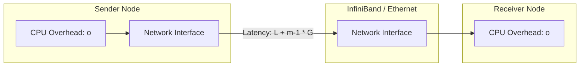
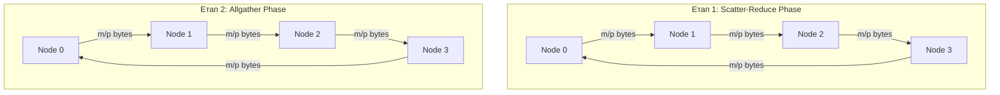
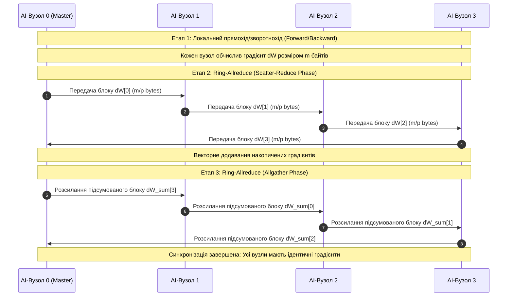

# Практичне заняття № 3. Проєктування комунікаційних схем MPI для розподілених AI-вузлів

## Мета роботи та стек технологій

**Мета.** Засвоєння системних засад функціонування розподілених обчислювальних систем та інтерфейсу передачі повідомлень (з англ. *Message Passing Interface — MPI*); аналітичне проєктування та порівняльний аналіз комунікаційних затримок точкових (*Point-to-Point*) і колективних (*Collective Operations: Broadcast, Scatter, Reduce, Allreduce*) операцій у високопродуктивних AI-кластерах на основі математичних моделей Хокні (Hockney) та LogGP; оцінювання ефективності топологій комунікації (біноміальне дерево, кільцевий Allreduce) при розподіленому навчанні глибоких нейронних мереж.

**Стек технологій та інструменти:**
* **Мова програмування / Середовище:** Python 3.11+ / Jupyter Notebook або VS Code.
* **Платформа / Бібліотеки:** `NumPy` (версії 1.24+ — векторизоване моделювання тензорних масивів), `Matplotlib` (версії 3.7+ — візуалізація часових характеристик комунікації), `mpi4py` (опціонально для натурного тестування у реальному середовищі MPI).
* **Інструменти розробки:** термінал (Bash/PowerShell), менеджери процесів `OpenMPI` або `MS-MPI`.

---

## 1. Теоретичні відомості

У сучасних розподілених системах штучного інтелекту навчання великомасштабних нейромережевих моделей (таких як LLM або ResNet) виконується на паралельних обчислювальних кластерах. У режимі паралелізму за даними (з англ. *Distributed Data Parallel — DDP*) кожен обчислювальний вузол (GPU/CPU) утримує локальну копію вагових коефіцієнтів моделі та обчислює градієнти функції втрат на власному міні-батчі. Для підтримки синхронізації параметрів моделі наприкінці кожної ітерації ітеративного градієнтного спуску виконується колективна операція усреднення градієнтів `Allreduce`. Час міжпроцесорних комунікацій становить значну частку загального часу навчання, що робить точний аналіз та оптимізацію комунікаційних затримок критично важливим завданням комп'ютерної інженерії.

Для аналітичного оцінювання часу передачі повідомлень між вузлами застосовуються аналітичні параметричні моделі.

### Модель Хокні (Hockney Model)

Модель Хокні описує тривалість передачі повідомлення розміром $m$ байтів між двома вузлами мережі як лінійну функцію, що враховує затримку ініціалізації та пропускну здатність комутаційного каналу:

$$T_{\text{Hockney}}(m) = \alpha + \beta \cdot m = \alpha + \frac{m}{B}$$

де $\alpha$ (з англ. *Latency / Startup Time*) — латентність мережі (час початкової підготовки та запуску операції в секундах), $\beta = 1/B$ — питома затримка передачі одного байта, $B$ — смуга пропускання комунікаційного каналу (з англ. *Bandwidth*, байт/с), $m$ — обсяг повідомлення в байтах.

### Модель LogGP (LogGP Model)

Модель LogGP розширює базову модель і враховує накладні витрати центрального процесора та мінімальні інтервали між відправками коротких та довгих повідомлень:
* $L$ (*Latency*) — мережева затримка фізичного середовища передачі байта від джерела до одержувача.
* $o$ (*Overhead*) — накладні витрати центрального процесора на підготовку та обробку пакету (апаратно-програмне блокування CPU).
* $g$ (*Gap*) — мінімальний часовий інтервал між послідовними відправками або прийомами коротких повідомлень ($g = 1/\text{Rate}$).
* $G$ (*Gap per byte*) — питомий час передачі одного байта даних ($G = 1/B$).
* $P$ (*Processors*) — кількість обчислювальних вузлів системи.

Тривалість передачі повідомлення розміром $m$ байтів між двома вузлами за моделлю LogGP обчислюється за формулою:

$$T_{\text{LogGP}}(m) = 2o + L + (m - 1) \cdot G$$


*Рисунок 1 — Структурна схема затримок передачі даних за моделлю LogGP*

### Аналіз колективних операцій MPI

Колективні операції вимагають синхронізації та обміну даними між усіма $p$ процесами комунікатора.

1. **Широкомовна розсилка (Broadcast / `MPI_Bcast`).** Передача одного й того самого повідомлення розміром $m$ байтів від одного кореневого вузла усім іншим $(p-1)$ вузлам. При використанні оптимізованого алгоритму біноміального дерева (з англ. *Binomial Tree*) тривалість становить:

   $$T_{\text{Bcast}}(m, p) = \lceil \log_2 p \rceil \cdot \left( \alpha + \frac{m}{B} \right)$$

2. **Розподіл даних (Scatter / `MPI_Scatter`).** Розбиття масиву розміром $m$ байтів на $p$ рівних частин розміром $m/p$ та відправка кожної унікальної частини відповідному процесу. За біноміальною схемою:

   $$T_{\text{Scatter}}(m, p) = \lceil \log_2 p \rceil \cdot \alpha + \left(\frac{p-1}{p}\right) \cdot m \cdot \beta$$

3. **Редукція даних (Reduce / `MPI_Reduce`).** Збирання блоків розміром $m$ байтів від усіх $p$ процесів на одному кореневому вузлі з поелементним застосуванням операції (наприклад, додавання). Враховуючи час векторної обробки $\gamma_{\text{comp}}$ (секунд на байт):

   $$T_{\text{Reduce}}(m, p) = \lceil \log_2 p \rceil \cdot \left( \alpha + \frac{m}{B} + m \cdot \gamma_{\text{comp}} \right)$$

4. **Кільцевий Allreduce (Ring-Allreduce).** Сучасний стандарт для синхронізації градієнтів у AI-кластерах (NCLL/Horovod). Обчислення виконується за два етапи: *Scatter-Reduce* та *Allgather*. Кожен вузол обмінюється даними лише зі своїм сусідом у кільці фрагментами розміром $m/p$. Загальний час не залежить логарифмічно від кількості вузлів для обсягу даних:

   $$T_{\text{Ring-Allreduce}}(m, p) = 2(p-1) \cdot \alpha + 2 \left(\frac{p-1}{p}\right) \cdot \frac{m}{B} + \left(\frac{p-1}{p}\right) \cdot m \cdot \gamma_{\text{comp}}$$


*Рисунок 2 — Схема передачі даних у кільцевому алгоритмі Ring-Allreduce для 4 AI-вузлів*

---

## 2. Підготовка середовища та розгортання проєкту (Крок 0)

Для виконання лабораторних обчислень та моделювання комунікаційних схем налаштуйте робоче середовище Python.

### 2.1. Команди для терміналу (CLI)

Створення та активація віртуального середовища:
```bash
python3 -m venv venv_mpi
source venv_mpi/bin/activate  # Для Linux/macOS
# або: .\venv_mpi\Scripts\Activate.ps1  # Для Windows
```

Встановлення бібліотек `NumPy` та `Matplotlib`:
```bash
pip install --upgrade pip
pip install numpy matplotlib
```

*(Опціонально)* Для проведення натурних випробувань у реальному середовищі MPI встановить `mpi4py` (потребує попередньо встановленого OpenMPI або MS-MPI):
```bash
pip install mpi4py
```

### 2.2. Структура каталогів проєкту

Створіть наступну структуру файлів та папок у робочому каталозі:

```
mpi_communication_project/
├── main.py
├── requirements.txt
└── results/
    └── mpi_analysis_plots.png
```

Вміст файлу `requirements.txt`:
```text
numpy>=1.24.0
matplotlib>=3.7.0
```

---

## 3. Порядок виконання роботи

### 3.1. Індивідуальні завдання

Кожен здобувач виконує аналітичні розрахунки відповідно до свого варіанта з наведеної нижче Таблиці 3.1. Необхідно розрахувати час точкової передачі за моделями Хокні та LogGP, порівняти затримки операцій `Broadcast`, `Scatter`, `Reduce` за біноміальною схемою та обчислити комунікаційну затримку `Ring-Allreduce` для синхронізації тензора градієнтів заданого обсягу.

| Варіант | Мережева технологія | Латентність $\alpha$ ($L$) | Пропускна здатність $B$ ($1/G$) | CPU Overhead $o$ | Gap $g$ | Кількість вузлів $p$ | Розмір тензора градієнтів $m$ | Час векторної операції $\gamma_{\text{comp}}$ |
| :---: | :--- | :---: | :---: | :---: | :---: | :---: | :---: | :---: |
| **1** | InfiniBand HDR | $1.5 \ \mu\text{s}$ | $200 \text{ Gbps}$ ($25 \text{ GB/s}$) | $0.8 \ \mu\text{s}$ | $1.0 \ \mu\text{s}$ | $64$ | $100 \text{ MB}$ | $0.2 \text{ ns/byte}$ |
| **2** | 100GbE RoCEv2 | $5.0 \ \mu\text{s}$ | $100 \text{ Gbps}$ ($12.5 \text{ GB/s}$) | $1.5 \ \mu\text{s}$ | $2.0 \ \mu\text{s}$ | $32$ | $50 \text{ MB}$ | $0.3 \text{ ns/byte}$ |
| **3** | InfiniBand EDR | $2.0 \ \mu\text{s}$ | $100 \text{ Gbps}$ ($12.5 \text{ GB/s}$) | $1.0 \ \mu\text{s}$ | $1.2 \ \mu\text{s}$ | $128$ | $200 \text{ MB}$ | $0.15 \text{ ns/byte}$ |
| **4** | 25GbE Standard | $15.0 \ \mu\text{s}$ | $25 \text{ Gbps}$ ($3.125 \text{ GB/s}$) | $3.0 \ \mu\text{s}$ | $4.0 \ \mu\text{s}$ | $16$ | $20 \text{ MB}$ | $0.5 \text{ ns/byte}$ |
| **5** | NVLink Interconnect | $0.5 \ \mu\text{s}$ | $900 \text{ GB/s}$ | $0.2 \ \mu\text{s}$ | $0.3 \ \mu\text{s}$ | $16$ | $500 \text{ MB}$ | $0.05 \text{ ns/byte}$ |
| **6** | InfiniBand NDR | $0.8 \ \mu\text{s}$ | $400 \text{ Gbps}$ ($50 \text{ GB/s}$) | $0.5 \ \mu\text{s}$ | $0.6 \ \mu\text{s}$ | $256$ | $400 \text{ MB}$ | $0.1 \text{ ns/byte}$ |
| **7** | 40GbE RoCE | $8.0 \ \mu\text{s}$ | $40 \text{ Gbps}$ ($5.0 \text{ GB/s}$) | $2.0 \ \mu\text{s}$ | $2.5 \ \mu\text{s}$ | $64$ | $80 \text{ MB}$ | $0.4 \text{ ns/byte}$ |
| **8** | PCIe 4.0 x16 Bus | $1.0 \ \mu\text{s}$ | $31.5 \text{ GB/s}$ | $0.4 \ \mu\text{s}$ | $0.5 \ \mu\text{s}$ | $8$ | $150 \text{ MB}$ | $0.2 \text{ ns/byte}$ |
| **9** | PCIe 5.0 x16 Bus | $0.6 \ \mu\text{s}$ | $63.0 \text{ GB/s}$ | $0.3 \ \mu\text{s}$ | $0.4 \ \mu\text{s}$ | $8$ | $300 \text{ MB}$ | $0.1 \text{ ns/byte}$ |
| **10** | 10GbE Standard | $30.0 \ \mu\text{s}$ | $10 \text{ Gbps}$ ($1.25 \text{ GB/s}$) | $5.0 \ \mu\text{s}$ | $6.0 \ \mu\text{s}$ | $32$ | $10 \text{ MB}$ | $0.8 \text{ ns/byte}$ |
| **11** | InfiniBand QDR | $3.5 \ \mu\text{s}$ | $40 \text{ Gbps}$ ($5.0 \text{ GB/s}$) | $1.8 \ \mu\text{s}$ | $2.0 \ \mu\text{s}$ | $64$ | $60 \text{ MB}$ | $0.3 \text{ ns/byte}$ |
| **12** | 200GbE RoCEv2 | $2.5 \ \mu\text{s}$ | $200 \text{ Gbps}$ ($25 \text{ GB/s}$) | $1.0 \ \mu\text{s}$ | $1.2 \ \mu\text{s}$ | $128$ | $250 \text{ MB}$ | $0.15 \text{ ns/byte}$ |
| **13** | Ultra Accelerator Link | $0.4 \ \mu\text{s}$ | $600 \text{ GB/s}$ | $0.15 \ \mu\text{s}$ | $0.2 \ \mu\text{s}$ | $32$ | $1000 \text{ MB}$ | $0.04 \text{ ns/byte}$ |
| **14** | InfiniBand FDR | $2.5 \ \mu\text{s}$ | $56 \text{ Gbps}$ ($7.0 \text{ GB/s}$) | $1.2 \ \mu\text{s}$ | $1.5 \ \mu\text{s}$ | $32$ | $40 \text{ MB}$ | $0.25 \text{ ns/byte}$ |
| **15** | 50GbE RoCEv2 | $6.0 \ \mu\text{s}$ | $50 \text{ Gbps}$ ($6.25 \text{ GB/s}$) | $2.0 \ \mu\text{s}$ | $2.2 \ \mu\text{s}$ | $64$ | $90 \text{ MB}$ | $0.35 \text{ ns/byte}$ |
| **16** | CXL 2.0 Interconnect | $0.9 \ \mu\text{s}$ | $64 \text{ GB/s}$ | $0.4 \ \mu\text{s}$ | $0.5 \ \mu\text{s}$ | $16$ | $200 \text{ MB}$ | $0.12 \text{ ns/byte}$ |
| **17** | Shared Memory Inter-Process | $0.2 \ \mu\text{s}$ | $100 \text{ GB/s}$ | $0.1 \ \mu\text{s}$ | $0.1 \ \mu\text{s}$ | $8$ | $150 \text{ MB}$ | $0.1 \text{ ns/byte}$ |
| **18** | InfiniBand HDR100 | $1.8 \ \mu\text{s}$ | $100 \text{ Gbps}$ ($12.5 \text{ GB/s}$) | $0.9 \ \mu\text{s}$ | $1.1 \ \mu\text{s}$ | $128$ | $120 \text{ MB}$ | $0.18 \text{ ns/byte}$ |
| **19** | 100GbE AWS EFA | $4.0 \ \mu\text{s}$ | $100 \text{ Gbps}$ ($12.5 \text{ GB/s}$) | $1.6 \ \mu\text{s}$ | $1.8 \ \mu\text{s}$ | $64$ | $180 \text{ MB}$ | $0.2 \text{ ns/byte}$ |
| **20** | 800GbE NextGen | $1.2 \ \mu\text{s}$ | $800 \text{ Gbps}$ ($100 \text{ GB/s}$) | $0.6 \ \mu\text{s}$ | $0.7 \ \mu\text{s}$ | $512$ | $500 \text{ MB}$ | $0.08 \text{ ns/byte}$ |

### 3.2. Покроковий алгоритм та розв'язок еталонного прикладу

Розглянемо виконання розрахунків для **Варіанта №1**:
* **Параметри:** InfiniBand HDR, $\alpha = 1.5 \ \mu\text{s} = 1.5 \times 10^{-6} \text{ с}$, $B = 25 \text{ GB/s} = 25 \times 10^9 \text{ байт/с}$, $o = 0.8 \ \mu\text{s} = 0.8 \times 10^{-6} \text{ с}$, $g = 1.0 \ \mu\text{s} = 1.0 \times 10^{-6} \text{ с}$, $G = 1/B = 4.0 \times 10^{-11} \text{ с/байт}$, $p = 64$ вузли, $m = 100 \text{ MB} = 100 \times 10^6 \text{ байт}$, $\gamma_{\text{comp}} = 0.2 \text{ ns/byte} = 0.2 \times 10^{-9} \text{ с/байт}$.

**Математичний розрахунок затримок:**
1. **Точкова передача (Point-to-Point) за моделлю Хокні:**
   $$T_{\text{Hockney}}(m) = \alpha + \frac{m}{B} = 1.5 \times 10^{-6} + \frac{100 \times 10^6}{25 \times 10^9} = 1.5 \times 10^{-6} + 0.004 = 0.0040015 \text{ с} \approx 4.0015 \text{ ms}$$
2. **Точкова передача (Point-to-Point) за моделлю LogGP:**
   $$T_{\text{LogGP}}(m) = 2o + L + (m-1)G = 2(0.8 \times 10^{-6}) + 1.5 \times 10^{-6} + (100 \times 10^6 - 1) \cdot (4 \times 10^{-11}) \approx 3.1 \times 10^{-6} + 0.004 = 0.0040031 \text{ с} \approx 4.0031 \text{ ms}$$
3. **Біноміальний Broadcast ($p = 64$, $\lceil \log_2 64 \rceil = 6$):**
   $$T_{\text{Bcast}}(m, p) = 6 \cdot \left(1.5 \times 10^{-6} + 0.004\right) = 6 \cdot 0.0040015 = 0.024009 \text{ с} \approx 24.009 \text{ ms}$$
4. **Біноміальний Scatter ($p = 64$):**
   $$T_{\text{Scatter}}(m, p) = 6 \cdot (1.5 \times 10^{-6}) + \left(\frac{63}{64}\right) \cdot 100 \times 10^6 \cdot \left(\frac{1}{25 \times 10^9}\right) = 9 \times 10^{-6} + 0.984375 \cdot 0.004 = 0.0039465 \text{ с} \approx 3.9465 \text{ ms}$$
5. **Біноміальний Reduce ($p = 64$):**
   $$T_{\text{Reduce\_Comp}} = 100 \times 10^6 \cdot 0.2 \times 10^{-9} = 0.02 \text{ с}$$
   $$T_{\text{Reduce}}(m, p) = 6 \cdot \left(1.5 \times 10^{-6} + 0.004 + 0.02\right) = 6 \cdot 0.0240015 = 0.144009 \text{ с} \approx 144.009 \text{ ms}$$
6. **Кільцевий Allreduce (Ring-Allreduce, $p = 64$):**
   $$T_{\text{Ring-Allreduce}}(m, p) = 2(63) \cdot (1.5 \times 10^{-6}) + 2 \left(\frac{63}{64}\right) \cdot 0.004 + \left(\frac{63}{64}\right) \cdot 0.02$$
   $$T_{\text{Ring-Allreduce}}(m, p) = 0.000189 + 0.007875 + 0.0196875 = 0.0277515 \text{ с} \approx 27.7515 \text{ ms}$$

Нижче наведено повний, готовий до запуску Python-скрипт `main.py`, який виконує всі розрахунки, моделює затримки для різних масштабах AI-кластера та будує графіки.

```python
import os
import numpy as np
import matplotlib.pyplot as plt

def hockney_p2p(m_bytes: float, alpha: float, B_bytes_per_sec: float) -> float:
    """
    Розрахунок часу точкової передачі за моделлю Хокні.
    m_bytes: розмір повідомлення в байтах
    alpha: латентність (с)
    B_bytes_per_sec: пропускна здатність (байт/с)
    """
    return alpha + (m_bytes / B_bytes_per_sec)

def loggp_p2p(m_bytes: float, L: float, o: float, G: float) -> float:
    """
    Розрахунок часу точкової передачі за моделлю LogGP.
    m_bytes: розмір повідомлення в байтах
    L: мережева затримка (с)
    o: накладні витрати CPU (с)
    G: питомий час передачі байта (с/байт)
    """
    return 2.0 * o + L + (m_bytes - 1.0) * G

def bcast_binomial(m_bytes: float, p: int, alpha: float, B_bytes_per_sec: float) -> float:
    """
    Розрахунок затримки Broadcast за біноміальним деревом.
    """
    steps = int(np.ceil(np.log2(p)))
    return steps * hockney_p2p(m_bytes, alpha, B_bytes_per_sec)

def scatter_binomial(m_bytes: float, p: int, alpha: float, B_bytes_per_sec: float) -> float:
    """
    Розрахунок затримки Scatter за біноміальною схемою.
    """
    steps = int(np.ceil(np.log2(p)))
    beta = 1.0 / B_bytes_per_sec
    return steps * alpha + ((p - 1.0) / p) * m_bytes * beta

def reduce_binomial(m_bytes: float, p: int, alpha: float, B_bytes_per_sec: float, gamma_comp: float) -> float:
    """
    Розрахунок затримки Reduce за біноміальним деревом з урахуванням обчислень.
    """
    steps = int(np.ceil(np.log2(p)))
    time_per_step = alpha + (m_bytes / B_bytes_per_sec) + (m_bytes * gamma_comp)
    return steps * time_per_step

def allreduce_ring(m_bytes: float, p: int, alpha: float, B_bytes_per_sec: float, gamma_comp: float) -> float:
    """
    Розрахунок затримки Ring-Allreduce.
    """
    beta = 1.0 / B_bytes_per_sec
    factor = (p - 1.0) / p
    comm_time = 2.0 * (p - 1.0) * alpha + 2.0 * factor * m_bytes * beta
    comp_time = factor * m_bytes * gamma_comp
    return comm_time + comp_time

def main():
    # Вхідні дані Варіанта №1
    variant_id = 1
    tech_name = "InfiniBand HDR"
    alpha = 1.5e-6            # 1.5 microsec
    B = 25.0e9                # 25 GB/s
    o = 0.8e-6                # 0.8 microsec
    g = 1.0e-6                # 1.0 microsec
    G = 1.0 / B               # 4.0e-11 sec/byte
    p_target = 64             # 64 вузли
    m_bytes = 100.0 * 1e6     # 100 MB
    gamma_comp = 0.2e-9       # 0.2 ns/byte

    # 1. Виконання розрахунків для Варіанта №1
    t_p2p_hockney = hockney_p2p(m_bytes, alpha, B)
    t_p2p_loggp = loggp_p2p(m_bytes, alpha, o, G)
    t_bcast = bcast_binomial(m_bytes, p_target, alpha, B)
    t_scatter = scatter_binomial(m_bytes, p_target, alpha, B)
    t_reduce = reduce_binomial(m_bytes, p_target, alpha, B, gamma_comp)
    t_ring_allreduce = allreduce_ring(m_bytes, p_target, alpha, B, gamma_comp)

    # Виведення аналітичних результатів
    print("=" * 75)
    print(f"ПРАКТИЧНЕ ЗАНЯТТЯ №3. АНАЛІЗ КОМУНІКАЦІЙНИХ СХЕМ MPI (ВАРІАНТ №{variant_id})")
    print(f"Технологія: {tech_name} | Вузлів p={p_target} | Тензор градієнтів m={m_bytes/1e6:.1f} MB")
    print("=" * 75)
    print("1. Точкова передача (Point-to-Point):")
    print(f"   - Модель Хокні (Hockney P2P):   {t_p2p_hockney * 1e3:.4f} ms")
    print(f"   - Модель LogGP (LogGP P2P):     {t_p2p_loggp * 1e3:.4f} ms")
    print("-" * 75)
    print("2. Колективні операції MPI (для p = 64):")
    print(f"   - Broadcast (Binomial Tree):   {t_bcast * 1e3:.4f} ms")
    print(f"   - Scatter (Binomial Scheme):   {t_scatter * 1e3:.4f} ms")
    print(f"   - Reduce (Binomial Tree + OP): {t_reduce * 1e3:.4f} ms")
    print(f"   - Ring-Allreduce (DDP AI):     {t_ring_allreduce * 1e3:.4f} ms")
    print("=" * 75)

    # 2. Моделювання залежності часу Allreduce від кількості вузлів p (2..256)
    nodes_range = np.array([2, 4, 8, 16, 32, 64, 128, 256])
    t_ring_list = [allreduce_ring(m_bytes, p, alpha, B, gamma_comp) * 1e3 for p in nodes_range]
    t_tree_list = [reduce_binomial(m_bytes, p, alpha, B, gamma_comp) * 2 * 1e3 for p in nodes_range] # Tree Allreduce ~ 2 * Reduce

    # 3. Графічна візуалізація
    os.makedirs("results", exist_ok=True)
    plt.figure(figsize=(10, 5))
    plt.plot(nodes_range, t_ring_list, marker='o', linewidth=2, color='crimson', label='Ring-Allreduce (Оптимізований для AI)')
    plt.plot(nodes_range, t_tree_list, marker='s', linewidth=2, linestyle='--', color='navy', label='Binomial Tree Allreduce')
    plt.xscale('log', base=2)
    plt.xticks(nodes_range, [str(p) for p in nodes_range])
    plt.xlabel('Кількість обчислювальних вузлів ($p$)')
    plt.ylabel('Час виконання синхронізації (мс)')
    plt.title(f'Порівняння затримок Allreduce для градієнтного тензора {m_bytes/1e6:.0f} MB')
    plt.grid(True, which='both', linestyle='--', alpha=0.6)
    plt.legend()
    plt.tight_layout()

    plot_path = os.path.join("results", "mpi_analysis_plots.png")
    plt.savefig(plot_path, dpi=300)
    print(f"\n[INFO] Графік результатів моделювання збережено у: {plot_path}")

if __name__ == "__main__":
    main()
```

### 3.3. Графічна візуалізація обчислювального процесу

Наведено графічну діаграму обчислювального процесу синхронізації градієнтів у розподіленому середовищі.


*Рисунок 3 — Діаграма послідовності обміну даними та векторного підсумування у кільцевому алгоритмі Ring-Allreduce*

### 3.4. Запуск, тестування та перевірка результатів

Для запуску розробленого аналітичного модуля виконайте у терміналі команду:
```bash
python main.py
```

**Еталонне виведення програми в консоль для перевірки:**

```text
===========================================================================
ПРАКТИЧНЕ ЗАНЯТТЯ №3. АНАЛІЗ КОМУНІКАЦІЙНИХ СХЕМ MPI (ВАРІАНТ №1)
Технологія: InfiniBand HDR | Вузлів p=64 | Тензор градієнтів m=100.0 MB
===========================================================================
1. Точкова передача (Point-to-Point):
   - Модель Хокні (Hockney P2P):   4.0015 ms
   - Модель LogGP (LogGP P2P):     4.0031 ms
---------------------------------------------------------------------------
2. Колективні операції MPI (для p = 64):
   - Broadcast (Binomial Tree):   24.0090 ms
   - Scatter (Binomial Scheme):   3.9465 ms
   - Reduce (Binomial Tree + OP): 144.0090 ms
   - Ring-Allreduce (DDP AI):     27.7515 ms
===========================================================================

[INFO] Графік результатів моделювання збережено у: results/mpi_analysis_plots.png
```

---

## 4. Вимоги до змісту звіту

Звіт за результатами виконання практичного заняття повинен містити наступні структурні розділи:

1. **Титульна сторінка.** Назва вищого навчального закладу, кафедри, дисципліни, номер практичного заняття, тема, ПІБ здобувача, група та номер варіанта.
2. **Мета та постановка задачі.** Формулювання мети дослідження, вихідні параметри мережевого обладнання та обсяг градієнтних даних згідно з Таблицею 3.1.
3. **Теоретичні формули та математичні розрахунки.** Розрахунок затримок за моделями Хокні та LogGP, обчислення часових характеристик колективних операцій (`Broadcast`, `Scatter`, `Reduce`, `Ring-Allreduce`) у форматуванні LaTeX з вичерпними поясненнями.
4. **Програмна реалізація.** Повний, прокоментований вихідний код файлу `main.py`.
5. **Графічні результати та візуалізація.** Скріншот виведення результатів у консоль та результуючий графік залежності комунікаційної затримки від кількості вузлів з папки `results/`.
6. **Аналітичний висновок.** Порівняльний аналіз біноміальної та кільцевої схем Allreduce. Обґрунтування переваг кільцевого алгоритму `Ring-Allreduce` для великих масивів даних у контексті розподіленого навчання глибоких нейронних мереж.

---

## 5. Контрольні запитання для захисту роботи

1. Поясніть фізичний зміст параметрів $\alpha$ та $\beta$ у моделі Хокні. У яких випадках затримкою $\alpha$ можна знехтувати?
2. Які додаткові апаратні чинники враховує модель LogGP порівняно з базовою моделлю Хокні?
3. У чому полягає математична перевага алгоритму `Ring-Allreduce` над біноміальним деревом при синхронізації великих тензорів градієнтів?
4. Поясніть принципову різницю між точковими (*Point-to-Point*) та колективними (*Collective*) комунікаційними операціями в інтерфейсі MPI.
5. Як обчислюється час виконання операції `MPI_Reduce`, і який внесок у загальну затримку робить швидкість векторного додавання $\gamma_{\text{comp}}$?